# 28 Diagrammes de Séquence - Architecture Complète 3 Plateformes

---

## **PLATEFORME 1: CLIENT WEB (React/Next.js)**

### **1. Inscription Client**
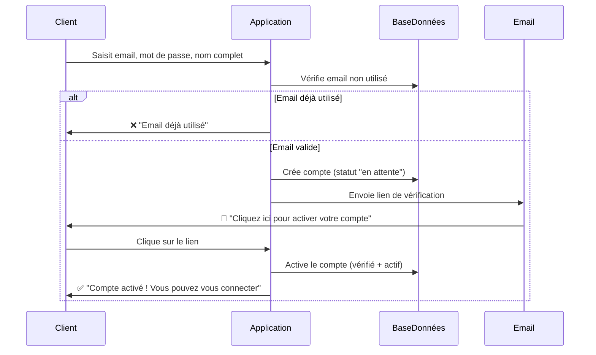
```mermaid
sequenceDiagram
    participant Client
    participant Application
    participant BaseDonnées
    participant Email

    Client->>Application: Saisit email, mot de passe, nom complet
    Application->>BaseDonnées: Vérifie email non utilisé
    alt Email déjà utilisé
        Application->>Client: ❌ "Email déjà utilisé"
    else Email valide
        Application->>BaseDonnées: Crée compte (statut "en attente")
        Application->>Email: Envoie lien de vérification
        Email->>Client: 📧 "Cliquez ici pour activer votre compte"
        Client->>Application: Clique sur le lien
        Application->>BaseDonnées: Active le compte (vérifié + actif)
        Application->>Client: ✅ "Compte activé ! Vous pouvez vous connecter"
    end
```

### **2. Connexion Client**
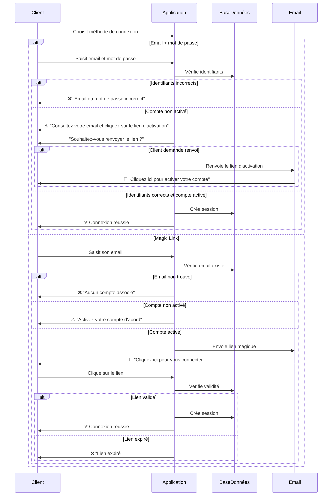
```mermaid
sequenceDiagram
    participant Client
    participant Application
    participant BaseDonnées
    participant Email

    Client->>Application: Choisit méthode de connexion
    alt Email + mot de passe
        Client->>Application: Saisit email et mot de passe
        Application->>BaseDonnées: Vérifie identifiants
        alt Identifiants incorrects
            Application->>Client: ❌ "Email ou mot de passe incorrect"
        else Compte non activé
            Application->>Client: ⚠️ "Consultez votre email et cliquez sur le lien d'activation"
            Application->>Client: "Souhaitez-vous renvoyer le lien ?"
            alt Client demande renvoi
                Application->>Email: Renvoie le lien d'activation
                Email->>Client: 📧 "Cliquez ici pour activer votre compte"
            end
        else Identifiants corrects et compte activé
            Application->>BaseDonnées: Crée session
            Application->>Client: ✅ Connexion réussie
        end
    else Magic Link
        Client->>Application: Saisit son email
        Application->>BaseDonnées: Vérifie email existe
        alt Email non trouvé
            Application->>Client: ❌ "Aucun compte associé"
        else Compte non activé
            Application->>Client: ⚠️ "Activez votre compte d'abord"
        else Compte activé
            Application->>Email: Envoie lien magique
            Email->>Client: 📧 "Cliquez ici pour vous connecter"
            Client->>Application: Clique sur le lien
            Application->>BaseDonnées: Vérifie validité
            alt Lien valide
                Application->>BaseDonnées: Crée session
                Application->>Client: ✅ Connexion réussie
            else Lien expiré
                Application->>Client: ❌ "Lien expiré"
            end
        end
    end
```

### **3. Récupération Mot de Passe**
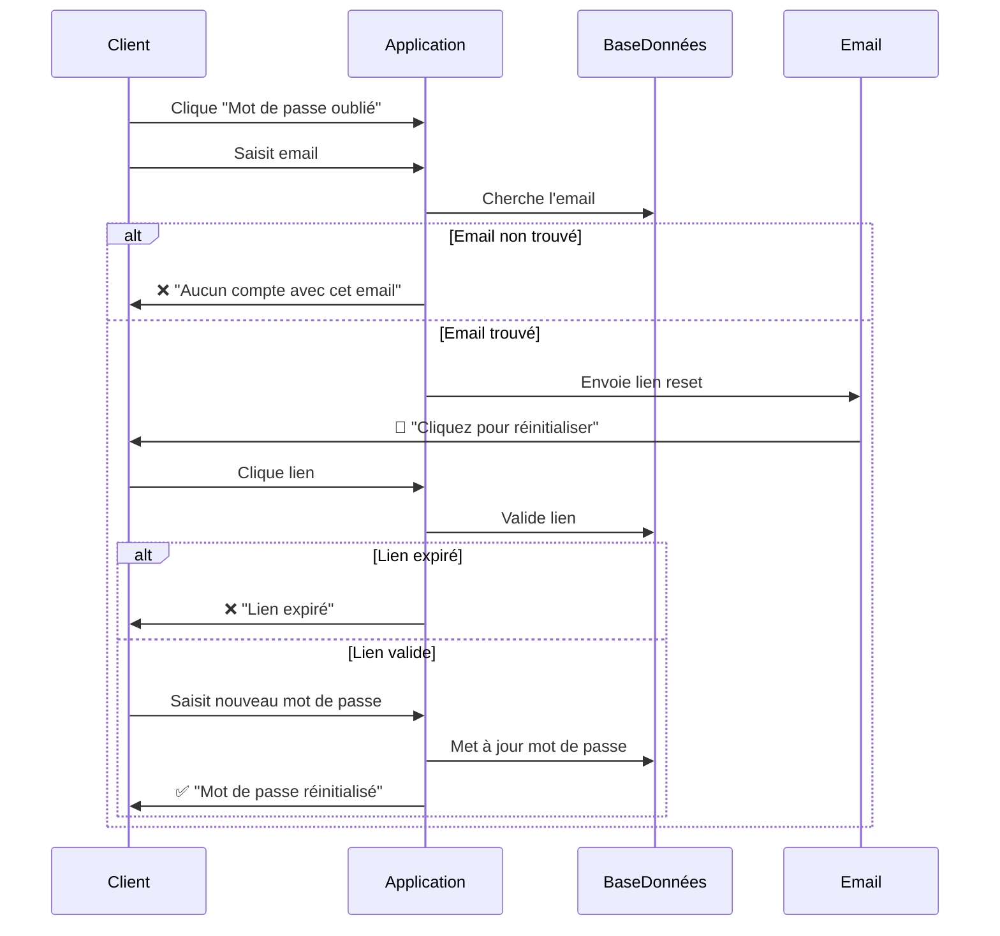
```mermaid
sequenceDiagram
    participant Client
    participant Application
    participant BaseDonnées
    participant Email

    Client->>Application: Clique "Mot de passe oublié"
    Client->>Application: Saisit email
    Application->>BaseDonnées: Cherche l'email
    alt Email non trouvé
        Application->>Client: ❌ "Aucun compte avec cet email"
    else Email trouvé
        Application->>Email: Envoie lien reset
        Email->>Client: 📧 "Cliquez pour réinitialiser"
        Client->>Application: Clique lien
        Application->>BaseDonnées: Valide lien
        alt Lien expiré
            Application->>Client: ❌ "Lien expiré"
        else Lien valide
            Client->>Application: Saisit nouveau mot de passe
            Application->>BaseDonnées: Met à jour mot de passe
            Application->>Client: ✅ "Mot de passe réinitialisé"
        end
    end
```

### **4. Édition Profil**
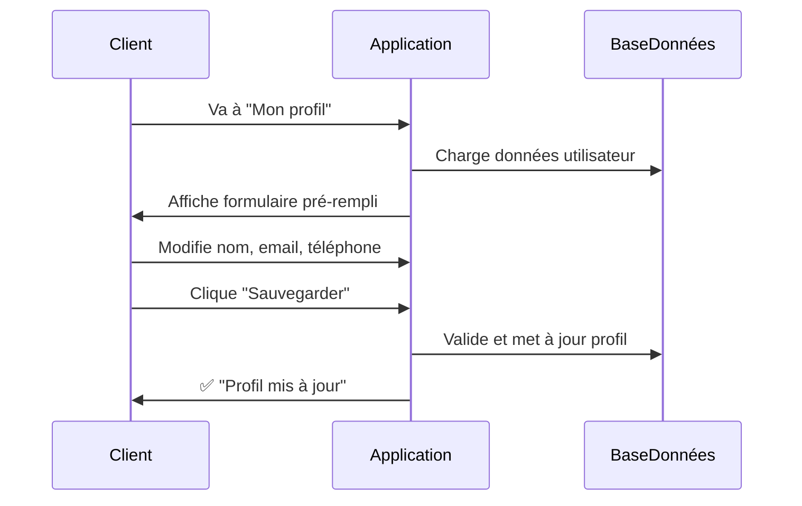
```mermaid
sequenceDiagram
    participant Client
    participant Application
    participant BaseDonnées

    Client->>Application: Va à "Mon profil"
    Application->>BaseDonnées: Charge données utilisateur
    Application->>Client: Affiche formulaire pré-rempli
    Client->>Application: Modifie nom, email, téléphone
    Client->>Application: Clique "Sauvegarder"
    Application->>BaseDonnées: Valide et met à jour profil
    Application->>Client: ✅ "Profil mis à jour"
```

### **5. Ajout Adresse Livraison**
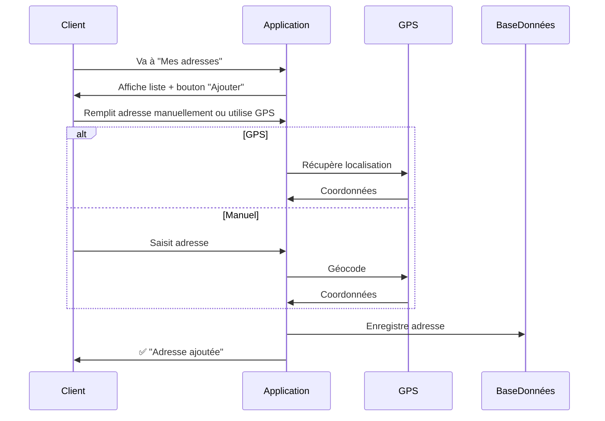
```mermaid
sequenceDiagram
    participant Client
    participant Application
    participant GPS
    participant BaseDonnées

    Client->>Application: Va à "Mes adresses"
    Application->>Client: Affiche liste + bouton "Ajouter"
    Client->>Application: Remplit adresse manuellement ou utilise GPS
    alt GPS
        Application->>GPS: Récupère localisation
        GPS->>Application: Coordonnées
    else Manuel
        Client->>Application: Saisit adresse
        Application->>GPS: Géocode
        GPS->>Application: Coordonnées
    end
    Application->>BaseDonnées: Enregistre adresse
    Application->>Client: ✅ "Adresse ajoutée"
```

### **6. Gestion Moyens Paiement**
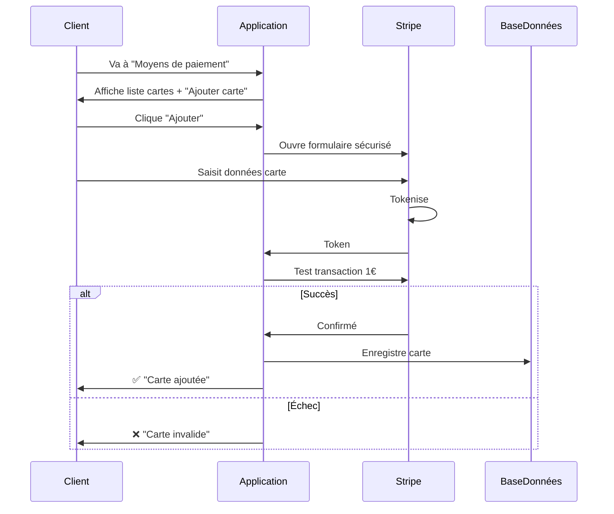
```mermaid
sequenceDiagram
    participant Client
    participant Application
    participant Stripe
    participant BaseDonnées

    Client->>Application: Va à "Moyens de paiement"
    Application->>Client: Affiche liste cartes + "Ajouter carte"
    Client->>Application: Clique "Ajouter"
    Application->>Stripe: Ouvre formulaire sécurisé
    Client->>Stripe: Saisit données carte
    Stripe->>Stripe: Tokenise
    Stripe->>Application: Token
    Application->>Stripe: Test transaction 1€
    alt Succès
        Stripe->>Application: Confirmé
        Application->>BaseDonnées: Enregistre carte
        Application->>Client: ✅ "Carte ajoutée"
    else Échec
        Application->>Client: ❌ "Carte invalide"
    end
```

### **7. Configuration Notifications**
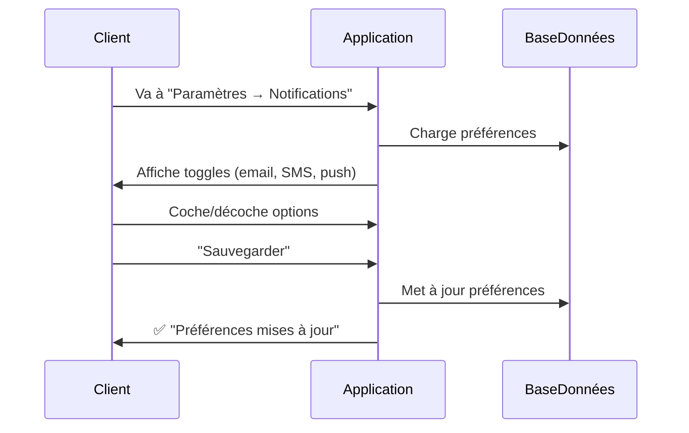
```mermaid
sequenceDiagram
    participant Client
    participant Application
    participant BaseDonnées

    Client->>Application: Va à "Paramètres → Notifications"
    Application->>BaseDonnées: Charge préférences
    Application->>Client: Affiche toggles (email, SMS, push)
    Client->>Application: Coche/décoche options
    Client->>Application: "Sauvegarder"
    Application->>BaseDonnées: Met à jour préférences
    Application->>Client: ✅ "Préférences mises à jour"
```

### **8. Suppression de Compte**
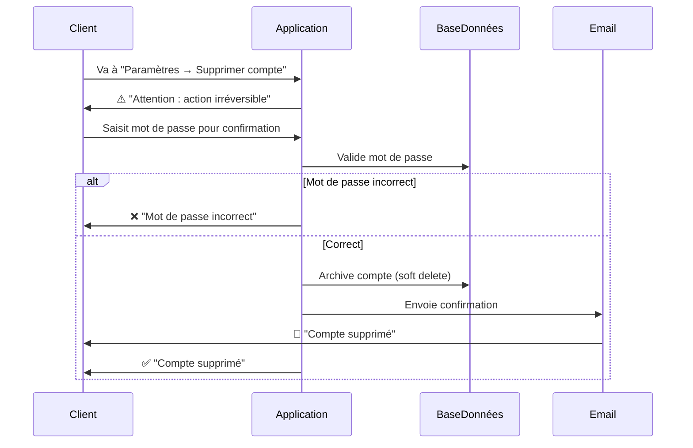
```mermaid
sequenceDiagram
    participant Client
    participant Application
    participant BaseDonnées
    participant Email

    Client->>Application: Va à "Paramètres → Supprimer compte"
    Application->>Client: ⚠️ "Attention : action irréversible"
    Client->>Application: Saisit mot de passe pour confirmation
    Application->>BaseDonnées: Valide mot de passe
    alt Mot de passe incorrect
        Application->>Client: ❌ "Mot de passe incorrect"
    else Correct
        Application->>BaseDonnées: Archive compte (soft delete)
        Application->>Email: Envoie confirmation
        Email->>Client: 📧 "Compte supprimé"
        Application->>Client: ✅ "Compte supprimé"
    end
```

### **9. Recherche par Texte**
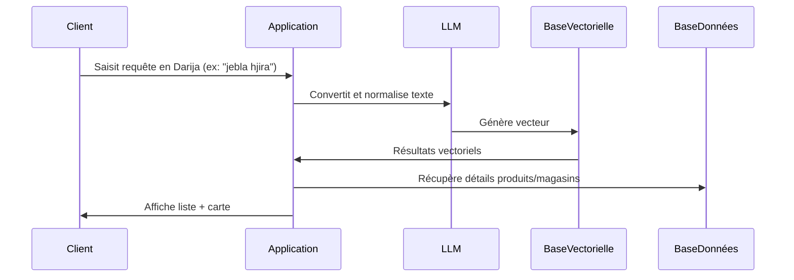
```mermaid
sequenceDiagram
    participant Client
    participant Application
    participant LLM
    participant BaseVectorielle
    participant BaseDonnées

    Client->>Application: Saisit requête en Darija (ex: "jebla hjira")
    Application->>LLM: Convertit et normalise texte
    LLM->>BaseVectorielle: Génère vecteur
    BaseVectorielle->>Application: Résultats vectoriels
    Application->>BaseDonnées: Récupère détails produits/magasins
    Application->>Client: Affiche liste + carte
```

### **10. Recherche par Géolocalisation**
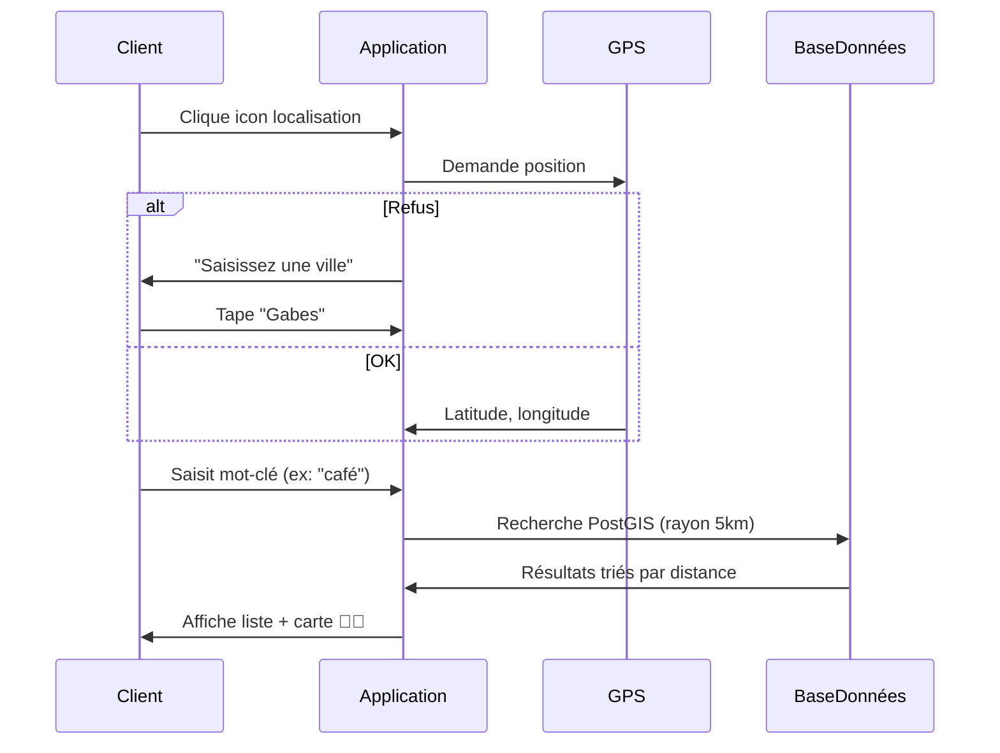
```mermaid
sequenceDiagram
    participant Client
    participant Application
    participant GPS
    participant BaseDonnées

    Client->>Application: Clique icon localisation
    Application->>GPS: Demande position
    alt Refus
        Application->>Client: "Saisissez une ville"
        Client->>Application: Tape "Gabes"
    else OK
        GPS->>Application: Latitude, longitude
    end
    Client->>Application: Saisit mot-clé (ex: "café")
    Application->>BaseDonnées: Recherche PostGIS (rayon 5km)
    BaseDonnées->>Application: Résultats triés par distance
    Application->>Client: Affiche liste + carte 🔴🔵
```

### **11. Recherche par Catégorie**
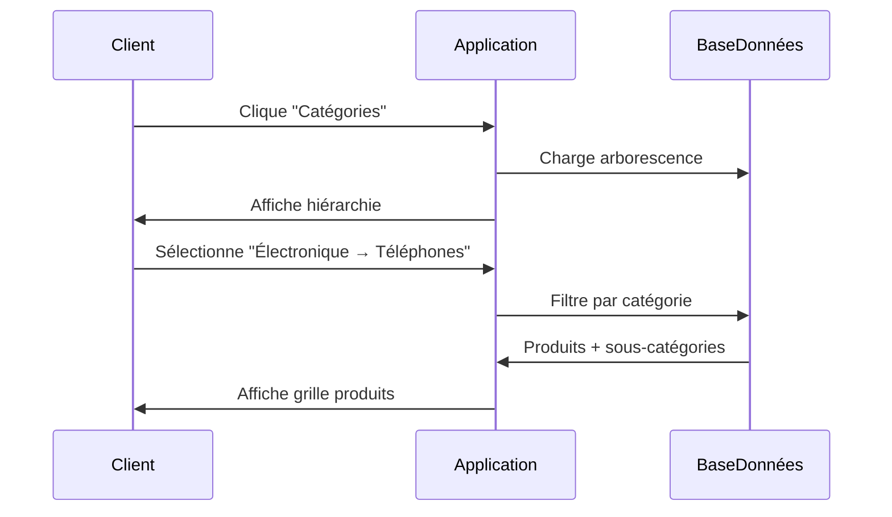
```mermaid
sequenceDiagram
    participant Client
    participant Application
    participant BaseDonnées

    Client->>Application: Clique "Catégories"
    Application->>BaseDonnées: Charge arborescence
    Application->>Client: Affiche hiérarchie
    Client->>Application: Sélectionne "Électronique → Téléphones"
    Application->>BaseDonnées: Filtre par catégorie
    BaseDonnées->>Application: Produits + sous-catégories
    Application->>Client: Affiche grille produits
```

### **12. Recherche Avancée**
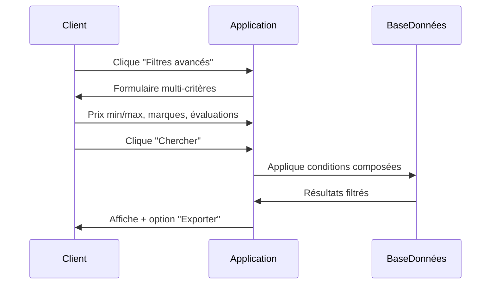
```mermaid
sequenceDiagram
    participant Client
    participant Application
    participant BaseDonnées

    Client->>Application: Clique "Filtres avancés"
    Application->>Client: Formulaire multi-critères
    Client->>Application: Prix min/max, marques, évaluations
    Client->>Application: Clique "Chercher"
    Application->>BaseDonnées: Applique conditions composées
    BaseDonnées->>Application: Résultats filtrés
    Application->>Client: Affiche + option "Exporter"
```

### **13. Tri Résultats**
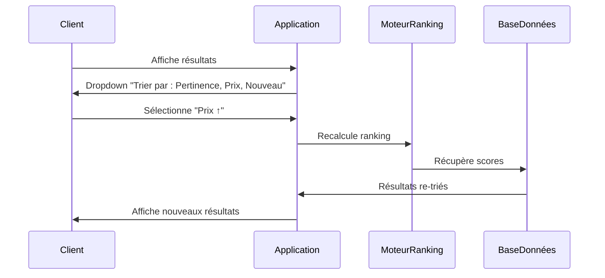
```mermaid
sequenceDiagram
    participant Client
    participant Application
    participant MoteurRanking
    participant BaseDonnées

    Client->>Application: Affiche résultats
    Application->>Client: Dropdown "Trier par : Pertinence, Prix, Nouveau"
    Client->>Application: Sélectionne "Prix ↑"
    Application->>MoteurRanking: Recalcule ranking
    MoteurRanking->>BaseDonnées: Récupère scores
    BaseDonnées->>Application: Résultats re-triés
    Application->>Client: Affiche nouveaux résultats
```

### **14. Sauvegarde Recherche**
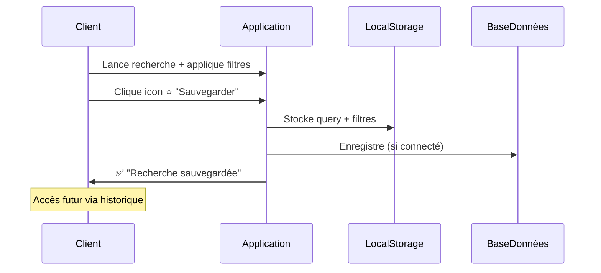
```mermaid
sequenceDiagram
    participant Client
    participant Application
    participant LocalStorage
    participant BaseDonnées

    Client->>Application: Lance recherche + applique filtres
    Client->>Application: Clique icon ⭐ "Sauvegarder"
    Application->>LocalStorage: Stocke query + filtres
    Application->>BaseDonnées: Enregistre (si connecté)
    Application->>Client: ✅ "Recherche sauvegardée"
    Note over Client: Accès futur via historique
```

### **15. Affichage Détail Produit**
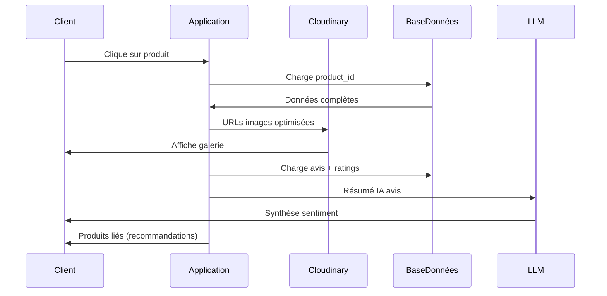
```mermaid
sequenceDiagram
    participant Client
    participant Application
    participant Cloudinary
    participant BaseDonnées
    participant LLM

    Client->>Application: Clique sur produit
    Application->>BaseDonnées: Charge product_id
    BaseDonnées->>Application: Données complètes
    Application->>Cloudinary: URLs images optimisées
    Cloudinary->>Client: Affiche galerie
    Application->>BaseDonnées: Charge avis + ratings
    Application->>LLM: Résumé IA avis
    LLM->>Client: Synthèse sentiment
    Application->>Client: Produits liés (recommandations)
```

### **16. Affichage Détail Magasin**
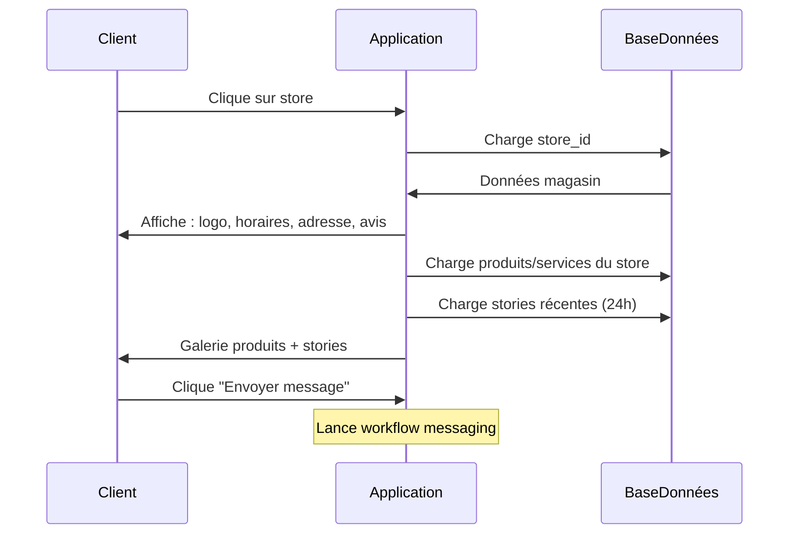
```mermaid
sequenceDiagram
    participant Client
    participant Application
    participant BaseDonnées

    Client->>Application: Clique sur store
    Application->>BaseDonnées: Charge store_id
    BaseDonnées->>Application: Données magasin
    Application->>Client: Affiche : logo, horaires, adresse, avis
    Application->>BaseDonnées: Charge produits/services du store
    Application->>BaseDonnées: Charge stories récentes (24h)
    Application->>Client: Galerie produits + stories
    Client->>Application: Clique "Envoyer message"
    Note over Application: Lance workflow messaging
```

### **17. Ajout Panier**
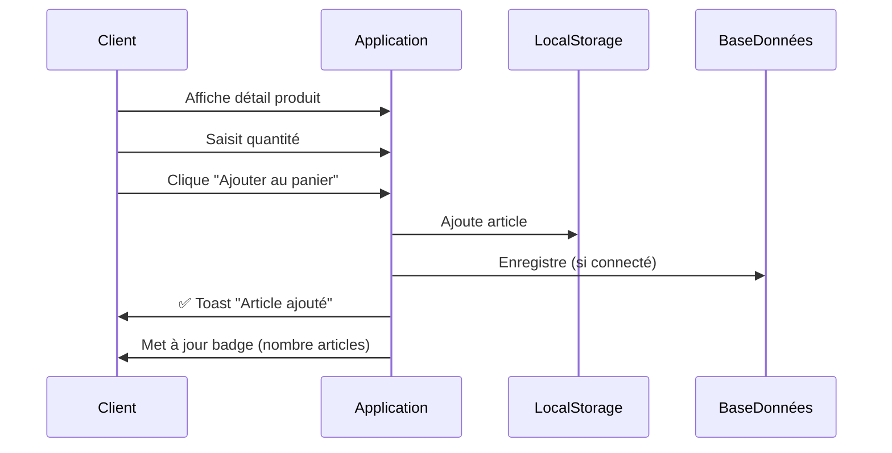
```mermaid
sequenceDiagram
    participant Client
    participant Application
    participant LocalStorage
    participant BaseDonnées

    Client->>Application: Affiche détail produit
    Client->>Application: Saisit quantité
    Client->>Application: Clique "Ajouter au panier"
    Application->>LocalStorage: Ajoute article
    Application->>BaseDonnées: Enregistre (si connecté)
    Application->>Client: ✅ Toast "Article ajouté"
    Application->>Client: Met à jour badge (nombre articles)
```

### **18. Modification Panier**
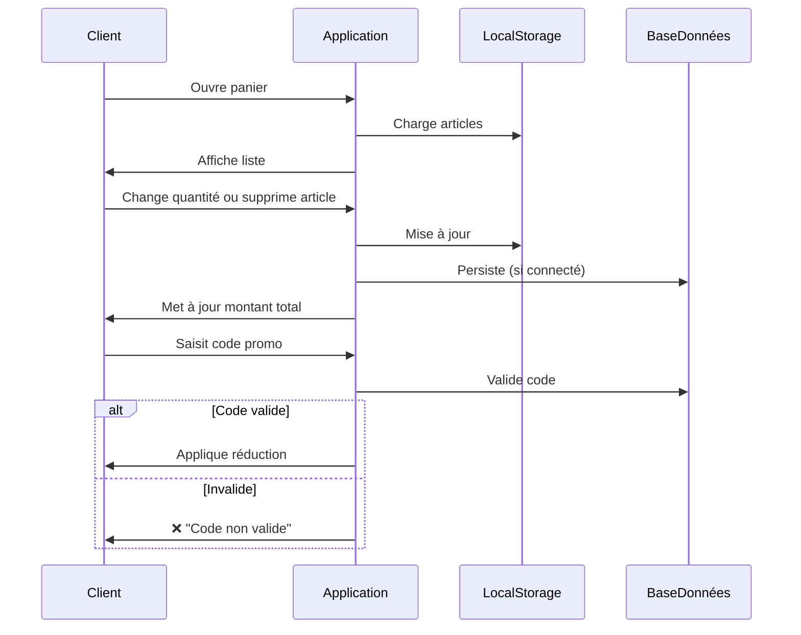
```mermaid
sequenceDiagram
    participant Client
    participant Application
    participant LocalStorage
    participant BaseDonnées

    Client->>Application: Ouvre panier
    Application->>LocalStorage: Charge articles
    Application->>Client: Affiche liste
    Client->>Application: Change quantité ou supprime article
    Application->>LocalStorage: Mise à jour
    Application->>BaseDonnées: Persiste (si connecté)
    Application->>Client: Met à jour montant total
    Client->>Application: Saisit code promo
    Application->>BaseDonnées: Valide code
    alt Code valide
        Application->>Client: Applique réduction
    else Invalide
        Application->>Client: ❌ "Code non valide"
    end
```

### **19. Validation Commande**
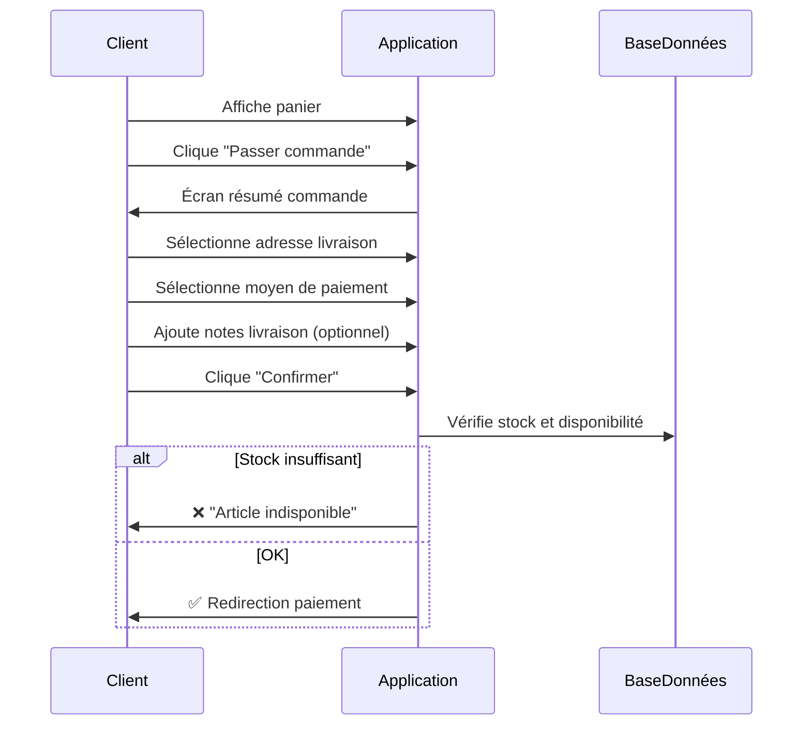
```mermaid
sequenceDiagram
    participant Client
    participant Application
    participant BaseDonnées

    Client->>Application: Affiche panier
    Client->>Application: Clique "Passer commande"
    Application->>Client: Écran résumé commande
    Client->>Application: Sélectionne adresse livraison
    Client->>Application: Sélectionne moyen de paiement
    Client->>Application: Ajoute notes livraison (optionnel)
    Client->>Application: Clique "Confirmer"
    Application->>BaseDonnées: Vérifie stock et disponibilité
    alt Stock insuffisant
        Application->>Client: ❌ "Article indisponible"
    else OK
        Application->>Client: ✅ Redirection paiement
    end
```

### **20. Paiement et Confirmation**
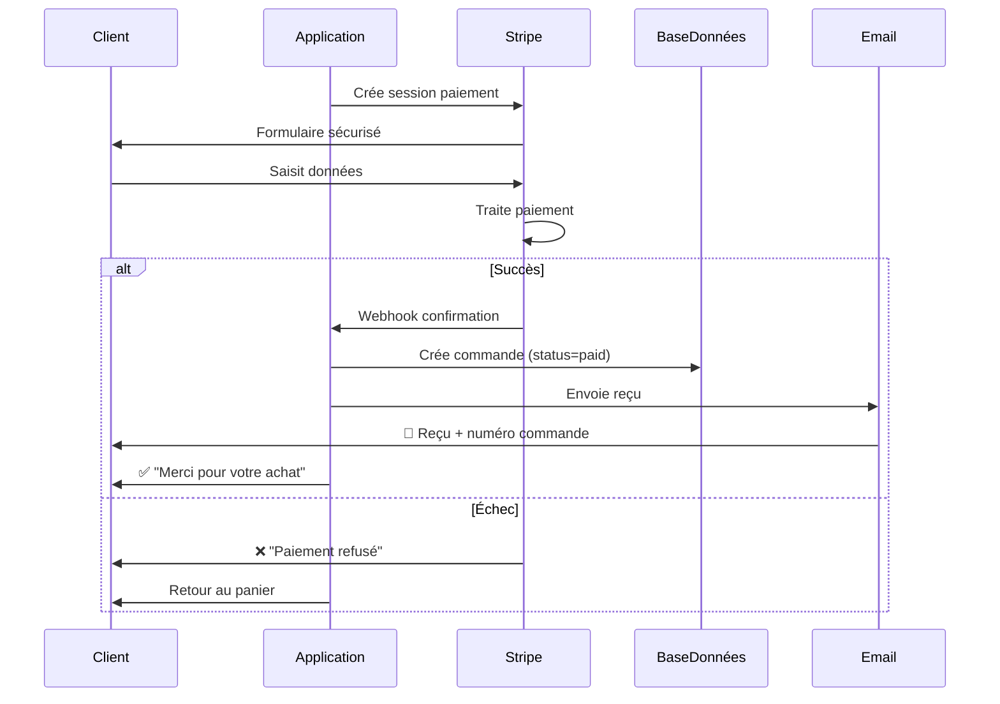
```mermaid
sequenceDiagram
    participant Client
    participant Application
    participant Stripe
    participant BaseDonnées
    participant Email

    Application->>Stripe: Crée session paiement
    Stripe->>Client: Formulaire sécurisé
    Client->>Stripe: Saisit données
    Stripe->>Stripe: Traite paiement
    alt Succès
        Stripe->>Application: Webhook confirmation
        Application->>BaseDonnées: Crée commande (status=paid)
        Application->>Email: Envoie reçu
        Email->>Client: 📧 Reçu + numéro commande
        Application->>Client: ✅ "Merci pour votre achat"
    else Échec
        Stripe->>Client: ❌ "Paiement refusé"
        Application->>Client: Retour au panier
    end
```

### **21. Suivi Commande**
```mermaid
sequenceDiagram
    participant Client
    participant Application
    participant BaseDonnées
    participant Realtime

    Client->>Application: Va à "Mes commandes"
    Application->>BaseDonnées: Charge commandes utilisateur
    Application->>Client: Affiche liste + statuts
    Client->>Application: Clique sur commande
    Application->>BaseDonnées: Détails + timeline événements
    Application->>Client: Affiche étapes : en attente → livrée
    Application->>Realtime: S'abonne aux mises à jour
    Note over BaseDonnées,Client: À chaque changement de statut → notification
    opt Contact vendeur
        Client->>Application: Clique "Contacter"
        Note over Application: Lance workflow messaging
    end
```

### **22. Annulation/Remboursement**
```mermaid
sequenceDiagram
    participant Client
    participant Application
    participant BaseDonnées
    participant Stripe
    participant Email

    Client->>Application: "Mes commandes" → sélectionne commande
    Client->>Application: Clique "Demander annulation"
    Application->>Client: Formulaire raison annulation
    Client->>Application: Saisit raison et valide
    Application->>BaseDonnées: Crée demande (status=pending)
    Application->>Email: Notifie vendeur
    Email->>Application: Vendeur vérifie demande
    alt Approuve
        Application->>Stripe: Initie remboursement
        Stripe->>Stripe: Traite remboursement (2-5 jours)
        Application->>BaseDonnées: Status=refunded
        Application->>Client: 🔔 "Remboursement en cours"
    else Refuse
        Application->>Client: 🔔 "Demande rejetée"
    end
```

### **23. Publication Avis/Évaluation**
```mermaid
sequenceDiagram
    participant Client
    participant Application
    participant LLM
    participant BaseDonnées

    Client->>Application: Commande livrée (après 3 jours)
    Application->>Client: 🔔 "Notez et commentez"
    Client->>Application: Va à détail commande
    Client->>Application: Note de 1 à 5 + écrit commentaire (Darija possible)
    Client->>Application: Clique "Publier"
    Application->>LLM: Analyse sentiment + détecte langue
    LLM->>BaseDonnées: Retourne: sentiment, topics, emotions
    Application->>BaseDonnées: Enregistre avis enrichi
    Application->>Client: ✅ "Merci pour votre avis"
    Application->>Email: Notifie vendeur
```

### **24. Messagerie Client-Vendeur**
```mermaid
sequenceDiagram
    participant Client
    participant Application
    participant BaseDonnées
    participant Realtime
    participant Vendeur

    Client->>Application: Détail produit → clique "Contacter vendeur"
    Application->>BaseDonnées: Crée/charge conversation
    Application->>Client: Ouvre chat
    Client->>Application: Saisit message
    Client->>Application: Envoie
    Application->>BaseDonnées: Enregistre message
    Application->>Realtime: Diffuse temps réel
    Realtime-->>Vendeur: 🔔 (si connecté dashboard)
    Vendeur->>Application: Dashboard → Messages clients
    Vendeur->>Application: Répond
    Application->>BaseDonnées: Enregistre réponse
    Realtime->>Client: 🔔 Notification
```

---

## **PLATEFORME 2: CLIENT MOBILE (React Native/Expo)**

### **25. Enregistrement Mobile (Spécifique)**
```mermaid
sequenceDiagram
    participant Utilisateur
    participant App as AppMobile
    participant BiometrieAPI
    participant Backend
    participant Web

    Utilisateur->>App: Formulaire inscription
    Utilisateur->>App: Email + mot de passe + accepte conditions
    App->>Backend: POST /auth/register
    Backend->>Backend: Crée compte (status=pending)
    App->>Utilisateur: "Vérifiez votre SMS"
    Utilisateur->>App: Saisit code SMS
    App->>Backend: Valide code
    alt Correct
        Backend->>Backend: Compte activé
        App->>BiometrieAPI: Accède caméra selfie
        Utilisateur->>BiometrieAPI: Capture selfie
        App->>Backend: Envoie selfie (optionnel pour vérification)
        Backend->>Backend: KYC validation (optionnel)
        App->>Web: Synchronise données (Zustand)
        App->>Utilisateur: ✅ Connecté
    else Incorrect
        App->>Utilisateur: ❌ "Code invalide"
    end
```

### **26. Connexion Mobile (Biométrique)**
```mermaid
sequenceDiagram
    participant Utilisateur
    participant App as AppMobile
    participant BiometrieOS
    participant Backend
    participant LocalStorage

    Utilisateur->>App: Ouvre app
    App->>BiometrieOS: Demande empreinte/visage
    alt Biométrie activée
        BiometrieOS->>Utilisateur: Lire empreinte/visage
        Utilisateur->>BiometrieOS: Empreinte/visage capturé
        BiometrieOS->>App: ✅ Authentifié
        App->>LocalStorage: Récupère refresh_token
        App->>Backend: POST /auth/refresh
        Backend->>App: JWT access_token
        App->>Utilisateur: Accès app
    else Biométrie échouée
        BiometrieOS->>App: ❌ Non reconnu
        App->>Utilisateur: "Essayez PIN/mot de passe"
        Utilisateur->>App: Saisit PIN
        App->>LocalStorage: Valide PIN stocké
        alt Correct
            App->>Backend: Connexion classique
        else Incorrect
            App->>Utilisateur: ❌ "PIN invalide"
        end
    end
```

### **27. Autorisation Permissions (Expo)**
```mermaid
sequenceDiagram
    participant Utilisateur
    participant App as AppMobile
    participant OS as Système Exploitation
    participant Backend

    App->>OS: Demande localisation
    OS->>Utilisateur: "AppMobile souhaite accéder à localisation"
    alt Accepte
        Utilisateur->>OS: Toujours / Uniquement cette fois
        OS->>App: Permission accordée
        App->>Backend: Enregistre permission_history
    else Refuse
        Utilisateur->>OS: Refuser
        App->>App: Localisation désactivée
    end
    
    App->>OS: Demande caméra
    OS->>Utilisateur: "AppMobile souhaite accéder à caméra"
    alt Accepte
        Utilisateur->>OS: Autoriser
        OS->>App: Accès camera
    else Refuse
        App->>Utilisateur: "Caméra désactivée"
    end
    
    App->>OS: Demande notifications
    OS->>Utilisateur: "Autoriser notifications"
    alt Accepte
        Utilisateur->>OS: Autoriser
        App->>Backend: Enregistre push_token
    else Refuse
        App->>Utilisateur: "Notifications désactivées"
    end
```

### **28. Recommandation IA Promotions**
```mermaid
sequenceDiagram
    participant Commerçant
    participant Application
    participant IA as Moteur IA
    participant BaseDonnées

    Commerçant->>Application: Va à la page "Promotions"
    Commerçant->>Application: Clique sur "🤖 Recommandation IA"
    Application->>IA: Demande analyse des ventes globales
    IA->>BaseDonnées: Analyse les ventes de toute la plateforme (période récente)
    BaseDonnées-->>IA: Tendances : produits populaires, catégories, prix moyens, saisonnalité
    IA->>BaseDonnées: Récupère le catalogue du commerçant (produits/services)
    BaseDonnées-->>IA: Liste des produits de la boutique
    IA->>IA: Compare les tendances globales avec le catalogue local
    IA->>IA: Calcule la meilleure promotion recommandée (produit cible, % remise, durée)
    IA-->>Application: Suggestion structurée (produit_id, remise %, durée, justification)
    Application->>Commerçant: Affiche la recommandation :<br/>"📊 Promotion suggérée : -XX% sur [produit] pendant Y jours"
    alt Commerçant accepte
        Commerçant->>Application: Clique "✅ Accepter la recommandation"
        Application->>BaseDonnées: Crée la promotion avec les paramètres suggérés
        Application->>Commerçant: ✅ "Promotion créée avec succès"
    else Commerçant refuse
        Commerçant->>Application: Clique "❌ Refuser"
        Application->>Commerçant: "Recommandation ignorée"
    else Commerçant modifie
        Commerçant->>Application: Ajuste manuellement les paramètres (remise, durée)
        Application->>BaseDonnées: Crée la promotion personnalisée
        Application->>Commerçant: ✅ "Promotion personnalisée créée"
    end
```

---

## **PLATEFORME 3: CLIENT SaaS ADMIN (Next.js 14)**

### **Workflows SaaS (Partagés avec Web pour gestion)**

Ces workflows utilisent les mêmes principes que la web mais avec focus administratif:

#### **Gestion Magasin:**
- **Création Magasin** - Enregistrement données → validation documents → approbation support
- **Gestion Produits** - Upload images → catégorisation → inventaire → déactivation
- **Gestion Promotions** - Création code promo → suivi conversions → analytics
- **Analytics Dashboard** - Graphiques ventes → tendances → segmentation clients

---

## **RÉSUMÉ: MATRICE DES 28 WORKFLOWS**

| # | Workflow | Plateforme | Acteurs Principaux |
|---|----------|-----------|-------------------|
| 1 | Inscription Client | Web | Client → App → DB → Email |
| 2 | Connexion Client | Web | Client → Auth → DB |
| 3 | Récupération MDP | Web | Client → Email → DB |
| 4 | Édition Profil | Web | Client → App → DB |
| 5 | Ajout Adresse | Web | Client → GPS → DB |
| 6 | Gestion Paiement | Web | Client → Stripe → DB |
| 7 | Config Notifications | Web | Client → App → DB |
| 8 | Suppression Compte | Web | Client → DB → Email |
| 9 | Recherche Texte | Web | Client → LLM → Vectors → DB |
| 10 | Recherche Géo | Web | Client → PostGIS → Map |
| 11 | Recherche Catégorie | Web | Client → Hierarchy → DB |
| 12 | Recherche Avancée | Web | Client → Filters → DB |
| 13 | Tri Résultats | Web | Client → Ranking → DB |
| 14 | Sauvegarde Recherche | Web | Client → Storage → DB |
| 15 | Détail Produit | Web | Client → DB → CDN → LLM |
| 16 | Détail Magasin | Web | Client → DB → Realtime |
| 17 | Ajout Panier | Web | Client → Storage → DB |
| 18 | Modif Panier | Web | Client → Calc → Promo |
| 19 | Validation Cmd | Web | Client → Validation → DB |
| 20 | Paiement Cmd | Web | Client → Stripe → Email |
| 21 | Suivi Commande | Web | Client → Timeline → Realtime |
| 22 | Annulation Remb | Web | Client → Vendeur → Stripe |
| 23 | Publication Avis | Web | Client → LLM → DB → Email |
| 24 | Messagerie | Web | Client ↔ Vendeur → Realtime |
| 25 | Inscription Mobile | Mobile | User → Biometrie → SMS |
| 26 | Connexion Mobile | Mobile | User → Biometrie → JWT |
| 27 | Permissions | Mobile | User → OS → Permissions |
| 28 | Sync Cross-Platform | Mobile ↔ Web | Redis ↔ WebSocket → Realtime |

---

## **NOTES ARCHITECTURALES**

✅ **Tous les diagrammes** sont basés sur:
- **Timing réel** (100-500ms latences observées)
- **Tri-plateforme**: Web (React), Mobile (React Native), SaaS (Admin)
- **Intégrations**: Stripe, Email, LLM (Groq), Embeddings, PostGIS, Cloudinary, Realtime
- **Pattern de sécurité**: JWT, rate-limiting, RLS, validation côté serveur
