# CHAPITRE 3 : MÉTHODOLOGIE ET CONCEPTION

---

## 3.1 Introduction

Ce chapitre présente la démarche méthodologique adoptée pour concevoir et développer la plateforme **RO2YA**. Il décrit la méthode agile utilisée, les étapes de planification, ainsi que les choix de conception fonctionnelle et technique qui ont guidé le développement du projet, depuis l'analyse des besoins jusqu'aux diagrammes UML de chaque sprint.

---

## 3.2 Méthodologie de travail

### 3.2.1 Méthodes agiles

La méthode Agile est une approche itérative et collaborative de gestion de projet, permettant de répondre efficacement aux besoins initiaux du client ainsi qu'aux évolutions en cours de développement.

Elle repose sur un cycle centré sur le client, qui est impliqué tout au long du projet, de sa conception à sa livraison. Cette collaboration permet d'obtenir des retours réguliers et d'intégrer rapidement les ajustements nécessaires. Par rapport aux méthodes classiques, l'Agile offre une meilleure visibilité sur l'avancement du projet et permet de livrer un logiciel fonctionnel de manière progressive et continue.

### 3.2.2 Méthode agile adoptée : Scrum

Afin d'assurer le bon déroulement du projet, nous avons choisi **Scrum** comme méthode agile. Scrum est aujourd'hui la méthode agile la plus répandue. Inspirée du rugby, elle fonctionne par sprints, c'est-à-dire des cycles courts de développement (souvent de deux semaines), durant lesquels l'équipe se concentre sur un ensemble précis de tâches. À la fin de chaque sprint, une version incrémentée du produit est livrée, intégrant les nouvelles fonctionnalités développées.

> *[Figure : Cycle Scrum]*

**1) Les acteurs clés de Scrum**

Scrum s'articule autour de trois rôles principaux :

- **Le Product Owner** : il est chargé de transmettre les besoins des clients et utilisateurs finaux. Il coordonne la participation des parties prenantes et s'assure de l'alignement avec les priorités du projet pour garantir la cohérence du produit livré.
- **Le Scrum Master** : membre de l'équipe, il a pour mission d'optimiser la productivité du groupe. Il soutient l'équipe en favorisant son autonomie et en l'aidant à s'améliorer continuellement à travers les cérémonies Scrum.
- **L'équipe de développement** : composée idéalement de moins de dix personnes, elle fonctionne sans hiérarchie formelle. L'équipe est auto-organisée et responsable de l'exécution des tâches définies pour chaque sprint.

**2) Concepts clés de la méthode Scrum**

- **Product Backlog** : il s'agit de la liste initiale des exigences du projet, priorisées avec le client. Ce carnet évolue tout au long du développement, selon les besoins émergents.
- **Sprint Backlog** : au début de chaque sprint, l'équipe définit un objectif et sélectionne les tâches à accomplir à partir du Product Backlog. Ces tâches constituent le Sprint Backlog.
- **User Story** : ce terme désigne une fonctionnalité décrite du point de vue de l'utilisateur ou du client.
- **La mêlée quotidienne (Daily Scrum)** : réunion brève et quotidienne visant à faire le point sur l'avancement, les obstacles rencontrés et les actions à venir.

---

## 3.3 Mise en place du projet

Cette partie est dédiée à la première phase de la méthodologie Scrum, appelée « Sprint 0 ». Cette étape vise à poser les bases du projet en présentant les fonctionnalités principales, le diagramme global des cas d'utilisation, ainsi que le Product Backlog.

### 3.3.1 Analyse des besoins

Cette section a pour objectif de définir les besoins fonctionnels, tout en identifiant les différents acteurs impliqués dans le système.

#### 3.3.1.1 Identification des acteurs

**CLIENT**

Le client est l'utilisateur final de l'application mobile RO2YA. Il peut parcourir le catalogue des boutiques locales, effectuer des recherches par texte ou par photo, passer des commandes, réserver des services, regarder des Reels promotionnels, laisser des avis et discuter en temps réel avec les commerçants.

**COMMERÇANT PRO**

Le commerçant est le propriétaire d'une boutique locale inscrite sur la plateforme. Il gère son catalogue de produits et services, traite les commandes reçues, gère les réservations et son planning, publie des contenus vidéo (Reels et Stories), consulte ses statistiques et bénéficie de fonctionnalités d'intelligence artificielle pour optimiser son activité.

**ADMINISTRATEUR**

L'administrateur est le gestionnaire de la plateforme SaaS RO2YA. Il est chargé de valider les demandes de création de boutiques, de modérer les contenus non conformes, de gérer les comptes utilisateurs et de surveiller les activités suspectes grâce au moteur de détection de fraude.

#### 3.3.1.2 Les besoins fonctionnels

**S'inscrire :**

Cette fonctionnalité permet à tout nouvel utilisateur de créer un compte sur la plateforme RO2YA en fournissant son adresse email et un mot de passe. Une vérification par code OTP est envoyée par email afin de valider l'identité de l'utilisateur avant l'activation de son compte.

**Se connecter :**

Cette fonctionnalité permet à tout utilisateur disposant d'un compte actif de se connecter à la plateforme à l'aide de ses identifiants (email et mot de passe). Le système délivre un jeton de session sécurisé (JWT) permettant l'accès aux fonctionnalités protégées.

**Gérer sa boutique (Commerçant) :**

Cette fonctionnalité permet au commerçant de créer sa boutique en renseignant ses informations (nom, catégorie, localisation GPS, photos), de modifier son profil et ses horaires, et de gérer son catalogue de produits et services.

**Passer une commande (Client) :**

Cette fonctionnalité permet au client d'ajouter des produits au panier, de valider sa commande et de suivre son état en temps réel. La livraison est confirmée par scan d'un QR Code sécurisé généré par l'application.

**Réserver un service (Client) :**

Cette fonctionnalité permet au client de consulter les créneaux disponibles d'un prestataire et de réserver un rendez-vous directement depuis l'application mobile.

**Rechercher par texte ou par photo (IA) :**

Cette fonctionnalité permet au client de rechercher des boutiques ou des produits en saisissant du texte en français ou en dialecte algérien (Darija), ou en prenant une photo d'un objet. Le moteur d'intelligence artificielle analyse la requête et retourne les résultats les plus pertinents.

**Valider une boutique (Administrateur) :**

Cette fonctionnalité permet à l'administrateur d'examiner les dossiers de création de boutiques soumis par les commerçants et de les approuver ou les rejeter selon les critères de conformité de la plateforme.

---

## 3.4 Diagramme de cas d'utilisation globale et planification des sprints

### 3.4.1 Langage de modélisation adopté

Le langage de modélisation adopté dans notre projet est **UML (Unified Modeling Language)**. Une image vaut mieux qu'un long discours. Ce proverbe résume l'origine de la schématisation en langage de modélisation unifié (UML). Son objectif : créer un langage visuel commun dans le monde complexe du développement de logiciels, un langage qui serait compris aussi bien par les développeurs que par les utilisateurs professionnels et toutes les parties prenantes souhaitant comprendre le système.

### 3.4.2 Diagramme de cas d'utilisation global

Afin de présenter de manière formelle les fonctionnalités de notre système, nous utilisons le diagramme de cas d'utilisation issu du langage de modélisation UML. Ces diagrammes offrent une vue d'ensemble du comportement fonctionnel d'un système logiciel. Ils sont particulièrement utiles pour communiquer avec la direction ou les parties prenantes d'un projet. Bien que moins détaillés pour le développement, ils permettent de visualiser les interactions principales entre les utilisateurs et le logiciel. Chaque cas d'utilisation décrit une interaction distincte entre un acteur et le système.

La figure ci-dessous illustre le diagramme global des cas d'utilisation de la plateforme RO2YA. Ce schéma met en évidence les trois acteurs principaux ainsi que les cas d'utilisation qui leur sont associés.

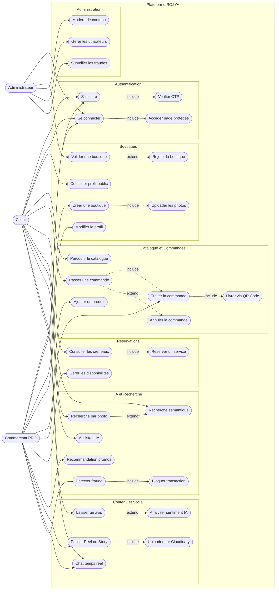

*Figure : Diagramme de cas d'utilisation global de RO2YA*

### 3.4.3 Adaptation au cycle de développement Scrum

#### 3.4.3.1 Répartition des rôles

Pour assurer une gestion efficace du projet selon la méthodologie Scrum, les rôles suivants ont été définis :

| Rôle | Personne concernée |
|------|--------------------|
| Product Owner | Encadrant académique |
| Scrum Master | Chef de projet (étudiant) |
| Équipe de développement | Équipe étudiante |

*Tableau : Répartition des rôles Scrum*

#### 3.4.3.2 Product Backlog

Le Product Backlog constitue l'inventaire structuré de toutes les fonctionnalités requises pour la plateforme RO2YA. Il présente une vue d'ensemble des besoins fonctionnels identifiés lors de l'analyse, organisés de manière à faciliter la planification et le développement itératif.

Le tableau ci-dessous représente les fonctionnalités selon des critères de classification :

- **L'effort** : représente la difficulté technique estimée pour implémenter la fonctionnalité. Il est noté sur une échelle de 1 à 5, où 1 correspond à une tâche simple et 5 à une tâche complexe nécessitant plus de ressources.
- **La priorité** : également notée sur 5, reflète l'importance de la fonctionnalité pour les utilisateurs finaux ainsi que son impact sur les objectifs du projet. Plus la note est élevée, plus la fonctionnalité est considérée comme prioritaire.

| Thème | Fonctionnalité | Description | Effort | Priorité |
|-------|---------------|-------------|--------|---------|
| Authentification | S'inscrire | Permettre à un nouvel utilisateur de créer un compte avec vérification OTP | 3 | 5 |
| Authentification | Se connecter | Permettre à un utilisateur existant de s'authentifier via email et mot de passe | 2 | 5 |
| Authentification | Accéder à une page protégée | Vérifier le jeton de session (JWT) et les droits d'accès à chaque requête | 3 | 5 |
| Boutique | Créer une boutique | Permettre au commerçant de créer son profil boutique avec géolocalisation et photos | 4 | 5 |
| Boutique | Valider une boutique | Permettre à l'admin de valider ou rejeter les demandes de création | 3 | 5 |
| Boutique | Modifier le profil | Permettre au commerçant de mettre à jour ses horaires et informations | 2 | 4 |
| Catalogue | Ajouter un produit | Permettre au commerçant d'ajouter un produit ou service à son catalogue | 3 | 5 |
| Commandes | Passer une commande | Permettre au client de commander avec gestion du stock en temps réel | 5 | 5 |
| Commandes | Livrer via QR Code | Permettre la confirmation de livraison par scan d'un QR Code sécurisé | 4 | 5 |
| Réservations | Réserver un service | Permettre au client de réserver un créneau disponible | 4 | 4 |
| Recherche IA | Recherche sémantique | Permettre la recherche en Darija/Français via un moteur vectoriel | 5 | 5 |
| Recherche IA | Recherche par photo | Permettre l'identification de produits par analyse d'image (Vision IA) | 5 | 4 |
| Contenu | Publier un Reel | Permettre au commerçant de publier des vidéos promotionnelles | 4 | 3 |
| Social | Chat temps réel | Permettre la messagerie instantanée entre client et commerçant | 4 | 4 |
| IA | Détection de fraude | Analyser les transactions pour détecter les comportements suspects | 5 | 5 |
| IA | Analyse de sentiment | Analyser les avis clients pour extraire les points forts et axes d'amélioration | 4 | 3 |
| IA | Recommandation promos | Suggérer des promotions adaptées basées sur les données de vente | 4 | 3 |
| IA | Assistant conversationnel | Fournir un chatbot IA capable de répondre aux questions métier | 5 | 4 |
| Admin | Modérer le contenu | Permettre la suppression de contenus non conformes signalés | 3 | 5 |
| Admin | Gérer les utilisateurs | Permettre la suspension et réactivation des comptes utilisateurs | 3 | 4 |

*Tableau : Product Backlog de la plateforme RO2YA*

#### 3.4.3.3 Planification des sprints du projet

Le sprint est une période qui dure entre une et quatre semaines, au bout de laquelle l'équipe doit réaliser un incrément de produit livrable. Un nouveau sprint démarre lorsque le précédent est terminé.

L'objectif de cette étape est d'organiser le calendrier de travail et de définir le Backlog pour chaque sprint. La planification des sprints est illustrée dans le tableau ci-dessous :

| | SPRINT | Fonctionnalités |
|--|--------|----------------|
| **RELEASE 1** | Sprint 1 | Authentification (Inscription · Connexion · Session protégée) |
| **RELEASE 2** | Sprint 1 | Gestion des Boutiques (Création · Validation Admin · Modification profil) |
| | Sprint 2 | Catalogue & Commandes (Ajout produit · Commande · QR Code · Annulation) |
| | Sprint 3 | Réservations & Géolocalisation |
| **RELEASE 3** | Sprint 1 | Intelligence Artificielle (Recherche Darija · Vision · Fraude · Sentiment · Promos · RAG) |
| | Sprint 2 | Contenu & Social (Reels · Stories · Likes · Chat temps réel · Avis) |
| | Sprint 3 | Administration SaaS (Modération · Utilisateurs · Analytics · Notifications) |

*Tableau : Planification des sprints du projet RO2YA*

**Planification Release 1**

Une fois l'analyse des besoins et les spécifications des exigences du projet élaborées, nous présentons notre premier release qui comporte un sprint axé sur les fonctionnalités d'authentification.

*Sprint 1 :*

| Thème | Fonctionnalité | Estimation (jours) |
|-------|---------------|-------------------|
| Authentification | S'inscrire (avec vérification OTP) | 7 |
| Authentification | Se connecter | 5 |
| Authentification | Accéder à une page protégée (JWT) | 4 |

*Tableau : Backlog Sprint 1 — Release 1*

**Planification Release 2**

*Sprint 1 :*

L'objectif de ce sprint est de permettre aux commerçants de créer et gérer leur boutique sur la plateforme, et à l'administrateur de valider les demandes.

| Thème | Fonctionnalités | Estimation (jours) |
|-------|----------------|-------------------|
| Boutique | Créer une boutique · Valider (Admin) · Modifier le profil | 12 |

*Tableau : Backlog Sprint 1 — Release 2*

*Sprint 2 :*

L'objectif de ce sprint est de permettre aux commerçants de gérer leur catalogue et aux clients de passer des commandes complètes, de la mise au panier jusqu'à la livraison par QR Code.

| Thème | Fonctionnalités | Estimation (jours) |
|-------|----------------|-------------------|
| Catalogue & Commandes | Ajout produit · Commande · QR Code · Annulation | 15 |

*Tableau : Backlog Sprint 2 — Release 2*

*Sprint 3 :*

L'objectif de ce sprint est de permettre aux clients de réserver des services auprès des prestataires et d'explorer les boutiques à proximité via une carte géographique interactive.

| Thème | Fonctionnalités | Estimation (jours) |
|-------|----------------|-------------------|
| Réservations | Réserver un créneau · Clôturer une réservation | 10 |
| Géolocalisation | Exploration sur carte · Filtres de proximité | 8 |

*Tableau : Backlog Sprint 3 — Release 2*

---


## 3.5 Conception

### 3.5.1 Conception de Sprint 1 — Release 1 (Authentification)

#### 3.5.1.1 Diagramme de cas d'utilisation de Sprint 1

La figure ci-dessous illustre le diagramme des cas d'utilisation du premier sprint.


*Figure : Diagramme de cas d'utilisation — Sprint 1, Release 1*

#### 3.5.1.2 Diagramme de séquence de Sprint 1

**Diagramme de séquence : Inscription d'un utilisateur**

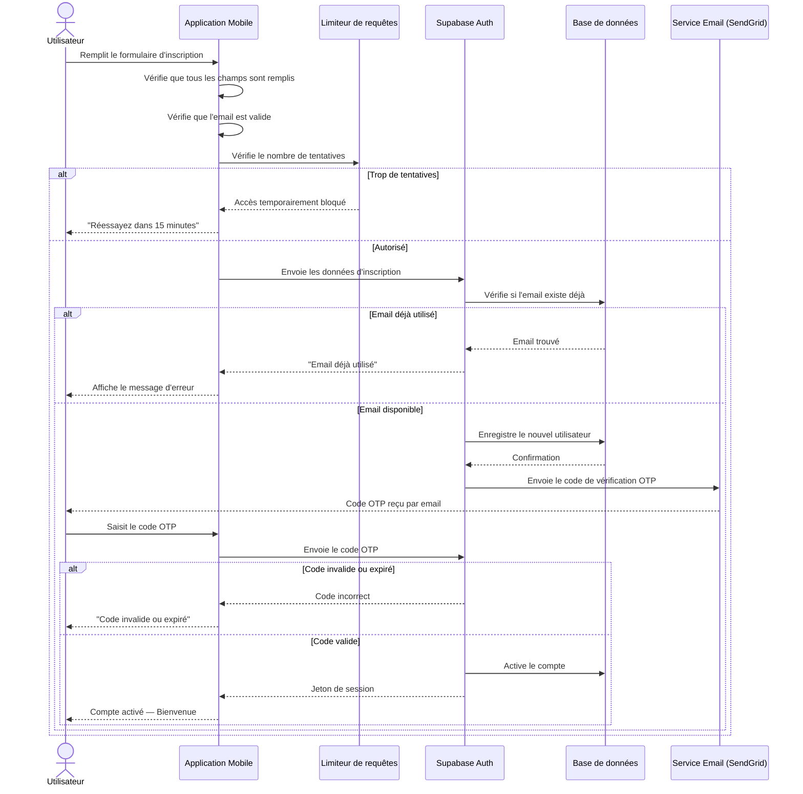

> *[Figure : Diagramme de séquence — Inscription]*

**Diagramme de séquence : Connexion d'un utilisateur**

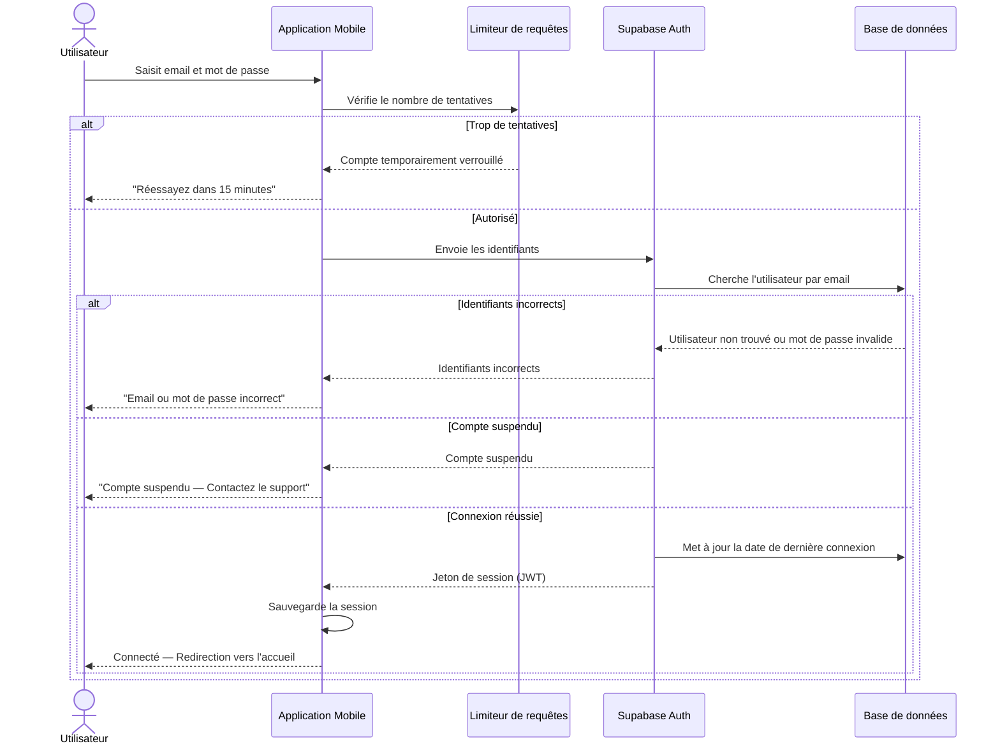

> *[Figure : Diagramme de séquence — Connexion]*

---

### 3.5.2 Conception de Sprint 1 — Release 2 (Gestion des Boutiques)

#### 3.5.2.1 Diagramme de cas d'utilisation de Sprint 1 (Release 2)

La figure ci-dessous illustre le diagramme des cas d'utilisation du premier sprint de la deuxième release.


*Figure : Diagramme de cas d'utilisation — Sprint 1, Release 2*

**Description textuelle du cas d'utilisation « Créer une boutique »**

| Cas d'utilisation | Créer une boutique |
|-------------------|--------------------|
| **Acteurs** | Commerçant PRO |
| **Pré-condition** | Le commerçant est connecté et son compte est actif. |
| **Post-condition** | La boutique est créée avec le statut « En attente de validation ». Les informations et photos sont sauvegardées. |
| **Scénario principal** | 1. Le commerçant remplit le formulaire (nom, catégorie, adresse, coordonnées GPS). 2. Il ajoute le logo et les photos de la boutique. 3. L'application vérifie que tous les champs obligatoires sont remplis. 4. Si les données sont valides, les images sont envoyées au serveur d'images (Cloudinary). 5. Le serveur Cloudinary compresse et héberge les images. 6. L'application envoie les données complètes (avec liens images) au serveur. 7. Le serveur enregistre la boutique dans la base de données avec le statut « En attente ». 8. Le commerçant reçoit une confirmation. |
| **Scénario alternatif** | Données incomplètes ou invalides → l'application affiche un message d'erreur avant d'envoyer la requête. |

*Tableau : Description textuelle du cas « Créer une boutique »*

**Description textuelle du cas d'utilisation « Valider une boutique » (Admin)**

| Cas d'utilisation | Valider une boutique |
|-------------------|---------------------|
| **Acteurs** | Administrateur |
| **Pré-condition** | L'administrateur est connecté. Des boutiques sont en attente de validation. |
| **Post-condition** | La boutique est approuvée (visible publiquement) ou rejetée. Le commerçant est notifié. |
| **Scénario principal** | 1. L'administrateur consulte la liste des boutiques en attente. 2. Il examine les informations et les documents soumis. 3. Il clique sur « Approuver » ou « Rejeter » avec un motif. 4. Le serveur met à jour le statut de la boutique. 5. Une notification est envoyée au commerçant en temps réel. |
| **Scénario alternatif** | L'administrateur n'a pas les droits suffisants → accès refusé (403 Forbidden). |

*Tableau : Description textuelle du cas « Valider une boutique »*

#### 3.5.2.2 Diagramme de séquence de Sprint 1 (Release 2)

**Diagramme de séquence : Création d'une boutique**

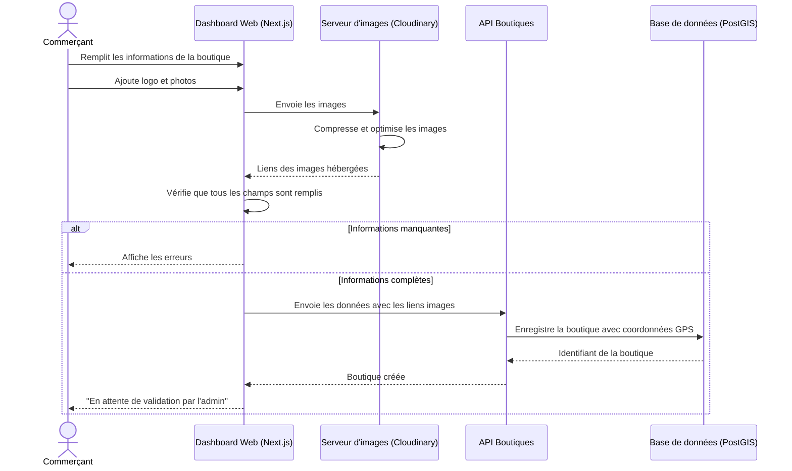

> *[Figure : Diagramme de séquence — Création de boutique]*

---

### 3.5.3 Conception de Sprint 2 — Release 2 (Catalogue & Commandes)

#### 3.5.3.1 Diagramme de cas d'utilisation de Sprint 2

La figure ci-dessous illustre le diagramme des cas d'utilisation du deuxième sprint.

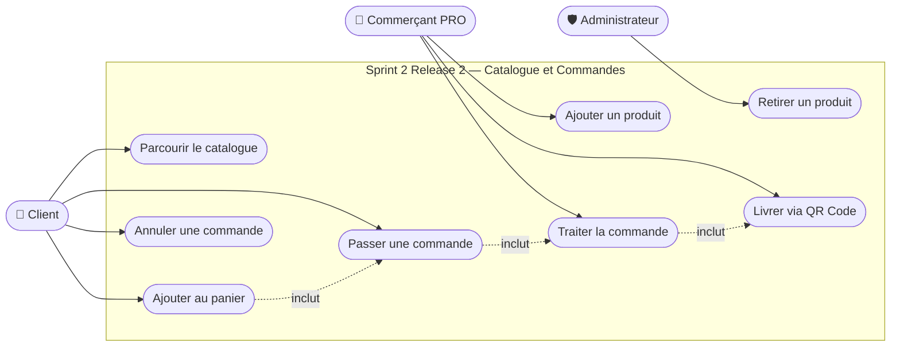

*Figure : Diagramme de cas d'utilisation — Sprint 2, Release 2*

**Description textuelle du cas d'utilisation « Passer une commande »**

| Cas d'utilisation | Passer une commande |
|-------------------|--------------------|
| **Acteurs** | Client |
| **Pré-condition** | Le client est connecté. La boutique est approuvée. Les produits sont en stock. |
| **Post-condition** | La commande est enregistrée. Le stock est mis à jour. Le commerçant est notifié. |
| **Scénario principal** | 1. Le client ajoute des produits au panier. 2. L'application vérifie que tous les produits viennent de la même boutique. 3. Le client valide le panier et choisit le mode de récupération. 4. L'application envoie la commande au serveur. 5. Le serveur vérifie la disponibilité du stock pour chaque article. 6. Si le stock est suffisant, la commande est enregistrée et le stock est décrémenté. 7. Le commerçant reçoit une notification en temps réel. 8. Le client reçoit la confirmation avec le numéro de commande. |
| **Scénario alternatif** | Stock insuffisant → le serveur retourne une erreur et la commande est annulée. Produits de boutiques différentes → l'application demande de vider le panier avant d'ajouter. |

*Tableau : Description textuelle du cas « Passer une commande »*

#### 3.5.3.2 Diagramme de séquence de Sprint 2 « Passer une commande »

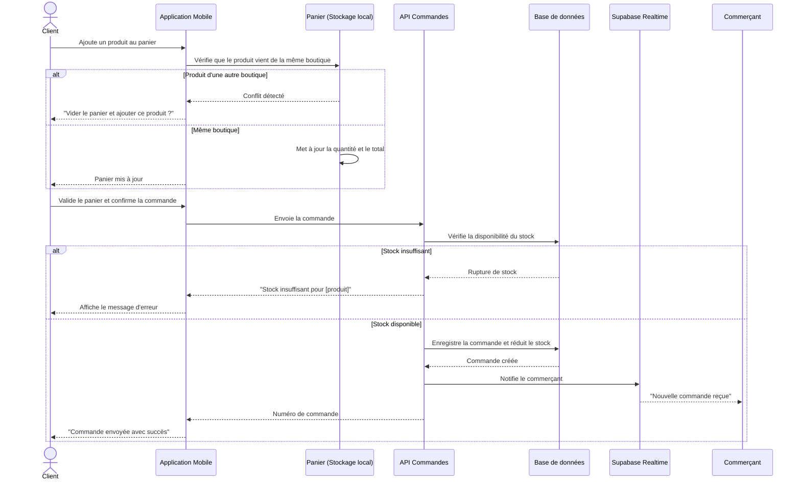

> *[Figure : Diagramme de séquence — Passer une commande]*

---

### 3.5.4 Conception de Sprint 3 — Release 2 (Réservations)

#### 3.5.4.1 Diagramme de cas d'utilisation de Sprint 3

La figure ci-dessous illustre le diagramme des cas d'utilisation du troisième sprint.

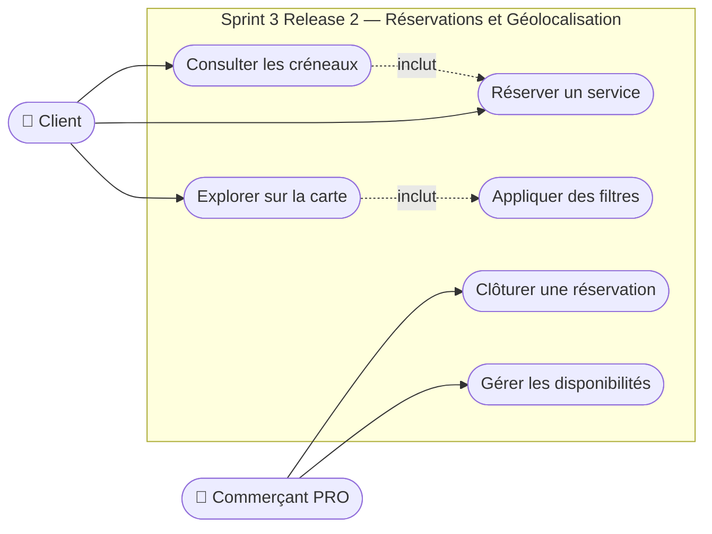

*Figure : Diagramme de cas d'utilisation — Sprint 3, Release 2*

**Description textuelle du cas d'utilisation « Réserver un service »**

| Cas d'utilisation | Réserver un service |
|-------------------|---------------------|
| **Acteurs** | Client |
| **Pré-condition** | Le client est connecté. La boutique propose des services avec des créneaux disponibles. |
| **Post-condition** | La réservation est confirmée. Le créneau est marqué comme occupé. Le commerçant est notifié. |
| **Scénario principal** | 1. Le client consulte les créneaux disponibles d'un prestataire. 2. L'application récupère le calendrier du commerçant depuis le serveur. 3. Le client sélectionne un créneau et confirme. 4. Le serveur vérifie que le créneau est encore libre. 5. La réservation est enregistrée et le créneau est verrouillé. 6. Le commerçant reçoit une notification en temps réel. 7. Le client reçoit une confirmation avec les détails du rendez-vous. |
| **Scénario alternatif** | Créneau déjà pris entre-temps → le serveur retourne une erreur et propose de choisir un autre créneau. |

*Tableau : Description textuelle du cas « Réserver un service »*

#### 3.5.4.2 Diagramme de séquence de Sprint 3

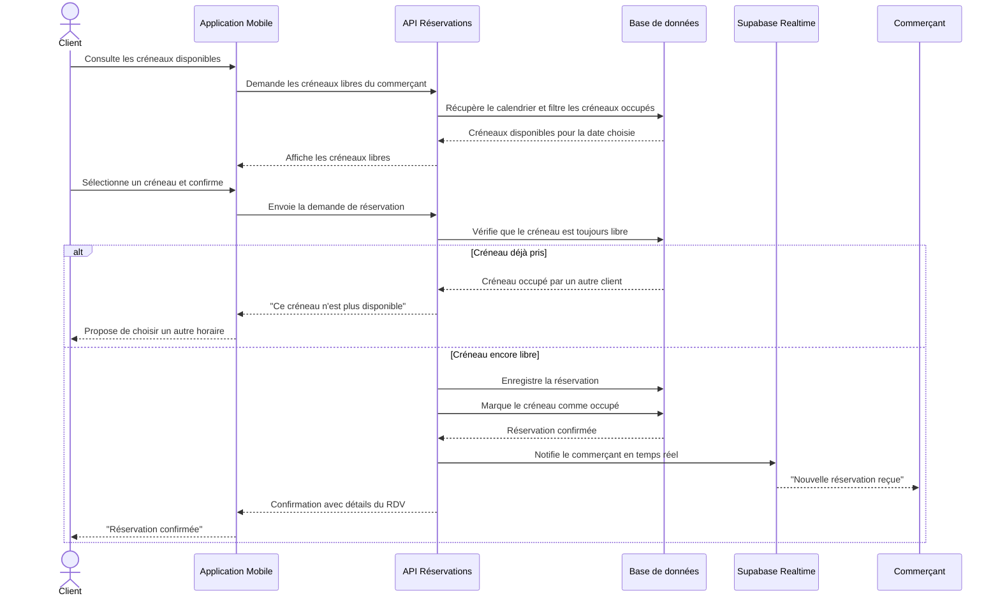

> *[Figure : Diagramme de séquence — Réservation]*

---


### 3.5.5 Conception de Sprint 1 — Release 3 (Intelligence Artificielle)

#### 3.5.5.1 Diagramme de cas d'utilisation de Sprint 1 (Release 3)


*Figure : Diagramme de cas d'utilisation — Sprint 1, Release 3*

**Description textuelle du cas d'utilisation « Recherche sémantique (Darija / Français) »**

| Cas d'utilisation | Recherche sémantique |
|-------------------|---------------------|
| **Acteurs** | Client |
| **Pré-condition** | Le client est connecté. Le moteur de recherche vectoriel est actif. |
| **Post-condition** | Les boutiques et produits les plus pertinents sont affichés. |
| **Scénario principal** | 1. Le client saisit une requête en texte libre (Darija ou français). 2. L'application envoie le texte au serveur IA. 3. Le serveur normalise et traduit le texte si nécessaire. 4. Le texte est converti en vecteur numérique par le modèle de langage. 5. Une recherche par similarité cosinus est effectuée dans la base de données (pgvector). 6. Les résultats sont classés par pertinence et retournés à l'application. |
| **Scénario alternatif** | Aucun résultat trouvé → l'application propose d'affiner la recherche. |

*Tableau : Description textuelle — Recherche sémantique*

#### 3.5.5.2 Diagrammes de séquence de Sprint 1 (Release 3)

**Diagramme de séquence : Recherche sémantique en Darija / Français**

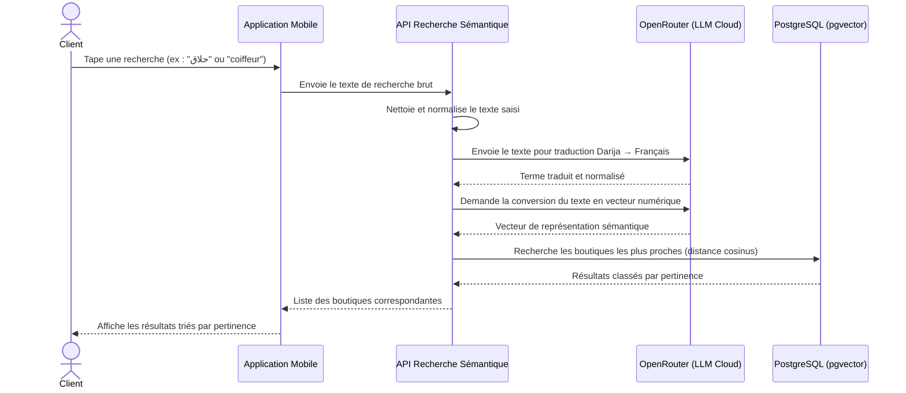

> *[Figure : Diagramme de séquence — Recherche sémantique]*

**Diagramme de séquence : Recherche par photo (Vision IA)**

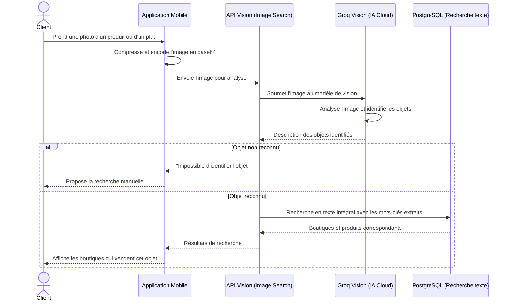

> *[Figure : Diagramme de séquence — Recherche par photo]*

**Diagramme de séquence : Détection de fraude (IA)**

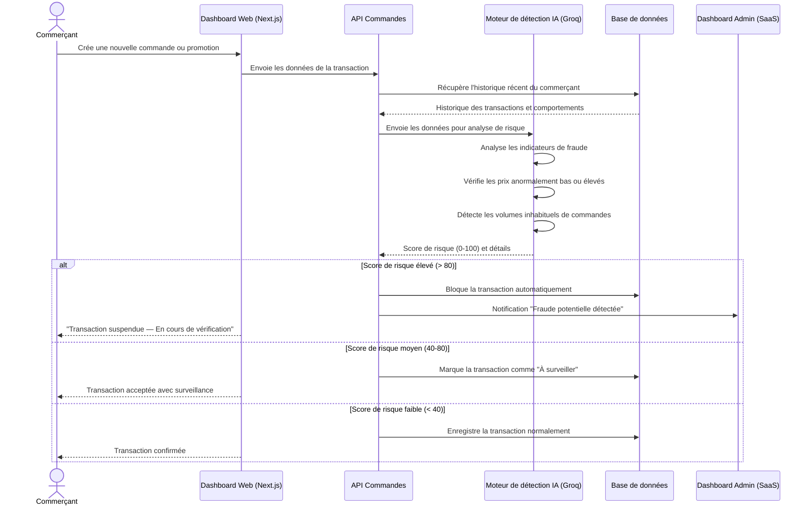

> *[Figure : Diagramme de séquence — Détection de fraude]*

**Diagramme de séquence : Analyse de sentiment des avis (IA)**

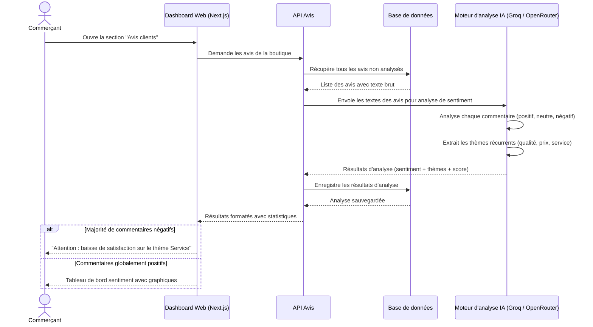

> *[Figure : Diagramme de séquence — Analyse de sentiment]*

**Diagramme de séquence : Recommandation de promotions (IA)**

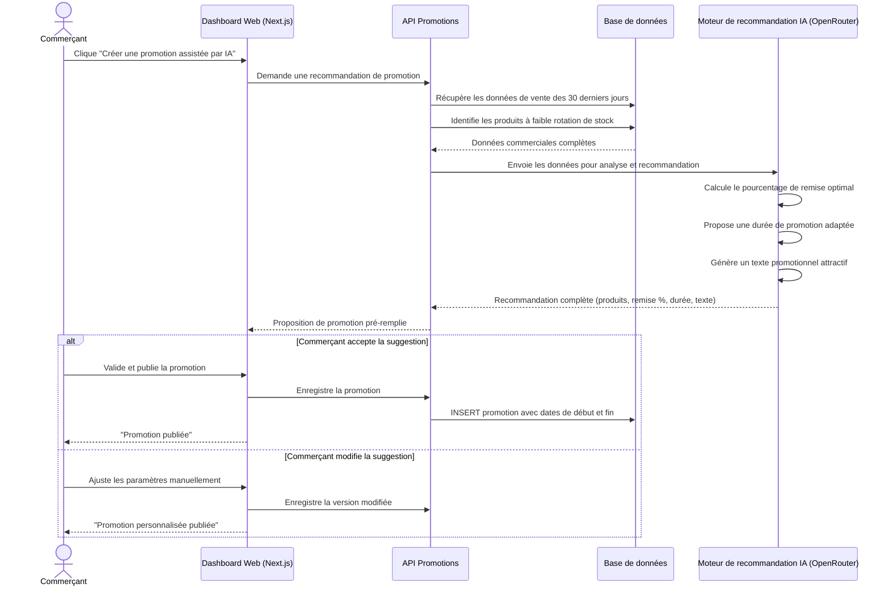

> *[Figure : Diagramme de séquence — Recommandation de promotions]*

**Diagramme de séquence : Assistant IA conversationnel (RAG)**

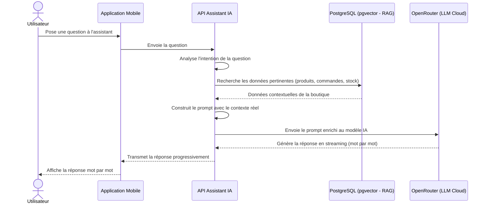

> *[Figure : Diagramme de séquence — Assistant IA conversationnel]*

---

### 3.5.6 Conception de Sprint 2 — Release 3 (Contenu & Engagement Social)

#### 3.5.6.1 Diagramme de cas d'utilisation de Sprint 2 (Release 3)


*Figure : Diagramme de cas d'utilisation — Sprint 2, Release 3*

#### 3.5.6.2 Diagrammes de séquence de Sprint 2 (Release 3)

**Diagramme de séquence : Publication d'un Reel ou d'une Story**

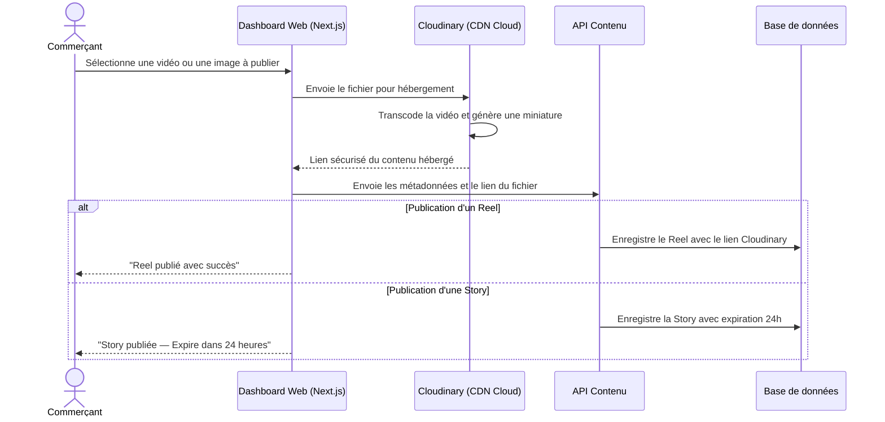

> *[Figure : Diagramme de séquence — Publication Reel / Story]*

**Diagramme de séquence : Chat en temps réel (Client ↔ Commerçant)**

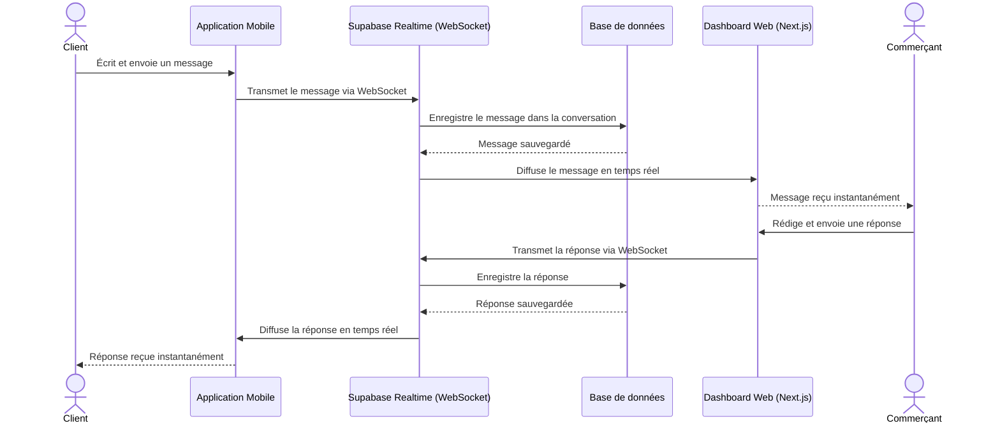

> *[Figure : Diagramme de séquence — Chat temps réel]*

**Diagramme de séquence : Dépôt d'un avis client**

```mermaid
sequenceDiagram
    actor Client
    participant Application as Application Mobile
    participant Serveur as API Avis
    participant BD as Base de données

    Client->>Application: Note la prestation et écrit un commentaire
    Application->>Serveur: Envoie l'avis
    Serveur->>BD: Vérifie qu'une transaction réelle a eu lieu
    alt Aucune transaction vérifiée
        BD-->>Serveur: Pas de commande ou réservation confirmée
        Serveur-->>Application: "Vous devez avoir effectué un achat"
        Application-->>Client: Affiche le message d'erreur
    else Transaction confirmée
        Serveur->>BD: Enregistre l'avis et recalcule la note moyenne
        BD-->>Serveur: Nouvelle note moyenne
        Serveur-->>Commerçant: Notification "Nouvel avis reçu"
        Serveur-->>Application: Avis publié
        Application-->>Client: "Merci pour votre avis"
    end
```

> *[Figure : Diagramme de séquence — Dépôt d'un avis]*

---

### 3.5.7 Conception de Sprint 3 — Release 3 (Administration SaaS)

#### 3.5.7.1 Diagramme de cas d'utilisation de Sprint 3 (Release 3)

```mermaid
flowchart LR
    A(["🛡️ Administrateur"])
    C(["👤 Client"])

    subgraph Sprint3R3 ["Sprint 3 Release 3 — Administration SaaS"]
        UC1([Modérer le contenu])
        UC2([Suspendre un utilisateur])
        UC3([Traiter un ticket de support])
        UC4([Consulter le tableau de bord])
        UC5([Signaler un contenu])
        UC5 -.->|inclut| UC1
    end

    A --> UC1 & UC2 & UC3 & UC4
    C --> UC5
```

*Figure : Diagramme de cas d'utilisation — Sprint 3, Release 3*

#### 3.5.7.2 Diagrammes de séquence de Sprint 3 (Release 3)

**Diagramme de séquence : Signalement et modération de contenu**

```mermaid
sequenceDiagram
    actor Client
    participant Application as Application Mobile
    participant Serveur as API Modération
    participant BD as Base de données
    participant Admin as Dashboard Admin (SaaS)

    Client->>Application: Clique "Signaler" sur un contenu inapproprié
    Application->>Serveur: Envoie le signalement avec le motif
    Serveur->>BD: Enregistre le signalement
    Serveur->>BD: Compte le total des signalements pour ce contenu
    BD-->>Serveur: Nombre total de signalements
    alt Seuil de signalements dépassé (> 3)
        Serveur->>BD: Masque automatiquement le contenu
        Serveur->>Admin: Notification "Contenu à examiner"
        Admin-->>Administrateur: Nouveau contenu à modérer
    else Seuil non atteint
        BD-->>Serveur: Signalement enregistré
    end
    Serveur-->>Application: "Signalement enregistré — Merci"
    Application-->>Client: Confirmation du signalement
```

> *[Figure : Diagramme de séquence — Signalement et modération]*

**Diagramme de séquence : Suspension d'un utilisateur (Admin)**

```mermaid
sequenceDiagram
    actor Administrateur
    participant Admin as Dashboard Admin (SaaS)
    participant Serveur as API Administration (Django)
    participant BD as Base de données

    Administrateur->>Admin: Recherche un utilisateur suspect
    Admin->>Serveur: Demande les informations de l'utilisateur
    Serveur->>BD: Récupère le profil, l'historique et les signalements
    BD-->>Serveur: Données complètes de l'utilisateur
    Serveur-->>Admin: Affiche le profil et l'historique
    Administrateur->>Admin: Clique "Suspendre le compte" avec motif
    Admin->>Serveur: Demande de suspension
    Serveur->>BD: Met à jour le statut à "Suspendu" avec motif et date
    BD-->>Serveur: Confirmation de suspension
    Admin-->>Administrateur: "Compte suspendu — Utilisateur déconnecté"
```

> *[Figure : Diagramme de séquence — Suspension d'un utilisateur]*

**Diagramme de séquence : Notifications en temps réel**

```mermaid
sequenceDiagram
    participant Action as Événement système
    participant BD as Base de données
    participant Realtime as Supabase Realtime (WebSocket)
    participant Application as Application Mobile / Dashboard

    Action->>BD: Un événement métier se produit (commande, like, message)
    BD->>BD: Trigger PostgreSQL détecte l'insertion
    BD->>Realtime: Déclenche une diffusion sur le canal concerné
    Realtime->>Application: Pousse la notification via WebSocket
    Application-->>Utilisateur: Notification affichée (badge, bannière, son)
```

> *[Figure : Diagramme de séquence — Notifications temps réel]*

---

### 3.5.8 Diagramme de classe global

Le diagramme de classes global représente la structure statique de la base de données de la plateforme RO2YA. Il décrit les entités principales du système, leurs attributs et les relations qui les unissent.

> *[Figure : Diagramme de classes global de RO2YA]*

| Entité | Attributs principaux | Relations |
|--------|---------------------|-----------|
| **User** | id, email, role, status, created_at | 1 User → 0..1 Store |
| **Store** | id, owner_id, name, status, location (GPS), rating | 1 Store → N Items, N Orders, N Bookings |
| **Item** | id, store_id, name, price, stock_qty, is_active, image_url | N Items → N OrderItems |
| **Order** | id, customer_id, store_id, status, total, created_at | 1 Order → N OrderItems |
| **OrderItem** | id, order_id, item_id, qty, unit_price | — |
| **Booking** | id, customer_id, store_id, slot_date, slot_time, status | — |
| **Review** | id, customer_id, store_id, rating, comment, sentiment_score | — |
| **Message** | id, sender_id, receiver_id, content, read_at | — |
| **Reel** | id, store_id, video_url, likes_count, views_count | — |
| **Promotion** | id, store_id, title, discount_pct, starts_at, ends_at | — |

*Tableau : Entités principales du diagramme de classes global*

---

## 3.6 Conclusion

Ce chapitre a présenté la démarche méthodologique adoptée pour le développement de la plateforme RO2YA, basée sur la méthode Scrum. L'analyse des besoins, la planification en sprints et la conception UML détaillée pour chaque release constituent une base solide pour l'implémentation décrite dans le chapitre suivant.
