# CHAPITRE 3 : MÉTHODOLOGIE ET CONCEPTION

---

## 3.1 Introduction

Ce chapitre présente la démarche méthodologique adoptée pour concevoir et développer la plateforme **RO2YA**. Il décrit la méthode agile utilisée, les étapes de planification, ainsi que les choix de conception fonctionnelle et technique qui ont guidé le développement du projet, depuis l'analyse des besoins jusqu'aux diagrammes UML de chaque sprint.

---

## 3.2 Méthodologie de travail

### 3.2.1 Méthodes agiles

La méthode Agile est une approche itérative et collaborative de gestion de projet, permettant de répondre efficacement aux besoins initiaux du client ainsi qu'aux évolutions en cours de développement.

Elle repose sur un cycle centré sur le client, qui est impliqué tout au long du projet, de sa conception à sa livraison. Cette collaboration permet d'obtenir des retours réguliers et d'intégrer rapidement les ajustements nécessaires. Par rapport aux méthodes classiques, l'Agile offre une meilleure visibilité sur l'avancement du projet et permet de livrer un logiciel fonctionnel de manière progressive et continue.

### 3.2.2 Méthode agile adoptée : Scrum

Afin d'assurer le bon déroulement du projet, nous avons choisi **Scrum** comme méthode agile. Scrum est aujourd'hui la méthode agile la plus répandue. Inspirée du rugby, elle fonctionne par sprints, c'est-à-dire des cycles courts de développement (souvent de deux semaines), durant lesquels l'équipe se concentre sur un ensemble précis de tâches. À la fin de chaque sprint, une version incrémentée du produit est livrée, intégrant les nouvelles fonctionnalités développées.

> *[Figure : Cycle Scrum]*

**1) Les acteurs clés de Scrum**

Scrum s'articule autour de trois rôles principaux :

- **Le Product Owner** : il est chargé de transmettre les besoins des clients et utilisateurs finaux. Il coordonne la participation des parties prenantes et s'assure de l'alignement avec les priorités du projet pour garantir la cohérence du produit livré.
- **Le Scrum Master** : membre de l'équipe, il a pour mission d'optimiser la productivité du groupe. Il soutient l'équipe en favorisant son autonomie et en l'aidant à s'améliorer continuellement à travers les cérémonies Scrum.
- **L'équipe de développement** : composée idéalement de moins de dix personnes, elle fonctionne sans hiérarchie formelle. L'équipe est auto-organisée et responsable de l'exécution des tâches définies pour chaque sprint.

**2) Concepts clés de la méthode Scrum**

- **Product Backlog** : il s'agit de la liste initiale des exigences du projet, priorisées avec le client. Ce carnet évolue tout au long du développement, selon les besoins émergents.
- **Sprint Backlog** : au début de chaque sprint, l'équipe définit un objectif et sélectionne les tâches à accomplir à partir du Product Backlog. Ces tâches constituent le Sprint Backlog.
- **User Story** : ce terme désigne une fonctionnalité décrite du point de vue de l'utilisateur ou du client.
- **La mêlée quotidienne (Daily Scrum)** : réunion brève et quotidienne visant à faire le point sur l'avancement, les obstacles rencontrés et les actions à venir.

---

## 3.3 Mise en place du projet

Cette partie est dédiée à la première phase de la méthodologie Scrum, appelée « Sprint 0 ». Cette étape vise à poser les bases du projet en présentant les fonctionnalités principales, le diagramme global des cas d'utilisation, ainsi que le Product Backlog.

### 3.3.1 Analyse des besoins

Cette section a pour objectif de définir les besoins fonctionnels, tout en identifiant les différents acteurs impliqués dans le système.

#### 3.3.1.1 Identification des acteurs

**CLIENT**

Le client est l'utilisateur final de l'application mobile RO2YA. Il peut parcourir le catalogue des boutiques locales, effectuer des recherches par texte ou par photo, passer des commandes, réserver des services, regarder des Reels promotionnels, laisser des avis et discuter en temps réel avec les commerçants.

**COMMERÇANT PRO**

Le commerçant est le propriétaire d'une boutique locale inscrite sur la plateforme. Il gère son catalogue de produits et services, traite les commandes reçues, gère les réservations et son planning, publie des contenus vidéo (Reels et Stories), consulte ses statistiques et bénéficie de fonctionnalités d'intelligence artificielle pour optimiser son activité.

**ADMINISTRATEUR**

L'administrateur est le gestionnaire de la plateforme SaaS RO2YA. Il est chargé de valider les demandes de création de boutiques, de modérer les contenus non conformes, de gérer les comptes utilisateurs et de surveiller les activités suspectes grâce au moteur de détection de fraude.

#### 3.3.1.2 Les besoins fonctionnels

**S'inscrire :**

Cette fonctionnalité permet à tout nouvel utilisateur de créer un compte sur la plateforme RO2YA en fournissant son adresse email et un mot de passe. Une vérification par code OTP est envoyée par email afin de valider l'identité de l'utilisateur avant l'activation de son compte.

**Se connecter :**

Cette fonctionnalité permet à tout utilisateur disposant d'un compte actif de se connecter à la plateforme à l'aide de ses identifiants (email et mot de passe). Le système délivre un jeton de session sécurisé (JWT) permettant l'accès aux fonctionnalités protégées.

**Gérer sa boutique (Commerçant) :**

Cette fonctionnalité permet au commerçant de créer sa boutique en renseignant ses informations (nom, catégorie, localisation GPS, photos), de modifier son profil et ses horaires, et de gérer son catalogue de produits et services.

**Passer une commande (Client) :**

Cette fonctionnalité permet au client d'ajouter des produits au panier, de valider sa commande et de suivre son état en temps réel. La livraison est confirmée par scan d'un QR Code sécurisé généré par l'application.

**Réserver un service (Client) :**

Cette fonctionnalité permet au client de consulter les créneaux disponibles d'un prestataire et de réserver un rendez-vous directement depuis l'application mobile.

**Rechercher par texte ou par photo (IA) :**

Cette fonctionnalité permet au client de rechercher des boutiques ou des produits en saisissant du texte en français ou en dialecte algérien (Darija), ou en prenant une photo d'un objet. Le moteur d'intelligence artificielle analyse la requête et retourne les résultats les plus pertinents.

**Valider une boutique (Administrateur) :**

Cette fonctionnalité permet à l'administrateur d'examiner les dossiers de création de boutiques soumis par les commerçants et de les approuver ou les rejeter selon les critères de conformité de la plateforme.

---

## 3.4 Diagramme de cas d'utilisation globale et planification des sprints

### 3.4.1 Langage de modélisation adopté

Le langage de modélisation adopté dans notre projet est **UML (Unified Modeling Language)**. Une image vaut mieux qu'un long discours. Ce proverbe résume l'origine de la schématisation en langage de modélisation unifié (UML). Son objectif : créer un langage visuel commun dans le monde complexe du développement de logiciels, un langage qui serait compris aussi bien par les développeurs que par les utilisateurs professionnels et toutes les parties prenantes souhaitant comprendre le système.

### 3.4.2 Diagramme de cas d'utilisation global

Afin de présenter de manière formelle les fonctionnalités de notre système, nous utilisons le diagramme de cas d'utilisation issu du langage de modélisation UML. Ces diagrammes offrent une vue d'ensemble du comportement fonctionnel d'un système logiciel. Ils sont particulièrement utiles pour communiquer avec la direction ou les parties prenantes d'un projet. Bien que moins détaillés pour le développement, ils permettent de visualiser les interactions principales entre les utilisateurs et le logiciel. Chaque cas d'utilisation décrit une interaction distincte entre un acteur et le système.

La figure ci-dessous illustre le diagramme global des cas d'utilisation de la plateforme RO2YA. Ce schéma met en évidence les trois acteurs principaux ainsi que les cas d'utilisation qui leur sont associés.

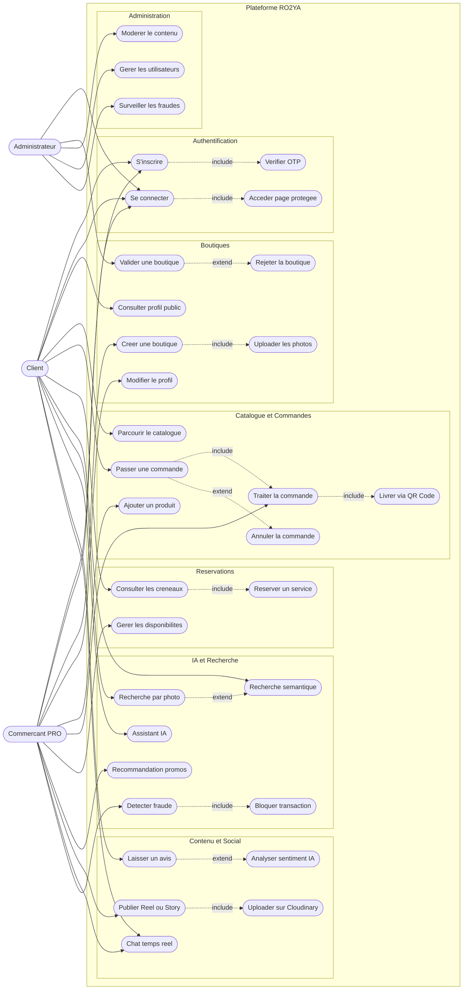
```mermaid
flowchart LR
    C(["Client"])
    P(["Commercant PRO"])
    A(["Administrateur"])

    subgraph Plateforme_RO2YA ["Plateforme RO2YA"]
        direction TB

        subgraph AUTH ["Authentification"]
            UC1(["S'inscrire"])
            UC_OTP(["Verifier OTP"])
            UC2(["Se connecter"])
            UC_JWT(["Acceder page protegee"])
            UC1 -.->|"include"| UC_OTP
            UC2 -.->|"include"| UC_JWT
        end

        subgraph BOUTIQUE ["Boutiques"]
            UC3(["Creer une boutique"])
            UC_UPLOAD(["Uploader les photos"])
            UC4(["Modifier le profil"])
            UC5(["Consulter profil public"])
            UC20(["Valider une boutique"])
            UC_REJECT(["Rejeter la boutique"])
            UC3 -.->|"include"| UC_UPLOAD
            UC20 -.->|"extend"| UC_REJECT
        end

        subgraph COMMANDES ["Catalogue et Commandes"]
            UC6(["Ajouter un produit"])
            UC7(["Parcourir le catalogue"])
            UC8(["Passer une commande"])
            UC9(["Traiter la commande"])
            UC10(["Livrer via QR Code"])
            UC_ANNULER(["Annuler la commande"])
            UC8 -.->|"include"| UC9
            UC9 -.->|"include"| UC10
            UC8 -.->|"extend"| UC_ANNULER
        end

        subgraph RESERVATION ["Reservations"]
            UC_CRENEAUX(["Consulter les creneaux"])
            UC11(["Reserver un service"])
            UC12(["Gerer les disponibilites"])
            UC_CRENEAUX -.->|"include"| UC11
        end

        subgraph IA ["IA et Recherche"]
            UC13(["Recherche semantique"])
            UC14(["Recherche par photo"])
            UC15(["Assistant IA"])
            UC16(["Recommandation promos"])
            UC_FRAUDE(["Detecter fraude"])
            UC_BLOC(["Bloquer transaction"])
            UC14 -.->|"extend"| UC13
            UC_FRAUDE -.->|"include"| UC_BLOC
        end

        subgraph SOCIAL ["Contenu et Social"]
            UC17(["Publier Reel ou Story"])
            UC_CDN(["Uploader sur Cloudinary"])
            UC18(["Laisser un avis"])
            UC_SENT(["Analyser sentiment IA"])
            UC19(["Chat temps reel"])
            UC17 -.->|"include"| UC_CDN
            UC18 -.->|"extend"| UC_SENT
        end

        subgraph ADMIN ["Administration"]
            UC21(["Moderer le contenu"])
            UC22(["Gerer les utilisateurs"])
            UC23(["Surveiller les fraudes"])
        end
    end

    C --> UC1 & UC2 & UC5 & UC7 & UC8 & UC_CRENEAUX & UC13 & UC14 & UC15 & UC18 & UC19
    P --> UC1 & UC2 & UC3 & UC4 & UC6 & UC9 & UC12 & UC16 & UC17 & UC19 & UC_FRAUDE
    A --> UC2 & UC20 & UC21 & UC22 & UC23
```

*Figure : Diagramme de cas d'utilisation global de RO2YA*

### 3.4.3 Adaptation au cycle de développement Scrum

#### 3.4.3.1 Répartition des rôles

Pour assurer une gestion efficace du projet selon la méthodologie Scrum, les rôles suivants ont été définis :

| Rôle | Personne concernée |
|------|--------------------|
| Product Owner | Encadrant académique |
| Scrum Master | Chef de projet (étudiant) |
| Équipe de développement | Équipe étudiante |

*Tableau : Répartition des rôles Scrum*

#### 3.4.3.2 Product Backlog

Le Product Backlog constitue l'inventaire structuré de toutes les fonctionnalités requises pour la plateforme RO2YA. Il présente une vue d'ensemble des besoins fonctionnels identifiés lors de l'analyse, organisés de manière à faciliter la planification et le développement itératif.

Le tableau ci-dessous représente les fonctionnalités selon des critères de classification :

- **L'effort** : représente la difficulté technique estimée pour implémenter la fonctionnalité. Il est noté sur une échelle de 1 à 5, où 1 correspond à une tâche simple et 5 à une tâche complexe nécessitant plus de ressources.
- **La priorité** : également notée sur 5, reflète l'importance de la fonctionnalité pour les utilisateurs finaux ainsi que son impact sur les objectifs du projet. Plus la note est élevée, plus la fonctionnalité est considérée comme prioritaire.

| Thème | Fonctionnalité | Description | Effort | Priorité |
|-------|---------------|-------------|--------|---------|
| Authentification | S'inscrire | Permettre à un nouvel utilisateur de créer un compte avec vérification OTP | 3 | 5 |
| Authentification | Se connecter | Permettre à un utilisateur existant de s'authentifier via email et mot de passe | 2 | 5 |
| Authentification | Accéder à une page protégée | Vérifier le jeton de session (JWT) et les droits d'accès à chaque requête | 3 | 5 |
| Boutique | Créer une boutique | Permettre au commerçant de créer son profil boutique avec géolocalisation et photos | 4 | 5 |
| Boutique | Valider une boutique | Permettre à l'admin de valider ou rejeter les demandes de création | 3 | 5 |
| Boutique | Modifier le profil | Permettre au commerçant de mettre à jour ses horaires et informations | 2 | 4 |
| Catalogue | Ajouter un produit | Permettre au commerçant d'ajouter un produit ou service à son catalogue | 3 | 5 |
| Commandes | Passer une commande | Permettre au client de commander avec gestion du stock en temps réel | 5 | 5 |
| Commandes | Livrer via QR Code | Permettre la confirmation de livraison par scan d'un QR Code sécurisé | 4 | 5 |
| Réservations | Réserver un service | Permettre au client de réserver un créneau disponible | 4 | 4 |
| Recherche IA | Recherche sémantique | Permettre la recherche en Darija/Français via un moteur vectoriel | 5 | 5 |
| Recherche IA | Recherche par photo | Permettre l'identification de produits par analyse d'image (Vision IA) | 5 | 4 |
| Contenu | Publier un Reel | Permettre au commerçant de publier des vidéos promotionnelles | 4 | 3 |
| Social | Chat temps réel | Permettre la messagerie instantanée entre client et commerçant | 4 | 4 |
| IA | Détection de fraude | Analyser les transactions pour détecter les comportements suspects | 5 | 5 |
| IA | Analyse de sentiment | Analyser les avis clients pour extraire les points forts et axes d'amélioration | 4 | 3 |
| IA | Recommandation promos | Suggérer des promotions adaptées basées sur les données de vente | 4 | 3 |
| IA | Assistant conversationnel | Fournir un chatbot IA capable de répondre aux questions métier | 5 | 4 |
| Admin | Modérer le contenu | Permettre la suppression de contenus non conformes signalés | 3 | 5 |
| Admin | Gérer les utilisateurs | Permettre la suspension et réactivation des comptes utilisateurs | 3 | 4 |

*Tableau : Product Backlog de la plateforme RO2YA*

#### 3.4.3.3 Planification des sprints du projet

Le sprint est une période qui dure entre une et quatre semaines, au bout de laquelle l'équipe doit réaliser un incrément de produit livrable. Un nouveau sprint démarre lorsque le précédent est terminé.

L'objectif de cette étape est d'organiser le calendrier de travail et de définir le Backlog pour chaque sprint. La planification des sprints est illustrée dans le tableau ci-dessous :

| | SPRINT | Fonctionnalités |
|--|--------|----------------|
| **RELEASE 1** | Sprint 1 | Authentification (Inscription · Connexion · Session protégée) |
| **RELEASE 2** | Sprint 1 | Gestion des Boutiques (Création · Validation Admin · Modification profil) |
| | Sprint 2 | Catalogue & Commandes (Ajout produit · Commande · QR Code · Annulation) |
| | Sprint 3 | Réservations & Géolocalisation |
| **RELEASE 3** | Sprint 1 | Intelligence Artificielle (Recherche Darija · Vision · Fraude · Sentiment · Promos · RAG) |
| | Sprint 2 | Contenu & Social (Reels · Stories · Likes · Chat temps réel · Avis) |
| | Sprint 3 | Administration SaaS (Modération · Utilisateurs · Analytics · Notifications) |

*Tableau : Planification des sprints du projet RO2YA*

**Planification Release 1**

Une fois l'analyse des besoins et les spécifications des exigences du projet élaborées, nous présentons notre premier release qui comporte un sprint axé sur les fonctionnalités d'authentification.

*Sprint 1 :*

| Thème | Fonctionnalité | Estimation (jours) |
|-------|---------------|-------------------|
| Authentification | S'inscrire (avec vérification OTP) | 7 |
| Authentification | Se connecter | 5 |
| Authentification | Accéder à une page protégée (JWT) | 4 |

*Tableau : Backlog Sprint 1 — Release 1*

**Planification Release 2**

*Sprint 1 :*

L'objectif de ce sprint est de permettre aux commerçants de créer et gérer leur boutique sur la plateforme, et à l'administrateur de valider les demandes.

| Thème | Fonctionnalités | Estimation (jours) |
|-------|----------------|-------------------|
| Boutique | Créer une boutique · Valider (Admin) · Modifier le profil | 12 |

*Tableau : Backlog Sprint 1 — Release 2*

*Sprint 2 :*

L'objectif de ce sprint est de permettre aux commerçants de gérer leur catalogue et aux clients de passer des commandes complètes, de la mise au panier jusqu'à la livraison par QR Code.

| Thème | Fonctionnalités | Estimation (jours) |
|-------|----------------|-------------------|
| Catalogue & Commandes | Ajout produit · Commande · QR Code · Annulation | 15 |

*Tableau : Backlog Sprint 2 — Release 2*

*Sprint 3 :*

L'objectif de ce sprint est de permettre aux clients de réserver des services auprès des prestataires et d'explorer les boutiques à proximité via une carte géographique interactive.

| Thème | Fonctionnalités | Estimation (jours) |
|-------|----------------|-------------------|
| Réservations | Réserver un créneau · Clôturer une réservation | 10 |
| Géolocalisation | Exploration sur carte · Filtres de proximité | 8 |

*Tableau : Backlog Sprint 3 — Release 2*

---

## 3.5 Conception Technique Détaillée (Workflows et Diagrammes de Séquence)

Cette section détaille la conception technique de chaque fonctionnalité, organisée par Release et par Sprint. Pour chaque workflow, un **tableau descriptif complet** des étapes est fourni, suivi du **diagramme de séquence optimisé** illustrant l'architecture exacte de la plateforme (interactions entre l'App Web/Mobile, Supabase, Django Admin, et les API Tierces d'Intelligence Artificielle).

### RELEASE 1 : Fondation & Authentification

#### Sprint 1 : Authentification & Profils

**Workflow : Inscription d'un utilisateur**

**1. Description des étapes :**

| Étape | Acteur / Système Source | Action / Message | Cible |
|---|---|---|---|
| 1 | **Client** | Remplit le formulaire d'inscription | **App** |
| 2 | **App** | Vérifie que tous les champs sont remplis | **App** |
| 3 | **App** | Vérifie que l'email est valide | **App** |
| 4 | **App** | Vérifie le nombre de tentatives | **SupabaseAuth** |
| - | *Système* | *Condition : Trop de tentatives* | - |
| 5 | **SupabaseAuth** | Accès temporairement bloqué | **App** |
| 6 | **App** | "Réessayez dans 15 minutes" | **Client** |
| - | *Système* | *Sinon : Autorisé* | - |
| 7 | **App** | Envoie les données d'inscription | **SupabaseAuth** |
| 8 | **SupabaseAuth** | Vérifie si l'email existe déjà | **BD** |
| - | *Système* | *Condition : Email déjà utilisé* | - |
| 9 | **BD** | Email trouvé | **SupabaseAuth** |
| 10 | **SupabaseAuth** | "Email déjà utilisé" | **App** |
| 11 | **App** | Affiche le message d'erreur | **Client** |
| - | *Système* | *Sinon : Email disponible* | - |
| 12 | **SupabaseAuth** | Enregistre le nouvel utilisateur | **BD** |
| 13 | **BD** | Confirmation | **SupabaseAuth** |
| 14 | **SupabaseAuth** | Envoie le code de vérification | **Email** |
| 15 | **Email** | 📧 Code OTP reçu par email | **Utilisateur** |
| 16 | **SupabaseAuth** | "Vérifiez votre email" | **App** |
| 17 | **App** | Affiche l'écran de vérification | **Client** |
| 18 | **Client** | Saisit le code OTP | **App** |
| 19 | **App** | Envoie le code OTP | **SupabaseAuth** |
| - | *Système* | *Condition : Code invalide ou expiré* | - |
| 20 | **SupabaseAuth** | Code incorrect | **App** |
| 21 | **App** | "Code invalide ou expiré" | **Client** |
| - | *Système* | *Sinon : Code valide* | - |
| 22 | **SupabaseAuth** | Active le compte | **BD** |
| 23 | **SupabaseAuth** | Jeton de session | **App** |
| 24 | **App** | ✅ Compte activé — Bienvenue ! | **Client** |

**2. Diagramme de séquence :**

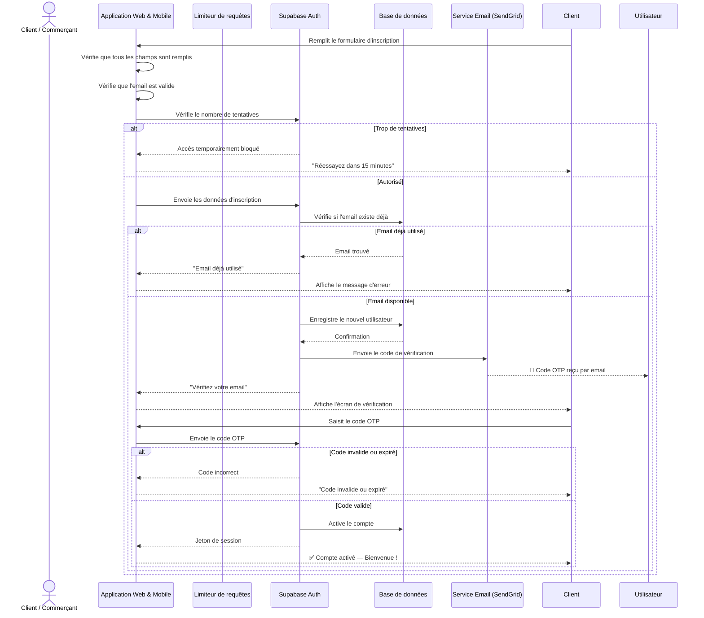
```mermaid
sequenceDiagram
    actor Client / Commerçant
    participant App as Application Web & Mobile
    participant RateLimiter as Limiteur de requêtes
    participant SupabaseAuth as Supabase Auth
    participant BD as Base de données
    participant Email as Service Email (SendGrid)

    Client->>App: Remplit le formulaire d'inscription
    App->>App: Vérifie que tous les champs sont remplis
    App->>App: Vérifie que l'email est valide
    App->>SupabaseAuth: Vérifie le nombre de tentatives
    alt Trop de tentatives
        SupabaseAuth-->>App: Accès temporairement bloqué
        App-->>Client: "Réessayez dans 15 minutes"
    else Autorisé
        App->>SupabaseAuth: Envoie les données d'inscription
        SupabaseAuth->>BD: Vérifie si l'email existe déjà
        alt Email déjà utilisé
            BD-->>SupabaseAuth: Email trouvé
            SupabaseAuth-->>App: "Email déjà utilisé"
            App-->>Client: Affiche le message d'erreur
        else Email disponible
            SupabaseAuth->>BD: Enregistre le nouvel utilisateur
            BD-->>SupabaseAuth: Confirmation
            SupabaseAuth->>Email: Envoie le code de vérification
            Email-->>Utilisateur: 📧 Code OTP reçu par email
            SupabaseAuth-->>App: "Vérifiez votre email"
            App-->>Client: Affiche l'écran de vérification
            Client->>App: Saisit le code OTP
            App->>SupabaseAuth: Envoie le code OTP
            alt Code invalide ou expiré
                SupabaseAuth-->>App: Code incorrect
                App-->>Client: "Code invalide ou expiré"
            else Code valide
                SupabaseAuth->>BD: Active le compte
                SupabaseAuth-->>App: Jeton de session
                App-->>Client: ✅ Compte activé — Bienvenue !
            end
        end
    end
```

---

**Workflow : Connexion d'un utilisateur**

**1. Description des étapes :**

| Étape | Acteur / Système Source | Action / Message | Cible |
|---|---|---|---|
| 1 | **Client** | Saisit email et mot de passe | **App** |
| 2 | **App** | Vérifie le nombre de tentatives | **SupabaseAuth** |
| - | *Système* | *Condition : Trop de tentatives* | - |
| 3 | **SupabaseAuth** | Compte temporairement verrouillé | **App** |
| 4 | **App** | "Réessayez dans 15 minutes" | **Client** |
| - | *Système* | *Sinon : Autorisé* | - |
| 5 | **App** | Envoie les identifiants | **SupabaseAuth** |
| 6 | **SupabaseAuth** | Cherche l'utilisateur par email | **BD** |
| - | *Système* | *Condition : Identifiants incorrects* | - |
| 7 | **BD** | Utilisateur non trouvé ou mot de passe invalide | **SupabaseAuth** |
| 8 | **SupabaseAuth** | Identifiants incorrects | **App** |
| 9 | **App** | "Email ou mot de passe incorrect" | **Client** |
| - | *Système* | *Sinon : Compte suspendu* | - |
| 10 | **SupabaseAuth** | Compte suspendu | **App** |
| 11 | **App** | "Compte suspendu — Contactez le support" | **Client** |
| - | *Système* | *Sinon : Connexion réussie* | - |
| 12 | **SupabaseAuth** | Met à jour la date de dernière connexion | **BD** |
| 13 | **SupabaseAuth** | Jeton de session (JWT) | **App** |
| 14 | **App** | Sauvegarde la session | **App** |
| 15 | **App** | ✅ Connecté — Redirection vers l'accueil | **Client** |

**2. Diagramme de séquence :**

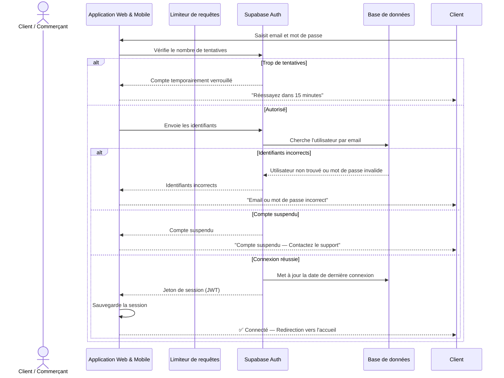
```mermaid
sequenceDiagram
    actor Client / Commerçant
    participant App as Application Web & Mobile
    participant RateLimiter as Limiteur de requêtes
    participant SupabaseAuth as Supabase Auth
    participant BD as Base de données

    Client->>App: Saisit email et mot de passe
    App->>SupabaseAuth: Vérifie le nombre de tentatives
    alt Trop de tentatives
        SupabaseAuth-->>App: Compte temporairement verrouillé
        App-->>Client: "Réessayez dans 15 minutes"
    else Autorisé
        App->>SupabaseAuth: Envoie les identifiants
        SupabaseAuth->>BD: Cherche l'utilisateur par email
        alt Identifiants incorrects
            BD-->>SupabaseAuth: Utilisateur non trouvé ou mot de passe invalide
            SupabaseAuth-->>App: Identifiants incorrects
            App-->>Client: "Email ou mot de passe incorrect"
        else Compte suspendu
            SupabaseAuth-->>App: Compte suspendu
            App-->>Client: "Compte suspendu — Contactez le support"
        else Connexion réussie
            SupabaseAuth->>BD: Met à jour la date de dernière connexion
            SupabaseAuth-->>App: Jeton de session (JWT)
            App->>App: Sauvegarde la session
            App-->>Client: ✅ Connecté — Redirection vers l'accueil
        end
    end
```

---

**Workflow : Accès à une page protégée**

**1. Description des étapes :**

| Étape | Acteur / Système Source | Action / Message | Cible |
|---|---|---|---|
| 1 | **Client** | Accède à une page réservée | **App** |
| 2 | **App** | Présente le jeton de session | **SupabaseAuth** |
| 3 | **SupabaseAuth** | Vérifie la validité du jeton | **SupabaseAuth** |
| - | *Système* | *Condition : Jeton absent ou expiré* | - |
| 4 | **SupabaseAuth** | Jeton invalide | **App** |
| 5 | **App** | Redirige vers la connexion | **App** |
| 6 | **App** | Page de connexion | **Client** |
| - | *Système* | *Sinon : Jeton valide* | - |
| 7 | **SupabaseAuth** | Identité et rôle de l'utilisateur | **App** |
| 8 | **SupabaseAuth** | Vérifie les droits d'accès | **BD** |
| - | *Système* | *Condition : Droits insuffisants* | - |
| 9 | **BD** | Accès non autorisé | **SupabaseAuth** |
| 10 | **App** | Page "Accès refusé" | **App** |
| 11 | **App** | ❌ Accès interdit | **Client** |
| - | *Système* | *Sinon : Autorisé* | - |
| 12 | **App** | Accès accordé | **App** |
| 13 | **App** | ✅ Page affichée | **Client** |

**2. Diagramme de séquence :**

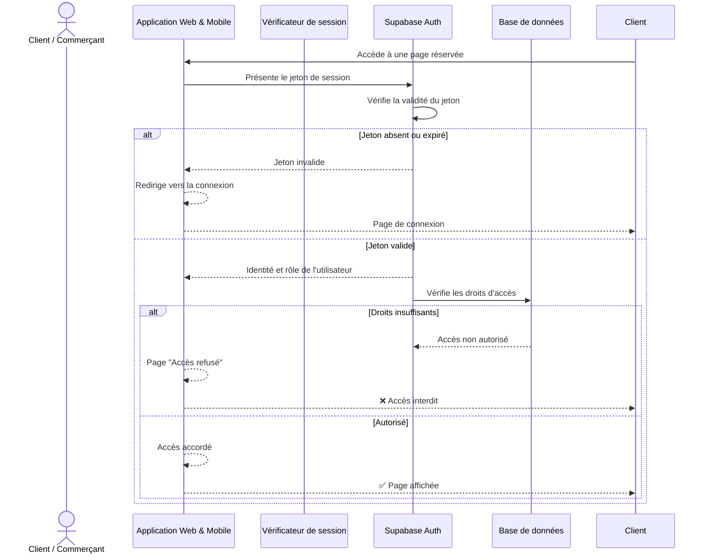
```mermaid
sequenceDiagram
    actor Client / Commerçant
    participant App as Application Web & Mobile
    participant Middleware as Vérificateur de session
    participant SupabaseAuth as Supabase Auth
    participant BD as Base de données

    Client->>App: Accède à une page réservée
    App->>SupabaseAuth: Présente le jeton de session
    SupabaseAuth->>SupabaseAuth: Vérifie la validité du jeton
    alt Jeton absent ou expiré
        SupabaseAuth-->>App: Jeton invalide
        App-->>App: Redirige vers la connexion
        App-->>Client: Page de connexion
    else Jeton valide
        SupabaseAuth-->>App: Identité et rôle de l'utilisateur
        SupabaseAuth->>BD: Vérifie les droits d'accès
        alt Droits insuffisants
            BD-->>SupabaseAuth: Accès non autorisé
            App-->>App: Page "Accès refusé"
            App-->>Client: ❌ Accès interdit
        else Autorisé
            App-->>App: Accès accordé
            App-->>Client: ✅ Page affichée
        end
    end
```

---

#### Sprint 2 : Intégration Commerçant & Back-Office Admin

**Workflow : Création d'une boutique**

**1. Description des étapes :**

| Étape | Acteur / Système Source | Action / Message | Cible |
|---|---|---|---|
| 1 | **Commerçant** | Remplit les informations de la boutique | **Dashboard** |
| 2 | **Commerçant** | Ajoute logo et photos | **Dashboard** |
| 3 | **App** | Envoie les images | **Cloudinary** |
| 4 | **Cloudinary** | Compresse et optimise les images | **Cloudinary** |
| 5 | **Cloudinary** | Liens des images hébergées | **App** |
| 6 | **App** | Vérifie que tous les champs sont remplis | **App** |
| - | *Système* | *Condition : Informations manquantes* | - |
| 7 | **App** | Affiche les erreurs | **Commerçant** |
| - | *Système* | *Sinon : Informations complètes* | - |
| 8 | **App** | Envoie les données avec les liens images | **BD** |
| 9 | **BD** | Enregistre la boutique avec coordonnées GPS | **BD** |
| 10 | **BD** | Identifiant de la boutique | **Django** |
| 11 | **BD** | Boutique créée | **App** |
| 12 | **App** | ✅ "En attente de validation par l'admin" | **Commerçant** |

**2. Diagramme de séquence :**

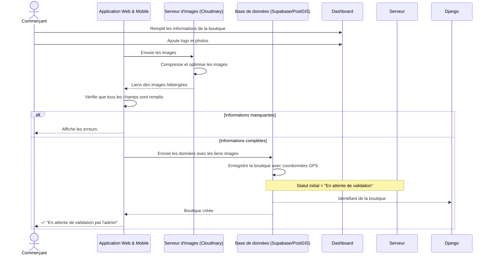
```mermaid
sequenceDiagram
    actor Commerçant
    participant App as Application Web & Mobile
    participant Cloudinary as Serveur d'images (Cloudinary)
    participant BD as Base de données (Supabase/PostGIS)

    Commerçant->>Dashboard: Remplit les informations de la boutique
    Commerçant->>Dashboard: Ajoute logo et photos
    App->>Cloudinary: Envoie les images
    Cloudinary->>Cloudinary: Compresse et optimise les images
    Cloudinary-->>App: Liens des images hébergées
    App->>App: Vérifie que tous les champs sont remplis
    alt Informations manquantes
        App-->>Commerçant: Affiche les erreurs
    else Informations complètes
        App->>BD: Envoie les données avec les liens images
        BD->>BD: Enregistre la boutique avec coordonnées GPS
        Note over Serveur,BD: Statut initial = "En attente de validation"
        BD-->>Django: Identifiant de la boutique
        BD-->>App: Boutique créée
        App-->>Commerçant: ✅ "En attente de validation par l'admin"
    end
```

---

**Workflow : Validation d'une boutique (Admin)**

**1. Description des étapes :**

| Étape | Acteur / Système Source | Action / Message | Cible |
|---|---|---|---|
| 1 | **Administrateur** | Consulte les boutiques en attente | **AdminPortal** |
| 2 | **AdminPortal** | Demande la liste des boutiques "En attente" | **Django** |
| 3 | **Django** | Récupère les boutiques avec leurs documents | **BD** |
| 4 | **BD** | Liste des boutiques | **Django** |
| 5 | **Django** | Affiche la liste des boutiques | **AdminPortal** |
| 6 | **Administrateur** | Examine les documents et décide | **AdminPortal** |
| - | *Système* | *Condition : Boutique approuvée* | - |
| 7 | **AdminPortal** | Approuver la boutique (store_id) | **Django** |
| 8 | **Django** | Met à jour le statut à "Approuvée" | **BD** |
| 9 | **BD** | Confirmation de mise à jour | **Django** |
| 10 | **Django** | Enregistre le log de validation (audit trail) | **BD** |
| 11 | **BD** | 🔔 "Votre boutique a été approuvée" | **Commerçant** |
| 12 | **Django** | Approbation confirmée | **AdminPortal** |
| 13 | **AdminPortal** | ✅ Boutique approuvée avec succès | **Administrateur** |
| - | *Système* | *Sinon : Boutique rejetée* | - |
| 14 | **AdminPortal** | Rejeter la boutique avec motif | **Django** |
| 15 | **Django** | Met à jour le statut à "Rejetée" avec motif | **BD** |
| 16 | **BD** | Confirmation de mise à jour | **Django** |
| 17 | **Django** | Enregistre le log de rejet (audit trail) | **BD** |
| 18 | **BD** | 🔔 "Votre boutique a été rejetée : [motif]" | **Commerçant** |
| 19 | **Django** | Rejet enregistré | **AdminPortal** |
| 20 | **AdminPortal** | ❌ Boutique rejetée avec succès | **Administrateur** |

**2. Diagramme de séquence :**

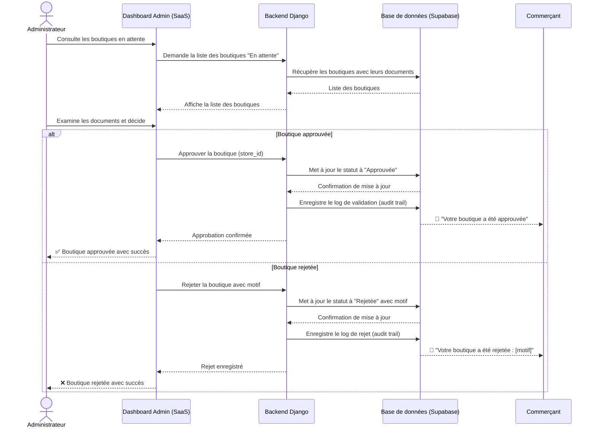
```mermaid
sequenceDiagram
    actor Administrateur
    participant AdminPortal as Dashboard Admin (SaaS)
    participant Django as Backend Django
    participant BD as Base de données (Supabase)

    Administrateur->>AdminPortal: Consulte les boutiques en attente
    AdminPortal->>Django: Demande la liste des boutiques "En attente"
    Django->>BD: Récupère les boutiques avec leurs documents
    BD-->>Django: Liste des boutiques
    Django-->>AdminPortal: Affiche la liste des boutiques
    Administrateur->>AdminPortal: Examine les documents et décide
    alt Boutique approuvée
        AdminPortal->>Django: Approuver la boutique (store_id)
        Django->>BD: Met à jour le statut à "Approuvée"
        BD-->>Django: Confirmation de mise à jour
        Django->>BD: Enregistre le log de validation (audit trail)
        BD-->>Commerçant: 🔔 "Votre boutique a été approuvée"
        Django-->>AdminPortal: Approbation confirmée
        AdminPortal-->>Administrateur: ✅ Boutique approuvée avec succès
    else Boutique rejetée
        AdminPortal->>Django: Rejeter la boutique avec motif
        Django->>BD: Met à jour le statut à "Rejetée" avec motif
        BD-->>Django: Confirmation de mise à jour
        Django->>BD: Enregistre le log de rejet (audit trail)
        BD-->>Commerçant: 🔔 "Votre boutique a été rejetée : [motif]"
        Django-->>AdminPortal: Rejet enregistré
        AdminPortal-->>Administrateur: ❌ Boutique rejetée avec succès
    end
```

---

**Workflow : Modification du profil et affichage public**

**1. Description des étapes :**

| Étape | Acteur / Système Source | Action / Message | Cible |
|---|---|---|---|
| 1 | **Commerçant** | Modifie horaires, bio ou réseaux sociaux | **Dashboard** |
| 2 | **App** | Envoie les modifications | **BD** |
| 3 | **BD** | Vérifie que le commerçant est propriétaire de la boutique | **BD** |
| - | *Système* | *Condition : Propriétaire non confirmé* | - |
| 4 | **BD** | Accès refusé | **Django** |
| 5 | **BD** | Modification non autorisée | **App** |
| 6 | **App** | ❌ Erreur d'autorisation | **Commerçant** |
| - | *Système* | *Sinon : Propriétaire confirmé* | - |
| 7 | **BD** | Enregistre les modifications | **BD** |
| 8 | **BD** | Confirmation | **Django** |
| 9 | **BD** | Mise à jour réussie | **App** |
| 10 | **App** | ✅ "Profil mis à jour avec succès" | **Commerçant** |

**2. Diagramme de séquence :**

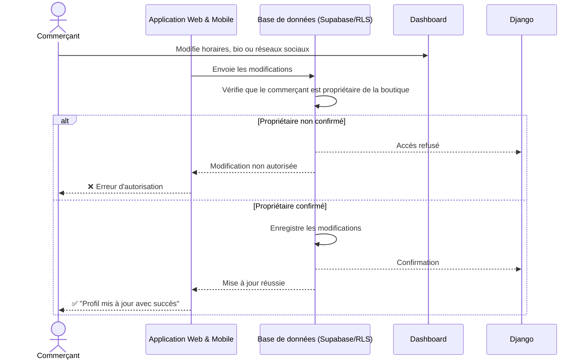
```mermaid
sequenceDiagram
    actor Commerçant
    participant App as Application Web & Mobile
    participant BD as Base de données (Supabase/RLS)

    Commerçant->>Dashboard: Modifie horaires, bio ou réseaux sociaux
    App->>BD: Envoie les modifications
    BD->>BD: Vérifie que le commerçant est propriétaire de la boutique
    alt Propriétaire non confirmé
        BD-->>Django: Accès refusé
        BD-->>App: Modification non autorisée
        App-->>Commerçant: ❌ Erreur d'autorisation
    else Propriétaire confirmé
        BD->>BD: Enregistre les modifications
        BD-->>Django: Confirmation
        BD-->>App: Mise à jour réussie
        App-->>Commerçant: ✅ "Profil mis à jour avec succès"
    end
```

---

### RELEASE 2 : E-Commerce & Catalogue

#### Sprint 3 : Gestion du Shop (Produits & Services)

**Workflow : Ajout d'un produit**

**1. Description des étapes :**

| Étape | Acteur / Système Source | Action / Message | Cible |
|---|---|---|---|
| 1 | **Commerçant** | Remplit les informations du produit | **Dashboard** |
| 2 | **Commerçant** | Ajoute une photo | **Dashboard** |
| 3 | **App** | Envoie la photo | **Cloudinary** |
| 4 | **Cloudinary** | Lien de l'image optimisée | **App** |
| 5 | **App** | Vérifie les données (prix, nom, catégorie) | **App** |
| - | *Système* | *Condition : Données invalides* | - |
| 6 | **App** | ❌ Affiche les erreurs | **Commerçant** |
| - | *Système* | *Sinon : Données valides* | - |
| 7 | **App** | Envoie les informations du produit | **BD** |
| 8 | **BD** | Enregistre le produit dans le catalogue | **BD** |
| 9 | **BD** | Confirmation | **Django** |
| 10 | **BD** | Produit créé | **App** |
| 11 | **App** | ✅ "Produit ajouté au Shop" | **Commerçant** |

**2. Diagramme de séquence :**

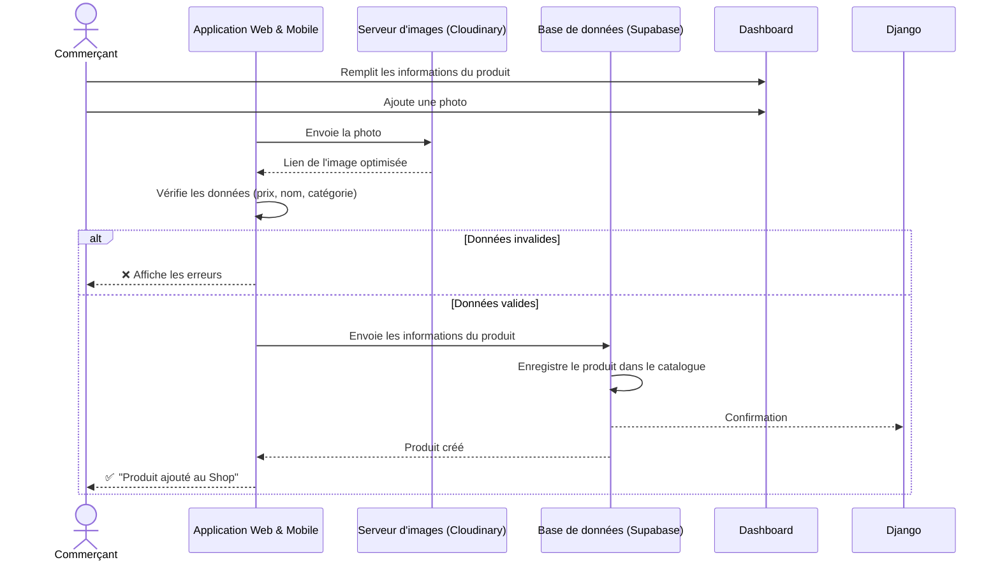
```mermaid
sequenceDiagram
    actor Commerçant
    participant App as Application Web & Mobile
    participant Cloudinary as Serveur d'images (Cloudinary)
    participant BD as Base de données (Supabase)

    Commerçant->>Dashboard: Remplit les informations du produit
    Commerçant->>Dashboard: Ajoute une photo
    App->>Cloudinary: Envoie la photo
    Cloudinary-->>App: Lien de l'image optimisée
    App->>App: Vérifie les données (prix, nom, catégorie)
    alt Données invalides
        App-->>Commerçant: ❌ Affiche les erreurs
    else Données valides
        App->>BD: Envoie les informations du produit
        BD->>BD: Enregistre le produit dans le catalogue
        BD-->>Django: Confirmation
        BD-->>App: Produit créé
        App-->>Commerçant: ✅ "Produit ajouté au Shop"
    end
```

---

**Workflow : Consultation du Shop (Client)**

**1. Description des étapes :**

| Étape | Acteur / Système Source | Action / Message | Cible |
|---|---|---|---|
| 1 | **Client** | Parcourt le Shop | **Application** |
| 2 | **App** | Demande la liste des produits (page suivante) | **BD** |
| 3 | **BD** | Récupère 20 produits actifs triés par date | **BD** |
| 4 | **BD** | Liste de produits | **Django** |
| 5 | **BD** | Produits reçus | **App** |
| 6 | **App** | ✅ Affiche les nouveaux produits | **Client** |

**2. Diagramme de séquence :**

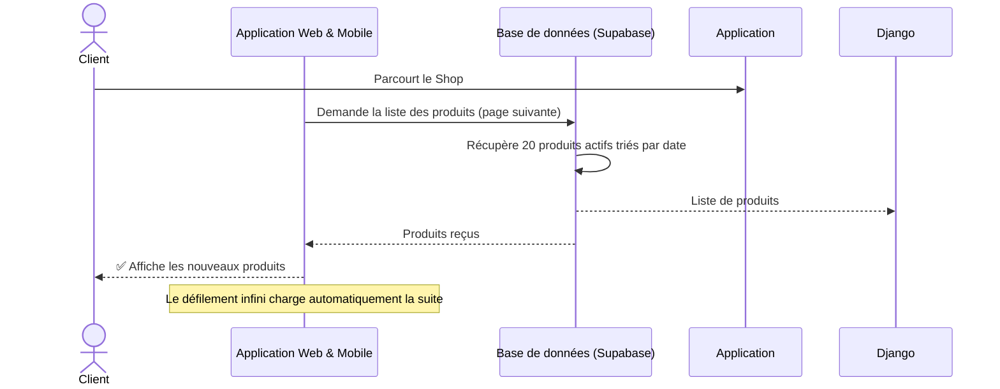
```mermaid
sequenceDiagram
    actor Client
    participant App as Application Web & Mobile
    participant BD as Base de données (Supabase)

    Client->>Application: Parcourt le Shop
    App->>BD: Demande la liste des produits (page suivante)
    BD->>BD: Récupère 20 produits actifs triés par date
    BD-->>Django: Liste de produits
    BD-->>App: Produits reçus
    App-->>Client: ✅ Affiche les nouveaux produits

    Note over App: Le défilement infini charge automatiquement la suite
```

---

**Workflow : Réservation d'un service et gestion des créneaux**

**1. Description des étapes :**

| Étape | Acteur / Système Source | Action / Message | Cible |
|---|---|---|---|
| 1 | **Client** | Consulte les créneaux disponibles d'un service | **Application** |
| 2 | **App** | Demande les créneaux libres du commerçant | **BD** |
| 3 | **BD** | Récupère le calendrier et filtre les créneaux occupés | **BD** |
| 4 | **BD** | Créneaux disponibles pour la date choisie | **Django** |
| 5 | **BD** | Affiche les créneaux libres | **App** |
| 6 | **Client** | Sélectionne un créneau et confirme | **Application** |
| 7 | **App** | Envoie la demande de réservation | **BD** |
| 8 | **BD** | Vérifie que le créneau est toujours libre | **BD** |
| - | *Système* | *Condition : Créneau déjà pris entre-temps* | - |
| 9 | **BD** | Créneau occupé par un autre client | **Django** |
| 10 | **BD** | "Ce créneau n'est plus disponible" | **App** |
| 11 | **App** | ❌ Propose de choisir un autre horaire | **Client** |
| - | *Système* | *Sinon : Créneau encore libre* | - |
| 12 | **BD** | Enregistre la réservation avec statut "Confirmée" | **BD** |
| 13 | **BD** | Marque le créneau comme occupé | **BD** |
| 14 | **BD** | Réservation confirmée | **Django** |
| 15 | **Django** | Notifie le commerçant en temps réel | **BD** |
| 16 | **BD** | 🔔 "Nouvelle réservation reçue" | **Commerçant** |
| 17 | **BD** | Confirmation avec détails du RDV | **App** |
| 18 | **App** | ✅ "Réservation confirmée pour [date] à [heure]" | **Client** |

**2. Diagramme de séquence :**

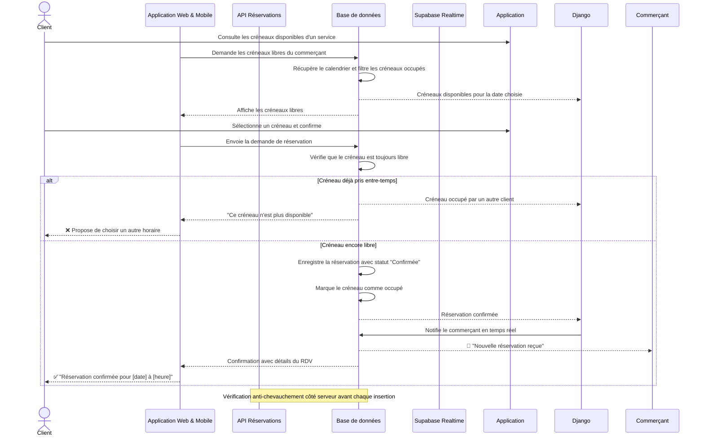
```mermaid
sequenceDiagram
    actor Client
    participant App as Application Web & Mobile
    participant Serveur as API Réservations
    participant BD as Base de données
    participant Notif as Supabase Realtime

    Client->>Application: Consulte les créneaux disponibles d'un service
    App->>BD: Demande les créneaux libres du commerçant
    BD->>BD: Récupère le calendrier et filtre les créneaux occupés
    BD-->>Django: Créneaux disponibles pour la date choisie
    BD-->>App: Affiche les créneaux libres
    Client->>Application: Sélectionne un créneau et confirme

    App->>BD: Envoie la demande de réservation
    BD->>BD: Vérifie que le créneau est toujours libre
    alt Créneau déjà pris entre-temps
        BD-->>Django: Créneau occupé par un autre client
        BD-->>App: "Ce créneau n'est plus disponible"
        App-->>Client: ❌ Propose de choisir un autre horaire
    else Créneau encore libre
        BD->>BD: Enregistre la réservation avec statut "Confirmée"
        BD->>BD: Marque le créneau comme occupé
        BD-->>Django: Réservation confirmée
        Django->>BD: Notifie le commerçant en temps réel
        BD-->>Commerçant: 🔔 "Nouvelle réservation reçue"
        BD-->>App: Confirmation avec détails du RDV
        App-->>Client: ✅ "Réservation confirmée pour [date] à [heure]"
    end

    Note over Serveur,BD: Vérification anti-chevauchement côté serveur avant chaque insertion
```

---

**Workflow : Clôture d'une réservation par le commerçant**

**1. Description des étapes :**

| Étape | Acteur / Système Source | Action / Message | Cible |
|---|---|---|---|
| 1 | **Commerçant** | Consulte ses réservations du jour | **Dashboard** |
| 2 | **App** | Demande les réservations confirmées du jour | **BD** |
| 3 | **BD** | Récupère les réservations du jour pour cette boutique | **BD** |
| 4 | **BD** | Liste des réservations | **Django** |
| 5 | **BD** | Affiche les réservations avec détails client | **App** |
| 6 | **Commerçant** | Marque une réservation comme terminée | **Dashboard** |
| 7 | **App** | Met à jour le statut à "Terminée" | **BD** |
| 8 | **BD** | Enregistre la clôture avec date de complétion | **BD** |
| 9 | **BD** | Confirmation | **Django** |
| 10 | **Django** | Envoie une notification au client | **BD** |
| 11 | **BD** | 🔔 "Prestation terminée — Laissez un avis !" | **Client** |
| 12 | **BD** | Confirmation de la clôture | **App** |
| 13 | **App** | ✅ "Réservation clôturée" | **Commerçant** |

**2. Diagramme de séquence :**

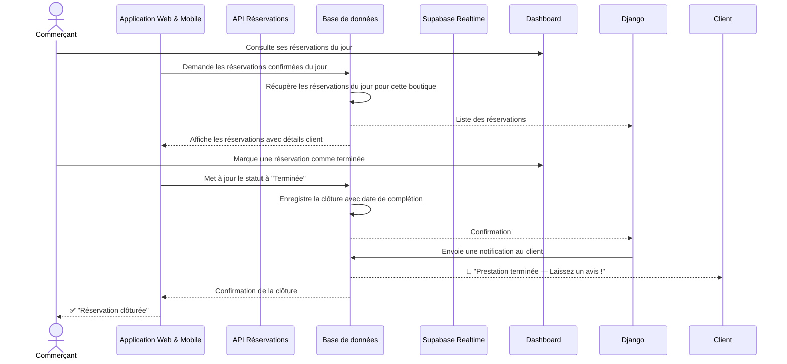
```mermaid
sequenceDiagram
    actor Commerçant
    participant App as Application Web & Mobile
    participant Serveur as API Réservations
    participant BD as Base de données
    participant Notif as Supabase Realtime

    Commerçant->>Dashboard: Consulte ses réservations du jour
    App->>BD: Demande les réservations confirmées du jour
    BD->>BD: Récupère les réservations du jour pour cette boutique
    BD-->>Django: Liste des réservations
    BD-->>App: Affiche les réservations avec détails client

    Commerçant->>Dashboard: Marque une réservation comme terminée
    App->>BD: Met à jour le statut à "Terminée"
    BD->>BD: Enregistre la clôture avec date de complétion
    BD-->>Django: Confirmation
    Django->>BD: Envoie une notification au client
    BD-->>Client: 🔔 "Prestation terminée — Laissez un avis !"
    BD-->>App: Confirmation de la clôture
    App-->>Commerçant: ✅ "Réservation clôturée"
```

---

#### Sprint 4 : Commandes & Validation

**Workflow : Panier et passage de commande**

**1. Description des étapes :**

| Étape | Acteur / Système Source | Action / Message | Cible |
|---|---|---|---|
| 1 | **Client** | Ajoute un produit au panier | **Application** |
| 2 | **App** | Vérifie que le produit vient de la même boutique | **Panier** |
| - | *Système* | *Condition : Produit d'une autre boutique* | - |
| 3 | **Panier** | Conflit détecté | **App** |
| 4 | **App** | "Vider le panier et ajouter ce produit ?" | **Client** |
| - | *Système* | *Sinon : Même boutique* | - |
| 5 | **Panier** | Met à jour la quantité et le total | **Panier** |
| 6 | **App** | Panier mis à jour | **Client** |
| 7 | **Client** | Valide le panier et confirme la commande | **Application** |
| 8 | **App** | Envoie la commande | **BD** |
| 9 | **BD** | Vérifie la disponibilité du stock | **BD** |
| - | *Système* | *Condition : Stock insuffisant* | - |
| 10 | **BD** | Rupture de stock | **Django** |
| 11 | **BD** | "Stock insuffisant pour [produit]" | **App** |
| 12 | **App** | ❌ Affiche le message d'erreur | **Client** |
| - | *Système* | *Sinon : Stock disponible* | - |
| 13 | **BD** | Enregistre la commande et réduit le stock | **BD** |
| 14 | **BD** | Commande créée | **Django** |
| 15 | **Django** | Notifie le commerçant | **BD** |
| 16 | **BD** | 🔔 "Nouvelle commande reçue" | **Commerçant** |
| 17 | **BD** | Numéro de commande | **App** |
| 18 | **App** | ✅ "Commande envoyée avec succès" | **Client** |

**2. Diagramme de séquence :**

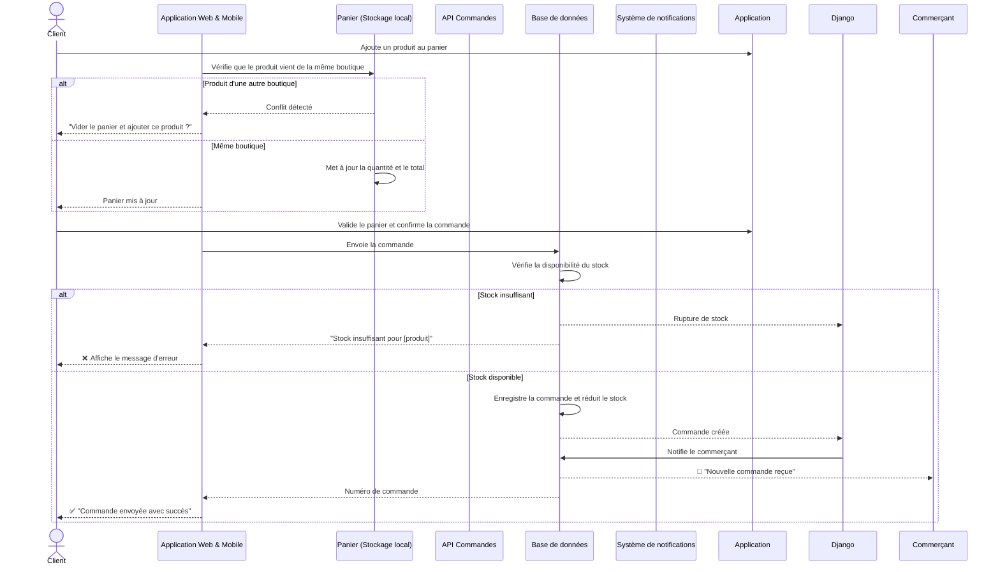
```mermaid
sequenceDiagram
    actor Client
    participant App as Application Web & Mobile
    participant Panier as Panier (Stockage local)
    participant Serveur as API Commandes
    participant BD as Base de données
    participant Notif as Système de notifications

    Client->>Application: Ajoute un produit au panier
    App->>Panier: Vérifie que le produit vient de la même boutique
    alt Produit d'une autre boutique
        Panier-->>App: Conflit détecté
        App-->>Client: "Vider le panier et ajouter ce produit ?"
    else Même boutique
        Panier->>Panier: Met à jour la quantité et le total
        App-->>Client: Panier mis à jour
    end

    Client->>Application: Valide le panier et confirme la commande
    App->>BD: Envoie la commande
    BD->>BD: Vérifie la disponibilité du stock
    alt Stock insuffisant
        BD-->>Django: Rupture de stock
        BD-->>App: "Stock insuffisant pour [produit]"
        App-->>Client: ❌ Affiche le message d'erreur
    else Stock disponible
        BD->>BD: Enregistre la commande et réduit le stock
        BD-->>Django: Commande créée
        Django->>BD: Notifie le commerçant
        BD-->>Commerçant: 🔔 "Nouvelle commande reçue"
        BD-->>App: Numéro de commande
        App-->>Client: ✅ "Commande envoyée avec succès"
    end
```

---

**Workflow : ## 🔟 Traitement et livraison d'une commande**

**1. Description des étapes :**

| Étape | Acteur / Système Source | Action / Message | Cible |
|---|---|---|---|
| 1 | **Commerçant** | Reçoit une nouvelle commande | **Dashboard** |
| 2 | **Commerçant** | Clique "Accepter" | **Dashboard** |
| 3 | **App** | Met à jour le statut à "Acceptée" | **BD** |
| 4 | **BD** | Enregistre le changement | **BD** |
| 5 | **BD** | Confirmation | **Django** |
| 6 | **Django** | Notifie le client | **BD** |
| 7 | **BD** | 🔔 "Votre commande est confirmée" | **Client** |
| 8 | **App** | ✅ Commande acceptée | **Commerçant** |
| 9 | **Client** | Se présente en boutique avec son QR Code | **Client** |
| 10 | **Commerçant** | Scanne le QR Code du client | **Dashboard** |
| 11 | **App** | Vérifie la validité du QR Code | **BD** |
| - | *Système* | *Condition : QR invalide ou expiré* | - |
| 12 | **BD** | QR Code invalide | **App** |
| 13 | **App** | ❌ "QR Code invalide" | **Commerçant** |
| - | *Système* | *Sinon : QR valide* | - |
| 14 | **BD** | Marque la commande comme livrée | **BD** |
| 15 | **BD** | Confirmation | **Django** |
| 16 | **Django** | Notifie le client | **BD** |
| 17 | **BD** | 🔔 "Commande reçue — Laissez un avis" | **Client** |
| 18 | **App** | ✅ "Livraison confirmée" | **Commerçant** |

**2. Diagramme de séquence :**

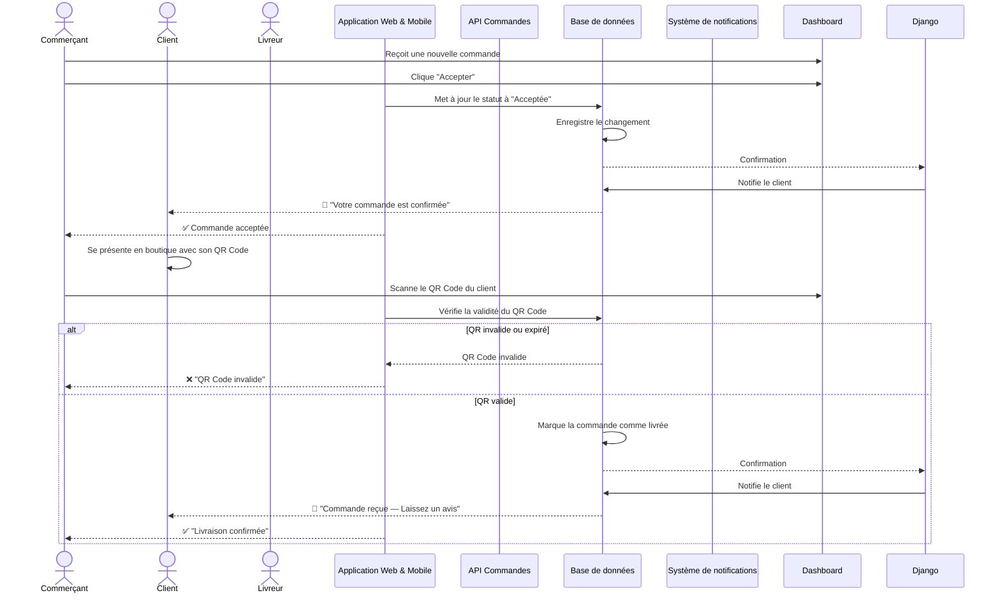
```mermaid
sequenceDiagram
    actor Commerçant
    actor Client
    actor Livreur
    participant App as Application Web & Mobile
    participant App as Application Web & Mobile
    participant Serveur as API Commandes
    participant BD as Base de données
    participant Notif as Système de notifications

    Commerçant->>Dashboard: Reçoit une nouvelle commande
    Commerçant->>Dashboard: Clique "Accepter"
    App->>BD: Met à jour le statut à "Acceptée"
    BD->>BD: Enregistre le changement
    BD-->>Django: Confirmation
    Django->>BD: Notifie le client
    BD-->>Client: 🔔 "Votre commande est confirmée"
    App-->>Commerçant: ✅ Commande acceptée

    Client->>Client: Se présente en boutique avec son QR Code
    Commerçant->>Dashboard: Scanne le QR Code du client
    App->>BD: Vérifie la validité du QR Code
    alt QR invalide ou expiré
        BD-->>App: QR Code invalide
        App-->>Commerçant: ❌ "QR Code invalide"
    else QR valide
        BD->>BD: Marque la commande comme livrée
        BD-->>Django: Confirmation
        Django->>BD: Notifie le client
        BD-->>Client: 🔔 "Commande reçue — Laissez un avis"
        App-->>Commerçant: ✅ "Livraison confirmée"
    end
```

---

### RELEASE 3 : Expérience Sociale & Contenu

#### Sprint 5 : Interaction Sociale & Découverte

**Workflow : Publication d'un Reel ou d'une Story**

**1. Description des étapes :**

| Étape | Acteur / Système Source | Action / Message | Cible |
|---|---|---|---|
| 1 | **Commerçant** | Sélectionne une vidéo (max 60s) ou une image | **Dashboard** |
| 2 | **App** | Envoie le fichier pour hébergement | **Cloudinary** |
| 3 | **Cloudinary** | Transcode la vidéo et génère une miniature | **Cloudinary** |
| 4 | **Cloudinary** | Lien sécurisé du contenu hébergé | **App** |
| 5 | **App** | Envoie les métadonnées + lien du fichier | **BD** |
| 6 | **App** | Valide le format et la taille | **App** |
| - | *Système* | *Condition : Publication d'un Reel (permanent)* | - |
| 7 | **BD** | Enregistre le Reel avec le lien Cloudinary | **BD** |
| 8 | **BD** | Reel ID créé | **Django** |
| 9 | **BD** | Confirmation | **App** |
| 10 | **App** | ✅ "Reel publié avec succès" | **Commerçant** |
| - | *Système* | *Sinon : Publication d'une Story (éphémère)* | - |
| 11 | **BD** | Enregistre la Story avec expiration = maintenant + 24h | **BD** |
| 12 | **BD** | Story ID créée | **Django** |
| 13 | **BD** | Confirmation | **App** |
| 14 | **App** | ✅ "Story publiée — Expire dans 24 heures" | **Commerçant** |

**2. Diagramme de séquence :**

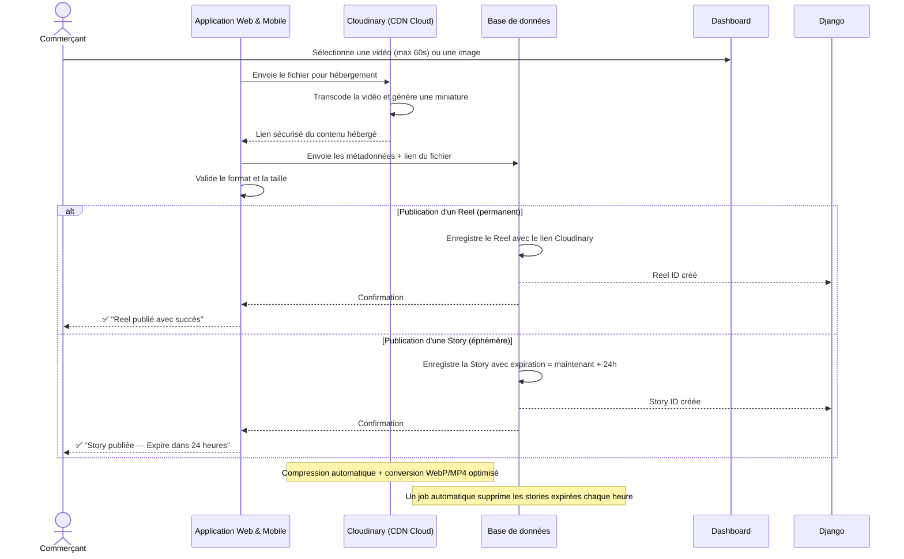
```mermaid
sequenceDiagram
    actor Commerçant
    participant App as Application Web & Mobile
    participant Cloudinary as Cloudinary (CDN Cloud)
    participant BD as Base de données (Supabase)
    participant BD as Base de données

    Commerçant->>Dashboard: Sélectionne une vidéo (max 60s) ou une image
    App->>Cloudinary: Envoie le fichier pour hébergement
    Cloudinary->>Cloudinary: Transcode la vidéo et génère une miniature
    Cloudinary-->>App: Lien sécurisé du contenu hébergé
    App->>BD: Envoie les métadonnées + lien du fichier
    App->>App: Valide le format et la taille

    alt Publication d'un Reel (permanent)
        BD->>BD: Enregistre le Reel avec le lien Cloudinary
        BD-->>Django: Reel ID créé
        BD-->>App: Confirmation
        App-->>Commerçant: ✅ "Reel publié avec succès"
    else Publication d'une Story (éphémère)
        BD->>BD: Enregistre la Story avec expiration = maintenant + 24h
        BD-->>Django: Story ID créée
        BD-->>App: Confirmation
        App-->>Commerçant: ✅ "Story publiée — Expire dans 24 heures"
    end

    Note over Cloudinary: Compression automatique + conversion WebP/MP4 optimisé
    Note over BD: Un job automatique supprime les stories expirées chaque heure
```

---

**Workflow : Interactions sur le contenu (Like, Sauvegarde, Partage)**

**1. Description des étapes :**

| Étape | Acteur / Système Source | Action / Message | Cible |
|---|---|---|---|
| 1 | **Client** | Appuie deux fois sur la vidéo (Like) | **Application** |
| 2 | **App** | Affiche l'animation de cœur immédiatement | **Client** |
| 3 | **App** | Enregistre l'interaction en arrière-plan | **BD** |
| 4 | **BD** | Vérifie si le like existe déjà | **BD** |
| - | *Système* | *Condition : Like déjà donné → retrait* | - |
| 5 | **BD** | Supprime le like et décrémente le compteur | **BD** |
| 6 | **BD** | Like retiré | **Django** |
| 7 | **BD** | Like annulé | **App** |
| - | *Système* | *Sinon : Nouveau like → ajout* | - |
| 8 | **BD** | Ajoute le like et incrémente le compteur | **BD** |
| 9 | **BD** | Like enregistré | **Django** |
| 10 | **BD** | Like confirmé | **App** |

**2. Diagramme de séquence :**

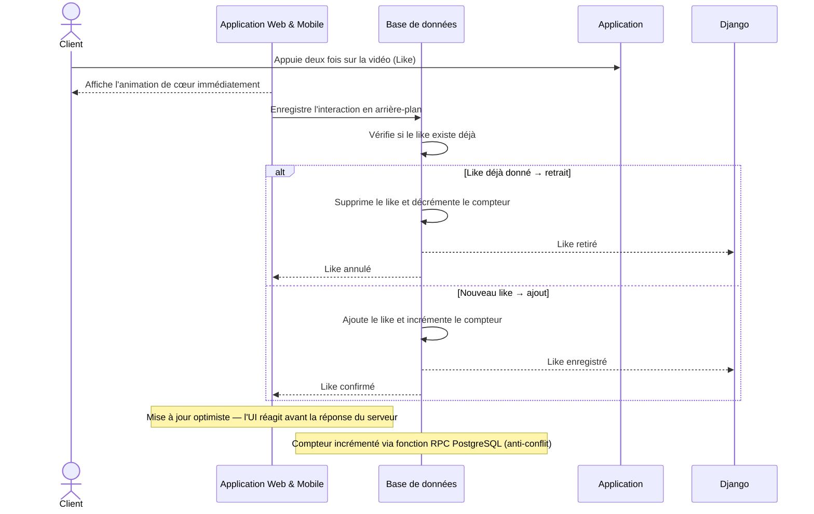
```mermaid
sequenceDiagram
    actor Client
    participant App as Application Web & Mobile
    participant BD as Base de données (Supabase)
    participant BD as Base de données

    Client->>Application: Appuie deux fois sur la vidéo (Like)
    App-->>Client: Affiche l'animation de cœur immédiatement
    App->>BD: Enregistre l'interaction en arrière-plan
    BD->>BD: Vérifie si le like existe déjà

    alt Like déjà donné → retrait
        BD->>BD: Supprime le like et décrémente le compteur
        BD-->>Django: Like retiré
        BD-->>App: Like annulé
    else Nouveau like → ajout
        BD->>BD: Ajoute le like et incrémente le compteur
        BD-->>Django: Like enregistré
        BD-->>App: Like confirmé
    end

    Note over App: Mise à jour optimiste — l'UI réagit avant la réponse du serveur
    Note over BD: Compteur incrémenté via fonction RPC PostgreSQL (anti-conflit)
```

---

#### Sprint 6 : Avis & Messagerie Client

**Workflow : Chat en temps réel (Client ↔ Commerçant)**

**1. Description des étapes :**

| Étape | Acteur / Système Source | Action / Message | Cible |
|---|---|---|---|
| 1 | **Client** | Écrit et envoie un message | **AppClient** |
| 2 | **AppClient** | Transmet le message via WebSocket | **Supabase** |
| 3 | **Supabase** | Enregistre le message dans la conversation | **BD** |
| 4 | **BD** | Message sauvegardé | **Supabase** |
| 5 | **Supabase** | Diffuse le message en temps réel | **AppPro** |
| 6 | **AppPro** | 💬 Message reçu instantanément | **Commerçant** |
| 7 | **Commerçant** | Rédige et envoie une réponse | **AppPro** |
| 8 | **AppPro** | Transmet la réponse via WebSocket | **Supabase** |
| 9 | **Supabase** | Enregistre la réponse | **BD** |
| 10 | **BD** | Réponse sauvegardée | **Supabase** |
| 11 | **Supabase** | Diffuse la réponse en temps réel | **AppClient** |
| 12 | **AppClient** | 💬 Réponse reçue instantanément | **Client** |

**2. Diagramme de séquence :**

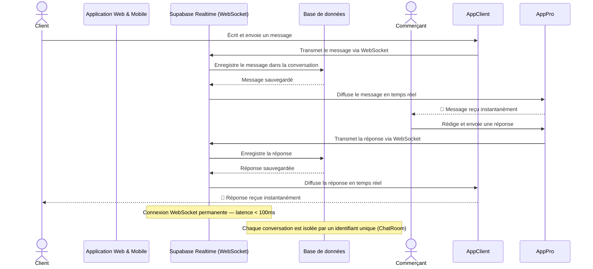
```mermaid
sequenceDiagram
    actor Client
    participant App as Application Web & Mobile
    participant Supabase as Supabase Realtime (WebSocket)
    participant BD as Base de données
    participant App as Application Web & Mobile
    actor Commerçant

    Client->>AppClient: Écrit et envoie un message
    AppClient->>Supabase: Transmet le message via WebSocket
    Supabase->>BD: Enregistre le message dans la conversation
    BD-->>Supabase: Message sauvegardé
    Supabase->>AppPro: Diffuse le message en temps réel
    AppPro-->>Commerçant: 💬 Message reçu instantanément

    Commerçant->>AppPro: Rédige et envoie une réponse
    AppPro->>Supabase: Transmet la réponse via WebSocket
    Supabase->>BD: Enregistre la réponse
    BD-->>Supabase: Réponse sauvegardée
    Supabase->>AppClient: Diffuse la réponse en temps réel
    AppClient-->>Client: 💬 Réponse reçue instantanément

    Note over Supabase: Connexion WebSocket permanente — latence < 100ms
    Note over BD: Chaque conversation est isolée par un identifiant unique (ChatRoom)
```

---

**Workflow : Dépôt d'un avis et réponse IA**

**1. Description des étapes :**

| Étape | Acteur / Système Source | Action / Message | Cible |
|---|---|---|---|
| 1 | **Client** | Note la prestation (1-5 étoiles) et écrit un commentaire | **Application** |
| 2 | **App** | Envoie l'avis | **BD** |
| 3 | **BD** | Vérifie qu'une transaction réelle a eu lieu entre les deux parties | **BD** |
| - | *Système* | *Condition : Aucune transaction vérifiée* | - |
| 4 | **BD** | Pas de commande ou réservation confirmée | **Django** |
| 5 | **BD** | "Vous devez avoir effectué un achat pour laisser un avis" | **App** |
| 6 | **App** | ❌ Affiche le message d'erreur | **Client** |
| - | *Système* | *Sinon : Transaction confirmée* | - |
| 7 | **BD** | Enregistre l'avis | **BD** |
| 8 | **BD** | Recalcule la note moyenne de la boutique | **BD** |
| 9 | **BD** | Nouvelle note moyenne | **Django** |
| 10 | **BD** | 🔔 "Nouvel avis reçu — 5 étoiles" | **Commerçant** |
| 11 | **BD** | Avis publié | **App** |
| 12 | **App** | ✅ "Merci pour votre avis !" | **Client** |

**2. Diagramme de séquence :**

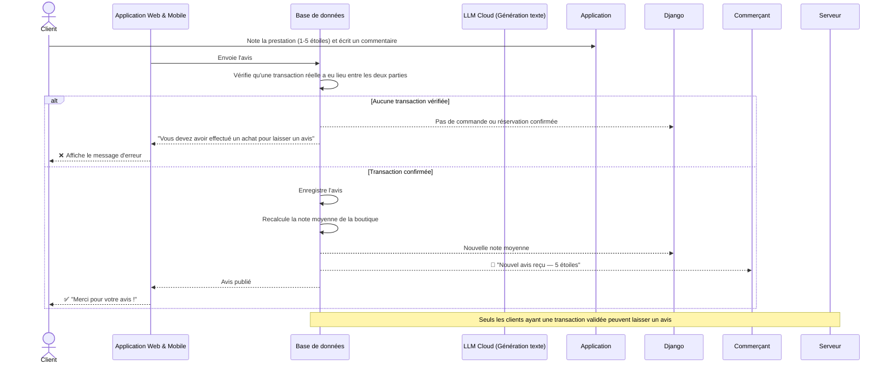
```mermaid
sequenceDiagram
    actor Client
    participant App as Application Web & Mobile
    participant BD as Base de données (Supabase)
    participant BD as Base de données
    participant LLM as LLM Cloud (Génération texte)

    Client->>Application: Note la prestation (1-5 étoiles) et écrit un commentaire
    App->>BD: Envoie l'avis
    BD->>BD: Vérifie qu'une transaction réelle a eu lieu entre les deux parties
    alt Aucune transaction vérifiée
        BD-->>Django: Pas de commande ou réservation confirmée
        BD-->>App: "Vous devez avoir effectué un achat pour laisser un avis"
        App-->>Client: ❌ Affiche le message d'erreur
    else Transaction confirmée
        BD->>BD: Enregistre l'avis
        BD->>BD: Recalcule la note moyenne de la boutique
        BD-->>Django: Nouvelle note moyenne
        BD-->>Commerçant: 🔔 "Nouvel avis reçu — 5 étoiles"
        BD-->>App: Avis publié
        App-->>Client: ✅ "Merci pour votre avis !"
    end

    Note over Serveur,BD: Seuls les clients ayant une transaction validée peuvent laisser un avis
```

---

### RELEASE 4 : Intelligence Artificielle & Recherche Avancée

#### Sprint 7 : Moteurs de Recherche Intelligente

**Workflow : Recherche intelligente (texte Darija / Français)**

**1. Description des étapes :**

| Étape | Acteur / Système Source | Action / Message | Cible |
|---|---|---|---|
| 1 | **Client** | Tape une recherche (ex : "حلاق" ou "coiffeur") | **Application** |
| 2 | **App** | Envoie le texte de recherche brut | **LLM** |
| 3 | **LLM** | Nettoie et normalise le texte saisi | **LLM** |
| 4 | **App** | Envoie le texte pour traduction Darija → Français | **LLM** |
| 5 | **LLM** | Terme traduit et normalisé (ex : "salon de coiffure") | **App** |
| 6 | **App** | Demande la conversion du texte en vecteur numérique | **LLM** |
| 7 | **LLM** | Vecteur de représentation sémantique | **App** |
| 8 | **App** | Recherche les boutiques les plus proches (distance cosinus) | **BD** |
| 9 | **BD** | Résultats classés par pertinence sémantique | **ServeurIA** |
| 10 | **BD** | Liste des boutiques correspondantes | **App** |
| 11 | **App** | ✅ Affiche les résultats triés par pertinence | **Client** |

**2. Diagramme de séquence :**

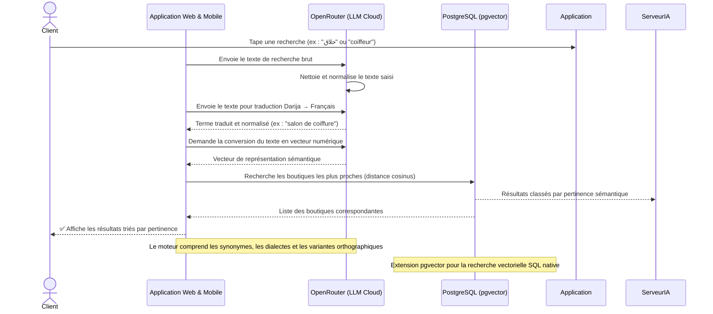
```mermaid
sequenceDiagram
    actor Client
    participant App as Application Web & Mobile
    participant LLM as OpenRouter (LLM Cloud)
    participant LLM as OpenRouter (LLM Cloud)
    participant BD as PostgreSQL (pgvector)

    Client->>Application: Tape une recherche (ex : "حلاق" ou "coiffeur")
    App->>LLM: Envoie le texte de recherche brut
    LLM->>LLM: Nettoie et normalise le texte saisi
    App->>LLM: Envoie le texte pour traduction Darija → Français
    LLM-->>App: Terme traduit et normalisé (ex : "salon de coiffure")
    App->>LLM: Demande la conversion du texte en vecteur numérique
    LLM-->>App: Vecteur de représentation sémantique
    App->>BD: Recherche les boutiques les plus proches (distance cosinus)
    BD-->>ServeurIA: Résultats classés par pertinence sémantique
    BD-->>App: Liste des boutiques correspondantes
    App-->>Client: ✅ Affiche les résultats triés par pertinence

    Note over App,LLM: Le moteur comprend les synonymes, les dialectes et les variantes orthographiques
    Note over BD: Extension pgvector pour la recherche vectorielle SQL native
```

---

**Workflow : Recherche par photo (Vision IA)**

**1. Description des étapes :**

| Étape | Acteur / Système Source | Action / Message | Cible |
|---|---|---|---|
| 1 | **Client** | Prend une photo d'un plat ou d'un vêtement | **Application** |
| 2 | **App** | Compresse et encode l'image en base64 | **App** |
| 3 | **App** | Envoie l'image pour analyse | **LLM** |
| 4 | **App** | Soumet l'image au modèle de vision | **GroqVision** |
| 5 | **GroqVision** | Analyse l'image et identifie les objets | **GroqVision** |
| 6 | **GroqVision** | Description des objets identifiés (ex : "Pizza Margherita") | **ServeurIA** |
| - | *Système* | *Condition : Objet non reconnu* | - |
| 7 | **BD** | "Impossible d'identifier l'objet" | **App** |
| 8 | **App** | ❌ Propose la recherche manuelle | **Client** |
| - | *Système* | *Sinon : Objet reconnu* | - |
| 9 | **App** | Recherche en texte intégral avec les mots-clés extraits | **BD** |
| 10 | **BD** | Boutiques et produits correspondants | **ServeurIA** |
| 11 | **BD** | Résultats de recherche | **App** |
| 12 | **App** | ✅ Affiche les boutiques qui vendent cet objet | **Client** |

**2. Diagramme de séquence :**

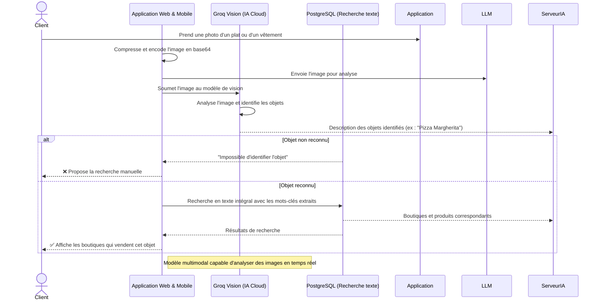
```mermaid
sequenceDiagram
    actor Client
    participant App as Application Web & Mobile
    participant GroqVision as Groq Vision (IA Cloud)
    participant GroqVision as Groq Vision (IA Cloud)
    participant BD as PostgreSQL (Recherche texte)

    Client->>Application: Prend une photo d'un plat ou d'un vêtement
    App->>App: Compresse et encode l'image en base64
    App->>LLM: Envoie l'image pour analyse
    App->>GroqVision: Soumet l'image au modèle de vision
    GroqVision->>GroqVision: Analyse l'image et identifie les objets
    GroqVision-->>ServeurIA: Description des objets identifiés (ex : "Pizza Margherita")
    alt Objet non reconnu
        BD-->>App: "Impossible d'identifier l'objet"
        App-->>Client: ❌ Propose la recherche manuelle
    else Objet reconnu
        App->>BD: Recherche en texte intégral avec les mots-clés extraits
        BD-->>ServeurIA: Boutiques et produits correspondants
        BD-->>App: Résultats de recherche
        App-->>Client: ✅ Affiche les boutiques qui vendent cet objet
    end

    Note over GroqVision: Modèle multimodal capable d'analyser des images en temps réel
```

---

**Workflow : Exploration géographique et filtres**

**1. Description des étapes :**

| Étape | Acteur / Système Source | Action / Message | Cible |
|---|---|---|---|
| 1 | **Client** | Active sa localisation GPS | **Application** |
| 2 | **Client** | Applique des filtres (catégorie, distance < 5km) | **Application** |
| 3 | **App** | Envoie la position GPS et les filtres choisis | **BD** |
| 4 | **BD** | Recherche les boutiques dans le rayon demandé | **BD** |
| 5 | **BD** | Boutiques trouvées avec distances calculées | **Django** |
| 6 | **App** | Trie par distance croissante | **App** |
| 7 | **BD** | Résultats filtrés avec coordonnées | **App** |
| 8 | **App** | ✅ Affiche les boutiques sur la carte interactive | **Client** |

**2. Diagramme de séquence :**

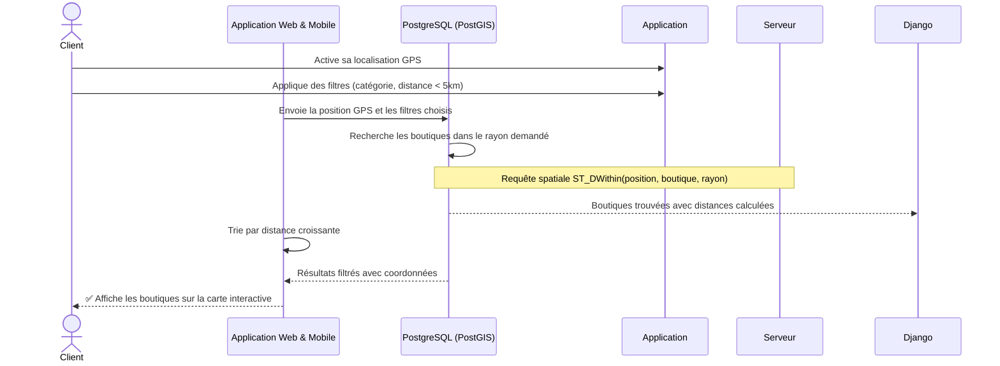
```mermaid
sequenceDiagram
    actor Client
    participant App as Application Web & Mobile
    participant BD as Base de données (Supabase/PostGIS)
    participant BD as PostgreSQL (PostGIS)

    Client->>Application: Active sa localisation GPS
    Client->>Application: Applique des filtres (catégorie, distance < 5km)
    App->>BD: Envoie la position GPS et les filtres choisis
    BD->>BD: Recherche les boutiques dans le rayon demandé
    Note over Serveur,BD: Requête spatiale ST_DWithin(position, boutique, rayon)
    BD-->>Django: Boutiques trouvées avec distances calculées
    App->>App: Trie par distance croissante
    BD-->>App: Résultats filtrés avec coordonnées
    App-->>Client: ✅ Affiche les boutiques sur la carte interactive
```

---

#### Sprint 8 : Assistant Conversationnel et Analytics IA

**Workflow : Assistant IA conversationnel (Sales Advisor)**

**1. Description des étapes :**

| Étape | Acteur / Système Source | Action / Message | Cible |
|---|---|---|---|
| 1 | **Client** | Pose une question (ex : "Quels sont mes produits les plus vendus ?") | **App** |
| 2 | **App** | Envoie la question | **LLM** |
| 3 | **LLM** | Analyse l'intention de la question | **LLM** |
| 4 | **App** | Recherche les données pertinentes (produits, commandes, stock) | **BD** |
| 5 | **BD** | Données contextuelles de la boutique | **ServeurIA** |
| 6 | **LLM** | Construit le prompt avec le contexte réel | **LLM** |
| 7 | **App** | Envoie le prompt enrichi au modèle IA | **LLM** |
| 8 | **LLM** | Génère la réponse en streaming (mot par mot) | **App** |
| 9 | **BD** | Transmet la réponse progressivement | **App** |
| 10 | **App** | ✅ Affiche la réponse mot par mot (effet typewriter) | **Client** |

**2. Diagramme de séquence :**

```mermaid
sequenceDiagram
    actor Client / Commerçant
    participant App as Application Web & Mobile
    participant ServeurIA as API Assistant IA
    participant BD as PostgreSQL (pgvector - RAG)
    participant LLM as OpenRouter (LLM Cloud)

    Client->>App: Pose une question (ex : "Quels sont mes produits les plus vendus ?")
    App->>LLM: Envoie la question
    LLM->>LLM: Analyse l'intention de la question
    App->>BD: Recherche les données pertinentes (produits, commandes, stock)
    BD-->>ServeurIA: Données contextuelles de la boutique
    LLM->>LLM: Construit le prompt avec le contexte réel
    App->>LLM: Envoie le prompt enrichi au modèle IA
    LLM-->>App: Génère la réponse en streaming (mot par mot)
    BD-->>App: Transmet la réponse progressivement
    App-->>Client: ✅ Affiche la réponse mot par mot (effet typewriter)

    Note over ServeurIA,BD: RAG : l'IA se base sur les données réelles de la boutique, pas de réponse inventée
    Note over LLM: Streaming via Server-Sent Events — réponse affichée en temps réel
```

---

**Workflow : Analyse de sentiment des commentaires (IA)**

**1. Description des étapes :**

| Étape | Acteur / Système Source | Action / Message | Cible |
|---|---|---|---|
| 1 | **Commerçant** | Ouvre la section "Avis clients" | **Dashboard** |
| 2 | **App** | Demande les avis de la boutique | **BD** |
| 3 | **BD** | Récupère tous les avis non analysés | **BD** |
| 4 | **BD** | Liste des avis avec texte brut | **Django** |
| 5 | **App** | Envoie les textes des avis pour analyse de sentiment | **IA** |
| 6 | **IA** | Analyse chaque commentaire (positif, neutre, négatif) | **IA** |
| 7 | **IA** | Extrait les thèmes récurrents (qualité, prix, service, propreté) | **IA** |
| 8 | **IA** | Identifie les suggestions d'amélioration | **IA** |
| 9 | **IA** | Résultats d'analyse (sentiment + thèmes + score par catégorie) | **App** |
| 10 | **BD** | Enregistre les résultats d'analyse pour chaque avis | **BD** |
| 11 | **BD** | Analyse sauvegardée | **Django** |
| 12 | **BD** | Résultats formatés avec statistiques | **App** |
| - | *Système* | *Condition : Majorité de commentaires négatifs détectés* | - |
| 13 | **App** | ⚠️ "Attention : baisse de satisfaction sur le thème Service" | **Commerçant** |
| 14 | **App** | Affiche des recommandations d'amélioration | **App** |
| - | *Système* | *Sinon : Commentaires globalement positifs* | - |
| 15 | **App** | ✅ Tableau de bord sentiment avec graphiques | **Commerçant** |

**2. Diagramme de séquence :**

```mermaid
sequenceDiagram
    actor Commerçant
    participant App as Application Web & Mobile
    participant BD as Base de données (Supabase)
    participant BD as Base de données
    participant IA as Moteur d'analyse IA (Groq / OpenRouter)

    Commerçant->>Dashboard: Ouvre la section "Avis clients"
    App->>BD: Demande les avis de la boutique
    BD->>BD: Récupère tous les avis non analysés
    BD-->>Django: Liste des avis avec texte brut

    App->>IA: Envoie les textes des avis pour analyse de sentiment
    IA->>IA: Analyse chaque commentaire (positif, neutre, négatif)
    IA->>IA: Extrait les thèmes récurrents (qualité, prix, service, propreté)
    IA->>IA: Identifie les suggestions d'amélioration
    IA-->>App: Résultats d'analyse (sentiment + thèmes + score par catégorie)

    BD->>BD: Enregistre les résultats d'analyse pour chaque avis
    BD-->>Django: Analyse sauvegardée
    BD-->>App: Résultats formatés avec statistiques

    alt Majorité de commentaires négatifs détectés
        App-->>Commerçant: ⚠️ "Attention : baisse de satisfaction sur le thème Service"
        App->>App: Affiche des recommandations d'amélioration
    else Commentaires globalement positifs
        App-->>Commerçant: ✅ Tableau de bord sentiment avec graphiques
    end

    Note over IA: L'IA identifie automatiquement les points forts et les axes d'amélioration
    Note over BD: L'historique des analyses permet de suivre l'évolution de la satisfaction dans le temps
```

---

**Workflow : Recommandation intelligente de promotions (IA)**

**1. Description des étapes :**

| Étape | Acteur / Système Source | Action / Message | Cible |
|---|---|---|---|
| 1 | **Commerçant** | Clique sur "Créer une promotion assistée par IA" | **Dashboard** |
| 2 | **App** | Demande une recommandation de promotion | **BD** |
| 3 | **BD** | Récupère les données de la boutique | **BD** |
| 4 | **BD** | Analyse les ventes des 30 derniers jours | **BD** |
| 5 | **BD** | Identifie les produits à faible rotation de stock | **BD** |
| 6 | **BD** | Récupère les tendances de la catégorie | **BD** |
| 7 | **BD** | Données commerciales complètes | **Django** |
| 8 | **App** | Envoie les données pour analyse et recommandation | **IA** |
| 9 | **IA** | Analyse les produits à écouler en priorité | **IA** |
| 10 | **IA** | Calcule le pourcentage de remise optimal | **IA** |
| 11 | **IA** | Propose une durée de promotion adaptée | **IA** |
| 12 | **IA** | Génère un texte promotionnel attractif | **IA** |
| 13 | **IA** | Recommandation complète (produits, remise %, durée, texte) | **App** |
| 14 | **BD** | Proposition de promotion pré-remplie | **App** |
| 15 | **App** | 📋 "Promotion suggérée par l'IA" | **Commerçant** |
| - | *Système* | *Condition : Commerçant accepte la suggestion* | - |
| 16 | **Commerçant** | Valide et publie la promotion | **Dashboard** |
| 17 | **App** | Enregistre la promotion | **BD** |
| 18 | **BD** | INSERT promotion avec dates de début et fin | **BD** |
| 19 | **BD** | Promotion créée | **Django** |
| 20 | **BD** | Confirmation | **App** |
| 21 | **App** | ✅ "Promotion publiée — Visible par les clients" | **Commerçant** |
| - | *Système* | *Sinon : Commerçant modifie la suggestion* | - |
| 22 | **Commerçant** | Ajuste les paramètres manuellement | **Dashboard** |
| 23 | **App** | Enregistre la version modifiée | **BD** |
| 24 | **BD** | INSERT promotion personnalisée | **BD** |
| 25 | **BD** | Promotion créée | **Django** |
| 26 | **App** | ✅ "Promotion personnalisée publiée" | **Commerçant** |

**2. Diagramme de séquence :**

```mermaid
sequenceDiagram
    actor Commerçant
    participant App as Application Web & Mobile
    participant BD as Base de données (Supabase)
    participant BD as Base de données
    participant IA as Moteur de recommandation IA (OpenRouter)

    Commerçant->>Dashboard: Clique sur "Créer une promotion assistée par IA"
    App->>BD: Demande une recommandation de promotion
    BD->>BD: Récupère les données de la boutique
    BD->>BD: Analyse les ventes des 30 derniers jours
    BD->>BD: Identifie les produits à faible rotation de stock
    BD->>BD: Récupère les tendances de la catégorie
    BD-->>Django: Données commerciales complètes

    App->>IA: Envoie les données pour analyse et recommandation
    IA->>IA: Analyse les produits à écouler en priorité
    IA->>IA: Calcule le pourcentage de remise optimal
    IA->>IA: Propose une durée de promotion adaptée
    IA->>IA: Génère un texte promotionnel attractif
    IA-->>App: Recommandation complète (produits, remise %, durée, texte)

    BD-->>App: Proposition de promotion pré-remplie
    App-->>Commerçant: 📋 "Promotion suggérée par l'IA"

    alt Commerçant accepte la suggestion
        Commerçant->>Dashboard: Valide et publie la promotion
        App->>BD: Enregistre la promotion
        BD->>BD: INSERT promotion avec dates de début et fin
        BD-->>Django: Promotion créée
        BD-->>App: Confirmation
        App-->>Commerçant: ✅ "Promotion publiée — Visible par les clients"
    else Commerçant modifie la suggestion
        Commerçant->>Dashboard: Ajuste les paramètres manuellement
        App->>BD: Enregistre la version modifiée
        BD->>BD: INSERT promotion personnalisée
        BD-->>Django: Promotion créée
        App-->>Commerçant: ✅ "Promotion personnalisée publiée"
    end

    Note over IA: L'IA recommande des remises basées sur les données réelles de vente (pas de suggestion aléatoire)
    Note over BD: Les promotions ont une date d'expiration automatique
```

---

**Workflow : Détection de fraude pour les commerçants (IA)**

**1. Description des étapes :**

| Étape | Acteur / Système Source | Action / Message | Cible |
|---|---|---|---|
| 1 | **Commerçant** | Crée une transaction (commande/réservation) | **App** |
| 2 | **App** | INSERT transaction (status = "pending") | **BD** |
| 3 | **BD** | Déclenche une analyse automatique de risque (Trigger) | **IA** |
| 4 | **IA** | Calcule le score de risque de fraude (0-100) | **IA** |
| - | *Système* | *Condition : Score de risque élevé (> 80)* | - |
| 5 | **IA** | Met à jour le statut à "blocked" et génère un rapport | **BD** |
| 6 | **BD** | webhook de fraude détectée | **Django** |
| 7 | **Django** | Alerte de fraude en temps réel (WebSocket) | **AdminPortal** |
| 8 | **AdminPortal** | 🚨 Alerte fraude à examiner d'urgence | **Administrateur** |
| 9 | **BD** | "Transaction suspendue — En cours de vérification" | **App** |
| 10 | **App** | ❌ Transaction bloquée temporairement | **Commerçant** |
| - | *Système* | *Sinon : Score de risque moyen (40-80)* | - |
| 11 | **IA** | Met à jour le statut à "suspected" | **BD** |
| 12 | **BD** | webhook pour suivi de transaction | **Django** |
| 13 | **Django** | Notification discrète de surveillance | **AdminPortal** |
| 14 | **BD** | Transaction acceptée avec avertissement | **App** |
| 15 | **App** | ✅ Transaction enregistrée (à surveiller) | **Commerçant** |
| - | *Système* | *Sinon : Score de risque faible (< 40)* | - |
| 16 | **IA** | Enregistre la transaction normalement | **BD** |
| 17 | **BD** | Confirmation d'insertion | **App** |
| 18 | **App** | ✅ Transaction validée avec succès | **Commerçant** |

**2. Diagramme de séquence :**

```mermaid
sequenceDiagram
    actor Commerçant
    actor Administrateur
    participant App as Application Web & Mobile
    participant BD as Base de données (Supabase)
    participant IA as Moteur de détection IA (Groq)
    participant AdminPortal as Dashboard Admin (SaaS)
    participant Django as Backend Django

    Commerçant->>App: Crée une transaction (commande/réservation)
    App->>BD: INSERT transaction (status = "pending")
    BD->>IA: Déclenche une analyse automatique de risque (Trigger)
    IA->>IA: Calcule le score de risque de fraude (0-100)
    
    alt Score de risque élevé (> 80)
        IA->>BD: Met à jour le statut à "blocked" et génère un rapport
        BD->>Django: webhook de fraude détectée
        Django->>AdminPortal: Alerte de fraude en temps réel (WebSocket)
        AdminPortal-->>Administrateur: 🚨 Alerte fraude à examiner d'urgence
        BD-->>App: "Transaction suspendue — En cours de vérification"
        App-->>Commerçant: ❌ Transaction bloquée temporairement
    else Score de risque moyen (40-80)
        IA->>BD: Met à jour le statut à "suspected"
        BD->>Django: webhook pour suivi de transaction
        Django->>AdminPortal: Notification discrète de surveillance
        BD-->>App: Transaction acceptée avec avertissement
        App-->>Commerçant: ✅ Transaction enregistrée (à surveiller)
    else Score de risque faible (< 40)
        IA->>BD: Enregistre la transaction normalement
        BD-->>App: Confirmation d'insertion
        App-->>Commerçant: ✅ Transaction validée avec succès
    end
```

---

### RELEASE 5 : Administration & Support SaaS

#### Sprint 9 : Modération & Tableaux de bord

**Workflow : Tableau de bord analytique**

**1. Description des étapes :**

| Étape | Acteur / Système Source | Action / Message | Cible |
|---|---|---|---|
| 1 | **Commerçant** | Ouvre l'onglet statistiques | **Dashboard** |
| 2 | **App** | Demande les métriques de la période choisie | **BD** |
| 3 | **BD** | Calcule le chiffre d'affaires (SUM des commandes complétées) | **BD** |
| 4 | **BD** | Compte le nombre de commandes et réservations | **BD** |
| 5 | **BD** | Calcule le nombre de vues du profil | **BD** |
| 6 | **BD** | Calcule le taux de conversion (commandes / vues) | **BD** |
| 7 | **BD** | Données agrégées par jour/semaine/mois | **Django** |
| 8 | **BD** | Métriques formatées pour les graphiques | **App** |
| 9 | **App** | ✅ Affiche les graphiques et indicateurs clés | **Commerçant** |

**2. Diagramme de séquence :**

```mermaid
sequenceDiagram
    actor Commerçant
    participant App as Application Web & Mobile
    participant BD as Base de données (Supabase)
    participant BD as PostgreSQL (Agrégation SQL)

    Commerçant->>Dashboard: Ouvre l'onglet statistiques
    App->>BD: Demande les métriques de la période choisie
    BD->>BD: Calcule le chiffre d'affaires (SUM des commandes complétées)
    BD->>BD: Compte le nombre de commandes et réservations
    BD->>BD: Calcule le nombre de vues du profil
    BD->>BD: Calcule le taux de conversion (commandes / vues)
    BD-->>Django: Données agrégées par jour/semaine/mois
    BD-->>App: Métriques formatées pour les graphiques
    App-->>Commerçant: ✅ Affiche les graphiques et indicateurs clés

    Note over Serveur,BD: Requêtes SQL d'agrégation : SUM, COUNT, AVG, GROUP BY période
```

---

**Workflow : Signalement et modération de contenu**

**1. Description des étapes :**

| Étape | Acteur / Système Source | Action / Message | Cible |
|---|---|---|---|
| 1 | **Client** | Signale un contenu inapproprié (Reel/Story/Avis) | **App** |
| 2 | **App** | INSERT signalement (content_id, reason) | **BD** |
| 3 | **BD** | Compte le nombre total de signalements | **BD** |
| - | *Système* | *Condition : Seuil de signalements dépassé (> 3)* | - |
| 4 | **BD** | Masque automatiquement le contenu (status = "hidden") | **BD** |
| 5 | **BD** | Webhook de modération requise | **Django** |
| 6 | **Django** | Notification de contenu masqué | **AdminPortal** |
| 7 | **AdminPortal** | 🔔 Nouveau contenu masqué à valider | **Administrateur** |
| - | *Système* | *Sinon : Seuil non atteint* | - |
| 8 | **BD** | Signalement enregistré avec succès | **App** |
| 9 | **BD** | Confirmation du traitement | **App** |
| 10 | **App** | ✅ "Merci pour votre signalement — En cours de traitement" | **Client** |

**2. Diagramme de séquence :**

```mermaid
sequenceDiagram
    actor Client
    actor Administrateur
    participant App as Application Web & Mobile
    participant BD as Base de données (Supabase)
    participant AdminPortal as Dashboard Admin (SaaS)
    participant Django as Backend Django

    Client->>App: Signale un contenu inapproprié (Reel/Story/Avis)
    App->>BD: INSERT signalement (content_id, reason)
    BD->>BD: Compte le nombre total de signalements
    
    alt Seuil de signalements dépassé (> 3)
        BD->>BD: Masque automatiquement le contenu (status = "hidden")
        BD->>Django: Webhook de modération requise
        Django->>AdminPortal: Notification de contenu masqué
        AdminPortal-->>Administrateur: 🔔 Nouveau contenu masqué à valider
    else Seuil non atteint
        BD-->>App: Signalement enregistré avec succès
    end
    
    BD-->>App: Confirmation du traitement
    App-->>Client: ✅ "Merci pour votre signalement — En cours de traitement"
```

---

#### Sprint 10 : Support Client & Notifications

**Workflow : Gestion des utilisateurs et tickets de support**

**1. Description des étapes :**

| Étape | Acteur / Système Source | Action / Message | Cible |
|---|---|---|---|
| 1 | **Administrateur** | Recherche un utilisateur suspect ou signalé | **AdminPortal** |
| 2 | **AdminPortal** | GET /api/admin/users/{id} | **Django** |
| 3 | **Django** | Query profil, transactions & signalements | **BD** |
| 4 | **BD** | Données complètes de l'utilisateur | **Django** |
| 5 | **Django** | Affiche la fiche utilisateur | **AdminPortal** |
| 6 | **Administrateur** | Clique "Suspendre le compte" (indique le motif) | **AdminPortal** |
| 7 | **AdminPortal** | POST /api/admin/users/{id}/suspend | **Django** |
| 8 | **Django** | UPDATE users SET status = "suspended", reason = {motif} | **BD** |
| 9 | **BD** | Confirmation de suspension | **Django** |
| 10 | **Django** | Révoque toutes les sessions Supabase (User Session Revoke) | **BD** |
| 11 | **BD** | Sessions révoquées | **Django** |
| 12 | **Django** | Suspension confirmée | **AdminPortal** |
| 13 | **AdminPortal** | ✅ "Compte suspendu — Utilisateur déconnecté immédiatement" | **Administrateur** |

**2. Diagramme de séquence :**

```mermaid
sequenceDiagram
    actor Administrateur
    participant AdminPortal as Dashboard Admin (SaaS)
    participant Django as Backend Django
    participant BD as Base de données (Supabase)

    Administrateur->>AdminPortal: Recherche un utilisateur suspect ou signalé
    AdminPortal->>Django: GET /api/admin/users/{id}
    Django->>BD: Query profil, transactions & signalements
    BD-->>Django: Données complètes de l'utilisateur
    Django-->>AdminPortal: Affiche la fiche utilisateur
    
    Administrateur->>AdminPortal: Clique "Suspendre le compte" (indique le motif)
    AdminPortal->>Django: POST /api/admin/users/{id}/suspend
    Django->>BD: UPDATE users SET status = "suspended", reason = {motif}
    BD-->>Django: Confirmation de suspension
    Django->>BD: Révoque toutes les sessions Supabase (User Session Revoke)
    BD-->>Django: Sessions révoquées
    Django-->>AdminPortal: Suspension confirmée
    AdminPortal-->>Administrateur: ✅ "Compte suspendu — Utilisateur déconnecté immédiatement"
```

---

**Workflow : Notifications en temps réel**

**1. Description des étapes :**

| Étape | Acteur / Système Source | Action / Message | Cible |
|---|---|---|---|
| 1 | **BD** | Trigger PostgreSQL détecte un événement (insert/update) | **BD** |
| 2 | **BD** | Diffuse l'événement sur le canal concerné (realtime payload) | **Realtime** |
| 3 | **Realtime** | Pousse la notification via WebSocket (latence < 100ms) | **App** |
| 4 | **App** | 🔔 Notification affichée (bannière / badge) | **Client/Commerçant** |

**2. Diagramme de séquence :**

```mermaid
sequenceDiagram
    participant BD as Base de données (Supabase)
    participant Realtime as Supabase Realtime (WebSocket)
    participant App as Application Web & Mobile

    BD->>BD: Trigger PostgreSQL détecte un événement (insert/update)
    BD->>Realtime: Diffuse l'événement sur le canal concerné (realtime payload)
    Realtime->>App: Pousse la notification via WebSocket (latence < 100ms)
    App-->>Client/Commerçant: 🔔 Notification affichée (bannière / badge)
```

---

