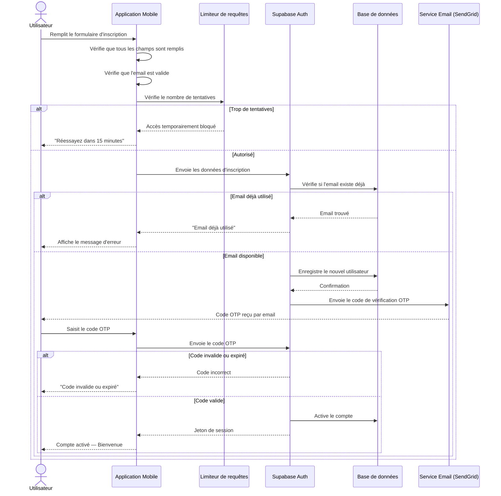
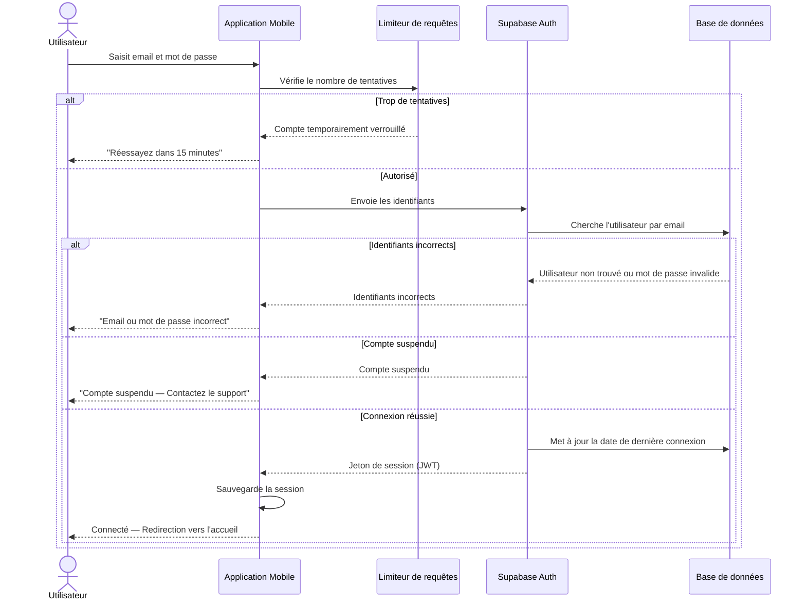
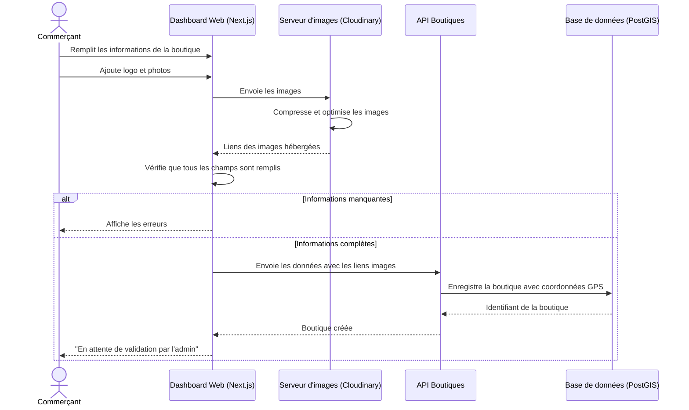
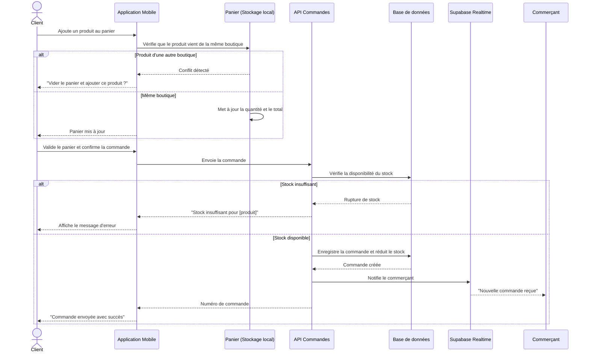
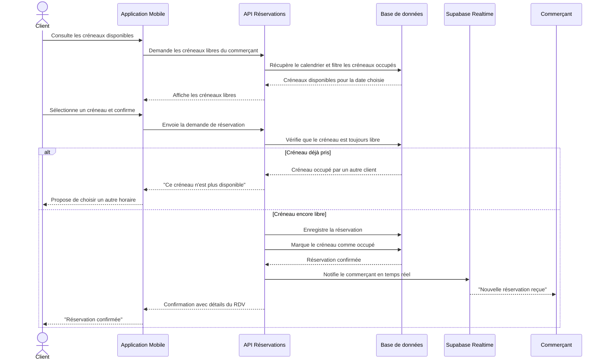

## 3.5 Conception

### 3.5.1 Conception de Sprint 1 — Release 1 (Authentification)

#### 3.5.1.1 Diagramme de cas d'utilisation de Sprint 1

La figure ci-dessous illustre le diagramme des cas d'utilisation du premier sprint.

> *[Figure : Diagramme de cas d'utilisation Sprint 1 — Authentification]*

#### 3.5.1.2 Diagramme de séquence de Sprint 1

**Diagramme de séquence : Inscription d'un utilisateur**

> *[Figure : Diagramme de séquence — Inscription]*

**Diagramme de séquence : Connexion d'un utilisateur**

> *[Figure : Diagramme de séquence — Connexion]*

---

### 3.5.2 Conception de Sprint 1 — Release 2 (Gestion des Boutiques)

#### 3.5.2.1 Diagramme de cas d'utilisation de Sprint 1 (Release 2)

La figure ci-dessous illustre le diagramme des cas d'utilisation du premier sprint de la deuxième release.

> *[Figure : Diagramme de cas d'utilisation — Gestion des Boutiques]*

**Description textuelle du cas d'utilisation « Créer une boutique »**

| Cas d'utilisation | Créer une boutique |
|-------------------|--------------------|
| **Acteurs** | Commerçant PRO |
| **Pré-condition** | Le commerçant est connecté et son compte est actif. |
| **Post-condition** | La boutique est créée avec le statut « En attente de validation ». Les informations et photos sont sauvegardées. |
| **Scénario principal** | 1. Le commerçant remplit le formulaire (nom, catégorie, adresse, coordonnées GPS). 2. Il ajoute le logo et les photos de la boutique. 3. L'application vérifie que tous les champs obligatoires sont remplis. 4. Si les données sont valides, les images sont envoyées au serveur d'images (Cloudinary). 5. Le serveur Cloudinary compresse et héberge les images. 6. L'application envoie les données complètes (avec liens images) au serveur. 7. Le serveur enregistre la boutique dans la base de données avec le statut « En attente ». 8. Le commerçant reçoit une confirmation. |
| **Scénario alternatif** | Données incomplètes ou invalides → l'application affiche un message d'erreur avant d'envoyer la requête. |

*Tableau : Description textuelle du cas « Créer une boutique »*

**Description textuelle du cas d'utilisation « Valider une boutique » (Admin)**

| Cas d'utilisation | Valider une boutique |
|-------------------|---------------------|
| **Acteurs** | Administrateur |
| **Pré-condition** | L'administrateur est connecté. Des boutiques sont en attente de validation. |
| **Post-condition** | La boutique est approuvée (visible publiquement) ou rejetée. Le commerçant est notifié. |
| **Scénario principal** | 1. L'administrateur consulte la liste des boutiques en attente. 2. Il examine les informations et les documents soumis. 3. Il clique sur « Approuver » ou « Rejeter » avec un motif. 4. Le serveur met à jour le statut de la boutique. 5. Une notification est envoyée au commerçant en temps réel. |
| **Scénario alternatif** | L'administrateur n'a pas les droits suffisants → accès refusé (403 Forbidden). |

*Tableau : Description textuelle du cas « Valider une boutique »*

#### 3.5.2.2 Diagramme de séquence de Sprint 1 (Release 2)

**Diagramme de séquence : Création d'une boutique**

> *[Figure : Diagramme de séquence — Création de boutique]*

---

### 3.5.3 Conception de Sprint 2 — Release 2 (Catalogue & Commandes)

#### 3.5.3.1 Diagramme de cas d'utilisation de Sprint 2

La figure ci-dessous illustre le diagramme des cas d'utilisation du deuxième sprint.

> *[Figure : Diagramme de cas d'utilisation — Catalogue & Commandes]*

**Description textuelle du cas d'utilisation « Passer une commande »**

| Cas d'utilisation | Passer une commande |
|-------------------|--------------------|
| **Acteurs** | Client |
| **Pré-condition** | Le client est connecté. La boutique est approuvée. Les produits sont en stock. |
| **Post-condition** | La commande est enregistrée. Le stock est mis à jour. Le commerçant est notifié. |
| **Scénario principal** | 1. Le client ajoute des produits au panier. 2. L'application vérifie que tous les produits viennent de la même boutique. 3. Le client valide le panier et choisit le mode de récupération. 4. L'application envoie la commande au serveur. 5. Le serveur vérifie la disponibilité du stock pour chaque article. 6. Si le stock est suffisant, la commande est enregistrée et le stock est décrémenté. 7. Le commerçant reçoit une notification en temps réel. 8. Le client reçoit la confirmation avec le numéro de commande. |
| **Scénario alternatif** | Stock insuffisant → le serveur retourne une erreur et la commande est annulée. Produits de boutiques différentes → l'application demande de vider le panier avant d'ajouter. |

*Tableau : Description textuelle du cas « Passer une commande »*

#### 3.5.3.2 Diagramme de séquence de Sprint 2 « Passer une commande »

> *[Figure : Diagramme de séquence — Passer une commande]*

---

### 3.5.4 Conception de Sprint 3 — Release 2 (Réservations)

#### 3.5.4.1 Diagramme de cas d'utilisation de Sprint 3

La figure ci-dessous illustre le diagramme des cas d'utilisation du troisième sprint.

> *[Figure : Diagramme de cas d'utilisation — Réservations & Géolocalisation]*

**Description textuelle du cas d'utilisation « Réserver un service »**

| Cas d'utilisation | Réserver un service |
|-------------------|---------------------|
| **Acteurs** | Client |
| **Pré-condition** | Le client est connecté. La boutique propose des services avec des créneaux disponibles. |
| **Post-condition** | La réservation est confirmée. Le créneau est marqué comme occupé. Le commerçant est notifié. |
| **Scénario principal** | 1. Le client consulte les créneaux disponibles d'un prestataire. 2. L'application récupère le calendrier du commerçant depuis le serveur. 3. Le client sélectionne un créneau et confirme. 4. Le serveur vérifie que le créneau est encore libre. 5. La réservation est enregistrée et le créneau est verrouillé. 6. Le commerçant reçoit une notification en temps réel. 7. Le client reçoit une confirmation avec les détails du rendez-vous. |
| **Scénario alternatif** | Créneau déjà pris entre-temps → le serveur retourne une erreur et propose de choisir un autre créneau. |

*Tableau : Description textuelle du cas « Réserver un service »*

#### 3.5.4.2 Diagramme de séquence de Sprint 3

> *[Figure : Diagramme de séquence — Réservation]*

---

### 3.5.5 Diagramme de classe global

Le diagramme de classes global représente la structure statique de la base de données de la plateforme RO2YA. Il décrit les entités principales du système, leurs attributs et les relations qui les unissent.

> *[Figure : Diagramme de classes global de RO2YA]*

Les entités principales sont :

| Entité | Attributs principaux | Relations |
|--------|---------------------|-----------|
| **User** | id, email, role, status, created_at | 1 User → 0..1 Store |
| **Store** | id, owner_id, name, status, location (GPS), rating | 1 Store → N Items, N Orders, N Bookings |
| **Item** | id, store_id, name, price, stock_qty, is_active, image_url | N Items → N OrderItems |
| **Order** | id, customer_id, store_id, status, total, created_at | 1 Order → N OrderItems |
| **OrderItem** | id, order_id, item_id, qty, unit_price | — |
| **Booking** | id, customer_id, store_id, slot_date, slot_time, status | — |
| **Review** | id, customer_id, store_id, rating, comment, sentiment_score | — |
| **Message** | id, sender_id, receiver_id, content, read_at | — |
| **Reel** | id, store_id, video_url, likes_count, views_count | — |
| **Promotion** | id, store_id, title, discount_pct, starts_at, ends_at | — |

*Tableau : Entités principales du diagramme de classes global*

---

## 3.6 Conclusion

Ce chapitre a résumé la méthode de travail et les étapes de conception utilisées pour structurer et développer la plateforme RO2YA de façon claire et organisée. L'adoption de la méthode Scrum, la définition du Product Backlog et la planification des sprints constituent une base solide pour l'implémentation détaillée présentée dans le chapitre suivant.
