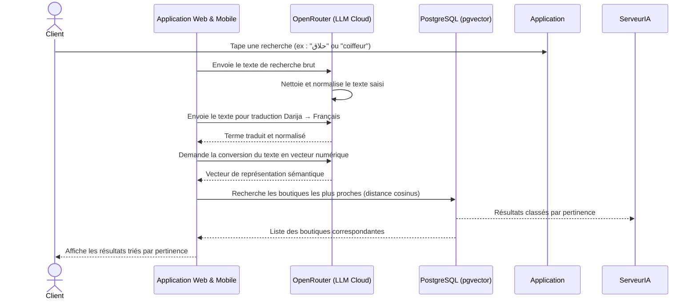
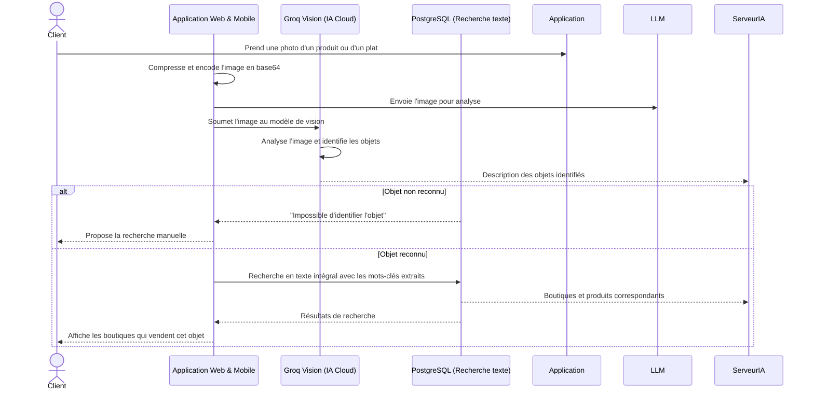
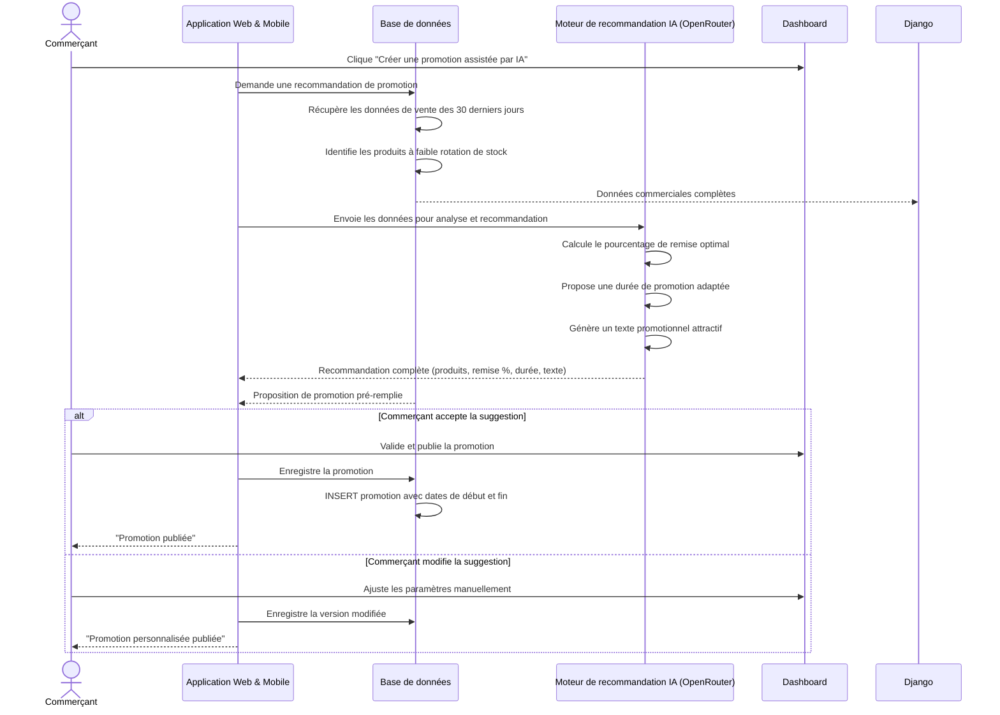
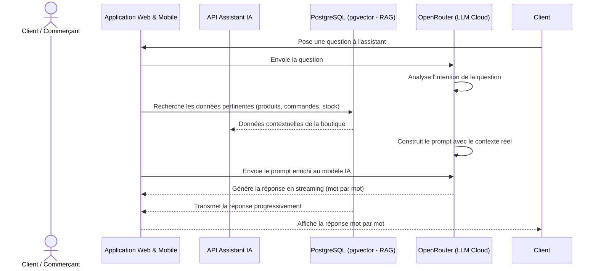
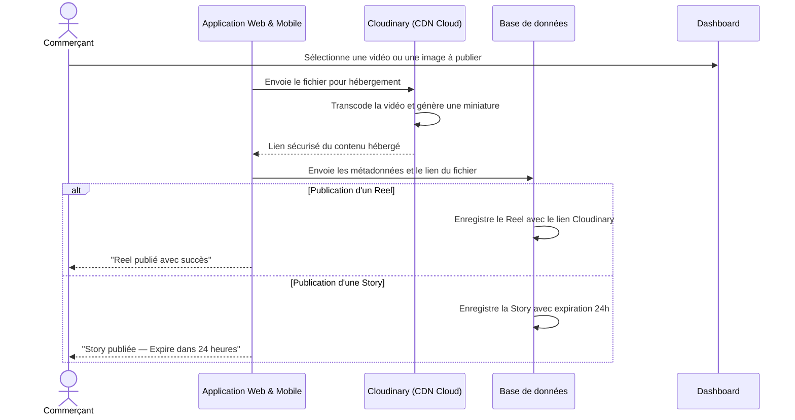
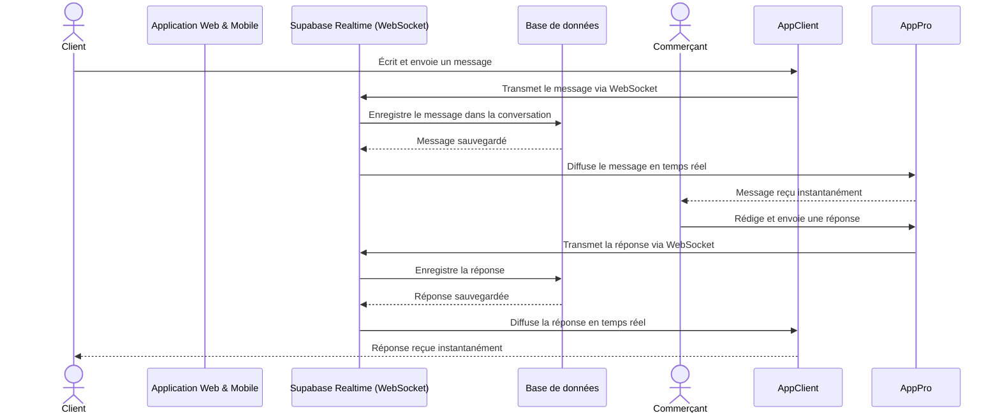
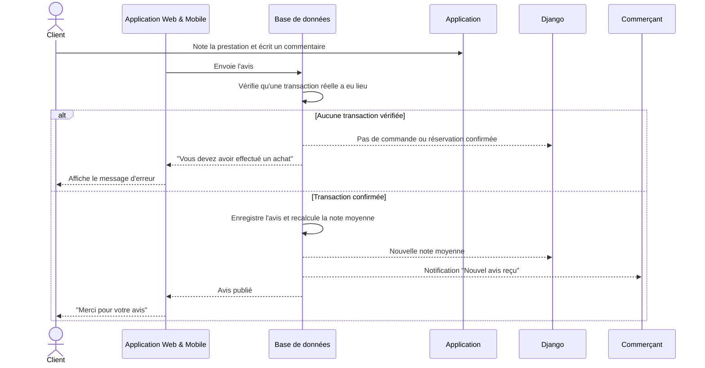

### 3.5.5 Conception de Sprint 1 — Release 3 (Intelligence Artificielle)

#### 3.5.5.1 Diagramme de cas d'utilisation de Sprint 1 (Release 3)

> *[Figure : Diagramme de cas d'utilisation — Intelligence Artificielle]*

**Description textuelle du cas d'utilisation « Recherche sémantique (Darija / Français) »**

| Cas d'utilisation | Recherche sémantique |
|-------------------|---------------------|
| **Acteurs** | Client |
| **Pré-condition** | Le client est connecté. Le moteur de recherche vectoriel est actif. |
| **Post-condition** | Les boutiques et produits les plus pertinents sont affichés. |
| **Scénario principal** | 1. Le client saisit une requête en texte libre (Darija ou français). 2. L'application envoie le texte au serveur IA. 3. Le serveur normalise et traduit le texte si nécessaire. 4. Le texte est converti en vecteur numérique par le modèle de langage. 5. Une recherche par similarité cosinus est effectuée dans la base de données (pgvector). 6. Les résultats sont classés par pertinence et retournés à l'application. |
| **Scénario alternatif** | Aucun résultat trouvé → l'application propose d'affiner la recherche. |

*Tableau : Description textuelle — Recherche sémantique*

#### 3.5.5.2 Diagrammes de séquence de Sprint 1 (Release 3)

**Diagramme de séquence : Recherche sémantique en Darija / Français**



> *[Figure : Diagramme de séquence — Recherche sémantique]*

**Diagramme de séquence : Recherche par photo (Vision IA)**



> *[Figure : Diagramme de séquence — Recherche par photo]*

**Diagramme de séquence : Détection de fraude (IA)**

```mermaid
sequenceDiagram
    actor Commerçant
    actor Administrateur
    participant App as Application Web & Mobile
    participant BD as Base de données (Supabase)
    participant IA as Moteur de détection IA (Groq)
    participant AdminPortal as Dashboard Admin (SaaS)
    participant Django as Backend Django

    Commerçant->>App: Crée une transaction (commande/réservation)
    App->>BD: INSERT transaction (status = "pending")
    BD->>IA: Déclenche une analyse automatique de risque (Trigger)
    IA->>IA: Calcule le score de risque de fraude (0-100)
    
    alt Score de risque élevé (> 80)
        IA->>BD: Met à jour le statut à "blocked" et génère un rapport
        BD->>Django: webhook de fraude détectée
        Django->>AdminPortal: Alerte de fraude en temps réel (WebSocket)
        AdminPortal-->>Administrateur: 🚨 Alerte fraude à examiner d'urgence
        BD-->>App: "Transaction suspendue — En cours de vérification"
        App-->>Commerçant: ❌ Transaction bloquée temporairement
    else Score de risque moyen (40-80)
        IA->>BD: Met à jour le statut à "suspected"
        BD->>Django: webhook pour suivi de transaction
        Django->>AdminPortal: Notification discrète de surveillance
        BD-->>App: Transaction acceptée avec avertissement
        App-->>Commerçant: ✅ Transaction enregistrée (à surveiller)
    else Score de risque faible (< 40)
        IA->>BD: Enregistre la transaction normalement
        BD-->>App: Confirmation d'insertion
        App-->>Commerçant: ✅ Transaction validée avec succès
    end```

> *[Figure : Diagramme de séquence — Détection de fraude]*

**Diagramme de séquence : Analyse de sentiment des avis (IA)**

```mermaid
sequenceDiagram
    actor Commerçant
    participant App as Application Web & Mobile
    participant BD as Base de données (Supabase)
    participant BD as Base de données
    participant IA as Moteur d'analyse IA (Groq / OpenRouter)

    Commerçant->>Dashboard: Ouvre la section "Avis clients"
    App->>BD: Demande les avis de la boutique
    BD->>BD: Récupère tous les avis non analysés
    BD-->>Django: Liste des avis avec texte brut
    App->>IA: Envoie les textes des avis pour analyse de sentiment
    IA->>IA: Analyse chaque commentaire (positif, neutre, négatif)
    IA->>IA: Extrait les thèmes récurrents (qualité, prix, service)
    IA-->>App: Résultats d'analyse (sentiment + thèmes + score)
    BD->>BD: Enregistre les résultats d'analyse
    BD-->>Django: Analyse sauvegardée
    BD-->>App: Résultats formatés avec statistiques
    alt Majorité de commentaires négatifs
        App-->>Commerçant: "Attention : baisse de satisfaction sur le thème Service"
    else Commentaires globalement positifs
        App-->>Commerçant: Tableau de bord sentiment avec graphiques
    end
```

> *[Figure : Diagramme de séquence — Analyse de sentiment]*

**Diagramme de séquence : Recommandation de promotions (IA)**



> *[Figure : Diagramme de séquence — Recommandation de promotions]*

**Diagramme de séquence : Assistant IA conversationnel (RAG)**



> *[Figure : Diagramme de séquence — Assistant IA conversationnel]*

---

### 3.5.6 Conception de Sprint 2 — Release 3 (Contenu & Engagement Social)

#### 3.5.6.1 Diagramme de cas d'utilisation de Sprint 2 (Release 3)

> *[Figure : Diagramme de cas d'utilisation — Contenu & Engagement Social]*

#### 3.5.6.2 Diagrammes de séquence de Sprint 2 (Release 3)

**Diagramme de séquence : Publication d'un Reel ou d'une Story**



> *[Figure : Diagramme de séquence — Publication Reel / Story]*

**Diagramme de séquence : Chat en temps réel (Client ↔ Commerçant)**



> *[Figure : Diagramme de séquence — Chat temps réel]*

**Diagramme de séquence : Dépôt d'un avis client**



> *[Figure : Diagramme de séquence — Dépôt d'un avis]*

---

### 3.5.7 Conception de Sprint 3 — Release 3 (Administration SaaS)

#### 3.5.7.1 Diagramme de cas d'utilisation de Sprint 3 (Release 3)

> *[Figure : Diagramme de cas d'utilisation — Administration SaaS]*

#### 3.5.7.2 Diagrammes de séquence de Sprint 3 (Release 3)

**Diagramme de séquence : Signalement et modération de contenu**

```mermaid
sequenceDiagram
    actor Client
    actor Administrateur
    participant App as Application Web & Mobile
    participant BD as Base de données (Supabase)
    participant AdminPortal as Dashboard Admin (SaaS)
    participant Django as Backend Django

    Client->>App: Signale un contenu inapproprié (Reel/Story/Avis)
    App->>BD: INSERT signalement (content_id, reason)
    BD->>BD: Compte le nombre total de signalements
    
    alt Seuil de signalements dépassé (> 3)
        BD->>BD: Masque automatiquement le contenu (status = "hidden")
        BD->>Django: Webhook de modération requise
        Django->>AdminPortal: Notification de contenu masqué
        AdminPortal-->>Administrateur: 🔔 Nouveau contenu masqué à valider
    else Seuil non atteint
        BD-->>App: Signalement enregistré avec succès
    end
    
    BD-->>App: Confirmation du traitement
    App-->>Client: ✅ "Merci pour votre signalement — En cours de traitement"```

> *[Figure : Diagramme de séquence — Signalement et modération]*

**Diagramme de séquence : Suspension d'un utilisateur (Admin)**

```mermaid
sequenceDiagram
    actor Administrateur
    participant AdminPortal as Dashboard Admin (SaaS)
    participant Django as Backend Django
    participant BD as Base de données (Supabase)

    Administrateur->>AdminPortal: Recherche un utilisateur suspect ou signalé
    AdminPortal->>Django: GET /api/admin/users/{id}
    Django->>BD: Query profil, transactions & signalements
    BD-->>Django: Données complètes de l'utilisateur
    Django-->>AdminPortal: Affiche la fiche utilisateur
    
    Administrateur->>AdminPortal: Clique "Suspendre le compte" (indique le motif)
    AdminPortal->>Django: POST /api/admin/users/{id}/suspend
    Django->>BD: UPDATE users SET status = "suspended", reason = {motif}
    BD-->>Django: Confirmation de suspension
    Django->>BD: Révoque toutes les sessions Supabase (User Session Revoke)
    BD-->>Django: Sessions révoquées
    Django-->>AdminPortal: Suspension confirmée
    AdminPortal-->>Administrateur: ✅ "Compte suspendu — Utilisateur déconnecté immédiatement"```

> *[Figure : Diagramme de séquence — Suspension d'un utilisateur]*

**Diagramme de séquence : Notifications en temps réel**

```mermaid
sequenceDiagram
    participant BD as Base de données (Supabase)
    participant Realtime as Supabase Realtime (WebSocket)
    participant App as Application Web & Mobile

    BD->>BD: Trigger PostgreSQL détecte un événement (insert/update)
    BD->>Realtime: Diffuse l'événement sur le canal concerné (realtime payload)
    Realtime->>App: Pousse la notification via WebSocket (latence < 100ms)
    App-->>Client/Commerçant: 🔔 Notification affichée (bannière / badge)```

> *[Figure : Diagramme de séquence — Notifications temps réel]*

---

### 3.5.8 Diagramme de classes global

Le diagramme de classes global représente la structure statique, relationnelle et exhaustive de la base de données de la plateforme RO2YA, telle qu'implémentée sous Supabase. Ce modèle regroupe l'intégralité des tables nécessaires aux fonctionnalités métiers avancées : e-commerce (produits, commandes), réservations, analytiques et logs d'événements, interactions sociales (stories, reels, avis, messagerie), détection de fraude IA, et abonnements/tickets de support.

```mermaid
classDiagram
    direction TB

    class User {
        +uuid id
        +string email
        +user_role role
        +string full_name
        +string phone
        +string avatar_url
        +decimal latitude
        +decimal longitude
        +string city
        +string address
        +timestamp created_at
        +string status
        +boolean two_factor_enabled
        +boolean email_notifications_enabled
        +boolean login_alerts_enabled
        +string language
        +string country
        +boolean used_web
        +boolean used_mobile
        +string bio
    }

    class UserProfile {
        +uuid user_id
        +string avatar_url
        +string bio
        +array preferred_categories
        +double preferred_price_min
        +double preferred_price_max
        +timestamp created_at
        +timestamp updated_at
    }

    class UserPushToken {
        +uuid id
        +uuid user_id
        +string token
        +string device_id
        +string platform
        +timestamp created_at
        +timestamp updated_at
    }

    class Store {
        +bigint id
        +uuid owner_id
        +string name
        +string slug
        +string description
        +string category
        +string phone
        +string email
        +string website
        +string address
        +decimal latitude
        +decimal longitude
        +string city
        +string logo_url
        +string banner_url
        +store_status status
        +string business_registration
        +string rne
        +decimal rating_average
        +integer total_reviews
        +integer total_orders
        +integer view_count
        +decimal sentiment_positive_percent
        +jsonb opening_hours
        +jsonb gallery
        +bigint business_directory_id
        +bigint id_business
        +bigint service_id
        +boolean is_active
        +string country
        +timestamp created_at
        +timestamp updated_at
    }

    class BusinessDirectoryTunisia {
        +bigint id
        +string title
        +decimal totalScore
        +integer reviewsCount
        +string street
        +string city
        +string state
        +string countryCode
        +string website
        +string phone
        +array categories
        +string url
        +string categoryName
        +string place_id
        +string vitrine_category
        +string full_address
        +decimal latitude
        +decimal longitude
        +boolean is_claimed
        +timestamp claimed_at
        +uuid claimed_by
        +bigint store_id
        +boolean verified
        +string business_status
        +string description
        +jsonb opening_hours
        +array photos
        +array tags
    }

    class ServiceDirectory {
        +bigint service_id
        +uuid owner_id
        +string name
        +string slug
        +string description
        +string category
        +string phone
        +string address
        +string city
        +double latitude
        +double longitude
        +string status
        +double rating_average
        +integer total_reviews
        +jsonb opening_hours
        +timestamp created_at
    }

    class Item {
        +bigint id
        +item_type item_type
        +string name
        +string slug
        +string description
        +decimal price
        +string price_unit
        +integer stock_quantity
        +integer duration_minutes
        +boolean is_bookable
        +jsonb available_days
        +item_status status
        +string main_image
        +string image_2
        +string image_3
        +integer view_count
        +integer order_count
        +integer booking_count
        +decimal rating_average
        +integer total_reviews
        +bigint store_id
        +string category
        +boolean is_active
        +jsonb metadata
    }

    class ServiceSchedule {
        +bigint id
        +bigint item_id
        +integer day_of_week
        +time start_time
        +time end_time
        +integer max_bookings
        +boolean is_active
    }

    class ItemMedia {
        +uuid id
        +bigint item_id
        +string media_type
        +string url
        +integer duration_seconds
        +timestamp created_at
    }

    class Order {
        +bigint id
        +string order_number
        +uuid customer_id
        +bigint store_id
        +bigint item_id
        +integer quantity
        +decimal unit_price
        +decimal total_price
        +string customer_name
        +string customer_phone
        +string customer_email
        +string delivery_address
        +order_status status
        +string tracking_code
        +jsonb cart
        +jsonb items
        +integer fraud_score
        +string fraud_level
        +boolean merchant_override_fraud
        +timestamp created_at
        +timestamp updated_at
    }

    class Booking {
        +bigint id
        +string booking_number
        +bigint item_id
        +uuid customer_id
        +bigint store_id
        +date booking_date
        +time start_time
        +time end_time
        +integer duration_minutes
        +string customer_name
        +string customer_phone
        +string customer_email
        +string notes
        +decimal price
        +booking_status status
        +integer fraud_score
        +string fraud_level
        +boolean merchant_override_fraud
        +timestamp created_at
        +timestamp updated_at
    }

    class OrderFraudCheck {
        +uuid id
        +bigint order_id
        +integer score
        +string level
        +jsonb signals
        +string recommendation
        +string ai_reasoning
        +timestamp checked_at
    }

    class BookingFraudCheck {
        +uuid id
        +bigint booking_id
        +integer score
        +string level
        +jsonb signals
        +string recommendation
        +string ai_reasoning
        +timestamp checked_at
    }

    class Transaction {
        +uuid id
        +string transaction_code
        +string order_number
        +bigint booking_id
        +uuid customer_id
        +string customer_name
        +bigint merchant_id
        +string merchant_number
        +string merchant_name
        +string driver_name
        +string drop_location
        +decimal amount
        +decimal fee
        +transaction_status status
        +transaction_type type
        +timestamp date
        +timestamp time_created
        +timestamp time_accepted
        +timestamp collection_time
        +timestamp pickup_time
        +timestamp time_delivered
        +integer wait_duration_minutes
        +integer delivery_duration_minutes
        +decimal km
        +string qr_code_token
    }

    class Driver {
        +uuid id
        +string name
        +string email
        +string phone
        +string status
        +string address
        +string city
        +string vehicle_type
        +string vehicle_license_plate
        +string vehicle_make
        +string vehicle_model
        +integer vehicle_year
        +integer vehicle_capacity_kg
        +double rating
        +double completion_rate
        +integer avg_delivery_time_minutes
        +double acceptance_rate
        +decimal current_lat
        +decimal current_lng
        +string bank_name
        +string account_number
        +decimal total_earnings
    }

    class Review {
        +bigint id
        +uuid author_id
        +bigint item_id
        +bigint store_id
        +bigint order_id
        +bigint booking_id
        +integer rating
        +string title
        +string comment
        +string image_1
        +string image_2
        +boolean is_verified
        +string qr_token
        +timestamp qr_scanned_at
        +decimal sentiment_score
        +sentiment_label sentiment_label
        +string vendor_response
        +string vendor_response_ai_suggestion
        +timestamp created_at
    }

    class Promotion {
        +bigint id
        +bigint store_id
        +bigint item_id
        +string title
        +string description
        +decimal discount_percent
        +string discount_text
        +date valid_from
        +date valid_until
        +boolean active
        +boolean apply_to_all
    }

    class Banner {
        +bigint id
        +bigint store_id
        +string title
        +string description
        +string image_url
        +string target_url
        +string placement
        +string status
        +integer priority
        +date start_date
        +date end_date
        +integer impressions
        +integer clicks
        +decimal conversion_rate
    }

    class AdCampaign {
        +uuid id
        +bigint store_id
        +double budget
        +double bid_cpc
        +boolean is_active
        +timestamp start_at
        +timestamp end_at
    }

    class Reel {
        +bigint id
        +bigint store_id
        +bigint item_id
        +string media_path
        +string media_type
        +string title
        +string subtitle
        +decimal price
        +string cta_type
        +string cta_value
        +boolean is_sponsored
        +string status
        +timestamp created_at
    }

    class ReelStats {
        +bigint reel_id
        +integer views_count
        +integer likes_count
        +integer clicks_count
        +integer contact_count
        +integer saves_count
    }

    class ReelComment {
        +bigint id
        +bigint reel_id
        +uuid user_id
        +string content
        +string attachment_url
        +string attachment_type
        +timestamp created_at
    }

    class Story {
        +bigint id
        +bigint store_id
        +uuid author_id
        +string media_url
        +string media_type
        +string caption
        +integer views_count
        +boolean is_approved
        +timestamp expires_at
        +timestamp created_at
    }

    class StoryView {
        +bigint id
        +bigint story_id
        +uuid viewer_id
        +timestamp viewed_at
    }

    class SavedPlace {
        +bigint id
        +uuid user_id
        +bigint store_id
        +timestamp created_at
    }

    class StoreFollow {
        +uuid id
        +uuid user_id
        +bigint store_id
        +timestamp created_at
    }

    class Friendship {
        +uuid id
        +uuid user_id
        +uuid friend_id
        +friendship_status status
        +timestamp created_at
    }

    class Subscription {
        +bigint id
        +uuid user_id
        +string plan_name
        +decimal price
        +timestamp current_period_start
        +timestamp current_period_end
        +string status
        +boolean auto_renew
        +timestamp created_at
    }

    class Message {
        +uuid id
        +uuid sender_id
        +uuid receiver_id
        +string content
        +boolean is_read
        +message_type type
        +string attachment_url
        +bigint store_id
        +timestamp created_at
    }

    class SupportTicket {
        +uuid id
        +integer ticket_number
        +bigint store_id
        +uuid customer_id
        +string customer_name
        +string subject
        +support_ticket_priority priority
        +support_ticket_status status
        +support_ticket_channel channel
        +uuid assigned_to
        +timestamp created_at
        +timestamp last_reply_at
    }

    class SupportMessage {
        +uuid id
        +uuid ticket_id
        +uuid sender_id
        +string sender_type
        +string content
        +boolean is_read
        +timestamp created_at
    }

    User "1" --> "0..*" Store : "gère (owner_id)"
    User "1" --> "0..*" Order : "passe (customer_id)"
    User "1" --> "0..*" Booking : "réserve (customer_id)"
    User "1" --> "0..*" Review : "rédige (author_id)"
    User "1" --> "0..*" Message : "envoie/reçoit"
    User "1" --> "0..1" UserProfile : "possède"
    User "1" --> "0..*" UserPushToken : "enregistre"
    User "1" --> "0..*" SavedPlace : "sauvegarde"
    User "1" --> "0..*" StoreFollow : "suit"
    User "1" --> "0..*" Friendship : "ami avec"
    User "1" --> "0..1" Subscription : "souscrit"
    User "1" --> "0..*" ReelComment : "commente"
    User "1" --> "0..*" Story : "publie"
    User "1" --> "0..*" StoryView : "visionne"
    User "1" --> "0..*" SupportTicket : "ouvre en tant que client"

    Store "1" --> "0..*" Item : "contient (store_id)"
    Store "1" --> "0..*" Order : "reçoit (store_id)"
    Store "1" --> "0..*" Booking : "gère (store_id)"
    Store "1" --> "0..*" Review : "évaluée par"
    Store "1" --> "0..*" Promotion : "propose (store_id)"
    Store "1" --> "0..*" Reel : "publie (store_id)"
    Store "1" --> "0..*" Transaction : "encaisse (merchant_id)"
    Store "1" --> "0..*" SupportTicket : "gère le support (store_id)"
    Store "1" --> "0..*" Banner : "affiche"
    Store "1" --> "0..*" AdCampaign : "finance"
    Store "1" --> "0..*" SavedPlace : "est sauvegardée par"
    Store "1" --> "0..*" StoreFollow : "est suivie par"
    Store "1" --> "0..*" Story : "partage"
    Store "1" --> "0..1" BusinessDirectoryTunisia : "rattachée à"
    Store "1" --> "0..1" ServiceDirectory : "référencée dans"

    Item "1" --> "0..*" Booking : "concerne (item_id)"
    Item "1" --> "0..*" Review : "reçoit (item_id)"
    Item "1" --> "0..*" Promotion : "cible (item_id)"
    Item "1" --> "0..1" Reel : "promouvoit (item_id)"
    Item "1" --> "0..*" ServiceSchedule : "planifié selon"
    Item "1" --> "0..*" ItemMedia : "illustré par"

    Order "1" --> "0..1" Transaction : "génère"
    Order "1" --> "1" OrderFraudCheck : "analysée par"
    Booking "1" --> "0..1" Transaction : "génère"
    Booking "1" --> "1" BookingFraudCheck : "analysée par"

    Transaction "0..*" --> "0..1" Driver : "livrée par (driver_name)"

    Reel "1" --> "1" ReelStats : "possède"
    Reel "1" --> "0..*" ReelComment : "commente"

    Story "1" --> "0..*" StoryView : "comporte"

    SupportTicket "1" --> "0..*" SupportMessage : "comprend"
```

*Figure : Diagramme de classes global de RO2YA*

---

## 3.6 Conclusion

Ce chapitre a présenté la démarche méthodologique adoptée pour le développement de la plateforme RO2YA, basée sur la méthode Scrum. L'analyse des besoins, la planification en sprints et la conception UML détaillée pour chaque release constituent une base solide pour l'implémentation décrite dans le chapitre suivant.
