### 3.5.5 Conception de Sprint 1 — Release 3 (Intelligence Artificielle)

#### 3.5.5.1 Diagramme de cas d'utilisation de Sprint 1 (Release 3)

> *[Figure : Diagramme de cas d'utilisation — Intelligence Artificielle]*

**Description textuelle du cas d'utilisation « Recherche sémantique (Darija / Français) »**

| Cas d'utilisation | Recherche sémantique |
|-------------------|---------------------|
| **Acteurs** | Client |
| **Pré-condition** | Le client est connecté. Le moteur de recherche vectoriel est actif. |
| **Post-condition** | Les boutiques et produits les plus pertinents sont affichés. |
| **Scénario principal** | 1. Le client saisit une requête en texte libre (Darija ou français). 2. L'application envoie le texte au serveur IA. 3. Le serveur normalise et traduit le texte si nécessaire. 4. Le texte est converti en vecteur numérique par le modèle de langage. 5. Une recherche par similarité cosinus est effectuée dans la base de données (pgvector). 6. Les résultats sont classés par pertinence et retournés à l'application. |
| **Scénario alternatif** | Aucun résultat trouvé → l'application propose d'affiner la recherche. |

*Tableau : Description textuelle — Recherche sémantique*

#### 3.5.5.2 Diagrammes de séquence de Sprint 1 (Release 3)

**Diagramme de séquence : Recherche sémantique en Darija / Français**

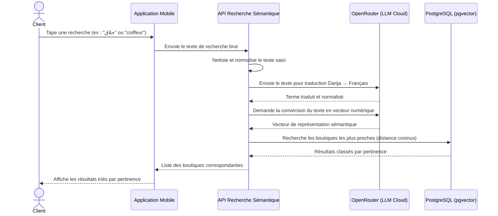

> *[Figure : Diagramme de séquence — Recherche sémantique]*

**Diagramme de séquence : Recherche par photo (Vision IA)**

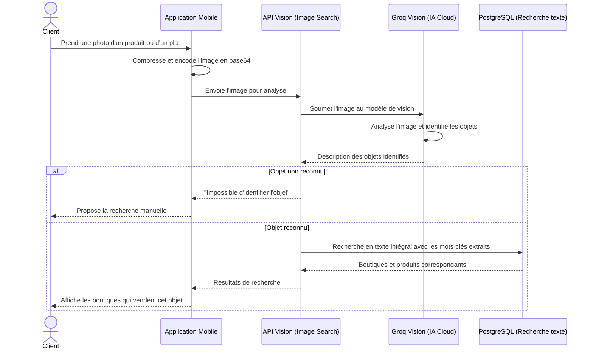

> *[Figure : Diagramme de séquence — Recherche par photo]*

**Diagramme de séquence : Détection de fraude (IA)**

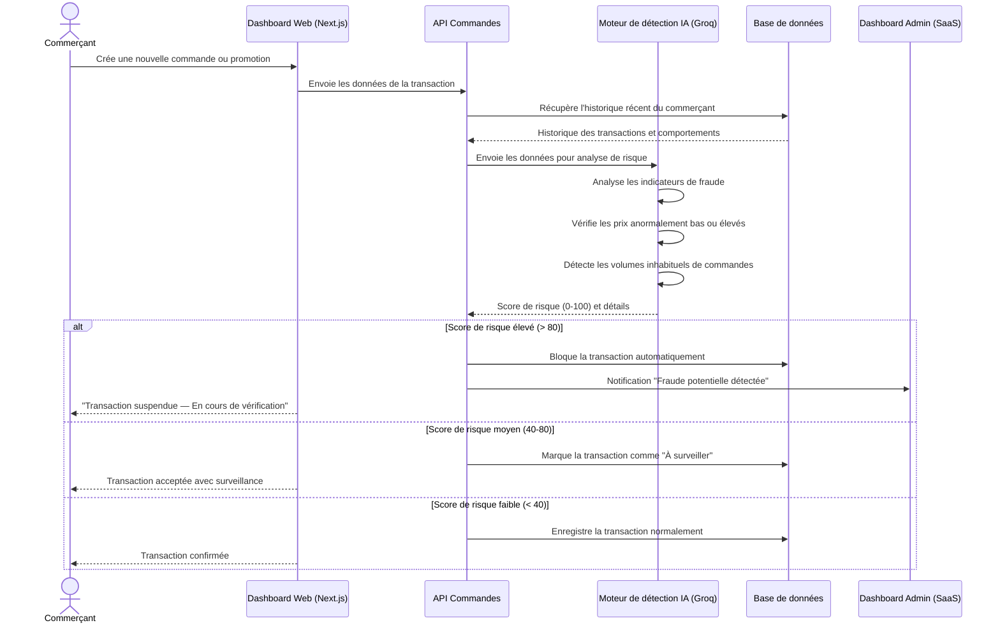

> *[Figure : Diagramme de séquence — Détection de fraude]*

**Diagramme de séquence : Analyse de sentiment des avis (IA)**

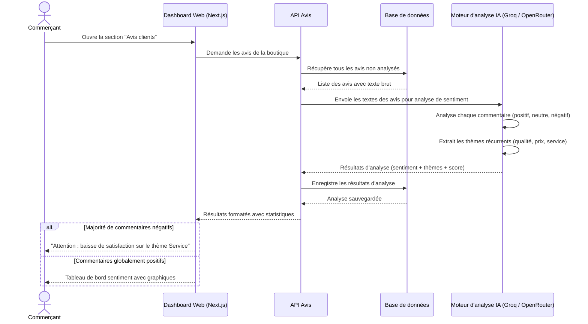

> *[Figure : Diagramme de séquence — Analyse de sentiment]*

**Diagramme de séquence : Recommandation de promotions (IA)**

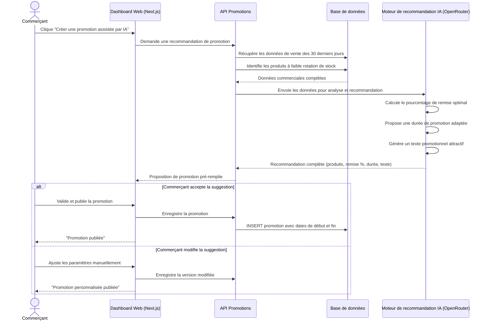

> *[Figure : Diagramme de séquence — Recommandation de promotions]*

**Diagramme de séquence : Assistant IA conversationnel (RAG)**

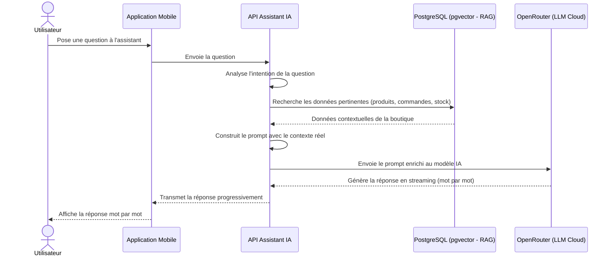

> *[Figure : Diagramme de séquence — Assistant IA conversationnel]*

---

### 3.5.6 Conception de Sprint 2 — Release 3 (Contenu & Engagement Social)

#### 3.5.6.1 Diagramme de cas d'utilisation de Sprint 2 (Release 3)

> *[Figure : Diagramme de cas d'utilisation — Contenu & Engagement Social]*

#### 3.5.6.2 Diagrammes de séquence de Sprint 2 (Release 3)

**Diagramme de séquence : Publication d'un Reel ou d'une Story**

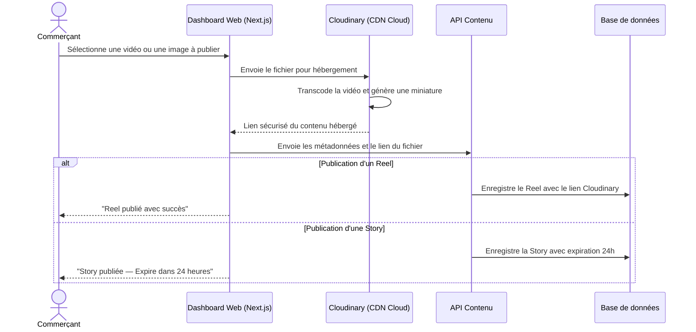

> *[Figure : Diagramme de séquence — Publication Reel / Story]*

**Diagramme de séquence : Chat en temps réel (Client ↔ Commerçant)**

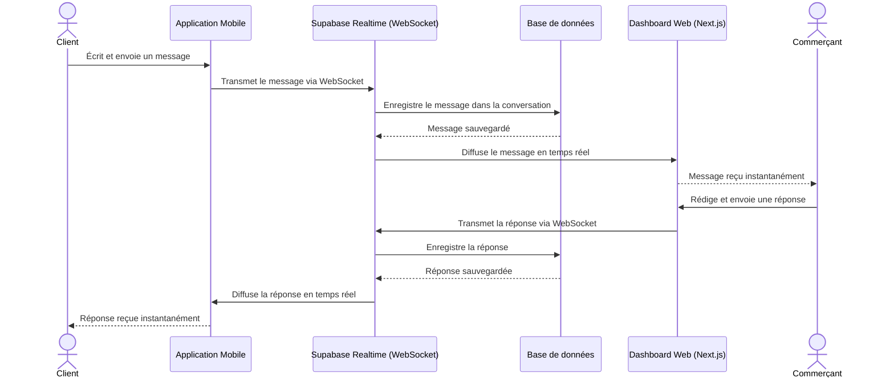

> *[Figure : Diagramme de séquence — Chat temps réel]*

**Diagramme de séquence : Dépôt d'un avis client**

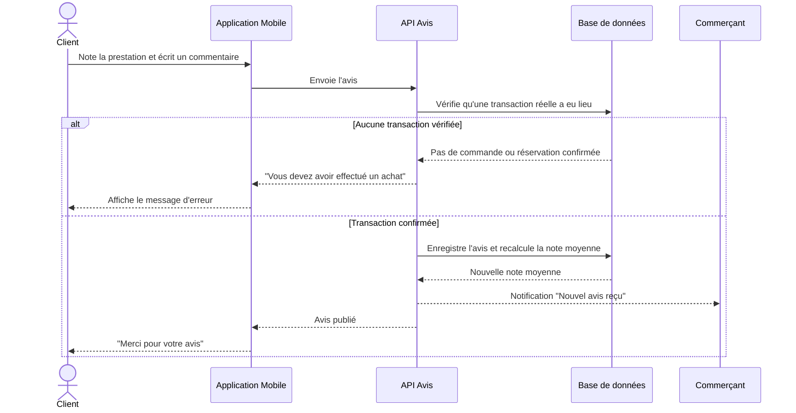

> *[Figure : Diagramme de séquence — Dépôt d'un avis]*

---

### 3.5.7 Conception de Sprint 3 — Release 3 (Administration SaaS)

#### 3.5.7.1 Diagramme de cas d'utilisation de Sprint 3 (Release 3)

> *[Figure : Diagramme de cas d'utilisation — Administration SaaS]*

#### 3.5.7.2 Diagrammes de séquence de Sprint 3 (Release 3)

**Diagramme de séquence : Signalement et modération de contenu**

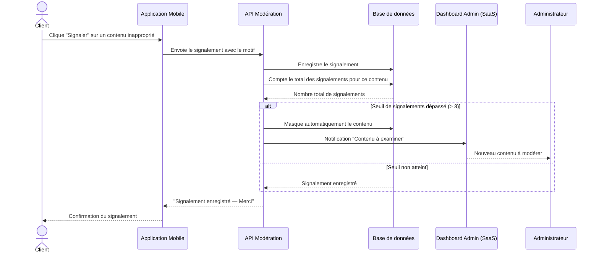

> *[Figure : Diagramme de séquence — Signalement et modération]*

**Diagramme de séquence : Suspension d'un utilisateur (Admin)**

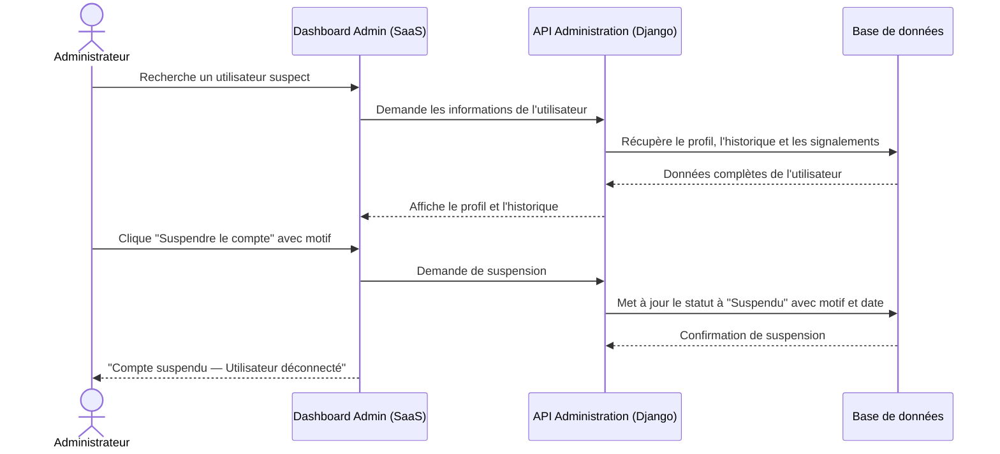

> *[Figure : Diagramme de séquence — Suspension d'un utilisateur]*

**Diagramme de séquence : Notifications en temps réel**

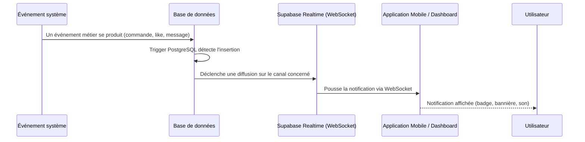

> *[Figure : Diagramme de séquence — Notifications temps réel]*

---

### 3.5.8 Diagramme de classe global

Le diagramme de classes global représente la structure statique de la base de données de la plateforme RO2YA. Il décrit les entités principales du système, leurs attributs et les relations qui les unissent.

> *[Figure : Diagramme de classes global de RO2YA]*

| Entité | Attributs principaux | Relations |
|--------|---------------------|-----------|
| **User** | id, email, role, status, created_at | 1 User → 0..1 Store |
| **Store** | id, owner_id, name, status, location (GPS), rating | 1 Store → N Items, N Orders, N Bookings |
| **Item** | id, store_id, name, price, stock_qty, is_active, image_url | N Items → N OrderItems |
| **Order** | id, customer_id, store_id, status, total, created_at | 1 Order → N OrderItems |
| **OrderItem** | id, order_id, item_id, qty, unit_price | — |
| **Booking** | id, customer_id, store_id, slot_date, slot_time, status | — |
| **Review** | id, customer_id, store_id, rating, comment, sentiment_score | — |
| **Message** | id, sender_id, receiver_id, content, read_at | — |
| **Reel** | id, store_id, video_url, likes_count, views_count | — |
| **Promotion** | id, store_id, title, discount_pct, starts_at, ends_at | — |

*Tableau : Entités principales du diagramme de classes global*

---

## 3.6 Conclusion

Ce chapitre a présenté la démarche méthodologique adoptée pour le développement de la plateforme RO2YA, basée sur la méthode Scrum. L'analyse des besoins, la planification en sprints et la conception UML détaillée pour chaque release constituent une base solide pour l'implémentation décrite dans le chapitre suivant.
