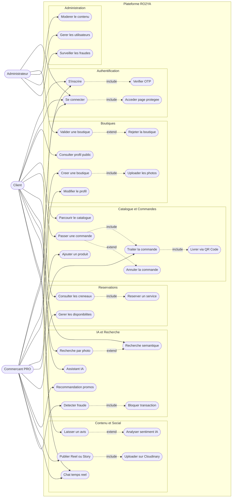
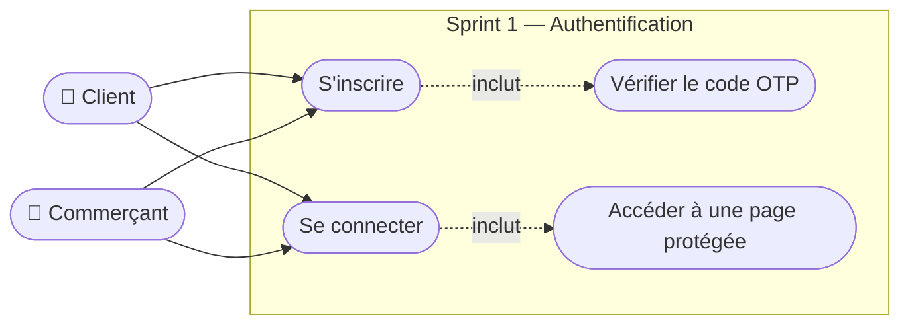
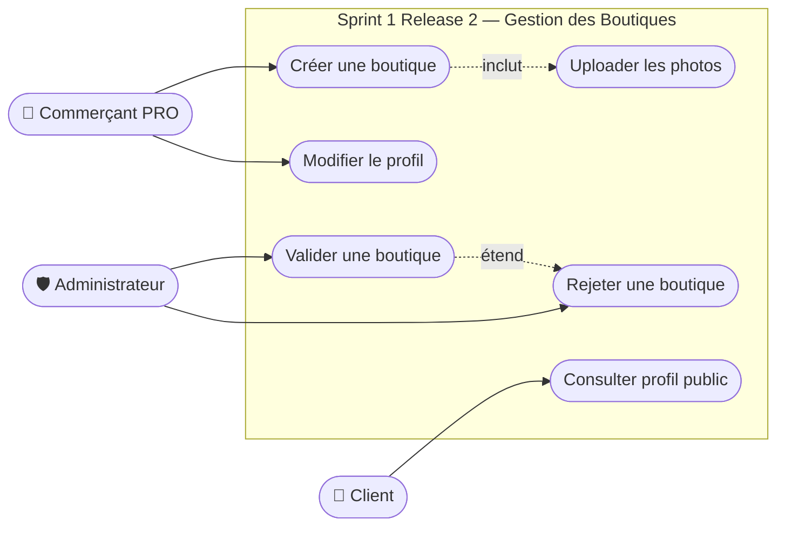
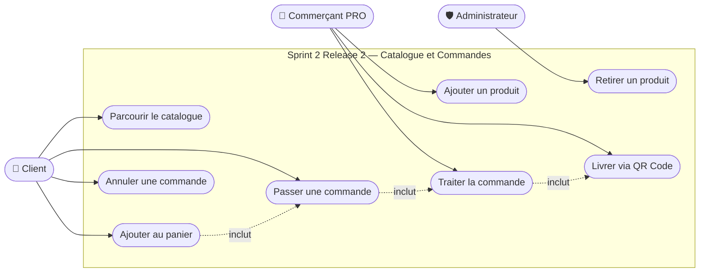
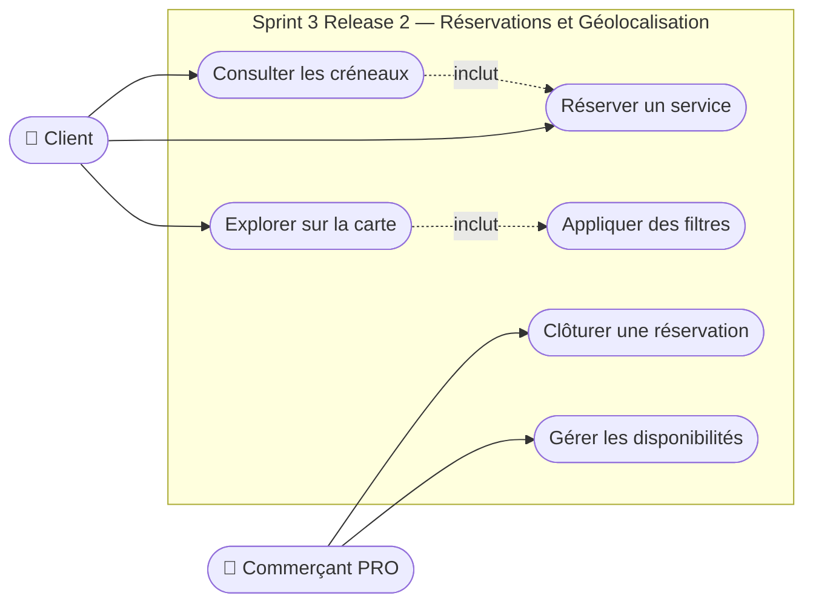
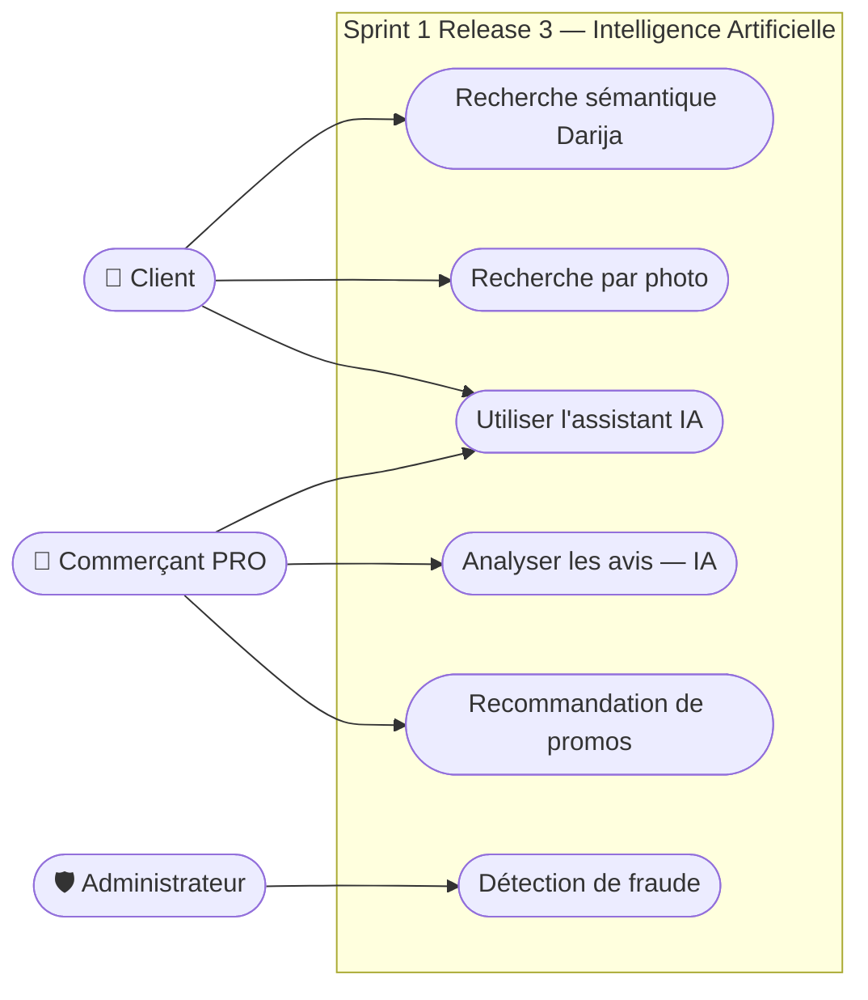
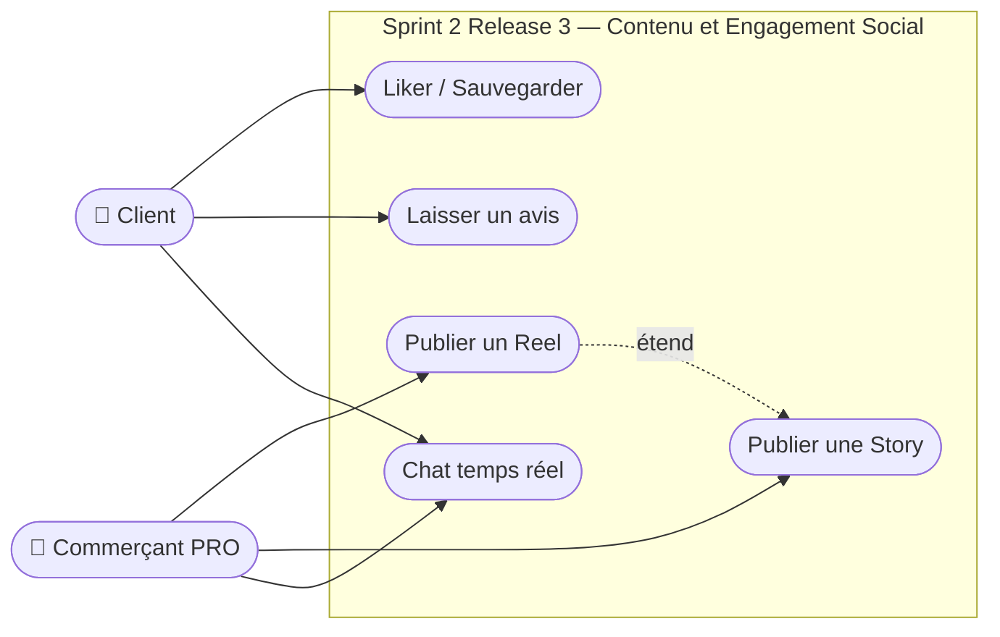
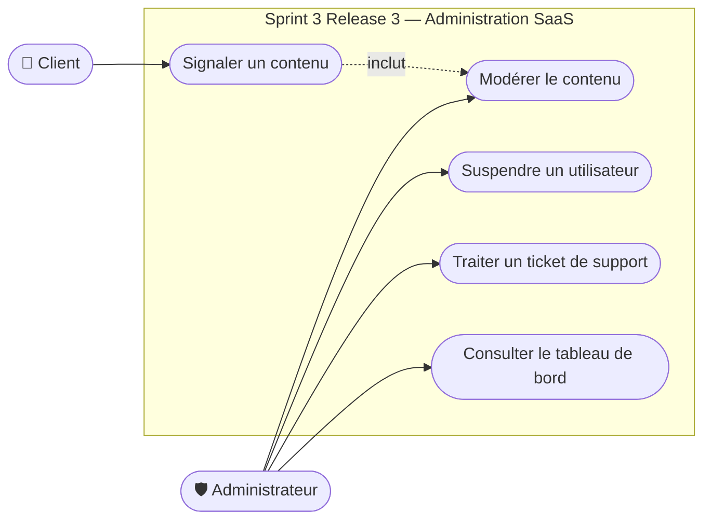

# CHAPITRE 3 : MÉTHODOLOGIE ET CONCEPTION

---

## 3.1 Introduction

Ce chapitre présente la démarche méthodologique adoptée pour concevoir et développer la plateforme **RO2YA**. Il décrit la méthode agile utilisée, les étapes de planification, ainsi que les choix de conception fonctionnelle et technique qui ont guidé le développement du projet, depuis l'analyse des besoins jusqu'aux diagrammes UML de chaque sprint.

---

## 3.2 Méthodologie de travail

### 3.2.1 Méthodes agiles

La méthode Agile est une approche itérative et collaborative de gestion de projet, permettant de répondre efficacement aux besoins initiaux du client ainsi qu'aux évolutions en cours de développement.

Elle repose sur un cycle centré sur le client, qui est impliqué tout au long du projet, de sa conception à sa livraison. Cette collaboration permet d'obtenir des retours réguliers et d'intégrer rapidement les ajustements nécessaires. Par rapport aux méthodes classiques, l'Agile offre une meilleure visibilité sur l'avancement du projet et permet de livrer un logiciel fonctionnel de manière progressive et continue.

### 3.2.2 Méthode agile adoptée : Scrum

Afin d'assurer le bon déroulement du projet, nous avons choisi **Scrum** comme méthode agile. Scrum est aujourd'hui la méthode agile la plus répandue. Inspirée du rugby, elle fonctionne par sprints, c'est-à-dire des cycles courts de développement (souvent de deux semaines), durant lesquels l'équipe se concentre sur un ensemble précis de tâches. À la fin de chaque sprint, une version incrémentée du produit est livrée, intégrant les nouvelles fonctionnalités développées.

> *[Figure : Cycle Scrum]*

**1) Les acteurs clés de Scrum**

Scrum s'articule autour de trois rôles principaux :

- **Le Product Owner** : il est chargé de transmettre les besoins des clients et utilisateurs finaux. Il coordonne la participation des parties prenantes et s'assure de l'alignement avec les priorités du projet pour garantir la cohérence du produit livré.
- **Le Scrum Master** : membre de l'équipe, il a pour mission d'optimiser la productivité du groupe. Il soutient l'équipe en favorisant son autonomie et en l'aidant à s'améliorer continuellement à travers les cérémonies Scrum.
- **L'équipe de développement** : composée idéalement de moins de dix personnes, elle fonctionne sans hiérarchie formelle. L'équipe est auto-organisée et responsable de l'exécution des tâches définies pour chaque sprint.

**2) Concepts clés de la méthode Scrum**

- **Product Backlog** : il s'agit de la liste initiale des exigences du projet, priorisées avec le client. Ce carnet évolue tout au long du développement, selon les besoins émergents.
- **Sprint Backlog** : au début de chaque sprint, l'équipe définit un objectif et sélectionne les tâches à accomplir à partir du Product Backlog. Ces tâches constituent le Sprint Backlog.
- **User Story** : ce terme désigne une fonctionnalité décrite du point de vue de l'utilisateur ou du client.
- **La mêlée quotidienne (Daily Scrum)** : réunion brève et quotidienne visant à faire le point sur l'avancement, les obstacles rencontrés et les actions à venir.

---

## 3.3 Mise en place du projet

Cette partie est dédiée à la première phase de la méthodologie Scrum, appelée « Sprint 0 ». Cette étape vise à poser les bases du projet en présentant les fonctionnalités principales, le diagramme global des cas d'utilisation, ainsi que le Product Backlog.

### 3.3.1 Analyse des besoins

Cette section a pour objectif de définir les besoins fonctionnels, tout en identifiant les différents acteurs impliqués dans le système.

#### 3.3.1.1 Identification des acteurs

**CLIENT**

Le client est l'utilisateur final de l'application mobile RO2YA. Il peut parcourir le catalogue des boutiques locales, effectuer des recherches par texte ou par photo, passer des commandes, réserver des services, regarder des Reels promotionnels, laisser des avis et discuter en temps réel avec les commerçants.

**COMMERÇANT PRO**

Le commerçant est le propriétaire d'une boutique locale inscrite sur la plateforme. Il gère son catalogue de produits et services, traite les commandes reçues, gère les réservations et son planning, publie des contenus vidéo (Reels et Stories), consulte ses statistiques et bénéficie de fonctionnalités d'intelligence artificielle pour optimiser son activité.

**ADMINISTRATEUR**

L'administrateur est le gestionnaire de la plateforme SaaS RO2YA. Il est chargé de valider les demandes de création de boutiques, de modérer les contenus non conformes, de gérer les comptes utilisateurs et de surveiller les activités suspectes grâce au moteur de détection de fraude.

#### 3.3.1.2 Les besoins fonctionnels

**S'inscrire :**

Cette fonctionnalité permet à tout nouvel utilisateur de créer un compte sur la plateforme RO2YA en fournissant son adresse email et un mot de passe. Une vérification par code OTP est envoyée par email afin de valider l'identité de l'utilisateur avant l'activation de son compte.

**Se connecter :**

Cette fonctionnalité permet à tout utilisateur disposant d'un compte actif de se connecter à la plateforme à l'aide de ses identifiants (email et mot de passe). Le système délivre un jeton de session sécurisé (JWT) permettant l'accès aux fonctionnalités protégées.

**Gérer sa boutique (Commerçant) :**

Cette fonctionnalité permet au commerçant de créer sa boutique en renseignant ses informations (nom, catégorie, localisation GPS, photos), de modifier son profil et ses horaires, et de gérer son catalogue de produits et services.

**Passer une commande (Client) :**

Cette fonctionnalité permet au client d'ajouter des produits au panier, de valider sa commande et de suivre son état en temps réel. La livraison est confirmée par scan d'un QR Code sécurisé généré par l'application.

**Réserver un service (Client) :**

Cette fonctionnalité permet au client de consulter les créneaux disponibles d'un prestataire et de réserver un rendez-vous directement depuis l'application mobile.

**Rechercher par texte ou par photo (IA) :**

Cette fonctionnalité permet au client de rechercher des boutiques ou des produits en saisissant du texte en français ou en dialecte algérien (Darija), ou en prenant une photo d'un objet. Le moteur d'intelligence artificielle analyse la requête et retourne les résultats les plus pertinents.

**Valider une boutique (Administrateur) :**

Cette fonctionnalité permet à l'administrateur d'examiner les dossiers de création de boutiques soumis par les commerçants et de les approuver ou les rejeter selon les critères de conformité de la plateforme.

---

## 3.4 Diagramme de cas d'utilisation globale et planification des sprints

### 3.4.1 Langage de modélisation adopté

Le langage de modélisation adopté dans notre projet est **UML (Unified Modeling Language)**. Une image vaut mieux qu'un long discours. Ce proverbe résume l'origine de la schématisation en langage de modélisation unifié (UML). Son objectif : créer un langage visuel commun dans le monde complexe du développement de logiciels, un langage qui serait compris aussi bien par les développeurs que par les utilisateurs professionnels et toutes les parties prenantes souhaitant comprendre le système.

### 3.4.2 Diagramme de cas d'utilisation global

Afin de présenter de manière formelle les fonctionnalités de notre système, nous utilisons le diagramme de cas d'utilisation issu du langage de modélisation UML. Ces diagrammes offrent une vue d'ensemble du comportement fonctionnel d'un système logiciel. Ils sont particulièrement utiles pour communiquer avec la direction ou les parties prenantes d'un projet. Bien que moins détaillés pour le développement, ils permettent de visualiser les interactions principales entre les utilisateurs et le logiciel. Chaque cas d'utilisation décrit une interaction distincte entre un acteur et le système.

La figure ci-dessous illustre le diagramme global des cas d'utilisation de la plateforme RO2YA. Ce schéma met en évidence les trois acteurs principaux ainsi que les cas d'utilisation qui leur sont associés.

*Figure : Diagramme de cas d'utilisation global de RO2YA*

### 3.4.3 Adaptation au cycle de développement Scrum

#### 3.4.3.1 Répartition des rôles

Pour assurer une gestion efficace du projet selon la méthodologie Scrum, les rôles suivants ont été définis :

| Rôle | Personne concernée |
|------|--------------------|
| Product Owner | Encadrant académique |
| Scrum Master | Chef de projet (étudiant) |
| Équipe de développement | Équipe étudiante |

*Tableau : Répartition des rôles Scrum*

#### 3.4.3.2 Product Backlog

Le Product Backlog constitue l'inventaire structuré de toutes les fonctionnalités requises pour la plateforme RO2YA. Il présente une vue d'ensemble des besoins fonctionnels identifiés lors de l'analyse, organisés de manière à faciliter la planification et le développement itératif.

Le tableau ci-dessous représente les fonctionnalités selon des critères de classification :

- **L'effort** : représente la difficulté technique estimée pour implémenter la fonctionnalité. Il est noté sur une échelle de 1 à 5, où 1 correspond à une tâche simple et 5 à une tâche complexe nécessitant plus de ressources.
- **La priorité** : également notée sur 5, reflète l'importance de la fonctionnalité pour les utilisateurs finaux ainsi que son impact sur les objectifs du projet. Plus la note est élevée, plus la fonctionnalité est considérée comme prioritaire.

| Thème | Fonctionnalité | Description | Effort | Priorité |
|-------|---------------|-------------|--------|---------|
| Authentification | S'inscrire | Permettre à un nouvel utilisateur de créer un compte avec vérification OTP | 3 | 5 |
| Authentification | Se connecter | Permettre à un utilisateur existant de s'authentifier via email et mot de passe | 2 | 5 |
| Authentification | Accéder à une page protégée | Vérifier le jeton de session (JWT) et les droits d'accès à chaque requête | 3 | 5 |
| Boutique | Créer une boutique | Permettre au commerçant de créer son profil boutique avec géolocalisation et photos | 4 | 5 |
| Boutique | Valider une boutique | Permettre à l'admin de valider ou rejeter les demandes de création | 3 | 5 |
| Boutique | Modifier le profil | Permettre au commerçant de mettre à jour ses horaires et informations | 2 | 4 |
| Catalogue | Ajouter un produit | Permettre au commerçant d'ajouter un produit ou service à son catalogue | 3 | 5 |
| Commandes | Passer une commande | Permettre au client de commander avec gestion du stock en temps réel | 5 | 5 |
| Commandes | Livrer via QR Code | Permettre la confirmation de livraison par scan d'un QR Code sécurisé | 4 | 5 |
| Réservations | Réserver un service | Permettre au client de réserver un créneau disponible | 4 | 4 |
| Recherche IA | Recherche sémantique | Permettre la recherche en Darija/Français via un moteur vectoriel | 5 | 5 |
| Recherche IA | Recherche par photo | Permettre l'identification de produits par analyse d'image (Vision IA) | 5 | 4 |
| Contenu | Publier un Reel | Permettre au commerçant de publier des vidéos promotionnelles | 4 | 3 |
| Social | Chat temps réel | Permettre la messagerie instantanée entre client et commerçant | 4 | 4 |
| IA | Détection de fraude | Analyser les transactions pour détecter les comportements suspects | 5 | 5 |
| IA | Analyse de sentiment | Analyser les avis clients pour extraire les points forts et axes d'amélioration | 4 | 3 |
| IA | Recommandation promos | Suggérer des promotions adaptées basées sur les données de vente | 4 | 3 |
| IA | Assistant conversationnel | Fournir un chatbot IA capable de répondre aux questions métier | 5 | 4 |
| Admin | Modérer le contenu | Permettre la suppression de contenus non conformes signalés | 3 | 5 |
| Admin | Gérer les utilisateurs | Permettre la suspension et réactivation des comptes utilisateurs | 3 | 4 |

*Tableau : Product Backlog de la plateforme RO2YA*

#### 3.4.3.3 Planification des sprints du projet

Le sprint est une période qui dure entre une et quatre semaines, au bout de laquelle l'équipe doit réaliser un incrément de produit livrable. Un nouveau sprint démarre lorsque le précédent est terminé.

L'objectif de cette étape est d'organiser le calendrier de travail et de définir le Backlog pour chaque sprint. La planification des sprints est illustrée dans le tableau ci-dessous :

| | SPRINT | Fonctionnalités |
|--|--------|----------------|
| **RELEASE 1** | Sprint 1 | Authentification (Inscription · Connexion · Session protégée) |
| **RELEASE 2** | Sprint 1 | Gestion des Boutiques (Création · Validation Admin · Modification profil) |
| | Sprint 2 | Catalogue & Commandes (Ajout produit · Commande · QR Code · Annulation) |
| | Sprint 3 | Réservations & Géolocalisation |
| **RELEASE 3** | Sprint 1 | Intelligence Artificielle (Recherche Darija · Vision · Fraude · Sentiment · Promos · RAG) |
| | Sprint 2 | Contenu & Social (Reels · Stories · Likes · Chat temps réel · Avis) |
| | Sprint 3 | Administration SaaS (Modération · Utilisateurs · Analytics · Notifications) |

*Tableau : Planification des sprints du projet RO2YA*

**Planification Release 1**

Une fois l'analyse des besoins et les spécifications des exigences du projet élaborées, nous présentons notre premier release qui comporte un sprint axé sur les fonctionnalités d'authentification.

*Sprint 1 :*

| Thème | Fonctionnalité | Estimation (jours) |
|-------|---------------|-------------------|
| Authentification | S'inscrire (avec vérification OTP) | 7 |
| Authentification | Se connecter | 5 |
| Authentification | Accéder à une page protégée (JWT) | 4 |

*Tableau : Backlog Sprint 1 — Release 1*

**Planification Release 2**

*Sprint 1 :*

L'objectif de ce sprint est de permettre aux commerçants de créer et gérer leur boutique sur la plateforme, et à l'administrateur de valider les demandes.

| Thème | Fonctionnalités | Estimation (jours) |
|-------|----------------|-------------------|
| Boutique | Créer une boutique · Valider (Admin) · Modifier le profil | 12 |

*Tableau : Backlog Sprint 1 — Release 2*

*Sprint 2 :*

L'objectif de ce sprint est de permettre aux commerçants de gérer leur catalogue et aux clients de passer des commandes complètes, de la mise au panier jusqu'à la livraison par QR Code.

| Thème | Fonctionnalités | Estimation (jours) |
|-------|----------------|-------------------|
| Catalogue & Commandes | Ajout produit · Commande · QR Code · Annulation | 15 |

*Tableau : Backlog Sprint 2 — Release 2*

*Sprint 3 :*

L'objectif de ce sprint est de permettre aux clients de réserver des services auprès des prestataires et d'explorer les boutiques à proximité via une carte géographique interactive.

| Thème | Fonctionnalités | Estimation (jours) |
|-------|----------------|-------------------|
| Réservations | Réserver un créneau · Clôturer une réservation | 10 |
| Géolocalisation | Exploration sur carte · Filtres de proximité | 8 |

*Tableau : Backlog Sprint 3 — Release 2*

---

## 3.5 Conception

### 3.5.1 Conception de Sprint 1 — Release 1 (Authentification)

#### 3.5.1.1 Diagramme de cas d'utilisation de Sprint 1

La figure ci-dessous illustre le diagramme des cas d'utilisation du premier sprint.

*Figure : Diagramme de cas d'utilisation — Sprint 1, Release 1*

#### 3.5.1.2 Diagramme de séquence de Sprint 1

**Diagramme de séquence : Inscription d'un utilisateur**

| Étape | Acteur / Composant Source | Action / Message | Cible |
|---|---|---|---|
| 1 | **Client** | Remplit le formulaire d'inscription | **App** |
| 2 | **App** | Vérifie que tous les champs sont remplis | **App** |
| 3 | **App** | Vérifie que l'email est valide | **App** |
| 4 | **App** | Vérifie le nombre de tentatives | **SupabaseAuth** |
| - | *Système* | *Condition : Trop de tentatives* | - |
| 5 | **SupabaseAuth** | Accès temporairement bloqué | **App** |
| 6 | **App** | "Réessayez dans 15 minutes" | **Client** |
| - | *Système* | *Sinon : Autorisé* | - |
| 7 | **App** | Envoie les données d'inscription | **SupabaseAuth** |
| 8 | **SupabaseAuth** | Vérifie si l'email existe déjà | **BD** |
| - | *Système* | *Condition : Email déjà utilisé* | - |
| 9 | **BD** | Email trouvé | **SupabaseAuth** |
| 10 | **SupabaseAuth** | "Email déjà utilisé" | **App** |
| 11 | **App** | Affiche le message d'erreur | **Client** |
| - | *Système* | *Sinon : Email disponible* | - |
| 12 | **SupabaseAuth** | Enregistre le nouvel utilisateur | **BD** |
| 13 | **BD** | Confirmation | **SupabaseAuth** |
| 14 | **SupabaseAuth** | Envoie le code de vérification OTP | **Email** |
| 15 | **Email** | Code OTP reçu par email | **Utilisateur** |
| 16 | **Client** | Saisit le code OTP | **App** |
| 17 | **App** | Envoie le code OTP | **SupabaseAuth** |
| - | *Système* | *Condition : Code invalide ou expiré* | - |
| 18 | **SupabaseAuth** | Code incorrect | **App** |
| 19 | **App** | "Code invalide ou expiré" | **Client** |
| - | *Système* | *Sinon : Code valide* | - |
| 20 | **SupabaseAuth** | Active le compte | **BD** |
| 21 | **SupabaseAuth** | Jeton de session | **App** |
| 22 | **App** | Compte activé — Bienvenue | **Client** |

> *[Figure : Diagramme de séquence — Inscription]*

**Diagramme de séquence : Connexion d'un utilisateur**

| Étape | Acteur / Composant Source | Action / Message | Cible |
|---|---|---|---|
| 1 | **Client** | Saisit email et mot de passe | **App** |
| 2 | **App** | Vérifie le nombre de tentatives | **SupabaseAuth** |
| - | *Système* | *Condition : Trop de tentatives* | - |
| 3 | **SupabaseAuth** | Compte temporairement verrouillé | **App** |
| 4 | **App** | "Réessayez dans 15 minutes" | **Client** |
| - | *Système* | *Sinon : Autorisé* | - |
| 5 | **App** | Envoie les identifiants | **SupabaseAuth** |
| 6 | **SupabaseAuth** | Cherche l'utilisateur par email | **BD** |
| - | *Système* | *Condition : Identifiants incorrects* | - |
| 7 | **BD** | Utilisateur non trouvé ou mot de passe invalide | **SupabaseAuth** |
| 8 | **SupabaseAuth** | Identifiants incorrects | **App** |
| 9 | **App** | "Email ou mot de passe incorrect" | **Client** |
| - | *Système* | *Sinon : Compte suspendu* | - |
| 10 | **SupabaseAuth** | Compte suspendu | **App** |
| 11 | **App** | "Compte suspendu — Contactez le support" | **Client** |
| - | *Système* | *Sinon : Connexion réussie* | - |
| 12 | **SupabaseAuth** | Met à jour la date de dernière connexion | **BD** |
| 13 | **SupabaseAuth** | Jeton de session (JWT) | **App** |
| 14 | **App** | Sauvegarde la session | **App** |
| 15 | **App** | Connecté — Redirection vers l'accueil | **Client** |

> *[Figure : Diagramme de séquence — Connexion]*

---

### 3.5.2 Conception de Sprint 1 — Release 2 (Gestion des Boutiques)

#### 3.5.2.1 Diagramme de cas d'utilisation de Sprint 1 (Release 2)

La figure ci-dessous illustre le diagramme des cas d'utilisation du premier sprint de la deuxième release.

*Figure : Diagramme de cas d'utilisation — Sprint 1, Release 2*

**Description textuelle du cas d'utilisation « Créer une boutique »**

| Cas d'utilisation | Créer une boutique |
|-------------------|--------------------|
| **Acteurs** | Commerçant PRO |
| **Pré-condition** | Le commerçant est connecté et son compte est actif. |
| **Post-condition** | La boutique est créée avec le statut « En attente de validation ». Les informations et photos sont sauvegardées. |
| **Scénario principal** | 1. Le commerçant remplit le formulaire (nom, catégorie, adresse, coordonnées GPS). 2. Il ajoute le logo et les photos de la boutique. 3. L'application vérifie que tous les champs obligatoires sont remplis. 4. Si les données sont valides, les images sont envoyées au serveur d'images (Cloudinary). 5. Le serveur Cloudinary compresse et héberge les images. 6. L'application envoie les données complètes (avec liens images) au serveur. 7. Le serveur enregistre la boutique dans la base de données avec le statut « En attente ». 8. Le commerçant reçoit une confirmation. |
| **Scénario alternatif** | Données incomplètes ou invalides → l'application affiche un message d'erreur avant d'envoyer la requête. |

*Tableau : Description textuelle du cas « Créer une boutique »*

**Description textuelle du cas d'utilisation « Valider une boutique » (Admin)**

| Cas d'utilisation | Valider une boutique |
|-------------------|---------------------|
| **Acteurs** | Administrateur |
| **Pré-condition** | L'administrateur est connecté. Des boutiques sont en attente de validation. |
| **Post-condition** | La boutique est approuvée (visible publiquement) ou rejetée. Le commerçant est notifié. |
| **Scénario principal** | 1. L'administrateur consulte la liste des boutiques en attente. 2. Il examine les informations et les documents soumis. 3. Il clique sur « Approuver » ou « Rejeter » avec un motif. 4. Le serveur met à jour le statut de la boutique. 5. Une notification est envoyée au commerçant en temps réel. |
| **Scénario alternatif** | L'administrateur n'a pas les droits suffisants → accès refusé (403 Forbidden). |

*Tableau : Description textuelle du cas « Valider une boutique »*

#### 3.5.2.2 Diagramme de séquence de Sprint 1 (Release 2)

**Diagramme de séquence : Création d'une boutique**

| Étape | Acteur / Composant Source | Action / Message | Cible |
|---|---|---|---|
| 1 | **Commerçant** | Remplit les informations de la boutique | **Dashboard** |
| 2 | **Commerçant** | Ajoute logo et photos | **Dashboard** |
| 3 | **App** | Envoie les images | **Cloudinary** |
| 4 | **Cloudinary** | Compresse et optimise les images | **Cloudinary** |
| 5 | **Cloudinary** | Liens des images hébergées | **App** |
| 6 | **App** | Vérifie que tous les champs sont remplis | **App** |
| - | *Système* | *Condition : Informations manquantes* | - |
| 7 | **App** | Affiche les erreurs | **Commerçant** |
| - | *Système* | *Sinon : Informations complètes* | - |
| 8 | **App** | Envoie les données avec les liens images | **BD** |
| 9 | **BD** | Enregistre la boutique avec coordonnées GPS | **BD** |
| 10 | **BD** | Identifiant de la boutique | **Django** |
| 11 | **BD** | Boutique créée | **App** |
| 12 | **App** | "En attente de validation par l'admin" | **Commerçant** |

> *[Figure : Diagramme de séquence — Création de boutique]*

---

### 3.5.3 Conception de Sprint 2 — Release 2 (Catalogue & Commandes)

#### 3.5.3.1 Diagramme de cas d'utilisation de Sprint 2

La figure ci-dessous illustre le diagramme des cas d'utilisation du deuxième sprint.

*Figure : Diagramme de cas d'utilisation — Sprint 2, Release 2*

**Description textuelle du cas d'utilisation « Passer une commande »**

| Cas d'utilisation | Passer une commande |
|-------------------|--------------------|
| **Acteurs** | Client |
| **Pré-condition** | Le client est connecté. La boutique est approuvée. Les produits sont en stock. |
| **Post-condition** | La commande est enregistrée. Le stock est mis à jour. Le commerçant est notifié. |
| **Scénario principal** | 1. Le client ajoute des produits au panier. 2. L'application vérifie que tous les produits viennent de la même boutique. 3. Le client valide le panier et choisit le mode de récupération. 4. L'application envoie la commande au serveur. 5. Le serveur vérifie la disponibilité du stock pour chaque article. 6. Si le stock est suffisant, la commande est enregistrée et le stock est décrémenté. 7. Le commerçant reçoit une notification en temps réel. 8. Le client reçoit la confirmation avec le numéro de commande. |
| **Scénario alternatif** | Stock insuffisant → le serveur retourne une erreur et la commande est annulée. Produits de boutiques différentes → l'application demande de vider le panier avant d'ajouter. |

*Tableau : Description textuelle du cas « Passer une commande »*

#### 3.5.3.2 Diagramme de séquence de Sprint 2 « Passer une commande »

| Étape | Acteur / Composant Source | Action / Message | Cible |
|---|---|---|---|
| 1 | **Client** | Ajoute un produit au panier | **Application** |
| 2 | **App** | Vérifie que le produit vient de la même boutique | **Panier** |
| - | *Système* | *Condition : Produit d'une autre boutique* | - |
| 3 | **Panier** | Conflit détecté | **App** |
| 4 | **App** | "Vider le panier et ajouter ce produit ?" | **Client** |
| - | *Système* | *Sinon : Même boutique* | - |
| 5 | **Panier** | Met à jour la quantité et le total | **Panier** |
| 6 | **App** | Panier mis à jour | **Client** |
| 7 | **Client** | Valide le panier et confirme la commande | **Application** |
| 8 | **App** | Envoie la commande | **BD** |
| 9 | **BD** | Vérifie la disponibilité du stock | **BD** |
| - | *Système* | *Condition : Stock insuffisant* | - |
| 10 | **BD** | Rupture de stock | **Django** |
| 11 | **BD** | "Stock insuffisant pour [produit]" | **App** |
| 12 | **App** | Affiche le message d'erreur | **Client** |
| - | *Système* | *Sinon : Stock disponible* | - |
| 13 | **BD** | Enregistre la commande et réduit le stock | **BD** |
| 14 | **BD** | Commande créée | **Django** |
| 15 | **Django** | Notifie le commerçant | **BD** |
| 16 | **BD** | "Nouvelle commande reçue" | **Commerçant** |
| 17 | **BD** | Numéro de commande | **App** |
| 18 | **App** | "Commande envoyée avec succès" | **Client** |

> *[Figure : Diagramme de séquence — Passer une commande]*

---

### 3.5.4 Conception de Sprint 3 — Release 2 (Réservations)

#### 3.5.4.1 Diagramme de cas d'utilisation de Sprint 3

La figure ci-dessous illustre le diagramme des cas d'utilisation du troisième sprint.

*Figure : Diagramme de cas d'utilisation — Sprint 3, Release 2*

**Description textuelle du cas d'utilisation « Réserver un service »**

| Cas d'utilisation | Réserver un service |
|-------------------|---------------------|
| **Acteurs** | Client |
| **Pré-condition** | Le client est connecté. La boutique propose des services avec des créneaux disponibles. |
| **Post-condition** | La réservation est confirmée. Le créneau est marqué comme occupé. Le commerçant est notifié. |
| **Scénario principal** | 1. Le client consulte les créneaux disponibles d'un prestataire. 2. L'application récupère le calendrier du commerçant depuis le serveur. 3. Le client sélectionne un créneau et confirme. 4. Le serveur vérifie que le créneau est encore libre. 5. La réservation est enregistrée et le créneau est verrouillé. 6. Le commerçant reçoit une notification en temps réel. 7. Le client reçoit une confirmation avec les détails du rendez-vous. |
| **Scénario alternatif** | Créneau déjà pris entre-temps → le serveur retourne une erreur et propose de choisir un autre créneau. |

*Tableau : Description textuelle du cas « Réserver un service »*

#### 3.5.4.2 Diagramme de séquence de Sprint 3

| Étape | Acteur / Composant Source | Action / Message | Cible |
|---|---|---|---|
| 1 | **Client** | Consulte les créneaux disponibles | **Application** |
| 2 | **App** | Demande les créneaux libres du commerçant | **BD** |
| 3 | **BD** | Récupère le calendrier et filtre les créneaux occupés | **BD** |
| 4 | **BD** | Créneaux disponibles pour la date choisie | **Django** |
| 5 | **BD** | Affiche les créneaux libres | **App** |
| 6 | **Client** | Sélectionne un créneau et confirme | **Application** |
| 7 | **App** | Envoie la demande de réservation | **BD** |
| 8 | **BD** | Vérifie que le créneau est toujours libre | **BD** |
| - | *Système* | *Condition : Créneau déjà pris* | - |
| 9 | **BD** | Créneau occupé par un autre client | **Django** |
| 10 | **BD** | "Ce créneau n'est plus disponible" | **App** |
| 11 | **App** | Propose de choisir un autre horaire | **Client** |
| - | *Système* | *Sinon : Créneau encore libre* | - |
| 12 | **BD** | Enregistre la réservation | **BD** |
| 13 | **BD** | Marque le créneau comme occupé | **BD** |
| 14 | **BD** | Réservation confirmée | **Django** |
| 15 | **Django** | Notifie le commerçant en temps réel | **BD** |
| 16 | **BD** | "Nouvelle réservation reçue" | **Commerçant** |
| 17 | **BD** | Confirmation avec détails du RDV | **App** |
| 18 | **App** | "Réservation confirmée" | **Client** |

> *[Figure : Diagramme de séquence — Réservation]*

---

### 3.5.5 Conception de Sprint 1 — Release 3 (Intelligence Artificielle)

#### 3.5.5.1 Diagramme de cas d'utilisation de Sprint 1 (Release 3)

*Figure : Diagramme de cas d'utilisation — Sprint 1, Release 3*

**Description textuelle du cas d'utilisation « Recherche sémantique (Darija / Français) »**

| Cas d'utilisation | Recherche sémantique |
|-------------------|---------------------|
| **Acteurs** | Client |
| **Pré-condition** | Le client est connecté. Le moteur de recherche vectoriel est actif. |
| **Post-condition** | Les boutiques et produits les plus pertinents sont affichés. |
| **Scénario principal** | 1. Le client saisit une requête en texte libre (Darija ou français). 2. L'application envoie le texte au serveur IA. 3. Le serveur normalise et traduit le texte si nécessaire. 4. Le texte est converti en vecteur numérique par le modèle de langage. 5. Une recherche par similarité cosinus est effectuée dans la base de données (pgvector). 6. Les résultats sont classés par pertinence et retournés à l'application. |
| **Scénario alternatif** | Aucun résultat trouvé → l'application propose d'affiner la recherche. |

*Tableau : Description textuelle — Recherche sémantique*

#### 3.5.5.2 Diagrammes de séquence de Sprint 1 (Release 3)

**Diagramme de séquence : Recherche sémantique en Darija / Français**

| Étape | Acteur / Composant Source | Action / Message | Cible |
|---|---|---|---|
| 1 | **Client** | Tape une recherche (ex : "حلاق" ou "coiffeur") | **Application** |
| 2 | **App** | Envoie le texte de recherche brut | **LLM** |
| 3 | **LLM** | Nettoie et normalise le texte saisi | **LLM** |
| 4 | **App** | Envoie le texte pour traduction Darija → Français | **LLM** |
| 5 | **LLM** | Terme traduit et normalisé | **App** |
| 6 | **App** | Demande la conversion du texte en vecteur numérique | **LLM** |
| 7 | **LLM** | Vecteur de représentation sémantique | **App** |
| 8 | **App** | Recherche les boutiques les plus proches (distance cosinus) | **BD** |
| 9 | **BD** | Résultats classés par pertinence | **ServeurIA** |
| 10 | **BD** | Liste des boutiques correspondantes | **App** |
| 11 | **App** | Affiche les résultats triés par pertinence | **Client** |

> *[Figure : Diagramme de séquence — Recherche sémantique]*

**Diagramme de séquence : Recherche par photo (Vision IA)**

| Étape | Acteur / Composant Source | Action / Message | Cible |
|---|---|---|---|
| 1 | **Client** | Prend une photo d'un produit ou d'un plat | **Application** |
| 2 | **App** | Compresse et encode l'image en base64 | **App** |
| 3 | **App** | Envoie l'image pour analyse | **LLM** |
| 4 | **App** | Soumet l'image au modèle de vision | **GroqVision** |
| 5 | **GroqVision** | Analyse l'image et identifie les objets | **GroqVision** |
| 6 | **GroqVision** | Description des objets identifiés | **ServeurIA** |
| - | *Système* | *Condition : Objet non reconnu* | - |
| 7 | **BD** | "Impossible d'identifier l'objet" | **App** |
| 8 | **App** | Propose la recherche manuelle | **Client** |
| - | *Système* | *Sinon : Objet reconnu* | - |
| 9 | **App** | Recherche en texte intégral avec les mots-clés extraits | **BD** |
| 10 | **BD** | Boutiques et produits correspondants | **ServeurIA** |
| 11 | **BD** | Résultats de recherche | **App** |
| 12 | **App** | Affiche les boutiques qui vendent cet objet | **Client** |

> *[Figure : Diagramme de séquence — Recherche par photo]*

**Diagramme de séquence : Détection de fraude (IA)**

| Étape | Acteur / Composant Source | Action / Message | Cible |
|---|---|---|---|
| 1 | **Commerçant** | Crée une transaction (commande/réservation) | **App** |
| 2 | **App** | INSERT transaction (status = "pending") | **BD** |
| 3 | **BD** | Déclenche une analyse automatique de risque (Trigger) | **IA** |
| 4 | **IA** | Calcule le score de risque de fraude (0-100) | **IA** |
| - | *Système* | *Condition : Score de risque élevé (> 80)* | - |
| 5 | **IA** | Met à jour le statut à "blocked" et génère un rapport | **BD** |
| 6 | **BD** | webhook de fraude détectée | **Django** |
| 7 | **Django** | Alerte de fraude en temps réel (WebSocket) | **AdminPortal** |
| 8 | **AdminPortal** | 🚨 Alerte fraude à examiner d'urgence | **Administrateur** |
| 9 | **BD** | "Transaction suspendue — En cours de vérification" | **App** |
| 10 | **App** | ❌ Transaction bloquée temporairement | **Commerçant** |
| - | *Système* | *Sinon : Score de risque moyen (40-80)* | - |
| 11 | **IA** | Met à jour le statut à "suspected" | **BD** |
| 12 | **BD** | webhook pour suivi de transaction | **Django** |
| 13 | **Django** | Notification discrète de surveillance | **AdminPortal** |
| 14 | **BD** | Transaction acceptée avec avertissement | **App** |
| 15 | **App** | ✅ Transaction enregistrée (à surveiller) | **Commerçant** |
| - | *Système* | *Sinon : Score de risque faible (< 40)* | - |
| 16 | **IA** | Enregistre la transaction normalement | **BD** |
| 17 | **BD** | Confirmation d'insertion | **App** |
| 18 | **App** | ✅ Transaction validée avec succès | **Commerçant** |

> *[Figure : Diagramme de séquence — Détection de fraude]*

**Diagramme de séquence : Analyse de sentiment des avis (IA)**

| Étape | Acteur / Composant Source | Action / Message | Cible |
|---|---|---|---|
| 1 | **Commerçant** | Ouvre la section "Avis clients" | **Dashboard** |
| 2 | **App** | Demande les avis de la boutique | **BD** |
| 3 | **BD** | Récupère tous les avis non analysés | **BD** |
| 4 | **BD** | Liste des avis avec texte brut | **Django** |
| 5 | **App** | Envoie les textes des avis pour analyse de sentiment | **IA** |
| 6 | **IA** | Analyse chaque commentaire (positif, neutre, négatif) | **IA** |
| 7 | **IA** | Extrait les thèmes récurrents (qualité, prix, service) | **IA** |
| 8 | **IA** | Résultats d'analyse (sentiment + thèmes + score) | **App** |
| 9 | **BD** | Enregistre les résultats d'analyse | **BD** |
| 10 | **BD** | Analyse sauvegardée | **Django** |
| 11 | **BD** | Résultats formatés avec statistiques | **App** |
| - | *Système* | *Condition : Majorité de commentaires négatifs* | - |
| 12 | **App** | "Attention : baisse de satisfaction sur le thème Service" | **Commerçant** |
| - | *Système* | *Sinon : Commentaires globalement positifs* | - |
| 13 | **App** | Tableau de bord sentiment avec graphiques | **Commerçant** |

> *[Figure : Diagramme de séquence — Analyse de sentiment]*

**Diagramme de séquence : Recommandation de promotions (IA)**

| Étape | Acteur / Composant Source | Action / Message | Cible |
|---|---|---|---|
| 1 | **Commerçant** | Clique "Créer une promotion assistée par IA" | **Dashboard** |
| 2 | **App** | Demande une recommandation de promotion | **BD** |
| 3 | **BD** | Récupère les données de vente des 30 derniers jours | **BD** |
| 4 | **BD** | Identifie les produits à faible rotation de stock | **BD** |
| 5 | **BD** | Données commerciales complètes | **Django** |
| 6 | **App** | Envoie les données pour analyse et recommandation | **IA** |
| 7 | **IA** | Calcule le pourcentage de remise optimal | **IA** |
| 8 | **IA** | Propose une durée de promotion adaptée | **IA** |
| 9 | **IA** | Génère un texte promotionnel attractif | **IA** |
| 10 | **IA** | Recommandation complète (produits, remise %, durée, texte) | **App** |
| 11 | **BD** | Proposition de promotion pré-remplie | **App** |
| - | *Système* | *Condition : Commerçant accepte la suggestion* | - |
| 12 | **Commerçant** | Valide et publie la promotion | **Dashboard** |
| 13 | **App** | Enregistre la promotion | **BD** |
| 14 | **BD** | INSERT promotion avec dates de début et fin | **BD** |
| 15 | **App** | "Promotion publiée" | **Commerçant** |
| - | *Système* | *Sinon : Commerçant modifie la suggestion* | - |
| 16 | **Commerçant** | Ajuste les paramètres manuellement | **Dashboard** |
| 17 | **App** | Enregistre la version modifiée | **BD** |
| 18 | **App** | "Promotion personnalisée publiée" | **Commerçant** |

> *[Figure : Diagramme de séquence — Recommandation de promotions]*

**Diagramme de séquence : Assistant IA conversationnel (RAG)**

| Étape | Acteur / Composant Source | Action / Message | Cible |
|---|---|---|---|
| 1 | **Client** | Pose une question à l'assistant | **App** |
| 2 | **App** | Envoie la question | **LLM** |
| 3 | **LLM** | Analyse l'intention de la question | **LLM** |
| 4 | **App** | Recherche les données pertinentes (produits, commandes, stock) | **BD** |
| 5 | **BD** | Données contextuelles de la boutique | **ServeurIA** |
| 6 | **LLM** | Construit le prompt avec le contexte réel | **LLM** |
| 7 | **App** | Envoie le prompt enrichi au modèle IA | **LLM** |
| 8 | **LLM** | Génère la réponse en streaming (mot par mot) | **App** |
| 9 | **BD** | Transmet la réponse progressivement | **App** |
| 10 | **App** | Affiche la réponse mot par mot | **Client** |

> *[Figure : Diagramme de séquence — Assistant IA conversationnel]*

---

### 3.5.6 Conception de Sprint 2 — Release 3 (Contenu & Engagement Social)

#### 3.5.6.1 Diagramme de cas d'utilisation de Sprint 2 (Release 3)

*Figure : Diagramme de cas d'utilisation — Sprint 2, Release 3*

#### 3.5.6.2 Diagrammes de séquence de Sprint 2 (Release 3)

**Diagramme de séquence : Publication d'un Reel ou d'une Story**

| Étape | Acteur / Composant Source | Action / Message | Cible |
|---|---|---|---|
| 1 | **Commerçant** | Sélectionne une vidéo ou une image à publier | **Dashboard** |
| 2 | **App** | Envoie le fichier pour hébergement | **Cloudinary** |
| 3 | **Cloudinary** | Transcode la vidéo et génère une miniature | **Cloudinary** |
| 4 | **Cloudinary** | Lien sécurisé du contenu hébergé | **App** |
| 5 | **App** | Envoie les métadonnées et le lien du fichier | **BD** |
| - | *Système* | *Condition : Publication d'un Reel* | - |
| 6 | **BD** | Enregistre le Reel avec le lien Cloudinary | **BD** |
| 7 | **App** | "Reel publié avec succès" | **Commerçant** |
| - | *Système* | *Sinon : Publication d'une Story* | - |
| 8 | **BD** | Enregistre la Story avec expiration 24h | **BD** |
| 9 | **App** | "Story publiée — Expire dans 24 heures" | **Commerçant** |

> *[Figure : Diagramme de séquence — Publication Reel / Story]*

**Diagramme de séquence : Chat en temps réel (Client ↔ Commerçant)**

| Étape | Acteur / Composant Source | Action / Message | Cible |
|---|---|---|---|
| 1 | **Client** | Écrit et envoie un message | **AppClient** |
| 2 | **AppClient** | Transmet le message via WebSocket | **Supabase** |
| 3 | **Supabase** | Enregistre le message dans la conversation | **BD** |
| 4 | **BD** | Message sauvegardé | **Supabase** |
| 5 | **Supabase** | Diffuse le message en temps réel | **AppPro** |
| 6 | **AppPro** | Message reçu instantanément | **Commerçant** |
| 7 | **Commerçant** | Rédige et envoie une réponse | **AppPro** |
| 8 | **AppPro** | Transmet la réponse via WebSocket | **Supabase** |
| 9 | **Supabase** | Enregistre la réponse | **BD** |
| 10 | **BD** | Réponse sauvegardée | **Supabase** |
| 11 | **Supabase** | Diffuse la réponse en temps réel | **AppClient** |
| 12 | **AppClient** | Réponse reçue instantanément | **Client** |

> *[Figure : Diagramme de séquence — Chat temps réel]*

**Diagramme de séquence : Dépôt d'un avis client**

| Étape | Acteur / Composant Source | Action / Message | Cible |
|---|---|---|---|
| 1 | **Client** | Note la prestation et écrit un commentaire | **Application** |
| 2 | **App** | Envoie l'avis | **BD** |
| 3 | **BD** | Vérifie qu'une transaction réelle a eu lieu | **BD** |
| - | *Système* | *Condition : Aucune transaction vérifiée* | - |
| 4 | **BD** | Pas de commande ou réservation confirmée | **Django** |
| 5 | **BD** | "Vous devez avoir effectué un achat" | **App** |
| 6 | **App** | Affiche le message d'erreur | **Client** |
| - | *Système* | *Sinon : Transaction confirmée* | - |
| 7 | **BD** | Enregistre l'avis et recalcule la note moyenne | **BD** |
| 8 | **BD** | Nouvelle note moyenne | **Django** |
| 9 | **BD** | Notification "Nouvel avis reçu" | **Commerçant** |
| 10 | **BD** | Avis publié | **App** |
| 11 | **App** | "Merci pour votre avis" | **Client** |

> *[Figure : Diagramme de séquence — Dépôt d'un avis]*

---

### 3.5.7 Conception de Sprint 3 — Release 3 (Administration SaaS)

#### 3.5.7.1 Diagramme de cas d'utilisation de Sprint 3 (Release 3)

*Figure : Diagramme de cas d'utilisation — Sprint 3, Release 3*

#### 3.5.7.2 Diagrammes de séquence de Sprint 3 (Release 3)

**Diagramme de séquence : Signalement et modération de contenu**

| Étape | Acteur / Composant Source | Action / Message | Cible |
|---|---|---|---|
| 1 | **Client** | Signale un contenu inapproprié (Reel/Story/Avis) | **App** |
| 2 | **App** | INSERT signalement (content_id, reason) | **BD** |
| 3 | **BD** | Compte le nombre total de signalements | **BD** |
| - | *Système* | *Condition : Seuil de signalements dépassé (> 3)* | - |
| 4 | **BD** | Masque automatiquement le contenu (status = "hidden") | **BD** |
| 5 | **BD** | Webhook de modération requise | **Django** |
| 6 | **Django** | Notification de contenu masqué | **AdminPortal** |
| 7 | **AdminPortal** | 🔔 Nouveau contenu masqué à valider | **Administrateur** |
| - | *Système* | *Sinon : Seuil non atteint* | - |
| 8 | **BD** | Signalement enregistré avec succès | **App** |
| 9 | **BD** | Confirmation du traitement | **App** |
| 10 | **App** | ✅ "Merci pour votre signalement — En cours de traitement" | **Client** |

> *[Figure : Diagramme de séquence — Signalement et modération]*

**Diagramme de séquence : Suspension d'un utilisateur (Admin)**

| Étape | Acteur / Composant Source | Action / Message | Cible |
|---|---|---|---|
| 1 | **Administrateur** | Recherche un utilisateur suspect ou signalé | **AdminPortal** |
| 2 | **AdminPortal** | GET /api/admin/users/{id} | **Django** |
| 3 | **Django** | Query profil, transactions & signalements | **BD** |
| 4 | **BD** | Données complètes de l'utilisateur | **Django** |
| 5 | **Django** | Affiche la fiche utilisateur | **AdminPortal** |
| 6 | **Administrateur** | Clique "Suspendre le compte" (indique le motif) | **AdminPortal** |
| 7 | **AdminPortal** | POST /api/admin/users/{id}/suspend | **Django** |
| 8 | **Django** | UPDATE users SET status = "suspended", reason = {motif} | **BD** |
| 9 | **BD** | Confirmation de suspension | **Django** |
| 10 | **Django** | Révoque toutes les sessions Supabase (User Session Revoke) | **BD** |
| 11 | **BD** | Sessions révoquées | **Django** |
| 12 | **Django** | Suspension confirmée | **AdminPortal** |
| 13 | **AdminPortal** | ✅ "Compte suspendu — Utilisateur déconnecté immédiatement" | **Administrateur** |

> *[Figure : Diagramme de séquence — Suspension d'un utilisateur]*

**Diagramme de séquence : Notifications en temps réel**

| Étape | Acteur / Composant Source | Action / Message | Cible |
|---|---|---|---|
| 1 | **BD** | Trigger PostgreSQL détecte un événement (insert/update) | **BD** |
| 2 | **BD** | Diffuse l'événement sur le canal concerné (realtime payload) | **Realtime** |
| 3 | **Realtime** | Pousse la notification via WebSocket (latence < 100ms) | **App** |
| 4 | **App** | 🔔 Notification affichée (bannière / badge) | **Client/Commerçant** |

> *[Figure : Diagramme de séquence — Notifications temps réel]*

---

### 3.5.8 Diagramme de classes global

Le diagramme de classes global représente la structure statique, relationnelle et exhaustive de la base de données de la plateforme RO2YA, telle qu'implémentée sous Supabase. Ce modèle regroupe l'intégralité des tables nécessaires aux fonctionnalités métiers avancées : e-commerce (produits, commandes), réservations, analytiques et logs d'événements, interactions sociales (stories, reels, avis, messagerie), détection de fraude IA, et abonnements/tickets de support.

```mermaid
classDiagram
    direction TB

    class User {
        +uuid id
        +string email
        +user_role role
        +string full_name
        +string phone
        +string avatar_url
        +decimal latitude
        +decimal longitude
        +string city
        +string address
        +timestamp created_at
        +string status
        +boolean two_factor_enabled
        +boolean email_notifications_enabled
        +boolean login_alerts_enabled
        +string language
        +string country
        +boolean used_web
        +boolean used_mobile
        +string bio
    }

    class UserProfile {
        +uuid user_id
        +string avatar_url
        +string bio
        +array preferred_categories
        +double preferred_price_min
        +double preferred_price_max
        +timestamp created_at
        +timestamp updated_at
    }

    class UserPushToken {
        +uuid id
        +uuid user_id
        +string token
        +string device_id
        +string platform
        +timestamp created_at
        +timestamp updated_at
    }

    class Store {
        +bigint id
        +uuid owner_id
        +string name
        +string slug
        +string description
        +string category
        +string phone
        +string email
        +string website
        +string address
        +decimal latitude
        +decimal longitude
        +string city
        +string logo_url
        +string banner_url
        +store_status status
        +string business_registration
        +string rne
        +decimal rating_average
        +integer total_reviews
        +integer total_orders
        +integer view_count
        +decimal sentiment_positive_percent
        +jsonb opening_hours
        +jsonb gallery
        +bigint business_directory_id
        +bigint id_business
        +bigint service_id
        +boolean is_active
        +string country
        +timestamp created_at
        +timestamp updated_at
    }

    class BusinessDirectoryTunisia {
        +bigint id
        +string title
        +decimal totalScore
        +integer reviewsCount
        +string street
        +string city
        +string state
        +string countryCode
        +string website
        +string phone
        +array categories
        +string url
        +string categoryName
        +string place_id
        +string vitrine_category
        +string full_address
        +decimal latitude
        +decimal longitude
        +boolean is_claimed
        +timestamp claimed_at
        +uuid claimed_by
        +bigint store_id
        +boolean verified
        +string business_status
        +string description
        +jsonb opening_hours
        +array photos
        +array tags
    }

    class ServiceDirectory {
        +bigint service_id
        +uuid owner_id
        +string name
        +string slug
        +string description
        +string category
        +string phone
        +string address
        +string city
        +double latitude
        +double longitude
        +string status
        +double rating_average
        +integer total_reviews
        +jsonb opening_hours
        +timestamp created_at
    }

    class Item {
        +bigint id
        +item_type item_type
        +string name
        +string slug
        +string description
        +decimal price
        +string price_unit
        +integer stock_quantity
        +integer duration_minutes
        +boolean is_bookable
        +jsonb available_days
        +item_status status
        +string main_image
        +string image_2
        +string image_3
        +integer view_count
        +integer order_count
        +integer booking_count
        +decimal rating_average
        +integer total_reviews
        +bigint store_id
        +string category
        +boolean is_active
        +jsonb metadata
    }

    class ServiceSchedule {
        +bigint id
        +bigint item_id
        +integer day_of_week
        +time start_time
        +time end_time
        +integer max_bookings
        +boolean is_active
    }

    class ItemMedia {
        +uuid id
        +bigint item_id
        +string media_type
        +string url
        +integer duration_seconds
        +timestamp created_at
    }

    class Order {
        +bigint id
        +string order_number
        +uuid customer_id
        +bigint store_id
        +bigint item_id
        +integer quantity
        +decimal unit_price
        +decimal total_price
        +string customer_name
        +string customer_phone
        +string customer_email
        +string delivery_address
        +order_status status
        +string tracking_code
        +jsonb cart
        +jsonb items
        +integer fraud_score
        +string fraud_level
        +boolean merchant_override_fraud
        +timestamp created_at
        +timestamp updated_at
    }

    class Booking {
        +bigint id
        +string booking_number
        +bigint item_id
        +uuid customer_id
        +bigint store_id
        +date booking_date
        +time start_time
        +time end_time
        +integer duration_minutes
        +string customer_name
        +string customer_phone
        +string customer_email
        +string notes
        +decimal price
        +booking_status status
        +integer fraud_score
        +string fraud_level
        +boolean merchant_override_fraud
        +timestamp created_at
        +timestamp updated_at
    }

    class OrderFraudCheck {
        +uuid id
        +bigint order_id
        +integer score
        +string level
        +jsonb signals
        +string recommendation
        +string ai_reasoning
        +timestamp checked_at
    }

    class BookingFraudCheck {
        +uuid id
        +bigint booking_id
        +integer score
        +string level
        +jsonb signals
        +string recommendation
        +string ai_reasoning
        +timestamp checked_at
    }

    class Transaction {
        +uuid id
        +string transaction_code
        +string order_number
        +bigint booking_id
        +uuid customer_id
        +string customer_name
        +bigint merchant_id
        +string merchant_number
        +string merchant_name
        +string driver_name
        +string drop_location
        +decimal amount
        +decimal fee
        +transaction_status status
        +transaction_type type
        +timestamp date
        +timestamp time_created
        +timestamp time_accepted
        +timestamp collection_time
        +timestamp pickup_time
        +timestamp time_delivered
        +integer wait_duration_minutes
        +integer delivery_duration_minutes
        +decimal km
        +string qr_code_token
    }

    class Driver {
        +uuid id
        +string name
        +string email
        +string phone
        +string status
        +string address
        +string city
        +string vehicle_type
        +string vehicle_license_plate
        +string vehicle_make
        +string vehicle_model
        +integer vehicle_year
        +integer vehicle_capacity_kg
        +double rating
        +double completion_rate
        +integer avg_delivery_time_minutes
        +double acceptance_rate
        +decimal current_lat
        +decimal current_lng
        +string bank_name
        +string account_number
        +decimal total_earnings
    }

    class Review {
        +bigint id
        +uuid author_id
        +bigint item_id
        +bigint store_id
        +bigint order_id
        +bigint booking_id
        +integer rating
        +string title
        +string comment
        +string image_1
        +string image_2
        +boolean is_verified
        +string qr_token
        +timestamp qr_scanned_at
        +decimal sentiment_score
        +sentiment_label sentiment_label
        +string vendor_response
        +string vendor_response_ai_suggestion
        +timestamp created_at
    }

    class Promotion {
        +bigint id
        +bigint store_id
        +bigint item_id
        +string title
        +string description
        +decimal discount_percent
        +string discount_text
        +date valid_from
        +date valid_until
        +boolean active
        +boolean apply_to_all
    }

    class Banner {
        +bigint id
        +bigint store_id
        +string title
        +string description
        +string image_url
        +string target_url
        +string placement
        +string status
        +integer priority
        +date start_date
        +date end_date
        +integer impressions
        +integer clicks
        +decimal conversion_rate
    }

    class AdCampaign {
        +uuid id
        +bigint store_id
        +double budget
        +double bid_cpc
        +boolean is_active
        +timestamp start_at
        +timestamp end_at
    }

    class Reel {
        +bigint id
        +bigint store_id
        +bigint item_id
        +string media_path
        +string media_type
        +string title
        +string subtitle
        +decimal price
        +string cta_type
        +string cta_value
        +boolean is_sponsored
        +string status
        +timestamp created_at
    }

    class ReelStats {
        +bigint reel_id
        +integer views_count
        +integer likes_count
        +integer clicks_count
        +integer contact_count
        +integer saves_count
    }

    class ReelComment {
        +bigint id
        +bigint reel_id
        +uuid user_id
        +string content
        +string attachment_url
        +string attachment_type
        +timestamp created_at
    }

    class Story {
        +bigint id
        +bigint store_id
        +uuid author_id
        +string media_url
        +string media_type
        +string caption
        +integer views_count
        +boolean is_approved
        +timestamp expires_at
        +timestamp created_at
    }

    class StoryView {
        +bigint id
        +bigint story_id
        +uuid viewer_id
        +timestamp viewed_at
    }

    class SavedPlace {
        +bigint id
        +uuid user_id
        +bigint store_id
        +timestamp created_at
    }

    class StoreFollow {
        +uuid id
        +uuid user_id
        +bigint store_id
        +timestamp created_at
    }

    class Friendship {
        +uuid id
        +uuid user_id
        +uuid friend_id
        +friendship_status status
        +timestamp created_at
    }

    class Subscription {
        +bigint id
        +uuid user_id
        +string plan_name
        +decimal price
        +timestamp current_period_start
        +timestamp current_period_end
        +string status
        +boolean auto_renew
        +timestamp created_at
    }

    class Message {
        +uuid id
        +uuid sender_id
        +uuid receiver_id
        +string content
        +boolean is_read
        +message_type type
        +string attachment_url
        +bigint store_id
        +timestamp created_at
    }

    class SupportTicket {
        +uuid id
        +integer ticket_number
        +bigint store_id
        +uuid customer_id
        +string customer_name
        +string subject
        +support_ticket_priority priority
        +support_ticket_status status
        +support_ticket_channel channel
        +uuid assigned_to
        +timestamp created_at
        +timestamp last_reply_at
    }

    class SupportMessage {
        +uuid id
        +uuid ticket_id
        +uuid sender_id
        +string sender_type
        +string content
        +boolean is_read
        +timestamp created_at
    }

    User "1" --> "0..*" Store : "gère (owner_id)"
    User "1" --> "0..*" Order : "passe (customer_id)"
    User "1" --> "0..*" Booking : "réserve (customer_id)"
    User "1" --> "0..*" Review : "rédige (author_id)"
    User "1" --> "0..*" Message : "envoie/reçoit"
    User "1" --> "0..1" UserProfile : "possède"
    User "1" --> "0..*" UserPushToken : "enregistre"
    User "1" --> "0..*" SavedPlace : "sauvegarde"
    User "1" --> "0..*" StoreFollow : "suit"
    User "1" --> "0..*" Friendship : "ami avec"
    User "1" --> "0..1" Subscription : "souscrit"
    User "1" --> "0..*" ReelComment : "commente"
    User "1" --> "0..*" Story : "publie"
    User "1" --> "0..*" StoryView : "visionne"
    User "1" --> "0..*" SupportTicket : "ouvre en tant que client"

    Store "1" --> "0..*" Item : "contient (store_id)"
    Store "1" --> "0..*" Order : "reçoit (store_id)"
    Store "1" --> "0..*" Booking : "gère (store_id)"
    Store "1" --> "0..*" Review : "évaluée par"
    Store "1" --> "0..*" Promotion : "propose (store_id)"
    Store "1" --> "0..*" Reel : "publie (store_id)"
    Store "1" --> "0..*" Transaction : "encaisse (merchant_id)"
    Store "1" --> "0..*" SupportTicket : "gère le support (store_id)"
    Store "1" --> "0..*" Banner : "affiche"
    Store "1" --> "0..*" AdCampaign : "finance"
    Store "1" --> "0..*" SavedPlace : "est sauvegardée par"
    Store "1" --> "0..*" StoreFollow : "est suivie par"
    Store "1" --> "0..*" Story : "partage"
    Store "1" --> "0..1" BusinessDirectoryTunisia : "rattachée à"
    Store "1" --> "0..1" ServiceDirectory : "référencée dans"

    Item "1" --> "0..*" Booking : "concerne (item_id)"
    Item "1" --> "0..*" Review : "reçoit (item_id)"
    Item "1" --> "0..*" Promotion : "cible (item_id)"
    Item "1" --> "0..1" Reel : "promouvoit (item_id)"
    Item "1" --> "0..*" ServiceSchedule : "planifié selon"
    Item "1" --> "0..*" ItemMedia : "illustré par"

    Order "1" --> "0..1" Transaction : "génère"
    Order "1" --> "1" OrderFraudCheck : "analysée par"
    Booking "1" --> "0..1" Transaction : "génère"
    Booking "1" --> "1" BookingFraudCheck : "analysée par"

    Transaction "0..*" --> "0..1" Driver : "livrée par (driver_name)"

    Reel "1" --> "1" ReelStats : "possède"
    Reel "1" --> "0..*" ReelComment : "commente"

    Story "1" --> "0..*" StoryView : "comporte"

    SupportTicket "1" --> "0..*" SupportMessage : "comprend"
```

*Figure : Diagramme de classes global de RO2YA*

---

## 3.6 Conclusion

Ce chapitre a présenté la démarche méthodologique adoptée pour le développement de la plateforme RO2YA, basée sur la méthode Scrum. L'analyse des besoins, la planification en sprints et la conception UML détaillée pour chaque release constituent une base solide pour l'implémentation décrite dans le chapitre suivant.
