# 📐 DIAGRAMME DE CLASSE UML - Architecture Complète

Diagramme de classe UML basé sur la structure de base de données PostgreSQL/Supabase aligné avec les 26 diagrammes de séquence.

---

## 🎯 DIAGRAMME DE CLASSE PRINCIPAL

```mermaid
classDiagram
    %% Core Users & Auth
    class Users {
        id: UUID (PK)
        role: ENUM(ADMIN, PRO, CLIENT)
        full_name: TEXT
        phone: TEXT
        email: TEXT
        avatar_url: TEXT
        city: TEXT
        address: TEXT
        latitude: NUMERIC
        longitude: NUMERIC
        status: VARCHAR (active/inactive)
        two_factor_enabled: BOOLEAN
        email_notifications_enabled: BOOLEAN
        created_at: TIMESTAMP
        updated_at: TIMESTAMP
        +getProfile(): UserProfile
        +getFavorites(): Favorites[]
        +getStores(): Stores[]
        +getOrders(): Orders[]
    }

    class UserProfile {
        user_id: UUID (FK)
        avatar_url: TEXT
        bio: TEXT
        preferred_categories: ARRAY
        preferred_price_min: DECIMAL
        preferred_price_max: DECIMAL
        +updatePreferences(): void
    }

    class UserPushTokens {
        id: UUID (PK)
        user_id: UUID (FK)
        token: TEXT
        device_id: TEXT
        platform: TEXT (iOS/Android/Web)
        created_at: TIMESTAMP
        +registerDevice(): void
        +unregisterDevice(): void
    }

    %% Store Management
    class Stores {
        id: BIGINT (PK)
        owner_id: UUID (FK)
        name: TEXT
        slug: TEXT
        description: TEXT
        category: TEXT
        phone: TEXT
        email: TEXT
        address: TEXT
        city: TEXT
        latitude: NUMERIC
        longitude: NUMERIC
        logo_url: TEXT
        banner_url: TEXT
        status: ENUM(PENDING, APPROVED, REJECTED)
        rating_average: NUMERIC
        total_reviews: INTEGER
        total_orders: INTEGER
        view_count: INTEGER
        created_at: TIMESTAMP
        verified_at: TIMESTAMP
        +getItems(): Items[]
        +getReviews(): Reviews[]
        +getOrders(): Orders[]
        +getFollowers(): Users[]
        +approveStore(): void
        +rejectStore(): void
    }

    class StoreFollows {
        id: UUID (PK)
        user_id: UUID (FK)
        store_id: BIGINT (FK)
        created_at: TIMESTAMP
        +followStore(): void
        +unfollowStore(): void
    }

    %% Products & Services
    class Items {
        id: BIGINT (PK)
        store_id: BIGINT (FK)
        item_type: ENUM(PRODUCT, SERVICE)
        name: TEXT
        slug: TEXT
        description: TEXT
        price: NUMERIC
        price_unit: VARCHAR
        stock_quantity: INTEGER
        duration_minutes: INTEGER
        is_bookable: BOOLEAN
        main_image: TEXT
        image_2: TEXT
        image_3: TEXT
        status: ENUM(AVAILABLE, INACTIVE)
        view_count: INTEGER
        order_count: INTEGER
        booking_count: INTEGER
        rating_average: NUMERIC
        total_reviews: INTEGER
        embedding: VECTOR
        created_at: TIMESTAMP
        +getReviews(): Reviews[]
        +getOrders(): Orders[]
        +getBookings(): Bookings[]
        +updateStock(): void
        +getEmbedding(): VECTOR
    }

    class ItemMedia {
        id: UUID (PK)
        item_id: BIGINT (FK)
        media_type: TEXT
        url: TEXT
        duration_seconds: INTEGER
    }

    class ItemFeatures {
        item_id: BIGINT (PK, FK)
        ctr_7d: DOUBLE
        ctr_30d: DOUBLE
        conversion_rate: DOUBLE
        popularity_score: DOUBLE
        freshness_score: DOUBLE
    }

    %% Promotions
    class Promotions {
        id: BIGINT (PK)
        store_id: BIGINT (FK)
        title: TEXT
        description: TEXT
        discount_percent: NUMERIC
        valid_from: DATE
        valid_until: DATE
        active: BOOLEAN
        apply_to_all: BOOLEAN
        created_at: TIMESTAMP
        +getItems(): Items[]
        +isActive(): BOOLEAN
        +getDiscount(): DECIMAL
    }

    class PromotionItems {
        promotion_id: BIGINT (PK, FK)
        item_id: BIGINT (PK, FK)
    }

    %% Orders & Transactions
    class Orders {
        id: BIGINT (PK)
        order_number: TEXT (UNIQUE)
        customer_id: UUID (FK)
        store_id: BIGINT (FK)
        item_id: BIGINT (FK)
        quantity: INTEGER
        unit_price: NUMERIC
        total_price: NUMERIC
        customer_name: TEXT
        customer_phone: TEXT
        delivery_address: TEXT
        status: ENUM(PENDING, ACCEPTED, REJECTED, IN_TRANSIT, DELIVERED)
        tracking_code: TEXT
        fraud_score: INTEGER
        fraud_level: TEXT
        cart: JSONB
        items: JSONB
        created_at: TIMESTAMP
        completed_at: TIMESTAMP
        +acceptOrder(): void
        +rejectOrder(): void
        +getTransaction(): Transaction
        +validateQRCode(): BOOLEAN
    }

    class OrderFraudChecks {
        id: UUID (PK)
        order_id: BIGINT (PK, FK)
        score: INTEGER (0-100)
        level: TEXT (safe/suspicious/high_risk)
        signals: JSONB
        recommendation: TEXT
        checked_at: TIMESTAMP
        +checkFraud(): BOOLEAN
        +getSuspiciousSignals(): STRING[]
    }

    class Transactions {
        id: UUID (PK)
        transaction_code: VARCHAR (UNIQUE)
        order_number: VARCHAR
        booking_id: BIGINT (FK)
        customer_id: UUID (FK)
        merchant_id: BIGINT (FK)
        amount: NUMERIC
        fee: NUMERIC
        status: ENUM(pending, completed, failed, refunded)
        type: ENUM(payment, refund, payout)
        date: TIMESTAMP
        qr_code_token: VARCHAR
        +processPayment(): void
        +refund(): void
        +getReceipt(): STRING
    }

    %% Bookings
    class Bookings {
        id: BIGINT (PK)
        booking_number: TEXT (UNIQUE)
        item_id: BIGINT (FK)
        customer_id: UUID (FK)
        store_id: BIGINT (FK)
        booking_date: DATE
        start_time: TIME
        end_time: TIME
        duration_minutes: INTEGER
        customer_name: TEXT
        customer_phone: TEXT
        price: NUMERIC
        status: ENUM(PENDING, CONFIRMED, COMPLETED, CANCELLED)
        fraud_score: INTEGER
        created_at: TIMESTAMP
        confirmed_at: TIMESTAMP
        completed_at: TIMESTAMP
        +confirmBooking(): void
        +cancelBooking(): void
        +validateQRCode(): BOOLEAN
        +generateQRCode(): STRING
    }

    class BookingFraudChecks {
        id: UUID (PK)
        booking_id: BIGINT (PK, FK)
        score: INTEGER
        level: TEXT
        signals: JSONB
        recommendation: TEXT
    }

    class ServiceSchedules {
        id: BIGINT (PK)
        item_id: BIGINT (FK)
        day_of_week: INTEGER (0-6)
        start_time: TIME
        end_time: TIME
        max_bookings: INTEGER
        is_active: BOOLEAN
        +isAvailable(): BOOLEAN
        +getAvailableSlots(): TIME[]
    }

    %% Reels & Social
    class Reels {
        id: BIGINT (PK)
        store_id: BIGINT (FK)
        item_id: BIGINT (FK)
        media_path: TEXT
        media_type: TEXT (image/video)
        title: VARCHAR
        subtitle: VARCHAR
        price: NUMERIC
        cta_type: TEXT (call/whatsapp/view)
        cta_value: TEXT
        is_sponsored: BOOLEAN
        status: TEXT (active/archived)
        embedding: VECTOR
        created_at: TIMESTAMP
        +like(): void
        +comment(): void
        +save(): void
        +share(): void
        +getStats(): ReelStats
        +getComments(): ReelComments[]
    }

    class ReelStats {
        reel_id: BIGINT (PK, FK)
        views_count: INTEGER
        likes_count: INTEGER
        clicks_count: INTEGER
        saves_count: INTEGER
        contact_count: INTEGER
        updated_at: TIMESTAMP
    }

    class ReelComments {
        id: BIGINT (PK)
        reel_id: BIGINT (FK)
        user_id: UUID (FK)
        content: TEXT
        attachment_url: TEXT
        created_at: TIMESTAMP
        +deleteComment(): void
    }

    class Stories {
        id: BIGINT (PK)
        store_id: BIGINT (FK)
        author_id: UUID (FK)
        media_url: TEXT
        media_type: TEXT
        caption: TEXT
        views_count: INTEGER
        expires_at: TIMESTAMP
        created_at: TIMESTAMP
        +getViews(): StoryViews[]
        +delete(): void
    }

    class StoryViews {
        id: BIGINT (PK)
        story_id: BIGINT (FK)
        viewer_id: UUID (FK)
        viewed_at: TIMESTAMP
    }

    %% Reviews & Ratings
    class Reviews {
        id: BIGINT (PK)
        author_id: UUID (FK)
        item_id: BIGINT (FK)
        store_id: BIGINT (FK)
        order_id: BIGINT (FK)
        booking_id: BIGINT (FK)
        rating: INTEGER (1-5)
        title: TEXT
        comment: TEXT
        image_1: TEXT
        image_2: TEXT
        is_verified: BOOLEAN
        qr_token: VARCHAR (UNIQUE)
        sentiment_score: NUMERIC
        sentiment_label: TEXT (positive/negative/neutral)
        vendor_response: TEXT
        is_approved: BOOLEAN
        created_at: TIMESTAMP
        +approveReview(): void
        +rejectReview(): void
        +respondToReview(): void
        +getSentiment(): TEXT
    }

    %% Messaging & Support
    class Messages {
        id: UUID (PK)
        sender_id: UUID (FK)
        receiver_id: UUID (FK)
        store_id: INTEGER (FK, optional)
        content: TEXT
        type: ENUM(text, image, file, product_link)
        attachment_url: TEXT
        is_read: BOOLEAN
        metadata: JSONB
        created_at: TIMESTAMP
        +markAsRead(): void
        +delete(): void
    }

    class SupportTickets {
        id: UUID (PK)
        ticket_number: INTEGER (UNIQUE)
        store_id: BIGINT (FK)
        customer_id: UUID (FK)
        customer_name: TEXT
        subject: TEXT
        priority: ENUM(low, medium, high, urgent)
        status: ENUM(open, in_progress, waiting, resolved, closed)
        channel: ENUM(chat, email, phone)
        assigned_to: UUID (FK)
        created_at: TIMESTAMP
        updated_at: TIMESTAMP
        +createTicket(): void
        +assignToAgent(): void
        +escalate(): void
        +resolve(): void
        +getMessages(): SupportMessages[]
    }

    class SupportMessages {
        id: UUID (PK)
        ticket_id: UUID (FK)
        sender_id: UUID (FK)
        sender_type: TEXT (customer/support)
        content: TEXT
        is_read: BOOLEAN
        created_at: TIMESTAMP
    }

    %% Social Features
    class Friendships {
        id: UUID (PK)
        user_id: UUID (FK)
        friend_id: UUID (FK)
        status: ENUM(PENDING, ACCEPTED, BLOCKED)
        created_at: TIMESTAMP
        +requestFriendship(): void
        +acceptFriendship(): void
        +blockUser(): void
    }

    class SavedPlaces {
        id: BIGINT (PK)
        user_id: UUID (FK)
        store_id: BIGINT (FK)
        created_at: TIMESTAMP
        +addToFavorites(): void
        +removeFromFavorites(): void
    }

    %% Search & Discovery
    class SearchLogs {
        id: UUID (PK)
        user_id: UUID (FK)
        query: TEXT
        results_shown: JSONB
        clicked_item_id: UUID (FK)
        zero_result: BOOLEAN
        latency_ms: INTEGER
        created_at: TIMESTAMP
    }

    class UserSearchHistory {
        id: BIGINT (PK)
        user_id: UUID (FK)
        query: TEXT
        created_at: TIMESTAMP
    }

    %% Analytics & ML
    class UserFeatures {
        user_id: UUID (PK, FK)
        preferred_category: TEXT
        avg_ctr: DOUBLE
        avg_session_duration: DOUBLE
        deal_sensitivity: DOUBLE
        conversion_rate: DOUBLE
        last_active_at: TIMESTAMP
        updated_at: TIMESTAMP
    }

    class UserInteractions {
        id: BIGINT (PK)
        user_id: UUID (FK)
        reel_id: BIGINT (FK)
        type: TEXT (like/save/completion/view)
        created_at: TIMESTAMP
    }

    class ModelPredictions {
        id: UUID (PK)
        user_id: UUID (FK)
        session_id: UUID (FK)
        item_id: UUID (FK)
        ctr_score: DOUBLE
        conversion_score: DOUBLE
        final_rank_score: DOUBLE
        model_version: TEXT
        created_at: TIMESTAMP
    }

    %% Relationships
    Users "1" -- "*" Stores : owns
    Users "1" -- "*" Orders : places
    Users "1" -- "*" Bookings : makes
    Users "1" -- "*" Reviews : writes
    Users "1" -- "*" Messages : sends/receives
    Users "1" -- "*" Friendships : initiates
    Users "1" -- "*" SavedPlaces : marks
    Users "1" -- "*" Reels : creates
    Users "1" -- "*" Stories : creates
    Users "1" -- "*" SupportTickets : creates
    Users "1" -- "*" UserPushTokens : registers
    Users "1" -- "*" UserFeatures : has
    Users "1" -- "*" UserInteractions : performs
    
    Stores "1" -- "*" Items : contains
    Stores "1" -- "*" Orders : receives
    Stores "1" -- "*" Bookings : receives
    Stores "1" -- "*" Reviews : receives
    Stores "1" -- "*" Promotions : offers
    Stores "1" -- "*" Reels : publishes
    Stores "1" -- "*" Stories : publishes
    Stores "1" -- "*" StoreFollows : has
    
    Items "1" -- "*" Orders : ordered_in
    Items "1" -- "*" Bookings : booked_via
    Items "1" -- "*" Reviews : reviewed_as
    Items "1" -- "*" SavedPlaces : saved_as
    Items "1" -- "*" ItemMedia : has
    Items "1" -- "1" ItemFeatures : has
    Items "1" -- "*" ServiceSchedules : has
    
    Promotions "*" -- "*" Items : applies_to
    
    Orders "1" -- "*" Transactions : creates
    Orders "1" -- "1" OrderFraudChecks : checks
    
    Bookings "1" -- "1" BookingFraudChecks : checks
    Bookings "1" -- "*" ServiceSchedules : uses
    
    Reels "1" -- "1" ReelStats : tracks
    Reels "1" -- "*" ReelComments : receives
    
    Stories "1" -- "*" StoryViews : has
    
    SupportTickets "1" -- "*" SupportMessages : contains
    
    Messages "0..1" -- "*" Messages : part_of_thread
```

---

## 📋 DESCRIPTION DES CLASSES PRINCIPALES

### **Users (Utilisateurs)**

**Responsabilités:**
- Gérer l'authentification (via auth.users de Supabase)
- Stocker le profil utilisateur
- Suivre les préférences

**Attributs clés:**
- `id`: UUID unique (clé étrangère vers auth.users)
- `role`: ADMIN, PRO (vendeur), CLIENT
- `email`: Pour authentification
- `phone`: Contact
- `latitude/longitude`: Localisation

**Méthodes clés:**
- `getProfile()`: Récupère le profil complet
- `getFavorites()`: Liste des favoris
- `getStores()`: Magasins du vendeur
- `getOrders()`: Commandes du client

---

### **Stores (Magasins)**

**Responsabilités:**
- Représenter un magasin/entreprise
- Gérer l'approbation par admin
- Stocker les informations commerciales

**Attributs clés:**
- `owner_id`: UUID du propriétaire
- `status`: PENDING, APPROVED, REJECTED, ACTIVE
- `category`: Catégorie du magasin
- `location`: Coordonnées PostGIS
- `rating_average`: Note moyenne (1-5)

**Méthodes clés:**
- `approveStore()`: Admin approuve
- `rejectStore()`: Admin refuse
- `getItems()`: Tous les produits
- `getFollowers()`: Utilisateurs qui suivent

---

### **Items (Produits/Services)**

**Responsabilités:**
- Représenter un produit ou service
- Gérer le stock
- Stocker les embeddings pour recherche sémantique

**Attributs clés:**
- `item_type`: PRODUCT ou SERVICE
- `price/price_unit`: Prix (par unité, heure, jour, session)
- `stock_quantity`: Stock disponible
- `duration_minutes`: Durée si service
- `is_bookable`: Peut être réservé
- `embedding`: Vecteur sémantique (pgvector)

**Méthodes clés:**
- `getReviews()`: Tous les avis
- `updateStock()`: Mettre à jour le stock
- `getEmbedding()`: Récupère le vecteur

---

### **Orders (Commandes)**

**Responsabilités:**
- Gérer le processus d'achat
- Tracker l'état de la commande
- Valider par QR code

**Attributs clés:**
- `order_number`: Identifiant unique TEXT
- `status`: PENDING → ACCEPTED → IN_TRANSIT → DELIVERED
- `cart/items`: Contenu sérialisé JSONB
- `fraud_score`: Score de fraude (0-100)

**Méthodes clés:**
- `acceptOrder()`: Vendeur accepte
- `rejectOrder()`: Vendeur refuse
- `validateQRCode()`: Validation par QR code

---

### **Bookings (Réservations)**

**Responsabilités:**
- Gérer les réservations de services
- Valider par QR code
- Tracker les horaires

**Attributs clés:**
- `booking_date`: Date de réservation
- `start_time/end_time`: Créneau horaire
- `status`: PENDING → CONFIRMED → COMPLETED
- `duration_minutes`: Durée du service

**Méthodes clés:**
- `confirmBooking()`: Confirmer
- `cancelBooking()`: Annuler
- `generateQRCode()`: Génère code QR

---

### **Reviews (Avis)**

**Responsabilités:**
- Gérer les avis clients
- Analyse de sentiment
- Modération

**Attributs clés:**
- `rating`: 1-5 étoiles
- `sentiment_score`: Score NLP (-1 à 1)
- `is_verified`: Avis validé par QR
- `vendor_response`: Réponse du vendeur

**Méthodes clés:**
- `approveReview()`: Admin approuve
- `getSentiment()`: Analyse sentiment

---

### **Reels (Vidéos/Stories)**

**Responsabilités:**
- Gérer les vidéos courtes
- Tracker les interactions (like, comment, save)
- Stocker embeddings pour recommandations

**Attributs clés:**
- `media_path`: Chemin vers vidéo
- `is_sponsored`: Contenu sponsorisé
- `cta_type`: Type d'appel à action
- `embedding`: Vecteur pour recommandations

**Méthodes clés:**
- `like()`: Aimer le reel
- `comment()`: Commenter
- `save()`: Enregistrer
- `getStats()`: Statistiques

---

### **Messages & SupportTickets**

**Responsabilités:**
- Messagerie entre utilisateurs
- Gestion des tickets support
- Escalade automatique

**Attributs clés:**
- `status`: open, in_progress, waiting, resolved
- `priority`: low, medium, high, urgent
- `assigned_to`: Agent assigné

**Méthodes clés:**
- `escalate()`: Escalade vers niveau supérieur
- `resolve()`: Marquer comme résolu

---

## 🔗 RELATIONS CLÉS

| De | Vers | Cardinalité | Type |
|-----|------|-------------|------|
| Users | Stores | 1:* | Propriétaire |
| Users | Orders | 1:* | Client |
| Users | Bookings | 1:* | Client |
| Users | Reviews | 1:* | Auteur |
| Stores | Items | 1:* | Contient |
| Items | Orders | 1:* | Commandé |
| Items | Bookings | 1:* | Réservé |
| Orders | Transactions | 1:* | Paie |
| Reels | ReelStats | 1:1 | Suivi |
| SupportTickets | SupportMessages | 1:* | Contient |

---

## 📊 ÉNUMÉRATIONS UTILISÉES

### **user_role**
- `ADMIN`: Administrateur système
- `PRO`: Propriétaire de magasin/Vendeur
- `CLIENT`: Client/Acheteur

### **store_status**
- `PENDING`: En attente d'approbation
- `APPROVED`: Approuvé et actif
- `REJECTED`: Rejeté
- `INACTIVE`: Inactif

### **item_type**
- `PRODUCT`: Produit physique
- `SERVICE`: Service/Réservation

### **item_status**
- `AVAILABLE`: Disponible
- `INACTIVE`: Inactif
- `DISCONTINUED`: Discontinued

### **order_status**
- `PENDING`: En attente
- `ACCEPTED`: Acceptée par vendeur
- `REJECTED`: Refusée
- `IN_TRANSIT`: En livraison
- `DELIVERED`: Livrée
- `CANCELLED`: Annulée

### **booking_status**
- `PENDING`: En attente
- `CONFIRMED`: Confirmée
- `IN_PROGRESS`: En cours
- `COMPLETED`: Complétée
- `CANCELLED`: Annulée

### **support_ticket_priority**
- `low`
- `medium`
- `high`
- `urgent`

### **support_ticket_status**
- `open`: Ouvert
- `in_progress`: En cours
- `waiting`: En attente
- `resolved`: Résolu
- `closed`: Fermé

### **friendship_status**
- `PENDING`: En attente
- `ACCEPTED`: Acceptée
- `BLOCKED`: Bloquée

---

## 🔐 CONTRAINTES & VALIDATIONS

### **Contraintes de clé étrangère:**
- `stores.owner_id` → `users.id`
- `items.store_id` → `stores.id`
- `orders.customer_id` → `users.id`
- `orders.store_id` → `stores.id`
- `bookings.customer_id` → `users.id`
- `reviews.author_id` → `users.id`

### **Contraintes d'unicité:**
- `stores.slug`: Unique par magasin
- `items.slug`: Unique par store
- `orders.order_number`: Globally unique
- `bookings.booking_number`: Globally unique
- `transactions.transaction_code`: Globally unique

### **Contraintes de domaine:**
- `reviews.rating`: Doit être entre 1 et 5
- `orders.fraud_score`: Doit être entre 0 et 100
- `bookings.fraud_score`: Doit être entre 0 et 100
- `users.latitude/longitude`: Valides géographiquement

---

## 📈 ALIGNEMENT AVEC LES 26 DIAGRAMMES DE SÉQUENCE

| Diagramme | Classes Principales | Relations |
|-----------|-------------------|-----------|
| 1-2. Auth | Users | Profile, PushTokens |
| 3-4. Store | Stores, Users | Owner, Review |
| 5-7. Items | Items, Stores, ItemMedia | Store contains |
| 8-10. Promotions | Promotions, Items | Many-to-many |
| 11-15. Reels/Stories | Reels, Stories, ReelStats | User creates |
| 16-18. Recherche | Items, SearchLogs | Embedding, History |
| 19. Reviews | Reviews, Items, Stores | Author, Subject |
| 20-22. Orders | Orders, Transactions, OrderFraudChecks | Complete flow |
| 23. Favoris | SavedPlaces, Users, Stores | Bookmarking |
| 24-25. Messages | Messages, SupportTickets | 1:many |
| 26. Support | SupportTickets, SupportMessages | Ticket system |

---

## 🎯 DESIGN PATTERNS UTILISÉS

### **1. Aggregation Pattern**
- `Stores` agrège `Items`, `Orders`, `Reels`
- Permet gestion complète du magasin

### **2. Observer Pattern**
- `UserInteractions` observe user behavior
- `ReelStats` track engagement
- Utilisé pour recommendations

### **3. Strategy Pattern**
- Différentes stratégies de search (texte, image, sémantique)
- Évaluation des stratégies ranker

### **4. Decorator Pattern**
- `ReviewS` décorées avec sentiment analysis
- `Items` décorés avec embeddings

### **5. Repository Pattern**
- Chaque classe a methods pour CRUD
- Abstraction de la persistance

---

## 🚀 EXTENSIONS FUTURES

Pour Phase 2, ajouter classes:
- `PaymentGateway`: Intégration paiements
- `NotificationService`: Gestion notifications
- `RecommendationEngine`: Moteur ML
- `FraudDetectionService`: Service de fraude
- `AnalyticsEvent`: Tracking events
- `ExperimentAssignment`: A/B testing

