# 📋 Diagrammes de Séquence Complets — Ro2ya Marketplace

**Plateforme:** Ro2ya — Marketplace Tunisienne (Web + Mobile + Admin SaaS)  
**Date:** Mai 2026 | **Rapport PFE - GLSI**

> Ce fichier contient **28 diagrammes de séquence** couvrant les 3 plateformes du projet Ro2ya.

---

## 📑 Table des Matières

| # | Diagramme | Plateforme |
|---|-----------|------------|
| 1 | Inscription (Signup) | Web / Mobile |
| 2 | Connexion (Login) | Web / Mobile |
| 3 | Récupération mot de passe | Web |
| 4 | Création d'un établissement | Web |
| 5 | Approbation boutique par Admin | Admin SaaS |
| 6 | Création de commande | Web / Mobile |
| 7 | Validation commande + QR Code | Web |
| 8 | Scan QR Code à la livraison | Web |
| 9 | Annulation commande | Web |
| 10 | Réservation de service | Web / Mobile |
| 11 | Confirmation réservation | Web |
| 12 | Complétion d'une réservation | Web |
| 13 | Recherche sémantique hybride | Web / Mobile |
| 14 | Recherche par image (Vision IA) | Web |
| 15 | Publication d'un Reel | Web |
| 16 | Like / Interaction sur un Reel | Web / Mobile |
| 17 | Publication d'une Story | Web |
| 18 | Messagerie Client ↔ Commerçant | Web / Mobile |
| 19 | Soumission d'un avis client | Web / Mobile |
| 20 | Réponse du commerçant à un avis | Web |
| 21 | Enregistrer un établissement (Favoris) | Web / Mobile |
| 22 | Notification temps réel (Supabase) | Web / Mobile |
| 23 | Assistant IA conversationnel | Web |
| 24 | Dashboard analytique commerçant | Web |
| 25 | Gestion des utilisateurs (Admin) | Admin SaaS |
| 26 | Ticket de support | Web / Admin |
| 27 | Abonnement commerçant | Web |
| 28 | Synchronisation asynchrone QStash | Backend |

---

## 1️⃣ Inscription (Signup)

**Acteurs:** Client/Commerçant, Application Web/Mobile, Supabase Auth, DB (users)

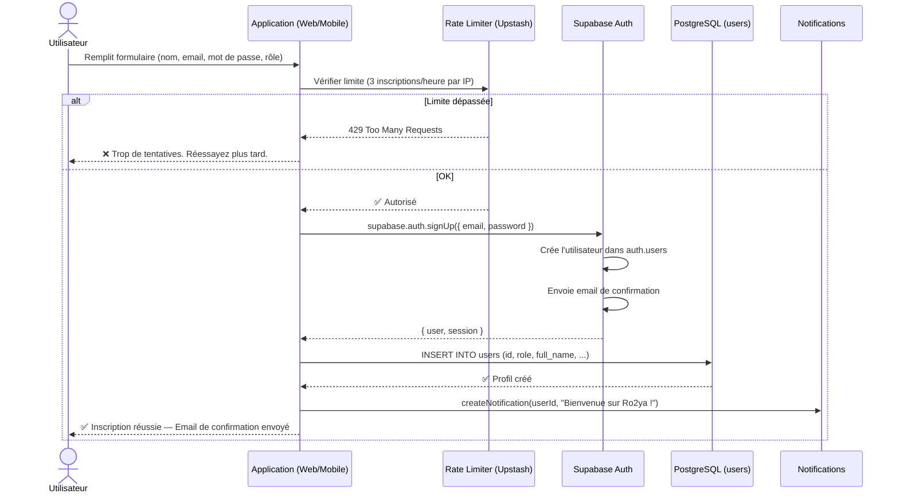

---

## 2️⃣ Connexion (Login)

**Acteurs:** Utilisateur, Application, Supabase Auth, DB (users, stores)

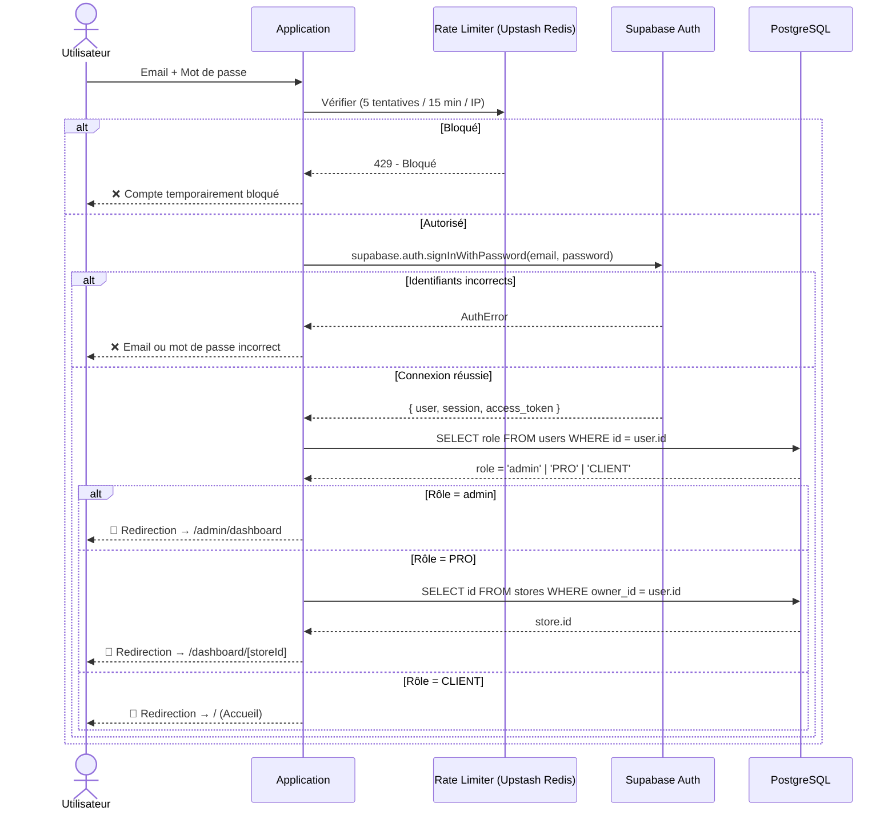

---

## 3️⃣ Récupération du Mot de Passe

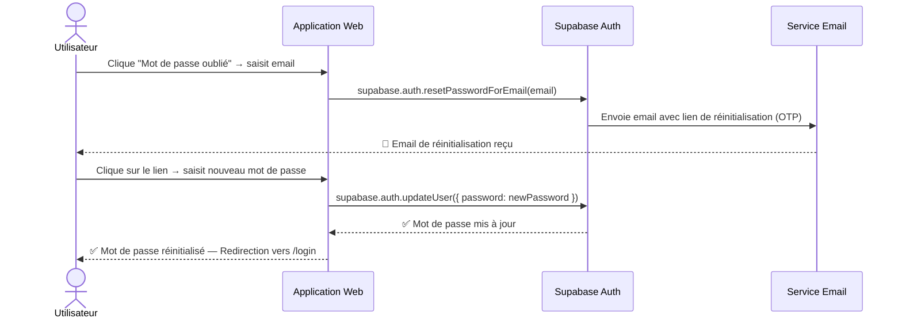

---

## 4️⃣ Création d'un Établissement (Commerçant)

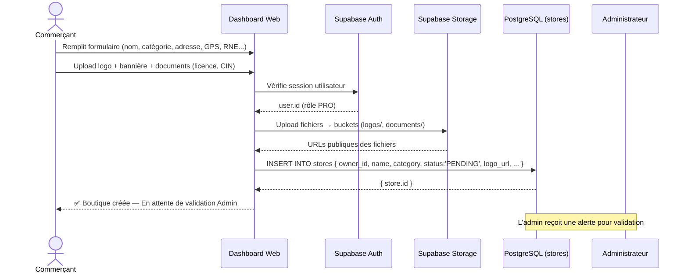

---

## 5️⃣ Approbation d'une Boutique par l'Admin

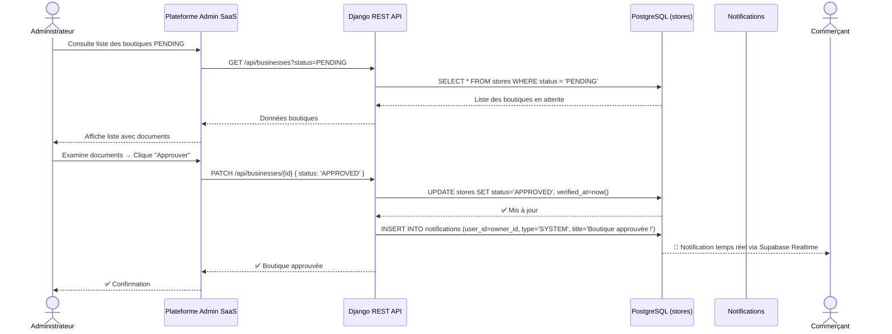

---

## 6️⃣ Création d'une Commande (Client)

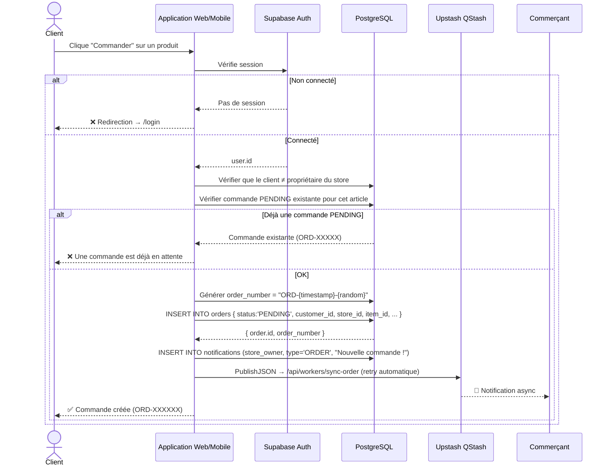

---

## 7️⃣ Validation de Commande + Génération QR Code

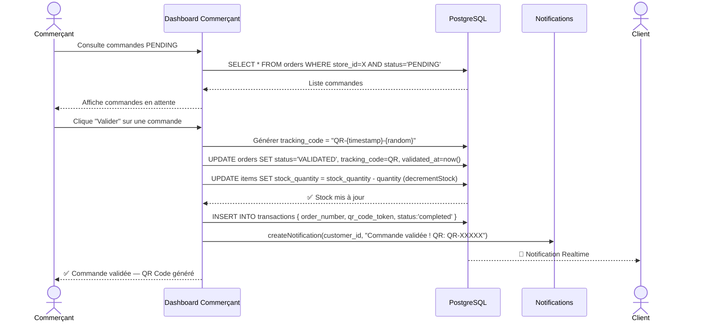

---

## 8️⃣ Scan QR Code à la Livraison

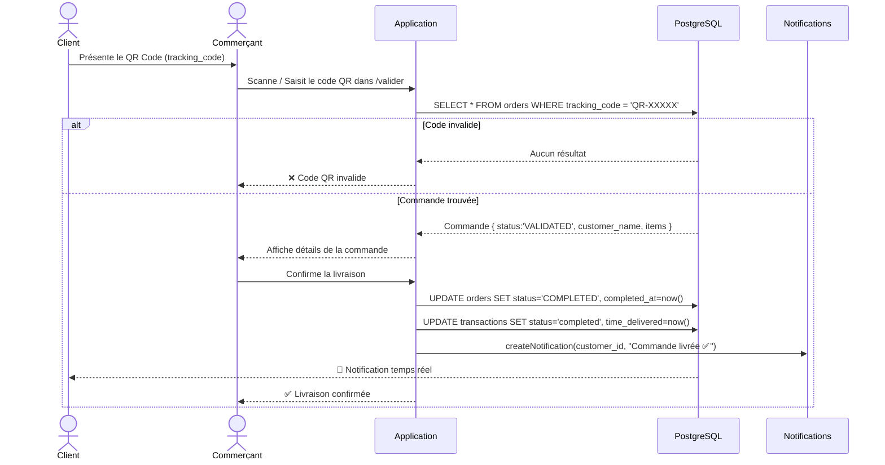

---

## 9️⃣ Annulation d'une Commande

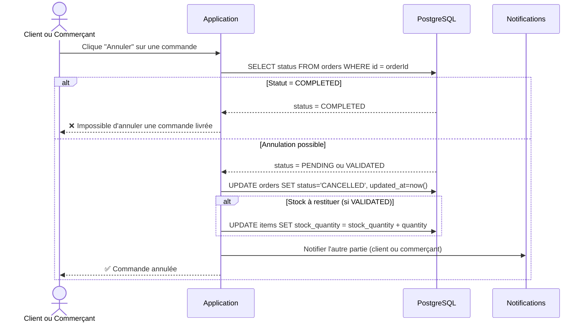

---

## 🔟 Réservation d'un Service (Client)

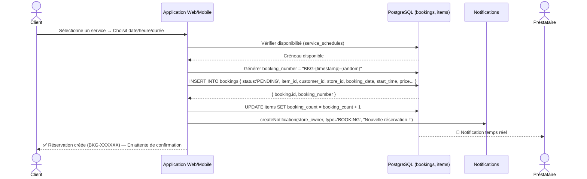

---

## 1️⃣1️⃣ Confirmation d'une Réservation

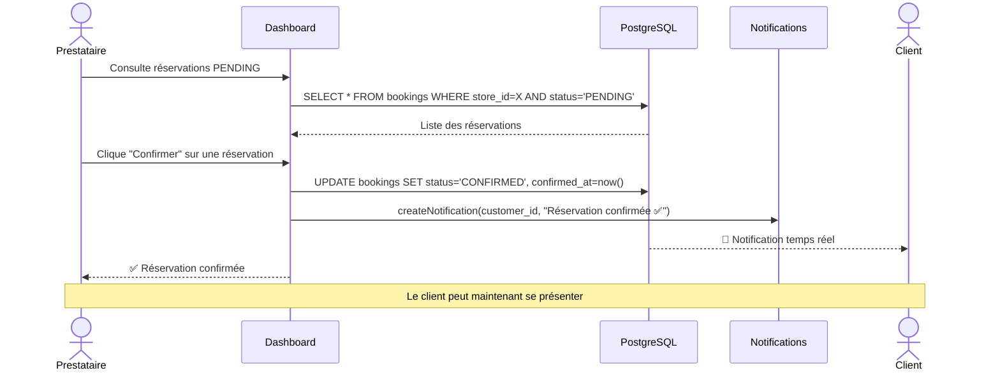

---

## 1️⃣2️⃣ Complétion d'une Réservation (Service Terminé)

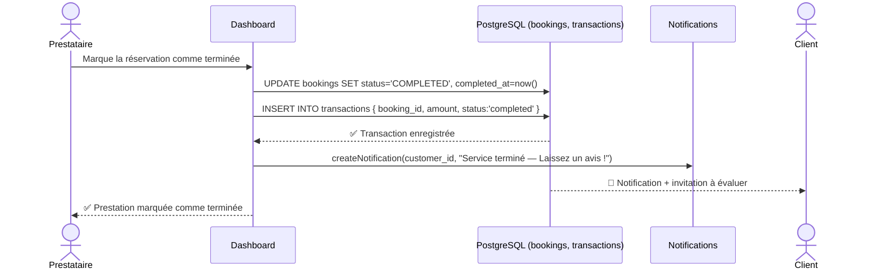

---

## 1️⃣3️⃣ Recherche Sémantique Hybride (7 étapes)

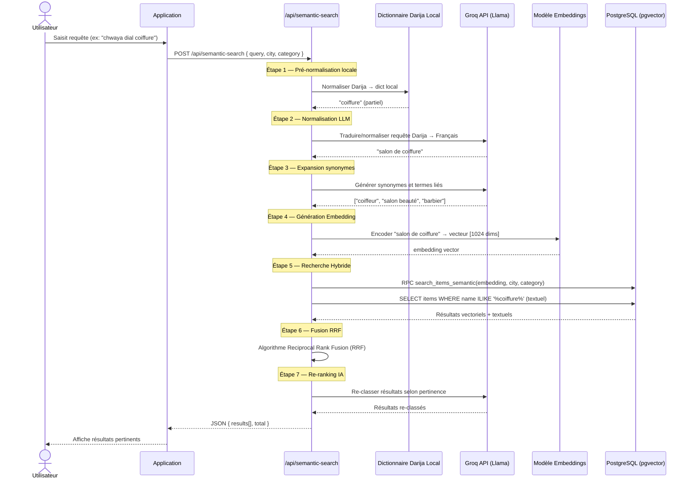

---

## 1️⃣4️⃣ Recherche par Image (Vision IA)

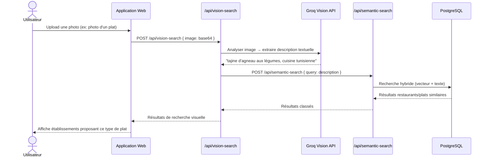

---

## 1️⃣5️⃣ Publication d'un Reel (Commerçant)

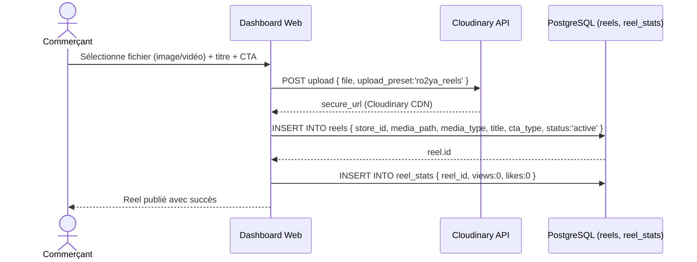

---

## 1️⃣6️⃣ Like / Interaction sur un Reel

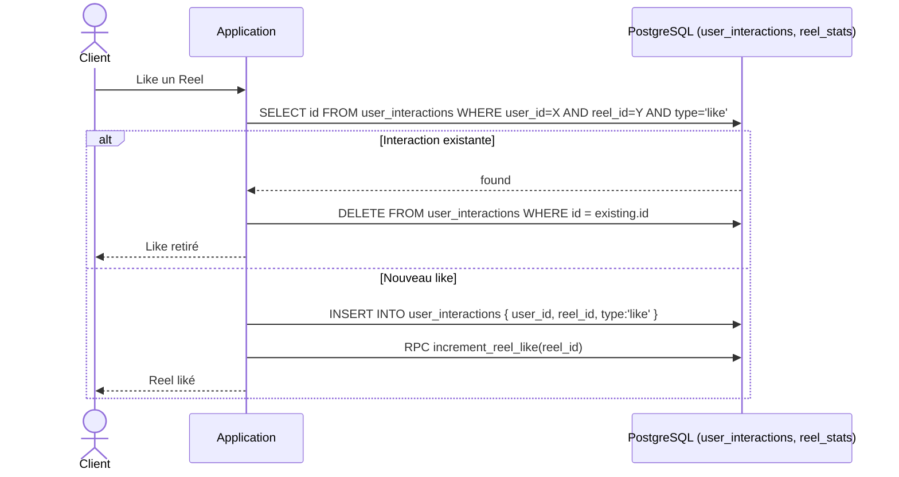

---

## 1️⃣7️⃣ Publication d'une Story (24h)

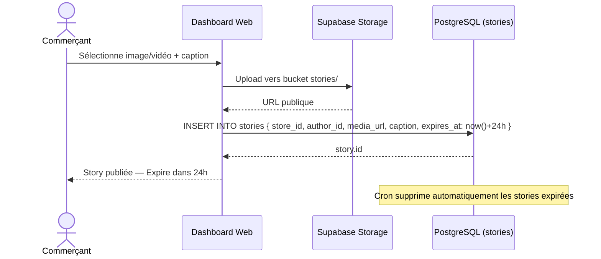

---

## 1️⃣8️⃣ Messagerie Client-Commerçant (Temps Réel)

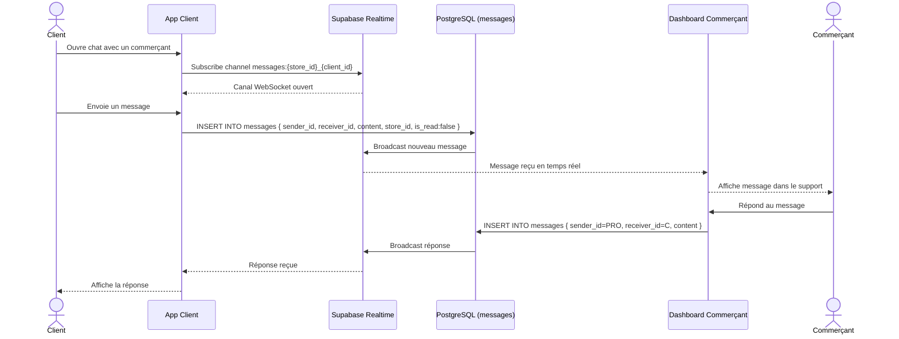

---

## 1️⃣9️⃣ Soumission d'un Avis Client

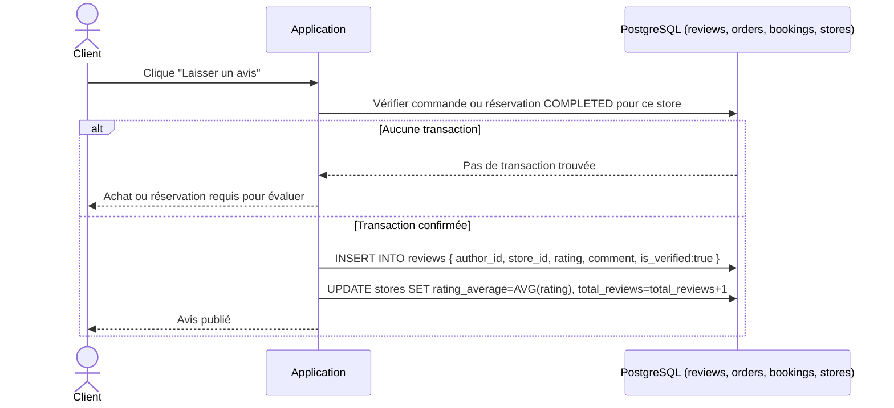

---

## 2️⃣0️⃣ Réponse du Commerçant à un Avis

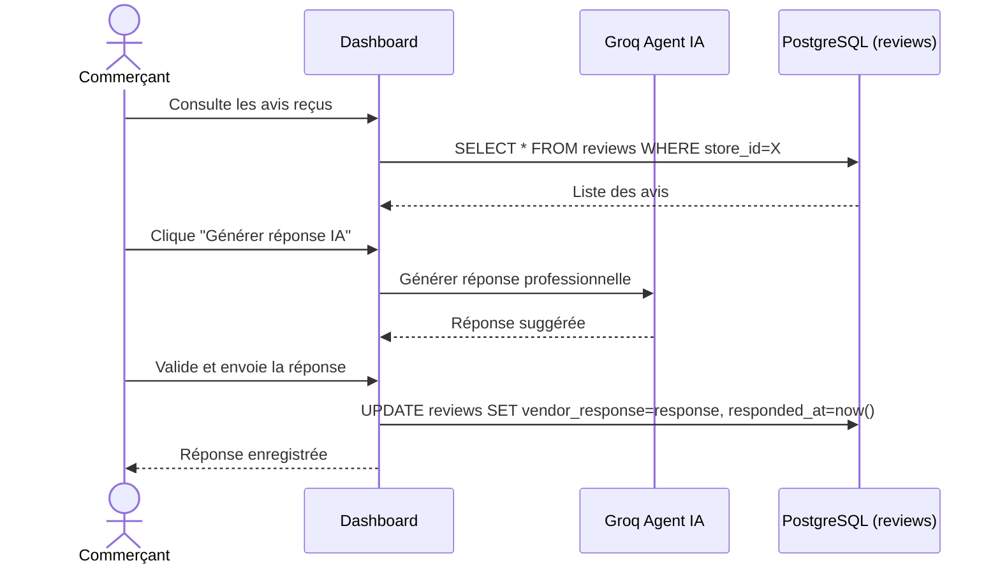

---

## 2️⃣1️⃣ Enregistrer un Établissement (Favoris)

```mermaid
sequenceDiagram
    actor C as Client
    participant APP as Application
    participant DB as PostgreSQL (saved_places)

    C->>APP: Clique icône Favori sur une fiche
    APP->>DB: SELECT id FROM saved_places WHERE user_id=X AND store_id=Y
    alt Déjà en favori
        APP->>DB: DELETE FROM saved_places WHERE user_id=X AND store_id=Y
        APP-->>C: Retiré des favoris
    else Nouveau
        APP->>DB: INSERT INTO saved_places { user_id, store_id }
        APP-->>C: Ajouté aux favoris
    end
```

---

## 2️⃣2️⃣ Notifications Temps Réel (Supabase Realtime)

```mermaid
sequenceDiagram
    participant SERVER as Server Action
    participant DB as PostgreSQL (notifications)
    participant RT as Supabase Realtime (WebSocket)
    participant APP as Application Utilisateur
    actor U as Utilisateur

    SERVER->>DB: INSERT INTO notifications { user_id, title, type, is_read:false }
    DB->>RT: Broadcast INSERT sur la table notifications
    RT-->>APP: Événement WebSocket reçu
    APP->>APP: Badge non-lus + 1
    APP-->>U: Notification affichée
    U->>APP: Clique sur la notification
    APP->>DB: UPDATE notifications SET is_read=true WHERE id=notifId
    APP-->>U: Badge mis à jour
```

---

## 2️⃣3️⃣ Assistant IA Conversationnel

```mermaid
sequenceDiagram
    actor U as Utilisateur
    participant APP as Application Web
    participant API as /api/ai-chat
    participant LLM as Groq API (Llama 3)
    participant DB as PostgreSQL

    U->>APP: Pose une question en Darija/Français
    APP->>API: POST { message, history[] }
    API->>DB: Fetch contexte (catégories, villes)
    DB-->>API: Données contextuelles
    API->>LLM: Chat completion avec system prompt + contexte (streaming)
    LLM-->>API: Stream de tokens
    API-->>APP: Server-Sent Events (SSE)
    APP-->>U: Réponse affichée progressivement
```

---

## 2️⃣4️⃣ Dashboard Analytique Commerçant

```mermaid
sequenceDiagram
    actor PRO as Commerçant
    participant DASH as Dashboard Web
    participant ACTION as getDashboardOverview()
    participant DB as PostgreSQL

    PRO->>DASH: Ouvre /dashboard/[storeId]
    DASH->>ACTION: getDashboardOverview(storeId, period)
    par Requêtes parallèles
        ACTION->>DB: COUNT orders COMPLETED
        ACTION->>DB: SUM total_price (revenus)
        ACTION->>DB: COUNT bookings
        ACTION->>DB: SELECT rating_average, total_reviews FROM stores
        ACTION->>DB: SELECT type, COUNT FROM store_analytics (vues, clics)
        ACTION->>DB: SELECT rating, COUNT FROM reviews GROUP BY rating
        ACTION->>DB: SELECT day, COUNT FROM store_analytics GROUP BY day
    end
    DB-->>ACTION: Données agrégées
    ACTION-->>DASH: { profileViews, purchases, revenue, weeklyStats, ratingData }
    DASH-->>PRO: KPIs + graphiques + activité récente
```

---

## 2️⃣5️⃣ Gestion des Utilisateurs (Admin SaaS)

```mermaid
sequenceDiagram
    actor ADMIN as Administrateur
    participant SAAS as Plateforme Admin SaaS
    participant API as Django REST API
    participant DB as PostgreSQL (users)

    ADMIN->>SAAS: Navigue vers /dashboard/users
    SAAS->>API: GET /api/users?page=1
    API->>DB: SELECT * FROM users ORDER BY created_at DESC
    DB-->>API: Liste paginée
    API-->>SAAS: Données utilisateurs
    SAAS-->>ADMIN: Tableau des utilisateurs
    ADMIN->>SAAS: Clique "Suspendre" sur un compte
    SAAS->>API: PATCH /api/users/{id} { status:'suspended' }
    API->>DB: UPDATE users SET status='suspended'
    API->>DB: INSERT INTO notifications { user_id, title:"Compte suspendu" }
    API-->>SAAS: Confirmation
    SAAS-->>ADMIN: Utilisateur suspendu
```

---

## 2️⃣6️⃣ Ticket de Support

```mermaid
sequenceDiagram
    actor PRO as Commerçant
    participant APP as Application
    participant DB as PostgreSQL (support_tickets, support_messages)
    participant RT as Supabase Realtime
    actor ADMIN as Agent Support

    PRO->>APP: Crée un ticket (sujet + message)
    APP->>DB: INSERT INTO support_tickets { store_id, subject, priority:'medium', status:'open' }
    DB-->>APP: ticket.id
    APP->>DB: INSERT INTO support_messages { ticket_id, sender_type:'customer', content }
    APP-->>PRO: Ticket créé — En attente de réponse
    ADMIN->>DB: SELECT * FROM support_tickets WHERE status='open'
    DB-->>ADMIN: Nouveau ticket visible
    ADMIN->>DB: INSERT INTO support_messages { ticket_id, sender_type:'support', content }
    DB->>RT: Broadcast nouveau message
    RT-->>APP: Réponse reçue
    APP-->>PRO: Réponse du support affichée
    ADMIN->>DB: UPDATE support_tickets SET status='resolved'
```

---

## 2️⃣7️⃣ Abonnement Commerçant (PRO / BUSINESS)

```mermaid
sequenceDiagram
    actor PRO as Commerçant
    participant DASH as Dashboard (AccountSection)
    participant ACTION as account_subscription.ts
    participant DB as PostgreSQL (subscriptions)

    PRO->>DASH: Consulte son plan actuel
    DASH->>DB: SELECT * FROM subscriptions WHERE user_id=X
    DB-->>DASH: Plan FREE actif
    DASH-->>PRO: Affiche plans disponibles
    PRO->>DASH: Clique "Passer au PRO"
    DASH->>ACTION: upgradeSubscription(userId, 'PRO')
    ACTION->>DB: UPDATE subscriptions SET plan_name='PRO', price=49, period_end=now()+30days
    ACTION->>DB: INSERT INTO notifications { title:"Abonnement PRO activé !" }
    DB-->>PRO: Notification activation
    ACTION-->>DASH: Plan mis à jour
    DASH-->>PRO: Fonctionnalités PRO débloquées
```

---

## 2️⃣8️⃣ Synchronisation Asynchrone via Upstash QStash

```mermaid
sequenceDiagram
    participant ACTION as Server Action (Next.js)
    participant QSTASH as Upstash QStash
    participant WORKER as /api/workers/sync-order
    participant DB as PostgreSQL
    participant NOTIF as Notifications

    ACTION->>QSTASH: publishJSON({ url:/api/workers/sync-order, body:{orderId} })
    QSTASH-->>ACTION: Message en file (messageId)
    QSTASH->>WORKER: POST /api/workers/sync-order { orderId }
    WORKER->>WORKER: Vérifie signature QStash
    WORKER->>DB: Synchroniser état de la commande
    alt Succès
        DB-->>WORKER: OK
        WORKER->>NOTIF: Envoyer notifications manquantes
        WORKER-->>QSTASH: HTTP 200 — Traité
    else Échec
        DB-->>WORKER: Erreur
        WORKER-->>QSTASH: HTTP 500 — Retry
        Note over QSTASH: Retry automatique (backoff exponentiel, max 3)
        QSTASH->>WORKER: Nouvel essai après délai
    end
```

---

## Récapitulatif des 28 Diagrammes

| Catégorie | Diagrammes |
|-----------|------------|
| **Authentification** | 1 Signup, 2 Login, 3 Reset Password |
| **Boutique** | 4 Création établissement, 5 Approbation Admin |
| **Commandes** | 6 Création, 7 Validation QR, 8 Scan QR, 9 Annulation |
| **Réservations** | 10 Réservation, 11 Confirmation, 12 Complétion |
| **Recherche IA** | 13 Pipeline 7 étapes, 14 Vision IA |
| **Contenu** | 15 Reel publication, 16 Interaction Reel, 17 Story |
| **Social** | 18 Messagerie, 19 Avis, 20 Réponse avis, 21 Favoris |
| **Système** | 22 Notifications, 23 Assistant IA, 24 Dashboard |
| **Admin SaaS** | 25 Gestion utilisateurs, 26 Support tickets |
| **Business** | 27 Abonnement, 28 QStash async |

---
*Projet de Fin d'Études — Ro2ya | Khaireddine Dab & Abderrahman Abdelli | 2025-2026*
