# 📊 Diagrammes UML - Ro2ya Marketplace

**Pour:** Rapport PFE - GLSI  
**Plateforme:** Ro2ya - Marketplace Tunisienne  
**Date:** Mai 2026

> 📌 **Note:** Ce document présente d'abord les diagrammes de cas d'utilisation (par acteur), puis les diagrammes de séquence détaillant les flux principaux de la plateforme.

---

## 📑 Table des Matières

### Partie A — Diagrammes de Cas d'Utilisation
1. [Cas d'utilisation — Client](#cas-dutilisation--client)
2. [Cas d'utilisation — Commerçant](#cas-dutilisation--commerçant-pro)
3. [Cas d'utilisation — Administrateur](#cas-dutilisation--administrateur)

### Partie B — Diagrammes de Séquence
4. [Authentification](#1️⃣-authentification)
5. [Système de Commandes](#2️⃣-système-de-commandes)
6. [Système de Réservations](#3️⃣-système-de-réservations)
7. [Validation par QR Code](#4️⃣-validation-par-qr-code)
8. [Messagerie & Chat](#5️⃣-messagerie--chat)
9. [Recherche Intelligente](#6️⃣-recherche-intelligente)
10. [Système d'Avis](#7️⃣-système-davis)
11. [Gestion des Favoris](#8️⃣-gestion-des-favoris)
12. [Notifications](#9️⃣-notifications)

---

## 📊 Partie A : Diagrammes de Cas d'Utilisation

---

### Cas d'utilisation — Client

**Acteur :** 👤 Client (consommateur inscrit sur la plateforme Ro2ya)

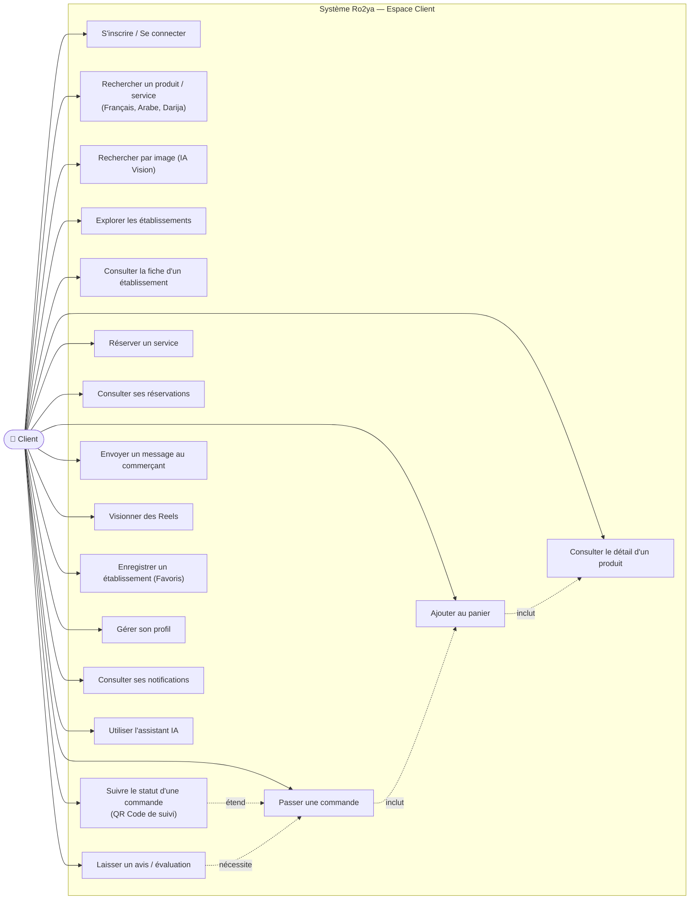

---

### Cas d'utilisation — Commerçant (Pro)

**Acteur :** 🏪 Commerçant / Prestataire de services inscrit comme "Pro" sur la plateforme


---

### Cas d'utilisation — Administrateur

**Acteur :** 🛡️ Administrateur système (accès à la plateforme SaaS d'administration)


---

## 📋 Partie B : Diagrammes de Séquence

---

## 1️⃣ Authentification

### 1.1 Flux d'Inscription (Signup)

**Objectif:** Un nouvel utilisateur crée un compte sur la plateforme.

**Étapes simples:**
1. L'utilisateur remplit le formulaire (email, mot de passe, prénom, nom, téléphone)
2. Le système vérifie que l'email n'existe pas déjà
3. Un compte est créé dans la base de données
4. Un email de confirmation est envoyé
5. L'utilisateur confirme son email en cliquant le lien
6. Le compte est activé

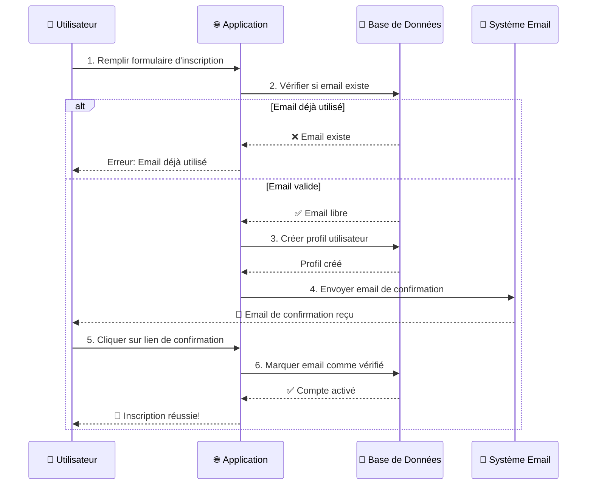

---

### 1.2 Flux de Connexion (Login)

**Objectif:** Un utilisateur existant se connecte à son compte.

**Étapes simples:**
1. L'utilisateur entre son email et mot de passe
2. Le système vérifie les identifiants
3. Une session de sécurité est créée
4. L'utilisateur est redirigé selon son rôle

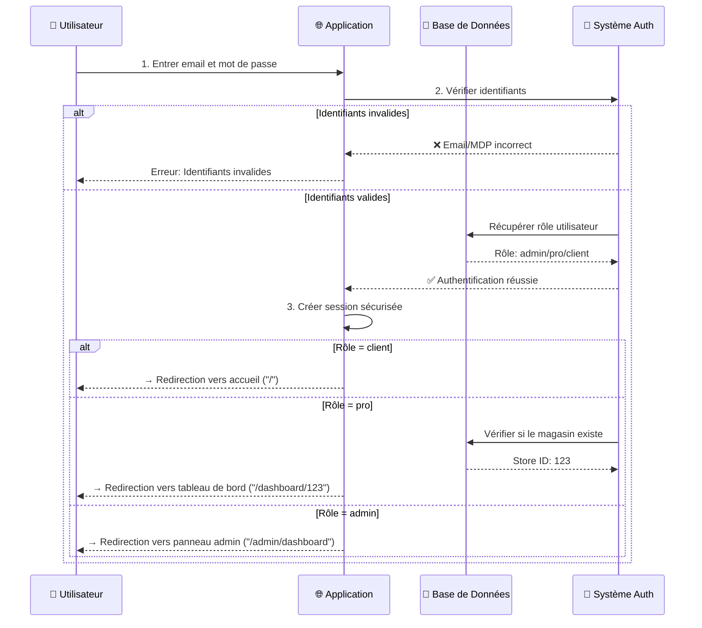

---

## 2️⃣ Système de Commandes

### 2.1 Flux Complet d'une Commande

**Objectif:** Un client commande un produit dans un magasin, le propriétaire valide, et la commande est livrée.

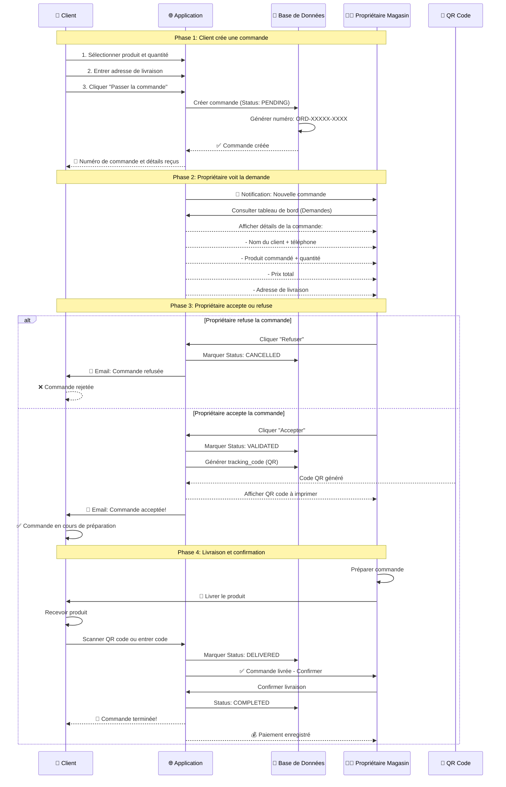

---

## 3️⃣ Système de Réservations

### 3.1 Flux de Réservation de Service

**Objectif:** Un client réserve un service (coiffeur, salon, etc.) dans un magasin.

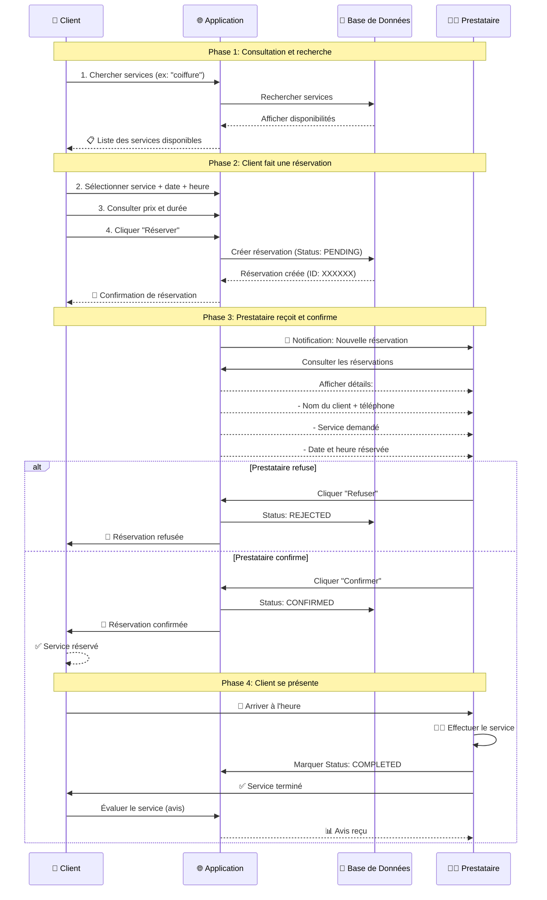

---

## 4️⃣ Validation par QR Code

### 4.1 Flux de Confirmation de Livraison (QR Code)

**Objectif:** Le propriétaire confirme la livraison en scannant un QR code généré pour chaque commande.

> **⚠️ Important:** La plateforme n'a PAS de système de paiement en ligne. Le paiement se fait:
> - Directement au propriétaire (en main à la livraison)
> - Ou via système externe (Ooredoo Money, Tunisie Telecom, etc.)

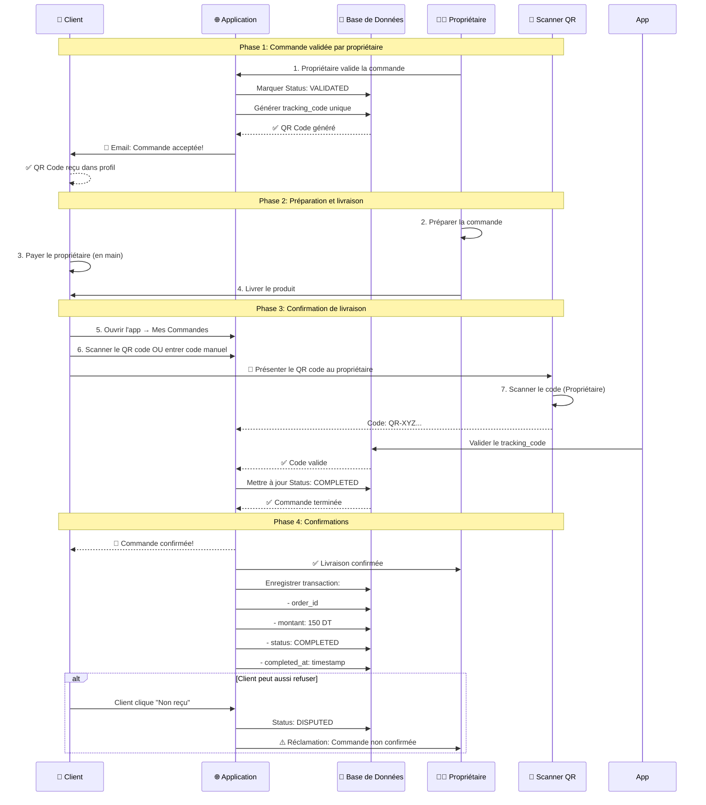

### 4.2 Flux de Paiement (OPTIONNEL - Futur)

> 📌 **À implémenter:** Intégration futur pour paiements en ligne

**Services possibles:**
- Stripe (paiements carte bancaire)
- Ooredoo Money (paiement mobile Tunisie)
- Tunisie Telecom (paiement mobile)
- Konnect (agrégateur paiements tunisien)

---

## 5️⃣ Messagerie & Chat

### 5.1 Flux de Messagerie entre Client et Propriétaire

**Objectif:** Un client peut discuter directement avec le propriétaire du magasin.

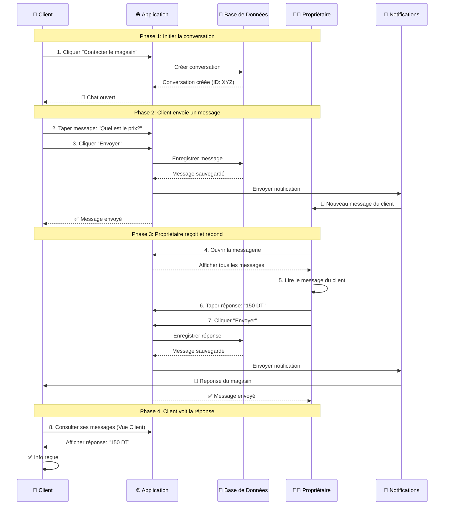

---

## 6️⃣ Recherche Intelligente

### 6.1 Flux de Recherche Sémantique en Darija

**Objectif:** Un utilisateur cherche un produit en dialecte tunisien (Darija), le système le comprend.

> **Modèles IA utilisés:**
> - **Groq (Llama 3.1 8B)** - Normalisation et traduction Darija
> - **OpenRouter (baai/bge-m3)** - Génération de vecteurs d'embedding

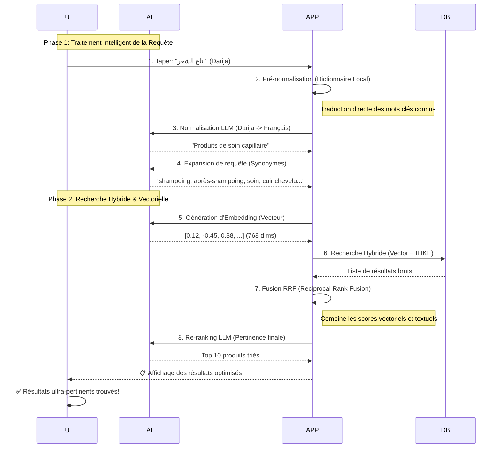

---

## 7️⃣ Système d'Avis

### 7.1 Flux de Publication d'Avis

**Objectif:** Un client laisse un avis sur un produit ou service qu'il a acheté.

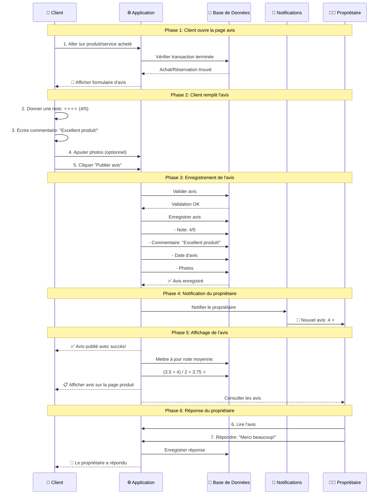

---

## 8️⃣ Gestion des Favoris

### 8.1 Flux d'Ajout aux Favoris

**Objectif:** Un client ajoute un produit ou magasin à ses favoris.

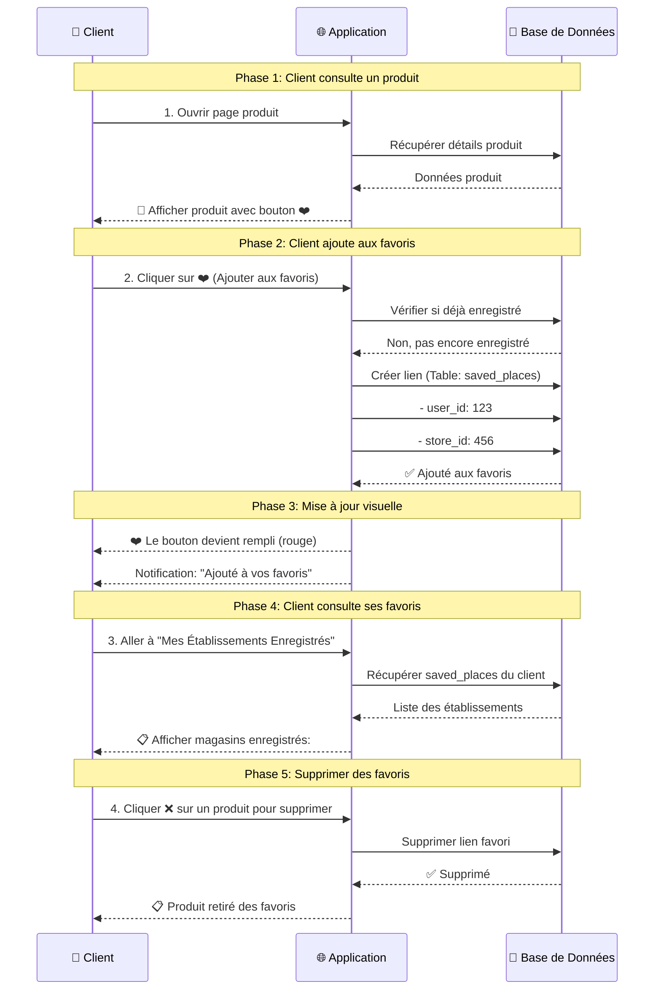

---

## 9️⃣ Notifications

### 9.1 Flux de Notification en Temps Réel

**Objectif:** L'utilisateur reçoit des notifications pour les événements importants.

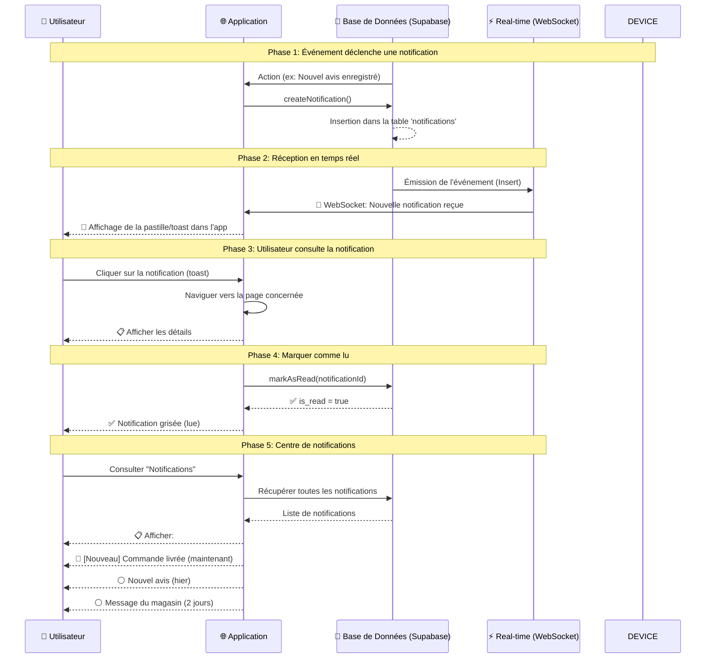

---

## 🎯 Résumé des Flux Principaux

| Flux | Acteurs | Objectif | Étapes |
|------|---------|----------|--------|
| **Authentification** | Client | Se connecter | 3-5 |
| **Commande** | Client + Propriétaire | Vendre/Acheter | 4-5 |
| **QR Validation** | Client + Propriétaire | Confirmer livraison | 4-5 |
| **Réservation** | Client + Prestataire | Réserver service | 4 |
| **Messagerie** | Client + Propriétaire | Communiquer | 4-5 |
| **Recherche** | Client + IA | Trouver produits | 4 |
| **Avis** | Client + Propriétaire | Évaluer | 5-6 |
| **Favoris** | Client | Sauvegarder | 3-4 |
| **Notifications** | Système + Client | Informer | 3-5 |

---

## 🏗️ Architecture Générale Simplifiée

```
┌──────────────────────────────────────────────────────────────┐
│                    🌐 Frontend (React)                       │
│        Pages, Formulaires, Notifications Visuelles           │
└──────────────────────┬───────────────────────────────────────┘
                       │
    ┌──────────────────┼──────────────────┐
    │                  │                  │
    ▼                  ▼                  ▼
┌─────────────┐  ┌──────────────┐  ┌──────────────┐
│ API Routes  │  │Server Actions│  │ Middleware   │
│ (Backend)   │  │ (Backend)    │  │ (Sécurité)   │
└─────────────┘  └──────────────┘  └──────────────┘
    │                  │                  │
    └──────────────────┼──────────────────┘
                       │
                       ▼
         ┌─────────────────────────────┐
         │  📊 Base de Données         │
         │  (PostgreSQL - Supabase)    │
         │                             │
         │  • Users & Profiles         │
         │  • Products & Stores        │
         │  • Orders & Transactions    │
         │  • Messages & Reviews       │
         │  • Favorites & Bookings     │
         └─────────────────────────────┘
                        │
    ┌──────────────────┼──────────────────┬──────────────────┐
    │                  │                  │                  │
    ▼                  ▼                  ▼                  ▼
┌──────────┐    ┌────────────┐    ┌──────────┐    ┌────────────┐
│ Email    │    │ AI (Groq)  │    │ Storage  │    │ QStash     │
│Service   │    │ + Search   │    │ (Images) │    │ (Workers)  │
└──────────┘    └────────────┘    └──────────┘    └────────────┘
```

---

## 📚 Glossaire pour le Rapport

### Termes Techniques Simplifiés

| Terme | Explication Simple |
|-------|------------------|
| **Database** | Base de données = Classeur électronique où tout est enregistré |
| **API** | Service qui reçoit les demandes et les traite |
| **Session** | Connexion active entre l'utilisateur et l'application |
| **Status** | État de quelque chose (PENDING = en attente, VALIDATED = validé) |
| **Notification** | Message d'alerte envoyé à l'utilisateur |
| **QR Code** | Code barre à scanner pour confirmer |
| **Middleware** | Filtre de sécurité pour protéger l'application |
| **Server Action** | Fonction qui s'exécute sur le serveur (sûr) |
| **Real-time** | En temps réel (immédiat) |
| **Transaction** | Enregistrement d'une opération (paiement, etc.) |

---

## 🔒 Considérations de Sécurité

Chaque flux intègre:
- ✅ **Authentification** - Vérifier que l'utilisateur est bien celui qu'il prétend être
- ✅ **Autorisation** - Vérifier que l'utilisateur a le droit de faire cette action
- ✅ **Validation** - Vérifier que les données sont correctes
- ✅ **Chiffrement** - Protéger les données sensibles
- ✅ **Audit** - Enregistrer toutes les actions importantes

---

## 📝 Notes pour le Rapport PFE

### 🔴 Point Important: Pas de Paiement en Ligne

**La plateforme Ro2ya n'intègre PAS de système de paiement en ligne.** Cela signifie:

| Aspect | Détail |
|--------|--------|
| **Paiement Actuel** | En main à la livraison (cash) |
| **Traçabilité** | Enregistrement de la transaction dans la DB |
| **QR Code** | Confirmation de livraison (pas de paiement) |
| **Transactions enregistrées** | Historique uniquement, pas d'argent traité |

**Raisons possibles:**
1. ✅ Marché Tunisien préfère paiement cash
2. ✅ Compliance PCI-DSS complexe
3. ✅ Phase MVP - paiement = futur
4. ✅ Autorités Tunisiennes (réglementation)

**À ajouter dans le rapport:**
- [ ] Diagramme: Flux actuel (sans paiement)
- [ ] Table: Services paiement à intégrer
- [ ] Timeline: Quand implémenter le paiement
- [ ] Risques: Sécurité, conformité


Ces diagrammes montrent les **flux utilisateur** de manière simple. Chaque ligne représente une action, chaque flèche une communication. Cela aide à:

1. **Comprendre le système** - Voir comment tout fonctionne ensemble
2. **Identifier les problèmes** - Voir où ça peut casser
3. **Optimiser le processus** - Voir où on peut améliorer
4. **Documenter le projet** - Garder une trace claire

### Comment présenter dans le rapport?

1. **Introduction** - Expliquer que la plateforme a 9 flux principaux
2. **Pour chaque flux** - Ajouter:
   - Objectif du flux
   - Les acteurs impliqués
   - Les étapes principales
   - Le diagramme de séquence
   - Les cas d'erreur
3. **Conclusion** - Résumer l'architecture générale

### Questions à traiter dans le rapport

- ✅ Quel est le flux le plus critique? *Réponse: Commandes + Paiements*
- ✅ Quels sont les risques de sécurité? *Réponse: Authentification faible, données sensibles*
- ✅ Comment améliorer les performances? *Réponse: Cache, Base de données optimisée*
- ✅ Comment gérer les erreurs? *Réponse: Logs, Alerts, Retry logic*

---

## 🚀 Prochaines Étapes Recommandées

Pour la plateforme:
1. Ajouter **paiement mobile** (Ooredoo Money, Tunisie Telecom)
2. Ajouter **géolocalisation** pour les recherches proches
3. Ajouter **recommandations personnalisées** par IA
4. Ajouter **système de notation des utilisateurs**
5. Ajouter **support vidéo** pour les services

Pour le rapport:
1. Ajouter des **cas d'usage détaillés**
2. Ajouter des **statistiques** (nombre d'utilisateurs, transactions, etc.)
3. Ajouter des **captures d'écran** de l'interface
4. Ajouter des **plans d'amélioration futurs**
5. Ajouter des **métriques de performance**

---

**Créé pour le projet PFE - Mai 2026**  
**Étudiants:** Khaireddine Dab & Abderrahman Abdelli


---

### Diagramme de Cas d'Utilisation — Acteur : Client


---

### Diagramme de Cas d'Utilisation — Acteur : Commerçant (Pro)

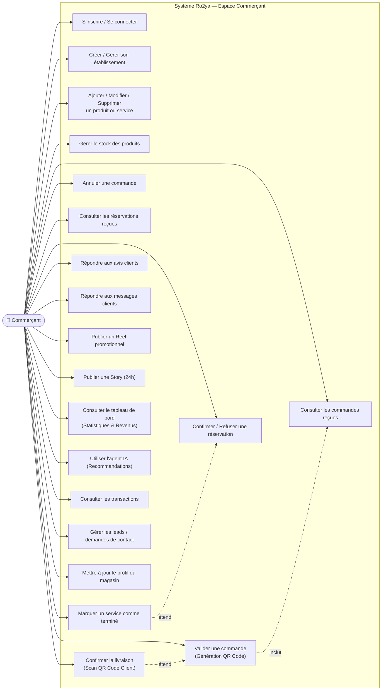

---

### Diagramme de Cas d'Utilisation — Acteur : Administrateur

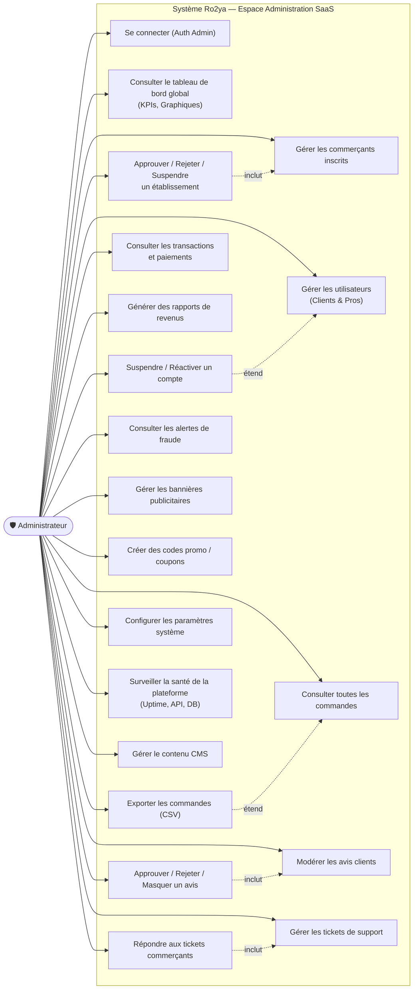

---

**Créé pour le projet PFE - Mai 2026**  
**Étudiants:** Khaireddine Dab & Abderrahman Abdelli
