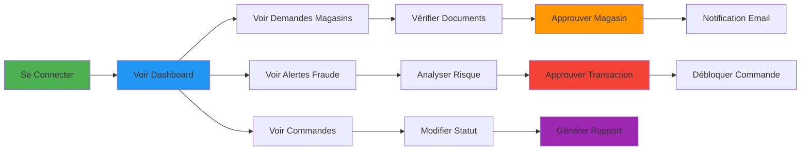

# Diagramme de Cas d'Utilisation - Plateforme Admin SaaS

## Vue d'Ensemble UML

```mermaid
graph TB
    Admin["👤 Admin<br/>(Administrateur)"]
    
    subgraph Auth["🔐 Authentification"]
        Login["Se Connecter"]
        ResetPwd["Réinitialiser MDP"]
        Logout["Se Déconnecter"]
    end
    
    subgraph UserMgmt["👥 Gestion Utilisateurs"]
        ListUsers["Voir Liste Utilisateurs"]
        ViewUser["Consulter Profil User"]
        EditUser["Modifier Utilisateur"]
        BanUser["Suspendre/Bannir User"]
        UserHistory["Voir Historique User"]
    end
    
    subgraph StoreMgmt["🏪 Gestion Magasins"]
        ViewStoreRequests["Voir Demandes Enregistrement"]
        ApproveStore["Approuver Magasin"]
        RejectStore["Rejeter Demande"]
        VerifyDocs["Vérifier Documents"]
        SuspendStore["Suspendre Magasin"]
        StoreAnalytics["Voir Analytics Magasin"]
    end
    
    subgraph ProductMgmt["📦 Gestion Produits/Services"]
        ModerateContent["Modérer Contenu"]
        FlagProduct["Signaler Produit"]
        ViewProductStats["Voir Stats Produits"]
        BanProduct["Bannir Produit"]
    end
    
    subgraph OrderMgmt["📋 Gestion Commandes"]
        ViewOrders["Voir Toutes Commandes"]
        ViewOrderDetails["Consulter Détails Cmd"]
        EditOrderStatus["Modifier Statut"]
        ManageRefunds["Gérer Remboursements"]
        ExportOrders["Exporter Commandes"]
    end
    
    subgraph BookingMgmt["📅 Gestion Réservations"]
        ViewBookings["Voir Réservations"]
        EditBookingStatus["Modifier Statut Résa"]
        ViewCalendar["Voir Calendrier Dispo"]
    end
    
    subgraph FraudMgmt["🚨 Détection Fraude"]
        ViewFraudAlerts["Voir Alertes Fraude"]
        AnalyzeRisk["Analyser Risque"]
        ApproveTransaction["Approuver Transact"]
        RejectTransaction["Rejeter Transact"]
        ManageFraudRules["Gérer Règles Fraude"]
    end
    
    subgraph PromotionMgmt["🎯 Gestion Promotions"]
        CreatePromo["Créer Promotion"]
        ViewPromos["Voir Promotions"]
        EditPromo["Modifier Promotion"]
        AnalyzePromoImpact["Analyser Impact"]
    end
    
    subgraph BannerMgmt["📢 Gestion Bannières"]
        CreateBanner["Créer Bannière"]
        ScheduleBanner["Programmer Bannière"]
        ViewBannerStats["Voir Stats Bannière"]
        DeleteBanner["Supprimer Bannière"]
    end
    
    subgraph SupportMgmt["💬 Gestion Support"]
        ViewTickets["Voir Tickets Support"]
        ReplyTicket["Répondre Ticket"]
        CloseTicket["Clore Ticket"]
        ViewMessages["Voir Messagerie"]
    end
    
    subgraph Analytics["📊 Analytics & Rapports"]
        ViewDashboard["Voir Dashboard Principal"]
        ViewTransactionStats["Analyser Transactions"]
        ViewTrends["Voir Tendances"]
        GenerateReport["Générer Rapport"]
        ViewUserMetrics["Voir Métriques Clients"]
        ExportData["Exporter Données"]
    end
    
    subgraph ReviewMgmt["⭐ Gestion Avis"]
        ModerateReviews["Modérer Avis"]
        ViewReviewStats["Voir Stats Avis"]
        FlagReview["Signaler Avis Frauduleux"]
    end
    
    subgraph Settings["⚙️ Configuration Système"]
        ManageBrands["Gérer Marques"]
        ManageCategories["Gérer Catégories"]
        ManageTaxes["Gérer Taxes"]
        SystemConfig["Configuration Générale"]
        ManageRoles["Gérer Rôles/Permissions"]
    end
    
    subgraph NotificationMgmt["🔔 Gestion Notifications"]
        CreateNotif["Créer Notification"]
        SendNotif["Envoyer Notification"]
        ViewNotifHistory["Voir Historique Notifs"]
    end
    
    subgraph CMSMgmt["📄 Gestion CMS"]
        CreatePage["Créer Page"]
        EditPage["Éditer Page"]
        PublishPage["Publier Page"]
        DeletePage["Supprimer Page"]
    end
    
    subgraph MapMgmt["🗺️ Gestion Cartographie"]
        ViewMap["Voir Carte Magasins"]
        ViewGeoStats["Voir Stats Géographiques"]
    end
    
    subgraph PaymentMgmt["💳 Gestion Paiements"]
        ViewPayments["Voir Paiements"]
        ProcessPayout["Traiter Payout"]
        ViewPaymentStats["Voir Stats Paiements"]
    end
    
    Admin --> Auth
    Admin --> UserMgmt
    Admin --> StoreMgmt
    Admin --> ProductMgmt
    Admin --> OrderMgmt
    Admin --> BookingMgmt
    Admin --> FraudMgmt
    Admin --> PromotionMgmt
    Admin --> BannerMgmt
    Admin --> SupportMgmt
    Admin --> Analytics
    Admin --> ReviewMgmt
    Admin --> Settings
    Admin --> NotificationMgmt
    Admin --> CMSMgmt
    Admin --> MapMgmt
    Admin --> PaymentMgmt
```



---

## Diagramme UML Textuel (Format UML Standard)

```mermaid
actor Admin as Admin

Admin --> (Se Connecter)
Admin --> (Réinitialiser MDP)

Admin --> (Voir Liste Utilisateurs)
Admin --> (Modifier Utilisateur)
Admin --> (Suspendre Utilisateur)

Admin --> (Voir Demandes Magasins)
Admin --> (Approuver Magasin)
Admin --> (Rejeter Magasin)
Admin --> (Vérifier Documents)

Admin --> (Voir Commandes)
Admin --> (Modifier Statut Commande)
Admin --> (Gérer Remboursements)

Admin --> (Voir Alertes Fraude)
Admin --> (Analyser Risque Fraude)
Admin --> (Approuver Transaction)

Admin --> (Modérer Contenu Produits)
Admin --> (Signaler Produit Frauduleux)

Admin --> (Voir Tickets Support)
Admin --> (Répondre Ticket)

Admin --> (Voir Dashboard Analytics)
Admin --> (Générer Rapports)
Admin --> (Exporter Données)

Admin --> (Créer Promotion)
Admin --> (Créer Bannière)

Admin --> (Modérer Avis)
Admin --> (Gérer Catégories)
Admin --> (Gérer Rôles)
```

---

## Cas d'Utilisation Détaillés par Module

### 🔐 **Module 1: Authentification & Session**

| Cas d'Utilisation | Acteur | Prérequis | Flux |
|---|---|---|---|
| Se Connecter | Admin | Compte créé | Email → MDP → Validation → JWT token |
| Réinitialiser MDP | Admin | Compte oublié | Email → Lien reset → Nouveau MDP |
| Se Déconnecter | Admin | Connecté | Clique logout → Token révoqué |
| Gérer Session | Admin | Connecté | Refresh token → Access token valide |

---

### 👥 **Module 2: Gestion Utilisateurs**

| Cas d'Utilisation | Flux Principal | Variantes | Données |
|---|---|---|---|
| **Voir Liste Utilisateurs** | Liste → Filtrer → Trier | Par rôle, statut, date | Email, Rôle, Statut, Création |
| **Consulter Profil** | Sélectionner user → Afficher détails | Historique commandes, avis | Tous les champs profile |
| **Modifier Utilisateur** | Éditer champs → Valider → Sauvegarder | Update email, rôle | Notification user |
| **Suspendre Utilisateur** | Sélectionner → Confirmer → Appliquer | Soft delete, notification | Raison, date suspension |
| **Bannir Utilisateur** | Sélectionner → Raison → Confirmer | Compte bloqué définitivement | Raison, date ban |

---

### 🏪 **Module 3: Gestion Magasins**

| Cas d'Utilisation | Flux | Résultat | Notes |
|---|---|---|---|
| **Voir Demandes** | Dashboard → Onglet "En attente" | Liste triée par date | Status: pending |
| **Approuver Magasin** | Sélectionner → Vérifier docs → Approuver | Store → Active, Email notif | KYC validation |
| **Rejeter Demande** | Sélectionner → Raison → Confirmer | Store → Rejected, Email | Raison mandatory |
| **Vérifier Documents** | Ouvrir dossier → Vérifier licence → Validation | Checklist, notation | Doc types: License, ID |
| **Suspendre Magasin** | Sélectionner actif → Raison → Confirmer | Store → Suspended | Temporaire ou permanent |
| **Voir Analytics** | Store → Stats → Graphiques | Revenue, orders, ratings | Période sélectionnable |

---

### 📦 **Module 4: Gestion Produits & Services**

| Cas d'Utilisation | Action | Critères | Résultat |
|---|---|---|---|
| **Modérer Contenu** | Vérifier produits signalés | Contenu offensant, faux | Approuver / Rejeter |
| **Signaler Produit** | Marquer comme frauduleux | Contrefaçon, prix abusif | Status: FLAGGED |
| **Bannir Produit** | Retirer définitivement | Violation politique | Status: BANNED, Notification |
| **Voir Stats Produits** | Analyser performance | Top sellers, flops | Graphiques, tendances |

---

### 📋 **Module 5: Gestion Commandes**

| Cas d'Utilisation | Détails | Filtres | Actions |
|---|---|---|---|
| **Voir Toutes Commandes** | Liste complète | Date, store, client, status | Recherche textuelle |
| **Consulter Détails** | Détails complets | Montant, items, timeline | Export PDF |
| **Modifier Statut** | Workflow | pending → processing → shipped | Raison changement |
| **Gérer Remboursements** | Initier remboursement | Commande, montant, raison | Stripe integration |
| **Exporter Commandes** | Télécharger données | CSV, PDF | Filtres appliqués |

---

### 📅 **Module 6: Gestion Réservations**

| Cas d'Utilisation | Flux | Données | Intégration |
|---|---|---|---|
| **Voir Réservations** | Liste triée par date | Client, service, créeau | Calendrier |
| **Modifier Statut** | pending → confirmed → completed | Timeline, notes | Notification parties |
| **Voir Calendrier** | Afficher dispo par service | Date, créneaux, occupation | Calendly sync |

---

### 🚨 **Module 7: Détection de Fraude**

| Cas d'Utilisation | Détails | Score | Actions |
|---|---|---|---|
| **Voir Alertes Fraude** | Liste triée par risque | 0-100 | Filter par severity |
| **Analyser Risque** | Détails d'analyse | Score, signaux détectés | AI reasoning |
| **Approuver Transact** | Marquer comme safe | Score < 25 | Débloquer commande |
| **Rejeter Transact** | Marquer comme bloquée | Score > 75 | Notifier client |
| **Gérer Règles Fraude** | Configurer seuils | Heuristiques, poids signaux | Backend config |

---

### 🎯 **Module 8: Gestion Promotions**

| Cas d'Utilisation | Détails | Paramètres | Impact |
|---|---|---|---|
| **Créer Promotion** | Globale, tous magasins | Réduction %, produits, dates | Analytics suivi |
| **Voir Promotions** | Liste active/passée | Status, durée, impact | Tri par date |
| **Modifier Promotion** | Éditer paramètres | Dates, produits, % | Notification magasins |
| **Analyser Impact** | Graphiques ROI | Conversion rate, revenue | Période sélectionnable |

---

### 📢 **Module 9: Gestion Bannières**

| Cas d'Utilisation | Détails | Placement | Données |
|---|---|---|---|
| **Créer Bannière** | Titre, image, CTA | Homepage, category, popup | Scheduling |
| **Programmer Bannière** | Date/heure activation | Start/end date | Automatique |
| **Voir Stats** | Impressions, clics | CTR, conversions | Graphiques temps réel |

---

### 💬 **Module 10: Support Client**

| Cas d'Utilisation | Flux | Priorités | Escalade |
|---|---|---|---|
| **Voir Tickets** | Liste triée | Urgent, normal, low | Filter par status |
| **Répondre Ticket** | Chat intégré | Message template possible | Temps réponse suivi |
| **Clore Ticket** | Marquer résolu | Avec/sans satisfaction survey | Archive |
| **Voir Messagerie** | Conversation historique | Client ↔ Admin | Real-time |

---

### 📊 **Module 11: Analytics & Rapports**

| Cas d'Utilisation | KPIs | Graphiques | Export |
|---|---|---|---|
| **Dashboard Principal** | Revenue, orders, users | Timeseries, heatmap | Snapshot |
| **Analyser Transactions** | Volume, montant moyen, fee | Distribution, tendances | CSV |
| **Voir Tendances** | Top produits, magasins | Pareto, growth rate | Prévisions optionnelles |
| **Générer Rapport** | Personnalisé par période | Formats multiples | PDF, Excel |
| **Métriques Clients** | Acquisition, churn, LTV | Segmentation, cohort | Tableau détaillé |

---

### ⭐ **Module 12: Gestion Avis**

| Cas d'Utilisation | Critères | Action | Résultat |
|---|---|---|---|
| **Modérer Avis** | Contenu offensant, spam | Approuver / Rejeter | Visible / Caché |
| **Voir Stats Avis** | Moyenne, distribution | Graphique sentiments | Par magasin / produit |
| **Signaler Avis Faux** | Detect pattern | Marquer frauduleux | Investigation manuel |

---

### ⚙️ **Module 13: Configuration Système**

| Cas d'Utilisation | Entités | Actions | Validation |
|---|---|---|---|
| **Gérer Marques** | Créer, éditer, supprimer | Hiérarchie, images | Unicité du nom |
| **Gérer Catégories** | Hiérarchie arborescente | CRUD, reordering | Parent/child |
| **Gérer Taxes** | Taux par région | Appliquer à produits | Calcul automatique |
| **Configuration Globale** | Paramètres système | Email, SMS, API keys | Cryptage secrets |
| **Gérer Rôles** | Admin, Support, Moderator | Permissions granulaires | RLS policies |

---

### 🔔 **Module 14: Notifications**

| Cas d'Utilisation | Types | Canaux | Tracking |
|---|---|---|---|
| **Créer Notification** | Annonce, alerte, promotion | Email, SMS, push, in-app | Template |
| **Envoyer Notification** | Immédiate, planifiée | Broadcast, segment | Confirmation envoi |
| **Voir Historique** | Toutes notifications | Status, reads, failures | Audit log |

---

### 📄 **Module 15: Gestion CMS**

| Cas d'Utilisation | Contenu | Workflow | Publication |
|---|---|---|---|
| **Créer Page** | À propos, Aide, FAQ | Drafts, preview | Slug unique |
| **Éditer Page** | WYSIWYG, HTML | Version control | Scheduling |
| **Publier Page** | Rendre visible | Statut publié | Notif souscripteurs |
| **Supprimer Page** | Archiver ou supprimer | Soft delete | Redirect géré |

---

### 🗺️ **Module 16: Cartographie**

| Cas d'Utilisation | Données | Vue | Filtres |
|---|---|---|---|
| **Voir Carte** | Position magasins | Mapbox, zoom, cluster | Par catégorie |
| **Voir Stats Géo** | Magasins par région | Heatmap, densité | Période |

---

### 💳 **Module 17: Paiements & Payouts**

| Cas d'Utilisation | Détails | Status | Reconciliation |
|---|---|---|---|
| **Voir Paiements** | Tous les paiements | Completed, failed, pending | Filtre date |
| **Traiter Payout** | Magasin → Compte bancaire | Montant net (moins fees) | Virement automatique |
| **Voir Stats** | Volume, montant, fee % | Tendances | Par magasin |

---

## Dépendances Entre Cas d'Utilisation



---

## Résumé: Nombre de Cas d'Utilisation par Module

| Module | Nombre | Total Fonctionnalités |
|--------|--------|----------------------|
| Authentification | 3 | 3 |
| Gestion Utilisateurs | 5 | 5 |
| Gestion Magasins | 6 | 6 |
| Gestion Produits | 4 | 4 |
| Gestion Commandes | 5 | 5 |
| Gestion Réservations | 3 | 3 |
| Détection Fraude | 5 | 5 |
| Promotions | 4 | 4 |
| Bannières | 4 | 4 |
| Support Client | 4 | 4 |
| Analytics | 6 | 6 |
| Gestion Avis | 3 | 3 |
| Configuration | 5 | 5 |
| Notifications | 3 | 3 |
| CMS | 4 | 4 |
| Cartographie | 2 | 2 |
| Paiements | 3 | 3 |
| **TOTAL** | **70** | **70 CAS D'UTILISATION** |

---

## Routes & Pages du Dashboard Admin

```
/dashboard/
├── /admin/
│   ├── /users/           👥 Gestion utilisateurs
│   ├── /stores/          🏪 Gestion magasins
│   ├── /products/        📦 Modération produits
│   ├── /brands/          🏷️ Marques
│   ├── /categories/      📂 Catégories
│   ├── /roles/           🔐 Rôles & permissions
│   └── /tax-reports/     📊 Rapports taxes
│
├── /analytics/           📊 Dashboard principal
├── /transactions/        💳 Transactions financières
├── /orders/              📋 Gestion commandes
├── /bookings/            📅 Gestion réservations
├── /fraud/               🚨 Détection fraude
├── /promotions/          🎯 Gestion promotions
├── /banners/             📢 Gestion bannières
├── /reviews/             ⭐ Modération avis
├── /support/             💬 Support client
├── /payments/            💰 Gestion paiements
├── /notifications/       🔔 Notifications
├── /cms-pages/           📄 Pages CMS
├── /map/                 🗺️ Cartographie
├── /marketing/           📈 Marketing
├── /reports/             📑 Rapports avancés
├── /settings/            ⚙️ Configuration
└── /page.tsx             🏠 Accueil dashboard
```
