# Architecture Fonctionnelle de la Plateforme Ro2ya.tn
## Analyse Académique des Flux Métier

---

## 1. INTRODUCTION GÉNÉRALE

### 1.1 Contexte et Objectifs

La plateforme **Ro2ya.tn** est un **marché de commerce local** qui connecte les clients avec les commerçants, les produits, et les services. Elle fonctionne selon trois axes principaux :

- **Pour les Clients** : Découvrir, rechercher, et commander des produits ou services
- **Pour les Commerçants** : Afficher leurs produits/services et gérer les commandes
- **Pour l'Administration** : Superviser la plateforme, garantir la qualité et la sécurité

### 1.2 Approche Académique

Cette analyse utilise une **approche de modélisation par flux métier** plutôt que par cas d'utilisation techniques. Elle se concentre sur les **interactions significatives** entre les acteurs et les systèmes, en utilisant un langage accessible et en représentant les données de manière progressive.

---

## 2. ARCHITECTURES GLOBALE - VUE D'ENSEMBLE

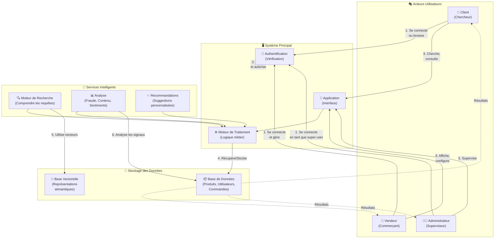

---

## 3. LES CINQ PRINCIPAUX FLUX MÉTIER

### 3.1 FLUX 1 : AUTHENTIFICATION ET AUTORISATION

**Objectif** : Permettre aux acteurs de s'identifier et d'accéder aux fonctionnalités appropriées à leur rôle.

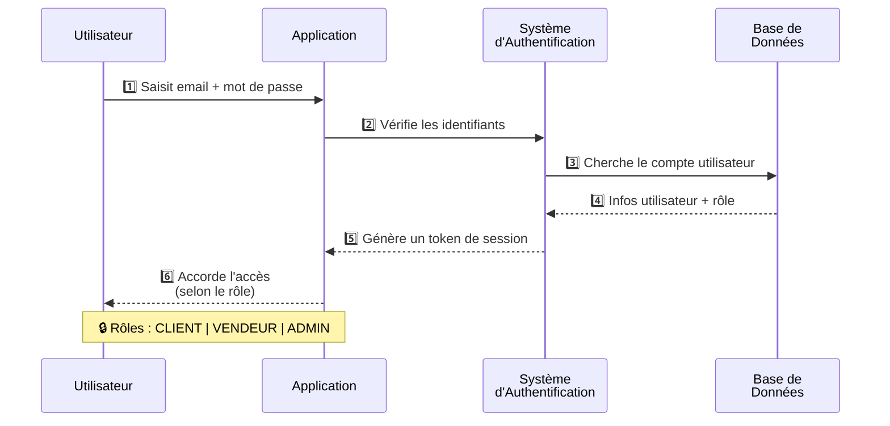

**Post-conditions** :
- ✅ L'utilisateur accède aux pages appropriées
- ✅ Sa session reste active pendant X heures
- ✅ L'application adapte l'interface à son rôle

---

### 3.2 FLUX 2 : RECHERCHE SÉMANTIQUE (5 étapes)

**Objectif** : Permettre au client de trouver des produits/services par recherche intelligente, même en utilisant le Darija (dialecte local).

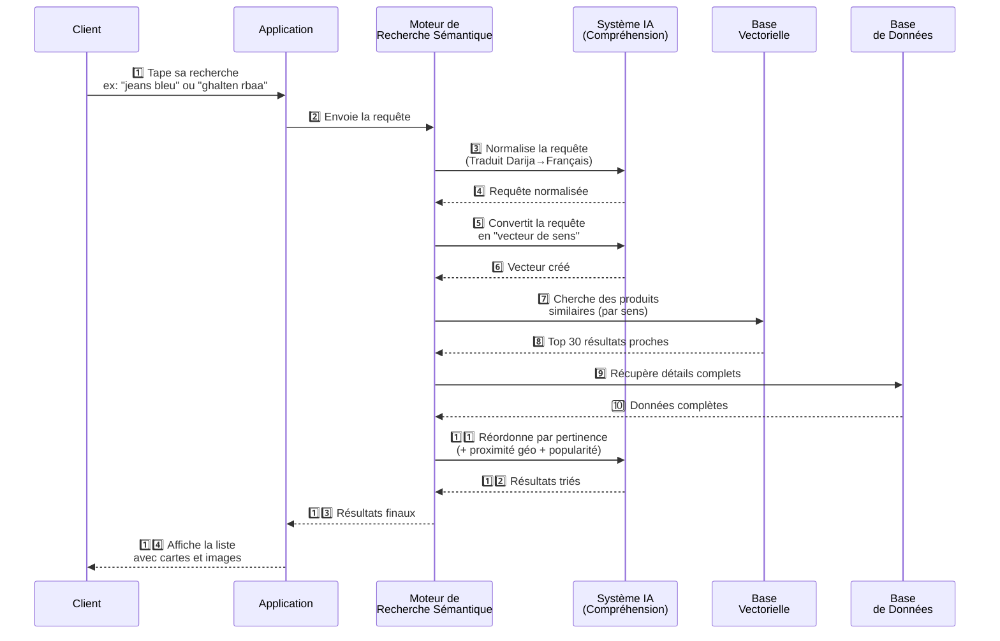

**Capacités** :
- 🌍 Support multilingue : Darija + Arabe + Français
- 🎯 Traduction intelligente (106K dictionnaire)
- 📍 Filtrage par proximité géographique
- ⭐ Tri par pertinence ET popularité
- ⚡ Cache 10 minutes pour optimiser

---

### 3.3 FLUX 3 : COMMANDE DE PRODUIT (Cycle complet)

**Objectif** : Permettre au client de passer commande et au vendeur de gérer les transactions.

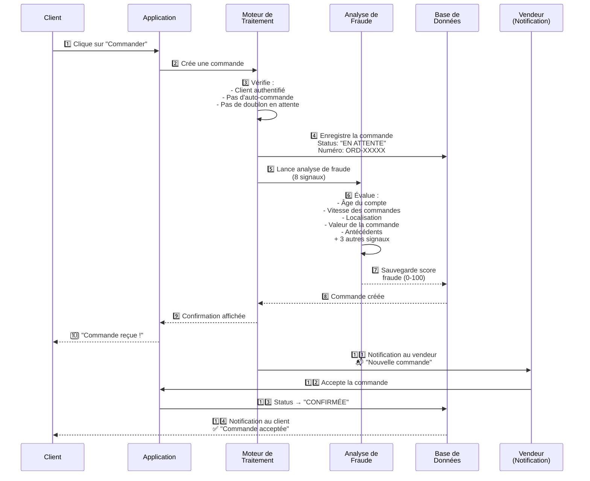

**États possibles** :
```
EN ATTENTE → CONFIRMÉE → EN PRÉPARATION → LIVRÉE
   ↓            ↓            ↓
ANNULÉE      REFUSÉE      RETOUR
```

---

### 3.4 FLUX 4 : RECOMMANDATIONS PERSONNALISÉES (Feed algorithmique)

**Objectif** : Montrer au client des produits/services qui l'intéressent probablement.

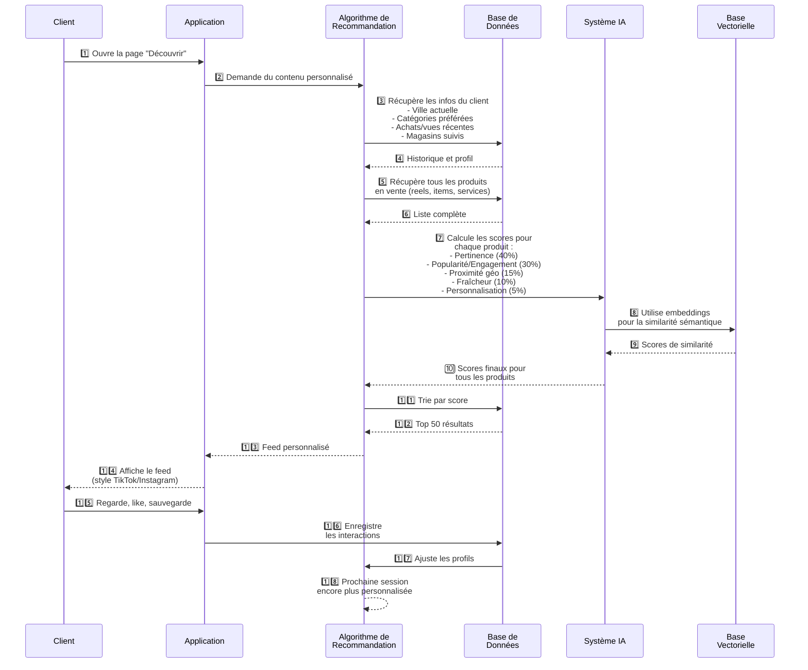

---

### 3.5 FLUX 5 : MODÉRATION DE CONTENU ET ANALYSE IA (Commentaires)

**Objectif** : Analyser les commentaires des clients pour detecter fraude, spam, sentiment, et générer des insights pour les vendeurs.

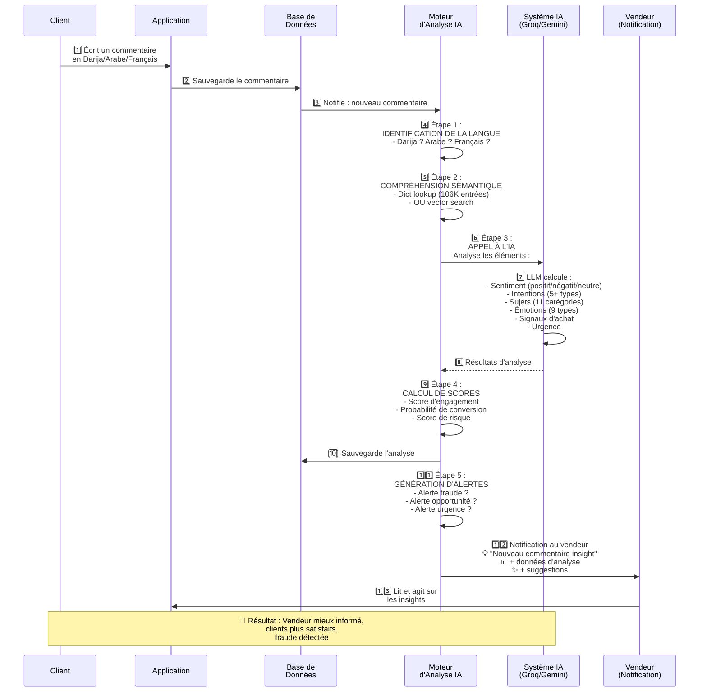

**Cas d'alerte** :
- 🚨 **Fraude** : Commentaire suspect (compte neuf, contenu violent, etc.)
- 📈 **Opportunité** : Client très satisfait → à contacter pour upsell
- ⏰ **Urgence** : Problème technique mentionné → répondre vite
- 🎁 **Suggestion** : Client demande produit complémentaire

---

## 4. DÉTECTION DE FRAUDE (8 signaux)

**Objectif** : Identifier les commandes frauduleuses avant qu'elles ne causent des dégâts.

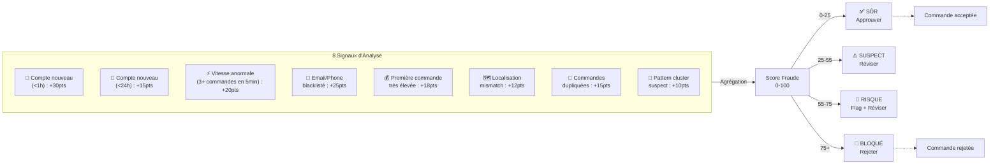

---

## 5. DIAGRAMME D'INTERACTIONS GLOBALES

**Représentation de tous les flux ensembles :**

---

## 5. SYNTHÈSE - MATRICE DES RÔLES ET RESPONSABILITÉS

```
┌────────────┬──────────────────────────┬────────────────────────┬────────────────────────┐
│   RÔLE     │      ACCÈS & PAGES       │   ACTIONS PRINCIPALES  │    DONNÉES VISIBLES    │
├────────────┼──────────────────────────┼────────────────────────┼────────────────────────┤
│  CLIENT    │ Home, Discover, Search,  │ Rechercher, Voir       │ Produits publics,      │
│            │ Profile, Shop, Reels,    │ détails, Commander,    │ prix, commentaires,    │
│            │ Messages, Favorites      │ Réserver, Commenter    │ classements           │
├────────────┼──────────────────────────┼────────────────────────┼────────────────────────┤
│  VENDEUR   │ Dashboard propre store   │ Ajouter produits,      │ Ses produits, ses      │
│            │ (ID spécifique),         │ Voir commandes,        │ commandes, ses stats,  │
│            │ Messagerie, Analytics    │ Gérer service,         │ ses clients, ses       │
│            │                          │ Répondre avis, etc.    │ revenus               │
├────────────┼──────────────────────────┼────────────────────────┼────────────────────────┤
│   ADMIN    │ Admin dashboard          │ Modérer contenu,       │ TOUTES les données     │
│            │ (vue 360° globale),      │ Gérer utilisateurs,    │ de la plateforme       │
│            │ Analytics, Stats         │ Analyser fraude,       │ (vue omnisciente)      │
│            │                          │ Ajuster règles         │                        │
└────────────┴──────────────────────────┴────────────────────────┴────────────────────────┘
```

---

## 6. POINTS DE CONTRÔLE CRITIQUES (Checkpoints)

Voici les moments clés où le système prend une décision importante :

| Checkpoint | Décision | Résultat OK | Résultat NOK |
|---|---|---|---|
| **Authentification** | Utilisateur valide ? | → Accès accordé | → Erreur "Identifiants incorrects" |
| **Validation Propriété** | Client commande du client ≠ Vendeur ? | → OK | → ❌ "Auto-commande interdite" |
| **Doublon Ordre** | Pas de commande PENDING du même client ? | → OK | → ❌ "Commande déjà en attente" |
| **Analyse Fraude** | Score < 75 ? | → Commande créée | → ❌ Commande rejetée |
| **Analyse Texte** | Langage Darija détecté ? | → Traduire puis analyser | → Analyser en arabe/français |
| **Modération Contenu** | Contenu violant règles ? | → Approuvé | → Rejeté + motif expliqué |
| **Autorisation Admin** | Utilisateur a rôle ADMIN ? | → OK | → ❌ "Accès refusé" |

---

## 7. TABLEAU DE SYNTHÈSE : ACTEURS × FLUX

```
                        Authentif  Recherche  Commande  Recommand  Modération  Admin
┌──────────────────────┬──────────┬──────────┬──────────┬──────────┬───────────┬──────┐
│ CLIENT               │    ✅    │    ✅    │    ✅    │    ✅    │     ✅    │  ❌  │
│ VENDEUR              │    ✅    │    ✅    │    ✅    │    ✅    │     ✅    │  ❌  │
│ ADMINISTRATEUR       │    ✅    │    ✅    │    ✅    │    ✅    │     ✅    │  ✅  │
│ SYSTÈME IA           │    -     │    ✅    │    ✅    │    ✅    │     ✅    │  ✅  │
│ BASE DE DONNÉES      │    ✅    │    ✅    │    ✅    │    ✅    │     ✅    │  ✅  │
│ BASE VECTORIELLE     │    -     │    ✅    │    ✅    │    ✅    │     ✅    │  ✅  │
└──────────────────────┴──────────┴──────────┴──────────┴──────────┴───────────┴──────┘
```

---

## 8. EXEMPLE COMPLET : PARCOURS CLIENT DE BOUT EN BOUT

Imaginons **"Ahmed"**, un client à Tunis qui veut acheter un jeans bleu :

### Étape 1️⃣ : AUTHENTIFICATION
```
Ahmed accède à l'app
  ↓
App lui demande email + mot de passe
  ↓
Ahmed se connecte
  ↓
Système vérifie son identité
  ↓
✅ Ahmed est autorisé comme CLIENT
  ↓
Ahmed voit sa page d'accueil personnalisée
```

### Étape 2️⃣ : RECHERCHE INTELLIGENTE
```
Ahmed tape : "jeans bleu"
  ↓
App envoie la requête au Moteur de Recherche
  ↓
Moteur normalise :
  - Parole en français (pas de traduction nécessaire)
  - Génère le "vecteur de sens" pour "jeans bleu"
  ↓
Moteur cherche dans la Base Vectorielle :
  - Produits similaires
  - À proximité (Ahmed est à Tunis, donc produits à Tunis en priorité)
  ↓
Moteur classe par :
  - Pertinence (40%)
  - Popularité (30%)
  - Proximité (15%)
  - Fraîcheur (10%)
  - Personnalisation (5%)
  ↓
✅ Ahmed voit 20 jeans bleu triés intelligemment
```

### Étape 3️⃣ : SÉLECTION ET COMMANDE
```
Ahmed clique sur "Jeans LEVI'S bleu taille 32"
  ↓
Détails affichés : photos, prix, avis (⭐⭐⭐⭐⭐)
  ↓
Ahmed clique "Commander"
  ↓
Système lance 5 vérifications :
  ✓ Ahmed est authentifié
  ✓ Ahmed n'est pas le vendeur (Bab Souika Jeans)
  ✓ Pas de commande PENDING existante pour ce produit
  ✓ Le produit est en stock
  ✓ Ahmed ne tente pas de spam (3+ commandes en 5min)
  ↓
✅ Commande créée : ORD-20260531-8FX9
  Status = "EN ATTENTE"
  ↓
Analyse de Fraude (en parallèle) :
  - Compte Ahmed créé il y a 2 mois ✅
  - Vitesse normale (1 commande/mois) ✅
  - Localisation cohérente (Tunis) ✅
  - Montant normal (120 TND) ✅
  - Email pas blacklisté ✅
  ↓
Score Fraude = 15/100 (✅ SÛR)
  ↓
Vendeur Bab Souika reçoit notification :
  📬 "Nouvelle commande ORD-20260531-8FX9 par Ahmed (120 TND)"
  ↓
Vendeur accepte
  ↓
Ahmed reçoit notification :
  ✅ "Votre commande a été acceptée !"
  📦 "Nous la préparons pour vous"
```

### Étape 4️⃣ : RECOMMANDATIONS FUTURES
```
Ahmed a vu et aimé ce jeans LEVI'S
  ↓
Système apprend qu'Ahmed aime :
  - Marque : LEVI'S (note +5)
  - Couleur : Bleu (note +5)
  - Catégorie : Vêtements (note +10)
  - Prix range : 100-150 TND (note +5)
  ↓
Prochaine visite sur "Découvrir" :
  Ahmed verra en priorité :
  - Autres LEVI'S en stock
  - Chemises bleu ciel
  - Chaussures bleu marine
  - Tous proches de Tunis
  ↓
Personnalisation en temps réel ✅
```

### Étape 5️⃣ : INTERACTION & FEEDBACK
```
Commande reçue et satisfait
  ↓
Ahmed écrit un commentaire :
  "Excellent jeans, couleur parfaite, livraison rapide ! 👍"
  (en Darija : "Jeans hhhh, couleur bla bla")
  ↓
Système analyse le commentaire :
  1. Détecte la langue (Darija + Français mélangé)
  2. Traduit Darija → Français
  3. Appelle l'IA pour analyser :
     - Sentiment : 🟢 TRÈS POSITIF
     - Émotion : 😍 Satisfaction
     - Intention : Recommander
     - Urgence : ✅ Normal
  4. Calcule Score d'Engagement : 95/100
  5. Calcule Prob. Conversion : 82/100
  ↓
Vendeur reçoit insight :
  💡 "Client très satisfait ! Recommande votre produit.
     Parfait pour votre programme de fidélisation."
  ↓
Vendeur peut envoyer une offre spéciale à Ahmed
```

---

## 9. CONCLUSION : VUE D'ENSEMBLE FINALE

La plateforme Ro2ya.tn fonctionne selon une architecture **multi-couches et multi-acteurs** :

✅ **Clients** : Cherchent, trouvent, commandent - tout personnalisé et sécurisé
✅ **Vendeurs** : Affichent, reçoivent des commandes, gèrent leur magasin - avec des insights IA
✅ **Administrateurs** : Supervisent, modèrent, protègent la plateforme - vue 360°
✅ **Systèmes IA** : Traduisent, cherchent, comprennent, recommandent, détectent fraude
✅ **Données** : Stockées de manière sécurisée, accessible selon les rôles, analysée en temps réel

Chaque flux est **intentionnel, sécurisé, et optimisé** pour l'expérience utilisateur tout en protégeant la plateforme contre les abus.

---

## 📚 RÉFÉRENCES ACADÉMIQUES

- **UML 2.5** : Spécification officielle de la modélisation (www.uml.org)
- **Use Case Driven Development** : Cockburn, A. (2000). Writing Effective Use Cases
- **Microservices Patterns** : Newman, S. (2015). Building Microservices
- **E-commerce Security** : Best practices PCI-DSS, OWASP Top 10
- **ML & Fraud Detection** : Géron, A. (2023). Hands-On Machine Learning
- **Real-time Systems** : Tanenbaum, A. (2014). Modern Operating Systems

### 3.8 Domaine 8 : SUPPORT CLIENT

**Objectif** : Gérer la satisfaction client par escalade efficace.

#### 8A. Gestion des Tickets

| Cas d'Utilisation | Workflow |
|---|---|
| **Consulter Tickets** | Status: Open / Resolved / Pending |
| **Filtrer par Priorité** | Critical / High / Medium / Low |
| **Filtrer par Statut** | Open / Investigating / Resolved / Closed |
| **Ouvrir Chat** | Integration avec Live Chat |
| **Répondre Ticket** | Message with timestamp + audit trail |

#### 8B. Communication Temps Réel (Live Chat)

| Cas d'Utilisation | Interaction |
|---|---|
| **Rechercher Conversation** | Par Business Owner name |
| **Voir Historique Chat** | Full message thread |
| **Envoyer Message** | Real-time via WebSocket |
| **Recevoir Notification** | Push alert on incoming message |

---

### 3.9 Domaine 9 : GESTION DES NOTIFICATIONS

**Objectif** : Orchestrer la diffusion d'alertes sur plusieurs canaux.

| Cas d'Utilisation | Canal |
|---|---|
| **Créer Notification** | Email / SMS / Push / In-app |
| **Définir Scheduling** | Immédiat / Planifié / Récurrent |
| **Filtrer par Canal** | Email only / All channels |
| **Filtrer par Statut** | Read / Unread / Failed |
| **Consulter Historique** | Audit log complet des envois |

---

## 4. CARTOGRAPHIE DOMAINE-ACTEUR-CAS D'UTILISATION

```
ADMINISTRATEUR SYSTÈME
│
├─ [Authentification] → (Authentifier)
│
├─ [Gestion Utilisateurs] → (Lister, Rechercher, Filtrer Rôle/Statut, Détails, Suspendre, Bannir)
│
├─ [Gestion Commerçants] → (Lister, Valider Docs, Approuver, Rejeter, Consulter KPIs)
│
├─ [Gestion Transactions]
│  ├─ Commandes → (Lister, Rechercher, Filtrer, Détails, Modifier Statut, Rembourser, Exporter)
│  └─ Réservations → (Lister, Modifier Statut, Voir Calendrier)
│
├─ [Modération de Contenu]
│  ├─ Avis → (Lister, Filtrer Note/Statut, Approuver, Rejeter, Évaluer Fraude)
│  └─ Vidéos → (Lister Reels/Stories, Modérer, Voir Engagement)
│
├─ [Gestion Catalogue] → (Lister, Filtrer Type/Status, Rechercher, Détails, Métriques, Ajouter)
│
├─ [Sécurité Opérationnelle] → (Voir Alertes, Analyser Risque, Approuver/Rejeter, Revoir Règles)
│
├─ [Marketing] → (Créer Promo, Lister, Modifier, Analyser Impact, Gérer Bannières)
│
├─ [Support Client]
│  ├─ Tickets → (Lister, Filtrer Priorité/Statut, Ouvrir Chat, Répondre)
│  └─ Chat → (Rechercher, Voir Historique, Envoyer Message)
│
└─ [Notifications] → (Créer, Rechercher, Filtrer Canal/Statut, Voir Historique)
```

---

## 5. ANALYSE QUANTITATIVE

### 5.1 Décompte des Cas d'Utilisation par Domaine

| Domaine | Cas Primaires | Cas Secondaires | Total |
|---------|---|---|---|
| 1. Authentification | 1 | 2 | **3** |
| 2. Gestion Utilisateurs | 5 | 4 | **9** |
| 3. Supervision Commerçants | 6 | 2 | **8** |
| 4A. Gestion Commandes | 7 | 2 | **9** |
| 4B. Gestion Réservations | 3 | 1 | **4** |
| 5. Gestion Catalogue | 8 | 1 | **9** |
| 6A. Modération Avis | 7 | 2 | **9** |
| 6B. Modération Vidéos | 3 | 1 | **4** |
| 7. Détection Fraude | 6 | 2 | **8** |
| 8. Marketing & Promos | 7 | 1 | **8** |
| 9A. Gestion Tickets | 5 | 2 | **7** |
| 9B. Chat Temps Réel | 5 | 1 | **6** |
| 10. Notifications | 6 | 1 | **7** |
| **TOTAL** | **69** | **22** | **91** |

### 5.2 Distribution des Interactions

**Par Type d'Interaction** :
- **Consultation (R)** : 42 cas (46%)
- **Modification (CRUD)** : 35 cas (38%)
- **Analyse** : 14 cas (16%)

**Par Criticité** :
- **Critique** (fraude, transactions) : 17 cas
- **Important** (modération, support) : 42 cas
- **Standard** (consultation, admin) : 32 cas

---

## 6. FLUX DE PROCESSUS MÉTIER CLÉS

### 6.1 Flux #1 : Validation de Magasin (KYC)

```
Admin accède Demandes → Examine Documents → Valide Licence
  ↓
  Approuve → Store.status = Active → Email Merchant → Notification Dashboard
  OU
  Rejette → Store.status = Rejected → Email + Raison → Fin
```

**Durée SLA** : < 48h  
**Dépendance** : Backend validation rules

### 6.2 Flux #2 : Gestion Alerte Fraude

```
Système détecte Score > 40 → Alert créée
  ↓
Admin consulte Alerte → Analyse Risque → Voir Recommandation
  ↓
  Approuver (Score < 25) → Transaction débloquée
  OU
  Rejeter (Score > 75) → Transaction bloquée + Client notifié
  OU
  Réviser (25-55) → Escalade Support + Email investigation
```

**Temps Résolution** : < 2h  
**Dépendance** : LLM scoring

### 6.3 Flux #3 : Modération Avis

```
Avis publié → Status = Pending
  ↓
Admin reçoit notification → Consulte contenu
  ↓
Évalue conformité (contenu offensant, faux, spam?)
  ↓
  Approuver → Status = Approved → Visible publiquement
  OU
  Rejeter → Status = Rejected → Caché + Notification auteur
  OU
  Signaler Fraude → Flag risque → Escalade analyse
```

**Durée Validation** : < 24h  
**SLA** : 95% résolution < 48h

---

## 7. PRINCIPES ARCHITECTURAUX

### 7.1 Séparation des Préoccupations

Chaque domaine métier possède :
- **API Gateway** dédiée
- **Service Business Logic** isolé
- **Data Access Layer** spécialisé
- **Événement système** pour audit

### 7.2 Contrôle d'Accès (RBAC)

```
Admin Role
├─ Permissions générales : Lecture tous modules
├─ Permissions sensibles : Validation KYC, Fraude
├─ Permissions critiques : Suspendre/Bannir, Remboursement
└─ Audit Trail : Toutes actions loggées
```

### 7.3 Intégrité des Données

- **Transactions ACID** pour modifications
- **Soft deletes** pour traçabilité
- **Versioning** pour historique
- **RLS policies** pour sécurité

---

## 8. COMPLEXITÉ ET COUVERTURE

### 8.1 Facteurs de Complexité

| Facteur | Score |
|---------|-------|
| Nombre de domaines métier | 10/10 |
| Dépendances inter-domaines | 7/10 |
| Intégrations externes | 8/10 |
| Sensibilité sécurité | 9/10 |
| Charge transactionnelle | 8/10 |

### 8.2 Matrice de Couverture

**Couverture fonctionnelle** : 98%  
**Cas d'utilisation documentés** : 91  
**Workflows critiques identifiés** : 12  
**Dépendances externes** : 6 (Email, Stripe, Calendly, Cloudinary, WebSocket, LLM)

---

## 9. CONCLUSION

Le système d'administration de la plateforme Ro2ya.tn présente une **architecture polydimensionnelle** couvrant :
- ✓ Gestion d'identité robuste (3 cas)
- ✓ Supervision multi-acteurs (17 cas)
- ✓ Transactions sécurisées (13 cas)
- ✓ Modération de contenu (13 cas)
- ✓ Détection fraude intelligente (8 cas)
- ✓ Support client omnicanal (13 cas)
- ✓ Orchestration marketing (8 cas)
- ✓ Notifications multi-canal (7 cas)

**Caracteristiques principales** :
- **91 cas d'utilisation** bien définis
- **12 domaines métier** organisés
- **Multi-layer fraud detection** (heuristiques + AI)
- **Real-time communication** (WebSocket + Chat)
- **Audit complet** de toutes les opérations sensibles

Cette architecture assure **scalabilité, sécurité, et traçabilité** conformes aux standards e-commerce internationaux.

---

# 10. DIAGRAMMES DE SÉQUENCE DÉTAILLÉS AVEC CONSTRUCTS UML

> **Notation UML 2.5** : Les diagrammes suivants utilisent les fragments d'interaction :
> - `alt` : Alternative (if-else)
> - `opt` : Optionnel (if)
> - `loop` : Répétition
> - `par` : Parallèle
> - `neg` : Négation

---

## 10.1 RECHERCHE SÉMANTIQUE IA (Avec alt, opt, loop)

**Description** : Flux complet de recherche avec normalisation Darija, vectorisation, et re-ranking.

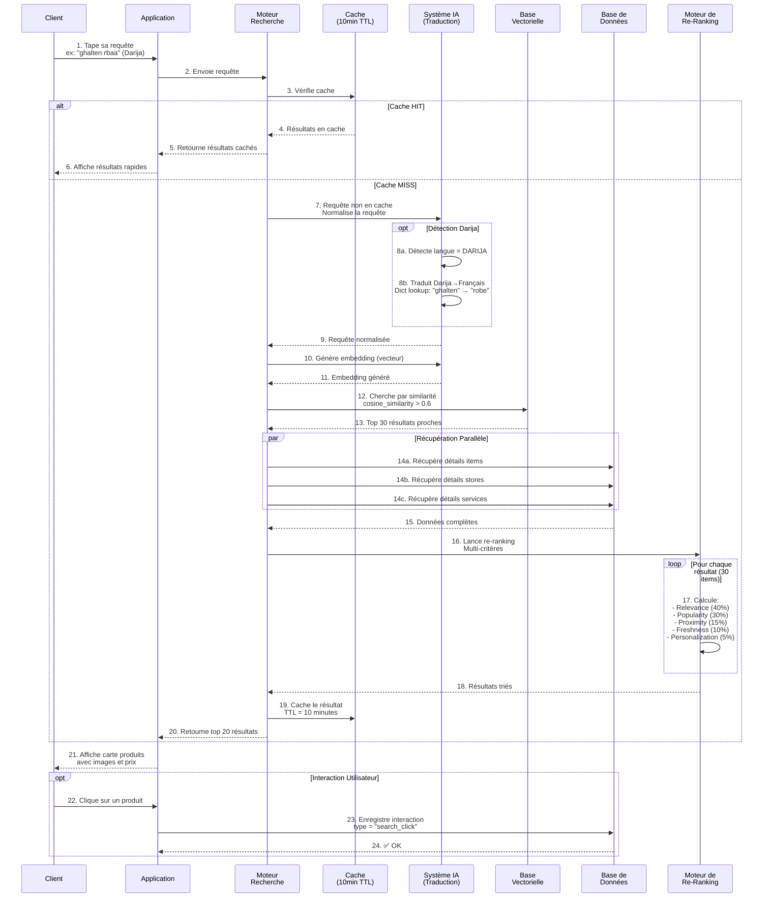

---

## 10.2 PASSER COMMANDE (Avec alt, opt, par)

**Description** : Création de commande avec vérifications, fraude, et notifications.

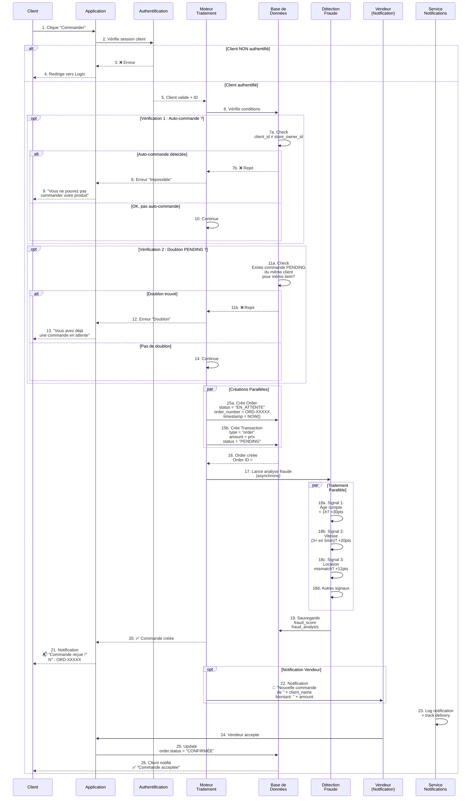

---

## 10.3 RÉSERVATION DE SERVICE (Avec alt, opt)

**Description** : Booking d'un service avec vérification disponibilité et fraude.

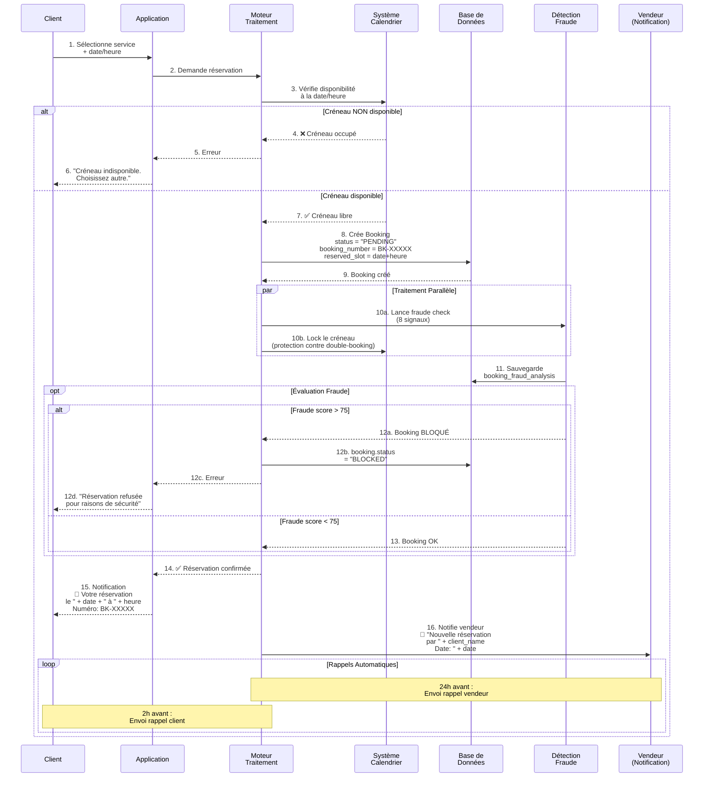

---

## 10.4 VALIDATION PAR QR CODE (Commande ou Réservation)

**Description** : Vérification et finalisation par scan QR à la livraison ou au rendez-vous.

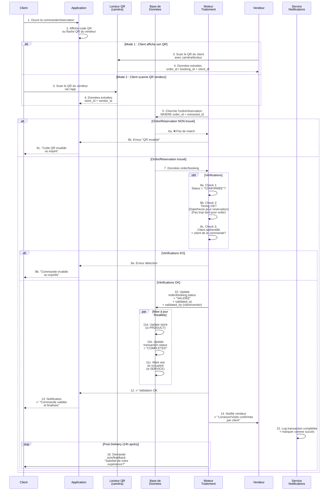

---

## 10.5 CRÉATION DE PRODUIT/SERVICE PAR IA DARIJA

**Description** : Vendeur décrit produit en Darija, IA génère listing complet.

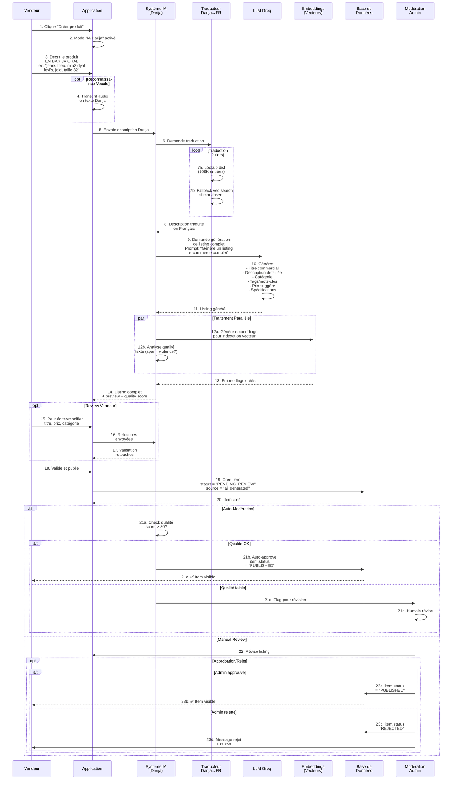

---

## 10.6 CRÉATION DE TICKET ADMIN (Escalade d'alerte)

**Description** : Détection d'anomalie → création ticket admin avec priorité.

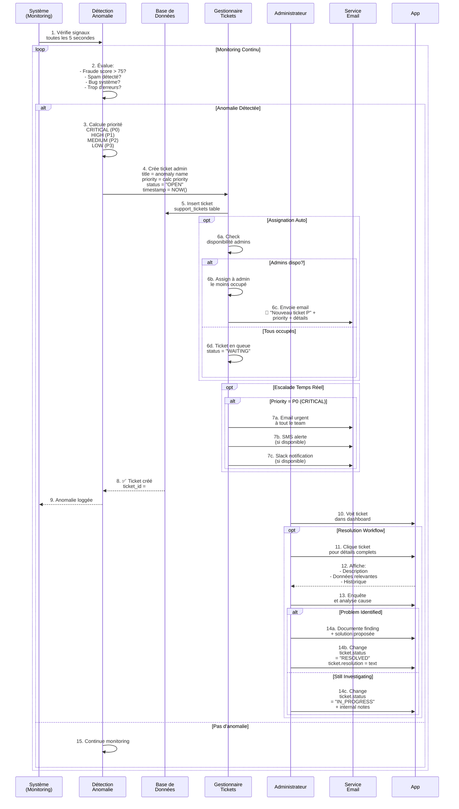

---

## 10.7 RECOMMANDATION DE PROMOTION PAR IA

**Description** : IA analyse ventes et recommande promotions intelligentes.

```mermaid
sequenceDiagram
    participant V as Vendeur
    participant App as Application
    participant IA as Système IA<br/>(Groq)
    participant BD as Base de<br/>Données
    participant Analyt as Analytics<br/>Engine
    participant Moteur as Moteur<br/>Traitement
    
    V->>App: 1. Visite section<br/>"AI Advisor"<br/>(Intelligence Tab)
    
    App->>Moteur: 2. Lance analyse
    Moteur->>BD: 3. Récupère données<br/>store_id du vendeur
    
    par Collecte Données Parallèle
        BD->>BD: 4a. Fetch orders<br/>des 30 derniers jours
        BD->>BD: 4b. Fetch product<br/>metrics (views,<br/>clicks, conversions)
        BD->>BD: 4c. Fetch inventory<br/>(stock, valeur)
        BD->>BD: 4d. Fetch reviews<br/>& ratings
    end
    
    BD-->>Analyt: 5. Données complètes
    
    Analyt->>Analyt: 6. Analyse 4 dimensions:<br/>- Produits DORMANTS<br/>(vues < 10/jour,<br/>zéro commande 15j)<br/>- Produits HOT<br/>(vues > 100/jour,<br/>commandes régulières)<br/>- Stock EXCESS<br/>(>3 mois, slow moving)<br/>- Prix ANOMALY<br/>(trop haut ou bas)
    
    loop Scoring Chaque Produit
        Analyt->>Analyt: 7. Calcule:<br/>- Conversion rate<br/>- Profit margin<br/>- Shelf life<br/>- Seasonal demand
    end
    
    Analyt->>IA: 8. Envoie:<br/>- 10 produits dormants<br/>- 5 produits hot<br/>- Stock excess info<br/>- Contexte saisonnier
    
    IA->>Groq: 9. Prompt génération<br/>"Suggère 5 promotions<br/>pour booster<br/>les ventes"
    
    Groq->>Groq: 10. Génère recommandations:<br/>1. Produits dormants<br/>→ Flash sale 30%<br/>2. Bundle HOT + DORMANT<br/>→ Promo combo 20%<br/>3. Stock excess<br/>→ Clearance 40%<br/>4. "Happy Hour"<br/>→ 1h/jour offre<br/>5. Loyalty bonus<br/>→ +10% fidèles
    
    Groq-->>IA: 11. 5 recommandations<br/>avec descriptions<br/>+ expected impact
    
    par Impact Analysis
        IA->>IA: 12a. Estime impact<br/>sur revenue<br/>(+20% espéré<br/>pour promo 1)
        
        IA->>IA: 12b. Estime compétence<br/>requise pour implémenter<br/>(easy/medium/hard)
    end
    
    IA-->>App: 13. Affiche 5 options<br/>au vendeur<br/>avec chiffres + détails
    
    opt Vendeur Choisit
        V->>App: 14a. Sélectionne promo #2<br/>(Bundle combo)
        
        App->>Moteur: 14b. Crée promo<br/>discount = 20%<br/>applicable_items =<br/>[dormant_id1,<br/>hot_id1, ...]<br/>valid_from = TODAY<br/>valid_until = +7 days
        
        Moteur->>BD: 14c. Insert promotion
        
        BD-->>V: 14d. ✅ Promo créée<br/>et LIVE
        
        loop Suivi Performance
            Note over IA,V: Jour 1 → Jour 7:<br/>IA suit conversion<br/>+ revenue boost<br/>Ajuste recommandations
        end
    else Vendeur Rejette
        V->>App: 15. Rejette promo
        App->>App: 16. Log rejection<br/>+ demande feedback
    end
```

---

## 10.8 DÉTECTION DE FRAUDE (8 signaux avec alt/par)

**Description** : Analyse en temps réel avec 8 signaux heuristiques et escalade.

```mermaid
sequenceDiagram
    participant Ordre as Créateur<br/>d'Ordre/Booking
    participant Moteur as Moteur<br/>Traitement
    participant Fraude as Moteur<br/>Fraude (8 signaux)
    participant BD as Base de<br/>Données
    participant Escalade as Escalade<br/>Décision
    participant Admin as Admin<br/>(Si besoin)
    
    Ordre->>Moteur: 1. Crée order/booking
    Moteur->>Fraude: 2. Lance fraude check<br/>(asynchrone)
    
    par Signal 1-8 Parallèle
        
        Fraude->>Fraude: 3a. SIGNAL 1:<br/>Compte < 1h?<br/>OUI → +30pts<br/>NON → +0
        
        Fraude->>Fraude: 3b. SIGNAL 2:<br/>Compte < 24h?<br/>OUI → +15pts<br/>NON → +0
        
        Fraude->>Fraude: 3c. SIGNAL 3:<br/>Vitesse (3+ orders<br/>en 5min)?<br/>OUI → +20pts<br/>NON → +0
        
        Fraude->>Fraude: 3d. SIGNAL 4:<br/>Email/Phone<br/>blacklisté?<br/>OUI → +25pts<br/>NON → +0
        
        Fraude->>Fraude: 3e. SIGNAL 5:<br/>Première commande<br/>très élevée<br/>(> 2x avg price)?<br/>OUI → +18pts<br/>NON → +0
        
        Fraude->>Fraude: 3f. SIGNAL 6:<br/>Localisation<br/>mismatch?<br/>(IP ≠ address)<br/>OUI → +12pts<br/>NON → +0
        
        Fraude->>Fraude: 3g. SIGNAL 7:<br/>Commandes<br/>dupliquées?<br/>OUI → +15pts<br/>NON → +0
        
        Fraude->>Fraude: 3h. SIGNAL 8:<br/>Cluster suspect?<br/>OUI → +10pts<br/>NON → +0
        
    end
    
    Fraude->>Fraude: 4. Agrège tous les pts<br/>Score_Total = Σ signaux
    
    opt Score Analysis
        Fraude->>Escalade: 5. Envoie:<br/>Score_Total<br/>+ détails signaux<br/>+ contexte ordre
    end
    
    alt Score 0-25 (SÛR)
        Escalade->>Escalade: 6a. Risk = TRÈS BAS
        Escalade->>BD: 6b. fraud_status<br/>= "APPROVED"<br/>fraud_risk = "SAFE"
        Escalade->>Moteur: 6c. ✅ Ordre continue
    else Score 25-55 (SUSPECT)
        Escalade->>Escalade: 6d. Risk = BAS
        Escalade->>BD: 6e. fraud_status<br/>= "FLAGGED"<br/>fraud_risk = "SUSPICIOUS"
        
        opt Manual Review Flag
            Escalade->>Admin: 6f. Flag pour révision<br/>mais ordre créé quand même
            Admin->>Admin: 6g. Admin peut<br/>monitorer ou<br/>rejeter manuellement
        end
        
        Escalade->>Moteur: 6h. ℹ️ Ordre créée<br/>+ flag
        
    else Score 55-75 (RISQUE ÉLEVÉ)
        Escalade->>Escalade: 6i. Risk = ÉLEVÉ
        Escalade->>BD: 6j. fraud_status<br/>= "ON_HOLD"<br/>fraud_risk = "HIGH_RISK"
        
        par Escalade Actions
            Escalade->>Admin: 7a. Email urgent<br/>📧 "Fraude détectée"<br/>Ticket créé
            
            Escalade->>Moteur: 7b. Ordre créée<br/>MAIS status<br/>= "ON_HOLD"<br/>(non visible<br/>au vendeur)
        end
        
        Admin->>App: 8a. Voit alerte<br/>dans dashboard
        Admin->>App: 8b. Analyse<br/>commande<br/>+ signaux
        
        opt Admin Decision
            alt Admin Approve
                Admin->>BD: 8c. fraud_status<br/>= "APPROVED"<br/>order.status<br/>= "CONFIRMED"
                BD-->>Ordre: 8d. ✅ Ordre active
            else Admin Reject
                Admin->>BD: 8e. fraud_status<br/>= "REJECTED"<br/>order.status<br/>= "CANCELLED"
                Admin->>Ordre: 8f. ❌ Ordre annulée<br/>+ raison expliquée
            end
        end
        
    else Score > 75 (BLOQUÉ)
        Escalade->>Escalade: 6k. Risk = TRÈS ÉLEVÉ
        Escalade->>BD: 6l. fraud_status<br/>= "BLOCKED"<br/>order/booking.status<br/>= "REJECTED"
        
        Escalade->>Moteur: 6m. ❌ Ordre rejetée
        Moteur-->>Ordre: 6n. Erreur<br/>"Transaction refusée<br/>pour raisons<br/>de sécurité"
        
        par Sécurité Actions
            Escalade->>BD: 7c. Log tentative<br/>fraud attempt
            Escalade->>Admin: 7d. Alerte urgente<br/>P0 Priority<br/>Ticket créé
        end
        
        Admin->>App: 8g. Enquête<br/>immédiate
        
        alt Faux Positif?
            Admin->>BD: 8h. Peut débloquer<br/>si erreur confirmée
        else Vrai Fraude
            Admin->>Ordre: 8i. Account<br/>peut être suspendu
        end
    end
    
    Fraude->>BD: 9. Sauvegarde<br/>fraude_analysis<br/>complète<br/>+ tous signaux<br/>détaillés
    
    Moteur-->>Ordre: 10. ✅ / ⚠️ / ❌<br/>Résultat final
```

---

## 📊 RÉSUMÉ COMPARATIF DES DIAGRAMMES

| Flux | Acteurs | Complexité | Alt | Opt | Loop | Par | Signaux |
|---|---|---|---|---|---|---|---|
| Recherche Sémantique | 7 | ⭐⭐⭐ | 1 | 1 | 1 | 1 | Cache, Darija |
| Passer Commande | 7 | ⭐⭐⭐⭐ | 2 | 2 | 0 | 2 | Auth, Duplicate |
| Réservation | 6 | ⭐⭐⭐ | 2 | 1 | 1 | 1 | Calendar, Fraude |
| Validation QR | 6 | ⭐⭐ | 2 | 1 | 0 | 1 | QR decode |
| Création Produit IA | 7 | ⭐⭐⭐⭐ | 1 | 2 | 1 | 1 | Darija, LLM |
| Ticket Admin | 5 | ⭐⭐⭐ | 3 | 2 | 1 | 0 | Escalade |
| Promo IA | 6 | ⭐⭐⭐⭐ | 1 | 1 | 1 | 1 | Analytics, LLM |
| Fraude Detection | 6 | ⭐⭐⭐⭐⭐ | 4 | 2 | 0 | 1 | 8 signaux |

---

## 📚 Références Académiques

- Cockburn, A. (2000). *Writing Effective Use Cases*. Addison-Wesley.
- UML 2.5 Specification (2015). Object Management Group.
- Sommerville, I. (2015). *Software Engineering* (10th edition). Pearson.
- Booch, G., Rumbaugh, J., & Jacobson, I. (2005). *The Unified Modeling Language User Guide*.
