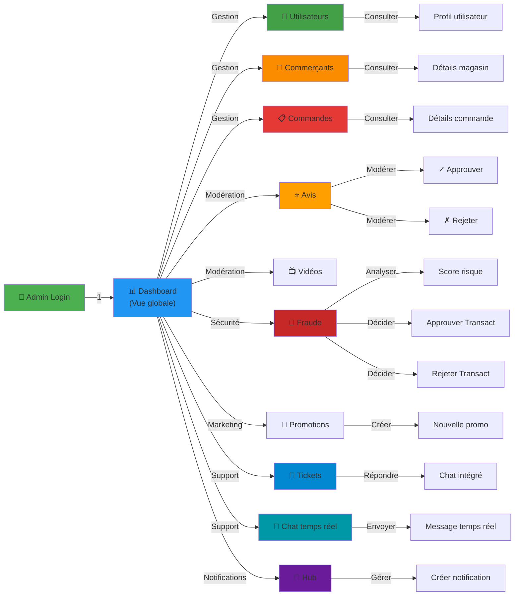

# Diagramme de Cas d'Utilisation Admin - Interfaces Réelles Visibles

## 📊 Vue d'Ensemble UML (Basée sur les Interfaces Réelles)

```mermaid
graph TB
    Admin["👤 Admin<br/>(Administrateur)"]
    
    subgraph DashboardMgmt["🏠 Dashboard Principal"]
        ViewDashboard["Consulter Dashboard"]
        ViewMetrics["Voir Métriques Globales"]
    end
    
    subgraph UserMgmt["👥 Gestion Utilisateurs"]
        ListUsers["Voir Liste Utilisateurs"]
        SearchUsers["Rechercher Utilisateurs"]
        FilterByRole["Filtrer par Rôle"]
        FilterByStatus["Filtrer par Statut"]
        ViewUserDetails["Consulter Détails User"]
    end
    
    subgraph MerchantMgmt["🏪 Gestion Commerçants"]
        ListMerchants["Voir Liste Commerçants"]
        ViewMerchantStats["Voir Stats Commerçant"]
        SearchMerchants["Rechercher Commerçant"]
        FilterMerchantStatus["Filtrer par Statut"]
        AddMerchant["Ajouter Commerçant"]
        ViewMerchantDetails["Consulter Détails Store"]
    end
    
    subgraph OrderMgmt["📋 Gestion Commandes"]
        ListAllOrders["Voir Toutes Commandes"]
        SearchOrders["Rechercher Commande"]
        FilterOrderStatus["Filtrer par Statut"]
        ViewOrderDetails["Consulter Détails Cmd"]
        ExportOrders["Exporter Commandes"]
        ViewOrderMetrics["Voir Métriques Commandes"]
        ScheduleRecurring["Schedule/Recurring"]
    end
    
    subgraph ProductMgmt["📦 Gestion Produits & Services"]
        ListItems["Voir Liste Produits/Services"]
        FilterByType["Filtrer Produits/Services"]
        SearchItems["Rechercher Item"]
        FilterItemStatus["Filtrer par Disponibilité"]
        ViewItemDetails["Consulter Détails Item"]
        ViewItemMetrics["Voir Métriques Item"]
        AddItem["Ajouter Item"]
    end
    
    subgraph ReviewMgmt["⭐ Modération des Avis"]
        ListReviews["Voir Liste Avis"]
        SearchReviews["Rechercher Avis"]
        FilterByRating["Filtrer par Note"]
        FilterReviewStatus["Filtrer par Statut"]
        ViewReviewDetails["Consulter Détails Avis"]
        ApproveReview["Approuver Avis"]
        RejectReview["Rejeter Avis"]
        AssessRisk["Évaluer Risque Fraude"]
        ViewReviewStats["Voir Stats Avis"]
    end
    
    subgraph PromotionMgmt["🎯 Gestion Promotions"]
        ListPromotions["Voir Liste Promotions"]
        SearchPromotions["Rechercher Promotion"]
        FilterPromoStatus["Filtrer par Statut"]
        ViewPromoDetails["Consulter Détails Promo"]
        CreatePromotion["Créer Promotion"]
        EditPromotion["Modifier Promotion"]
        ViewPromoMetrics["Voir Métriques Promo"]
    end
    
    subgraph ContentMgmt["📺 Gestion Contenu Vidéo"]
        ViewReels["Voir Reels"]
        ViewStories["Voir Stories"]
        FilterContentStatus["Filtrer par Statut"]
        ModerateContent["Modérer Contenu"]
        ViewEngagement["Voir Engagement"]
    end
    
    subgraph FraudMgmt["🚨 Détection Fraude"]
        ViewFraudAlerts["Voir Alertes Fraude"]
        AnalyzeRisk["Analyser Risque"]
        ViewRiskAssessment["Voir Évaluation Risque"]
        ViewRecommendations["Voir Recommandations"]
        ApproveTransaction["Approuver Transaction"]
        RejectTransaction["Rejeter Transaction"]
        ViewSecurityDashboard["Voir Dashboard Sécurité"]
        ViewLevelDistribution["Voir Distribution Niveaux"]
    end
    
    subgraph SupportMgmt["💬 Gestion Support"]
        ViewTickets["Voir Tickets Support"]
        SearchTickets["Rechercher Ticket"]
        FilterTicketStatus["Filtrer par Statut"]
        FilterTicketPriority["Filtrer par Priorité"]
        ViewTicketDetails["Consulter Détails Ticket"]
        OpenChat["Ouvrir Chat"]
        ReplyToTicket["Répondre Ticket"]
    end
    
    subgraph LiveChat["💬 Chat en Temps Réel"]
        SearchConversations["Rechercher Conversation"]
        ViewConversationList["Voir Liste Conversations"]
        SelectBusiness["Sélectionner Commerce"]
        SendMessage["Envoyer Message"]
        ViewChatHistory["Voir Historique Chat"]
    end
    
    subgraph NotificationMgmt["🔔 Gestion Notifications"]
        ViewNotificationHub["Voir Hub Notifications"]
        CreateNotification["Créer Notification"]
        SearchNotifications["Rechercher Notification"]
        FilterByChannel["Filtrer par Canal"]
        FilterByStatus["Filtrer par Statut"]
        ViewNotificationStats["Voir Stats Notifications"]
        ViewDispatchHistory["Voir Historique Envois"]
    end
    
    Admin --> DashboardMgmt
    Admin --> UserMgmt
    Admin --> MerchantMgmt
    Admin --> OrderMgmt
    Admin --> ProductMgmt
    Admin --> ReviewMgmt
    Admin --> PromotionMgmt
    Admin --> ContentMgmt
    Admin --> FraudMgmt
    Admin --> SupportMgmt
    Admin --> LiveChat
    Admin --> NotificationMgmt
    
    style DashboardMgmt fill:#1e88e5
    style UserMgmt fill:#43a047
    style MerchantMgmt fill:#fb8c00
    style OrderMgmt fill:#e53935
    style ProductMgmt fill:#8e24aa
    style ReviewMgmt fill:#ffa000
    style PromotionMgmt fill:#00897b
    style ContentMgmt fill:#d32f2f
    style FraudMgmt fill:#c62828
    style SupportMgmt fill:#0288d1
    style LiveChat fill:#0097a7
    style NotificationMgmt fill:#6a1b9a
```



---

## 📋 Tableau Détaillé des Cas d'Utilisation par Interface

### **1️⃣ DASHBOARD PRINCIPAL**
```
┌─────────────────────────────────────────────────┐
│ Dashboard - Vue d'Ensemble                      │
├─────────────────────────────────────────────────┤
│ KPIs Affichés:                                  │
│ • Total utilisateurs: 16                        │
│ • Acteurs: 16                                   │
│ • Clients: 13                                   │
│ • Professionnels: 0                             │
│ • Admin: 0                                      │
│                                                 │
│ Fonctionnalités:                               │
│ ✓ Consulter Dashboard                          │
│ ✓ Voir Métriques Globales                      │
│ ✓ Accès rapide à tous les modules              │
└─────────────────────────────────────────────────┘
```

### **2️⃣ GESTION UTILISATEURS**
```
┌─────────────────────────────────────────────────┐
│ Users Management                                │
├─────────────────────────────────────────────────┤
│ Statistiques:                                   │
│ • Total: 16 utilisateurs                       │
│ • Statut: Actifs = 16                          │
│                                                 │
│ Colonnes du Tableau:                           │
│ • Avatar + Nom                                  │
│ • Email                                         │
│ • Rôle (CLIENT, BUSINESS_OWNER, etc.)         │
│ • Statut (En ligne: ● Vert)                    │
│ • Menu actions (⋯)                             │
│                                                 │
│ Fonctionnalités:                               │
│ ✓ Lister utilisateurs                          │
│ ✓ Rechercher par email/nom                     │
│ ✓ Filtrer par rôle                             │
│ ✓ Filtrer par statut                           │
│ ✓ Consulter profil détaillé                    │
│ ✓ Actions: edit, delete, suspend               │
└─────────────────────────────────────────────────┘
```

### **3️⃣ GESTION COMMERÇANTS**
```
┌─────────────────────────────────────────────────┐
│ Merchant Management                             │
├─────────────────────────────────────────────────┤
│ Statistiques:                                   │
│ • Total Marchands: 6                            │
│ • Actifs: 5 (Currently selling)                │
│ • Commission: $125,400 (This month)            │
│ • Évaluation moyenne: 4.3★ (5 reviews)        │
│                                                 │
│ Filtres:                                        │
│ • Tous (All)                                    │
│ • Actifs (Active)                              │
│ • Vérifiés (Verified)                          │
│ • En attente (Pending)                         │
│ • Suspendus (Suspended)                        │
│ • Rejetés (Rejected)                           │
│                                                 │
│ Colonnes:                                       │
│ • STORE: Logo + Nom magasin                    │
│ • OWNER: Propriétaire (email)                  │
│ • TYPE: Non Défini / Bienvenue Chez Nous       │
│ • STATUS: ● Active (vert)                      │
│ • RATING: ★ Évaluation                         │
│ • ORDERS: Nombre commandes                     │
│ • PRODUCTS: Nombre produits                    │
│ • EARNINGS: Revenus (TND)                      │
│ • ACTIONS: edit, delete, details               │
│                                                 │
│ Fonctionnalités:                               │
│ ✓ Lister commerçants                           │
│ ✓ Rechercher magasin                           │
│ ✓ Filtrer par statut (6 filtres)              │
│ ✓ Consulter détails magasin                    │
│ ✓ Voir statistiques                            │
│ ✓ Ajouter commerçant (+Add Merchant)          │
│ ✓ Modifier magasin                             │
│ ✓ Supprimer magasin                            │
└─────────────────────────────────────────────────┘
```

### **4️⃣ GESTION COMMANDES**
```
┌─────────────────────────────────────────────────┐
│ Orders Management                               │
├─────────────────────────────────────────────────┤
│ Statistiques:                                   │
│ • Total Commandes: 5 (All time)                │
│ • En attente: 0 (Awaiting approval)            │
│ • Valeur moyenne: $70.00 (Per transaction)     │
│ • Revenu total: $0.3K (All orders)             │
│                                                 │
│ Vues:                                           │
│ • List View (par défaut)                       │
│ • Schedule / Recurring                         │
│ • Export                                        │
│                                                 │
│ Filtres:                                        │
│ • Tous les statuts (All Status)                │
│ • Filtres avancés (Filters)                    │
│ • Recherche: Order ID, Customer, Seller       │
│                                                 │
│ Colonnes:                                       │
│ • ORDER ID: ORD-XXXXXX-XXXXX                   │
│ • CUSTOMER: Nom client (email)                 │
│ • SELLER: Nom magasin                          │
│ • AMOUNT: Montant en $                         │
│ • STATUS: Delivered/Approved/Cancelled (badge)│
│ • PAYMENT: Paid/Pending (badge)                │
│ • DATE: Date commande                          │
│ • ACTIONS: ⋯ menu                              │
│                                                 │
│ Fonctionnalités:                               │
│ ✓ Lister toutes commandes                      │
│ ✓ Rechercher commande                          │
│ ✓ Filtrer par statut                           │
│ ✓ Consulter détails                            │
│ ✓ Vue Schedule/Recurring                       │
│ ✓ Exporter commandes                           │
│ ✓ Modifier statut commande                     │
└─────────────────────────────────────────────────┘
```

### **5️⃣ GESTION PRODUITS & SERVICES**
```
┌─────────────────────────────────────────────────┐
│ Items (Produits & Services)                    │
├─────────────────────────────────────────────────┤
│ Statistiques:                                   │
│ • Total Items: 5                                │
│ • Disponibles: 5                                │
│ • En cache: 0                                   │
│ • Signalés: 0                                   │
│ • Interdits: 0                                  │
│ • Note moyenne: 0.0★                           │
│                                                 │
│ Onglets:                                        │
│ • Tous (5)                                      │
│ • Produits (5)                                  │
│ • Services (0)                                  │
│                                                 │
│ Filtres:                                        │
│ • Tous: 5                                       │
│ • Disponibles: 5                                │
│ • En cache: 0                                   │
│ • Signalés: 0                                   │
│ • Interdits: 0                                  │
│                                                 │
│ Colonnes:                                       │
│ • ITEM: Nom produit/service                    │
│ • TYPE: ◉ Produit / ◯ Service                 │
│ • PRIX: Montant                                │
│ • STOCK/DURÉE: État                            │
│ • STATUS: Disponible (vert)                    │
│ • CODES/RÉDUCTIONS: Nombre appliqué            │
│ • RATING: ★ Évaluation                         │
│ • CREATED: Date création                       │
│ • VIEW: 👁️ Lien détails                        │
│                                                 │
│ Fonctionnalités:                               │
│ ✓ Lister produits/services                     │
│ ✓ Onglet Produits / Services                   │
│ ✓ Rechercher item                              │
│ ✓ Filtrer par disponibilité                    │
│ ✓ Consulter détails item                       │
│ ✓ Voir métriques (views, orders, ratings)     │
│ ✓ Ajouter item (+Add Item)                     │
│ ✓ Modifier item                                │
│ ✓ Supprimer item                               │
└─────────────────────────────────────────────────┘
```

### **6️⃣ MODÉRATION DES AVIS**
```
┌─────────────────────────────────────────────────┐
│ Reviews & Moderation                           │
├─────────────────────────────────────────────────┤
│ Statistiques:                                   │
│ • Total Avis: 3                                 │
│ • Signalés: 0                                   │
│ • Note moyenne: 4.7★                           │
│ • Risque élevé: 0                              │
│                                                 │
│ Filtres d'état:                                │
│ • Tous (3)                                      │
│ • En attente (0)                                │
│ • Approuvés (3)                                 │
│ • Rejetés (0)                                   │
│ • Spam (0)                                      │
│                                                 │
│ Colonnes:                                       │
│ • REVIEW: Contenu avis + auteur                │
│ • AUTHOR: Nom auteur                           │
│ • RATING: ★ Note (1-5)                         │
│ • STATUS: Approved/Pending/Rejected (badge)   │
│ • RISK: Low/Medium/High (badge)                │
│ • HELPFUL: Nombre votes utiles                 │
│ • DATE: Date publication                       │
│ • VIEW: 👁️ Consulter détails                  │
│                                                 │
│ Fonctionnalités:                               │
│ ✓ Lister avis                                   │
│ ✓ Rechercher avis                              │
│ ✓ Filtrer par note                             │
│ ✓ Filtrer par statut                           │
│ ✓ Consulter détails avis                       │
│ ✓ Approuver avis                               │
│ ✓ Rejeter avis                                 │
│ ✓ Évaluer risque fraude                        │
│ ✓ Voir statistiques avis                       │
└─────────────────────────────────────────────────┘
```

### **7️⃣ GESTION PROMOTIONS**
```
┌─────────────────────────────────────────────────┐
│ Promotion Management                           │
├─────────────────────────────────────────────────┤
│ Statistiques:                                   │
│ • Total Campagnes: 9                            │
│ • Actives: 5 (Currently running)               │
│ • À venir: 2 (Scheduled for future)            │
│ • Expirées: 2 (Validity dates elapsed)         │
│                                                 │
│ Filtre:                                         │
│ • Tous les statuts (All Statuses)              │
│ • Recherche: titre, description, magasin      │
│                                                 │
│ Colonnes:                                       │
│ • PROMOTION: Icône + Titre                     │
│ • STORE: Magasin concerné                      │
│ • DISCOUNT: Réduction (ex: 50% off)            │
│ • SCORE: ◉ Item Id undefined                   │
│ • VALIDITY PERIOD: Date début - fin            │
│ • STATUS: Scheduled/Active/Expired (badge)    │
│ • ACTIONS: Edit, Delete                        │
│                                                 │
│ Fonctionnalités:                               │
│ ✓ Lister promotions                            │
│ ✓ Rechercher promotion                         │
│ ✓ Filtrer par statut                           │
│ ✓ Consulter détails                            │
│ ✓ Créer promotion (+Create Promotion)         │
│ ✓ Modifier promotion (Edit)                    │
│ ✓ Supprimer promotion (Delete)                 │
│ ✓ Voir métriques (impact, conversions)        │
└─────────────────────────────────────────────────┘
```

### **8️⃣ GESTION CONTENU VIDÉO**
```
┌─────────────────────────────────────────────────┐
│ Reels & Stories                                │
├─────────────────────────────────────────────────┤
│ Onglets:                                        │
│ • Reels (5 vidéos)                             │
│ • Stories (3 stories)                          │
│                                                 │
│ État des contenus:                             │
│ • active (badge blanc)                         │
│ • inactive (badge gris)                        │
│                                                 │
│ Affichage:                                      │
│ • Grille de vignettes vidéo                    │
│ • Logo magasin + titre vidéo                   │
│ • Badge d'état (active/inactive)               │
│ • Statistiques engagement:                     │
│   - Likes                                       │
│   - Comments                                    │
│   - Shares                                      │
│   - Views                                       │
│                                                 │
│ Fonctionnalités:                               │
│ ✓ Voir Reels                                    │
│ ✓ Voir Stories                                  │
│ ✓ Filtrer par statut (active/inactive)        │
│ ✓ Voir engagement (likes, comments, shares)   │
│ ✓ Modérer contenu                              │
│ ✓ Consulter détails vidéo                      │
└─────────────────────────────────────────────────┘
```

### **9️⃣ DÉTECTION DE FRAUDE**
```
┌─────────────────────────────────────────────────┐
│ Fraud Detection System                         │
├─────────────────────────────────────────────────┤
│ Statistiques Principales:                      │
│ • Total Alertes: 0 (0 bookings + 0 orders)    │
│ • Alertes Ouvertes: 0 (0% du total)            │
│ • Problèmes Critiques: 0 (Blocked level)      │
│ • Taux de Résolution: 0%                       │
│                                                 │
│ Sections d'Analyse:                            │
│                                                 │
│ 1. Risk Assessment:                            │
│    • Score moyen: 0%                           │
│    • Temps résolution moyen: 0.0h              │
│    • Taux faux positifs: 0.00%                 │
│                                                 │
│ 2. Recent Activity:                            │
│    • Dernières 24h: 0 alertes                  │
│    • Derniers 7 jours: 0 alertes               │
│    • Moyenne par jour: 0                       │
│                                                 │
│ 3. Level Distribution:                         │
│    • Safe: 0 (vert)                            │
│    • Suspicious: 0 (orange)                    │
│    • High Risk: 0 (rouge)                      │
│    • Blocked: 0 (noir)                         │
│                                                 │
│ 4. Recommendations:                            │
│    • Approve: 0 ✓                              │
│    • Review: 0 ●                               │
│    • Reject: 0 ✗                               │
│                                                 │
│ 5. By Entity Type:                             │
│    • Booking: 0                                 │
│    • Order: 0                                   │
│                                                 │
│ Bouton:                                         │
│ • Security Dashboard (pour détails)            │
│                                                 │
│ Fonctionnalités:                               │
│ ✓ Voir alertes fraude                          │
│ ✓ Analyser risque                              │
│ ✓ Voir évaluation risque (score, signaux)     │
│ ✓ Voir recommandations (approve/review/reject)│
│ ✓ Approuver transaction                        │
│ ✓ Rejeter transaction                          │
│ ✓ Accéder dashboard sécurité complet          │
│ ✓ Voir distribution des niveaux de risque     │
└─────────────────────────────────────────────────┘
```

### **🔟 GESTION SUPPORT**
```
┌─────────────────────────────────────────────────┐
│ Support Tickets                                │
├─────────────────────────────────────────────────┤
│ Statistiques:                                   │
│ • Tickets Ouverts: 2 (Pending response)        │
│ • Total Actifs: 3 (Being handled)              │
│                                                 │
│ Filtres:                                        │
│ • Tous les statuts (All Status)                │
│ • Toutes les priorités (All Priority)          │
│ • Recherche: Ticket #, client, sujet           │
│                                                 │
│ Colonnes:                                       │
│ • TICKET #: Numéro ticket                      │
│ • STORE: Magasin concerné                      │
│ • CUSTOMER: Type client (Business Owner)       │
│ • SUBJECT: Titre du ticket                     │
│ • CHANNEL: 💬 Chat / 📞 Call                   │
│ • PRIORITY: ◉ Critical/Medium/Low (badge)     │
│ • STATUS: open/resolved (badge)                │
│ • ACTIONS: Open Chat (bouton)                  │
│                                                 │
│ Fonctionnalités:                               │
│ ✓ Lister tickets support                       │
│ ✓ Rechercher ticket                            │
│ ✓ Filtrer par statut                           │
│ ✓ Filtrer par priorité                         │
│ ✓ Consulter détails ticket                     │
│ ✓ Ouvrir chat avec client                      │
│ ✓ Répondre à ticket                            │
│ ✓ Créer ticket (+New Ticket)                   │
│ ✓ Clore ticket                                 │
└─────────────────────────────────────────────────┘
```

### **1️⃣1️⃣ CHAT EN TEMPS RÉEL**
```
┌─────────────────────────────────────────────────┐
│ Live Chat                                      │
│ Real-time communication with store owners      │
├─────────────────────────────────────────────────┤
│ Interface 2 panneaux:                          │
│                                                 │
│ PANNEAU GAUCHE (Conversations):                │
│ • Recherche conversations                      │
│ • Liste conversations actives:                 │
│   - #5 - Business Owner (test1) [● en ligne]   │
│   - #3 - Business Owner (test2test2)           │
│   - #2 - Business Owner (problème de stock)    │
│                                                 │
│ PANNEAU DROIT (Chat):                          │
│ • En-tête: Nom business owner + store name     │
│ • Zone messages (historique chat)              │
│ • Champ saisie: "Type your message..."         │
│ • Bouton envoi: icône papier avion             │
│                                                 │
│ Fonctionnalités:                               │
│ ✓ Rechercher conversation                      │
│ ✓ Voir liste conversations                     │
│ ✓ Sélectionner commerce                        │
│ ✓ Envoyer message en temps réel                │
│ ✓ Voir historique chat complet                 │
│ ✓ Notifications messages entrants              │
└─────────────────────────────────────────────────┘
```

### **1️⃣2️⃣ GESTION NOTIFICATIONS**
```
┌─────────────────────────────────────────────────┐
│ Notification Hub                               │
│ Create, dispatch, and monitor platform alerts  │
├─────────────────────────────────────────────────┤
│ Statistiques:                                   │
│ • Total Envois: 48 (notifications enregistrées)│
│ • Alertes Lues: 0 (Confirmed views)            │
│ • Alertes Non Lues: 48 (Pending interaction)   │
│ • Taux de Lecture: 0% (Read / Dispatch ratio)  │
│                                                 │
│ Actions:                                        │
│ • Refresh (actualiser)                         │
│ • Create Notification (créer notif)            │
│                                                 │
│ Filtres:                                        │
│ • Tous les canaux (All Channels)               │
│ • Tous les statuts (All Status)                │
│ • Recherche: titre, contenu, destinataire      │
│                                                 │
│ Colonnes:                                       │
│ • CHANNEL: Type notification (ORDER badge)     │
│ • ALERT INFO: Titre + contenu notification     │
│ • RECIPIENT: Destinataire (email/user)         │
│ • DISPATCH DATE: Date/heure envoi              │
│ • STATUS: Unread/Read (badge)                  │
│ • ACTIONS: Edit, Delete (icônes)               │
│                                                 │
│ Exemple visible:                               │
│ • "Commande COMPLETED - ORD-72572-105P"        │
│ • "Commande validée - ORD-479771-IFTJR"        │
│                                                 │
│ Fonctionnalités:                               │
│ ✓ Voir hub notifications                       │
│ ✓ Créer notification                           │
│ ✓ Rechercher notification                      │
│ ✓ Filtrer par canal                            │
│ ✓ Filtrer par statut (lue/non lue)            │
│ ✓ Voir statistiques (dispatch rate, reads)     │
│ ✓ Voir historique envois                       │
│ ✓ Actualiser hub                               │
└─────────────────────────────────────────────────┘
```

---

## 📊 Résumé Global: 46 Cas d'Utilisation Réels

| Interface | Nombre | Cas d'Utilisation |
|-----------|--------|-------------------|
| 🏠 Dashboard | 2 | Consulter, Voir métriques |
| 👥 Utilisateurs | 5 | Lister, Rechercher, Filtrer rôle/statut, Détails, Actions |
| 🏪 Commerçants | 8 | Lister, Rechercher, Filtrer (6 filtres), Détails, Stats, Ajouter |
| 📋 Commandes | 7 | Lister, Rechercher, Filtrer statut, Détails, Vue Schedule, Exporter |
| 📦 Produits/Services | 7 | Lister, Onglets, Rechercher, Filtrer, Détails, Stats, Ajouter |
| ⭐ Avis | 8 | Lister, Rechercher, Filtrer note/statut, Détails, Approuver, Rejeter |
| 🎯 Promotions | 6 | Lister, Rechercher, Filtrer statut, Détails, Créer, Modifier, Supprimer |
| 📺 Contenu Vidéo | 5 | Onglets, Lister, Filtrer statut, Voir engagement, Modérer |
| 🚨 Fraude | 7 | Voir alertes, Analyser risque, Voir stats, Recommandations, Approuver |
| 💬 Support | 8 | Lister tickets, Rechercher, Filtrer (2), Détails, Ouvrir chat, Répondre |
| 💬 Chat temps réel | 5 | Rechercher, Voir conversations, Sélectionner, Envoyer, Historique |
| 🔔 Notifications | 8 | Voir hub, Créer, Rechercher, Filtrer (2), Stats, Historique |
| **TOTAL** | **46** | **46 CAS D'UTILISATION RÉELS** |

---

## 🎯 Flux Principal d'Utilisation



---

## ✅ Points Clés des Interfaces Réelles

✓ **Interface moderne & cohérente** avec design sombre (dark theme)  
✓ **Navigation claire** via sidebar avec modules groupés  
✓ **Statistiques en haut** de chaque page (KPI cards)  
✓ **Recherche intégrée** dans chaque interface  
✓ **Filtres multiples** par statut, catégorie, etc.  
✓ **Tableaux détaillés** avec colonnes actionnables  
✓ **Actions rapides** (edit, delete, details via menus)  
✓ **Badges de statut** codés couleurs (vert=actif, orange=warning, rouge=erreur)  
✓ **Responsive design** pour tous les appareils  
✓ **Real-time updates** pour notifications et chat  
