# 🗂️ Diagramme de Classes — Ro2ya Marketplace

**Pour:** Rapport PFE - GLSI  
**Plateforme:** Ro2ya - Marketplace Tunisienne  
**Date:** Mai 2026

> 📌 Ce diagramme présente les classes principales du système Ro2ya, déduites du schéma réel de la base de données PostgreSQL (Supabase). Les tables système (Django Auth, PostGIS, Analytics ML) ont été exclues pour des raisons pédagogiques.

---

## Diagramme de Classes Principal

```mermaid
classDiagram
    direction TB

    %% =====================
    %% CLASSES PRINCIPALES
    %% =====================

    class User {
        +UUID id
        +String full_name
        +String email
        +String phone
        +String role
        +String avatar_url
        +String city
        +String address
        +Boolean two_factor_enabled
        +String status
        +DateTime created_at
        +DateTime updated_at
    }

    class Store {
        +BigInt id
        +UUID owner_id
        +String name
        +String slug
        +String description
        +String category
        +String phone
        +String email
        +String address
        +String city
        +Numeric latitude
        +Numeric longitude
        +String status
        +Numeric rating_average
        +Integer total_reviews
        +Integer total_orders
        +Integer view_count
        +String logo_url
        +String banner_url
        +String rne
        +JsonB opening_hours
        +DateTime created_at
        +DateTime updated_at
    }

    class Item {
        +BigInt id
        +BigInt store_id
        +String item_type
        +String name
        +String slug
        +String description
        +Numeric price
        +String price_unit
        +Integer stock_quantity
        +Integer duration_minutes
        +Boolean is_bookable
        +String status
        +String main_image
        +Integer view_count
        +Integer order_count
        +Integer booking_count
        +Numeric rating_average
        +Integer total_reviews
        +DateTime created_at
    }

    class Order {
        +BigInt id
        +String order_number
        +UUID customer_id
        +BigInt store_id
        +BigInt item_id
        +Integer quantity
        +Numeric unit_price
        +Numeric total_price
        +String customer_name
        +String customer_phone
        +String delivery_address
        +String status
        +String tracking_code
        +JsonB cart
        +DateTime created_at
        +DateTime validated_at
        +DateTime completed_at
    }

    class Booking {
        +BigInt id
        +String booking_number
        +BigInt item_id
        +UUID customer_id
        +BigInt store_id
        +Date booking_date
        +Time start_time
        +Time end_time
        +Integer duration_minutes
        +String customer_name
        +String customer_phone
        +Numeric price
        +String status
        +DateTime created_at
        +DateTime confirmed_at
        +DateTime completed_at
    }

    class Transaction {
        +UUID id
        +String transaction_code
        +String order_number
        +BigInt booking_id
        +UUID customer_id
        +String customer_name
        +BigInt merchant_id
        +String merchant_name
        +Numeric amount
        +Numeric fee
        +String status
        +String type
        +String qr_code_token
        +DateTime date
        +DateTime time_delivered
    }

    class Review {
        +BigInt id
        +UUID author_id
        +BigInt store_id
        +BigInt item_id
        +BigInt order_id
        +BigInt booking_id
        +Integer rating
        +String comment
        +String title
        +Boolean is_approved
        +Boolean is_spam
        +String sentiment_label
        +Numeric sentiment_score
        +String vendor_response
        +DateTime created_at
    }

    class Message {
        +UUID id
        +UUID sender_id
        +UUID receiver_id
        +String content
        +String type
        +Boolean is_read
        +String attachment_url
        +Integer store_id
        +JsonB metadata
        +DateTime created_at
    }

    class Notification {
        +UUID id
        +UUID user_id
        +String title
        +String description
        +String type
        +String link
        +Boolean is_read
        +JsonB metadata
        +DateTime created_at
    }

    class SavedPlace {
        +BigInt id
        +UUID user_id
        +BigInt store_id
        +DateTime created_at
    }

    class Reel {
        +BigInt id
        +BigInt store_id
        +BigInt item_id
        +String media_path
        +String media_type
        +String title
        +String subtitle
        +Numeric price
        +String cta_type
        +String cta_value
        +String category
        +Boolean is_sponsored
        +String status
        +DateTime created_at
    }

    class Story {
        +BigInt id
        +BigInt store_id
        +UUID author_id
        +String media_url
        +String media_type
        +String caption
        +Integer views_count
        +Boolean is_approved
        +DateTime expires_at
        +DateTime created_at
    }

    class Promotion {
        +BigInt id
        +BigInt store_id
        +BigInt item_id
        +String title
        +String description
        +Numeric discount_percent
        +String discount_text
        +Date valid_from
        +Date valid_until
        +Boolean active
        +Boolean apply_to_all
        +DateTime created_at
    }

    class Banner {
        +BigInt id
        +BigInt store_id
        +String title
        +String description
        +String image_url
        +String target_url
        +String placement
        +String status
        +Integer priority
        +Date start_date
        +Date end_date
        +Integer impressions
        +Integer clicks
        +DateTime created_at
    }

    class SupportTicket {
        +UUID id
        +Integer ticket_number
        +BigInt store_id
        +UUID customer_id
        +String customer_name
        +String subject
        +String priority
        +String status
        +String channel
        +UUID assigned_to
        +DateTime created_at
        +DateTime updated_at
    }

    class SupportMessage {
        +UUID id
        +UUID ticket_id
        +UUID sender_id
        +String sender_type
        +String content
        +Boolean is_read
        +DateTime created_at
    }

    class Subscription {
        +BigInt id
        +UUID user_id
        +String plan_name
        +Numeric price
        +DateTime current_period_start
        +DateTime current_period_end
        +String status
        +Boolean auto_renew
        +DateTime created_at
    }

    class BusinessDirectory {
        +BigInt id
        +String title
        +String city
        +String full_address
        +String phone
        +String categoryName
        +String place_id
        +Numeric latitude
        +Numeric longitude
        +Numeric totalScore
        +Integer reviewsCount
        +Boolean is_claimed
        +UUID claimed_by
        +DateTime scraped_at
    }

    %% =====================
    %% RELATIONS
    %% =====================

    %% User ↔ Store
    User "1" --> "0..*" Store : possède

    %% Store ↔ Item
    Store "1" --> "0..*" Item : catalogue

    %% User ↔ Order
    User "1" --> "0..*" Order : passe
    Store "1" --> "0..*" Order : reçoit
    Item "1" --> "0..*" Order : commandé dans

    %% User ↔ Booking
    User "1" --> "0..*" Booking : réserve
    Store "1" --> "0..*" Booking : gère
    Item "1" --> "0..*" Booking : réservé via

    %% Order / Booking ↔ Transaction
    Order "1" --> "0..1" Transaction : génère
    Booking "0..1" --> "0..1" Transaction : génère
    User "1" --> "0..*" Transaction : initie
    Store "1" --> "0..*" Transaction : reçoit

    %% User ↔ Review
    User "1" --> "0..*" Review : rédige
    Store "1" --> "0..*" Review : reçoit
    Item "0..1" --> "0..*" Review : évalué par
    Order "0..1" --> "0..1" Review : déclenche
    Booking "0..1" --> "0..1" Review : déclenche

    %% User ↔ Message
    User "1" --> "0..*" Message : envoie
    User "1" --> "0..*" Message : reçoit
    Store "0..1" <-- "0..*" Message : contexte

    %% User ↔ Notification
    User "1" --> "0..*" Notification : reçoit

    %% User ↔ SavedPlace
    User "1" --> "0..*" SavedPlace : enregistre
    Store "1" --> "0..*" SavedPlace : enregistré dans

    %% Store ↔ Reel
    Store "1" --> "0..*" Reel : publie
    Item "0..1" --> "0..*" Reel : lié à

    %% Store ↔ Story
    Store "1" --> "0..*" Story : publie
    User "0..1" --> "0..*" Story : auteur

    %% Store ↔ Promotion
    Store "1" --> "0..*" Promotion : crée
    Item "0..1" --> "0..*" Promotion : concerne

    %% Store ↔ Banner
    Store "1" --> "0..*" Banner : diffuse

    %% Store ↔ SupportTicket
    Store "1" --> "0..*" SupportTicket : soumet
    User "0..1" --> "0..*" SupportTicket : client

    %% SupportTicket ↔ SupportMessage
    SupportTicket "1" --> "1..*" SupportMessage : contient

    %% User ↔ Subscription
    User "1" --> "0..1" Subscription : souscrit à

    %% BusinessDirectory ↔ Store
    BusinessDirectory "0..1" --> "0..1" Store : importé vers
```

---

## 📋 Légende des Classes

| Classe | Description | Tables DB |
|--------|-------------|-----------|
| `User` | Utilisateurs de la plateforme (clients + pros) | `users` |
| `Store` | Établissements / boutiques des commerçants | `stores` |
| `Item` | Produits, services ou créneaux réservables | `items` |
| `Order` | Commandes d'achat de produits | `orders` |
| `Booking` | Réservations de services | `bookings` |
| `Transaction` | Enregistrements financiers (paiements) | `transactions` |
| `Review` | Avis et évaluations des clients | `reviews` |
| `Message` | Messagerie directe client ↔ commerçant | `messages` |
| `Notification` | Notifications in-app en temps réel | `notifications` |
| `SavedPlace` | Établissements enregistrés (favoris) | `saved_places` |
| `Reel` | Vidéos courtes promotionnelles | `reels` |
| `Story` | Stories éphémères (24h) | `stories` |
| `Promotion` | Promotions et réductions sur articles | `promotions` |
| `Banner` | Bannières publicitaires de la marketplace | `banners` |
| `SupportTicket` | Tickets de support commerçants | `support_tickets` |
| `SupportMessage` | Messages dans un ticket de support | `support_messages` |
| `Subscription` | Abonnements des commerçants (FREE/PRO/BIZ) | `subscriptions` |
| `BusinessDirectory` | Annuaire externe (Google Maps Tunisie) | `business_directory_tunisia` |

---

## 🔑 Types Énumérés (ENUM)

| Attribut | Valeurs possibles |
|----------|-------------------|
| `User.role` | `CLIENT`, `PRO`, `business_owner`, `admin` |
| `Store.status` | `PENDING`, `APPROVED`, `REJECTED`, `PUBLISHED`, `PAUSED` |
| `Item.item_type` | `PRODUCT`, `SERVICE`, `BOOKING` |
| `Item.status` | `AVAILABLE`, `INACTIVE`, `OUT_OF_STOCK` |
| `Order.status` | `PENDING`, `VALIDATED`, `COMPLETED`, `CANCELLED` |
| `Booking.status` | `PENDING`, `CONFIRMED`, `IN_PROGRESS`, `COMPLETED`, `CANCELLED` |
| `Transaction.status` | `pending`, `completed`, `failed`, `refunded` |
| `Transaction.type` | `payment`, `refund` |
| `Review.sentiment_label` | `POSITIVE`, `NEUTRAL`, `NEGATIVE` |
| `SupportTicket.priority` | `low`, `medium`, `high`, `critical` |
| `SupportTicket.status` | `open`, `in_progress`, `waiting_customer`, `resolved`, `closed` |
| `Message.type` | `text`, `image`, `file` |

---

*Projet de Fin d'Études — Plateforme Ro2ya*  
*Étudiants : Khaireddine Dab & Abderrahman Abdelli*  
*Année universitaire : 2025-2026*
