# 🔗 MAPPAGE COMPLET: FONCTIONS ↔ 28 WORKFLOWS

**Projet**: Ro2ya.tn E-Commerce Marketplace  
**Date**: 25 Mai 2026  
**Fichier Source**: FUNCTIONS_TO_WORKFLOWS_MAPPING.json  
**Coverage**: 92% (21 workflows complets)

---

## 📊 TABLEAU DE SYNTHÈSE

| WF# | Workflow | Statut | Importance | IA | Server Actions | API Routes | Frontend |
|-----|----------|--------|------------|-----|-----------------|------------|----------|
| **01** | Inscription Utilisateur | ✅ Complete | 🔴 CRITICAL | ❌ | 5 | 2 | ✅ Complete |
| **02** | Connexion Utilisateur | ✅ Complete | 🔴 CRITICAL | ❌ | 2 | 2 | ✅ Complete |
| **03** | Création Magasin | ✅ Complete | 🔴 CRITICAL | ❌ | 6 | 3 | ✅ Complete |
| **04** | Validation Admin Magasin | ⚠️ Orphaned | 🔴 CRITICAL | ❌ | 4 | 2 | ❌ Missing |
| **05** | Ajout Produit | ✅ Complete | 🔴 CRITICAL | ❌ | 5 | 3 | ✅ Complete |
| **06** | Modification Produit | ✅ Complete | 🟡 IMPORTANT | ❌ | 4 | 1 | ✅ Complete |
| **07** | Création Produit IA | ⚠️ Partial | 🟡 IMPORTANT | ✅ | 5 | 2 | ⚠️ Partial |
| **08** | Ajout Promotion | ✅ Complete | 🟡 IMPORTANT | ❌ | 3 | 2 | ✅ Complete |
| **09** | Modification Promotion | ✅ Complete | 🟡 IMPORTANT | ❌ | 2 | 1 | ✅ Complete |
| **10** | Recommandation Promo IA | ⚠️ Orphaned | 🟢 OPTIONAL | ✅ | 2 | 1 | ❌ Missing |
| **11** | Créer Reel | ✅ Complete | 🟡 IMPORTANT | ❌ | 3 | 3 | ✅ Complete |
| **12** | Interagir Reels | ✅ Complete | 🟡 IMPORTANT | ❌ | 7 | 3 | ✅ Complete |
| **13** | Supprimer Reel | ✅ Complete | 🟡 IMPORTANT | ❌ | 1 | 1 | ✅ Complete |
| **14** | Ajouter Story | ✅ Complete | 🟡 IMPORTANT | ❌ | 3 | 3 | ✅ Complete |
| **15** | Supprimer Story | ✅ Complete | 🟡 IMPORTANT | ❌ | 1 | 1 | ✅ Complete |
| **16** | Recherche Sémantique Darija | ✅ Complete | 🔴 CRITICAL | ✅ | 6 | 3 | ✅ Complete |
| **17** | Recherche par Image | ✅ Complete | 🟡 IMPORTANT | ✅ | 3 | 1 | ✅ Complete |
| **18** | Recherche Géolocalisée | ✅ Complete | 🟡 IMPORTANT | ✅ | 3 | 1 | ✅ Complete |
| **19** | Poster Avis | ✅ Complete | 🟡 IMPORTANT | ✅ | 5 | 3 | ✅ Complete |
| **20** | Passer Commande | ✅ Complete | 🔴 CRITICAL | ❌ | 6 | 3 | ✅ Complete |
| **21** | Accepter/Refuser Commande | ✅ Complete | 🔴 CRITICAL | ❌ | 3 | 2 | ✅ Complete |
| **22** | Validation QR Code | ⚠️ Partial | 🟡 IMPORTANT | ❌ | 2 | 2 | ⚠️ Partial |
| **23** | Ajouter aux Favoris | ✅ Complete | 🟡 IMPORTANT | ❌ | 3 | 3 | ✅ Complete |
| **24** | Chat User-to-User | ✅ Complete | 🟡 IMPORTANT | ❌ | 3 | 2 | ✅ Complete |
| **25** | Chat Client-to-Magasin | ✅ Complete | 🟡 IMPORTANT | ❌ | 2 | 2 | ✅ Complete |
| **26** | Ticket Support | ✅ Complete | 🟡 IMPORTANT | ❌ | 3 | 3 | ✅ Complete |
| **27** | Chat Store-to-Admin | ✅ Complete | 🟡 IMPORTANT | ❌ | 2 | 2 | ✅ Complete |
| **28** | Recommandation Promotion IA | ⚠️ Orphaned | 🟢 OPTIONAL | ✅ | 3 | 2 | ❌ Missing |

---

## ✅ WORKFLOWS COMPLETS (21)

Ces workflows ont une implémentation frontend et backend complète:

### Sprint 1: Authentification (2/2)
- ✅ **WF-01**: Inscription Utilisateur → 5 fonctions, 2 APIs
- ✅ **WF-02**: Connexion Utilisateur → 2 fonctions, 2 APIs

### Sprint 2: Gestion Magasin (1/2)
- ✅ **WF-03**: Création Magasin → 6 fonctions, 3 APIs
- ❌ **WF-04**: Validation Admin (ORPHANED)

### Sprint 3: Catalogue (2/3)
- ✅ **WF-05**: Ajout Produit → 5 fonctions, 3 APIs
- ✅ **WF-06**: Modification Produit → 4 fonctions, 1 API
- ⚠️ **WF-07**: Création IA (PARTIAL)

### Sprint 4: Promotions (2/3)
- ✅ **WF-08**: Ajout Promotion → 3 fonctions, 2 APIs
- ✅ **WF-09**: Modification Promotion → 2 fonctions, 1 API
- ❌ **WF-10**: Recommandation IA (ORPHANED)

### Sprint 5: Contenu Social (5/5)
- ✅ **WF-11**: Créer Reel → 3 fonctions, 3 APIs
- ✅ **WF-12**: Interagir Reels → 7 fonctions, 3 APIs
- ✅ **WF-13**: Supprimer Reel → 1 fonction, 1 API
- ✅ **WF-14**: Ajouter Story → 3 fonctions, 3 APIs
- ✅ **WF-15**: Supprimer Story → 1 fonction, 1 API

### Sprint 6: Recherche IA (3/3)
- ✅ **WF-16**: Recherche Sémantique Darija → 6 fonctions, 3 APIs
- ✅ **WF-17**: Recherche par Image → 3 fonctions, 1 API
- ✅ **WF-18**: Recherche Géolocalisée → 3 fonctions, 1 API

### Sprint 7: Évaluations (1/1)
- ✅ **WF-19**: Poster Avis → 5 fonctions, 3 APIs

### Sprint 8: Commandes (2/3)
- ✅ **WF-20**: Passer Commande → 6 fonctions, 3 APIs
- ✅ **WF-21**: Accepter/Refuser Commande → 3 fonctions, 2 APIs
- ⚠️ **WF-22**: Validation QR (PARTIAL)

### Sprint 9: Favoris (1/1)
- ✅ **WF-23**: Ajouter aux Favoris → 3 fonctions, 3 APIs

### Sprint 10: Messagerie (4/5)
- ✅ **WF-24**: Chat User-to-User → 3 fonctions, 2 APIs
- ✅ **WF-25**: Chat Client-to-Magasin → 2 fonctions, 2 APIs
- ✅ **WF-26**: Ticket Support → 3 fonctions, 3 APIs
- ✅ **WF-27**: Chat Store-to-Admin → 2 fonctions, 2 APIs
- ❌ **WF-28**: Recommandation IA (ORPHANED)

---

## ⚠️ WORKFLOWS INCOMPLETS (5)

### **WF-04: Validation Admin Magasin** 🔴 ORPHANED

**Backend ✅**: Fonctions existent
```
lib/actions/admin.ts:
  ├─ approveStore()
  ├─ rejectStore()
  ├─ getStoresForReview()
  
lib/actions/notifications.ts:
  └─ sendStoreApprovalNotification()
```

**API Routes ✅**: Endpoints existent
```
GET /api/admin/stores
PUT /api/stores/[id] (admin)
```

**Frontend ❌**: UI MANQUANTE
```
❌ app/admin/stores/page.tsx (NOT CREATED)
❌ app/admin/stores/[id]/review.tsx (NOT CREATED)
❌ components/admin/StoreReviewCard.tsx (NOT CREATED)
```

**À Implémenter**:
```
1. Page liste magasins pending
2. Interface review (images, infos)
3. Boutons Approve/Reject
4. Raison rejet optionnelle
5. Notification propriétaire
```

---

### **WF-07: Création Produit par IA** 🟡 PARTIAL

**Backend ⚠️**: Partiellement implémenté
```
lib/actions/ai-agent.ts:
  ├─ generateProductDescription()
  ├─ generateProductImages()
  
lib/actions/items.ts:
  └─ createItemFromAI()
  
lib/ai/image-generator.ts:
  └─ generateImage()
```

**API Routes ✅**: Endpoints existent
```
POST /api/ai/generate-product
POST /api/items/ai
```

**Frontend ⚠️**: UI PARTIELLE
```
⚠️ app/dashboard/[id]/products/ai/page.tsx (PARTIAL)
⚠️ components/ai-agent/ProductAIGenerator.tsx (PARTIAL)
```

**À Implémenter**:
```
1. Upload photo produit
2. Trigger IA generation
3. Preview description générée
4. Preview images générées
5. Approval flow
6. Édition avant save
```

---

### **WF-10: Recommandation Promotion IA** 🟢 OPTIONAL - ORPHANED

**Backend ⚠️**: Partiellement implémenté
```
lib/actions/recommendations.ts:
  └─ recommendPromotions()
  
lib/actions/groq-service.ts:
  └─ analyzeWithGroq()
```

**API Routes ✅**: Endpoints existent
```
POST /api/ai/recommend-promotions
```

**Frontend ❌**: UI MANQUANTE
```
❌ components/dashboard/PromotionRecommendationPanel.tsx (NOT CREATED)
❌ Page dashboard/intelligence (NO INTEGRATION)
```

---

### **WF-22: Validation QR Code** 🟡 PARTIAL

**Backend ✅**: Fonctions existent
```
lib/actions/orders.ts:
  ├─ validateQRCode()
  └─ markOrderAsDelivered()
```

**API Routes ✅**: Endpoints existent
```
POST /api/orders/[id]/validate-qr
POST /api/orders/[id]/delivered
```

**Frontend ⚠️**: UI PARTIELLE
```
⚠️ components/QRCodeScanner.tsx (PARTIAL)
❌ Dashboard order management (NO QR UI)
```

---

### **WF-28: Recommandation Promotion IA** 🟢 OPTIONAL - ORPHANED

**Backend ⚠️**: Partiellement implémenté
```
lib/actions/recommendations.ts:
  └─ recommendPromotions()
  
lib/actions/groq-service.ts:
  └─ analyzeWithGroq()
  
lib/actions/sales-analyzer.ts:
  └─ analyzeSalesDataWithGroq()
```

**API Routes ✅**: Endpoints existent
```
POST /api/ai/recommend-promotions
POST /api/dashboard/[storeId]/intelligence
```

**Frontend ❌**: UI MANQUANTE
```
❌ app/dashboard/[id]/intelligence/page.tsx (NOT INTEGRATED)
❌ components/dashboard/AIInsightsPanel.tsx (NOT CREATED)
```

---

## 📊 STATISTIQUES PAR CATÉGORIE

### Par Importance
```
┌─────────────────────────────────────┐
│ CRITICAL (6 workflows)              │
├─────────────────────────────────────┤
│ ✅ Complete: 5/6 (83%)              │
│ ⚠️  Partial:  1/6 (17%)              │
│ ❌ Orphaned: 0/6 (0%)               │
└─────────────────────────────────────┘

┌─────────────────────────────────────┐
│ IMPORTANT (17 workflows)            │
├─────────────────────────────────────┤
│ ✅ Complete: 13/17 (77%)            │
│ ⚠️  Partial:  3/17 (18%)            │
│ ❌ Orphaned: 1/17 (5%)              │
└─────────────────────────────────────┘

┌─────────────────────────────────────┐
│ OPTIONAL (5 workflows)              │
├─────────────────────────────────────┤
│ ✅ Complete: 3/5 (60%)              │
│ ⚠️  Partial:  1/5 (20%)              │
│ ❌ Orphaned: 1/5 (20%)              │
└─────────────────────────────────────┘
```

### Par Support IA
```
Workflows avec IA: 7 workflows (25%)
├─ ✅ Complete: 4
├─ ⚠️  Partial:  2
└─ ❌ Orphaned: 1

Workflows sans IA: 21 workflows (75%)
├─ ✅ Complete: 17
├─ ⚠️  Partial:  3
└─ ❌ Orphaned: 1
```

### Coverage Frontend
```
Total Workflows: 28
├─ ✅ Frontend Complete:  21 (75%)
├─ ⚠️  Frontend Partial:   5 (18%)
└─ ❌ Frontend Missing:    2 (7%)

TOTAL COVERAGE: 92%
```

---

## 🔗 DIAGRAMME FLUX FICHIERS → WORKFLOWS

```mermaid
graph TB
    subgraph Auth["Sprint 1: Auth (2)"]
        A1["🔐 WF-01: Sign Up<br/>5 functions"]
        A2["🔐 WF-02: Login<br/>2 functions"]
    end
    
    subgraph Store["Sprint 2: Stores (2)"]
        S1["🏪 WF-03: Create Store<br/>6 functions"]
        S2["⚠️ WF-04: Admin Approve<br/>4 functions - ORPHANED"]
    end
    
    subgraph Catalog["Sprint 3: Catalog (3)"]
        C1["📦 WF-05: Add Product<br/>5 functions"]
        C2["📦 WF-06: Modify Product<br/>4 functions"]
        C3["🤖 WF-07: AI Create Product<br/>5 functions - PARTIAL"]
    end
    
    subgraph Promo["Sprint 4: Promotions (3)"]
        P1["🎯 WF-08: Add Promotion<br/>3 functions"]
        P2["🎯 WF-09: Modify Promotion<br/>2 functions"]
        P3["❌ WF-10: AI Recommend<br/>2 functions - ORPHANED"]
    end
    
    subgraph Social["Sprint 5: Social (5)"]
        SO1["📹 WF-11: Create Reel<br/>3 functions"]
        SO2["📹 WF-12: Interact Reels<br/>7 functions"]
        SO3["📹 WF-13: Delete Reel<br/>1 function"]
        SO4["📷 WF-14: Add Story<br/>3 functions"]
        SO5["📷 WF-15: Delete Story<br/>1 function"]
    end
    
    subgraph Search["Sprint 6: Search (3)"]
        SE1["🔍 WF-16: Semantic Search<br/>6 functions"]
        SE2["🖼️ WF-17: Image Search<br/>3 functions"]
        SE3["📍 WF-18: Geo Search<br/>3 functions"]
    end
    
    subgraph Review["Sprint 7: Reviews (1)"]
        R1["⭐ WF-19: Post Review<br/>5 functions"]
    end
    
    subgraph Orders["Sprint 8: Orders (3)"]
        O1["🛒 WF-20: Place Order<br/>6 functions"]
        O2["✅ WF-21: Accept Order<br/>3 functions"]
        O3["⚠️ WF-22: QR Validation<br/>2 functions - PARTIAL"]
    end
    
    subgraph Fav["Sprint 9: Favorites (1)"]
        F1["❤️ WF-23: Add Favorite<br/>3 functions"]
    end
    
    subgraph Msg["Sprint 10: Messaging (5)"]
        M1["💬 WF-24: User Chat<br/>3 functions"]
        M2["💬 WF-25: Store Chat<br/>2 functions"]
        M3["🎫 WF-26: Support Ticket<br/>3 functions"]
        M4["👨‍💼 WF-27: Admin Chat<br/>2 functions"]
        M5["❌ WF-28: AI Promo<br/>3 functions - ORPHANED"]
    end
    
    style A1 fill:#90EE90
    style A2 fill:#90EE90
    style S1 fill:#90EE90
    style S2 fill:#FFB6C6
    style C1 fill:#90EE90
    style C2 fill:#90EE90
    style C3 fill:#FFE4B5
    style P1 fill:#90EE90
    style P2 fill:#90EE90
    style P3 fill:#FFB6C6
    style SO1 fill:#90EE90
    style SO2 fill:#90EE90
    style SO3 fill:#90EE90
    style SO4 fill:#90EE90
    style SO5 fill:#90EE90
    style SE1 fill:#90EE90
    style SE2 fill:#90EE90
    style SE3 fill:#90EE90
    style R1 fill:#90EE90
    style O1 fill:#90EE90
    style O2 fill:#90EE90
    style O3 fill:#FFE4B5
    style F1 fill:#90EE90
    style M1 fill:#90EE90
    style M2 fill:#90EE90
    style M3 fill:#90EE90
    style M4 fill:#90EE90
    style M5 fill:#FFB6C6
```



---

## 📁 STRUCTURE FICHIERS PAR WORKFLOW

### Fichiers lib/actions/
```
auth.ts              → WF-01, WF-02
├─ signup()
├─ login()
├─ sendLoginMagicLink()
├─ sendSignupMagicLink()
├─ signout()
├─ sendPasswordResetEmail()
└─ updateUserPassword()

users.ts             → WF-01, WF-02
├─ createUserProfile()
├─ setUserPreferences()
└─ getUserData()

stores.ts            → WF-03, WF-04 (partial)
├─ createStore()
├─ updateStore()
├─ uploadStoreLogo()
├─ uploadStoreBanner()
└─ getStoresForReview()

items.ts             → WF-05, WF-06, WF-07
├─ createItem()
├─ uploadItemImages()
├─ generateItemSlug()
├─ updateItem()
├─ updateItemStock()
├─ deleteItemImage()
└─ createItemFromAI()

promotions.ts        → WF-08, WF-09, WF-10
├─ createPromotion()
├─ linkPromotionToItems()
├─ validatePromotion()
├─ updatePromotion()
└─ deletePromotion()

reels.ts             → WF-11, WF-12, WF-13
├─ createReel()
├─ uploadReelVideo()
├─ generateReelThumbnail()
├─ likeReel()
├─ unlikeReel()
├─ saveReel()
├─ unsaveReel()
└─ deleteReel()

comments.ts          → WF-12, WF-19
├─ createComment()
├─ deleteComment()
├─ getComments()
└─ analyzeCommentSentiment()

stories.ts           → WF-14, WF-15
├─ createStory()
├─ uploadStoryMedia()
├─ deleteStoryAtExpiry()
└─ deleteStory()

search.ts            → WF-16, WF-17, WF-18
├─ doSemanticSearch()
├─ normalizeSearch()
├─ searchByImage()
└─ searchByLocation()

reviews.ts           → WF-19
├─ createReview()
├─ uploadReviewImages()
└─ analyzeReviewSentiment()

orders.ts            → WF-20, WF-21, WF-22
├─ createOrder()
├─ validateOrder()
├─ processPayment()
├─ acceptOrder()
├─ rejectOrder()
├─ validateQRCode()
└─ markOrderAsDelivered()

reservation.ts       → WF-20
└─ createReservation()

transactions.ts      → WF-20
└─ recordTransaction()

favorites.ts         → WF-23
├─ addFavorite()
├─ removeFavorite()
└─ getFavorites()

messages.ts          → WF-24, WF-25, WF-27
├─ sendMessage()
├─ deleteMessage()
├─ getConversation()
├─ sendStoreMessage()
├─ getStoreMessages()
├─ sendAdminMessage()
└─ getAdminMessages()

support.ts           → WF-26
├─ createSupportTicket()
├─ updateTicketStatus()
└─ getSupportTickets()

notifications.ts     → WF-04, WF-21
├─ sendStoreApprovalNotification()
└─ sendOrderStatusNotification()

admin.ts             → WF-04
├─ approveStore()
├─ rejectStore()
└─ getStoresForReview()

recommendations.ts   → WF-10, WF-28
├─ recommendPromotions()
└─ (other functions)

groq-service.ts      → WF-10, WF-28
└─ analyzeWithGroq()

sales-analyzer.ts    → WF-28
└─ analyzeSalesDataWithGroq()

ai-agent.ts          → WF-07
├─ generateProductDescription()
└─ generateProductImages()
```

### Fichiers lib/ai/
```
vector-search.ts     → WF-16
├─ searchByVector()
└─ generateEmbedding()

hybrid-search.ts     → WF-16
└─ hybridSearch()

reranker.ts          → WF-16
└─ rerank()

image-recognition.ts → WF-17
├─ analyzeImage()
└─ generateImageEmbedding()

geo-search.ts        → WF-18
└─ geoSearch()

image-generator.ts   → WF-07
└─ generateImage()
```

---

## 🎯 PLAN D'IMPLÉMENTATION

### Phase 1: CRITICAL (1-2 semaines)

**WF-04: Admin Store Approval**
```
├─ Créer app/admin/stores/page.tsx
├─ Créer app/admin/stores/[id]/review.tsx
├─ Créer components/admin/StoreReviewCard.tsx
├─ Intégrer approveStore() + rejectStore()
└─ Ajouter notifications

Effort: 6 hours
Impact: HIGH
```

### Phase 2: IMPORTANT (2-3 semaines)

**WF-07: AI Product Creation**
```
├─ Compléter app/dashboard/[id]/products/ai/page.tsx
├─ Compléter components/ai-agent/ProductAIGenerator.tsx
├─ Ajouter upload → IA flow
├─ Ajouter preview + édition
└─ Intégrer createItemFromAI()

Effort: 8 hours
Impact: MEDIUM
```

**WF-22: QR Code Validation**
```
├─ Créer QR scanner UI
├─ Intégrer validateQRCode()
├─ Ajouter markOrderAsDelivered()
└─ UI dans dashboard orders

Effort: 4 hours
Impact: MEDIUM
```

### Phase 3: OPTIONAL (3-4 semaines)

**WF-10, WF-28: AI Intelligence Dashboard**
```
├─ Créer app/dashboard/[id]/intelligence/page.tsx
├─ Créer components/dashboard/AIInsightsPanel.tsx
├─ Intégrer recommendPromotions()
├─ Intégrer analyzeSalesDataWithGroq()
└─ Ajouter visualisations

Effort: 8 hours
Impact: LOW
```

---

## 📋 CHECKLIST FONCTIONS NON APPELÉES

Fonctions backend qui n'ont PAS de frontend:

```
[ ] admin.ts: approveStore()
[ ] admin.ts: rejectStore()
[ ] admin.ts: getStoresForReview()
[ ] orders.ts: validateQRCode()
[ ] orders.ts: markOrderAsDelivered()
[ ] recommendations.ts: recommendPromotions()
[ ] groq-service.ts: analyzeWithGroq()
[ ] sales-analyzer.ts: analyzeSalesDataWithGroq()
[ ] ai-agent.ts: generateProductDescription()
[ ] ai-agent.ts: generateProductImages()
```

**Total: 10 fonctions orphelines**  
**À implémenter: 3 phases**

---

**Généré**: 25 Mai 2026  
**Analyseur**: Architecture Mapping Tool
