# 🎬 DIAGRAMMES DE SÉQUENCE - 27 PROCESSUS CLÉS RO2YA

**Langage simple | Acteurs réels | Pas de jargon technique**

---

## 📑 Table des Matières
1. [Authentification](#authentification)
2. [Gestion Magasin](#gestion-magasin)
3. [Catalogue Produits](#catalogue-produits)
4. [Promotions](#promotions)
5. [Contenu Social](#contenu-social)
6. [Recherche](#recherche)
7. [Évaluations](#évaluations)
8. [Transactions](#transactions)
9. [Favoris & Notifications](#favoris--notifications)
10. [Messagerie](#messagerie)
11. [Support](#support)

---

# 🔐 AUTHENTIFICATION

## 1. **Inscription (Sign Up)**

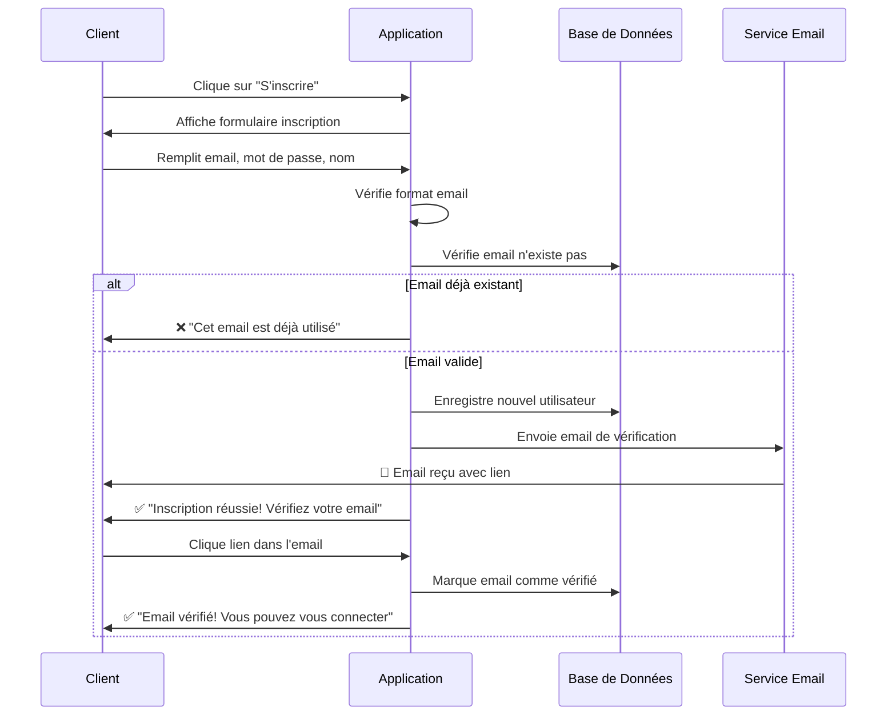
```mermaid
sequenceDiagram
    participant Client
    participant Application
    participant Base de Données
    participant Service Email

    Client->>Application: Clique sur "S'inscrire"
    Application->>Client: Affiche formulaire inscription
    Client->>Application: Remplit email, mot de passe, nom
    Application->>Application: Vérifie format email
    Application->>Base de Données: Vérifie email n'existe pas
    alt Email déjà existant
        Application->>Client: ❌ "Cet email est déjà utilisé"
    else Email valide
        Application->>Base de Données: Enregistre nouvel utilisateur
        Application->>Service Email: Envoie email de vérification
        Service Email->>Client: 📧 Email reçu avec lien
        Application->>Client: ✅ "Inscription réussie! Vérifiez votre email"
        Client->>Application: Clique lien dans l'email
        Application->>Base de Données: Marque email comme vérifié
        Application->>Client: ✅ "Email vérifié! Vous pouvez vous connecter"
    end
```

---

## 2. **Connexion (Login)**

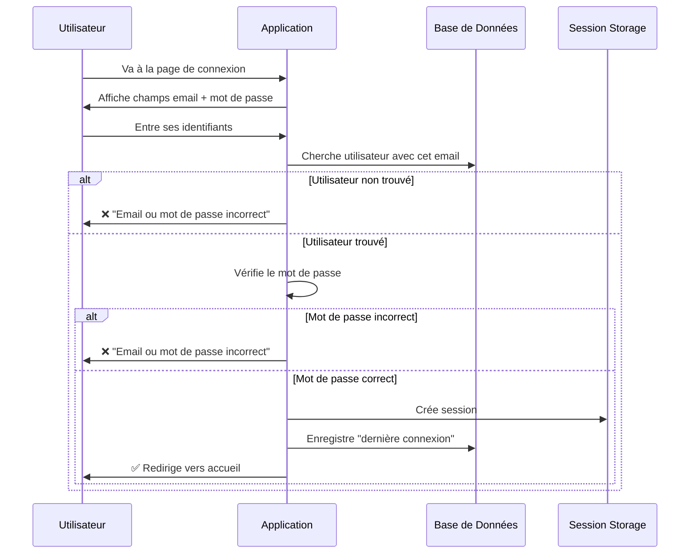
```mermaid
sequenceDiagram
    participant Utilisateur
    participant Application
    participant Base de Données
    participant Session Storage

    Utilisateur->>Application: Va à la page de connexion
    Application->>Utilisateur: Affiche champs email + mot de passe
    Utilisateur->>Application: Entre ses identifiants
    Application->>Base de Données: Cherche utilisateur avec cet email
    alt Utilisateur non trouvé
        Application->>Utilisateur: ❌ "Email ou mot de passe incorrect"
    else Utilisateur trouvé
        Application->>Application: Vérifie le mot de passe
        alt Mot de passe incorrect
            Application->>Utilisateur: ❌ "Email ou mot de passe incorrect"
        else Mot de passe correct
            Application->>Session Storage: Crée session
            Application->>Base de Données: Enregistre "dernière connexion"
            Application->>Utilisateur: ✅ Redirige vers accueil
        end
    end
```

---

# 🏪 GESTION MAGASIN

## 3. **Création de Magasin (Store)**

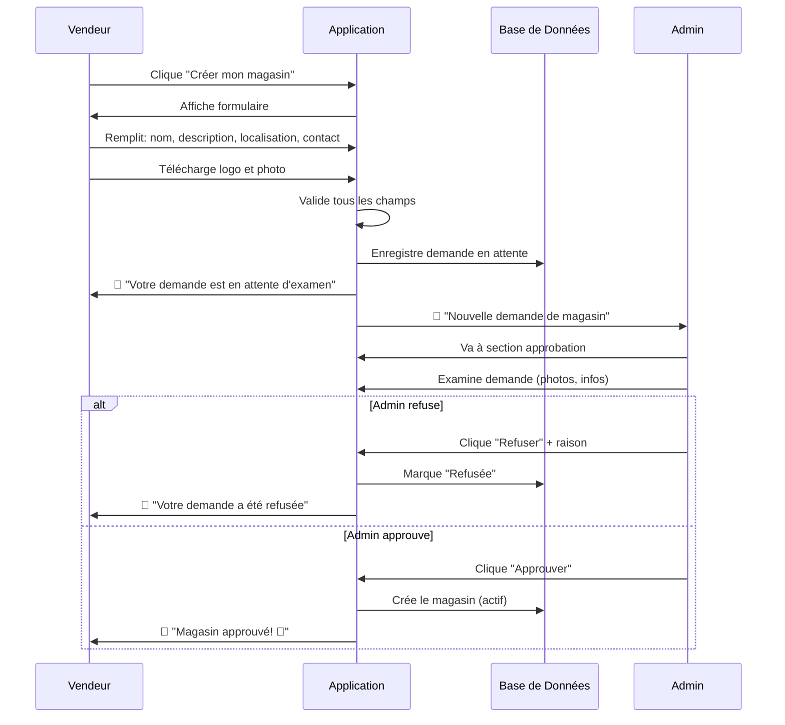
```mermaid
sequenceDiagram
    participant Vendeur
    participant Application
    participant Base de Données
    participant Admin

    Vendeur->>Application: Clique "Créer mon magasin"
    Application->>Vendeur: Affiche formulaire
    Vendeur->>Application: Remplit: nom, description, localisation, contact
    Vendeur->>Application: Télécharge logo et photo
    Application->>Application: Valide tous les champs
    Application->>Base de Données: Enregistre demande en attente
    Application->>Vendeur: 📌 "Votre demande est en attente d'examen"
    Application->>Admin: 🔔 "Nouvelle demande de magasin"
    Admin->>Application: Va à section approbation
    Admin->>Application: Examine demande (photos, infos)
    alt Admin refuse
        Admin->>Application: Clique "Refuser" + raison
        Application->>Base de Données: Marque "Refusée"
        Application->>Vendeur: 📧 "Votre demande a été refusée"
    else Admin approuve
        Admin->>Application: Clique "Approuver"
        Application->>Base de Données: Crée le magasin (actif)
        Application->>Vendeur: 📧 "Magasin approuvé! 🎉"
    end
```

---

## 4. **Acceptation ou Refus Demande Magasin**

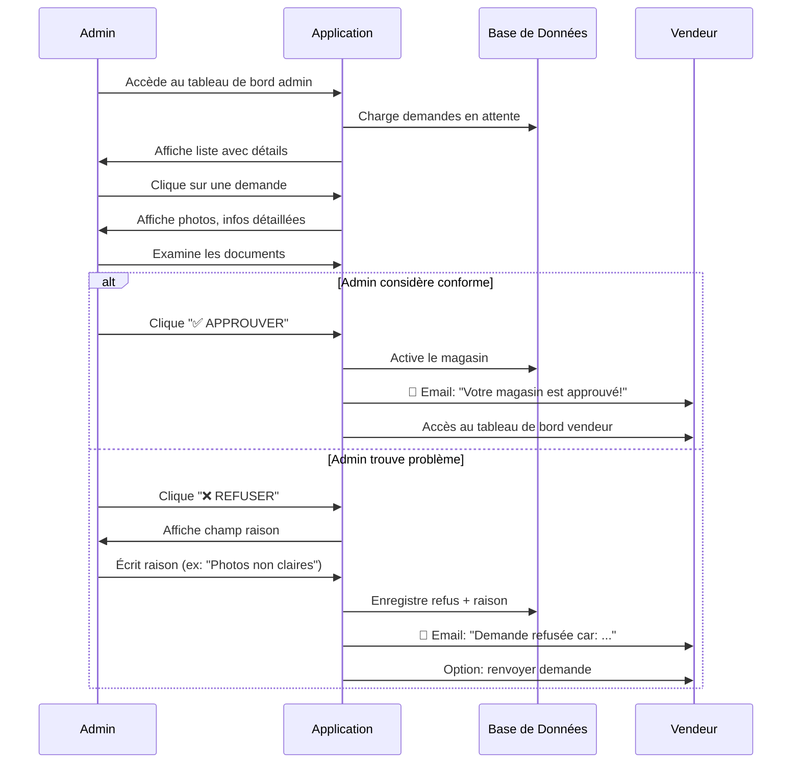
```mermaid
sequenceDiagram
    participant Admin
    participant Application
    participant Base de Données
    participant Vendeur

    Admin->>Application: Accède au tableau de bord admin
    Application->>Base de Données: Charge demandes en attente
    Application->>Admin: Affiche liste avec détails
    Admin->>Application: Clique sur une demande
    Application->>Admin: Affiche photos, infos détaillées
    Admin->>Application: Examine les documents

    alt Admin considère conforme
        Admin->>Application: Clique "✅ APPROUVER"
        Application->>Base de Données: Active le magasin
        Application->>Vendeur: 📧 Email: "Votre magasin est approuvé!"
        Application->>Vendeur: Accès au tableau de bord vendeur
    else Admin trouve problème
        Admin->>Application: Clique "❌ REFUSER"
        Application->>Admin: Affiche champ raison
        Admin->>Application: Écrit raison (ex: "Photos non claires")
        Application->>Base de Données: Enregistre refus + raison
        Application->>Vendeur: 📧 Email: "Demande refusée car: ..."
        Application->>Vendeur: Option: renvoyer demande
    end
```

---

# 📦 CATALOGUE PRODUITS

## 5. **Ajouter Produit/Service**

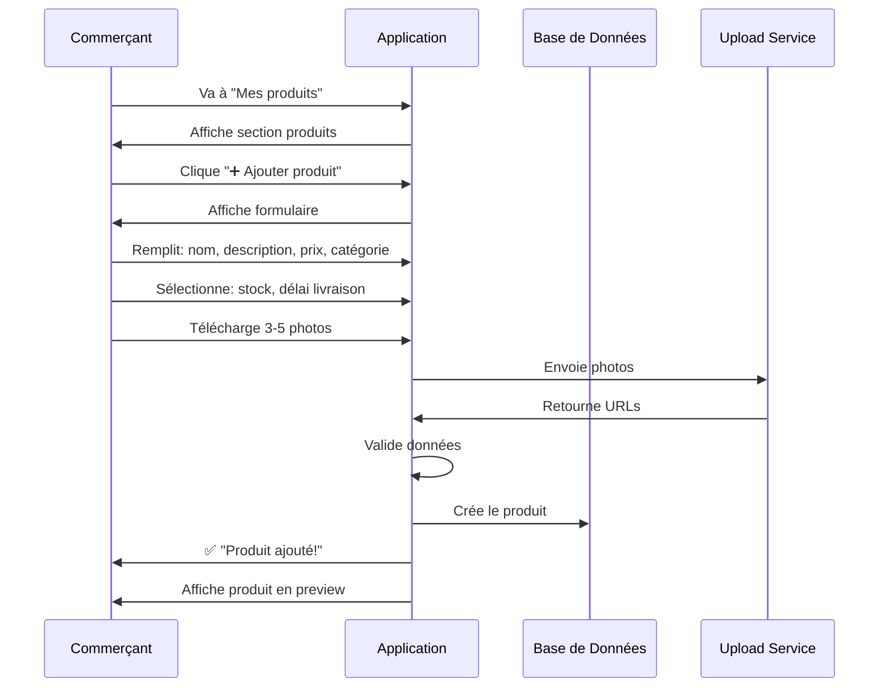
```mermaid
sequenceDiagram
    participant Commerçant
    participant Application
    participant Base de Données
    participant Upload Service

    Commerçant->>Application: Va à "Mes produits"
    Application->>Commerçant: Affiche section produits
    Commerçant->>Application: Clique "➕ Ajouter produit"
    Application->>Commerçant: Affiche formulaire
    Commerçant->>Application: Remplit: nom, description, prix, catégorie
    Commerçant->>Application: Sélectionne: stock, délai livraison
    Commerçant->>Application: Télécharge 3-5 photos
    Application->>Upload Service: Envoie photos
    Upload Service->>Application: Retourne URLs
    Application->>Application: Valide données
    Application->>Base de Données: Crée le produit
    Application->>Commerçant: ✅ "Produit ajouté!"
    Application->>Commerçant: Affiche produit en preview
```

---

## 6. **Modifier Produit/Service**

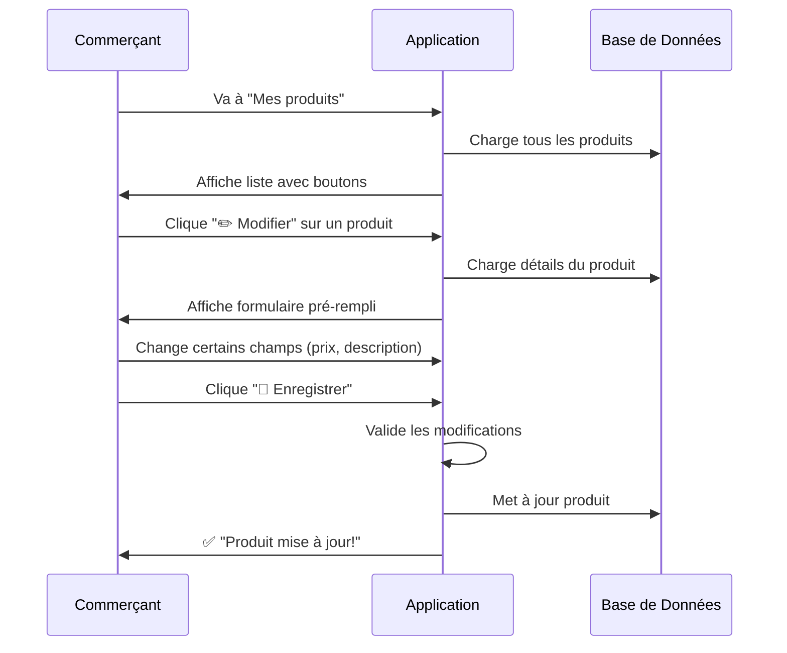
```mermaid
sequenceDiagram
    participant Commerçant
    participant Application
    participant Base de Données

    Commerçant->>Application: Va à "Mes produits"
    Application->>Base de Données: Charge tous les produits
    Application->>Commerçant: Affiche liste avec boutons
    Commerçant->>Application: Clique "✏️ Modifier" sur un produit
    Application->>Base de Données: Charge détails du produit
    Application->>Commerçant: Affiche formulaire pré-rempli
    Commerçant->>Application: Change certains champs (prix, description)
    Commerçant->>Application: Clique "💾 Enregistrer"
    Application->>Application: Valide les modifications
    Application->>Base de Données: Met à jour produit
    Application->>Commerçant: ✅ "Produit mise à jour!"
```

---

## 7. **Création Produit par Darija (Voix/Texte)**

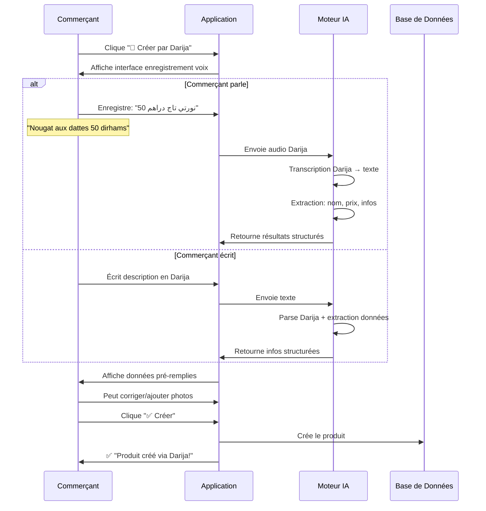
```mermaid
sequenceDiagram
    participant Commerçant
    participant Application
    participant Moteur IA
    participant Base de Données

    Commerçant->>Application: Clique "🎤 Créer par Darija"
    Application->>Commerçant: Affiche interface enregistrement voix
    
    alt Commerçant parle
        Commerçant->>Application: Enregistre: "نورتي تاج دراهم 50"
        Note over Commerçant: "Nougat aux dattes 50 dirhams"
        Application->>Moteur IA: Envoie audio Darija
        Moteur IA->>Moteur IA: Transcription Darija → texte
        Moteur IA->>Moteur IA: Extraction: nom, prix, infos
        Moteur IA->>Application: Retourne résultats structurés
    else Commerçant écrit
        Commerçant->>Application: Écrit description en Darija
        Application->>Moteur IA: Envoie texte
        Moteur IA->>Moteur IA: Parse Darija + extraction données
        Moteur IA->>Application: Retourne infos structurées
    end
    
    Application->>Commerçant: Affiche données pré-remplies
    Commerçant->>Application: Peut corriger/ajouter photos
    Commerçant->>Application: Clique "✅ Créer"
    Application->>Base de Données: Crée le produit
    Application->>Commerçant: ✅ "Produit créé via Darija!"
```

---

# 🎉 PROMOTIONS

## 8. **Ajouter Promotion**

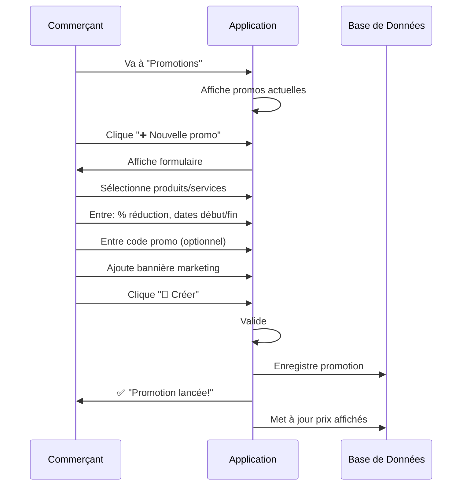
```mermaid
sequenceDiagram
    participant Commerçant
    participant Application
    participant Base de Données

    Commerçant->>Application: Va à "Promotions"
    Application->>Application: Affiche promos actuelles
    Commerçant->>Application: Clique "➕ Nouvelle promo"
    Application->>Commerçant: Affiche formulaire
    Commerçant->>Application: Sélectionne produits/services
    Commerçant->>Application: Entre: % réduction, dates début/fin
    Commerçant->>Application: Entre code promo (optionnel)
    Commerçant->>Application: Ajoute bannière marketing
    Commerçant->>Application: Clique "🚀 Créer"
    Application->>Application: Valide
    Application->>Base de Données: Enregistre promotion
    Application->>Commerçant: ✅ "Promotion lancée!"
    Application->>Base de Données: Met à jour prix affichés
```

---

## 9. **Modifier Promotion**

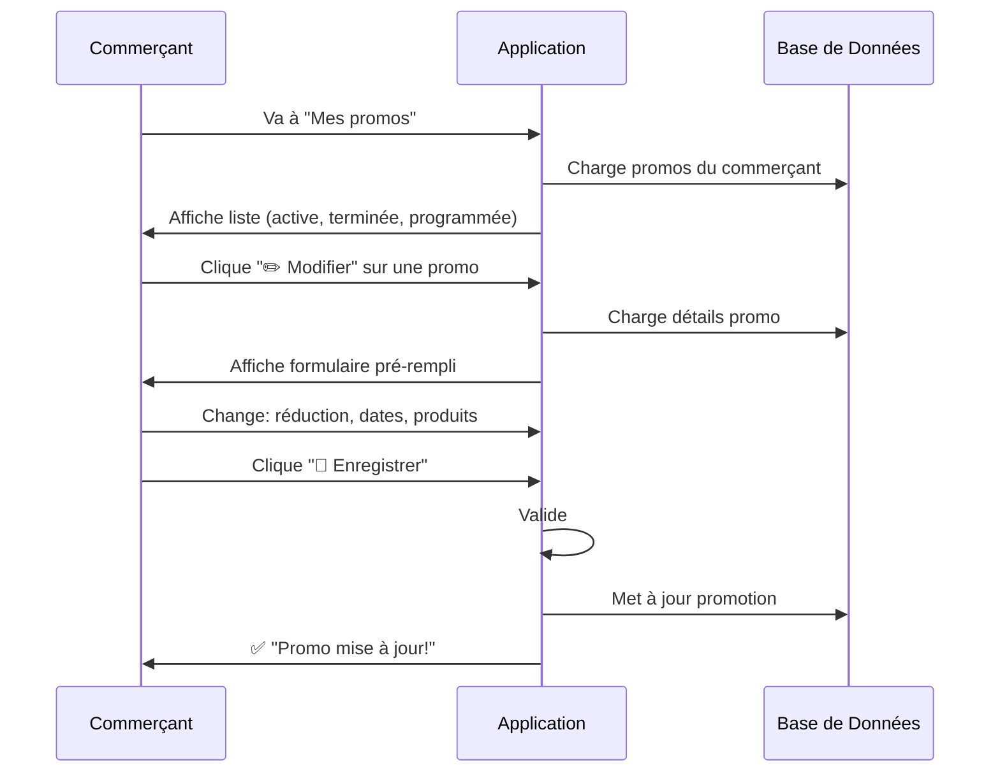
```mermaid
sequenceDiagram
    participant Commerçant
    participant Application
    participant Base de Données

    Commerçant->>Application: Va à "Mes promos"
    Application->>Base de Données: Charge promos du commerçant
    Application->>Commerçant: Affiche liste (active, terminée, programmée)
    Commerçant->>Application: Clique "✏️ Modifier" sur une promo
    Application->>Base de Données: Charge détails promo
    Application->>Commerçant: Affiche formulaire pré-rempli
    Commerçant->>Application: Change: réduction, dates, produits
    Commerçant->>Application: Clique "💾 Enregistrer"
    Application->>Application: Valide
    Application->>Base de Données: Met à jour promotion
    Application->>Commerçant: ✅ "Promo mise à jour!"
```

---

## 10. **Créer Promotion avec IA (Darija)**

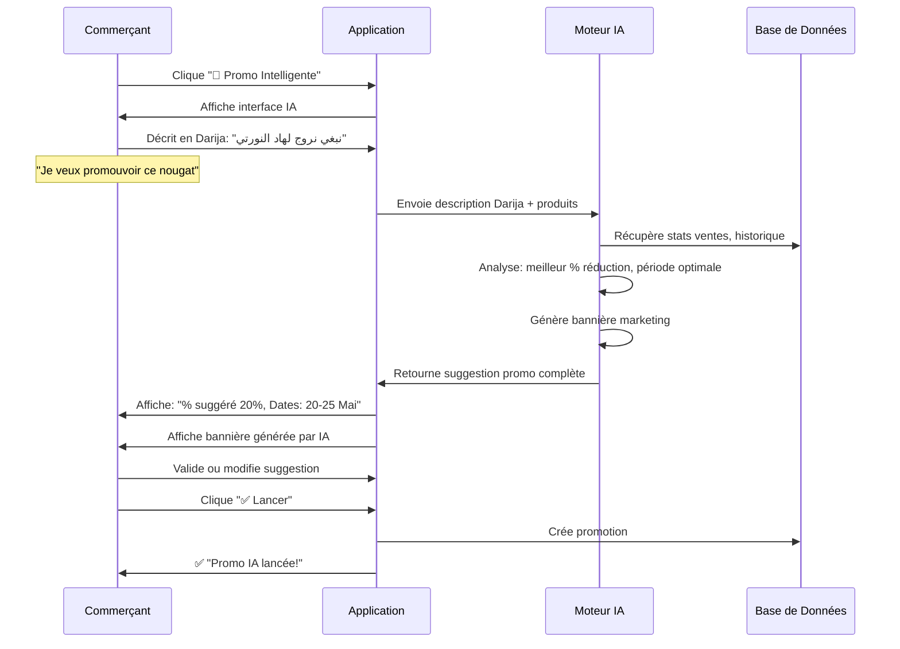
```mermaid
sequenceDiagram
    participant Commerçant
    participant Application
    participant Moteur IA
    participant Base de Données

    Commerçant->>Application: Clique "🤖 Promo Intelligente"
    Application->>Commerçant: Affiche interface IA
    Commerçant->>Application: Décrit en Darija: "نبغي نروج لهاد النورتي"
    Note over Commerçant: "Je veux promouvoir ce nougat"
    Application->>Moteur IA: Envoie description Darija + produits
    Moteur IA->>Base de Données: Récupère stats ventes, historique
    Moteur IA->>Moteur IA: Analyse: meilleur % réduction, période optimale
    Moteur IA->>Moteur IA: Génère bannière marketing
    Moteur IA->>Application: Retourne suggestion promo complète
    Application->>Commerçant: Affiche: "% suggéré 20%, Dates: 20-25 Mai"
    Application->>Commerçant: Affiche bannière générée par IA
    Commerçant->>Application: Valide ou modifie suggestion
    Commerçant->>Application: Clique "✅ Lancer"
    Application->>Base de Données: Crée promotion
    Application->>Commerçant: ✅ "Promo IA lancée!"
```

---

# 🎬 CONTENU SOCIAL

## 11. **Création de Reel**

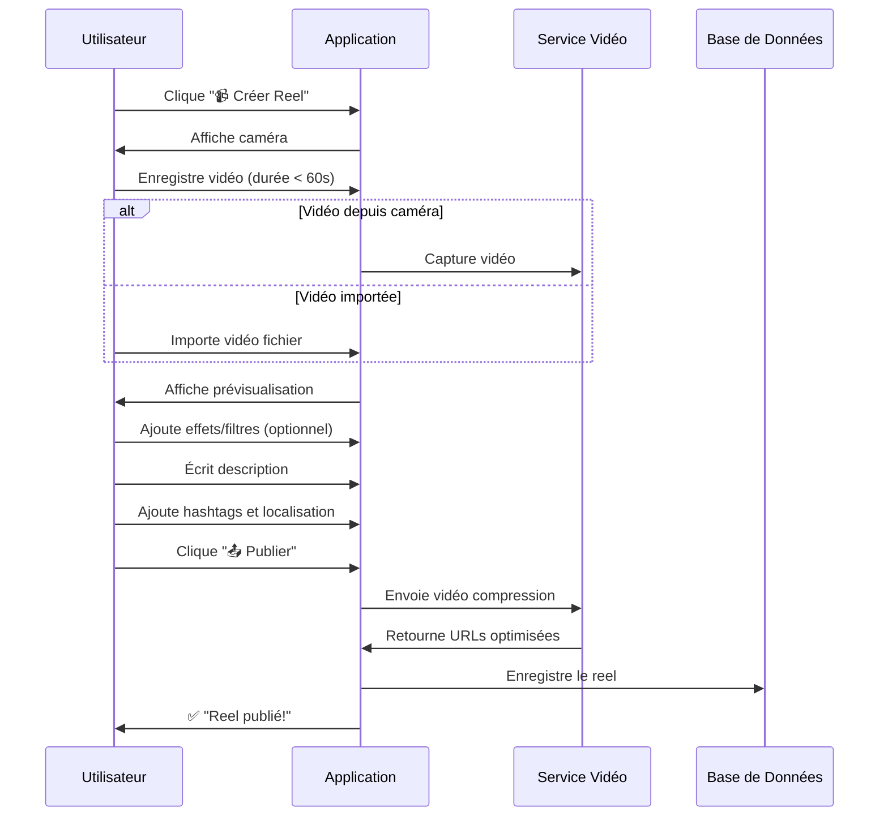
```mermaid
sequenceDiagram
    participant Utilisateur
    participant Application
    participant Service Vidéo
    participant Base de Données

    Utilisateur->>Application: Clique "📹 Créer Reel"
    Application->>Utilisateur: Affiche caméra
    Utilisateur->>Application: Enregistre vidéo (durée < 60s)
    alt Vidéo depuis caméra
        Application->>Service Vidéo: Capture vidéo
    else Vidéo importée
        Utilisateur->>Application: Importe vidéo fichier
    end
    Application->>Utilisateur: Affiche prévisualisation
    Utilisateur->>Application: Ajoute effets/filtres (optionnel)
    Utilisateur->>Application: Écrit description
    Utilisateur->>Application: Ajoute hashtags et localisation
    Utilisateur->>Application: Clique "📤 Publier"
    Application->>Service Vidéo: Envoie vidéo compression
    Service Vidéo->>Application: Retourne URLs optimisées
    Application->>Base de Données: Enregistre le reel
    Application->>Utilisateur: ✅ "Reel publié!"
```

---

## 12. **Consulter & Interagir Reels (Like, Comment, Save, Share)**

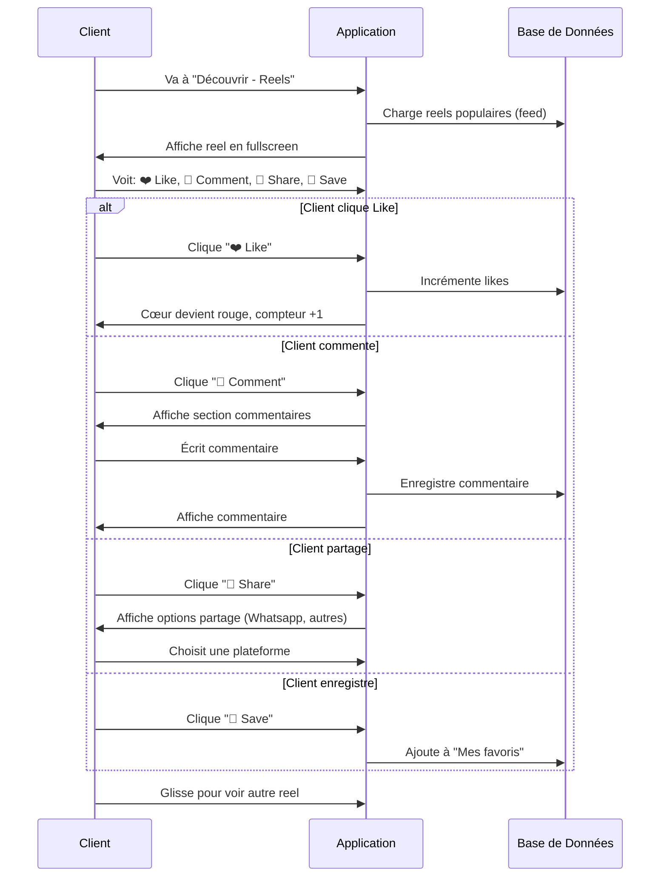
```mermaid
sequenceDiagram
    participant Client
    participant Application
    participant Base de Données

    Client->>Application: Va à "Découvrir - Reels"
    Application->>Base de Données: Charge reels populaires (feed)
    Application->>Client: Affiche reel en fullscreen
    Client->>Application: Voit: ❤️ Like, 💬 Comment, 📱 Share, 🔖 Save

    alt Client clique Like
        Client->>Application: Clique "❤️ Like"
        Application->>Base de Données: Incrémente likes
        Application->>Client: Cœur devient rouge, compteur +1
    else Client commente
        Client->>Application: Clique "💬 Comment"
        Application->>Client: Affiche section commentaires
        Client->>Application: Écrit commentaire
        Application->>Base de Données: Enregistre commentaire
        Application->>Client: Affiche commentaire
    else Client partage
        Client->>Application: Clique "📱 Share"
        Application->>Client: Affiche options partage (Whatsapp, autres)
        Client->>Application: Choisit une plateforme
    else Client enregistre
        Client->>Application: Clique "🔖 Save"
        Application->>Base de Données: Ajoute à "Mes favoris"
    end
    
    Client->>Application: Glisse pour voir autre reel
```

---

## 13. **Supprimer Reel**

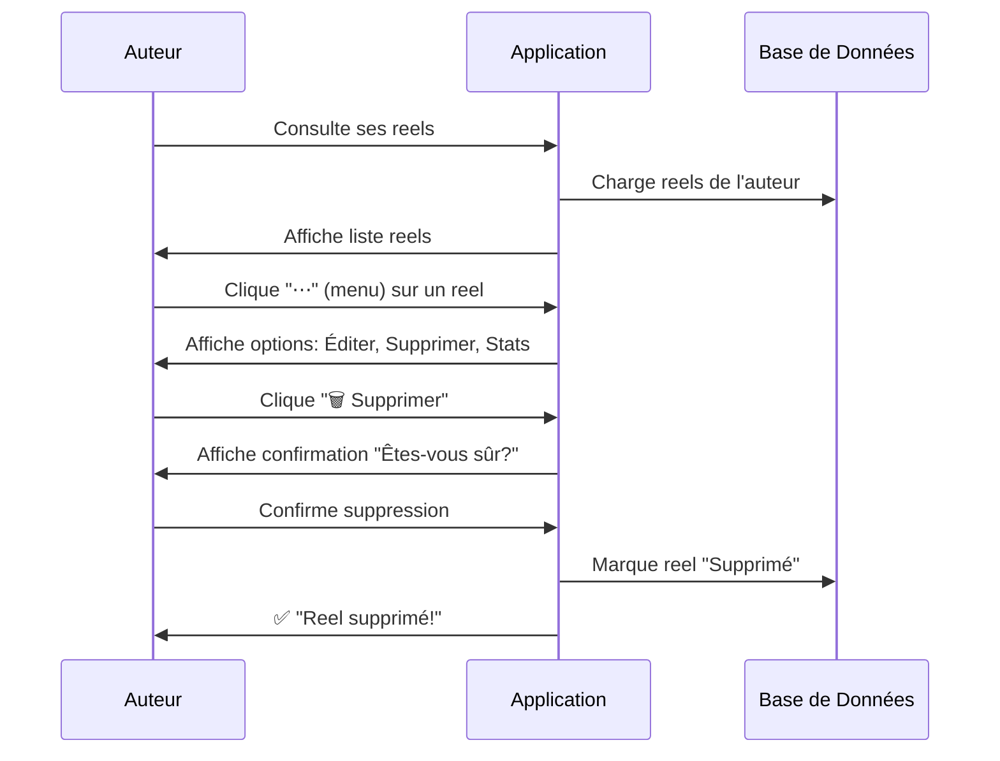
```mermaid
sequenceDiagram
    participant Auteur
    participant Application
    participant Base de Données

    Auteur->>Application: Consulte ses reels
    Application->>Base de Données: Charge reels de l'auteur
    Application->>Auteur: Affiche liste reels
    Auteur->>Application: Clique "⋯" (menu) sur un reel
    Application->>Auteur: Affiche options: Éditer, Supprimer, Stats
    Auteur->>Application: Clique "🗑️ Supprimer"
    Application->>Auteur: Affiche confirmation "Êtes-vous sûr?"
    Auteur->>Application: Confirme suppression
    Application->>Base de Données: Marque reel "Supprimé"
    Application->>Auteur: ✅ "Reel supprimé!"
```

---

## 14. **Ajouter Story (24h)**

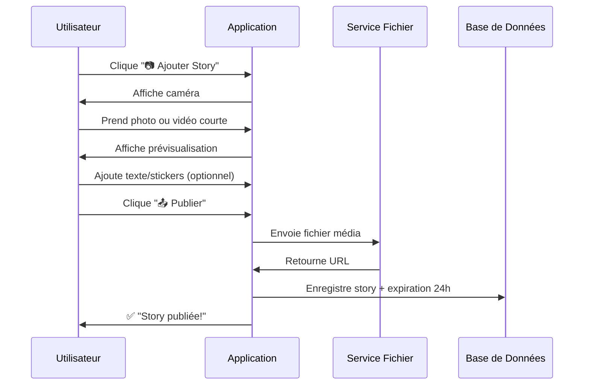
```mermaid
sequenceDiagram
    participant Utilisateur
    participant Application
    participant Service Fichier
    participant Base de Données

    Utilisateur->>Application: Clique "📷 Ajouter Story"
    Application->>Utilisateur: Affiche caméra
    Utilisateur->>Application: Prend photo ou vidéo courte
    Application->>Utilisateur: Affiche prévisualisation
    Utilisateur->>Application: Ajoute texte/stickers (optionnel)
    Utilisateur->>Application: Clique "📤 Publier"
    Application->>Service Fichier: Envoie fichier média
    Service Fichier->>Application: Retourne URL
    Application->>Base de Données: Enregistre story + expiration 24h
    Application->>Utilisateur: ✅ "Story publiée!"
```

---

## 15. **Supprimer Story**

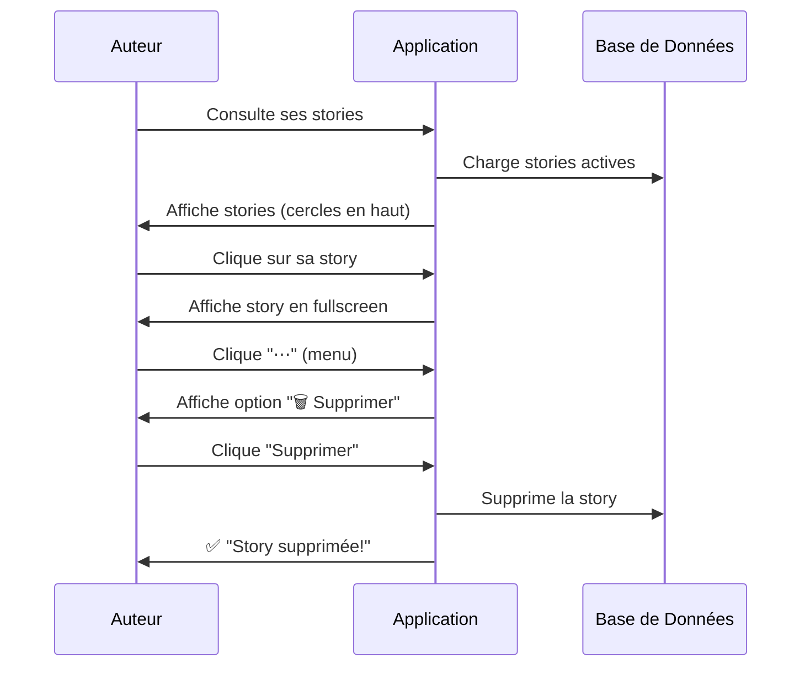
```mermaid
sequenceDiagram
    participant Auteur
    participant Application
    participant Base de Données

    Auteur->>Application: Consulte ses stories
    Application->>Base de Données: Charge stories actives
    Application->>Auteur: Affiche stories (cercles en haut)
    Auteur->>Application: Clique sur sa story
    Application->>Auteur: Affiche story en fullscreen
    Auteur->>Application: Clique "⋯" (menu)
    Application->>Auteur: Affiche option "🗑️ Supprimer"
    Auteur->>Application: Clique "Supprimer"
    Application->>Base de Données: Supprime la story
    Application->>Auteur: ✅ "Story supprimée!"
```

---

# 🔍 RECHERCHE

## 16. **Recherche Sémantique par Darija**

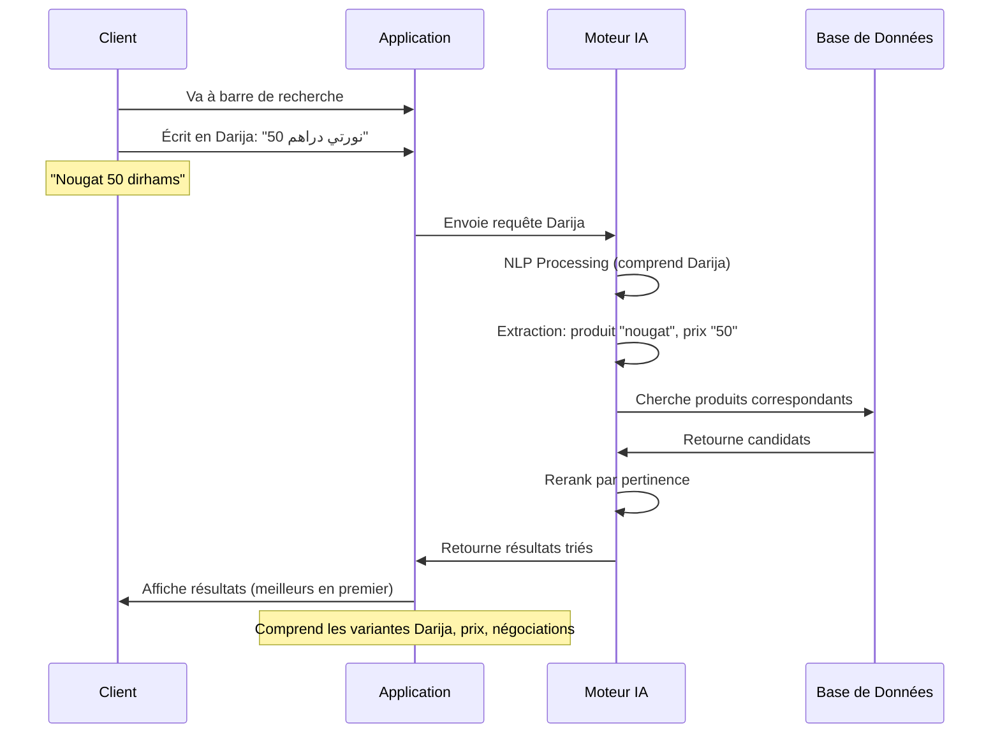
```mermaid
sequenceDiagram
    participant Client
    participant Application
    participant Moteur IA
    participant Base de Données

    Client->>Application: Va à barre de recherche
    Client->>Application: Écrit en Darija: "نورتي دراهم 50"
    Note over Client: "Nougat 50 dirhams"
    Application->>Moteur IA: Envoie requête Darija
    Moteur IA->>Moteur IA: NLP Processing (comprend Darija)
    Moteur IA->>Moteur IA: Extraction: produit "nougat", prix "50"
    Moteur IA->>Base de Données: Cherche produits correspondants
    Base de Données->>Moteur IA: Retourne candidats
    Moteur IA->>Moteur IA: Rerank par pertinence
    Moteur IA->>Application: Retourne résultats triés
    Application->>Client: Affiche résultats (meilleurs en premier)
    Note over Application: Comprend les variantes Darija, prix, négociations
```

---

## 17. **Recherche par Image**

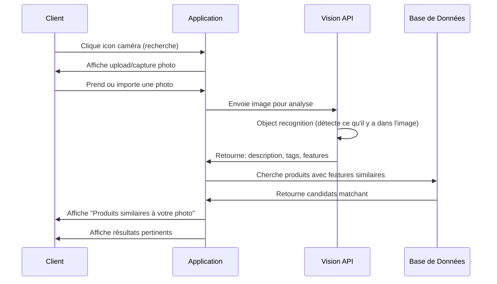
```mermaid
sequenceDiagram
    participant Client
    participant Application
    participant Vision API
    participant Base de Données

    Client->>Application: Clique icon caméra (recherche)
    Application->>Client: Affiche upload/capture photo
    Client->>Application: Prend ou importe une photo
    Application->>Vision API: Envoie image pour analyse
    Vision API->>Vision API: Object recognition (détecte ce qu'il y a dans l'image)
    Vision API->>Application: Retourne: description, tags, features
    Application->>Base de Données: Cherche produits avec features similaires
    Base de Données->>Application: Retourne candidats matchant
    Application->>Client: Affiche "Produits similaires à votre photo"
    Application->>Client: Affiche résultats pertinents
```

---

## 18. **Recherche Géolocale (Par Localisation)**

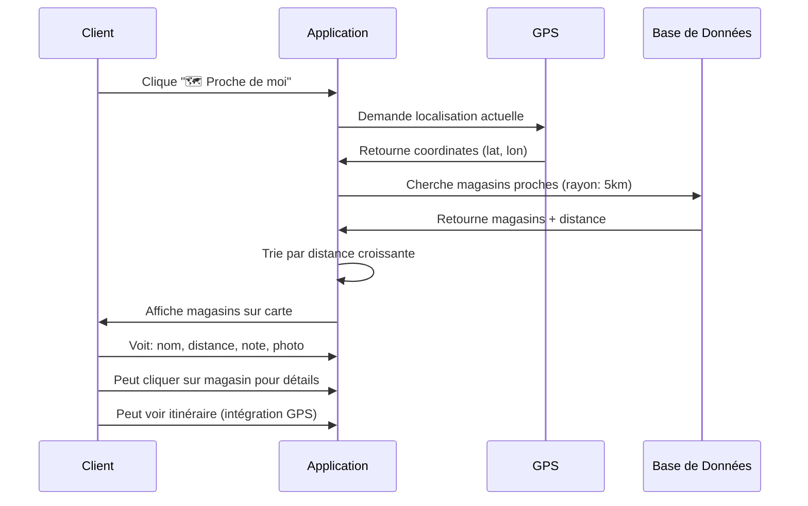
```mermaid
sequenceDiagram
    participant Client
    participant Application
    participant GPS
    participant Base de Données

    Client->>Application: Clique "🗺️ Proche de moi"
    Application->>GPS: Demande localisation actuelle
    GPS->>Application: Retourne coordinates (lat, lon)
    Application->>Base de Données: Cherche magasins proches (rayon: 5km)
    Base de Données->>Application: Retourne magasins + distance
    Application->>Application: Trie par distance croissante
    Application->>Client: Affiche magasins sur carte
    Client->>Application: Voit: nom, distance, note, photo
    Client->>Application: Peut cliquer sur magasin pour détails
    Client->>Application: Peut voir itinéraire (intégration GPS)
```

---

# ⭐ ÉVALUATIONS

## 19. **Poster Avis (Store ou Items)**

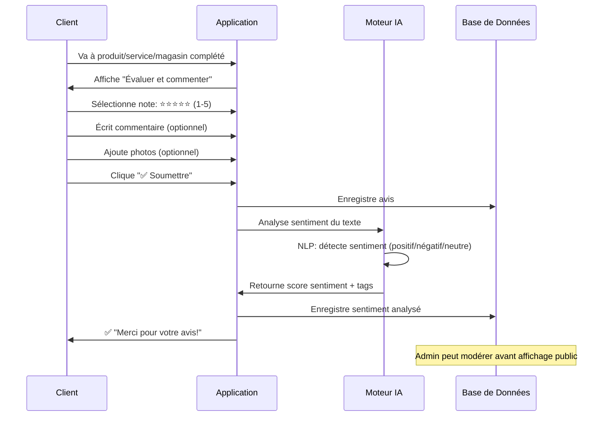
```mermaid
sequenceDiagram
    participant Client
    participant Application
    participant Moteur IA
    participant Base de Données

    Client->>Application: Va à produit/service/magasin complété
    Application->>Client: Affiche "Évaluer et commenter"
    Client->>Application: Sélectionne note: ⭐⭐⭐⭐⭐ (1-5)
    Client->>Application: Écrit commentaire (optionnel)
    Client->>Application: Ajoute photos (optionnel)
    Client->>Application: Clique "✅ Soumettre"
    Application->>Base de Données: Enregistre avis
    Application->>Moteur IA: Analyse sentiment du texte
    Moteur IA->>Moteur IA: NLP: détecte sentiment (positif/négatif/neutre)
    Moteur IA->>Application: Retourne score sentiment + tags
    Application->>Base de Données: Enregistre sentiment analysé
    Application->>Client: ✅ "Merci pour votre avis!"
    Note over Base de Données: Admin peut modérer avant affichage public
```

---

# 💳 TRANSACTIONS

## 20. **Faire une Commande/Réservation**

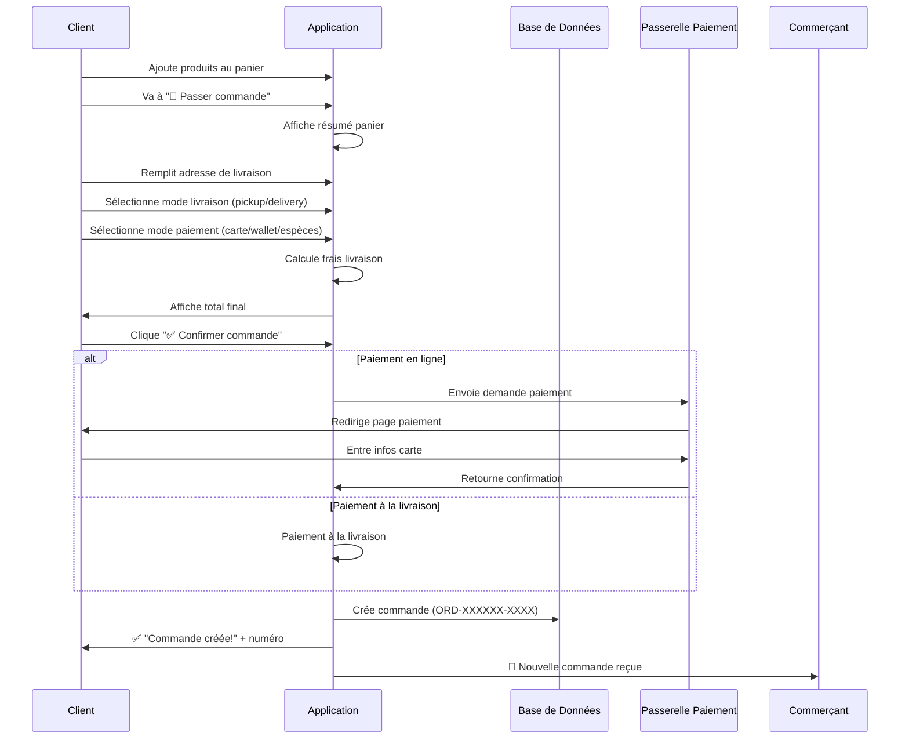
```mermaid
sequenceDiagram
    participant Client
    participant Application
    participant Base de Données
    participant Passerelle Paiement

    Client->>Application: Ajoute produits au panier
    Client->>Application: Va à "🛒 Passer commande"
    Application->>Application: Affiche résumé panier
    Client->>Application: Remplit adresse de livraison
    Client->>Application: Sélectionne mode livraison (pickup/delivery)
    Client->>Application: Sélectionne mode paiement (carte/wallet/espèces)
    Application->>Application: Calcule frais livraison
    Application->>Client: Affiche total final
    Client->>Application: Clique "✅ Confirmer commande"
    
    alt Paiement en ligne
        Application->>Passerelle Paiement: Envoie demande paiement
        Passerelle Paiement->>Client: Redirige page paiement
        Client->>Passerelle Paiement: Entre infos carte
        Passerelle Paiement->>Application: Retourne confirmation
    else Paiement à la livraison
        Application->>Application: Paiement à la livraison
    end
    
    Application->>Base de Données: Crée commande (ORD-XXXXXX-XXXX)
    Application->>Client: ✅ "Commande créée!" + numéro
    Application->>Commerçant: 🔔 Nouvelle commande reçue
```

---

## 21. **Accepter/Refuser Demande de Réservation/Commande**

```mermaid
sequenceDiagram
    participant Commerçant
    participant Application
    participant Base de Données
    participant Client

    Application->>Commerçant: 🔔 "Nouvelle commande!"
    Commerçant->>Application: Va à "Commandes reçues"
    Application->>Base de Données: Charge commandes en attente
    Application->>Commerçant: Affiche liste commandess
    Commerçant->>Application: Clique sur une commande
    Application->>Commerçant: Affiche: articles, client, adresse, montant
    
    alt Commerçant accepte
        Commerçant->>Application: Clique "✅ Accepter"
        Application->>Base de Données: Change statut → "En préparation"
        Application->>Client: 📧 "Votre commande est en préparation"
        Commerçant->>Application: Prépare la commande
        Commerçant->>Application: Clique "🚚 Prête à livrer"
        Application->>Base de Données: Change statut → "Prête à livrer"
        Application->>Client: 📧 "Votre commande est prête!"
    else Commerçant refuse
        Commerçant->>Application: Clique "❌ Refuser"
        Application->>Application: Affiche champ raison
        Commerçant->>Application: Écrit raison (ex: "Rupture de stock")
        Application->>Base de Données: Marque "Refusée"
        Application->>Client: 📧 "Commande refusée: " + raison
        Application->>Client: 💰 Remboursement en cours
    end
```

---

## 22. **Validation de Commande/Réservation par QR Code**

```mermaid
sequenceDiagram
    participant Commerçant
    participant Client
    participant Application
    participant Base de Données

    Commerçant->>Application: Commande prête → génère QR code
    Application->>Base de Données: Crée QR code unique (ORD-XXXXXX-XXXX)
    Application->>Client: 📧 QR code envoie par email
    
    Note over Client: Client arrive pour pickup/livraison
    Client->>Application: Affiche QR code dans app
    
    Commerçant->>Application: 🔍 "Scanner QR Code"
    Application->>Commerçant: Affiche caméra
    Commerçant->>Application: Scanne QR code du client
    
    alt QR valide
        Application->>Base de Données: Récupère détails commande
        Application->>Application: Vérifie commande valide
        Application->>Commerçant: ✅ "Commande confirmée!"
        Application->>Commerçant: Affiche: client, articles, prix
        Commerçant->>Application: Remet produits au client
        Commerçant->>Application: Clique "✅ Livraison confirmée"
        Application->>Base de Données: Change statut → "Livrée"
        Application->>Client: 📧 "Commande livrée! Merci 🙏"
    else QR invalide/expiré
        Application->>Commerçant: ❌ "QR Code invalide"
    end
```

---

# ❤️ FAVORIS & NOTIFICATIONS

## 23. **Ajouter en Favoris**

```mermaid
sequenceDiagram
    participant Client
    participant Application
    participant Base de Données

    Client->>Application: Consulte un produit/magasin
    Application->>Client: Affiche détails
    Client->>Application: Clique "❤️ Ajouter favoris"
    Application->>Base de Données: Enregistre dans favoris du client
    Application->>Client: ❤️ Cœur devient plein/rouge
    Application->>Client: ✅ "Ajouté à vos favoris!"
    
    Client->>Application: Va à "❤️ Mes favoris"
    Application->>Base de Données: Charge tous favoris
    Application->>Client: Affiche liste produits/magasins favoris
    Client->>Application: Peut retirer un favori
    Application->>Base de Données: Supprime du favoris
    Application->>Client: "Retiré de vos favoris"
```

---

# 💬 MESSAGERIE

## 24. **Discuter Messagerie Client - Client**

```mermaid
sequenceDiagram
    participant Client A
    participant Application
    participant Base de Données
    participant Client B

    Client A->>Application: Clique sur profil Client B
    Application->>Client A: Affiche option "💬 Envoyer message"
    Client A->>Application: Clique "Envoyer message"
    Application->>Application: Crée/ouvre conversation
    Application->>Client A: Affiche chat window
    Client A->>Application: Écrit message
    Client A->>Application: Clique "📤 Envoyer"
    Application->>Base de Données: Enregistre message
    Application->>Client B: 🔔 Notification: nouveau message
    Application->>Client B: Affiche message dans chat
    
    Client B->>Application: Clique notification ou va à Messages
    Application->>Client B: Affiche conversation
    Client B->>Application: Lit le message de Client A
    Client B->>Application: Écrit réponse
    Client B->>Application: Envoie message
    Application->>Base de Données: Enregistre réponse
    Application->>Client A: 🔔 Notification: réponse reçue
    Application->>Client A: Affiche message de Client B
```

---

## 25. **Discuter Messagerie Client - Store**

```mermaid
sequenceDiagram
    participant Client
    participant Application
    participant Base de Données
    participant Commerçant

    Client->>Application: Consulte un magasin
    Application->>Client: Affiche option "💬 Contacter le magasin"
    Client->>Application: Clique "Envoyer message"
    Application->>Application: Ouvre chat avec le magasin
    Application->>Client: Affiche chat window
    Client->>Application: Écrit question (ex: "Avez-vous du stock?")
    Client->>Application: Clique "📤 Envoyer"
    Application->>Base de Données: Enregistre message
    Application->>Commerçant: 🔔 Notification client
    Application->>Commerçant: Va à "Messages"
    Application->>Commerçant: Affiche conversation client
    
    Commerçant->>Application: Lit le message
    Commerçant->>Application: Écrit réponse (ex: "Oui on a stock!")
    Commerçant->>Application: Clique "Envoyer"
    Application->>Base de Données: Enregistre réponse
    Application->>Client: 🔔 Notification: réponse du magasin
    Application->>Client: Affiche réponse du commerçant dans chat
```

---

## 26. **Créer Ticket Support**

```mermaid
sequenceDiagram
    participant Utilisateur
    participant Application
    participant Base de Données
    participant Support Admin

    Utilisateur->>Application: Va à "❓ Aide/Support"
    Application->>Utilisateur: Affiche options
    Utilisateur->>Application: Clique "🎫 Créer ticket"
    Application->>Utilisateur: Affiche formulaire ticket
    Utilisateur->>Application: Sélectionne catégorie (Paiement, Livraison, etc)
    Utilisateur->>Application: Écrit description du problème
    Utilisateur->>Application: Peut ajouter fichiers/captures
    Utilisateur->>Application: Clique "✅ Créer ticket"
    Application->>Base de Données: Enregistre ticket
    Application->>Support Admin: 🔔 Nouveau ticket TK-XXXXXX
    Application->>Utilisateur: ✅ "Ticket créé - Numéro: TK-XXXXXX"
    
    Support Admin->>Application: Va à "Tickets en attente"
    Support Admin->>Application: Clique sur le ticket
    Support Admin->>Application: Lit la description
    Support Admin->>Application: Écrit réponse avec solution
    Support Admin->>Application: Clique "Envoyer réponse"
    Application->>Base de Données: Enregistre réponse
    Application->>Utilisateur: 🔔 "Réponse du support reçue"
    Utilisateur->>Application: Consulte réponse dans son ticket
```

---

## 27. **Chat Store - Admin RO2YA**

```mermaid
sequenceDiagram
    participant Commerçant
    participant Application
    participant Base de Données
    participant Admin RO2YA

    Commerçant->>Application: Va à "Support RO2YA"
    Application->>Commerçant: Affiche option "💬 Chat avec admin"
    Commerçant->>Application: Clique pour ouvrir chat
    Application->>Application: Crée conversation avec admin
    Application->>Commerçant: Affiche chat window
    Commerçant->>Application: Écrit question (ex: "Comment augmenter mes ventes?")
    Commerçant->>Application: Clique "Envoyer"
    Application->>Base de Données: Enregistre message
    Application->>Admin RO2YA: 🔔 Message du commerçant
    
    Admin RO2YA->>Application: Va à "Messages des commerçants"
    Admin RO2YA->>Application: Clique sur la conversation
    Admin RO2YA->>Application: Lit le message
    Admin RO2YA->>Application: Écrit réponse (conseils, aide)
    Admin RO2YA->>Application: Clique "Envoyer"
    Application->>Base de Données: Enregistre réponse
    Application->>Commerçant: 🔔 Réponse de l'admin RO2YA
    Application->>Commerçant: Affiche réponse dans chat
    
    Note over Application: Chat en temps réel, messages instantanés
    Note over Application: Admin peut joindre documents/ressources
```

---

## 📊 RÉSUMÉ DES 27 DIAGRAMMES

| # | Diagramme | Catégorie | Acteurs Principaux |
|---|-----------|-----------|-------------------|
| 1 | Sign Up | Authentification | Client, Email Service |
| 2 | Login | Authentification | Utilisateur, Session |
| 3 | Création Store | Magasin | Vendeur, Admin |
| 4 | Acceptation/Refus Store | Magasin | Admin, Vendeur |
| 5 | Ajouter Produit | Catalogue | Commerçant, Upload |
| 6 | Modifier Produit | Catalogue | Commerçant |
| 7 | Produit par Darija | Catalogue | Commerçant, IA |
| 8 | Ajouter Promotion | Promo | Commerçant |
| 9 | Modifier Promotion | Promo | Commerçant |
| 10 | Promo IA Darija | Promo | Commerçant, IA |
| 11 | Créer Reel | Social | Utilisateur, Video |
| 12 | Interagir Reels | Social | Client |
| 13 | Supprimer Reel | Social | Auteur |
| 14 | Ajouter Story | Social | Utilisateur, Fichier |
| 15 | Supprimer Story | Social | Auteur |
| 16 | Recherche Darija | Recherche | Client, IA |
| 17 | Recherche Image | Recherche | Client, Vision API |
| 18 | Recherche Géolocale | Recherche | Client, GPS |
| 19 | Poster Avis | Évaluations | Client, IA |
| 20 | Faire Commande | Transactions | Client, Paiement |
| 21 | Accepter/Refuser | Transactions | Commerçant, Client |
| 22 | Validation QR Code | Transactions | Commerçant, Client |
| 23 | Ajouter Favoris | Favoris | Client |
| 24 | Chat Client-Client | Messagerie | Client A, Client B |
| 25 | Chat Client-Store | Messagerie | Client, Commerçant |
| 26 | Ticket Support | Support | Utilisateur, Admin |
| 27 | Chat Store-Admin | Support | Commerçant, Admin |

---

**Document créé**: 18 Mai 2026  
**Version**: 1.0 - 27 Diagrammes Essentiels  
**Statut**: ✅ Prêt pour implémentation
