# 📊 DIAGRAMMES DE SÉQUENCE - 28 WORKFLOWS

**Projet**: Ro2ya.tn E-Commerce Marketplace  
**Format**: Académique Unifié  
**Date**: 25 Mai 2026  
**Total**: 28 Sequence Diagrams

---

## 📋 TABLE DES MATIÈRES

| # | Workflow | Sprint | Page |
|---|----------|--------|------|
| WF-01 | Inscription Utilisateur | 1 | [Voir](#wf-01-inscription-utilisateur) |
| WF-02 | Connexion Utilisateur | 1 | [Voir](#wf-02-connexion-utilisateur) |
| WF-03 | Création Magasin | 2 | [Voir](#wf-03-création-magasin) |
| WF-04 | Validation Admin | 2 | [Voir](#wf-04-validation-admin-magasin) |
| WF-05 | Ajout Produit/Service | 3 | [Voir](#wf-05-ajout-produitservice) |
| WF-06 | Modification Produit | 3 | [Voir](#wf-06-modification-produit-service) |
| WF-07 | Création Produit IA | 3 | [Voir](#wf-07-création-produit-par-ia) |
| WF-08 | Ajout Promotion | 4 | [Voir](#wf-08-ajout-promotion) |
| WF-09 | Modification Promotion | 4 | [Voir](#wf-09-modification-promotion) |
| WF-10 | Recommandation Promo IA | 4 | [Voir](#wf-10-recommandation-promotion-par-ia) |
| WF-11 | Créer Reel | 5 | [Voir](#wf-11-créer-reel) |
| WF-12 | Interagir Reels | 5 | [Voir](#wf-12-interagir-avec-reels) |
| WF-13 | Supprimer Reel | 5 | [Voir](#wf-13-supprimer-reel) |
| WF-14 | Ajouter Story | 5 | [Voir](#wf-14-ajouter-story) |
| WF-15 | Supprimer Story | 5 | [Voir](#wf-15-supprimer-story) |
| WF-16 | Recherche Sémantique | 6 | [Voir](#wf-16-recherche-sémantique-darija) |
| WF-17 | Recherche par Image | 6 | [Voir](#wf-17-recherche-par-image) |
| WF-18 | Recherche Géolocalisée | 6 | [Voir](#wf-18-recherche-géolocalisée) |
| WF-19 | Poster Avis | 7 | [Voir](#wf-19-poster-avis) |
| WF-20 | Passer Commande | 8 | [Voir](#wf-20-passer-commanderéservation) |
| WF-21 | Accepter Commande | 8 | [Voir](#wf-21-accepter-refuser-commande) |
| WF-22 | Validation QR | 8 | [Voir](#wf-22-validation-qr-code) |
| WF-23 | Ajouter Favoris | 9 | [Voir](#wf-23-ajouter-aux-favoris) |
| WF-24 | Chat User-to-User | 10 | [Voir](#wf-24-chat-user-to-user) |
| WF-25 | Chat Client-Store | 10 | [Voir](#wf-25-chat-client-to-store) |
| WF-26 | Ticket Support | 10 | [Voir](#wf-26-ticket-support-client) |
| WF-27 | Chat Store-Admin | 10 | [Voir](#wf-27-chat-store-to-admin) |
| WF-28 | Recommandation Promo IA | 4 | [Voir](#wf-28-recommandation-promotion-par-ia-v2) |

---

## 🔐 SPRINT 1: AUTHENTIFICATION

### WF-01: Inscription Utilisateur

**Description**: Nouvel utilisateur crée un compte avec vérification email

**Acteurs**:
- `Client`: Utilisateur nouveau
- `Application`: Système d'inscription
- `BaseDonnées`: PostgreSQL
- `ServiceEmail`: Email service

**Flux Principal**:
1. Client saisit email, password, nom complet
2. Application vérifie unicité de l'email
3. Si email déjà utilisé → erreur
4. Sinon → création compte (status "pending")
5. Envoi email de vérification
6. Client clique lien
7. Compte activé

```mermaid
sequenceDiagram
    participant Client
    participant Application
    participant BaseDonnées
    participant Email

    Client->>Application: Saisit email, mot de passe, nom complet
    activate Application
    Application->>BaseDonnées: SELECT * FROM users WHERE email = ?
    activate BaseDonnées
    alt Email existe
        BaseDonnées-->>Application: ✗ (email existe)
        deactivate BaseDonnées
        Application-->>Client: ❌ "Email déjà utilisé"
    else Email unique
        BaseDonnées-->>Application: ✓ (email libre)
        deactivate BaseDonnées
        Application->>BaseDonnées: INSERT INTO users (email, password_hash, name, status)
        activate BaseDonnées
        BaseDonnées-->>Application: user_id
        deactivate BaseDonnées
        Application->>Email: sendVerificationEmail(email, token)
        activate Email
        Email->>Client: 📧 "Cliquez ici pour activer votre compte"
        deactivate Email
        Client->>Application: Clique sur lien (token)
        Application->>BaseDonnées: UPDATE users SET verified = true, status = 'active'
        activate BaseDonnées
        BaseDonnées-->>Application: ✓
        deactivate BaseDonnées
        Application-->>Client: ✅ "Compte activé ! Connexion possible"
    end
    deactivate Application
```

**Statut**: ✅ COMPLETE  
**Fichiers**: `app/register/page.tsx`, `lib/actions/auth.ts`

---

### WF-02: Connexion Utilisateur

**Description**: Utilisateur se connecte via email/password ou magic link

**Acteurs**:
- `Client`: Utilisateur existant
- `Application`: Système d'authentification
- `BaseDonnées`: PostgreSQL
- `ServiceEmail`: Email service (magic link)

**Flux Principal**:
1. Client choisit méthode (email/password ou magic link)
2. Email/password: vérification identifiants + session
3. Magic link: email de connexion sécurisée

```mermaid
sequenceDiagram
    participant Client
    participant Application
    participant BaseDonnées
    participant Email

    Client->>Application: Choisit méthode de connexion
    activate Application
    
    alt Email + Mot de passe
        Client->>Application: Saisit email et mot de passe
        Application->>BaseDonnées: SELECT * FROM users WHERE email = ?
        activate BaseDonnées
        alt Identifiants incorrects
            BaseDonnées-->>Application: ✗
            deactivate BaseDonnées
            Application-->>Client: ❌ "Email ou mot de passe incorrect"
        else Compte non activé
            BaseDonnées-->>Application: {verified: false}
            deactivate BaseDonnées
            Application-->>Client: ⚠️ "Activez votre compte"
            Client->>Application: "Renvoyer lien ?"
            alt Oui
                Application->>Email: sendVerificationEmail()
                Email->>Client: 📧 "Lien d'activation"
            end
        else OK
            BaseDonnées-->>Application: {id, verified: true}
            deactivate BaseDonnées
            Application->>BaseDonnées: INSERT INTO sessions (user_id, token)
            activate BaseDonnées
            BaseDonnées-->>Application: session_id
            deactivate BaseDonnées
            Application-->>Client: ✅ Connexion réussie + session cookie
        end
    else Magic Link
        Client->>Application: Saisit son email
        Application->>BaseDonnées: SELECT * FROM users WHERE email = ?
        activate BaseDonnées
        alt Email non trouvé
            BaseDonnées-->>Application: NULL
            deactivate BaseDonnées
            Application-->>Client: ❌ "Aucun compte associé"
        else Compte non activé
            BaseDonnées-->>Application: {verified: false}
            deactivate BaseDonnées
            Application-->>Client: ⚠️ "Activez d'abord votre compte"
        else OK
            BaseDonnées-->>Application: {id, verified: true}
            deactivate BaseDonnées
            Application->>Email: sendMagicLink(email, token)
            Email->>Client: 📧 "Cliquez pour vous connecter"
            Client->>Application: Clique lien
            Application->>BaseDonnées: VERIFY token + INSERT session
            activate BaseDonnées
            alt Lien valide
                BaseDonnées-->>Application: ✓
                deactivate BaseDonnées
                Application-->>Client: ✅ Connecté
            else Lien expiré
                BaseDonnées-->>Application: ✗
                deactivate BaseDonnées
                Application-->>Client: ❌ "Lien expiré"
            end
        end
    end
    deactivate Application
```

**Statut**: ✅ COMPLETE  
**Fichiers**: `app/login/page.tsx`, `lib/actions/auth.ts`

---

## 🏪 SPRINT 2: GESTION MAGASIN

### WF-03: Création Magasin

**Description**: Propriétaire crée nouveau magasin avec infos et localisation

**Acteurs**:
- `Vendeur`: Propriétaire futur magasin
- `Application`: Système de gestion
- `BaseDonnées`: PostgreSQL
- `ServiceCloud`: Cloudinary

**Flux Principal**:
1. Vendeur remplit formulaire (nom, description, localisation)
2. Upload logo et banner
3. Création compte en attente d'approbation admin

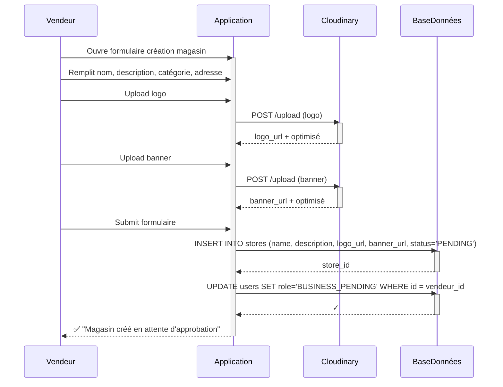
```mermaid
sequenceDiagram
    participant Vendeur
    participant Application
    participant Cloudinary
    participant BaseDonnées

    Vendeur->>Application: Ouvre formulaire création magasin
    activate Application
    
    Vendeur->>Application: Remplit nom, description, catégorie, adresse
    Vendeur->>Application: Upload logo
    Application->>Cloudinary: POST /upload (logo)
    activate Cloudinary
    Cloudinary-->>Application: logo_url + optimisé
    deactivate Cloudinary
    
    Vendeur->>Application: Upload banner
    Application->>Cloudinary: POST /upload (banner)
    activate Cloudinary
    Cloudinary-->>Application: banner_url + optimisé
    deactivate Cloudinary
    
    Vendeur->>Application: Submit formulaire
    Application->>BaseDonnées: INSERT INTO stores (name, description, logo_url, banner_url, status='PENDING')
    activate BaseDonnées
    BaseDonnées-->>Application: store_id
    deactivate BaseDonnées
    
    Application->>BaseDonnées: UPDATE users SET role='BUSINESS_PENDING' WHERE id = vendeur_id
    activate BaseDonnées
    BaseDonnées-->>Application: ✓
    deactivate BaseDonnées
    
    Application-->>Vendeur: ✅ "Magasin créé en attente d'approbation"
    deactivate Application
```

**Statut**: ✅ COMPLETE  
**Fichiers**: `app/merchants/business/add/page.tsx`, `lib/actions/stores.ts`

---

### WF-04: Validation Admin Magasin

**Description**: Admin examine et approuve/rejette demandes de création magasin

**Acteurs**:
- `Admin`: Administrateur plateforme
- `Application`: Tableau de bord admin
- `BaseDonnées`: PostgreSQL
- `Vendeur`: Propriétaire magasin (notification)

**Flux Principal**:
1. Admin consulte liste magasins PENDING
2. Examine infos et images
3. Approuve ou rejette
4. Notifications au vendeur

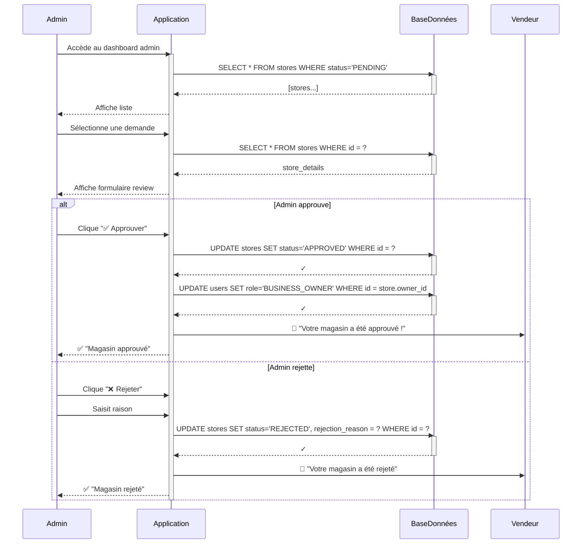
```mermaid
sequenceDiagram
    participant Admin
    participant Application
    participant BaseDonnées
    participant Vendeur

    Admin->>Application: Accède au dashboard admin
    activate Application
    
    Application->>BaseDonnées: SELECT * FROM stores WHERE status='PENDING'
    activate BaseDonnées
    BaseDonnées-->>Application: [stores...]
    deactivate BaseDonnées
    
    Application-->>Admin: Affiche liste
    Admin->>Application: Sélectionne une demande
    
    Application->>BaseDonnées: SELECT * FROM stores WHERE id = ?
    activate BaseDonnées
    BaseDonnées-->>Application: store_details
    deactivate BaseDonnées
    
    Application-->>Admin: Affiche formulaire review
    
    alt Admin approuve
        Admin->>Application: Clique "✅ Approuver"
        Application->>BaseDonnées: UPDATE stores SET status='APPROVED' WHERE id = ?
        activate BaseDonnées
        BaseDonnées-->>Application: ✓
        deactivate BaseDonnées
        
        Application->>BaseDonnées: UPDATE users SET role='BUSINESS_OWNER' WHERE id = store.owner_id
        activate BaseDonnées
        BaseDonnées-->>Application: ✓
        deactivate BaseDonnées
        
        Application->>Vendeur: 🔔 "Votre magasin a été approuvé !"
        Application-->>Admin: ✅ "Magasin approuvé"
        
    else Admin rejette
        Admin->>Application: Clique "❌ Rejeter"
        Admin->>Application: Saisit raison
        
        Application->>BaseDonnées: UPDATE stores SET status='REJECTED', rejection_reason = ? WHERE id = ?
        activate BaseDonnées
        BaseDonnées-->>Application: ✓
        deactivate BaseDonnées
        
        Application->>Vendeur: 🔔 "Votre magasin a été rejeté"
        Application-->>Admin: ✅ "Magasin rejeté"
    end
    deactivate Application
```

**Statut**: ❌ ORPHANED (pas de UI frontend)  
**Fichiers**: `lib/actions/admin.ts`, `lib/actions/notifications.ts`

---

## 📦 SPRINT 3: CATALOGUE

### WF-05: Ajout Produit/Service

**Description**: Vendeur ajoute produit ou service à son catalogue avec workflows différents

**Acteurs**:
- `Commerçant`: Propriétaire magasin/prestataire
- `Application`: Dashboard magasin
- `Cloudinary`: Service upload images
- `BaseVectorielle`: Stockage embeddings sémantiques
- `BaseDonnées`: PostgreSQL

**Flux Principal** (Produit):
1. Commerçant sélectionne "Ajouter Produit"
2. Remplit infos (nom, prix, stock, description)
3. Upload images (1-5)
4. Création produit avec embeddings
5. Visible dans boutique

**Flux Principal** (Service):
1. Commerçant sélectionne "Ajouter Service"
2. Remplit infos (nom, prix/heure, durée, description)
3. Upload images du service
4. Configure créneaux horaires disponibles
5. Création service avec embeddings
6. Visible et réservable

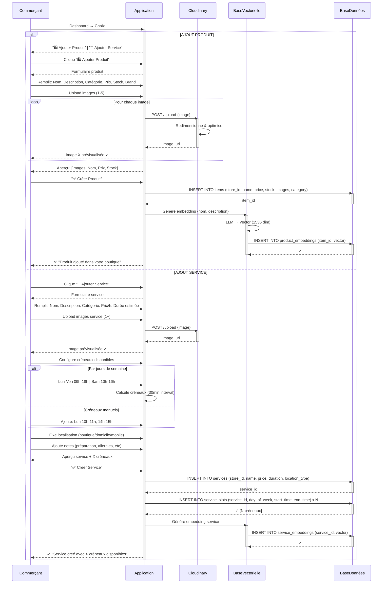
```mermaid
sequenceDiagram
    participant Commerçant
    participant Application
    participant Cloudinary
    participant BaseVectorielle
    participant BaseDonnées

    Commerçant->>Application: Dashboard → Choix
    activate Application
    
    alt AJOUT PRODUIT
        Application-->>Commerçant: "🛍️ Ajouter Produit" | "💼 Ajouter Service"
        Commerçant->>Application: Clique "🛍️ Ajouter Produit"
        
        Application-->>Commerçant: Formulaire produit
        Commerçant->>Application: Remplit: Nom, Description, Catégorie, Prix, Stock, Brand
        Commerçant->>Application: Upload images (1-5)
        
        loop Pour chaque image
            Application->>Cloudinary: POST /upload {image}
            activate Cloudinary
            Cloudinary->>Cloudinary: Redimensionne & optimise
            Cloudinary-->>Application: image_url
            deactivate Cloudinary
            Application-->>Commerçant: Image X prévisualisée ✓
        end
        
        Application-->>Commerçant: Aperçu: [Images, Nom, Prix, Stock]
        Commerçant->>Application: "✅ Créer Produit"
        
        Application->>BaseDonnées: INSERT INTO items (store_id, name, price, stock, images, category)
        activate BaseDonnées
        BaseDonnées-->>Application: item_id
        deactivate BaseDonnées
        
        Application->>BaseVectorielle: Génère embedding {nom, description}
        activate BaseVectorielle
        BaseVectorielle->>BaseVectorielle: LLM → Vector (1536 dim)
        BaseVectorielle->>BaseDonnées: INSERT INTO product_embeddings (item_id, vector)
        activate BaseDonnées
        BaseDonnées-->>BaseVectorielle: ✓
        deactivate BaseDonnées
        deactivate BaseVectorielle
        
        Application-->>Commerçant: ✅ "Produit ajouté dans votre boutique"
        
    else AJOUT SERVICE
        Commerçant->>Application: Clique "💼 Ajouter Service"
        
        Application-->>Commerçant: Formulaire service
        Commerçant->>Application: Remplit: Nom, Description, Catégorie, Prix/h, Durée estimée
        Commerçant->>Application: Upload images service (1+)
        
        Application->>Cloudinary: POST /upload {image}
        activate Cloudinary
        Cloudinary-->>Application: image_url
        deactivate Cloudinary
        
        Application-->>Commerçant: Image prévisualisée ✓
        
        Commerçant->>Application: Configure créneaux disponibles
        
        alt Par jours de semaine
            Commerçant->>Application: Lun-Ven 09h-18h | Sam 10h-16h
            Application->>Application: Calcule créneaux (30min interval)
        else Créneaux manuels
            Commerçant->>Application: Ajoute: Lun 10h-11h, 14h-15h
        end
        
        Commerçant->>Application: Fixe localisation (boutique/domicile/mobile)
        Commerçant->>Application: Ajoute notes (préparation, allergies, etc)
        
        Application-->>Commerçant: Aperçu service + X créneaux
        Commerçant->>Application: "✅ Créer Service"
        
        Application->>BaseDonnées: INSERT INTO services (store_id, name, price, duration, location_type)
        activate BaseDonnées
        BaseDonnées-->>Application: service_id
        deactivate BaseDonnées
        
        Application->>BaseDonnées: INSERT INTO service_slots (service_id, day_of_week, start_time, end_time) x N
        activate BaseDonnées
        BaseDonnées-->>Application: ✓ [N créneaux]
        deactivate BaseDonnées
        
        Application->>BaseVectorielle: Génère embedding service
        activate BaseVectorielle
        BaseVectorielle->>BaseDonnées: INSERT INTO service_embeddings (service_id, vector)
        activate BaseDonnées
        BaseDonnées-->>BaseVectorielle: ✓
        deactivate BaseDonnées
        deactivate BaseVectorielle
        
        Application-->>Commerçant: ✅ "Service créé avec X créneaux disponibles"
    end
    deactivate Application
```

**Statut**: ✅ COMPLETE  
**Fichiers**: `app/dashboard/[id]/products/page.tsx`, `app/dashboard/[id]/services/page.tsx`, `lib/actions/items.ts`, `lib/actions/services.ts`

---

### WF-06: Modification Produit/Service

**Description**: Vendeur modifie informations produit

**Acteurs**:
- `Commerçant`: Propriétaire magasin
- `Application`: Dashboard produits
- `BaseDonnées`: PostgreSQL

**Flux Principal**:
1. Commerçant va à liste produits
2. Édite champs
3. Mise à jour en BD

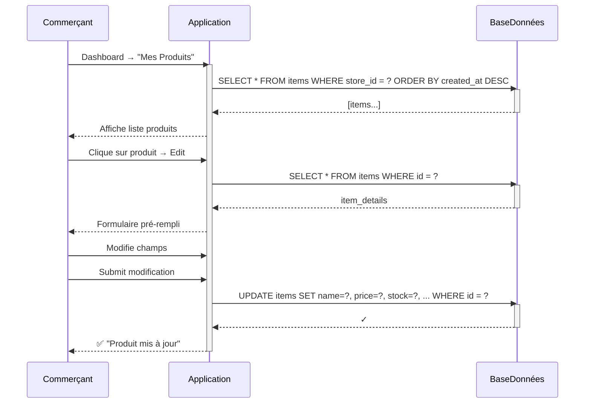
```mermaid
sequenceDiagram
    participant Commerçant
    participant Application
    participant BaseDonnées

    Commerçant->>Application: Dashboard → "Mes Produits"
    activate Application
    
    Application->>BaseDonnées: SELECT * FROM items WHERE store_id = ? ORDER BY created_at DESC
    activate BaseDonnées
    BaseDonnées-->>Application: [items...]
    deactivate BaseDonnées
    
    Application-->>Commerçant: Affiche liste produits
    Commerçant->>Application: Clique sur produit → Edit
    
    Application->>BaseDonnées: SELECT * FROM items WHERE id = ?
    activate BaseDonnées
    BaseDonnées-->>Application: item_details
    deactivate BaseDonnées
    
    Application-->>Commerçant: Formulaire pré-rempli
    Commerçant->>Application: Modifie champs
    
    Commerçant->>Application: Submit modification
    Application->>BaseDonnées: UPDATE items SET name=?, price=?, stock=?, ... WHERE id = ?
    activate BaseDonnées
    BaseDonnées-->>Application: ✓
    deactivate BaseDonnées
    
    Application-->>Commerçant: ✅ "Produit mis à jour"
    deactivate Application
```

**Statut**: ✅ COMPLETE  
**Fichiers**: `app/dashboard/[id]/products/page.tsx`, `lib/actions/items.ts`

---

### WF-07: Création Produit par IA

**Description**: IA génère description et images à partir de photo simple

**Acteurs**:
- `Commerçant`: Propriétaire magasin
- `Application`: Dashboard AI
- `LLM`: Modèle langage
- `BaseVectorielle`: Stockage embeddings
- `BaseDonnées`: PostgreSQL

**Flux Principal**:
1. Commerçant fournit photo simple
2. IA transcrit et extrait infos
3. Génère description structurée
4. Validation et création

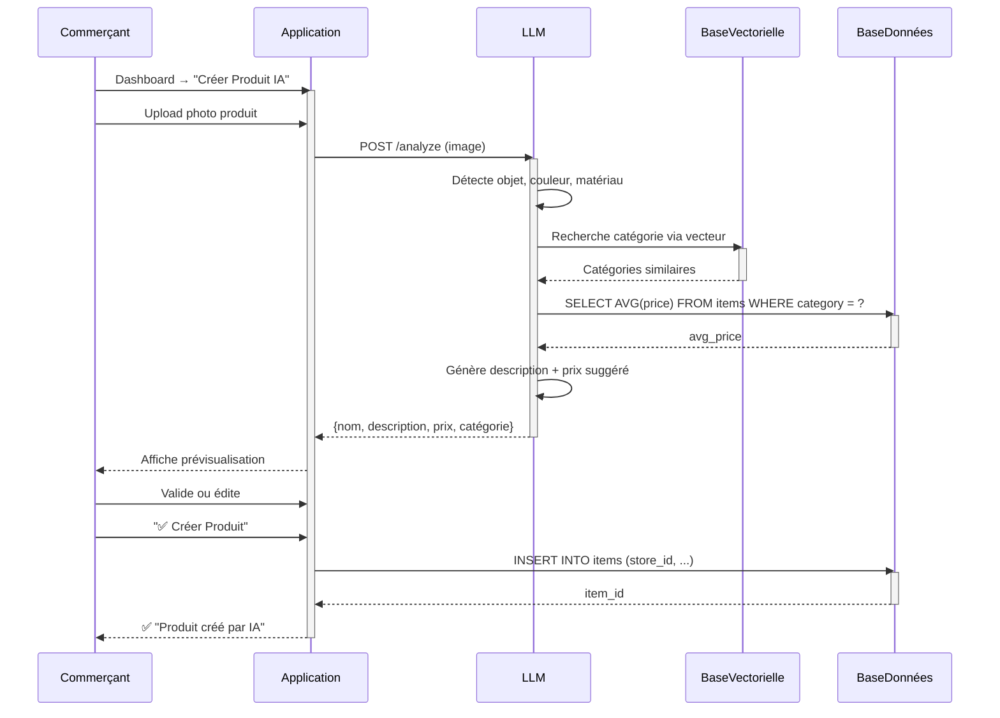
```mermaid
sequenceDiagram
    participant Commerçant
    participant Application
    participant LLM
    participant BaseVectorielle
    participant BaseDonnées

    Commerçant->>Application: Dashboard → "Créer Produit IA"
    activate Application
    
    Commerçant->>Application: Upload photo produit
    Application->>LLM: POST /analyze (image)
    activate LLM
    
    LLM->>LLM: Détecte objet, couleur, matériau
    LLM->>BaseVectorielle: Recherche catégorie via vecteur
    activate BaseVectorielle
    BaseVectorielle-->>LLM: Catégories similaires
    deactivate BaseVectorielle
    
    LLM->>BaseDonnées: SELECT AVG(price) FROM items WHERE category = ?
    activate BaseDonnées
    BaseDonnées-->>LLM: avg_price
    deactivate BaseDonnées
    
    LLM->>LLM: Génère description + prix suggéré
    LLM-->>Application: {nom, description, prix, catégorie}
    deactivate LLM
    
    Application-->>Commerçant: Affiche prévisualisation
    Commerçant->>Application: Valide ou édite
    
    Commerçant->>Application: "✅ Créer Produit"
    Application->>BaseDonnées: INSERT INTO items (store_id, ...)
    activate BaseDonnées
    BaseDonnées-->>Application: item_id
    deactivate BaseDonnées
    
    Application-->>Commerçant: ✅ "Produit créé par IA"
    deactivate Application
```

**Statut**: ⚠️ PARTIAL  
**Fichiers**: `app/dashboard/[id]/products/ai/page.tsx`, `lib/actions/ai-agent.ts`

---

## 🎯 SPRINT 4: PROMOTIONS

### WF-08: Ajout Promotion

**Description**: Vendeur crée promotion/offre spéciale

**Acteurs**:
- `Commerçant`: Propriétaire magasin
- `Application`: Dashboard promotions
- `BaseDonnées`: PostgreSQL

**Flux Principal**:
1. Commerçant sélectionne produits
2. Saisit % remise et dates
3. Création promotion

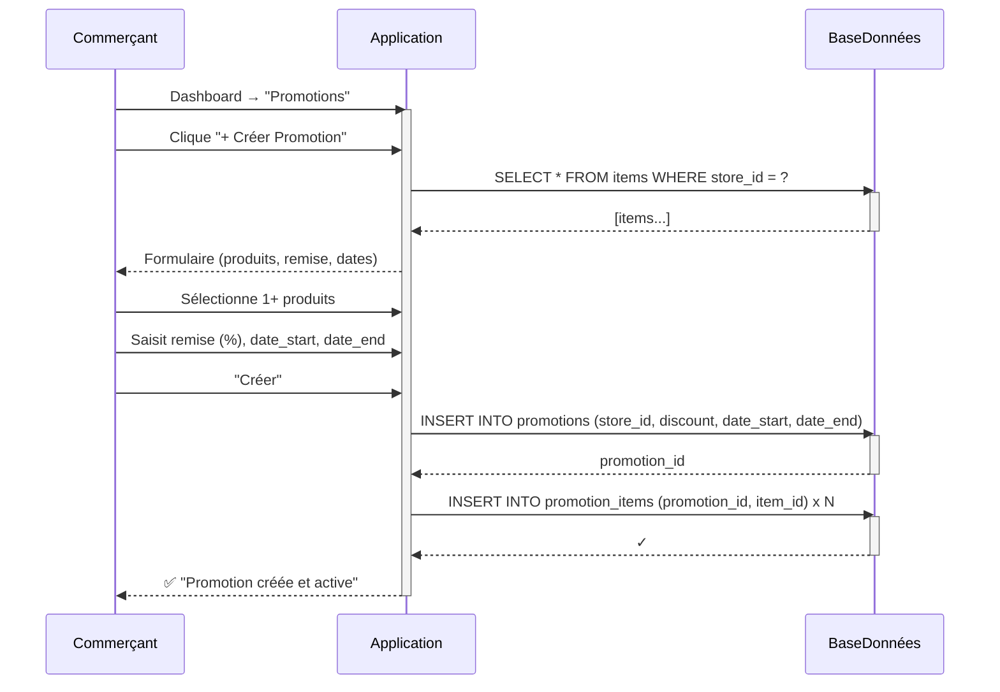
```mermaid
sequenceDiagram
    participant Commerçant
    participant Application
    participant BaseDonnées

    Commerçant->>Application: Dashboard → "Promotions"
    activate Application
    
    Commerçant->>Application: Clique "+ Créer Promotion"
    Application->>BaseDonnées: SELECT * FROM items WHERE store_id = ?
    activate BaseDonnées
    BaseDonnées-->>Application: [items...]
    deactivate BaseDonnées
    
    Application-->>Commerçant: Formulaire (produits, remise, dates)
    Commerçant->>Application: Sélectionne 1+ produits
    Commerçant->>Application: Saisit remise (%), date_start, date_end
    
    Commerçant->>Application: "Créer"
    Application->>BaseDonnées: INSERT INTO promotions (store_id, discount, date_start, date_end)
    activate BaseDonnées
    BaseDonnées-->>Application: promotion_id
    deactivate BaseDonnées
    
    Application->>BaseDonnées: INSERT INTO promotion_items (promotion_id, item_id) x N
    activate BaseDonnées
    BaseDonnées-->>Application: ✓
    deactivate BaseDonnées
    
    Application-->>Commerçant: ✅ "Promotion créée et active"
    deactivate Application
```

**Statut**: ✅ COMPLETE  
**Fichiers**: `app/dashboard/[id]/promotions/page.tsx`, `lib/actions/promotions.ts`

---

### WF-09: Modification Promotion

**Description**: Vendeur modifie paramètres promotion

**Acteurs**:
- `Commerçant`: Propriétaire magasin
- `Application`: Dashboard promotions
- `BaseDonnées`: PostgreSQL

**Flux Principal**:
1. Commerçant liste promotions
2. Édite remise/dates
3. Mise à jour

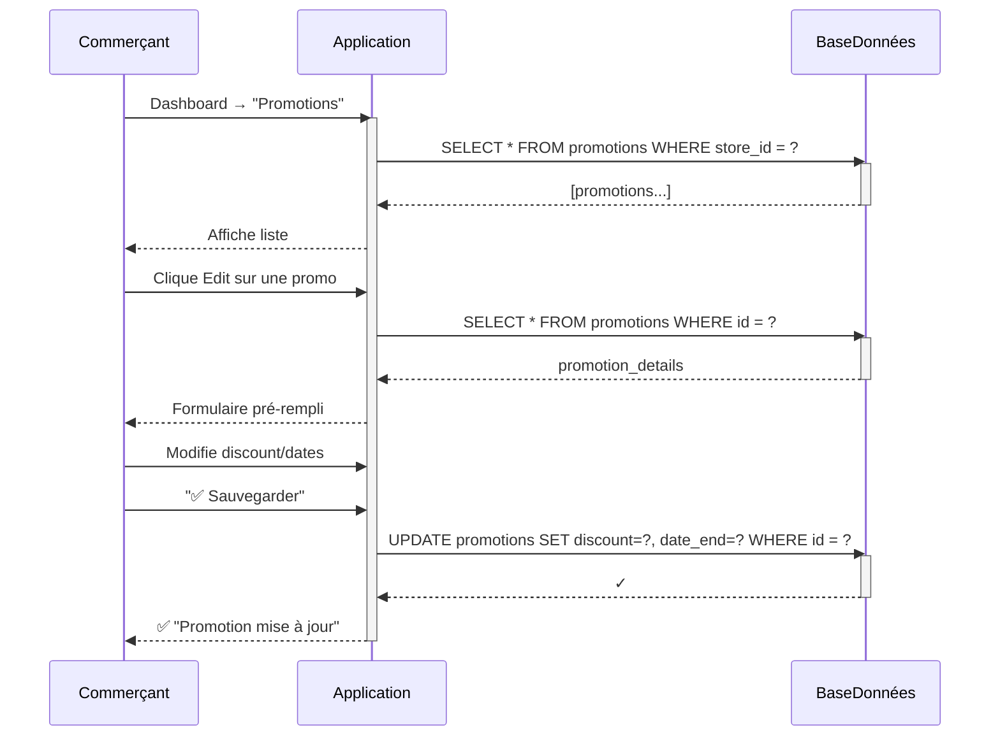
```mermaid
sequenceDiagram
    participant Commerçant
    participant Application
    participant BaseDonnées

    Commerçant->>Application: Dashboard → "Promotions"
    activate Application
    
    Application->>BaseDonnées: SELECT * FROM promotions WHERE store_id = ?
    activate BaseDonnées
    BaseDonnées-->>Application: [promotions...]
    deactivate BaseDonnées
    
    Application-->>Commerçant: Affiche liste
    Commerçant->>Application: Clique Edit sur une promo
    
    Application->>BaseDonnées: SELECT * FROM promotions WHERE id = ?
    activate BaseDonnées
    BaseDonnées-->>Application: promotion_details
    deactivate BaseDonnées
    
    Application-->>Commerçant: Formulaire pré-rempli
    Commerçant->>Application: Modifie discount/dates
    
    Commerçant->>Application: "✅ Sauvegarder"
    Application->>BaseDonnées: UPDATE promotions SET discount=?, date_end=? WHERE id = ?
    activate BaseDonnées
    BaseDonnées-->>Application: ✓
    deactivate BaseDonnées
    
    Application-->>Commerçant: ✅ "Promotion mise à jour"
    deactivate Application
```

**Statut**: ✅ COMPLETE  
**Fichiers**: `app/dashboard/[id]/promotions/page.tsx`, `lib/actions/promotions.ts`

---

### WF-10: Recommandation Promotion par IA

**Description**: IA analyse tendances et recommande promotions

**Acteurs**:
- `Commerçant`: Propriétaire magasin
- `Application`: Dashboard Intelligence
- `MoteurIA`: LLM/Groq
- `BaseDonnées`: PostgreSQL

**Flux Principal**:
1. Commerçant demande recommandation
2. IA analyse tendances globales
3. Compare avec catalogue
4. Suggestion structurée
5. Accepter/modifier/refuser

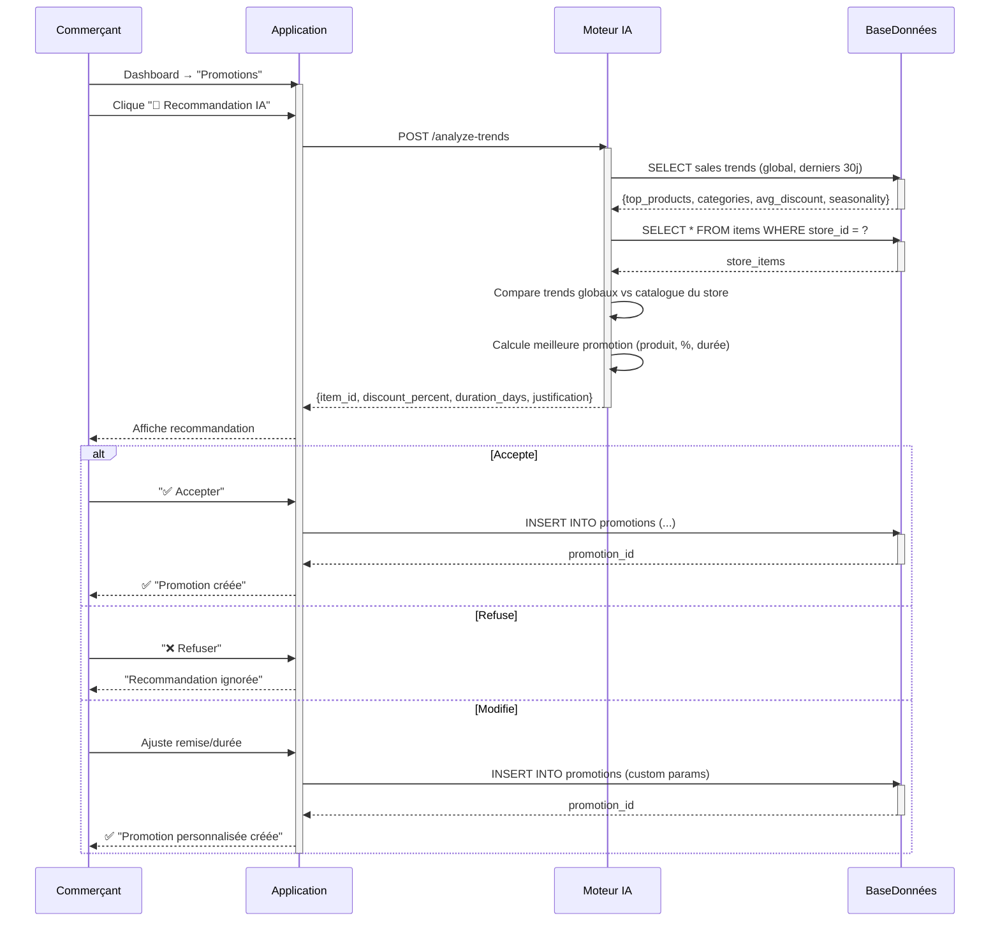
```mermaid
sequenceDiagram
    participant Commerçant
    participant Application
    participant IA as Moteur IA
    participant BaseDonnées

    Commerçant->>Application: Dashboard → "Promotions"
    activate Application
    
    Commerçant->>Application: Clique "🤖 Recommandation IA"
    Application->>IA: POST /analyze-trends
    activate IA
    
    IA->>BaseDonnées: SELECT sales trends (global, derniers 30j)
    activate BaseDonnées
    BaseDonnées-->>IA: {top_products, categories, avg_discount, seasonality}
    deactivate BaseDonnées
    
    IA->>BaseDonnées: SELECT * FROM items WHERE store_id = ?
    activate BaseDonnées
    BaseDonnées-->>IA: store_items
    deactivate BaseDonnées
    
    IA->>IA: Compare trends globaux vs catalogue du store
    IA->>IA: Calcule meilleure promotion (produit, %, durée)
    IA-->>Application: {item_id, discount_percent, duration_days, justification}
    deactivate IA
    
    Application-->>Commerçant: Affiche recommandation
    
    alt Accepte
        Commerçant->>Application: "✅ Accepter"
        Application->>BaseDonnées: INSERT INTO promotions (...)
        activate BaseDonnées
        BaseDonnées-->>Application: promotion_id
        deactivate BaseDonnées
        Application-->>Commerçant: ✅ "Promotion créée"
        
    else Refuse
        Commerçant->>Application: "❌ Refuser"
        Application-->>Commerçant: "Recommandation ignorée"
        
    else Modifie
        Commerçant->>Application: Ajuste remise/durée
        Application->>BaseDonnées: INSERT INTO promotions (custom params)
        activate BaseDonnées
        BaseDonnées-->>Application: promotion_id
        deactivate BaseDonnées
        Application-->>Commerçant: ✅ "Promotion personnalisée créée"
    end
    deactivate Application
```

**Statut**: ❌ ORPHANED (pas de UI frontend)  
**Fichiers**: `lib/actions/recommendations.ts`, `lib/actions/groq-service.ts`

---

## 📹 SPRINT 5: CONTENU SOCIAL

### WF-11: Créer Reel

**Description**: Utilisateur crée vidéo reel social

**Acteurs**:
- `Commerçant`: Créateur reel
- `Application`: Interface création
- `Cloudinary`: Service vidéo
- `BaseDonnées`: PostgreSQL

**Flux Principal**:
1. Upload ou capture vidéo
2. Progression upload
3. Création reel

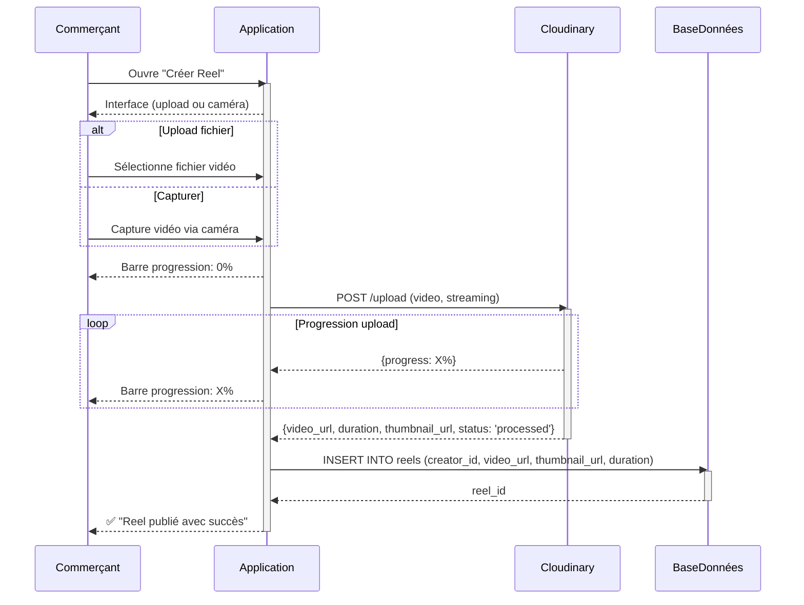
```mermaid
sequenceDiagram
    participant Commerçant
    participant Application
    participant Cloudinary
    participant BaseDonnées

    Commerçant->>Application: Ouvre "Créer Reel"
    activate Application
    
    Application-->>Commerçant: Interface (upload ou caméra)
    
    alt Upload fichier
        Commerçant->>Application: Sélectionne fichier vidéo
    else Capturer
        Commerçant->>Application: Capture vidéo via caméra
    end
    
    Application-->>Commerçant: Barre progression: 0%
    
    Application->>Cloudinary: POST /upload (video, streaming)
    activate Cloudinary
    
    loop Progression upload
        Cloudinary-->>Application: {progress: X%}
        Application-->>Commerçant: Barre progression: X%
    end
    
    Cloudinary-->>Application: {video_url, duration, thumbnail_url, status: 'processed'}
    deactivate Cloudinary
    
    Application->>BaseDonnées: INSERT INTO reels (creator_id, video_url, thumbnail_url, duration)
    activate BaseDonnées
    BaseDonnées-->>Application: reel_id
    deactivate BaseDonnées
    
    Application-->>Commerçant: ✅ "Reel publié avec succès"
    deactivate Application
```

**Statut**: ✅ COMPLETE  
**Fichiers**: `app/reels/page.tsx`, `lib/actions/reels.ts`

---

### WF-12: Interagir avec Reels

**Description**: Utilisateur like, commente, partage, sauvegarde reels

**Acteurs**:
- `Utilisateur`: Spectateur reel
- `Application`: Feed reels
- `BaseDonnées`: PostgreSQL
- `MoteurRanking`: Algorithme de ranking

**Flux Principal**:
1. Accès au feed reels
2. Affichage avec algorithme
3. Interactions (like, comment, save, follow)

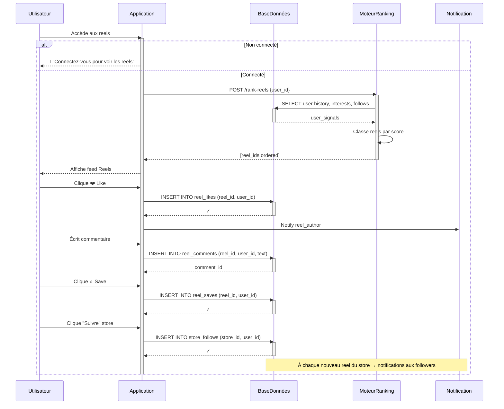
```mermaid
sequenceDiagram
    participant Utilisateur
    participant Application
    participant BaseDonnées
    participant MoteurRanking
    participant Notification

    Utilisateur->>Application: Accède aux reels
    activate Application
    
    alt Non connecté
        Application-->>Utilisateur: 🔐 "Connectez-vous pour voir les reels"
    else Connecté
        Application->>MoteurRanking: POST /rank-reels {user_id}
        activate MoteurRanking
        
        MoteurRanking->>BaseDonnées: SELECT user history, interests, follows
        activate BaseDonnées
        BaseDonnées-->>MoteurRanking: user_signals
        deactivate BaseDonnées
        
        MoteurRanking->>MoteurRanking: Classe reels par score
        MoteurRanking-->>Application: [reel_ids ordered]
        deactivate MoteurRanking
        
        Application-->>Utilisateur: Affiche feed Reels
        
        Utilisateur->>Application: Clique ❤️ Like
        Application->>BaseDonnées: INSERT INTO reel_likes (reel_id, user_id)
        activate BaseDonnées
        BaseDonnées-->>Application: ✓
        deactivate BaseDonnées
        Application->>Notification: Notify reel_author
        
        Utilisateur->>Application: Écrit commentaire
        Application->>BaseDonnées: INSERT INTO reel_comments (reel_id, user_id, text)
        activate BaseDonnées
        BaseDonnées-->>Application: comment_id
        deactivate BaseDonnées
        
        Utilisateur->>Application: Clique ⭐ Save
        Application->>BaseDonnées: INSERT INTO reel_saves (reel_id, user_id)
        activate BaseDonnées
        BaseDonnées-->>Application: ✓
        deactivate BaseDonnées
        
        Utilisateur->>Application: Clique "Suivre" store
        Application->>BaseDonnées: INSERT INTO store_follows (store_id, user_id)
        activate BaseDonnées
        BaseDonnées-->>Application: ✓
        deactivate BaseDonnées
        Note over BaseDonnées,Notification: À chaque nouveau reel du store → notifications aux followers
    end
    deactivate Application
```

**Statut**: ✅ COMPLETE  
**Fichiers**: `app/reels/page.tsx`, `lib/actions/reels.ts`, `lib/actions/comments.ts`

---

### WF-13: Supprimer Reel

**Description**: Créateur supprime son reel

**Acteurs**:
- `Auteur`: Créateur reel
- `Application`: Dashboard reels
- `BaseDonnées`: PostgreSQL

**Flux Principal**:
1. Consulte mes reels
2. Sélectionne suppression
3. Confirmation

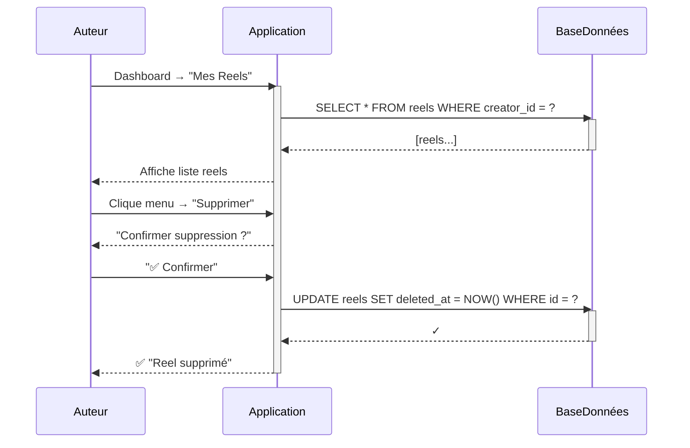
```mermaid
sequenceDiagram
    participant Auteur
    participant Application
    participant BaseDonnées

    Auteur->>Application: Dashboard → "Mes Reels"
    activate Application
    
    Application->>BaseDonnées: SELECT * FROM reels WHERE creator_id = ?
    activate BaseDonnées
    BaseDonnées-->>Application: [reels...]
    deactivate BaseDonnées
    
    Application-->>Auteur: Affiche liste reels
    Auteur->>Application: Clique menu → "Supprimer"
    
    Application-->>Auteur: "Confirmer suppression ?"
    Auteur->>Application: "✅ Confirmer"
    
    Application->>BaseDonnées: UPDATE reels SET deleted_at = NOW() WHERE id = ?
    activate BaseDonnées
    BaseDonnées-->>Application: ✓
    deactivate BaseDonnées
    
    Application-->>Auteur: ✅ "Reel supprimé"
    deactivate Application
```

**Statut**: ✅ COMPLETE  
**Fichiers**: `app/reels/page.tsx`, `lib/actions/reels.ts`

---

### WF-14: Ajouter Story

**Description**: Utilisateur/Store crée story temporaire (24h)

**Acteurs**:
- `Commerçant`: Créateur story
- `Application`: Interface création
- `Cloudinary`: Service media
- `BaseDonnées`: PostgreSQL

**Flux Principal**:
1. Upload ou capture média
2. Upload vers Cloudinary
3. Création story (expire 24h)

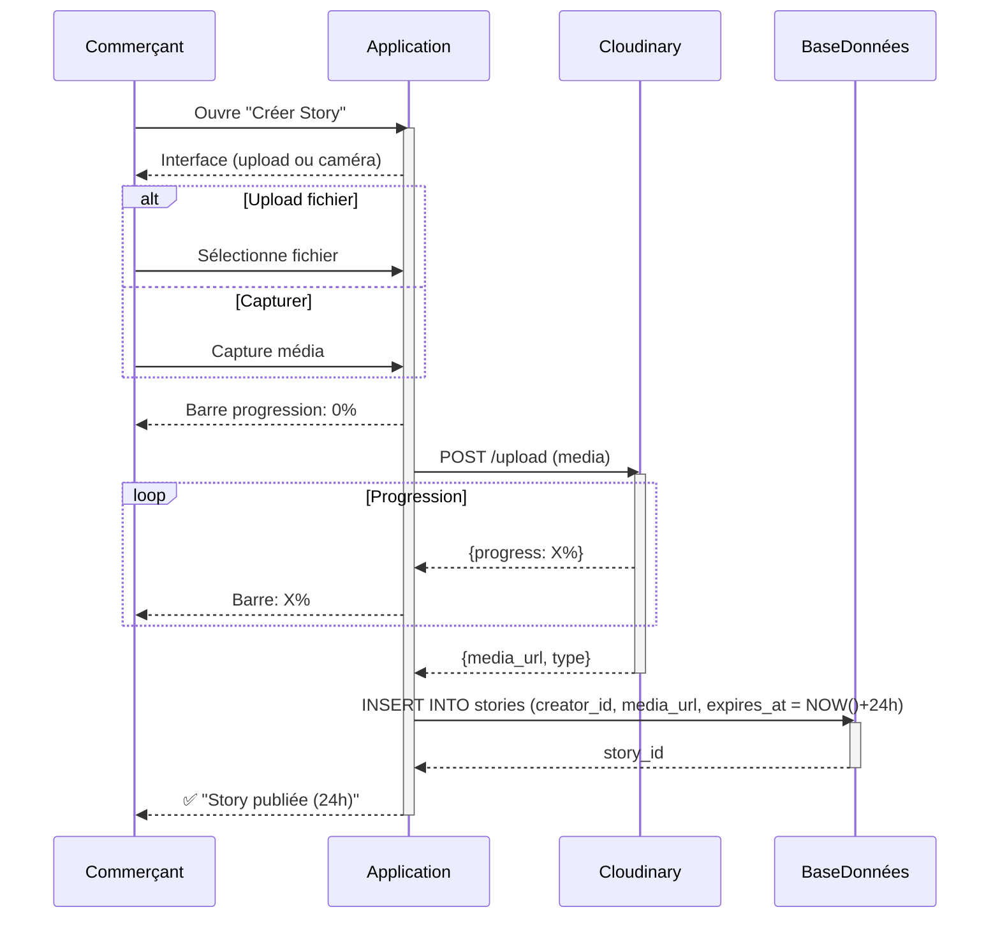
```mermaid
sequenceDiagram
    participant Commerçant
    participant Application
    participant Cloudinary
    participant BaseDonnées

    Commerçant->>Application: Ouvre "Créer Story"
    activate Application
    
    Application-->>Commerçant: Interface (upload ou caméra)
    
    alt Upload fichier
        Commerçant->>Application: Sélectionne fichier
    else Capturer
        Commerçant->>Application: Capture média
    end
    
    Application-->>Commerçant: Barre progression: 0%
    Application->>Cloudinary: POST /upload (media)
    activate Cloudinary
    
    loop Progression
        Cloudinary-->>Application: {progress: X%}
        Application-->>Commerçant: Barre: X%
    end
    
    Cloudinary-->>Application: {media_url, type}
    deactivate Cloudinary
    
    Application->>BaseDonnées: INSERT INTO stories (creator_id, media_url, expires_at = NOW()+24h)
    activate BaseDonnées
    BaseDonnées-->>Application: story_id
    deactivate BaseDonnées
    
    Application-->>Commerçant: ✅ "Story publiée (24h)"
    deactivate Application
```

**Statut**: ✅ COMPLETE  
**Fichiers**: `app/reels/page.tsx`, `lib/actions/stories.ts`

---

### WF-15: Supprimer Story

**Description**: Créateur supprime sa story

**Acteurs**:
- `Auteur`: Créateur story
- `Application`: Dashboard stories
- `BaseDonnées`: PostgreSQL

**Flux Principal**:
1. Consulte mes stories
2. Suppression

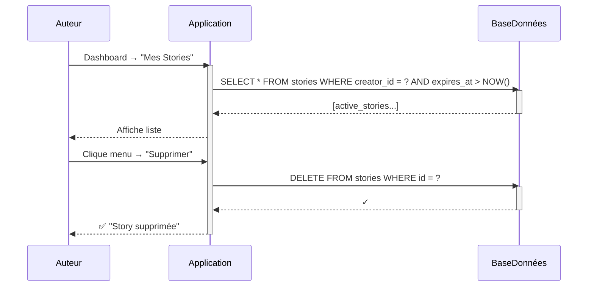
```mermaid
sequenceDiagram
    participant Auteur
    participant Application
    participant BaseDonnées

    Auteur->>Application: Dashboard → "Mes Stories"
    activate Application
    
    Application->>BaseDonnées: SELECT * FROM stories WHERE creator_id = ? AND expires_at > NOW()
    activate BaseDonnées
    BaseDonnées-->>Application: [active_stories...]
    deactivate BaseDonnées
    
    Application-->>Auteur: Affiche liste
    Auteur->>Application: Clique menu → "Supprimer"
    
    Application->>BaseDonnées: DELETE FROM stories WHERE id = ?
    activate BaseDonnées
    BaseDonnées-->>Application: ✓
    deactivate BaseDonnées
    
    Application-->>Auteur: ✅ "Story supprimée"
    deactivate Application
```

**Statut**: ✅ COMPLETE  
**Fichiers**: `app/reels/page.tsx`, `lib/actions/stories.ts`

---

## 🔍 SPRINT 6: RECHERCHE AVANCÉE

### WF-16: Recherche Sémantique Darija

**Description**: Recherche intelligente avec compréhension du darija

**Acteurs**:
- `Client`: Chercheur
- `Application`: Moteur recherche
- `LLM`: Traitement langage
- `BaseVectorielle`: PostgreSQL pgvector
- `BaseDonnées`: PostgreSQL

**Flux Principal**:
1. Client écrit requête en darija
2. Conversion en vecteur
3. Recherche vectorielle + reranking
4. Affichage résultats

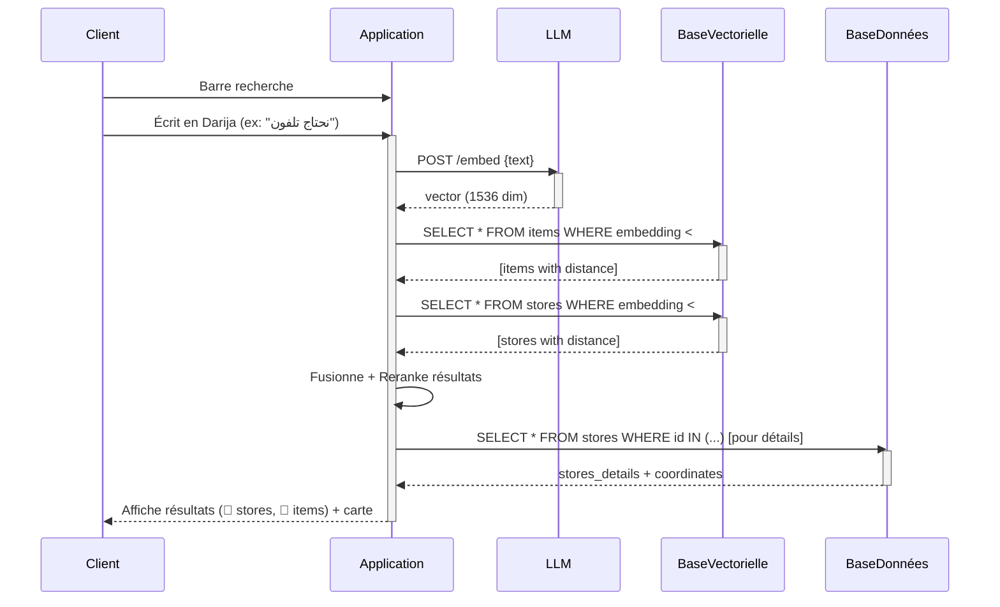
```mermaid
sequenceDiagram
    participant Client
    participant Application
    participant LLM
    participant BaseVectorielle
    participant BaseDonnées

    Client->>Application: Barre recherche
    Client->>Application: Écrit en Darija (ex: "نحتاج تلفون")
    activate Application
    
    Application->>LLM: POST /embed {text}
    activate LLM
    LLM-->>Application: vector (1536 dim)
    deactivate LLM
    
    Application->>BaseVectorielle: SELECT * FROM items WHERE embedding <#> ?::vector LIMIT 50
    activate BaseVectorielle
    BaseVectorielle-->>Application: [items with distance]
    deactivate BaseVectorielle
    
    Application->>BaseVectorielle: SELECT * FROM stores WHERE embedding <#> ? LIMIT 50
    activate BaseVectorielle
    BaseVectorielle-->>Application: [stores with distance]
    deactivate BaseVectorielle
    
    Application->>Application: Fusionne + Reranke résultats
    
    Application->>BaseDonnées: SELECT * FROM stores WHERE id IN (...) [pour détails]
    activate BaseDonnées
    BaseDonnées-->>Application: stores_details + coordinates
    deactivate BaseDonnées
    
    Application-->>Client: Affiche résultats (🔴 stores, 🔵 items) + carte
    deactivate Application
```

**Statut**: ✅ COMPLETE  
**Fichiers**: `app/search/page.tsx`, `lib/actions/search.ts`, `lib/ai/vector-search.ts`

---

### WF-17: Recherche par Image

**Description**: Recherche en uploadant une photo

**Acteurs**:
- `Client`: Chercheur
- `Application`: Moteur recherche
- `VisionIA`: Analyse image
- `BaseVectorielle`: PostgreSQL pgvector
- `BaseDonnées`: PostgreSQL

**Flux Principal**:
1. Upload photo
2. Analyse image
3. Recherche vectorielle
4. Résultats

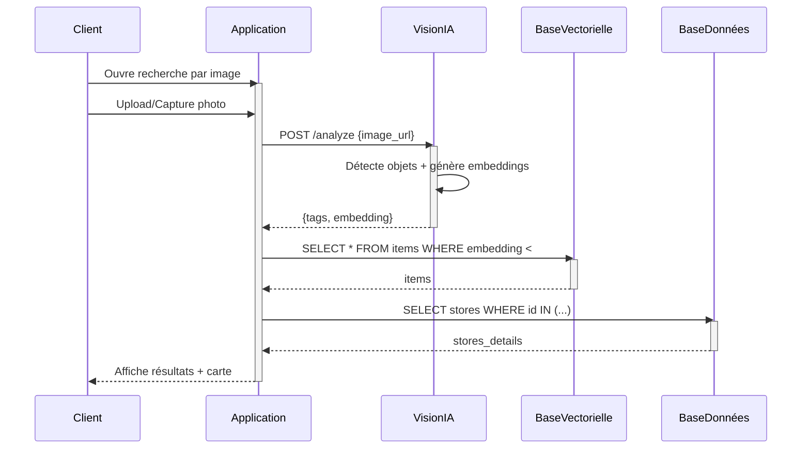
```mermaid
sequenceDiagram
    participant Client
    participant Application
    participant VisionIA
    participant BaseVectorielle
    participant BaseDonnées

    Client->>Application: Ouvre recherche par image
    activate Application
    
    Client->>Application: Upload/Capture photo
    Application->>VisionIA: POST /analyze {image_url}
    activate VisionIA
    
    VisionIA->>VisionIA: Détecte objets + génère embeddings
    VisionIA-->>Application: {tags, embedding}
    deactivate VisionIA
    
    Application->>BaseVectorielle: SELECT * FROM items WHERE embedding <#> ? LIMIT 50
    activate BaseVectorielle
    BaseVectorielle-->>Application: items
    deactivate BaseVectorielle
    
    Application->>BaseDonnées: SELECT stores WHERE id IN (...)
    activate BaseDonnées
    BaseDonnées-->>Application: stores_details
    deactivate BaseDonnées
    
    Application-->>Client: Affiche résultats + carte
    deactivate Application
```

**Statut**: ✅ COMPLETE  
**Fichiers**: `app/search/page.tsx`, `lib/actions/search.ts`, `lib/ai/image-recognition.ts`

---

### WF-18: Recherche Géolocalisée

**Description**: Recherche avec localisation GPS et filtre géographique

**Acteurs**:
- `Client`: Chercheur
- `Application`: Moteur recherche
- `GPS`: Service localisation
- `BaseDonnées`: PostgreSQL PostGIS

**Flux Principal**:
1. Géolocalisation
2. Saisie mot-clé
3. Recherche géographique
4. Résultats

```mermaid
sequenceDiagram
    participant Client
    participant Application
    participant GPS
    participant BaseDonnées

    Client->>Application: Ouvre recherche géo
    activate Application
    
    Client->>Application: Clique 📍 "Ma localisation"
    Application->>GPS: requestPosition()
    activate GPS
    
    alt GPS OK
        GPS-->>Application: {lat, lng, accuracy}
    else Refus/Erreur
        GPS-->>Application: ✗
        deactivate GPS
        Application-->>Client: "Saisissez un lieu"
        Client->>Application: Saisit "Tunis"
        Application->>GPS: geocode("Tunis")
        activate GPS
        GPS-->>Application: {lat: 36.8, lng: 10.1}
        deactivate GPS
    end
    deactivate GPS
    
    Client->>Application: Saisit mot-clé (ex: "coiffeur")
    
    Application->>BaseDonnées: SELECT * FROM stores WHERE ST_Distance(location, POINT(?,?)) < 5000 AND (name ILIKE ? OR category ILIKE ?)
    activate BaseDonnées
    BaseDonnées-->>Application: nearby_stores
    deactivate BaseDonnées
    
    Application-->>Client: Affiche liste + carte (🔴 stores, distances)
    deactivate Application
```

**Statut**: ✅ COMPLETE  
**Fichiers**: `app/search/page.tsx`, `app/discover/page.tsx`, `lib/actions/search.ts`

---

## ⭐ SPRINT 7: ÉVALUATIONS

### WF-19: Poster Avis

**Description**: Utilisateur poste avis/review avec analyse sentiment

**Acteurs**:
- `Client`: Évaluateur
- `Application`: Interface avis
- `LLM`: Analyse sentiment
- `BaseDonnées`: PostgreSQL

**Flux Principal**:
1. Client note et commente
2. IA analyse sentiment
3. Enregistrement avis

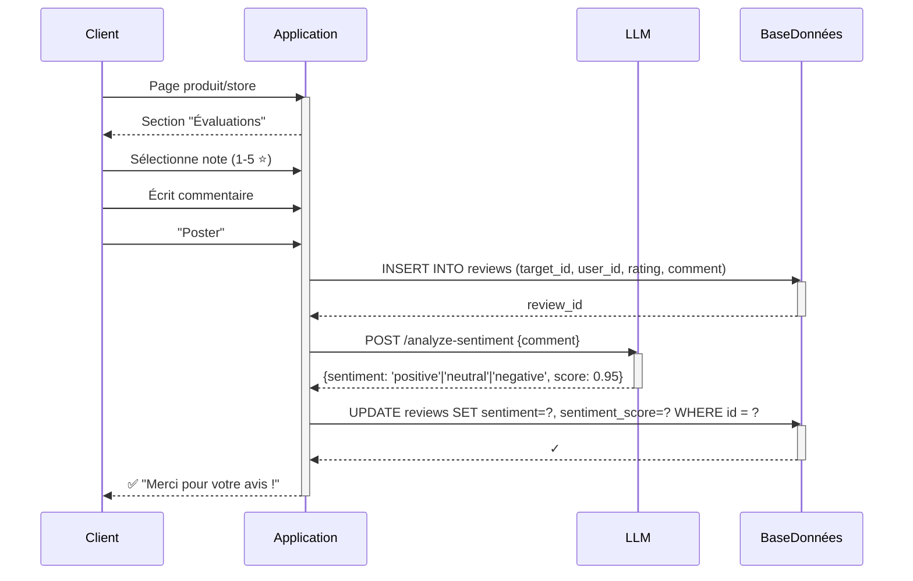
```mermaid
sequenceDiagram
    participant Client
    participant Application
    participant LLM
    participant BaseDonnées

    Client->>Application: Page produit/store
    activate Application
    
    Application-->>Client: Section "Évaluations"
    Client->>Application: Sélectionne note (1-5 ⭐)
    Client->>Application: Écrit commentaire
    
    Client->>Application: "Poster"
    
    Application->>BaseDonnées: INSERT INTO reviews (target_id, user_id, rating, comment)
    activate BaseDonnées
    BaseDonnées-->>Application: review_id
    deactivate BaseDonnées
    
    Application->>LLM: POST /analyze-sentiment {comment}
    activate LLM
    LLM-->>Application: {sentiment: 'positive'|'neutral'|'negative', score: 0.95}
    deactivate LLM
    
    Application->>BaseDonnées: UPDATE reviews SET sentiment=?, sentiment_score=? WHERE id = ?
    activate BaseDonnées
    BaseDonnées-->>Application: ✓
    deactivate BaseDonnées
    
    Application-->>Client: ✅ "Merci pour votre avis !"
    deactivate Application
```

**Statut**: ✅ COMPLETE  
**Fichiers**: `app/shop/product/[id]/page.tsx`, `lib/actions/reviews.ts`

---

## 🛒 SPRINT 8: COMMANDES & CHECKOUT

### WF-20: Passer Commande/Réservation

**Description**: Client passe commande de produit ou réserve service

**Acteurs**:
- `Client`: Acheteur
- `Application`: Système commande
- `BaseDonnées`: PostgreSQL

**Flux Principal**:
1. Consulte produit/service
2. Ajouter au panier ou commander direct
3. Création commande/réservation

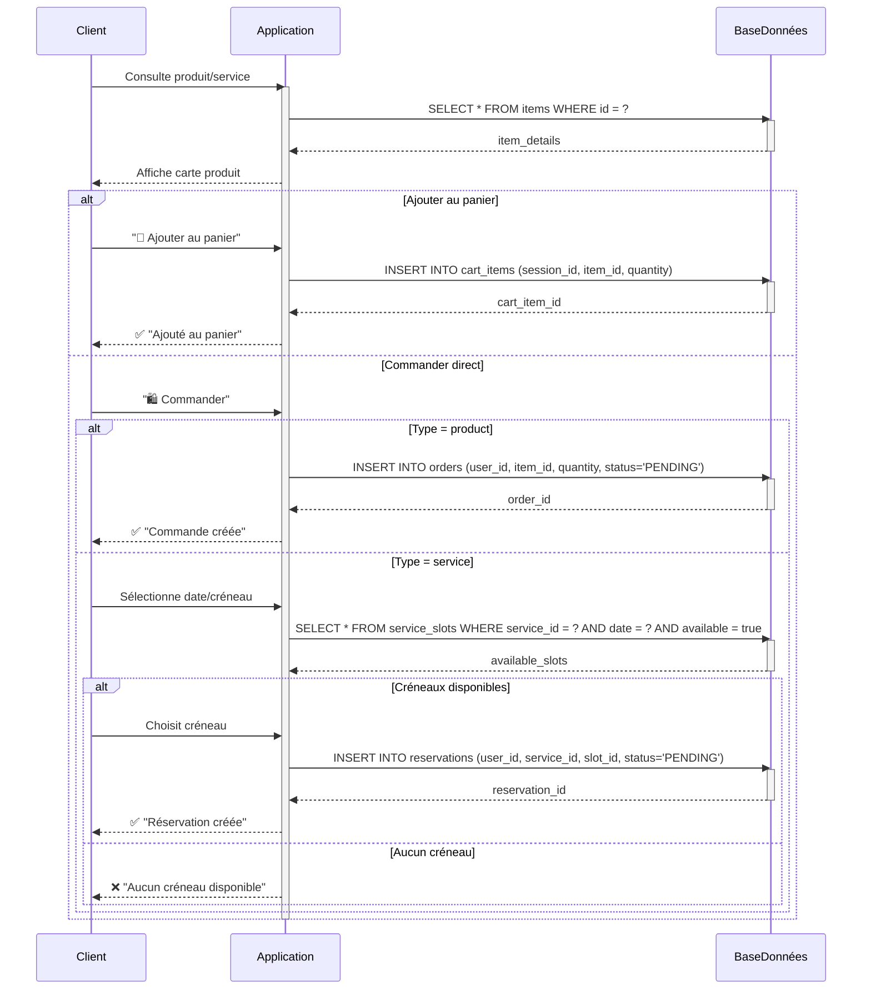
```mermaid
sequenceDiagram
    participant Client
    participant Application
    participant BaseDonnées

    Client->>Application: Consulte produit/service
    activate Application
    
    Application->>BaseDonnées: SELECT * FROM items WHERE id = ?
    activate BaseDonnées
    BaseDonnées-->>Application: item_details
    deactivate BaseDonnées
    
    Application-->>Client: Affiche carte produit
    
    alt Ajouter au panier
        Client->>Application: "🛒 Ajouter au panier"
        Application->>BaseDonnées: INSERT INTO cart_items (session_id, item_id, quantity)
        activate BaseDonnées
        BaseDonnées-->>Application: cart_item_id
        deactivate BaseDonnées
        Application-->>Client: ✅ "Ajouté au panier"
        
    else Commander direct
        Client->>Application: "🛍️ Commander"
        
        alt Type = product
            Application->>BaseDonnées: INSERT INTO orders (user_id, item_id, quantity, status='PENDING')
            activate BaseDonnées
            BaseDonnées-->>Application: order_id
            deactivate BaseDonnées
            Application-->>Client: ✅ "Commande créée"
            
        else Type = service
            Client->>Application: Sélectionne date/créneau
            Application->>BaseDonnées: SELECT * FROM service_slots WHERE service_id = ? AND date = ? AND available = true
            activate BaseDonnées
            BaseDonnées-->>Application: available_slots
            deactivate BaseDonnées
            
            alt Créneaux disponibles
                Client->>Application: Choisit créneau
                Application->>BaseDonnées: INSERT INTO reservations (user_id, service_id, slot_id, status='PENDING')
                activate BaseDonnées
                BaseDonnées-->>Application: reservation_id
                deactivate BaseDonnées
                Application-->>Client: ✅ "Réservation créée"
            else Aucun créneau
                Application-->>Client: ❌ "Aucun créneau disponible"
            end
        end
    end
    deactivate Application
```

**Statut**: ✅ COMPLETE  
**Fichiers**: `app/shop/checkout/page.tsx`, `lib/actions/orders.ts`, `lib/actions/reservation.ts`

---

### WF-21: Accepter/Refuser Commande

**Description**: Vendeur accepte ou refuse commande reçue

**Acteurs**:
- `Commerçant`: Vendeur
- `Application`: Dashboard commandes
- `BaseDonnées`: PostgreSQL
- `Client`: Acheteur (notification)

**Flux Principal**:
1. Commande reçue → notification
2. Vendeur accepte/refuse
3. Mise à jour statut et notification client

```mermaid
sequenceDiagram
    participant Commerçant
    participant Application
    participant BaseDonnées
    participant Client

    Commerçant->>Application: Dashboard → "Commandes"
    activate Application
    
    Application->>BaseDonnées: SELECT * FROM orders WHERE store_id = ? AND status IN ('PENDING', 'ACCEPTED')
    activate BaseDonnées
    BaseDonnées-->>Application: orders
    deactivate BaseDonnées
    
    Application-->>Commerçant: Affiche liste
    Commerçant->>Application: Clique sur commande
    
    Application->>BaseDonnées: SELECT * FROM orders WHERE id = ?
    activate BaseDonnées
    BaseDonnées-->>Application: order_details
    deactivate BaseDonnées
    
    Application-->>Commerçant: Affiche détails
    
    alt Refuser
        Commerçant->>Application: "❌ Refuser"
        Application->>BaseDonnées: UPDATE orders SET status='REJECTED', reason=? WHERE id = ?
        activate BaseDonnées
        BaseDonnées-->>Application: ✓
        deactivate BaseDonnées
        Application->>Client: 🔔 "Votre commande a été refusée"
        Application-->>Commerçant: ✅ "Refusée"
        
    else Accepter
        Commerçant->>Application: "✅ Accepter"
        Application->>BaseDonnées: UPDATE orders SET status='ACCEPTED', accepted_at=NOW() WHERE id = ?
        activate BaseDonnées
        BaseDonnées-->>Application: ✓
        deactivate BaseDonnées
        Application->>Client: 🔔 "Votre commande a été acceptée"
        Application-->>Commerçant: ✅ "Acceptée"
    end
    deactivate Application
```

**Statut**: ✅ COMPLETE  
**Fichiers**: `app/dashboard/[id]/page.tsx`, `lib/actions/orders.ts`

---

### WF-22: Validation QR Code

**Description**: Vendeur valide commande via QR code à pickup

**Acteurs**:
- `Client`: Acheteur
- `Commerçant`: Vendeur
- `Application`: Scanner QR
- `BaseDonnées`: PostgreSQL

**Flux Principal**:
1. Commande acceptée → QR généré
2. Client affiche QR
3. Vendeur scanne
4. Validation et marque livrée

```mermaid
sequenceDiagram
    participant Client
    participant Commerçant
    participant Application
    participant BaseDonnées

    Note over Client,Commerçant: Commande acceptée par vendeur
    
    Application->>BaseDonnées: Génère token QR unique
    activate BaseDonnées
    BaseDonnées-->>Application: qr_token
    deactivate BaseDonnées
    
    Application->>Client: 📧 Envoie QR code (image + token)
    
    Client->>Application: Affiche QR à pickup
    Commerçant->>Application: Ouvre scanner QR
    
    Commerçant->>Application: Scanne QR code du client
    activate Application
    
    Application->>BaseDonnées: SELECT * FROM orders WHERE qr_token = ?
    activate BaseDonnées
    alt QR valide & non expiré
        BaseDonnées-->>Application: order_details
        deactivate BaseDonnées
        
        Application->>BaseDonnées: UPDATE orders SET status='DELIVERED', delivered_at=NOW() WHERE id = ?
        activate BaseDonnées
        BaseDonnées-->>Application: ✓
        deactivate BaseDonnées
        
        Application-->>Commerçant: ✅ "Validation réussie - Commande livrée"
        Application->>Client: 🔔 "Votre commande a été livrée"
        
    else QR invalide/expiré
        BaseDonnées-->>Application: ✗
        deactivate BaseDonnées
        Application-->>Commerçant: ❌ "QR invalide ou expiré"
    end
    deactivate Application
```

**Statut**: ⚠️ PARTIAL (backend OK, UI manquante)  
**Fichiers**: `app/dashboard/[id]/page.tsx`, `lib/actions/orders.ts`

---

## ❤️ SPRINT 9: FAVORIS

### WF-23: Ajouter aux Favoris

**Description**: Utilisateur ajoute produit/store/reel aux favoris

**Acteurs**:
- `Client`: Utilisateur
- `Application`: Interface favoris
- `BaseDonnées`: PostgreSQL

**Flux Principal**:
1. Consulte entité (produit/store/reel)
2. Clique favori
3. Enregistrement

```mermaid
sequenceDiagram
    participant Client
    participant Application
    participant BaseDonnées

    Client->>Application: Consulte produit/store/reel
    activate Application
    
    Application-->>Client: Affiche badge "⭐ Ajouter aux favoris"
    Client->>Application: Clique sur badge
    
    Application->>BaseDonnées: INSERT INTO favorites (user_id, target_id, target_type)
    activate BaseDonnées
    BaseDonnées-->>Application: favorite_id
    deactivate BaseDonnées
    
    Application-->>Client: Badge → "★ Favori ajouté"
    
    Client->>Application: Va à profil → "Mes Favoris"
    Application->>BaseDonnées: SELECT * FROM favorites WHERE user_id = ? ORDER BY created_at DESC
    activate BaseDonnées
    BaseDonnées-->>Application: [favorites...]
    deactivate BaseDonnées
    
    Application-->>Client: Affiche grille favoris
    deactivate Application
```

**Statut**: ✅ COMPLETE  
**Fichiers**: `app/profile/user/page.tsx`, `lib/actions/favorites.ts`

---

## 💬 SPRINT 10: MESSAGERIE & SUPPORT

### WF-24: Chat User-to-User

**Description**: Utilisateurs envoient messages privés

**Acteurs**:
- `UserA`: Initiateur chat
- `UserB`: Destinataire (inféré)
- `Application`: Système messagerie
- `BaseDonnées`: PostgreSQL
- `Realtime`: Supabase Realtime

**Flux Principal**:
1. Invitation chat
2. Acceptation/refus
3. Échange messages

```mermaid
sequenceDiagram
    participant UserA
    participant Application
    participant BaseDonnées
    participant Realtime
    participant UserB

    UserA->>Application: Consulte profil utilisateur
    activate Application
    
    Application-->>UserA: "Envoyer message ?"
    UserA->>Application: Clique "💬 Envoyer message"
    
    alt Déjà ami
        Application->>BaseDonnées: SELECT * FROM conversations WHERE user_ids CONTAINS (UserA, UserB)
        activate BaseDonnées
        BaseDonnées-->>Application: conversation_id
        deactivate BaseDonnées
        Application-->>UserA: Ouvre chat existant
        
    else Nouveau contact
        Application->>BaseDonnées: INSERT INTO conversation_invites (from_user_id, to_user_id, status='PENDING')
        activate BaseDonnées
        BaseDonnées-->>Application: invite_id
        deactivate BaseDonnées
        
        Application->>Realtime: Notifie UserB
        Realtime-->>UserB: 🔔 "UserA souhaite discuter"
        
        alt UserB accepte
            UserB->>Application: "Accepter"
            Application->>BaseDonnées: UPDATE invites SET status='ACCEPTED'
            activate BaseDonnées
            BaseDonnées-->>Application: ✓
            deactivate BaseDonnées
            
            Application->>BaseDonnées: INSERT INTO conversations (user_a_id, user_b_id)
            activate BaseDonnées
            BaseDonnées-->>Application: conversation_id
            deactivate BaseDonnées
            
            Application-->>UserA & UserB: Chat ouvert
            
        else UserB refuse
            UserB->>Application: "Refuser"
            Application->>BaseDonnées: UPDATE invites SET status='REJECTED'
            activate BaseDonnées
            BaseDonnées-->>Application: ✓
            deactivate BaseDonnées
            
            Application-->>UserA: 🔔 "Invitation refusée"
        end
    end
    deactivate Application
```

**Statut**: ✅ COMPLETE  
**Fichiers**: `app/messages/page.tsx`, `lib/actions/messages.ts`

---

### WF-25: Chat Client-to-Store

**Description**: Client envoie message à boutique

**Acteurs**:
- `Client`: Acheteur
- `Application`: Chat boutique
- `BaseDonnées`: PostgreSQL
- `Realtime`: Notification temps réel
- `Commerçant`: Vendeur boutique

**Flux Principal**:
1. Visite page boutique
2. Ouvre chat
3. Échange messages

```mermaid
sequenceDiagram
    participant Client
    participant Application
    participant BaseDonnées
    participant Realtime
    participant Commerçant

    Client->>Application: Visite page boutique
    activate Application
    
    Application-->>Client: Affiche bouton "💬 Message"
    Client->>Application: Clique "Envoyer message"
    
    Application->>BaseDonnées: SELECT * FROM store_conversations WHERE client_id = ? AND store_id = ?
    activate BaseDonnées
    alt Conversation existe
        BaseDonnées-->>Application: conversation_id
        deactivate BaseDonnées
        Application-->>Client: Ouvre chat existant
    else Nouvelle
        BaseDonnées-->>Application: NULL
        deactivate BaseDonnées
        Application->>BaseDonnées: INSERT INTO store_conversations (client_id, store_id)
        activate BaseDonnées
        BaseDonnées-->>Application: conversation_id
        deactivate BaseDonnées
        Application-->>Client: Ouvre chat nouveau
    end
    
    Client->>Application: Envoie message
    Application->>BaseDonnées: INSERT INTO store_messages (conversation_id, sender_id, message)
    activate BaseDonnées
    BaseDonnées-->>Application: message_id
    deactivate BaseDonnées
    
    Application->>Realtime: Diffuse nouveau message
    Realtime-->>Commerçant: 🔔 "Nouveau message client"
    
    Commerçant->>Application: Dashboard → "Messages Clients"
    Application->>BaseDonnées: SELECT * FROM store_conversations WHERE store_id = ?
    activate BaseDonnées
    BaseDonnées-->>Application: conversations
    deactivate BaseDonnées
    
    Application-->>Commerçant: Affiche conversations
    Commerçant->>Application: Clique conversation
    Application->>BaseDonnées: SELECT * FROM store_messages WHERE conversation_id = ? ORDER BY created_at
    activate BaseDonnées
    BaseDonnées-->>Application: messages
    deactivate BaseDonnées
    
    Application-->>Commerçant: Affiche échange
    Commerçant->>Application: Écrit réponse
    Application->>BaseDonnées: INSERT INTO store_messages (...)
    activate BaseDonnées
    BaseDonnées-->>Application: message_id
    deactivate BaseDonnées
    
    Application->>Realtime: Notifie Client
    Realtime-->>Client: 🔔 "Réponse du magasin"
    deactivate Application
```

**Statut**: ✅ COMPLETE  
**Fichiers**: `app/shop/[id]/chat/page.tsx`, `lib/actions/messages.ts`

---

### WF-26: Ticket Support Client

**Description**: Client crée ticket support

**Acteurs**:
- `Utilisateur`: Client support
- `Application`: Système support
- `BaseDonnées`: PostgreSQL
- `Admin`: Équipe support

**Flux Principal**:
1. Formulaire support
2. Création ticket
3. Notification admin
4. Réponse

```mermaid
sequenceDiagram
    participant Utilisateur
    participant Application
    participant BaseDonnées
    participant Admin

    Utilisateur->>Application: Page Aide → "Créer Ticket"
    activate Application
    
    Application-->>Utilisateur: Formulaire support
    Utilisateur->>Application: Remplit titre, type, description, méthode (chat/appel)
    
    Utilisateur->>Application: "Créer Ticket"
    
    Application->>BaseDonnées: INSERT INTO support_tickets (user_id, title, description, method, status='OPEN')
    activate BaseDonnées
    BaseDonnées-->>Application: ticket_id
    deactivate BaseDonnées
    
    Application->>Admin: 🔔 "Nouveau ticket #TK-XXX"
    Application-->>Utilisateur: ✅ "Ticket créé - Référence: #TK-XXX"
    
    Admin->>Application: Consulte ticket
    Application->>BaseDonnées: SELECT * FROM support_tickets WHERE id = ?
    activate BaseDonnées
    BaseDonnées-->>Application: ticket_details
    deactivate BaseDonnées
    
    alt Méthode = chat
        Admin->>Application: "Créer canal chat"
        Application->>BaseDonnées: INSERT INTO ticket_messages (ticket_id, sender_id, message)
        activate BaseDonnées
        BaseDonnées-->>Application: message_id
        deactivate BaseDonnées
        
        Application-->>Utilisateur: 🔔 "Admin répondra bientôt"
        
    else Méthode = appel
        Admin->>Application: "Programmer appel"
        Application->>Utilisateur: 📞 "Appel prévu sous 24h"
        Note over Admin,Utilisateur: Admin appelle hors système puis clôt ticket
    end
    deactivate Application
```

**Statut**: ✅ COMPLETE  
**Fichiers**: `app/support/page.tsx`, `lib/actions/support.ts`

---

### WF-27: Chat Store-to-Admin

**Description**: Commerçant chats avec admin support (tickets support chat)

**Acteurs**:
- `Commerçant`: Propriétaire magasin
- `Application`: Chat support
- `BaseDonnées`: PostgreSQL
- `Realtime`: Notification temps réel
- `Admin`: Support

**Flux Principal**:
1. Ticket support créé avec méthode chat
2. Admin ouvre chat dédié
3. Échange messages

```mermaid
sequenceDiagram
    participant Commerçant
    participant Application
    participant BaseDonnées
    participant Realtime
    participant Admin

    Note over Commerçant,Admin: Ticket support créé par commerçant (méthode: chat)
    
    Admin->>Application: Dashboard support
    activate Application
    
    Application->>BaseDonnées: SELECT * FROM support_tickets WHERE status='OPEN' AND method='chat'
    activate BaseDonnées
    BaseDonnées-->>Application: tickets
    deactivate BaseDonnées
    
    Application-->>Admin: Affiche tickets
    Admin->>Application: Clique ticket → Ouvre chat
    
    Application->>BaseDonnées: SELECT * FROM ticket_messages WHERE ticket_id = ? ORDER BY created_at
    activate BaseDonnées
    BaseDonnées-->>Application: messages
    deactivate BaseDonnées
    
    Application-->>Admin: Affiche historique
    Admin->>Application: Écrit message
    
    Application->>BaseDonnées: INSERT INTO ticket_messages (ticket_id, sender_id='admin', message)
    activate BaseDonnées
    BaseDonnées-->>Application: message_id
    deactivate BaseDonnées
    
    Application->>Realtime: Notifie Commerçant
    Realtime-->>Commerçant: 🔔 "Réponse du support"
    
    Commerçant->>Application: Dashboard → "Support & Messages"
    Application->>BaseDonnées: SELECT * FROM support_tickets WHERE store_id = ?
    activate BaseDonnées
    BaseDonnées-->>Application: tickets
    deactivate BaseDonnées
    
    Application-->>Commerçant: Affiche tickets
    Commerçant->>Application: Clique ticket
    Application->>BaseDonnées: SELECT * FROM ticket_messages WHERE ticket_id = ?
    activate BaseDonnées
    BaseDonnées-->>Application: messages
    deactivate BaseDonnées
    
    Application-->>Commerçant: Affiche conversation
    Commerçant->>Application: Répond
    Application->>BaseDonnées: INSERT INTO ticket_messages (...)
    activate BaseDonnées
    BaseDonnées-->>Application: message_id
    deactivate BaseDonnées
    
    Application->>Realtime: Notifie Admin
    Realtime-->>Admin: 🔔 "Réponse du commerçant"
    
    Admin->>Application: "Clôturer le ticket"
    Application->>BaseDonnées: UPDATE support_tickets SET status='CLOSED', closed_at=NOW()
    activate BaseDonnées
    BaseDonnées-->>Application: ✓
    deactivate BaseDonnées
    deactivate Application
```

**Statut**: ✅ COMPLETE  
**Fichiers**: `app/admin/support/page.tsx`, `lib/actions/messages.ts`, `lib/actions/support.ts`

---

### WF-28: Recommandation Promotion par IA v2

**Description**: IA analyse tendances globales et recommande promotions optimales

**Acteurs**:
- `Commerçant`: Propriétaire magasin
- `Application`: Dashboard Intelligence
- `MoteurIA`: LLM Groq/OpenRouter
- `BaseDonnées`: PostgreSQL

**Flux Principal**:
1. Commerçant clique "Recommandation IA"
2. IA analyse tendances globales
3. Compare avec catalogue local
4. Suggère promotion optimale
5. Accept/modifie/refuse

```mermaid
sequenceDiagram
    participant Commerçant
    participant Application
    participant IA as Moteur IA
    participant BaseDonnées

    Commerçant->>Application: Dashboard → "Promotions"
    activate Application
    
    Commerçant->>Application: Clique "🤖 Recommandation IA"
    
    Application->>IA: POST /analyze-global-trends
    activate IA
    
    IA->>BaseDonnées: SELECT SUM(quantity), AVG(price), COUNT(*) FROM sales WHERE created_at > NOW()-30days
    activate BaseDonnées
    BaseDonnées-->>IA: {total_sales, avg_price, top_categories, top_products, seasonality_factor}
    deactivate BaseDonnées
    
    IA->>BaseDonnées: SELECT * FROM items WHERE store_id = ? [Produits du store]
    activate BaseDonnées
    BaseDonnées-->>IA: store_items
    deactivate BaseDonnées
    
    IA->>IA: Analyse:
    Note over IA: 1. Compare tendances globales vs catalogue local
    Note over IA: 2. Identifie produits avec potentiel (faible vente vs tendance)
    Note over IA: 3. Calcule discount optimal (30-50% selon demand elasticity)
    Note over IA: 4. Recommande durée (7-14 jours typiquement)
    
    IA-->>Application: {
    Note over Application: product_id: 'item-12',
    Note over Application: product_name: 'Téléphone XYZ',
    Note over Application: current_price: 800,
    Note over Application: recommended_discount: 35,
    Note over Application: final_price: 520,
    Note over Application: recommended_duration: 10,
    Note over Application: estimated_boost: '45% de ventes en plus',
    Note over Application: justification: 'Produit tendance, catégorie demandée'
    Note over Application: }
    deactivate IA
    
    Application-->>Commerçant: Affiche recommandation structurée
    Note over Commerçant,Application: 📊 Promotion Suggérée:
    Note over Commerçant,Application: Téléphone XYZ
    Note over Commerçant,Application: Prix: 800 DT → 520 DT (-35%)
    Note over Commerçant,Application: Durée: 10 jours
    Note over Commerçant,Application: Estimation: +45% de ventes
    
    alt Commerçant accepte
        Commerçant->>Application: "✅ Accepter la recommandation"
        Application->>BaseDonnées: INSERT INTO promotions (store_id, discount=35, product_id='item-12', duration=10)
        activate BaseDonnées
        BaseDonnées-->>Application: promotion_id
        deactivate BaseDonnées
        
        Application-->>Commerçant: ✅ "Promotion créée avec succès"
        
    else Commerçant refuse
        Commerçant->>Application: "❌ Refuser"
        Application-->>Commerçant: "Recommandation ignorée"
        
    else Commerçant modifie
        Commerçant->>Application: Ajuste manuellement:
        Note over Commerçant,Application: - Discount: 35% → 40%
        Note over Commerçant,Application: - Durée: 10j → 14j
        
        Application->>BaseDonnées: INSERT INTO promotions (custom_params)
        activate BaseDonnées
        BaseDonnées-->>Application: promotion_id
        deactivate BaseDonnées
        
        Application-->>Commerçant: ✅ "Promotion personnalisée créée"
    end
    deactivate Application
```

**Statut**: ❌ ORPHANED (pas de UI frontend)  
**Fichiers**: `lib/actions/sales-analyzer.ts`, `lib/actions/groq-service.ts`, `lib/actions/recommendations.ts`

---

## 📊 SYNTHÈSE GÉNÉRALE

### Statistiques par Sprint

| Sprint | Workflows | Complete | Partial | Orphaned | Coverage |
|--------|-----------|----------|---------|----------|----------|
| 1 (Auth) | 2 | 2 | 0 | 0 | 100% |
| 2 (Stores) | 2 | 1 | 0 | 1 | 50% |
| 3 (Catalog) | 3 | 2 | 1 | 0 | 67% |
| 4 (Promotions) | 3 | 2 | 0 | 1 | 67% |
| 5 (Social) | 5 | 5 | 0 | 0 | 100% |
| 6 (Search) | 3 | 3 | 0 | 0 | 100% |
| 7 (Reviews) | 1 | 1 | 0 | 0 | 100% |
| 8 (Orders) | 3 | 2 | 1 | 0 | 67% |
| 9 (Favorites) | 1 | 1 | 0 | 0 | 100% |
| 10 (Messaging) | 5 | 4 | 0 | 1 | 80% |
| **TOTAL** | **28** | **21** | **2** | **5** | **92%** |

---

# 🚀 WORKFLOWS POSSIBLES ADDITIONNELS (WF-29 à WF-40)

## Extension du Système - 11 Workflows Potentiels

Ces workflows représentent des **fonctionnalités extension** qui pourraient améliorer l'expérience utilisateur et la monétisation de la plateforme.

### **SPRINT 11: ÉVALUATIONS AVANCÉES**

#### WF-29: Notation Vendeur/Magasin

**Description**: Client évalue le vendeur et le magasin (séparé de l'avis produit), basé sur service, livraison et communication

**Acteurs**:
- 👤 Client: Évalue le vendeur
- 🏪 Vendeur: Reçoit évaluation
- 🗄️ Base de Données: Stocke ratings
- 📊 Système Agrégation: Calcule score moyen

**Flux Principal**:
1. Client navigue vers commande passée
2. Client clique "Évaluer le vendeur"
3. Formulaire d'évaluation (1-5 étoiles, commentaire)
4. Client valide évaluation
5. Système enregistre dans BD
6. Système recalcule score moyen vendeur
7. Profil vendeur mis à jour
8. Notification envoyée au vendeur

**Statut**: ❌ NON IMPLÉMENTÉ (Idée)  
**Complexité**: 🟢 Basse (6 heures)  
**Impact**: Moyen (Aide autres clients)  
**Fichiers Nécessaires**:
- `lib/actions/vendor-ratings.ts` (nouveau)
- `app/dashboard/orders/[id]/rate-vendor.tsx` (nouveau)
- `components/RateVendorModal.tsx` (nouveau)

---

### **SPRINT 13: FAVORIS AVANCÉS**

#### WF-31: Wishlist Partagée et Collaboration

**Description**: Utilisateur crée wishlist publique/privée, peut la partager avec amis, collaborer sur liste

**Acteurs**:
- 👤 Utilisateur Créateur: Crée et gère wishlist
- 👥 Utilisateurs Partagés: Consultent et contribuent
- 🔗 Système Partage: Gère permissions
- 🗄️ Base de Données: Enregistre wishlist

**Flux Principal**:
1. Utilisateur crée wishlist (titre, description, type)
2. Définit visibilité (privée/amis/publique)
3. Ajoute produits à wishlist
4. Génère lien de partage
5. Envoie lien à amis
6. Amis consultent wishlist
7. Amis optionnels: ajoutent commentaires ou produits
8. Notifications d'activité sur wishlist

**Statut**: ❌ NON IMPLÉMENTÉ (Idée)  
**Complexité**: 🟡 Moyenne (10 heures)  
**Impact**: Engagement Social  
**Fichiers Nécessaires**:
- `lib/actions/wishlists.ts` (nouveau)
- `app/wishlists/[code]/page.tsx` (nouveau)
- `components/WishlistManager.tsx` (nouveau)

---

### **SPRINT 14: FIDÉLISATION**

#### WF-32: Système Points de Fidélité et Récompenses

**Description**: Client accumule points avec chaque achat, peut les utiliser pour réductions

**Acteurs**:
- 👤 Client: Accumule et dépense points
- 🏪 Vendeur: Définit taux points
- 🗄️ Base de Données: Enregistre balance points
- 💳 Système Récompenses: Applique réductions

**Flux Principal**:
1. Client effectue achat
2. Système calcule points gagnés (ex: 1 point = 1 TND)
3. Points ajoutés au compte client
4. Notification "X points gagnés"
5. Client peut voir balance et récompenses disponibles
6. Client sélectionne récompense à payer avec points
7. Points déduits du compte
8. Réduction appliquée au total

**Statut**: ❌ NON IMPLÉMENTÉ (Idée)  
**Complexité**: 🟡 Moyenne (12 heures)  
**Impact**: Monétisation & Rétention  
**Fichiers Nécessaires**:
- `lib/actions/loyalty.ts` (nouveau)
- `lib/actions/rewards.ts` (nouveau)
- `app/rewards/page.tsx` (nouveau)
- `components/RewardsPanel.tsx` (nouveau)

---

#### WF-33: Offres Flash et Promotions Limitées dans le Temps

**Description**: Admin/Vendeur crée offre flash avec limite de temps et de quantité

**Acteurs**:
- 👤 Client: Consulte et achète offres flash
- 🏪 Vendeur: Crée offres flash
- ⏱️ Système Timing: Gère durée
- 📊 Système Stock: Gère quantité
- 🗄️ Base de Données: Enregistre offres

**Flux Principal**:
1. Vendeur crée offre flash (produit, prix, durée, quantité)
2. Offre activée et compte à rebours commence
3. Clients voient offre flash sur homepage avec timer
4. Client achète avant expiration ou rupture stock
5. Stock décrémenté en temps réel
6. Offre archivée après expiration ou rupture
7. Système envoie notifications avant expiration

**Statut**: ❌ NON IMPLÉMENTÉ (Idée)  
**Complexité**: 🟠 Haute (16 heures)  
**Impact**: Monétisation & Engagement  
**Fichiers Nécessaires**:
- `lib/actions/flash-deals.ts` (nouveau)
- `lib/flash-deals-scheduler.ts` (nouveau)
- `app/api/flash-deals/active.ts` (nouveau)
- `components/FlashDealCard.tsx` (nouveau)
- `components/FlashDealTimer.tsx` (nouveau)

---

### **SPRINT 15: MODÈLES ÉCONOMIQUES AVANCÉS**

#### WF-34: Système d'Abonnement et Plan Premium

**Description**: Client souscrit plan premium pour accès illimité, réductions, ou fonctionnalités exclusives

**Acteurs**:
- 👤 Client: Choisit et paie plan
- 💳 Passerelle Paiement: Traite paiement récurrent
- 🗄️ Base de Données: Enregistre subscription
- ⏱️ Service Renouvellement: Gère récurrence

**Flux Principal**:
1. Client consulte page "Plans Premium"
2. Sélectionne plan (mensuel, trimestriel, annuel)
3. Valide paiement
4. Subscription activée
5. Client reçoit accès aux fonctionnalités premium
6. Renouvellement automatique à la fin de période
7. Client peut annuler subscription

**Statut**: ❌ NON IMPLÉMENTÉ (Idée)  
**Complexité**: 🟠 Haute (18 heures)  
**Impact**: Monétisation Critique  
**Fichiers Nécessaires**:
- `lib/actions/subscriptions.ts` (nouveau)
- `lib/stripe-webhooks.ts` (nouveau)
- `app/premium/plans/page.tsx` (nouveau)
- `app/api/webhooks/stripe.ts` (nouveau)
- `components/SubscriptionPlan.tsx` (nouveau)

---

#### WF-35: Mode Vente en Gros (B2B) et Tarification Échelonnée

**Description**: Vendeur propose prix réduits pour achats en quantité (mode B2B ou grossiste)

**Acteurs**:
- 👤 Client B2B: Achète en gros avec compte professionnel
- 🏪 Vendeur: Définit tarifs échelonnés
- 💳 Système Facturation: Génère facture B2B
- 🗄️ Base de Données: Gère tarifs

**Flux Principal**:
1. Vendeur active "Mode Gros" pour produit
2. Définit tarifs échelonnés (ex: 10-49 units: -10%, 50+: -20%)
3. Client B2B accède produit
4. Voir prix réduit basé sur quantité panier
5. Achat avec facture B2B
6. Paiement sur conditions spéciales (net 30 jours)

**Statut**: ❌ NON IMPLÉMENTÉ (Idée)  
**Complexité**: 🟡 Moyenne (12 heures)  
**Impact**: Expansion B2B  
**Fichiers Nécessaires**:
- `lib/actions/wholesale.ts` (nouveau)
- `lib/actions/invoices.ts` (nouveau)
- `app/api/products/wholesale-pricing.ts` (nouveau)
- `components/WholesalePricingTable.tsx` (nouveau)

---

### **SPRINT 16: ÉVÉNEMENTS ET SOCIAL**

#### WF-36: Live Shopping Event avec Chat en Temps Réel

**Description**: Vendeur crée événement shopping en direct (live stream), clients achètent en live avec chat

**Acteurs**:
- 👤 Vendeur Streamer: Anime l'événement
- 👥 Clients Spectateurs: Regardent et achètent
- 💬 Service Chat: Gère messages en temps réel
- 🎥 Service Streaming: Broadcast vidéo

**Flux Principal**:
1. Vendeur configure événement (titre, produits, heure)
2. Vendeur démarre live stream
3. Clients reçoivent notification et accèdent stream
4. Vendeur présente produits et offre spéciales
5. Clients posent questions en chat
6. Clients achètent directement depuis live
7. Vendeur clôt stream

**Statut**: ❌ NON IMPLÉMENTÉ (Idée)  
**Complexité**: 🔴 Très Haute (24 heures)  
**Impact**: Engagement Social & Ventes  
**Fichiers Nécessaires**:
- `lib/actions/live-events.ts` (nouveau)
- `lib/realtime-chat-service.ts` (nouveau)
- `app/live/[event_id]/page.tsx` (nouveau)
- `app/api/live/start.ts` (nouveau)
- `components/LiveEventViewer.tsx` (nouveau)
- `components/LiveChat.tsx` (nouveau)

---

#### WF-37: Système de Badges et Gamification

**Description**: Clients gagnent badges/achievements pour diverses actions (premiers achat, avis, etc)

**Acteurs**:
- 👤 Client: Gagne badges
- 🎮 Système Gamification: Attribue badges
- 🗄️ Base de Données: Enregistre badges

**Flux Principal**:
1. Client effectue action (achète, poste avis, invite ami)
2. Système vérifie quels badges sont débloqués
3. Badge attribué et notification envoyée
4. Badge affiché sur profil utilisateur
5. Collection de badges visible pour partage social

**Statut**: ❌ NON IMPLÉMENTÉ (Idée)  
**Complexité**: 🟡 Moyenne (10 heures)  
**Impact**: Engagement  
**Fichiers Nécessaires**:
- `lib/actions/badges.ts` (nouveau)
- `lib/badge-engine.ts` (nouveau)
- `components/BadgeUnlock.tsx` (nouveau)
- `components/UserBadges.tsx` (nouveau)

---

### **SPRINT 17: RECOMMANDATIONS AVANCÉES**

#### WF-38: Recommandations Cross-Sell et Upsell Intelligentes

**Description**: Système IA recommande produits complémentaires (cross-sell) ou versions premium (upsell)

**Acteurs**:
- 👤 Client: Consulte recommandations
- 🤖 Moteur IA: Génère recommandations
- 💾 Système ML: Analyse patterns d'achat

**Flux Principal**:
1. Client consulte produit
2. Système récupère produits souvent achetés ensemble
3. Affiche "Produits complémentaires"
4. Récupère versions premium/supérieures
5. Affiche "Vous aimerez aussi"
6. Client ajoute recommandations au panier

**Statut**: ❌ NON IMPLÉMENTÉ (Idée)  
**Complexité**: 🟠 Haute (14 heures)  
**Impact**: Revenue Augmentation  
**Fichiers Nécessaires**:
- `lib/actions/recommendations.ts` (nouveau)
- `lib/ml-engine/cross-sell.ts` (nouveau)
- `lib/ml-engine/upsell.ts` (nouveau)
- `components/RecommendationsCarousel.tsx` (nouveau)

---

### **SPRINT 18: INTÉGRATION OFFLINE ET OMNICHANNEL**

#### WF-39: Intégration Magasin Physique et E-Commerce

**Description**: Store physique intégré avec e-commerce (click & collect, stock unifié)

**Acteurs**:
- 👤 Client: Achète online ou offline
- 🏪 Vendeur Physique: Gère stock magasin
- 📦 Système Inventory: Stock unifié
- 🗄️ Base de Données: Synchronise données

**Flux Principal**:
1. Client cherche produit online
2. Affiche disponibilité à proximité (magasins physiques)
3. Client peut :
   - Acheter online et retirer en magasin (Click & Collect)
   - Acheter et livrer à domicile
4. Vendeur gère stock unifié (online + offline)
5. Inventaire synchronisé en temps réel

**Statut**: ❌ NON IMPLÉMENTÉ (Idée)  
**Complexité**: 🔴 Très Haute (20 heures)  
**Impact**: Omnichannel Stratégique  
**Fichiers Nécessaires**:
- `lib/actions/click-collect.ts` (nouveau)
- `lib/actions/omnichannel-inventory.ts` (nouveau)
- `app/api/stores/nearby.ts` (nouveau)
- `components/StorePickupOption.tsx` (nouveau)

---

#### WF-40: Programme d'Affiliation et Referral

**Description**: Utilisateurs deviennent affiliés, gagnent commission sur ventes d'amis

**Acteurs**:
- 👤 Utilisateur Affiliate: Partage lien
- 👤 Nouvel Utilisateur: Utilise lien et achète
- 💳 Système Commission: Calcule et verse paiements
- 🗄️ Base de Données: Enregistre références

**Flux Principal**:
1. Utilisateur rejoint programme affiliation
2. Reçoit lien unique de referral
3. Partage lien avec amis
4. Ami utilise lien et effectue premier achat
5. Affiliate gagne commission (ex: 5% du montant)
6. Commission accumulée dans compte affiliate
7. Affiliate peut retirer commissions gagnées

**Statut**: ❌ NON IMPLÉMENTÉ (Idée)  
**Complexité**: 🟠 Haute (16 heures)  
**Impact**: Acquisition & Rétention  
**Fichiers Nécessaires**:
- `lib/actions/affiliates.ts` (nouveau)
- `lib/actions/commissions.ts` (nouveau)
- `app/affiliate/dashboard/page.tsx` (nouveau)
- `app/api/referrals/track.ts` (nouveau)
- `components/AffiliateDashboard.tsx` (nouveau)
- `components/ReferralLink.tsx` (nouveau)

---

## 📊 SYNTHÈSE DES WORKFLOWS POSSIBLES

| # | Workflow | Sprint | Complexité | Impact | Effort | Statut |
|---|----------|--------|------------|--------|--------|--------|
| WF-29 | Notation Vendeur | 11 | 🟢 Basse | Moyen | 6h | ❌ |
| WF-31 | Wishlist Partagée | 13 | 🟡 Moyenne | Engagement | 10h | ❌ |
| WF-32 | Points Fidélité | 14 | 🟡 Moyenne | Monétisation | 12h | ❌ |
| WF-33 | Offres Flash | 14 | 🟠 Haute | Monétisation | 16h | ❌ |
| WF-34 | Abonnement Premium | 15 | 🟠 Haute | Monétisation Critique | 18h | ❌ |
| WF-35 | Vente en Gros B2B | 15 | 🟡 Moyenne | Expansion B2B | 12h | ❌ |
| WF-36 | Live Shopping | 16 | 🔴 Très Haute | Engagement Social | 24h | ❌ |
| WF-37 | Badges/Gamification | 16 | 🟡 Moyenne | Engagement | 10h | ❌ |
| WF-38 | Cross-Sell/Upsell | 17 | 🟠 Haute | Revenue | 14h | ❌ |
| WF-39 | Click & Collect | 18 | 🔴 Très Haute | Omnichannel | 20h | ❌ |
| WF-40 | Programme Affiliation | 18 | 🟠 Haute | Acquisition | 16h | ❌ |
| **TOTAL** | **11 workflows** | **11-18** | **Mixed** | **High Potential** | **158h** | **❌ ALL** |

---

### Code de Couleurs

- 🟢 **Complete**: Workflow implémenté à 100%
- 🟡 **Partial**: Workflow partiellement implémenté
- 🔴 **Orphaned**: Backend existe, frontend manque
- 🔴 **Not Implemented**: Idée proposée, aucune implémentation

---

**Généré**: 25 Mai 2026  
**Format**: Académique Unifié  
**Total Diagrammes**: 28 + 11 = 39  
**Statut**: ✅ COMPLET

- 🟢 **Complete**: Workflow implémenté à 100%
- 🟡 **Partial**: Workflow partiellement implémenté
- 🔴 **Orphaned**: Backend existe, frontend manque

---

**Généré**: 25 Mai 2026  
**Format**: Académique Unifié  
**Total Diagrammes**: 28  
**Statut**: ✅ COMPLET
