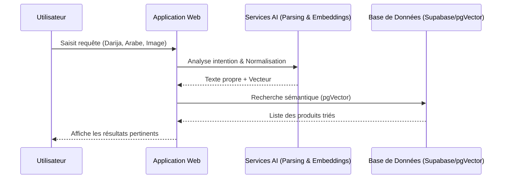
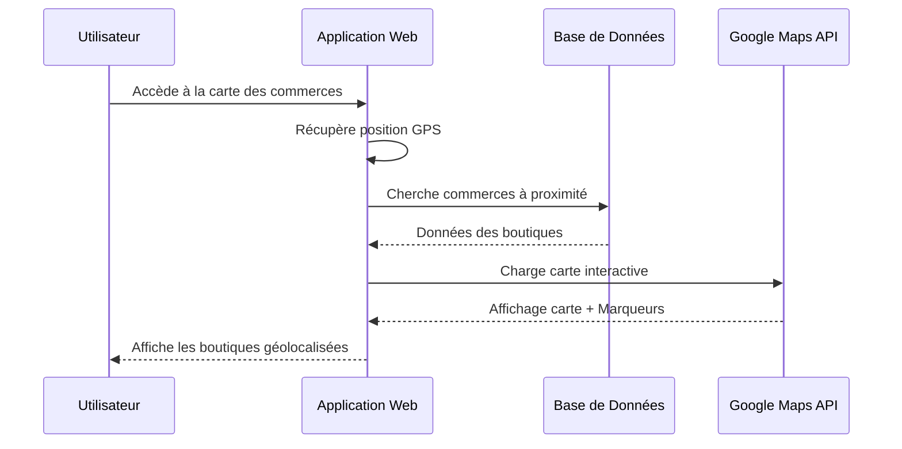
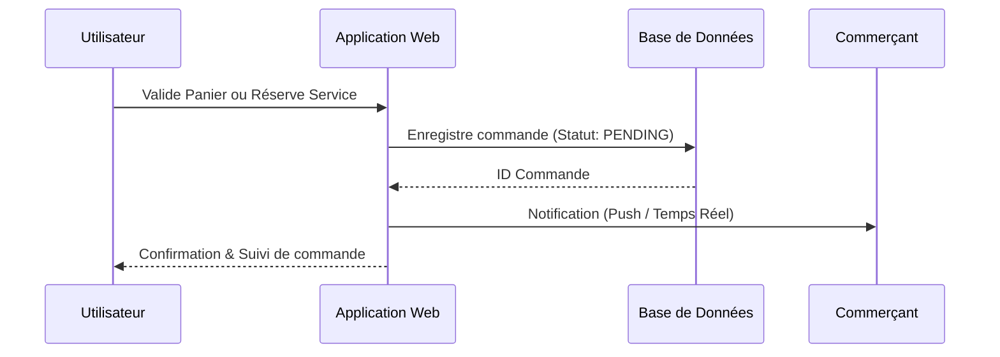
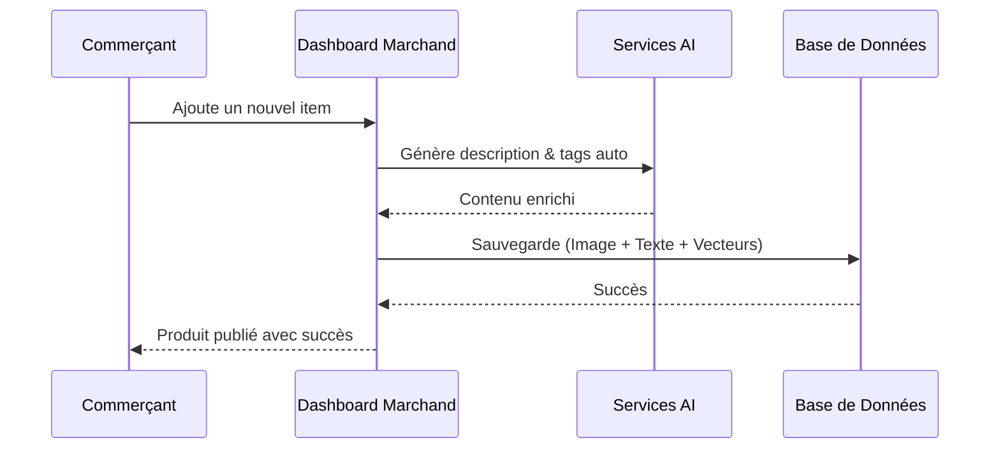
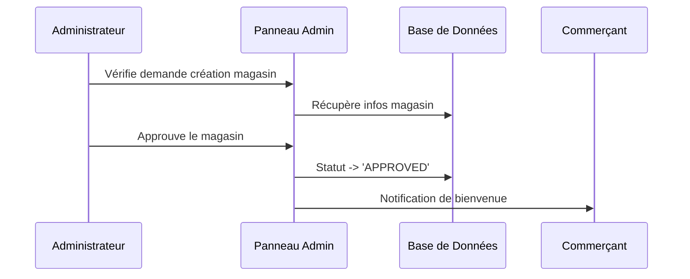

# 📊 DIAGRAMMES DE SÉQUENCE SIMPLIFIÉS - PLATEFORME RO2YA

**Plateforme:** Ro2ya - Marketplace IA Tunisienne  
**Version:** 2.0 (Simplifiée pour Rapport)  
**Date:** Avril 2026

---

## 📋 Table des Matières

1. [Recherche Intelligente (Darija/Image)](#1-recherche-intelligente)
2. [Navigation & Géolocalisation](#2-navigation--géolocalisation)
3. [Passage de Commande & Réservation](#3-commande--réservation)
4. [Gestion Marchand (Produits/Inventory)](#4-gestion-marchand)
5. [Administration & Modération](#5-administration)

---

## 1. Recherche Intelligente (Darija/Image)



---

## 2. Navigation & Géolocalisation



---

## 3. Commande & Réservation (Sans Paiement en ligne)



---

## 4. Gestion Marchand (Produits & Stocks)



---

## 5. Administration & Modération



---

## 🏗️ Diagramme de Cas d'Utilisation (Simplifié)

```mermaid
useCaseDiagram
    actor "Client" as C
    actor "Commerçant" as M
    actor "Admin" as A

    package "Plateforme Ro2ya" {
        usecase "Recherche Sémantique (Darija)" as UC1
        usecase "Commander / Réserver" as UC2
        usecase "Gérer Profil & Favoris" as UC3
        usecase "Gérer Catalogue & Stocks" as UC4
        usecase "Publier Reels/Stories" as UC5
        usecase "Gérer Commandes & QR" as UC6
        usecase "Modérer & Approuver" as UC7
        usecase "Consulter Analytics" as UC8
    }

    C --> UC1
    C --> UC2
    C --> UC3
    
    M --> UC4
    M --> UC5
    M --> UC6
    M --> UC8
    
    A --> UC7
    A --> UC8
```

---

**Note:** Les flux ont été simplifiés pour se concentrer sur l'expérience utilisateur et l'intégration de l'IA, en masquant les détails de bas niveau (headers, types de vecteurs, retries).
