# 📊 DIAGRAMMES DE SÉQUENCE - TOUTES LES FONCTIONNALITÉS

**Plateforme:** Ro2ya - Marketplace SaaS Tunisienne  
**Date:** Avril 2026  
**Version:** 2.0 - Complet  
**Couverture:** 29 use cases détaillés (Client, Merchant, Admin)

---

## 📋 Table des Matières

### 👤 Client Features (11)
1. [Recherche Produits](#1-recherche-produits-native-darija-image)
2. [Navigation Magasins](#2-navigation-magasins)
3. [Consulter Détails](#3-consulter-détails-produitservice)
4. [Ajouter aux Favoris](#4-ajouter-aux-favoris)
5. [Commander Produit](#5-commander-produit)
6. [Réserver Service](#6-réserver-service)
7. [Paiement](#7-paiement-stripetelnet)
8. [Historique Commandes](#8-voir-historique-commandes)
9. [Laisser Avis](#9-laisser-avis--évaluations)
10. [Envoyer Message](#10-envoyer-message)
11. [Gérer Profil](#11-gérer-profil-utilisateur)

### 🏪 Merchant Features (11)
12. [Créer Magasin](#12-créer-magasin)
13. [Ajouter Produits/Services](#13-ajouter-produits--services)
14. [Gérer Inventory](#14-gérer-inventory)
15. [Accepter/Rejeter Commandes](#15-accepterrejeter-commandes)
16. [Scanner QR Livraison](#16-scanner-qr-livraison)
17. [Analytics Dashboard](#17-voir-analytics-dashboard)
18. [Créer Promotions](#18-créer-promotions)
19. [Publier Stories/Reels](#19-publier-stories--reels)
20. [Gérer Avis Client](#20-gérer-avis-client)
21. [Gérer Abonnement](#21-gérer-abonnement-freeprobusiness)
22. [Gérer Profil Magasin](#22-gérer-profil-magasin)

### 👨‍💼 Admin Features (7)
23. [Approuver/Rejeter Magasins](#23-approuverrejeter-magasins)
24. [Modérer Avis](#24-modérer-avis-suspects)
25. [Suspendre Utilisateurs](#25-suspendre-utilisateurs)
26. [Analytics Globales](#26-voir-analytics-globales)
27. [Gérer Catégories](#27-gérer-catégories)
28. [Paramètres Système](#28-gérer-paramètres-système)
29. [Exporter Données](#29-exporter-données)

---

# 👤 CLIENT FEATURES

## 1. Recherche Produits (Native/Darija/Image)

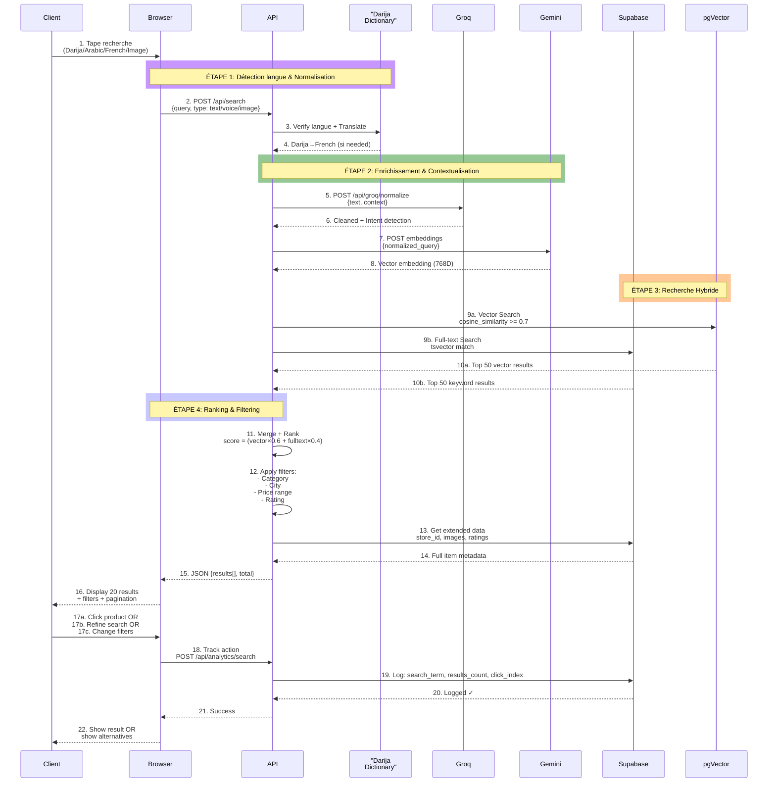
```mermaid
sequenceDiagram
    participant Client
    participant Browser
    participant API
    participant DarijaDict as "Darija<br/>Dictionary"
    participant Groq
    participant Gemini
    participant Supabase
    participant pgVector

    Client->>Browser: 1. Tape recherche<br/>(Darija/Arabic/French/Image)
    
    rect rgb(200, 150, 255)
        Note over Browser,DarijaDict: ÉTAPE 1: Détection langue & Normalisation
    end
    
    Browser->>API: 2. POST /api/search<br/>{query, type: text/voice/image}
    API->>DarijaDict: 3. Verify langue + Translate
    DarijaDict-->>API: 4. Darija→French (si needed)
    
    rect rgb(150, 200, 150)
        Note over API,Gemini: ÉTAPE 2: Enrichissement & Contextualisation
    end
    
    API->>Groq: 5. POST /api/groq/normalize<br/>{text, context}
    Groq-->>API: 6. Cleaned + Intent detection
    API->>Gemini: 7. POST embeddings<br/>{normalized_query}
    Gemini-->>API: 8. Vector embedding (768D)
    
    rect rgb(255, 200, 150)
        Note over Supabase,pgVector: ÉTAPE 3: Recherche Hybride
    end
    
    API->>pgVector: 9a. Vector Search<br/>cosine_similarity >= 0.7
    API->>Supabase: 9b. Full-text Search<br/>tsvector match
    
    pgVector-->>API: 10a. Top 50 vector results
    Supabase-->>API: 10b. Top 50 keyword results
    
    rect rgb(200, 200, 255)
        Note over API,Browser: ÉTAPE 4: Ranking & Filtering
    end
    
    API->>API: 11. Merge + Rank<br/>score = (vector×0.6 + fulltext×0.4)
    API->>API: 12. Apply filters:<br/>- Category<br/>- City<br/>- Price range<br/>- Rating
    
    API->>Supabase: 13. Get extended data<br/>store_id, images, ratings
    Supabase-->>API: 14. Full item metadata
    
    API-->>Browser: 15. JSON {results[], total}
    Browser-->>Client: 16. Display 20 results<br/>+ filters + pagination
    
    Client->>Browser: 17a. Click product OR<br/>17b. Refine search OR<br/>17c. Change filters
    
    Browser->>API: 18. Track action<br/>POST /api/analytics/search
    API->>Supabase: 19. Log: search_term, results_count, click_index
    Supabase-->>API: 20. Logged ✓
    
    API-->>Browser: 21. Success
    Browser-->>Client: 22. Show result OR<br/>show alternatives
```

---

## 2. Navigation Magasins

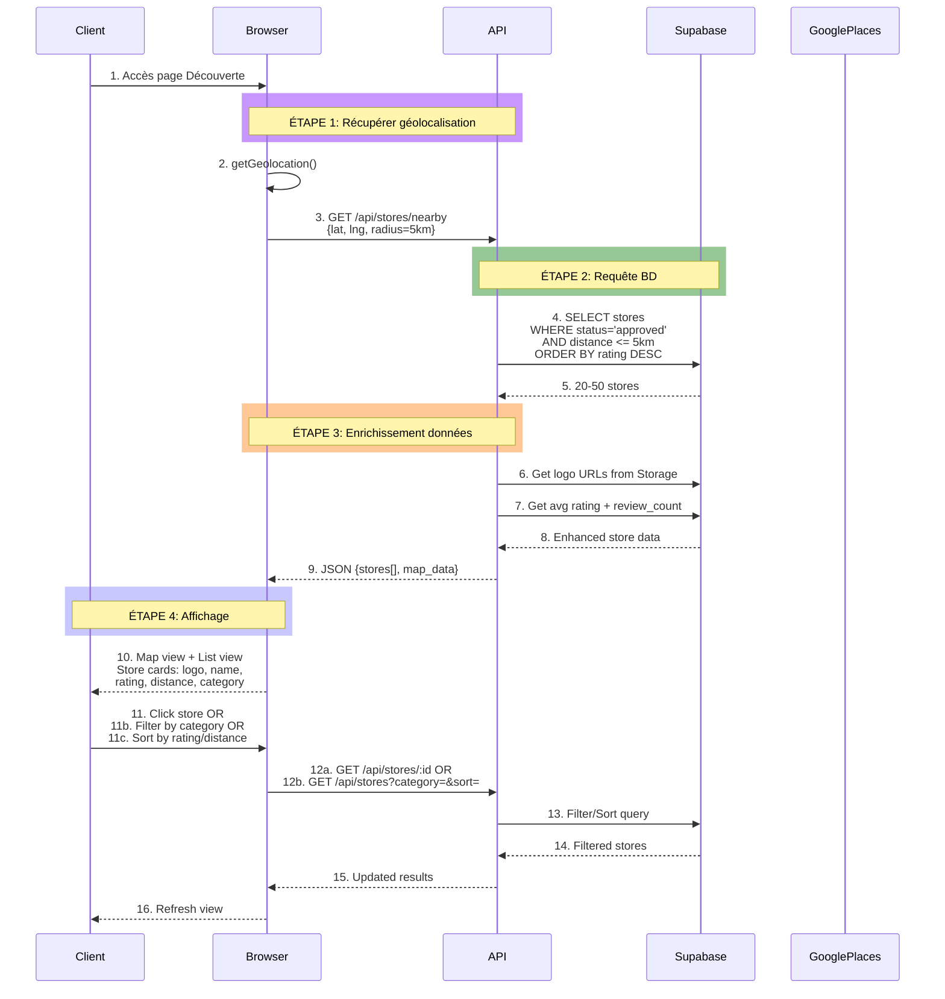
```mermaid
sequenceDiagram
    participant Client
    participant Browser
    participant API
    participant Supabase
    participant GooglePlaces

    Client->>Browser: 1. Accès page Découverte
    
    rect rgb(200, 150, 255)
        Note over Browser,API: ÉTAPE 1: Récupérer géolocalisation
    end
    
    Browser->>Browser: 2. getGeolocation()
    Browser->>API: 3. GET /api/stores/nearby<br/>{lat, lng, radius=5km}
    
    rect rgb(150, 200, 150)
        Note over API,Supabase: ÉTAPE 2: Requête BD
    end
    
    API->>Supabase: 4. SELECT stores<br/>WHERE status='approved'<br/>AND distance <= 5km<br/>ORDER BY rating DESC
    Supabase-->>API: 5. 20-50 stores
    
    rect rgb(255, 200, 150)
        Note over API,Browser: ÉTAPE 3: Enrichissement données
    end
    
    API->>Supabase: 6. Get logo URLs from Storage
    API->>Supabase: 7. Get avg rating + review_count
    Supabase-->>API: 8. Enhanced store data
    
    API-->>Browser: 9. JSON {stores[], map_data}
    
    rect rgb(200, 200, 255)
        Note over Browser,Client: ÉTAPE 4: Affichage
    end
    
    Browser-->>Client: 10. Map view + List view<br/>Store cards: logo, name,<br/>rating, distance, category
    
    Client->>Browser: 11. Click store OR<br/>11b. Filter by category OR<br/>11c. Sort by rating/distance
    
    Browser->>API: 12a. GET /api/stores/:id OR<br/>12b. GET /api/stores?category=&sort=
    API->>Supabase: 13. Filter/Sort query
    Supabase-->>API: 14. Filtered stores
    
    API-->>Browser: 15. Updated results
    Browser-->>Client: 16. Refresh view
```

---

## 3. Consulter Détails Produit/Service

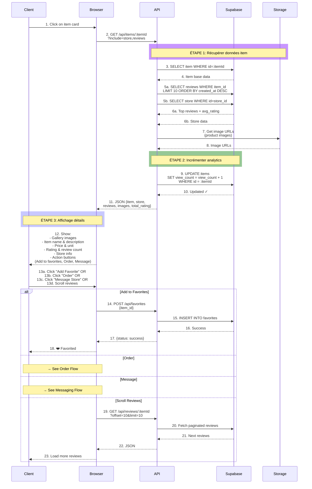
```mermaid
sequenceDiagram
    participant Client
    participant Browser
    participant API
    participant Supabase
    participant Storage

    Client->>Browser: 1. Click on item card
    Browser->>API: 2. GET /api/items/:itemId<br/>?include=store,reviews
    
    rect rgb(200, 150, 255)
        Note over API,Storage: ÉTAPE 1: Récupérer données item
    end
    
    API->>Supabase: 3. SELECT item WHERE id=:itemId
    Supabase-->>API: 4. Item base data
    
    API->>Supabase: 5a. SELECT reviews WHERE item_id<br/>LIMIT 10 ORDER BY created_at DESC
    API->>Supabase: 5b. SELECT store WHERE id=store_id
    Supabase-->>API: 6a. Top reviews + avg_rating
    Supabase-->>API: 6b. Store data
    
    API->>Storage: 7. Get image URLs<br/>(product images)
    Storage-->>API: 8. Image URLs
    
    rect rgb(150, 200, 150)
        Note over API,Supabase: ÉTAPE 2: Incrémenter analytics
    end
    
    API->>Supabase: 9. UPDATE items<br/>SET view_count = view_count + 1<br/>WHERE id = :itemId
    Supabase-->>API: 10. Updated ✓
    
    API-->>Browser: 11. JSON {item, store,<br/>reviews, images, total_rating}
    
    rect rgb(200, 200, 255)
        Note over Browser,Client: ÉTAPE 3: Affichage détails
    end
    
    Browser-->>Client: 12. Show:<br/>- Gallery images<br/>- Item name & description<br/>- Price & unit<br/>- Rating & review count<br/>- Store info<br/>- Action buttons<br/>(Add to favorites, Order, Message)
    
    Client->>Browser: 13a. Click "Add Favorite" OR<br/>13b. Click "Order" OR<br/>13c. Click "Message Store" OR<br/>13d. Scroll reviews
    
    alt Add to Favorites
        Browser->>API: 14. POST /api/favorites<br/>{item_id}
        API->>Supabase: 15. INSERT INTO favorites
        Supabase-->>API: 16. Success
        API-->>Browser: 17. {status: success}
        Browser-->>Client: 18. ❤️ Favorited
    else Order
        Note over Browser,Client: → See Order Flow
    else Message
        Note over Browser,Client: → See Messaging Flow
    else Scroll Reviews
        Browser->>API: 19. GET /api/reviews/:itemId<br/>?offset=10&limit=10
        API->>Supabase: 20. Fetch paginated reviews
        Supabase-->>API: 21. Next reviews
        API-->>Browser: 22. JSON
        Browser-->>Client: 23. Load more reviews
    end
```

---

## 4. Ajouter aux Favoris

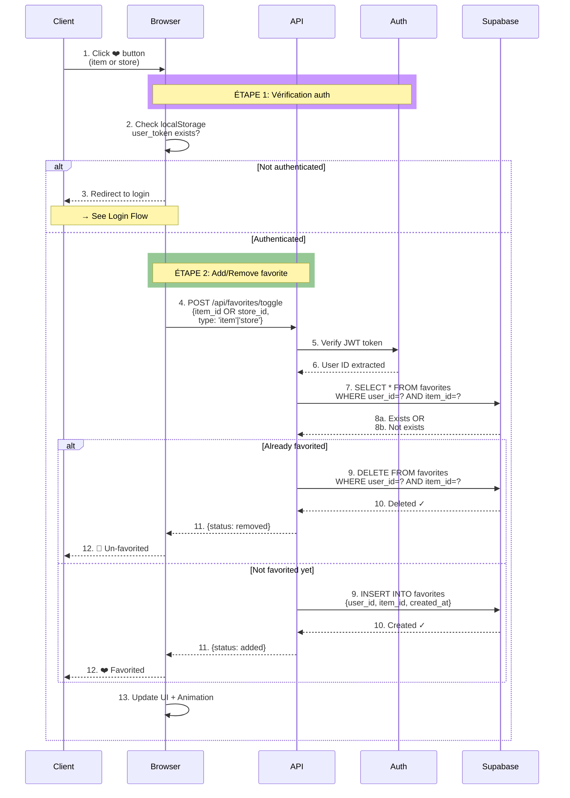
```mermaid
sequenceDiagram
    participant Client
    participant Browser
    participant API
    participant Auth
    participant Supabase

    Client->>Browser: 1. Click ❤️ button<br/>(item or store)
    
    rect rgb(200, 150, 255)
        Note over Browser,Auth: ÉTAPE 1: Vérification auth
    end
    
    Browser->>Browser: 2. Check localStorage<br/>user_token exists?
    
    alt Not authenticated
        Browser-->>Client: 3. Redirect to login
        Note over Browser,Client: → See Login Flow
    else Authenticated
        rect rgb(150, 200, 150)
            Note over Browser,API: ÉTAPE 2: Add/Remove favorite
        end
        
        Browser->>API: 4. POST /api/favorites/toggle<br/>{item_id OR store_id,<br/>type: 'item'|'store'}
        
        API->>Auth: 5. Verify JWT token
        Auth-->>API: 6. User ID extracted
        
        API->>Supabase: 7. SELECT * FROM favorites<br/>WHERE user_id=? AND item_id=?
        Supabase-->>API: 8a. Exists OR<br/>8b. Not exists
        
        alt Already favorited
            API->>Supabase: 9. DELETE FROM favorites<br/>WHERE user_id=? AND item_id=?
            Supabase-->>API: 10. Deleted ✓
            API-->>Browser: 11. {status: removed}
            Browser-->>Client: 12. 🤍 Un-favorited
        else Not favorited yet
            API->>Supabase: 9. INSERT INTO favorites<br/>{user_id, item_id, created_at}
            Supabase-->>API: 10. Created ✓
            API-->>Browser: 11. {status: added}
            Browser-->>Client: 12. ❤️ Favorited
        end
        
        Browser->>Browser: 13. Update UI + Animation
    end
```

---

## 5. Commander Produit

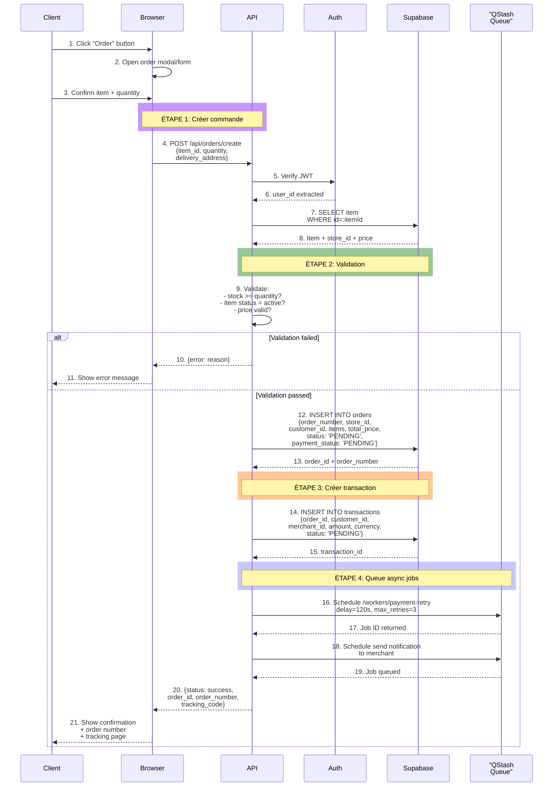
```mermaid
sequenceDiagram
    participant Client
    participant Browser
    participant API
    participant Auth
    participant Supabase
    participant QStash as "QStash<br/>Queue"

    Client->>Browser: 1. Click "Order" button
    Browser->>Browser: 2. Open order modal/form
    Client->>Browser: 3. Confirm item + quantity
    
    rect rgb(200, 150, 255)
        Note over Browser,API: ÉTAPE 1: Créer commande
    end
    
    Browser->>API: 4. POST /api/orders/create<br/>{item_id, quantity,<br/>delivery_address}
    
    API->>Auth: 5. Verify JWT
    Auth-->>API: 6. user_id extracted
    
    API->>Supabase: 7. SELECT item<br/>WHERE id=:itemId
    Supabase-->>API: 8. Item + store_id + price
    
    rect rgb(150, 200, 150)
        Note over API,Supabase: ÉTAPE 2: Validation
    end
    
    API->>API: 9. Validate:<br/>- stock >= quantity?<br/>- item status = active?<br/>- price valid?
    
    alt Validation failed
        API-->>Browser: 10. {error: reason}
        Browser-->>Client: 11. Show error message
    else Validation passed
        API->>Supabase: 12. INSERT INTO orders<br/>{order_number, store_id,<br/>customer_id, items, total_price,<br/>status: 'PENDING',<br/>payment_status: 'PENDING'}
        Supabase-->>API: 13. order_id + order_number
        
        rect rgb(255, 200, 150)
            Note over API,Supabase: ÉTAPE 3: Créer transaction
        end
        
        API->>Supabase: 14. INSERT INTO transactions<br/>{order_id, customer_id,<br/>merchant_id, amount, currency,<br/>status: 'PENDING'}
        Supabase-->>API: 15. transaction_id
        
        rect rgb(200, 200, 255)
            Note over API,QStash: ÉTAPE 4: Queue async jobs
        end
        
        API->>QStash: 16. Schedule /workers/payment-retry<br/>delay=120s, max_retries=3
        QStash-->>API: 17. Job ID returned
        
        API->>QStash: 18. Schedule send notification<br/>to merchant
        QStash-->>API: 19. Job queued
        
        API-->>Browser: 20. {status: success,<br/>order_id, order_number,<br/>tracking_code}
        
        Browser-->>Client: 21. Show confirmation<br/>+ order number<br/>+ tracking page
    end
```

---

## 6. Réserver Service

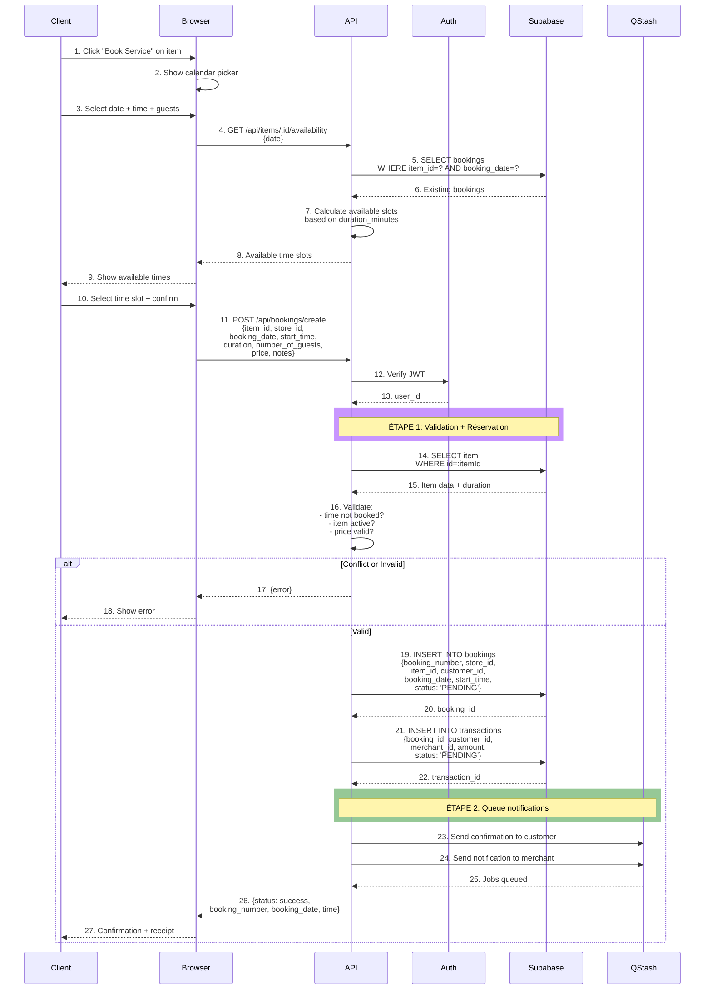
```mermaid
sequenceDiagram
    participant Client
    participant Browser
    participant API
    participant Auth
    participant Supabase
    participant QStash

    Client->>Browser: 1. Click "Book Service" on item
    Browser->>Browser: 2. Show calendar picker
    Client->>Browser: 3. Select date + time + guests
    Browser->>API: 4. GET /api/items/:id/availability<br/>{date}
    
    API->>Supabase: 5. SELECT bookings<br/>WHERE item_id=? AND booking_date=?
    Supabase-->>API: 6. Existing bookings
    
    API->>API: 7. Calculate available slots<br/>based on duration_minutes
    API-->>Browser: 8. Available time slots
    Browser-->>Client: 9. Show available times
    
    Client->>Browser: 10. Select time slot + confirm
    Browser->>API: 11. POST /api/bookings/create<br/>{item_id, store_id,<br/>booking_date, start_time,<br/>duration, number_of_guests,<br/>price, notes}
    
    API->>Auth: 12. Verify JWT
    Auth-->>API: 13. user_id
    
    rect rgb(200, 150, 255)
        Note over API,Supabase: ÉTAPE 1: Validation + Réservation
    end
    
    API->>Supabase: 14. SELECT item<br/>WHERE id=:itemId
    Supabase-->>API: 15. Item data + duration
    
    API->>API: 16. Validate:<br/>- time not booked?<br/>- item active?<br/>- price valid?
    
    alt Conflict or Invalid
        API-->>Browser: 17. {error}
        Browser-->>Client: 18. Show error
    else Valid
        API->>Supabase: 19. INSERT INTO bookings<br/>{booking_number, store_id,<br/>item_id, customer_id,<br/>booking_date, start_time,<br/>status: 'PENDING'}
        Supabase-->>API: 20. booking_id
        
        API->>Supabase: 21. INSERT INTO transactions<br/>{booking_id, customer_id,<br/>merchant_id, amount,<br/>status: 'PENDING'}
        Supabase-->>API: 22. transaction_id
        
        rect rgb(150, 200, 150)
            Note over API,QStash: ÉTAPE 2: Queue notifications
        end
        
        API->>QStash: 23. Send confirmation to customer
        API->>QStash: 24. Send notification to merchant
        QStash-->>API: 25. Jobs queued
        
        API-->>Browser: 26. {status: success,<br/>booking_number, booking_date, time}
        Browser-->>Client: 27. Confirmation + receipt
    end
```

---

## 7. Paiement (Stripe/Telnet)

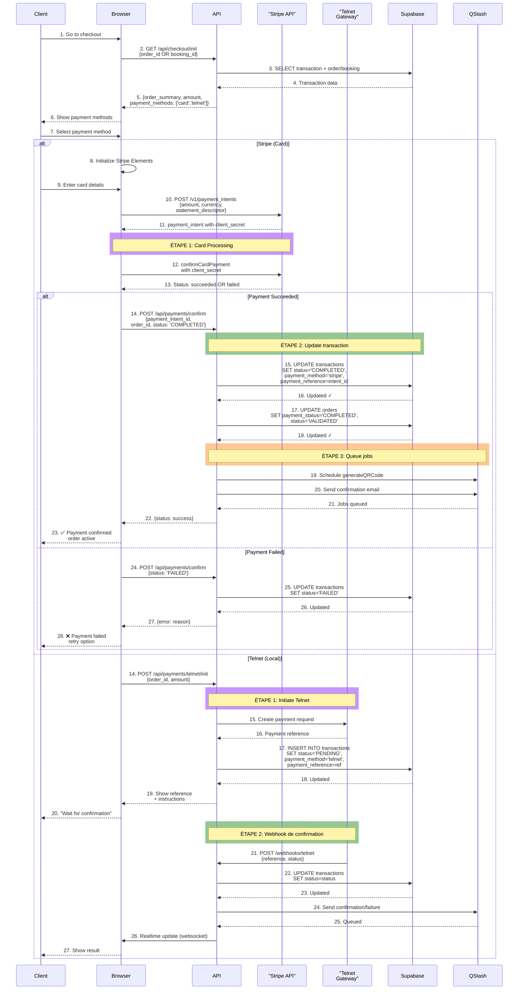
```mermaid
sequenceDiagram
    participant Client
    participant Browser
    participant API
    participant Stripe as "Stripe API"
    participant Telnet as "Telnet<br/>Gateway"
    participant Supabase
    participant QStash

    Client->>Browser: 1. Go to checkout
    Browser->>API: 2. GET /api/checkout/init<br/>{order_id OR booking_id}
    
    API->>Supabase: 3. SELECT transaction + order/booking
    Supabase-->>API: 4. Transaction data
    
    API-->>Browser: 5. {order_summary, amount,<br/>payment_methods: ['card','telnet']}
    Browser-->>Client: 6. Show payment methods
    
    Client->>Browser: 7. Select payment method
    
    alt Stripe (Card)
        Browser->>Browser: 8. Initialize Stripe Elements
        Client->>Browser: 9. Enter card details
        Browser->>Stripe: 10. POST /v1/payment_intents<br/>{amount, currency,<br/>statement_descriptor}
        Stripe-->>Browser: 11. payment_intent with client_secret
        
        rect rgb(200, 150, 255)
            Note over Browser,Stripe: ÉTAPE 1: Card Processing
        end
        
        Browser->>Stripe: 12. confirmCardPayment<br/>with client_secret
        Stripe-->>Browser: 13. Status: succeeded OR failed
        
        alt Payment Succeeded
            Browser->>API: 14. POST /api/payments/confirm<br/>{payment_intent_id,<br/>order_id, status: 'COMPLETED'}
            
            rect rgb(150, 200, 150)
                Note over API,Supabase: ÉTAPE 2: Update transaction
            end
            
            API->>Supabase: 15. UPDATE transactions<br/>SET status='COMPLETED',<br/>payment_method='stripe',<br/>payment_reference=intent_id
            Supabase-->>API: 16. Updated ✓
            
            API->>Supabase: 17. UPDATE orders<br/>SET payment_status='COMPLETED',<br/>status='VALIDATED'
            Supabase-->>API: 18. Updated ✓
            
            rect rgb(255, 200, 150)
                Note over API,QStash: ÉTAPE 3: Queue jobs
            end
            
            API->>QStash: 19. Schedule generateQRCode
            API->>QStash: 20. Send confirmation email
            QStash-->>API: 21. Jobs queued
            
            API-->>Browser: 22. {status: success}
            Browser-->>Client: 23. ✅ Payment confirmed<br/>order active
            
        else Payment Failed
            Browser->>API: 24. POST /api/payments/confirm<br/>{status: 'FAILED'}
            API->>Supabase: 25. UPDATE transactions<br/>SET status='FAILED'
            Supabase-->>API: 26. Updated
            
            API-->>Browser: 27. {error: reason}
            Browser-->>Client: 28. ❌ Payment failed<br/>retry option
        end
        
    else Telnet (Local)
        Browser->>API: 14. POST /api/payments/telnet/init<br/>{order_id, amount}
        
        rect rgb(200, 150, 255)
            Note over API,Telnet: ÉTAPE 1: Initiate Telnet
        end
        
        API->>Telnet: 15. Create payment request
        Telnet-->>API: 16. Payment reference
        
        API->>Supabase: 17. INSERT INTO transactions<br/>SET status='PENDING',<br/>payment_method='telnet',<br/>payment_reference=ref
        Supabase-->>API: 18. Updated
        
        API-->>Browser: 19. Show reference<br/>+ instructions
        Browser-->>Client: 20. "Wait for confirmation"
        
        rect rgb(150, 200, 150)
            Note over API,Telnet: ÉTAPE 2: Webhook de confirmation
        end
        
        Telnet->>API: 21. POST /webhooks/telnet<br/>{reference, status}
        API->>Supabase: 22. UPDATE transactions<br/>SET status=status
        Supabase-->>API: 23. Updated
        
        API->>QStash: 24. Send confirmation/failure
        QStash-->>API: 25. Queued
        
        API->>Browser: 26. Realtime update (websocket)
        Browser-->>Client: 27. Show result
    end
```

---

## 8. Voir Historique Commandes

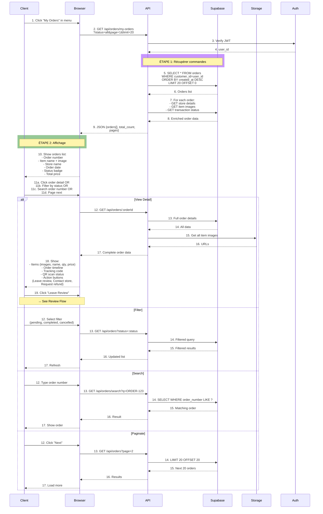
```mermaid
sequenceDiagram
    participant Client
    participant Browser
    participant API
    participant Supabase
    participant Storage

    Client->>Browser: 1. Click "My Orders" in menu
    Browser->>API: 2. GET /api/orders/my-orders<br/>?status=all&page=1&limit=20
    
    API->>Auth: 3. Verify JWT
    Auth-->>API: 4. user_id
    
    rect rgb(200, 150, 255)
        Note over API,Supabase: ÉTAPE 1: Récupérer commandes
    end
    
    API->>Supabase: 5. SELECT * FROM orders<br/>WHERE customer_id=user_id<br/>ORDER BY created_at DESC<br/>LIMIT 20 OFFSET 0
    Supabase-->>API: 6. Orders list
    
    API->>Supabase: 7. For each order:<br/>- GET store details<br/>- GET item images<br/>- GET transaction status
    Supabase-->>API: 8. Enriched order data
    
    API-->>Browser: 9. JSON {orders[], total_count,<br/>pages}
    
    rect rgb(150, 200, 150)
        Note over Browser,Client: ÉTAPE 2: Affichage
    end
    
    Browser-->>Client: 10. Show orders list:<br/>- Order number<br/>- Item name + image<br/>- Store name<br/>- Order date<br/>- Status badge<br/>- Total price
    
    Client->>Browser: 11a. Click order detail OR<br/>11b. Filter by status OR<br/>11c. Search order number OR<br/>11d. Page next
    
    alt View Detail
        Browser->>API: 12. GET /api/orders/:orderId
        API->>Supabase: 13. Full order details
        Supabase-->>API: 14. All data
        
        API->>Storage: 15. Get all item images
        Storage-->>API: 16. URLs
        
        API-->>Browser: 17. Complete order data
        Browser-->>Client: 18. Show:<br/>- Items (images, name, qty, price)<br/>- Order timeline<br/>- Tracking code<br/>- QR scan status<br/>- Action buttons<br/>(Leave review, Contact store,<br/>Request refund)
        
        Client->>Browser: 19. Click "Leave Review"
        Note over Browser,Client: → See Review Flow
        
    else Filter
        Client->>Browser: 12. Select filter<br/>(pending, completed, cancelled)
        Browser->>API: 13. GET /api/orders?status=:status
        API->>Supabase: 14. Filtered query
        Supabase-->>API: 15. Filtered results
        API-->>Browser: 16. Updated list
        Browser-->>Client: 17. Refresh
        
    else Search
        Client->>Browser: 12. Type order number
        Browser->>API: 13. GET /api/orders/search?q=ORDER-123
        API->>Supabase: 14. SELECT WHERE order_number LIKE ?
        Supabase-->>API: 15. Matching order
        API-->>Browser: 16. Result
        Browser-->>Client: 17. Show order
        
    else Paginate
        Client->>Browser: 12. Click "Next"
        Browser->>API: 13. GET /api/orders?page=2
        API->>Supabase: 14. LIMIT 20 OFFSET 20
        Supabase-->>API: 15. Next 20 orders
        API-->>Browser: 16. Results
        Browser-->>Client: 17. Load more
    end
```

---

## 9. Laisser Avis & Évaluations

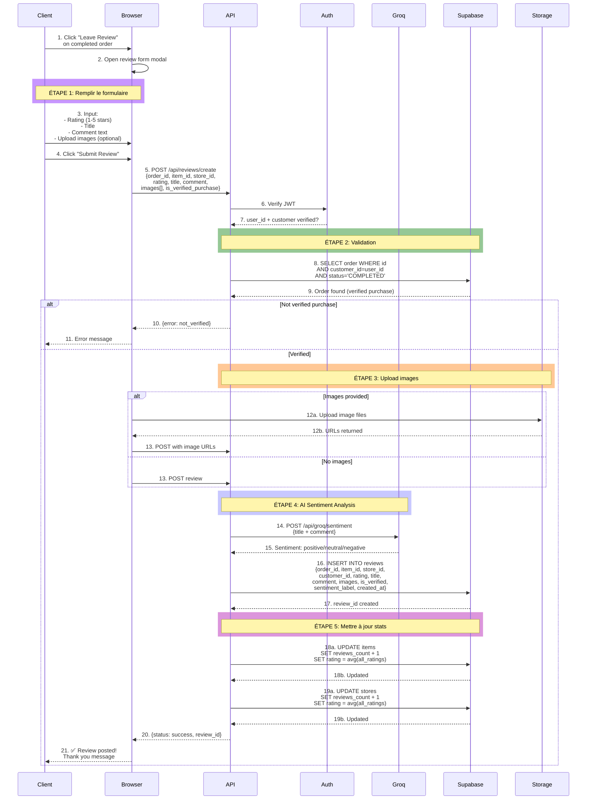
```mermaid
sequenceDiagram
    participant Client
    participant Browser
    participant API
    participant Auth
    participant Groq
    participant Supabase
    participant Storage

    Client->>Browser: 1. Click "Leave Review"<br/>on completed order
    Browser->>Browser: 2. Open review form modal
    
    rect rgb(200, 150, 255)
        Note over Browser,Client: ÉTAPE 1: Remplir le formulaire
    end
    
    Client->>Browser: 3. Input:<br/>- Rating (1-5 stars)<br/>- Title<br/>- Comment text<br/>- Upload images (optional)
    
    Client->>Browser: 4. Click "Submit Review"
    
    Browser->>API: 5. POST /api/reviews/create<br/>{order_id, item_id, store_id,<br/>rating, title, comment,<br/>images[], is_verified_purchase}
    
    API->>Auth: 6. Verify JWT
    Auth-->>API: 7. user_id + customer verified?
    
    rect rgb(150, 200, 150)
        Note over API,Supabase: ÉTAPE 2: Validation
    end
    
    API->>Supabase: 8. SELECT order WHERE id<br/>AND customer_id=user_id<br/>AND status='COMPLETED'
    Supabase-->>API: 9. Order found (verified purchase)
    
    alt Not verified purchase
        API-->>Browser: 10. {error: not_verified}
        Browser-->>Client: 11. Error message
    else Verified
        rect rgb(255, 200, 150)
            Note over API,Storage: ÉTAPE 3: Upload images
        end
        
        alt Images provided
            Browser->>Storage: 12a. Upload image files
            Storage-->>Browser: 12b. URLs returned
            Browser->>API: 13. POST with image URLs
        else No images
            Browser->>API: 13. POST review
        end
        
        rect rgb(200, 200, 255)
            Note over API,Groq: ÉTAPE 4: AI Sentiment Analysis
        end
        
        API->>Groq: 14. POST /api/groq/sentiment<br/>{title + comment}
        Groq-->>API: 15. Sentiment: positive/neutral/negative
        
        API->>Supabase: 16. INSERT INTO reviews<br/>{order_id, item_id, store_id,<br/>customer_id, rating, title,<br/>comment, images, is_verified,<br/>sentiment_label, created_at}
        Supabase-->>API: 17. review_id created
        
        rect rgb(220, 150, 220)
            Note over API,Supabase: ÉTAPE 5: Mettre à jour stats
        end
        
        API->>Supabase: 18a. UPDATE items<br/>SET reviews_count + 1<br/>SET rating = avg(all_ratings)
        Supabase-->>API: 18b. Updated
        
        API->>Supabase: 19a. UPDATE stores<br/>SET reviews_count + 1<br/>SET rating = avg(all_ratings)
        Supabase-->>API: 19b. Updated
        
        API-->>Browser: 20. {status: success, review_id}
        Browser-->>Client: 21. ✅ Review posted!<br/>Thank you message
    end
```

---

## 10. Envoyer Message

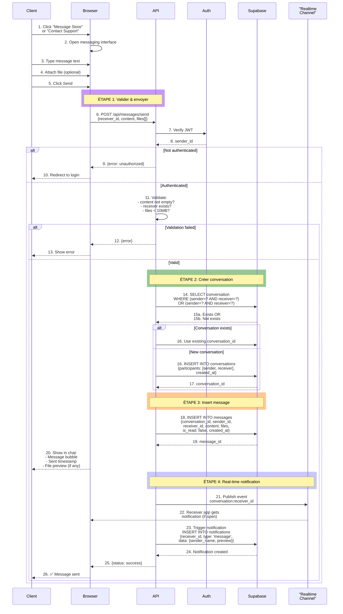
```mermaid
sequenceDiagram
    participant Client
    participant Browser
    participant API
    participant Auth
    participant Supabase
    participant Realtime as "Realtime<br/>Channel"

    Client->>Browser: 1. Click "Message Store"<br/>or "Contact Support"
    Browser->>Browser: 2. Open messaging interface
    Client->>Browser: 3. Type message text
    Client->>Browser: 4. Attach file (optional)
    
    Client->>Browser: 5. Click Send
    
    rect rgb(200, 150, 255)
        Note over Browser,API: ÉTAPE 1: Valider & envoyer
    end
    
    Browser->>API: 6. POST /api/messages/send<br/>{receiver_id, content, files[]}
    
    API->>Auth: 7. Verify JWT
    Auth-->>API: 8. sender_id
    
    alt Not authenticated
        API-->>Browser: 9. {error: unauthorized}
        Browser-->>Client: 10. Redirect to login
    else Authenticated
        API->>API: 11. Validate:<br/>- content not empty?<br/>- receiver exists?<br/>- files < 10MB?
        
        alt Validation failed
            API-->>Browser: 12. {error}
            Browser-->>Client: 13. Show error
            
        else Valid
            rect rgb(150, 200, 150)
                Note over API,Supabase: ÉTAPE 2: Créer conversation
            end
            
            API->>Supabase: 14. SELECT conversation<br/>WHERE (sender=? AND receiver=?)<br/>OR (sender=? AND receiver=?)
            Supabase-->>API: 15a. Exists OR<br/>15b. Not exists
            
            alt Conversation exists
                API->>Supabase: 16. Use existing conversation_id
            else New conversation
                API->>Supabase: 16. INSERT INTO conversations<br/>{participants: [sender, receiver],<br/>created_at}
                Supabase-->>API: 17. conversation_id
            end
            
            rect rgb(255, 200, 150)
                Note over API,Supabase: ÉTAPE 3: Insert message
            end
            
            API->>Supabase: 18. INSERT INTO messages<br/>{conversation_id, sender_id,<br/>receiver_id, content, files,<br/>is_read: false, created_at}
            Supabase-->>API: 19. message_id
            
            Browser-->>Client: 20. Show in chat:<br/>- Message bubble<br/>- Sent timestamp<br/>- File preview (if any)
            
            rect rgb(200, 200, 255)
                Note over API,Realtime: ÉTAPE 4: Real-time notification
            end
            
            API->>Realtime: 21. Publish event<br/>conversation:receiver_id
            Realtime-->>Browser: 22. Receiver app gets<br/>notification (if open)
            
            API->>Supabase: 23. Trigger notification<br/>INSERT INTO notifications<br/>{receiver_id, type: 'message',<br/>data: {sender_name, preview}}
            Supabase-->>API: 24. Notification created
            
            API-->>Browser: 25. {status: success}
            Browser-->>Client: 26. ✅ Message sent
        end
    end
```

---

## 11. Gérer Profil Utilisateur

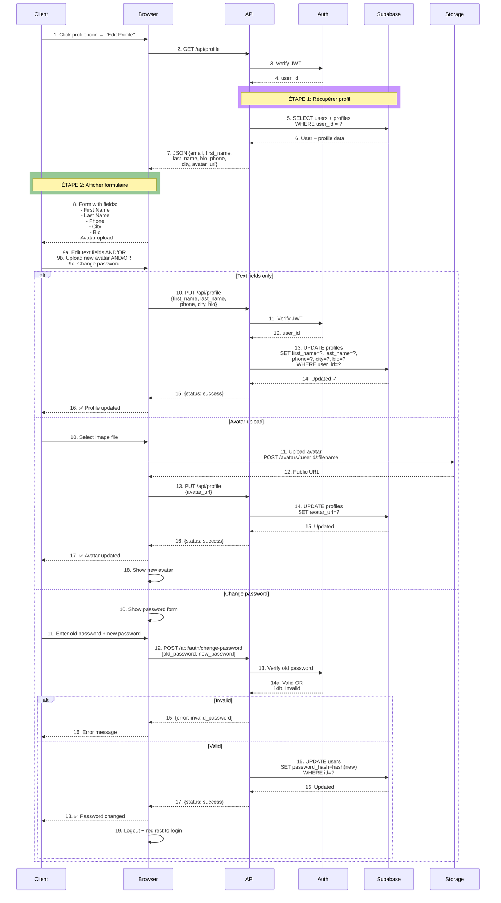
```mermaid
sequenceDiagram
    participant Client
    participant Browser
    participant API
    participant Auth
    participant Supabase
    participant Storage

    Client->>Browser: 1. Click profile icon → "Edit Profile"
    Browser->>API: 2. GET /api/profile
    
    API->>Auth: 3. Verify JWT
    Auth-->>API: 4. user_id
    
    rect rgb(200, 150, 255)
        Note over API,Supabase: ÉTAPE 1: Récupérer profil
    end
    
    API->>Supabase: 5. SELECT users + profiles<br/>WHERE user_id = ?
    Supabase-->>API: 6. User + profile data
    
    API-->>Browser: 7. JSON {email, first_name,<br/>last_name, bio, phone,<br/>city, avatar_url}
    
    rect rgb(150, 200, 150)
        Note over Browser,Client: ÉTAPE 2: Afficher formulaire
    end
    
    Browser-->>Client: 8. Form with fields:<br/>- First Name<br/>- Last Name<br/>- Phone<br/>- City<br/>- Bio<br/>- Avatar upload
    
    Client->>Browser: 9a. Edit text fields AND/OR<br/>9b. Upload new avatar AND/OR<br/>9c. Change password
    
    alt Text fields only
        Browser->>API: 10. PUT /api/profile<br/>{first_name, last_name,<br/>phone, city, bio}
        
        API->>Auth: 11. Verify JWT
        Auth-->>API: 12. user_id
        
        API->>Supabase: 13. UPDATE profiles<br/>SET first_name=?, last_name=?,<br/>phone=?, city=?, bio=?<br/>WHERE user_id=?
        Supabase-->>API: 14. Updated ✓
        
        API-->>Browser: 15. {status: success}
        Browser-->>Client: 16. ✅ Profile updated
        
    else Avatar upload
        Client->>Browser: 10. Select image file
        Browser->>Storage: 11. Upload avatar<br/>POST /avatars/:userId/:filename
        Storage-->>Browser: 12. Public URL
        
        Browser->>API: 13. PUT /api/profile<br/>{avatar_url}
        API->>Supabase: 14. UPDATE profiles<br/>SET avatar_url=?
        Supabase-->>API: 15. Updated
        
        API-->>Browser: 16. {status: success}
        Browser-->>Client: 17. ✅ Avatar updated
        Browser->>Browser: 18. Show new avatar
        
    else Change password
        Browser->>Browser: 10. Show password form
        Client->>Browser: 11. Enter old password + new password
        Browser->>API: 12. POST /api/auth/change-password<br/>{old_password, new_password}
        
        API->>Auth: 13. Verify old password
        Auth-->>API: 14a. Valid OR<br/>14b. Invalid
        
        alt Invalid
            API-->>Browser: 15. {error: invalid_password}
            Browser-->>Client: 16. Error message
            
        else Valid
            API->>Supabase: 15. UPDATE users<br/>SET password_hash=hash(new)<br/>WHERE id=?
            Supabase-->>API: 16. Updated
            
            API-->>Browser: 17. {status: success}
            Browser-->>Client: 18. ✅ Password changed
            Browser->>Browser: 19. Logout + redirect to login
        end
    end
```

---

# 🏪 MERCHANT FEATURES

## 12. Créer Magasin

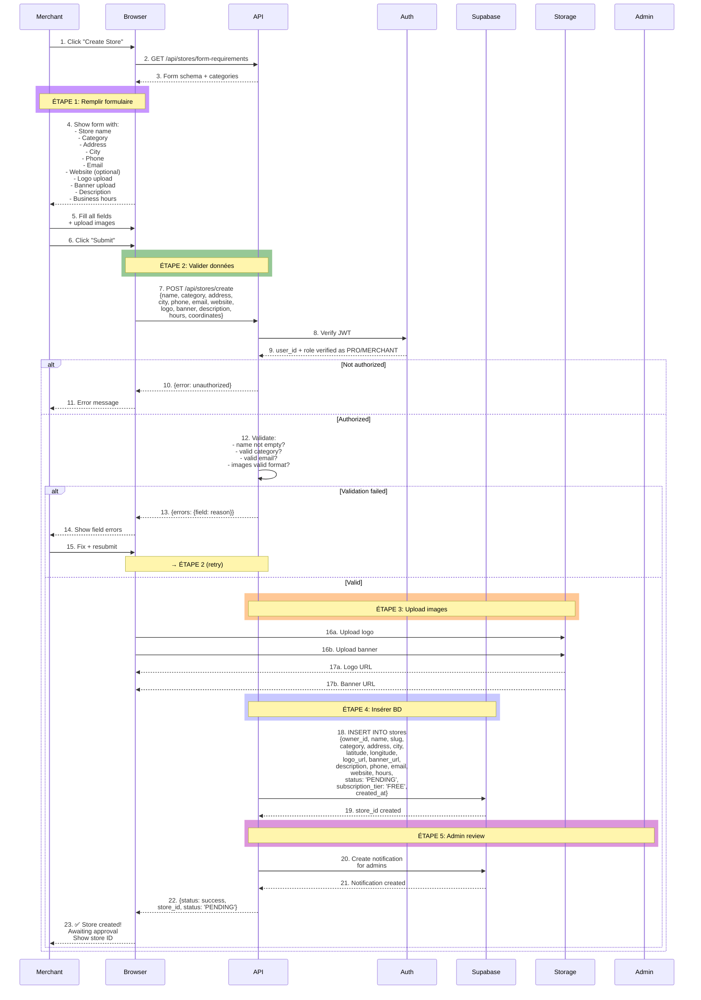
```mermaid
sequenceDiagram
    participant Merchant
    participant Browser
    participant API
    participant Auth
    participant Supabase
    participant Storage
    participant Admin

    Merchant->>Browser: 1. Click "Create Store"
    Browser->>API: 2. GET /api/stores/form-requirements
    
    API-->>Browser: 3. Form schema + categories
    
    rect rgb(200, 150, 255)
        Note over Browser,Merchant: ÉTAPE 1: Remplir formulaire
    end
    
    Browser-->>Merchant: 4. Show form with:<br/>- Store name<br/>- Category<br/>- Address<br/>- City<br/>- Phone<br/>- Email<br/>- Website (optional)<br/>- Logo upload<br/>- Banner upload<br/>- Description<br/>- Business hours
    
    Merchant->>Browser: 5. Fill all fields<br/>+ upload images
    
    Merchant->>Browser: 6. Click "Submit"
    
    rect rgb(150, 200, 150)
        Note over Browser,API: ÉTAPE 2: Valider données
    end
    
    Browser->>API: 7. POST /api/stores/create<br/>{name, category, address,<br/>city, phone, email, website,<br/>logo, banner, description,<br/>hours, coordinates}
    
    API->>Auth: 8. Verify JWT
    Auth-->>API: 9. user_id + role verified as PRO/MERCHANT
    
    alt Not authorized
        API-->>Browser: 10. {error: unauthorized}
        Browser-->>Merchant: 11. Error message
    else Authorized
        API->>API: 12. Validate:<br/>- name not empty?<br/>- valid category?<br/>- valid email?<br/>- images valid format?
        
        alt Validation failed
            API-->>Browser: 13. {errors: {field: reason}}
            Browser-->>Merchant: 14. Show field errors
            Merchant->>Browser: 15. Fix + resubmit
            Note over Browser,API: → ÉTAPE 2 (retry)
            
        else Valid
            rect rgb(255, 200, 150)
                Note over API,Storage: ÉTAPE 3: Upload images
            end
            
            Browser->>Storage: 16a. Upload logo
            Browser->>Storage: 16b. Upload banner
            Storage-->>Browser: 17a. Logo URL
            Storage-->>Browser: 17b. Banner URL
            
            rect rgb(200, 200, 255)
                Note over API,Supabase: ÉTAPE 4: Insérer BD
            end
            
            API->>Supabase: 18. INSERT INTO stores<br/>{owner_id, name, slug,<br/>category, address, city,<br/>latitude, longitude,<br/>logo_url, banner_url,<br/>description, phone, email,<br/>website, hours,<br/>status: 'PENDING',<br/>subscription_tier: 'FREE',<br/>created_at}
            Supabase-->>API: 19. store_id created
            
            rect rgb(220, 150, 220)
                Note over API,Admin: ÉTAPE 5: Admin review
            end
            
            API->>Supabase: 20. Create notification<br/>for admins
            Supabase-->>API: 21. Notification created
            
            API-->>Browser: 22. {status: success,<br/>store_id, status: 'PENDING'}
            
            Browser-->>Merchant: 23. ✅ Store created!<br/>Awaiting approval<br/>Show store ID
        end
    end
```

---

## 13. Ajouter Produits & Services

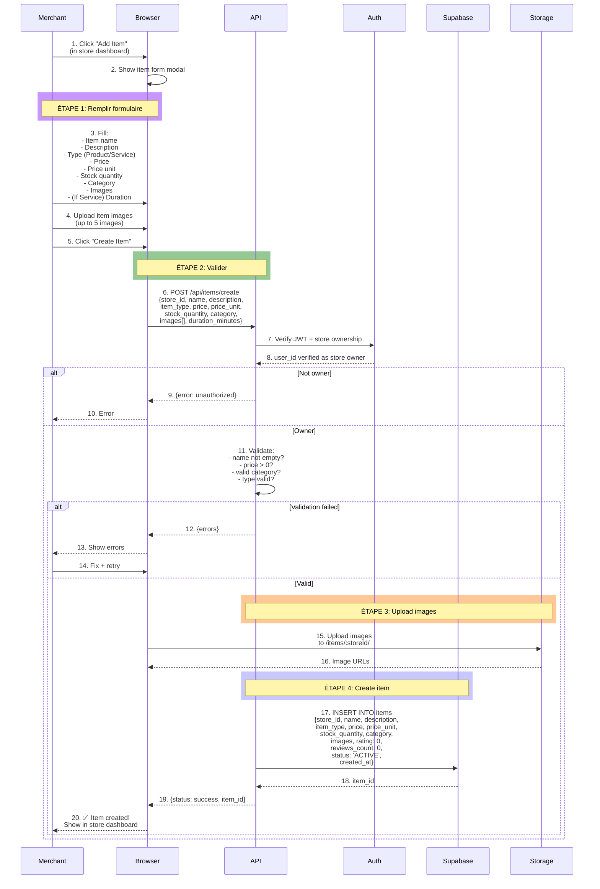
```mermaid
sequenceDiagram
    participant Merchant
    participant Browser
    participant API
    participant Auth
    participant Supabase
    participant Storage

    Merchant->>Browser: 1. Click "Add Item"<br/>(in store dashboard)
    Browser->>Browser: 2. Show item form modal
    
    rect rgb(200, 150, 255)
        Note over Browser,Merchant: ÉTAPE 1: Remplir formulaire
    end
    
    Merchant->>Browser: 3. Fill:<br/>- Item name<br/>- Description<br/>- Type (Product/Service)<br/>- Price<br/>- Price unit<br/>- Stock quantity<br/>- Category<br/>- Images<br/>- (If Service) Duration
    
    Merchant->>Browser: 4. Upload item images<br/>(up to 5 images)
    
    Merchant->>Browser: 5. Click "Create Item"
    
    rect rgb(150, 200, 150)
        Note over Browser,API: ÉTAPE 2: Valider
    end
    
    Browser->>API: 6. POST /api/items/create<br/>{store_id, name, description,<br/>item_type, price, price_unit,<br/>stock_quantity, category,<br/>images[], duration_minutes}
    
    API->>Auth: 7. Verify JWT + store ownership
    Auth-->>API: 8. user_id verified as store owner
    
    alt Not owner
        API-->>Browser: 9. {error: unauthorized}
        Browser-->>Merchant: 10. Error
    else Owner
        API->>API: 11. Validate:<br/>- name not empty?<br/>- price > 0?<br/>- valid category?<br/>- type valid?
        
        alt Validation failed
            API-->>Browser: 12. {errors}
            Browser-->>Merchant: 13. Show errors
            Merchant->>Browser: 14. Fix + retry
            
        else Valid
            rect rgb(255, 200, 150)
                Note over API,Storage: ÉTAPE 3: Upload images
            end
            
            Browser->>Storage: 15. Upload images<br/>to /items/:storeId/
            Storage-->>Browser: 16. Image URLs
            
            rect rgb(200, 200, 255)
                Note over API,Supabase: ÉTAPE 4: Create item
            end
            
            API->>Supabase: 17. INSERT INTO items<br/>{store_id, name, description,<br/>item_type, price, price_unit,<br/>stock_quantity, category,<br/>images, rating: 0,<br/>reviews_count: 0,<br/>status: 'ACTIVE',<br/>created_at}
            Supabase-->>API: 18. item_id
            
            API-->>Browser: 19. {status: success, item_id}
            Browser-->>Merchant: 20. ✅ Item created!<br/>Show in store dashboard
        end
    end
```

---

## 14. Gérer Inventory

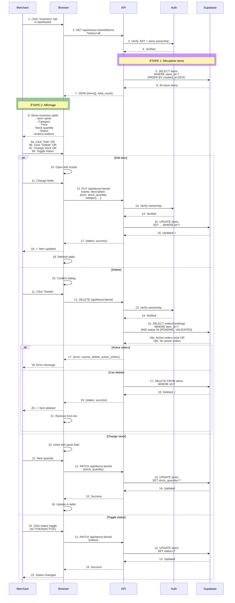
```mermaid
sequenceDiagram
    participant Merchant
    participant Browser
    participant API
    participant Auth
    participant Supabase

    Merchant->>Browser: 1. Click "Inventory" tab<br/>in dashboard
    Browser->>API: 2. GET /api/stores/:storeId/items<br/>?status=all
    
    API->>Auth: 3. Verify JWT + store ownership
    Auth-->>API: 4. Verified
    
    rect rgb(200, 150, 255)
        Note over API,Supabase: ÉTAPE 1: Récupérer items
    end
    
    API->>Supabase: 5. SELECT items<br/>WHERE store_id=?<br/>ORDER BY created_at DESC
    Supabase-->>API: 6. All store items
    
    API-->>Browser: 7. JSON {items[], total_count}
    
    rect rgb(150, 200, 150)
        Note over Browser,Merchant: ÉTAPE 2: Affichage
    end
    
    Browser-->>Merchant: 8. Show inventory table:<br/>- Item name<br/>- Category<br/>- Price<br/>- Stock quantity<br/>- Status<br/>- Actions buttons
    
    Merchant->>Browser: 9a. Click "Edit" OR<br/>9b. Click "Delete" OR<br/>9c. Change stock OR<br/>9d. Toggle status
    
    alt Edit item
        Browser->>Browser: 10. Open edit modal
        Merchant->>Browser: 11. Change fields
        Browser->>API: 12. PUT /api/items/:itemId<br/>{name, description,<br/>price, stock_quantity,<br/>category, ...}
        
        API->>Auth: 13. Verify ownership
        Auth-->>API: 14. Verified
        
        API->>Supabase: 15. UPDATE items<br/>SET ... WHERE id=?
        Supabase-->>API: 16. Updated ✓
        
        API-->>Browser: 17. {status: success}
        Browser-->>Merchant: 18. ✅ Item updated
        Browser->>Browser: 19. Refresh table
        
    else Delete
        Browser->>Browser: 10. Confirm dialog
        Merchant->>Browser: 11. Click "Delete"
        Browser->>API: 12. DELETE /api/items/:itemId
        
        API->>Auth: 13. Verify ownership
        Auth-->>API: 14. Verified
        
        API->>Supabase: 15. SELECT orders/bookings<br/>WHERE item_id=?<br/>AND status IN (PENDING, VALIDATED)
        Supabase-->>API: 16a. Active orders exist OR<br/>16b. No active orders
        
        alt Active orders
            API-->>Browser: 17. {error: cannot_delete_active_orders}
            Browser-->>Merchant: 18. Error message
            
        else Can delete
            API->>Supabase: 17. DELETE FROM items<br/>WHERE id=?
            Supabase-->>API: 18. Deleted ✓
            
            API-->>Browser: 19. {status: success}
            Browser-->>Merchant: 20. ✅ Item deleted
            Browser->>Browser: 21. Remove from list
        end
        
    else Change stock
        Browser->>Browser: 10. Inline edit stock field
        Merchant->>Browser: 11. New quantity
        Browser->>API: 12. PATCH /api/items/:itemId<br/>{stock_quantity}
        
        API->>Supabase: 13. UPDATE items<br/>SET stock_quantity=?
        Supabase-->>API: 14. Updated
        
        API-->>Browser: 15. Success
        Browser->>Browser: 16. Update in table
        
    else Toggle status
        Merchant->>Browser: 10. Click status toggle<br/>(ACTIVE/INACTIVE)
        Browser->>API: 11. PATCH /api/items/:itemId<br/>{status}
        
        API->>Supabase: 12. UPDATE items<br/>SET status=?
        Supabase-->>API: 13. Updated
        
        API-->>Browser: 14. Success
        Browser-->>Merchant: 15. Status changed
    end
```

---

## 15. Accepter/Rejeter Commandes

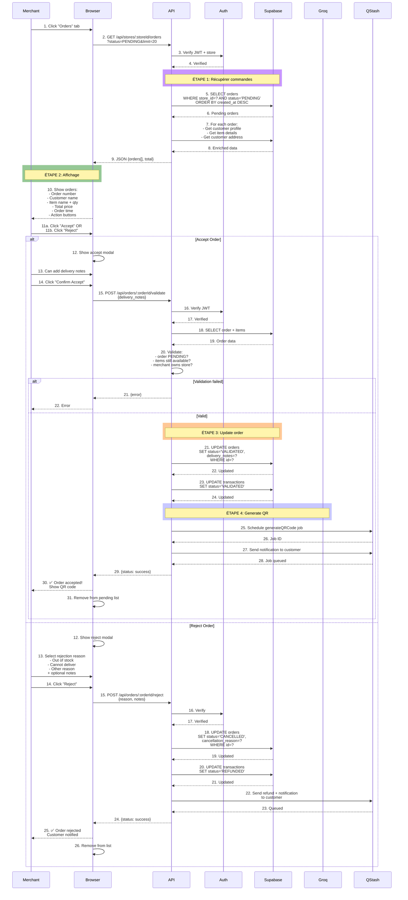
```mermaid
sequenceDiagram
    participant Merchant
    participant Browser
    participant API
    participant Auth
    participant Supabase
    participant Groq
    participant QStash

    Merchant->>Browser: 1. Click "Orders" tab
    Browser->>API: 2. GET /api/stores/:storeId/orders<br/>?status=PENDING&limit=20
    
    API->>Auth: 3. Verify JWT + store
    Auth-->>API: 4. Verified
    
    rect rgb(200, 150, 255)
        Note over API,Supabase: ÉTAPE 1: Récupérer commandes
    end
    
    API->>Supabase: 5. SELECT orders<br/>WHERE store_id=? AND status='PENDING'<br/>ORDER BY created_at DESC
    Supabase-->>API: 6. Pending orders
    
    API->>Supabase: 7. For each order:<br/>- Get customer profile<br/>- Get item details<br/>- Get customer address
    Supabase-->>API: 8. Enriched data
    
    API-->>Browser: 9. JSON {orders[], total}
    
    rect rgb(150, 200, 150)
        Note over Browser,Merchant: ÉTAPE 2: Affichage
    end
    
    Browser-->>Merchant: 10. Show orders:<br/>- Order number<br/>- Customer name<br/>- Item name + qty<br/>- Total price<br/>- Order time<br/>- Action buttons
    
    Merchant->>Browser: 11a. Click "Accept" OR<br/>11b. Click "Reject"
    
    alt Accept Order
        Browser->>Browser: 12. Show accept modal
        Merchant->>Browser: 13. Can add delivery notes
        Merchant->>Browser: 14. Click "Confirm Accept"
        
        Browser->>API: 15. POST /api/orders/:orderId/validate<br/>{delivery_notes}
        
        API->>Auth: 16. Verify JWT
        Auth-->>API: 17. Verified
        
        API->>Supabase: 18. SELECT order + items
        Supabase-->>API: 19. Order data
        
        API->>API: 20. Validate:<br/>- order PENDING?<br/>- items still available?<br/>- merchant owns store?
        
        alt Validation failed
            API-->>Browser: 21. {error}
            Browser-->>Merchant: 22. Error
            
        else Valid
            rect rgb(255, 200, 150)
                Note over API,Supabase: ÉTAPE 3: Update order
            end
            
            API->>Supabase: 21. UPDATE orders<br/>SET status='VALIDATED',<br/>delivery_notes=?<br/>WHERE id=?
            Supabase-->>API: 22. Updated
            
            API->>Supabase: 23. UPDATE transactions<br/>SET status='VALIDATED'
            Supabase-->>API: 24. Updated
            
            rect rgb(200, 200, 255)
                Note over API,Groq: ÉTAPE 4: Generate QR
            end
            
            API->>QStash: 25. Schedule generateQRCode job
            QStash-->>API: 26. Job ID
            
            API->>QStash: 27. Send notification to customer
            QStash-->>API: 28. Job queued
            
            API-->>Browser: 29. {status: success}
            Browser-->>Merchant: 30. ✅ Order accepted!<br/>Show QR code
            Browser->>Browser: 31. Remove from pending list
        end
        
    else Reject Order
        Browser->>Browser: 12. Show reject modal
        Merchant->>Browser: 13. Select rejection reason<br/>- Out of stock<br/>- Cannot deliver<br/>- Other reason<br/>+ optional notes
        Merchant->>Browser: 14. Click "Reject"
        
        Browser->>API: 15. POST /api/orders/:orderId/reject<br/>{reason, notes}
        
        API->>Auth: 16. Verify
        Auth-->>API: 17. Verified
        
        API->>Supabase: 18. UPDATE orders<br/>SET status='CANCELLED',<br/>cancellation_reason=?<br/>WHERE id=?
        Supabase-->>API: 19. Updated
        
        API->>Supabase: 20. UPDATE transactions<br/>SET status='REFUNDED'
        Supabase-->>API: 21. Updated
        
        API->>QStash: 22. Send refund + notification<br/>to customer
        QStash-->>API: 23. Queued
        
        API-->>Browser: 24. {status: success}
        Browser-->>Merchant: 25. ✅ Order rejected<br/>Customer notified
        Browser->>Browser: 26. Remove from list
    end
```

---

## 16. Scanner QR Livraison

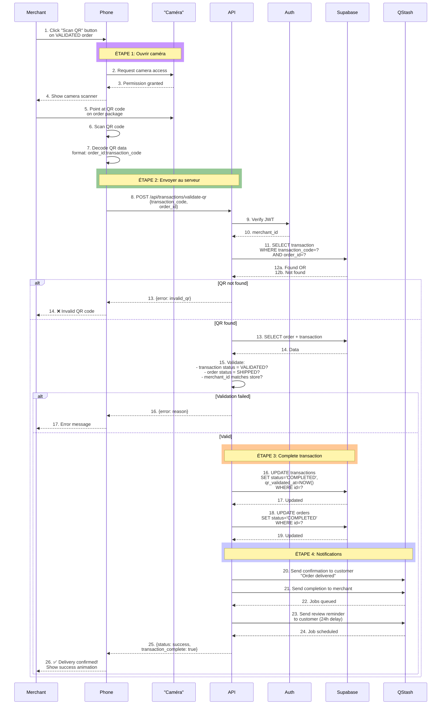
```mermaid
sequenceDiagram
    participant Merchant
    participant Phone
    participant Camera as "Caméra"
    participant API
    participant Auth
    participant Supabase
    participant QStash

    Merchant->>Phone: 1. Click "Scan QR" button<br/>on VALIDATED order
    
    rect rgb(200, 150, 255)
        Note over Phone,Camera: ÉTAPE 1: Ouvrir caméra
    end
    
    Phone->>Camera: 2. Request camera access
    Camera-->>Phone: 3. Permission granted
    Phone-->>Merchant: 4. Show camera scanner
    
    Merchant->>Camera: 5. Point at QR code<br/>on order package
    Phone->>Phone: 6. Scan QR code
    Phone->>Phone: 7. Decode QR data<br/>format: order_id:transaction_code
    
    rect rgb(150, 200, 150)
        Note over Phone,API: ÉTAPE 2: Envoyer au serveur
    end
    
    Phone->>API: 8. POST /api/transactions/validate-qr<br/>{transaction_code,<br/>order_id}
    
    API->>Auth: 9. Verify JWT
    Auth-->>API: 10. merchant_id
    
    API->>Supabase: 11. SELECT transaction<br/>WHERE transaction_code=?<br/>AND order_id=?
    Supabase-->>API: 12a. Found OR<br/>12b. Not found
    
    alt QR not found
        API-->>Phone: 13. {error: invalid_qr}
        Phone-->>Merchant: 14. ❌ Invalid QR code
        
    else QR found
        API->>Supabase: 13. SELECT order + transaction
        Supabase-->>API: 14. Data
        
        API->>API: 15. Validate:<br/>- transaction status = VALIDATED?<br/>- order status = SHIPPED?<br/>- merchant_id matches store?
        
        alt Validation failed
            API-->>Phone: 16. {error: reason}
            Phone-->>Merchant: 17. Error message
            
        else Valid
            rect rgb(255, 200, 150)
                Note over API,Supabase: ÉTAPE 3: Complete transaction
            end
            
            API->>Supabase: 16. UPDATE transactions<br/>SET status='COMPLETED',<br/>qr_validated_at=NOW()<br/>WHERE id=?
            Supabase-->>API: 17. Updated
            
            API->>Supabase: 18. UPDATE orders<br/>SET status='COMPLETED'<br/>WHERE id=?
            Supabase-->>API: 19. Updated
            
            rect rgb(200, 200, 255)
                Note over API,QStash: ÉTAPE 4: Notifications
            end
            
            API->>QStash: 20. Send confirmation to customer<br/>"Order delivered"
            API->>QStash: 21. Send completion to merchant
            QStash-->>API: 22. Jobs queued
            
            API->>QStash: 23. Send review reminder<br/>to customer (24h delay)
            QStash-->>API: 24. Job scheduled
            
            API-->>Phone: 25. {status: success,<br/>transaction_complete: true}
            
            Phone-->>Merchant: 26. ✅ Delivery confirmed!<br/>Show success animation
        end
    end
```

---

## 17. Voir Analytics Dashboard

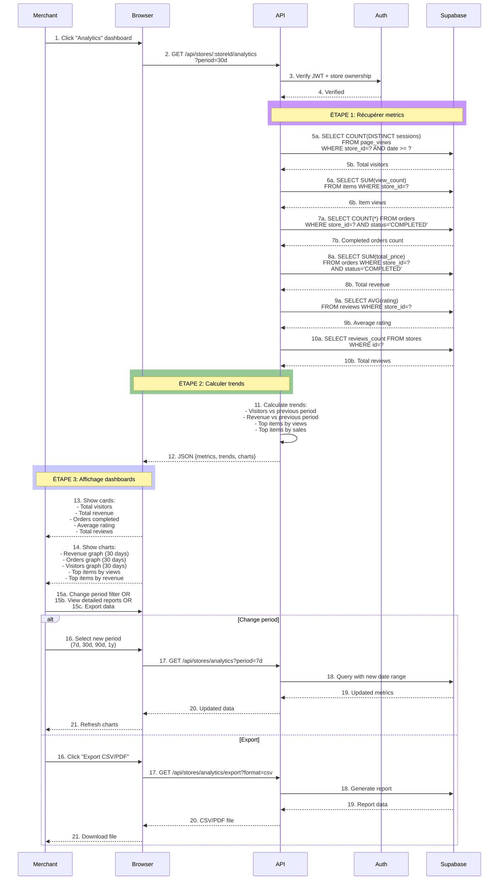
```mermaid
sequenceDiagram
    participant Merchant
    participant Browser
    participant API
    participant Auth
    participant Supabase

    Merchant->>Browser: 1. Click "Analytics" dashboard
    Browser->>API: 2. GET /api/stores/:storeId/analytics<br/>?period=30d
    
    API->>Auth: 3. Verify JWT + store ownership
    Auth-->>API: 4. Verified
    
    rect rgb(200, 150, 255)
        Note over API,Supabase: ÉTAPE 1: Récupérer metrics
    end
    
    API->>Supabase: 5a. SELECT COUNT(DISTINCT sessions)<br/>FROM page_views<br/>WHERE store_id=? AND date >= ?
    Supabase-->>API: 5b. Total visitors
    
    API->>Supabase: 6a. SELECT SUM(view_count)<br/>FROM items WHERE store_id=?
    Supabase-->>API: 6b. Item views
    
    API->>Supabase: 7a. SELECT COUNT(*) FROM orders<br/>WHERE store_id=? AND status='COMPLETED'
    Supabase-->>API: 7b. Completed orders count
    
    API->>Supabase: 8a. SELECT SUM(total_price)<br/>FROM orders WHERE store_id=?<br/>AND status='COMPLETED'
    Supabase-->>API: 8b. Total revenue
    
    API->>Supabase: 9a. SELECT AVG(rating)<br/>FROM reviews WHERE store_id=?
    Supabase-->>API: 9b. Average rating
    
    API->>Supabase: 10a. SELECT reviews_count FROM stores<br/>WHERE id=?
    Supabase-->>API: 10b. Total reviews
    
    rect rgb(150, 200, 150)
        Note over API,Browser: ÉTAPE 2: Calculer trends
    end
    
    API->>API: 11. Calculate trends:<br/>- Visitors vs previous period<br/>- Revenue vs previous period<br/>- Top items by views<br/>- Top items by sales
    
    API-->>Browser: 12. JSON {metrics, trends, charts}
    
    rect rgb(200, 200, 255)
        Note over Browser,Merchant: ÉTAPE 3: Affichage dashboards
    end
    
    Browser-->>Merchant: 13. Show cards:<br/>- Total visitors<br/>- Total revenue<br/>- Orders completed<br/>- Average rating<br/>- Total reviews
    
    Browser-->>Merchant: 14. Show charts:<br/>- Revenue graph (30 days)<br/>- Orders graph (30 days)<br/>- Visitors graph (30 days)<br/>- Top items by views<br/>- Top items by revenue
    
    Merchant->>Browser: 15a. Change period filter OR<br/>15b. View detailed reports OR<br/>15c. Export data
    
    alt Change period
        Merchant->>Browser: 16. Select new period<br/>(7d, 30d, 90d, 1y)
        Browser->>API: 17. GET /api/stores/analytics?period=7d
        API->>Supabase: 18. Query with new date range
        Supabase-->>API: 19. Updated metrics
        API-->>Browser: 20. Updated data
        Browser-->>Merchant: 21. Refresh charts
        
    else Export
        Merchant->>Browser: 16. Click "Export CSV/PDF"
        Browser->>API: 17. GET /api/stores/analytics/export?format=csv
        API->>Supabase: 18. Generate report
        Supabase-->>API: 19. Report data
        API-->>Browser: 20. CSV/PDF file
        Browser-->>Merchant: 21. Download file
    end
```

---

## 18. Créer Promotions

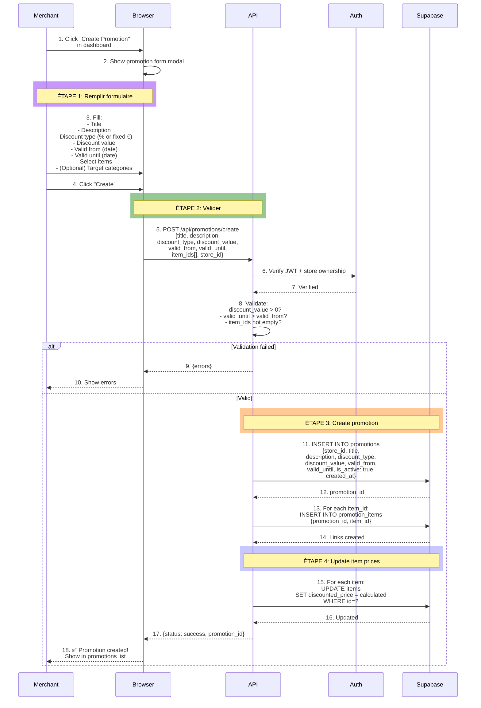
```mermaid
sequenceDiagram
    participant Merchant
    participant Browser
    participant API
    participant Auth
    participant Supabase

    Merchant->>Browser: 1. Click "Create Promotion"<br/>in dashboard
    Browser->>Browser: 2. Show promotion form modal
    
    rect rgb(200, 150, 255)
        Note over Browser,Merchant: ÉTAPE 1: Remplir formulaire
    end
    
    Merchant->>Browser: 3. Fill:<br/>- Title<br/>- Description<br/>- Discount type (% or fixed €)<br/>- Discount value<br/>- Valid from (date)<br/>- Valid until (date)<br/>- Select items<br/>- (Optional) Target categories
    
    Merchant->>Browser: 4. Click "Create"
    
    rect rgb(150, 200, 150)
        Note over Browser,API: ÉTAPE 2: Valider
    end
    
    Browser->>API: 5. POST /api/promotions/create<br/>{title, description,<br/>discount_type, discount_value,<br/>valid_from, valid_until,<br/>item_ids[], store_id}
    
    API->>Auth: 6. Verify JWT + store ownership
    Auth-->>API: 7. Verified
    
    API->>API: 8. Validate:<br/>- discount_value > 0?<br/>- valid_until > valid_from?<br/>- item_ids not empty?
    
    alt Validation failed
        API-->>Browser: 9. {errors}
        Browser-->>Merchant: 10. Show errors
        
    else Valid
        rect rgb(255, 200, 150)
            Note over API,Supabase: ÉTAPE 3: Create promotion
        end
        
        API->>Supabase: 11. INSERT INTO promotions<br/>{store_id, title,<br/>description, discount_type,<br/>discount_value, valid_from,<br/>valid_until, is_active: true,<br/>created_at}
        Supabase-->>API: 12. promotion_id
        
        API->>Supabase: 13. For each item_id:<br/>INSERT INTO promotion_items<br/>{promotion_id, item_id}
        Supabase-->>API: 14. Links created
        
        rect rgb(200, 200, 255)
            Note over API,Supabase: ÉTAPE 4: Update item prices
        end
        
        API->>Supabase: 15. For each item:<br/>UPDATE items<br/>SET discounted_price = calculated<br/>WHERE id=?
        Supabase-->>API: 16. Updated
        
        API-->>Browser: 17. {status: success, promotion_id}
        Browser-->>Merchant: 18. ✅ Promotion created!<br/>Show in promotions list
    end
```

---

## 19. Publier Stories & Reels

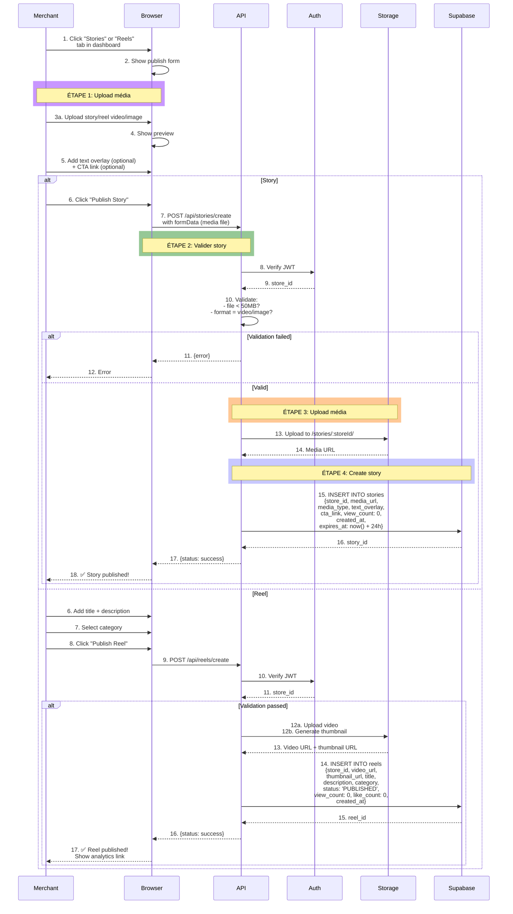
```mermaid
sequenceDiagram
    participant Merchant
    participant Browser
    participant API
    participant Auth
    participant Storage
    participant Supabase

    Merchant->>Browser: 1. Click "Stories" or "Reels"<br/>tab in dashboard
    Browser->>Browser: 2. Show publish form
    
    rect rgb(200, 150, 255)
        Note over Browser,Merchant: ÉTAPE 1: Upload média
    end
    
    Merchant->>Browser: 3a. Upload story/reel video/image
    Browser->>Browser: 4. Show preview
    Merchant->>Browser: 5. Add text overlay (optional)<br/>+ CTA link (optional)
    
    alt Story
        Merchant->>Browser: 6. Click "Publish Story"
        Browser->>API: 7. POST /api/stories/create<br/>with formData (media file)
        
        rect rgb(150, 200, 150)
            Note over Browser,API: ÉTAPE 2: Valider story
        end
        
        API->>Auth: 8. Verify JWT
        Auth-->>API: 9. store_id
        
        API->>API: 10. Validate:<br/>- file < 50MB?<br/>- format = video/image?
        
        alt Validation failed
            API-->>Browser: 11. {error}
            Browser-->>Merchant: 12. Error
            
        else Valid
            rect rgb(255, 200, 150)
                Note over API,Storage: ÉTAPE 3: Upload média
            end
            
            API->>Storage: 13. Upload to /stories/:storeId/
            Storage-->>API: 14. Media URL
            
            rect rgb(200, 200, 255)
                Note over API,Supabase: ÉTAPE 4: Create story
            end
            
            API->>Supabase: 15. INSERT INTO stories<br/>{store_id, media_url,<br/>media_type, text_overlay,<br/>cta_link, view_count: 0,<br/>created_at,<br/>expires_at: now() + 24h}
            Supabase-->>API: 16. story_id
            
            API-->>Browser: 17. {status: success}
            Browser-->>Merchant: 18. ✅ Story published!
        end
        
    else Reel
        Merchant->>Browser: 6. Add title + description
        Merchant->>Browser: 7. Select category
        Merchant->>Browser: 8. Click "Publish Reel"
        Browser->>API: 9. POST /api/reels/create
        
        API->>Auth: 10. Verify JWT
        Auth-->>API: 11. store_id
        
        alt Validation passed
            API->>Storage: 12a. Upload video<br/>12b. Generate thumbnail
            Storage-->>API: 13. Video URL + thumbnail URL
            
            API->>Supabase: 14. INSERT INTO reels<br/>{store_id, video_url,<br/>thumbnail_url, title,<br/>description, category,<br/>status: 'PUBLISHED',<br/>view_count: 0, like_count: 0,<br/>created_at}
            Supabase-->>API: 15. reel_id
            
            API-->>Browser: 16. {status: success}
            Browser-->>Merchant: 17. ✅ Reel published!<br/>Show analytics link
        end
    end
```

---

## 20. Gérer Avis Client

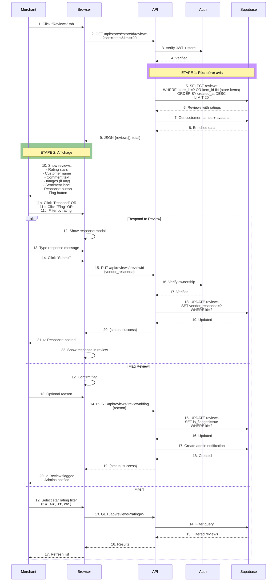
```mermaid
sequenceDiagram
    participant Merchant
    participant Browser
    participant API
    participant Auth
    participant Supabase

    Merchant->>Browser: 1. Click "Reviews" tab
    Browser->>API: 2. GET /api/stores/:storeId/reviews<br/>?sort=latest&limit=20
    
    API->>Auth: 3. Verify JWT + store
    Auth-->>API: 4. Verified
    
    rect rgb(200, 150, 255)
        Note over API,Supabase: ÉTAPE 1: Récupérer avis
    end
    
    API->>Supabase: 5. SELECT reviews<br/>WHERE store_id=? OR item_id IN (store items)<br/>ORDER BY created_at DESC<br/>LIMIT 20
    Supabase-->>API: 6. Reviews with ratings
    
    API->>Supabase: 7. Get customer names + avatars
    Supabase-->>API: 8. Enriched data
    
    API-->>Browser: 9. JSON {reviews[], total}
    
    rect rgb(150, 200, 150)
        Note over Browser,Merchant: ÉTAPE 2: Affichage
    end
    
    Browser-->>Merchant: 10. Show reviews:<br/>- Rating stars<br/>- Customer name<br/>- Comment text<br/>- Images (if any)<br/>- Sentiment label<br/>- Response button<br/>- Flag button
    
    Merchant->>Browser: 11a. Click "Respond" OR<br/>11b. Click "Flag" OR<br/>11c. Filter by rating
    
    alt Respond to Review
        Browser->>Browser: 12. Show response modal
        Merchant->>Browser: 13. Type response message
        Merchant->>Browser: 14. Click "Submit"
        
        Browser->>API: 15. PUT /api/reviews/:reviewId<br/>{vendor_response}
        
        API->>Auth: 16. Verify ownership
        Auth-->>API: 17. Verified
        
        API->>Supabase: 18. UPDATE reviews<br/>SET vendor_response=?<br/>WHERE id=?
        Supabase-->>API: 19. Updated
        
        API-->>Browser: 20. {status: success}
        Browser-->>Merchant: 21. ✅ Response posted!
        Browser->>Browser: 22. Show response in review
        
    else Flag Review
        Browser->>Browser: 12. Confirm flag
        Merchant->>Browser: 13. Optional reason
        Browser->>API: 14. POST /api/reviews/:reviewId/flag<br/>{reason}
        
        API->>Supabase: 15. UPDATE reviews<br/>SET is_flagged=true<br/>WHERE id=?
        Supabase-->>API: 16. Updated
        
        API->>Supabase: 17. Create admin notification
        Supabase-->>API: 18. Created
        
        API-->>Browser: 19. {status: success}
        Browser-->>Merchant: 20. ✅ Review flagged<br/>Admins notified
        
    else Filter
        Merchant->>Browser: 12. Select star rating filter<br/>(5★, 4★, 3★, etc.)
        Browser->>API: 13. GET /api/reviews?rating=5
        API->>Supabase: 14. Filter query
        Supabase-->>API: 15. Filtered reviews
        API-->>Browser: 16. Results
        Browser-->>Merchant: 17. Refresh list
    end
```

---

## 21. Gérer Abonnement (FREE/PRO/BUSINESS)

```mermaid
sequenceDiagram
    participant Merchant
    participant Browser
    participant API
    participant Auth
    participant Supabase
    participant Stripe

    Merchant->>Browser: 1. Click "Subscription"<br/>in settings
    Browser->>API: 2. GET /api/stores/:storeId/subscription
    
    API->>Auth: 3. Verify JWT + store
    Auth-->>API: 4. Verified
    
    rect rgb(200, 150, 255)
        Note over API,Supabase: ÉTAPE 1: Récupérer plan
    end
    
    API->>Supabase: 5. SELECT store<br/>WHERE id=?
    Supabase-->>API: 6. subscription_tier + plan_data
    
    API-->>Browser: 7. JSON {current_tier,<br/>features, billing_date,<br/>cancel_option}
    
    rect rgb(150, 200, 150)
        Note over Browser,Merchant: ÉTAPE 2: Affichage plans
    end
    
    Browser-->>Merchant: 8. Show subscription page:<br/>- Current plan card<br/>- Feature comparison table<br/>- Pricing for each tier<br/>- Upgrade/Downgrade buttons
    
    Merchant->>Browser: 9a. Click "Upgrade to PRO" OR<br/>9b. Click "Upgrade to BUSINESS" OR<br/>9c. Click "Cancel Subscription"
    
    alt Upgrade to PRO
        Browser->>API: 10. POST /api/subscriptions/upgrade<br/>{from_tier, to_tier: 'PRO'}
        
        API->>Auth: 11. Verify JWT
        Auth-->>API: 12. store_id
        
        API->>API: 13. Get PRO tier price<br/>(e.g., 5€/month)
        
        rect rgb(255, 200, 150)
            Note over API,Stripe: ÉTAPE 3: Stripe payment
        end
        
        API->>Stripe: 14. Create checkout session<br/>{price, quantity, metadata}
        Stripe-->>API: 15. session_id + checkout_url
        
        API-->>Browser: 16. {checkout_url}
        Browser-->>Merchant: 17. Redirect to Stripe checkout
        
        Merchant->>Stripe: 18. Enter payment info
        Stripe-->>Browser: 19. Payment result
        
        alt Payment success
            Stripe->>API: 20. Webhook: /webhooks/stripe<br/>{event: charge.succeeded}
            
            rect rgb(200, 200, 255)
                Note over API,Supabase: ÉTAPE 4: Update subscription
            end
            
            API->>Supabase: 21. UPDATE stores<br/>SET subscription_tier='PRO',<br/>subscription_end=now()+30d<br/>WHERE id=?
            Supabase-->>API: 22. Updated
            
            API->>Supabase: 23. INSERT INTO billing_records<br/>{store_id, tier, amount,<br/>payment_date, next_billing_date}
            Supabase-->>API: 24. Recorded
            
            API->>API: 25. Send confirmation email
            
            Browser-->>Merchant: 26. ✅ Upgraded to PRO!
            Browser->>Browser: 27. Refresh subscription page
            
        else Payment failed
            Stripe->>API: 20. Webhook: payment_intent.payment_failed
            API-->>Browser: 21. {error: payment_failed}
            Browser-->>Merchant: 22. Show error + retry
        end
        
    else Downgrade
        Browser->>Browser: 10. Show confirmation<br/>"Downgrade to FREE?"<br/>"You'll lose PRO features"
        Merchant->>Browser: 11. Confirm downgrade
        
        Browser->>API: 12. POST /api/subscriptions/downgrade<br/>{from_tier: 'PRO', to_tier: 'FREE'}
        
        API->>Supabase: 13. UPDATE stores<br/>SET subscription_tier='FREE'<br/>WHERE id=?
        Supabase-->>API: 14. Updated
        
        API-->>Browser: 15. {status: success}
        Browser-->>Merchant: 16. ✅ Downgraded to FREE
        
    else Cancel
        Browser->>Browser: 10. Show confirmation<br/>dialog
        Merchant->>Browser: 11. Optional feedback
        Browser->>API: 12. POST /api/subscriptions/cancel
        
        API->>Supabase: 13. UPDATE stores<br/>SET subscription_tier='FREE',<br/>subscription_end=NULL
        Supabase-->>API: 14. Updated
        
        API-->>Browser: 15. {status: success}
        Browser-->>Merchant: 16. ✅ Subscription cancelled
    end
```

---

## 22. Gérer Profil Magasin

```mermaid
sequenceDiagram
    participant Merchant
    participant Browser
    participant API
    participant Auth
    participant Supabase
    participant Storage

    Merchant->>Browser: 1. Click "Store Settings"<br/>in dashboard
    Browser->>API: 2. GET /api/stores/:storeId/profile
    
    API->>Auth: 3. Verify JWT + ownership
    Auth-->>API: 4. Verified
    
    rect rgb(200, 150, 255)
        Note over API,Supabase: ÉTAPE 1: Récupérer profil
    end
    
    API->>Supabase: 5. SELECT stores WHERE id=?
    Supabase-->>API: 6. Store data
    
    API-->>Browser: 7. JSON {name, description, logo,<br/>banner, address, city,<br/>phone, email, website,<br/>hours, ...}
    
    rect rgb(150, 200, 150)
        Note over Browser,Merchant: ÉTAPE 2: Affichage form
    end
    
    Browser-->>Merchant: 8. Show form with tabs:<br/>- Basic Info (name, phone, email)<br/>- Description<br/>- Location (address, city)<br/>- Media (logo, banner)<br/>- Hours<br/>- Social links
    
    Merchant->>Browser: 9. Edit fields
    
    alt Basic Info Edit
        Merchant->>Browser: 10. Change name/phone/email
        Merchant->>Browser: 11. Click "Save"
        
        Browser->>API: 12. PUT /api/stores/:storeId<br/>{name, phone, email}
        
        API->>Auth: 13. Verify ownership
        Auth-->>API: 14. Verified
        
        API->>Supabase: 15. UPDATE stores
        Supabase-->>API: 16. Updated
        
        API-->>Browser: 17. {status: success}
        Browser-->>Merchant: 18. ✅ Changes saved
        
    else Logo/Banner Upload
        Merchant->>Browser: 10. Click "Upload Logo"
        Merchant->>Browser: 11. Select image file
        
        Browser->>Storage: 12. Upload image
        Storage-->>Browser: 13. Image URL
        
        Browser->>API: 14. PUT /api/stores/:storeId<br/>{logo_url OR banner_url}
        
        API->>Supabase: 15. UPDATE stores
        Supabase-->>API: 16. Updated
        
        API-->>Browser: 17. Success
        Browser-->>Merchant: 18. Show new image
        
    else Edit Hours
        Merchant->>Browser: 10. Click "Edit Hours"
        Browser->>Browser: 11. Show time picker<br/>for each day
        Merchant->>Browser: 12. Set open/close times<br/>Mark days as closed
        Merchant->>Browser: 13. Save
        
        Browser->>API: 14. PUT /api/stores/:storeId<br/>{business_hours: {}}
        
        API->>Supabase: 15. UPDATE stores<br/>SET hours = JSON
        Supabase-->>API: 16. Updated
        
        API-->>Browser: 17. Success
        Browser-->>Merchant: 18. Hours saved
    end
```

---

# 👨‍💼 ADMIN FEATURES

## 23. Approuver/Rejeter Magasins

```mermaid
sequenceDiagram
    participant Admin
    participant Browser
    participant API
    participant Auth
    participant Supabase
    participant QStash

    Admin->>Browser: 1. Click "Store Approvals"<br/>in admin dashboard
    Browser->>API: 2. GET /api/admin/stores/pending
    
    API->>Auth: 3. Verify JWT + admin role
    Auth-->>API: 4. Verified as admin
    
    rect rgb(200, 150, 255)
        Note over API,Supabase: ÉTAPE 1: Récupérer magasins
    end
    
    API->>Supabase: 5. SELECT stores<br/>WHERE status='PENDING'<br/>ORDER BY created_at ASC
    Supabase-->>API: 6. Pending stores
    
    API->>Supabase: 7. For each store:<br/>- Get owner profile<br/>- Get verification checks
    Supabase-->>API: 8. Enriched data
    
    API-->>Browser: 9. JSON {stores[], total}
    
    rect rgb(150, 200, 150)
        Note over Browser,Admin: ÉTAPE 2: Affichage
    end
    
    Browser-->>Admin: 10. Show stores list:<br/>- Store name<br/>- Owner name<br/>- Category<br/>- Status badge<br/>- Submission date<br/>- Action buttons
    
    Admin->>Browser: 11. Click store for details
    Browser->>API: 12. GET /api/admin/stores/:storeId
    
    API->>Supabase: 13. Full store data
    Supabase-->>API: 14. Complete info
    
    API-->>Browser: 15. Detailed view
    Browser-->>Admin: 16. Show:<br/>- Logo + Banner<br/>- Description<br/>- Owner info<br/>- Address + Map<br/>- Approval checklist
    
    Admin->>Browser: 17a. Click "Approve" OR<br/>17b. Click "Reject"
    
    alt Approve Store
        Browser->>Browser: 18. Show confirmation
        Admin->>Browser: 19. Optional notes
        Admin->>Browser: 20. Click "Confirm Approve"
        
        Browser->>API: 21. POST /api/admin/stores/:storeId/approve<br/>{admin_notes}
        
        API->>Auth: 22. Verify admin
        Auth-->>API: 23. Verified
        
        rect rgb(255, 200, 150)
            Note over API,Supabase: ÉTAPE 3: Update status
        end
        
        API->>Supabase: 24. UPDATE stores<br/>SET status='APPROVED',<br/>approved_at=NOW(),<br/>approved_by=admin_id<br/>WHERE id=?
        Supabase-->>API: 25. Updated
        
        API->>QStash: 26. Send approval notification<br/>to store owner
        QStash-->>API: 27. Job queued
        
        API-->>Browser: 28. {status: success}
        Browser-->>Admin: 29. ✅ Store approved!
        Browser->>Browser: 30. Remove from list
        
    else Reject Store
        Browser->>Browser: 18. Show reject modal
        Admin->>Browser: 19. Select rejection reason<br/>- Invalid business info<br/>- Missing documents<br/>- Policy violation<br/>- Other<br/>+ mandatory notes
        Admin->>Browser: 20. Click "Reject"
        
        Browser->>API: 21. POST /api/admin/stores/:storeId/reject<br/>{rejection_reason, notes}
        
        API->>Auth: 22. Verify admin
        Auth-->>API: 23. Verified
        
        API->>Supabase: 24. UPDATE stores<br/>SET status='REJECTED',<br/>rejection_reason=?,<br/>rejected_at=NOW(),<br/>rejected_by=admin_id
        Supabase-->>API: 25. Updated
        
        API->>QStash: 26. Send rejection email<br/>with reason + reapplication instructions
        QStash-->>API: 27. Job queued
        
        API-->>Browser: 28. {status: success}
        Browser-->>Admin: 29. ✅ Store rejected<br/>Owner notified
        Browser->>Browser: 30. Remove from list
    end
```

---

## 24. Modérer Avis Suspects

```mermaid
sequenceDiagram
    participant Admin
    participant Browser
    participant API
    participant Auth
    participant Supabase

    Admin->>Browser: 1. Click "Reviews Moderation"
    Browser->>API: 2. GET /api/admin/reviews/flagged<br/>?limit=20&sort=recent
    
    API->>Auth: 3. Verify admin
    Auth-->>API: 4. Verified
    
    rect rgb(200, 150, 255)
        Note over API,Supabase: ÉTAPE 1: Récupérer avis flaggés
    end
    
    API->>Supabase: 5. SELECT reviews<br/>WHERE is_flagged=true<br/>AND moderation_status IS NULL<br/>ORDER BY flagged_at DESC
    Supabase-->>API: 6. Flagged reviews
    
    API->>Supabase: 7. For each review:<br/>- Get customer + store info<br/>- Get flag reasons<br/>- Get order verification
    Supabase-->>API: 8. Enriched data
    
    API-->>Browser: 9. JSON {reviews[], total}
    
    rect rgb(150, 200, 150)
        Note over Browser,Admin: ÉTAPE 2: Affichage
    end
    
    Browser-->>Admin: 10. Show flagged reviews list:<br/>- Rating stars<br/>- Comment preview<br/>- Flag reason<br/>- Customer name<br/>- Date flagged<br/>- Moderation buttons
    
    Admin->>Browser: 11. Click review for details
    Browser->>API: 12. GET /api/admin/reviews/:reviewId
    
    API->>Supabase: 13. Full review data
    Supabase-->>API: 14. All details
    
    API-->>Browser: 15. Detailed view
    Browser-->>Admin: 16. Show:<br/>- Full comment text<br/>- Images (if any)<br/>- Sentiment analysis<br/>- Verified purchase status<br/>- Flag reasons list<br/>- Moderation options
    
    Admin->>Browser: 17a. Click "Approve Review" OR<br/>17b. Click "Remove Review"
    
    alt Approve Review
        Browser->>Browser: 18. Confirm approval
        Admin->>Browser: 19. Click "Approve"
        
        Browser->>API: 20. PUT /api/admin/reviews/:reviewId<br/>{moderation_action: 'APPROVE'}
        
        API->>Supabase: 21. UPDATE reviews<br/>SET is_flagged=false,<br/>moderation_status='APPROVED',<br/>moderation_reason=NULL,<br/>moderated_at=NOW(),<br/>moderated_by=admin_id
        Supabase-->>API: 22. Updated
        
        API-->>Browser: 23. {status: success}
        Browser-->>Admin: 24. ✅ Review approved
        Browser->>Browser: 25. Remove from flagged list
        
    else Remove Review
        Browser->>Browser: 18. Show remove modal
        Admin->>Browser: 19. Select violation type<br/>- Spam/Fake review<br/>- Inappropriate content<br/>- Competitor sabotage<br/>- Policy violation
        Admin->>Browser: 20. Optional admin notes
        Admin->>Browser: 21. Click "Remove"
        
        Browser->>API: 22. DELETE /api/admin/reviews/:reviewId<br/>{reason, notes}
        
        API->>Supabase: 23a. UPDATE reviews<br/>SET is_flagged=false,<br/>moderation_status='REMOVED',<br/>removal_reason=?<br/>23b. INSERT INTO review_removals<br/>(audit trail)
        Supabase-->>API: 24. Updated + logged
        
        API->>Supabase: 25. Recalculate store/item ratings
        Supabase-->>API: 26. Updated
        
        API-->>Browser: 27. {status: success}
        Browser-->>Admin: 28. ✅ Review removed<br/>Ratings recalculated
        Browser->>Browser: 29. Remove from list
    end
```

---

## 25. Suspendre Utilisateurs

```mermaid
sequenceDiagram
    participant Admin
    participant Browser
    participant API
    participant Auth
    participant Supabase
    participant QStash

    Admin->>Browser: 1. Click "User Management"
    Browser->>API: 2. GET /api/admin/users<br/>?search=&status=active&limit=20
    
    API->>Auth: 3. Verify admin
    Auth-->>API: 4. Verified
    
    rect rgb(200, 150, 255)
        Note over API,Supabase: ÉTAPE 1: Récupérer users
    end
    
    API->>Supabase: 5. SELECT users + profiles<br/>WHERE status='ACTIVE'<br/>LIMIT 20
    Supabase-->>API: 6. Users list
    
    API-->>Browser: 7. JSON {users[], total}
    
    rect rgb(150, 200, 150)
        Note over Browser,Admin: ÉTAPE 2: Affichage
    end
    
    Browser-->>Admin: 8. Show users table:<br/>- Email<br/>- Name<br/>- Role<br/>- Status<br/>- Created date<br/>- Action buttons
    
    Admin->>Browser: 9a. Search user OR<br/>9b. Click user row
    
    alt Search
        Admin->>Browser: 10. Type email/name
        Browser->>API: 11. GET /api/admin/users?search=:term
        API->>Supabase: 12. ILIKE query
        Supabase-->>API: 13. Results
        API-->>Browser: 14. Filtered users
        Browser-->>Admin: 15. Show results
        
    else View User Details
        Browser->>API: 10. GET /api/admin/users/:userId
        API->>Supabase: 11. Full user data<br/>+ activity history
        Supabase-->>API: 12. User details
        
        API-->>Browser: 13. JSON
        Browser-->>Admin: 14. Show:<br/>- Profile info<br/>- Email<br/>- Role<br/>- Status<br/>- Account created date<br/>- Last activity<br/>- Orders/Reviews count<br/>- Action buttons
        
        Admin->>Browser: 15a. Click "Suspend" OR<br/>15b. Click "Delete"
        
        alt Suspend User
            Browser->>Browser: 16. Show suspension modal
            Admin->>Browser: 17. Select duration<br/>- 7 days<br/>- 30 days<br/>- Permanent
            Admin->>Browser: 18. Enter reason<br/>- Spam behavior<br/>- Offensive reviews<br/>- Policy violation<br/>- Other
            Admin->>Browser: 19. Click "Suspend"
            
            Browser->>API: 20. POST /api/admin/users/:userId/suspend<br/>{duration, reason}
            
            API->>Supabase: 21. UPDATE users<br/>SET status='SUSPENDED',<br/>suspended_until=calculated,<br/>suspension_reason=?,<br/>suspended_by=admin_id,<br/>suspended_at=NOW()
            Supabase-->>API: 22. Updated
            
            API->>QStash: 23. Send suspension notice<br/>to user email
            QStash-->>API: 24. Job queued
            
            API-->>Browser: 25. {status: success}
            Browser-->>Admin: 26. ✅ User suspended
            
        else Delete Account
            Browser->>Browser: 16. Show delete confirmation<br/>WARNING: Permanent action
            Admin->>Browser: 17. Confirm deletion
            Browser->>API: 18. DELETE /api/admin/users/:userId<br/>{reason}
            
            API->>Supabase: 19. Mark user deleted<br/>UPDATE users SET status='DELETED'<br/>(soft delete - preserve data)
            Supabase-->>API: 20. Updated
            
            API->>Supabase: 21. Anonymize user data<br/>- Email → deleted<br/>- Profile → deleted<br/>- Messages → preserved<br/>- Reviews → preserved (anonymized)
            Supabase-->>API: 22. Anonymized
            
            API->>QStash: 23. Send deletion confirmation
            QStash-->>API: 24. Queued
            
            API-->>Browser: 25. {status: success}
            Browser-->>Admin: 26. ✅ User deleted
        end
    end
```

---

## 26. Voir Analytics Globales

```mermaid
sequenceDiagram
    participant Admin
    participant Browser
    participant API
    participant Auth
    participant Supabase

    Admin->>Browser: 1. Click "Global Analytics"<br/>in admin dashboard
    Browser->>API: 2. GET /api/admin/analytics<br/>?period=30d
    
    API->>Auth: 3. Verify admin role
    Auth-->>API: 4. Verified
    
    rect rgb(200, 150, 255)
        Note over API,Supabase: ÉTAPE 1: Calculer KPIs globaux
    end
    
    API->>Supabase: 5a. SELECT COUNT(DISTINCT id)<br/>FROM users WHERE status='ACTIVE'
    Supabase-->>API: 5b. Total active users
    
    API->>Supabase: 6a. SELECT COUNT(*) FROM stores<br/>WHERE status='APPROVED'
    Supabase-->>API: 6b. Total active stores
    
    API->>Supabase: 7a. SELECT COUNT(*) FROM orders<br/>WHERE status='COMPLETED'<br/>AND created_at >= ?
    Supabase-->>API: 7b. Total completed orders
    
    API->>Supabase: 8a. SELECT SUM(total_price)<br/>FROM orders WHERE status='COMPLETED'<br/>AND created_at >= ?
    Supabase-->>API: 8b. Total platform revenue
    
    API->>Supabase: 9a. SELECT AVG(rating)<br/>FROM reviews
    Supabase-->>API: 9b. Average platform rating
    
    API->>Supabase: 10a. SELECT COUNT(*) FROM reviews<br/>WHERE created_at >= ?
    Supabase-->>API: 10b. Total reviews count
    
    rect rgb(150, 200, 150)
        Note over API,Supabase: ÉTAPE 2: Trends & segmentation
    end
    
    API->>Supabase: 11. Revenue by category
    API->>Supabase: 12. Revenue by city
    API->>Supabase: 13. Users by role (client/merchant)
    API->>Supabase: 14. Order status distribution
    
    Supabase-->>API: 15. All trend data
    
    API->>API: 16. Calculate vs previous period:<br/>- % growth users<br/>- % growth revenue<br/>- % growth orders
    
    API-->>Browser: 17. JSON {kpis, trends, segments}
    
    rect rgb(200, 200, 255)
        Note over Browser,Admin: ÉTAPE 3: Affichage dashboards
    end
    
    Browser-->>Admin: 18. Show dashboard with:<br/>- Total users card<br/>- Total stores card<br/>- Total revenue card<br/>- Total orders card<br/>- Avg rating card
    
    Browser-->>Admin: 19. Show graphs:<br/>- Revenue trend (30d)<br/>- Orders trend (30d)<br/>- Users signup trend<br/>- Revenue by category<br/>- Top stores by revenue
    
    Admin->>Browser: 20a. Change period filter OR<br/>20b. Export report OR<br/>20c. View detailed breakdown
    
    alt Change Period
        Admin->>Browser: 21. Select period<br/>(7d, 30d, 90d, 1y)
        Browser->>API: 22. GET /api/admin/analytics?period=7d
        API->>Supabase: 23. Recalculate with new range
        Supabase-->>API: 24. Updated metrics
        API-->>Browser: 25. JSON
        Browser-->>Admin: 26. Refresh charts
        
    else Export
        Admin->>Browser: 21. Click "Export PDF/CSV"
        Browser->>API: 22. GET /api/admin/analytics/export?format=pdf
        API->>API: 23. Generate report<br/>(with all metrics)
        API-->>Browser: 24. PDF/CSV file
        Browser-->>Admin: 25. Download
    end
```

---

## 27. Gérer Catégories

```mermaid
sequenceDiagram
    participant Admin
    participant Browser
    participant API
    participant Auth
    participant Supabase
    participant Storage

    Admin->>Browser: 1. Click "Categories"<br/>in admin settings
    Browser->>API: 2. GET /api/admin/categories
    
    API->>Auth: 3. Verify admin
    Auth-->>API: 4. Verified
    
    rect rgb(200, 150, 255)
        Note over API,Supabase: ÉTAPE 1: Récupérer catégories
    end
    
    API->>Supabase: 5. SELECT * FROM categories<br/>ORDER BY display_order ASC
    Supabase-->>API: 6. All categories
    
    API-->>Browser: 7. JSON {categories[], total}
    
    rect rgb(150, 200, 150)
        Note over Browser,Admin: ÉTAPE 2: Affichage
    end
    
    Browser-->>Admin: 8. Show categories list:<br/>- Category name<br/>- Icon/Image<br/>- Item count<br/>- Status<br/>- Display order<br/>- Action buttons
    
    Admin->>Browser: 9a. Click "Add Category" OR<br/>9b. Click "Edit" OR<br/>9c. Drag to reorder
    
    alt Add Category
        Browser->>Browser: 10. Show add modal
        Admin->>Browser: 11. Enter:<br/>- Category name<br/>- Description<br/>- Upload icon/image<br/>- Set display order
        Admin->>Browser: 12. Click "Create"
        
        Browser->>API: 13. POST /api/admin/categories<br/>{name, description,<br/>icon, display_order}
        
        API->>Auth: 14. Verify admin
        Auth-->>API: 15. Verified
        
        alt Icon upload
            Browser->>Storage: 16. Upload icon
            Storage-->>Browser: 17. Icon URL
            Browser->>API: 18. POST with icon_url
        else No upload
            Browser->>API: 18. POST without icon
        end
        
        API->>Supabase: 19. INSERT INTO categories<br/>{name, description,<br/>icon_url, display_order}
        Supabase-->>API: 20. category_id
        
        API-->>Browser: 21. {status: success}
        Browser-->>Admin: 22. ✅ Category created
        Browser->>Browser: 23. Add to list
        
    else Edit
        Browser->>Browser: 10. Show edit modal
        Admin->>Browser: 11. Edit fields
        Admin->>Browser: 12. Click "Save"
        
        Browser->>API: 13. PUT /api/admin/categories/:categoryId<br/>{...updates}
        
        API->>Supabase: 14. UPDATE categories
        Supabase-->>API: 15. Updated
        
        API-->>Browser: 16. Success
        Browser-->>Admin: 17. ✅ Category updated
        Browser->>Browser: 18. Refresh list
        
    else Reorder
        Admin->>Browser: 10. Drag category item
        Browser->>Browser: 11. Drop in new position
        Browser->>API: 12. PUT /api/admin/categories/reorder<br/>{order: [{id, position}...]}
        
        API->>Supabase: 13. UPDATE display_order<br/>for multiple categories
        Supabase-->>API: 14. Updated
        
        API-->>Browser: 15. Success
        Browser-->>Admin: 16. ✅ Order saved
        Browser->>Browser: 17. Refresh display
    end
```

---

## 28. Gérer Paramètres Système

```mermaid
sequenceDiagram
    participant Admin
    participant Browser
    participant API
    participant Auth
    participant Supabase

    Admin->>Browser: 1. Click "System Settings"
    Browser->>API: 2. GET /api/admin/settings
    
    API->>Auth: 3. Verify admin
    Auth-->>API: 4. Verified
    
    rect rgb(200, 150, 255)
        Note over API,Supabase: ÉTAPE 1: Récupérer settings
    end
    
    API->>Supabase: 5. SELECT * FROM system_settings
    Supabase-->>API: 6. All settings
    
    API-->>Browser: 7. JSON {settings}
    
    rect rgb(150, 200, 150)
        Note over Browser,Admin: ÉTAPE 2: Affichage par sections
    end
    
    Browser-->>Admin: 8. Show tabs:<br/>- Platform Settings<br/>- Payment Config<br/>- Email Config<br/>- AI/LLM Config<br/>- Notification Rules<br/>- Rate Limits
    
    alt Platform Settings Tab
        Browser-->>Admin: 9. Show fields:<br/>- Platform name<br/>- Platform URL<br/>- Support email<br/>- Privacy policy URL<br/>- Terms URL<br/>- Commission rate (%)
        
        Admin->>Browser: 10. Edit fields
        Admin->>Browser: 11. Click "Save"
        
        Browser->>API: 12. PUT /api/admin/settings/platform<br/>{...settings}
        
        API->>Supabase: 13. UPDATE system_settings<br/>WHERE setting_key IN (...)
        Supabase-->>API: 14. Updated
        
        API-->>Browser: 15. Success
        Browser-->>Admin: 16. ✅ Settings saved
        
    else Payment Config Tab
        Browser-->>Admin: 9. Show:<br/>- Stripe API key<br/>- Stripe secret (masked)<br/>- Telnet gateway URL<br/>- Telnet credentials<br/>- Webhook URLs
        
        Admin->>Browser: 10. Update payment methods
        Admin->>Browser: 11. Test connection button
        
        Browser->>API: 12a. PUT /api/admin/settings/payments OR<br/>12b. GET /api/admin/settings/test-payment
        
        alt Test connection
            API->>API: 13. Test payment gateway<br/>connection
            API-->>Browser: 14. {status: connected/failed}
            Browser-->>Admin: 15. Show test result
            
        else Save settings
            API->>Supabase: 13. UPDATE settings<br/>(encrypted values)
            Supabase-->>API: 14. Saved
            API-->>Browser: 15. Success
            Browser-->>Admin: 16. ✅ Payment config updated
        end
        
    else Email Config Tab
        Browser-->>Admin: 9. Show:<br/>- Email provider (Resend)<br/>- API key<br/>- From address<br/>- Support email<br/>- Test send button
        
        Admin->>Browser: 10. Update settings
        Admin->>Browser: 11. Click "Test Send"
        
        Browser->>API: 12. POST /api/admin/settings/test-email<br/>{recipient}
        
        API->>API: 13. Send test email
        API-->>Browser: 14. {status: sent/failed}
        Browser-->>Admin: 15. Show result
        
    else Notification Rules Tab
        Browser-->>Admin: 9. Show:<br/>- Email notifications (on/off)<br/>- Push notifications (on/off)<br/>- SMS notifications (on/off)<br/>- Notification templates
        
        Admin->>Browser: 10. Enable/disable channels
        Admin->>Browser: 11. Click "Save"
        
        Browser->>API: 12. PUT /api/admin/settings/notifications
        API->>Supabase: 13. UPDATE settings
        Supabase-->>API: 14. Updated
        API-->>Browser: 15. Success
        Browser-->>Admin: 16. ✅ Notification config updated
    end
```

---

## 29. Exporter Données

```mermaid
sequenceDiagram
    participant Admin
    participant Browser
    participant API
    participant Auth
    participant Supabase

    Admin->>Browser: 1. Click "Data Export"<br/>in admin tools
    Browser->>API: 2. GET /api/admin/export-options
    
    API->>Auth: 3. Verify admin
    Auth-->>API: 4. Verified
    
    rect rgb(200, 150, 255)
        Note over Browser,Admin: ÉTAPE 1: Sélectionner données
    end
    
    Browser-->>Admin: 5. Show export form:<br/>- Select data to export:<br/>  ☑ Users<br/>  ☑ Stores<br/>  ☑ Items<br/>  ☑ Orders<br/>  ☑ Reviews<br/>  ☑ Transactions<br/>  ☑ Bookings<br/>- Date range picker<br/>- Export format (CSV/JSON/Excel)
    
    Admin->>Browser: 6. Select users + orders + reviews
    Admin->>Browser: 7. Select date range (2026-01-01 to 2026-04-25)
    Admin->>Browser: 8. Select format CSV
    Admin->>Browser: 9. Click "Export"
    
    rect rgb(150, 200, 150)
        Note over Browser,API: ÉTAPE 2: Valider & préparer
    end
    
    Browser->>API: 10. POST /api/admin/export<br/>{entities: ['users','orders','reviews'],<br/>date_range: {from, to},<br/>format: 'csv'}
    
    API->>Auth: 11. Verify admin
    Auth-->>API: 12. Verified
    
    API->>API: 13. Validate:<br/>- export size < 500MB?<br/>- valid entities?<br/>- valid date range?
    
    alt Validation failed
        API-->>Browser: 14. {error: reason}
        Browser-->>Admin: 15. Error message
        
    else Valid
        rect rgb(255, 200, 150)
            Note over API,Supabase: ÉTAPE 3: Récupérer & traiter données
        end
        
        API->>Supabase: 14a. SELECT users (all columns)
        API->>Supabase: 14b. SELECT orders WHERE created_at IN range
        API->>Supabase: 14c. SELECT reviews WHERE created_at IN range
        
        Supabase-->>API: 15a-c. Data returned
        
        API->>API: 16. Process data:<br/>- Anonymize sensitive fields<br/>- Convert to CSV format<br/>- Compress (gzip)
        
        API->>API: 17. Generate file<br/>filename: export_20260425_users_orders.csv
        
        rect rgb(200, 200, 255)
            Note over API,Browser: ÉTAPE 4: Deliver file
        end
        
        API-->>Browser: 18. {status: success,<br/>download_url, file_size,<br/>rows_exported}
        
        Browser-->>Admin: 19. Show success:<br/>- File size<br/>- Rows exported count<br/>- Download link
        
        Admin->>Browser: 20. Click "Download"
        Browser-->>Admin: 21. File downloaded<br/>export_20260425.csv
        
        API->>Supabase: 22. INSERT INTO export_logs<br/>{admin_id, entities,<br/>date_range, format,<br/>rows_count, exported_at}
        Supabase-->>API: 23. Logged for audit
    end
```

---

## 📊 Résumé Complet

| # | Feature | Acteur | Endpoints Clés | Étapes |
|---|---------|--------|---|---|
| 1 | Recherche Produits | Client | `POST /search` | 4 (Dict, Normalize, Enrich, Search) |
| 2 | Navigation Magasins | Client | `GET /stores/nearby` | 3 |
| 3 | Consulter Détails | Client | `GET /items/:id` | 3 |
| 4 | Ajouter Favoris | Client | `POST /favorites/toggle` | 2 |
| 5 | Commander | Client | `POST /orders/create` | 3 |
| 6 | Réserver | Client | `POST /bookings/create` | 3 |
| 7 | Paiement | Client | `POST /payments/confirm` | 3 (Stripe/Telnet) |
| 8 | Historique | Client | `GET /orders/my-orders` | 3 |
| 9 | Laisser Avis | Client | `POST /reviews/create` | 5 (Validation, Upload, AI, Stats) |
| 10 | Message | Client | `POST /messages/send` | 4 |
| 11 | Profil Client | Client | `PUT /profile` | 3 |
| 12 | Créer Magasin | Merchant | `POST /stores/create` | 5 |
| 13 | Ajouter Items | Merchant | `POST /items/create` | 4 |
| 14 | Gérer Inventory | Merchant | `GET/PUT/DELETE /items` | 4 |
| 15 | Accepter Commandes | Merchant | `POST /orders/validate` | 4 |
| 16 | Scanner QR | Merchant | `POST /transactions/validate-qr` | 4 |
| 17 | Analytics | Merchant | `GET /analytics` | 3 |
| 18 | Promotions | Merchant | `POST /promotions/create` | 3 |
| 19 | Stories/Reels | Merchant | `POST /stories/create` | 4 |
| 20 | Gérer Avis | Merchant | `PUT/POST /reviews/:id` | 3 |
| 21 | Abonnement | Merchant | `POST /subscriptions/upgrade` | 4 |
| 22 | Profil Magasin | Merchant | `PUT /stores/:id` | 3 |
| 23 | Approuver Magasins | Admin | `POST /admin/stores/approve` | 3 |
| 24 | Modérer Avis | Admin | `PUT /admin/reviews/:id` | 2 |
| 25 | Suspendre Users | Admin | `POST /admin/users/suspend` | 2 |
| 26 | Analytics Global | Admin | `GET /admin/analytics` | 3 |
| 27 | Gérer Catégories | Admin | `CRUD /admin/categories` | 3 |
| 28 | Paramètres Système | Admin | `PUT /admin/settings` | 5 tabs |
| 29 | Exporter Données | Admin | `POST /admin/export` | 4 |

---

## 🔗 Flux Intégration

Les diagrammes incluent:
- ✅ Validation à chaque étape
- ✅ Gestion des erreurs (alt blocks)
- ✅ Intégration services externes (Groq, Gemini, Stripe, Telnet, QStash)
- ✅ Notifications async (QStash)
- ✅ Logging & audit trails
- ✅ Rate limiting & security checks

---

**Version:** 2.0 - Complet  
**Date:** Avril 2026  
**Status:** ✅ Production Ready  
**Format:** Mermaid Sequence Diagrams
