# 🎯 DIAGRAMMES DE SÉQUENCE - VERSION MERMAID

## 1️⃣ INSCRIPTION (SIGNUP)

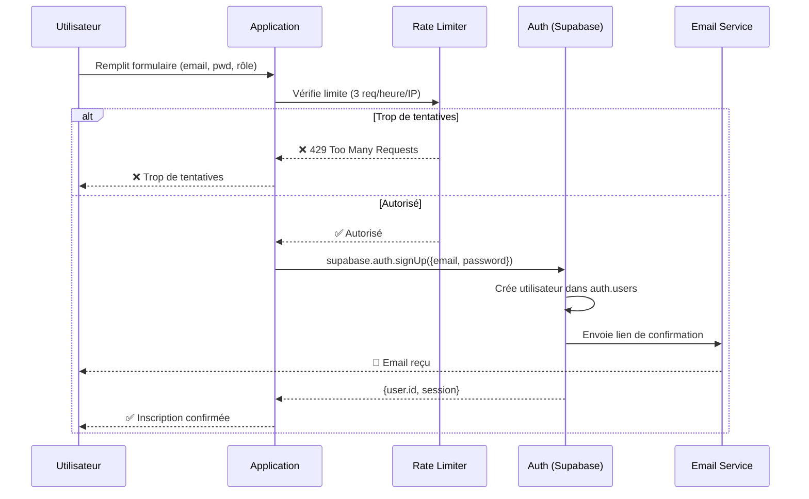
```mermaid
sequenceDiagram
    participant User as Utilisateur
    participant App as Application
    participant RL as Rate Limiter
    participant Auth as Auth (Supabase)
    participant Email as Email Service

    User->>App: Remplit formulaire (email, pwd, rôle)
    App->>RL: Vérifie limite (3 req/heure/IP)
    alt Trop de tentatives
        RL-->>App: ❌ 429 Too Many Requests
        App-->>User: ❌ Trop de tentatives
    else Autorisé
        RL-->>App: ✅ Autorisé
        App->>Auth: supabase.auth.signUp({email, password})
        Auth->>Auth: Crée utilisateur dans auth.users
        Auth->>Email: Envoie lien de confirmation
        Email-->>User: 📧 Email reçu
        Auth-->>App: {user.id, session}
        App-->>User: ✅ Inscription confirmée
    end
```

---

## 2️⃣ CONNEXION (LOGIN)

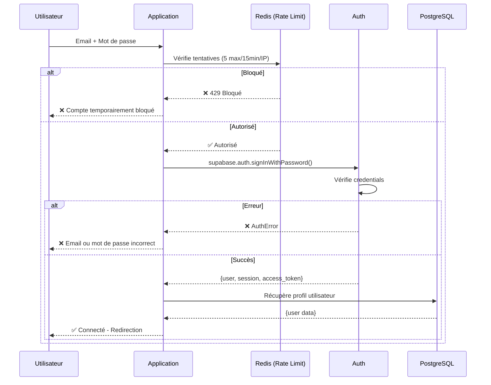
```mermaid
sequenceDiagram
    participant User as Utilisateur
    participant App as Application
    participant Redis as Redis (Rate Limit)
    participant Auth as Auth
    participant DB as PostgreSQL

    User->>App: Email + Mot de passe
    App->>Redis: Vérifie tentatives (5 max/15min/IP)
    alt Bloqué
        Redis-->>App: ❌ 429 Bloqué
        App-->>User: ❌ Compte temporairement bloqué
    else Autorisé
        Redis-->>App: ✅ Autorisé
        App->>Auth: supabase.auth.signInWithPassword()
        Auth->>Auth: Vérifie credentials
        alt Erreur
            Auth-->>App: ❌ AuthError
            App-->>User: ❌ Email ou mot de passe incorrect
        else Succès
            Auth-->>App: {user, session, access_token}
            App->>DB: Récupère profil utilisateur
            DB-->>App: {user data}
            App-->>User: ✅ Connecté - Redirection
        end
    end
```

---

## 3️⃣ RÉCUPÉRATION MOT DE PASSE

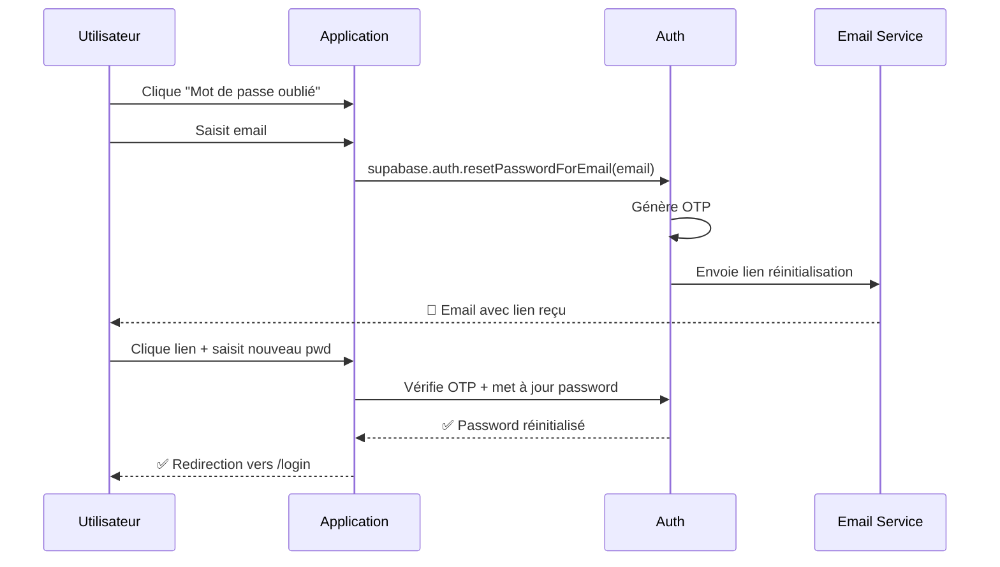
```mermaid
sequenceDiagram
    participant User as Utilisateur
    participant App as Application
    participant Auth as Auth
    participant Email as Email Service

    User->>App: Clique "Mot de passe oublié"
    User->>App: Saisit email
    App->>Auth: supabase.auth.resetPasswordForEmail(email)
    Auth->>Auth: Génère OTP
    Auth->>Email: Envoie lien réinitialisation
    Email-->>User: 📧 Email avec lien reçu
    User->>App: Clique lien + saisit nouveau pwd
    App->>Auth: Vérifie OTP + met à jour password
    Auth-->>App: ✅ Password réinitialisé
    App-->>User: ✅ Redirection vers /login
```

---

## 4️⃣ CRÉATION ÉTABLISSEMENT (COMMERÇANT)

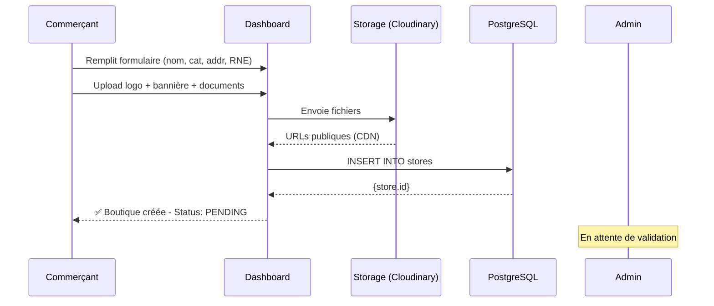
```mermaid
sequenceDiagram
    participant Pro as Commerçant
    participant App as Dashboard
    participant Storage as Storage (Cloudinary)
    participant DB as PostgreSQL
    participant Admin as Admin

    Pro->>App: Remplit formulaire (nom, cat, addr, RNE)
    Pro->>App: Upload logo + bannière + documents
    App->>Storage: Envoie fichiers
    Storage-->>App: URLs publiques (CDN)
    App->>DB: INSERT INTO stores
    DB-->>App: {store.id}
    App-->>Pro: ✅ Boutique créée - Status: PENDING
    Note over Admin: En attente de validation
```

---

## 5️⃣ APPROBATION BOUTIQUE (ADMIN)

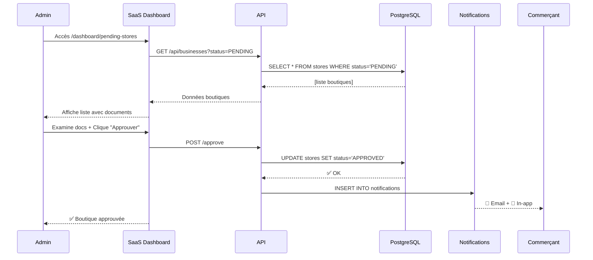
```mermaid
sequenceDiagram
    participant Admin
    participant SAAS as SaaS Dashboard
    participant API
    participant DB as PostgreSQL
    participant Notif as Notifications
    participant Pro as Commerçant

    Admin->>SAAS: Accès /dashboard/pending-stores
    SAAS->>API: GET /api/businesses?status=PENDING
    API->>DB: SELECT * FROM stores WHERE status='PENDING'
    DB-->>API: [liste boutiques]
    API-->>SAAS: Données boutiques
    SAAS-->>Admin: Affiche liste avec documents
    Admin->>SAAS: Examine docs + Clique "Approuver"
    SAAS->>API: POST /approve
    API->>DB: UPDATE stores SET status='APPROVED'
    DB-->>API: ✅ OK
    API->>Notif: INSERT INTO notifications
    Notif-->>Pro: 📧 Email + 🔔 In-app
    SAAS-->>Admin: ✅ Boutique approuvée
```

---

## 6️⃣ CRÉATION COMMANDE (CLIENT)

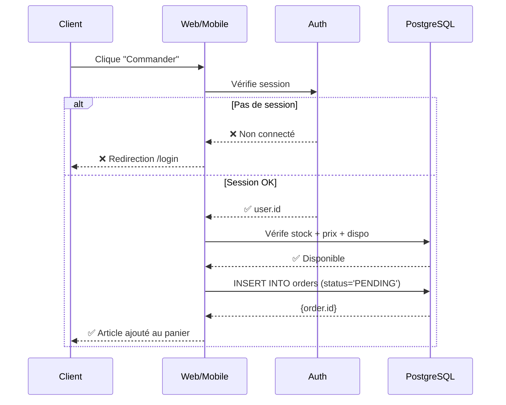
```mermaid
sequenceDiagram
    participant Client
    participant App as Web/Mobile
    participant Auth
    participant DB as PostgreSQL

    Client->>App: Clique "Commander"
    App->>Auth: Vérifie session
    alt Pas de session
        Auth-->>App: ❌ Non connecté
        App-->>Client: ❌ Redirection /login
    else Session OK
        Auth-->>App: ✅ user.id
        App->>DB: Vérife stock + prix + dispo
        DB-->>App: ✅ Disponible
        App->>DB: INSERT INTO orders (status='PENDING')
        DB-->>App: {order.id}
        App-->>Client: ✅ Article ajouté au panier
    end
```

---

## 7️⃣ VALIDATION COMMANDE & QR CODE

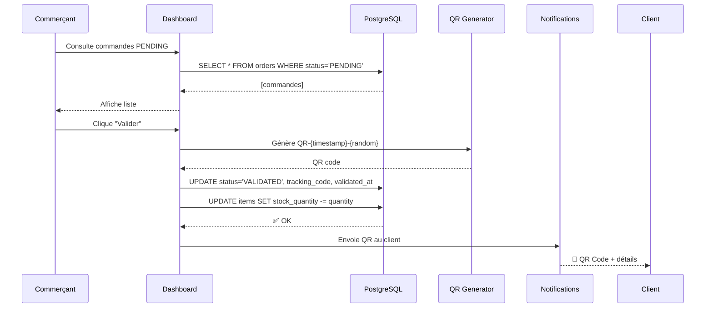
```mermaid
sequenceDiagram
    participant Pro as Commerçant
    participant DASH as Dashboard
    participant DB as PostgreSQL
    participant QR as QR Generator
    participant Notif as Notifications
    participant Client

    Pro->>DASH: Consulte commandes PENDING
    DASH->>DB: SELECT * FROM orders WHERE status='PENDING'
    DB-->>DASH: [commandes]
    DASH-->>Pro: Affiche liste
    Pro->>DASH: Clique "Valider"
    DASH->>QR: Génère QR-{timestamp}-{random}
    QR-->>DASH: QR code
    DASH->>DB: UPDATE status='VALIDATED', tracking_code, validated_at
    DASH->>DB: UPDATE items SET stock_quantity -= quantity
    DB-->>DASH: ✅ OK
    DASH->>Notif: Envoie QR au client
    Notif-->>Client: 🔔 QR Code + détails
```

---

## 8️⃣ SCAN QR CODE À LIVRAISON

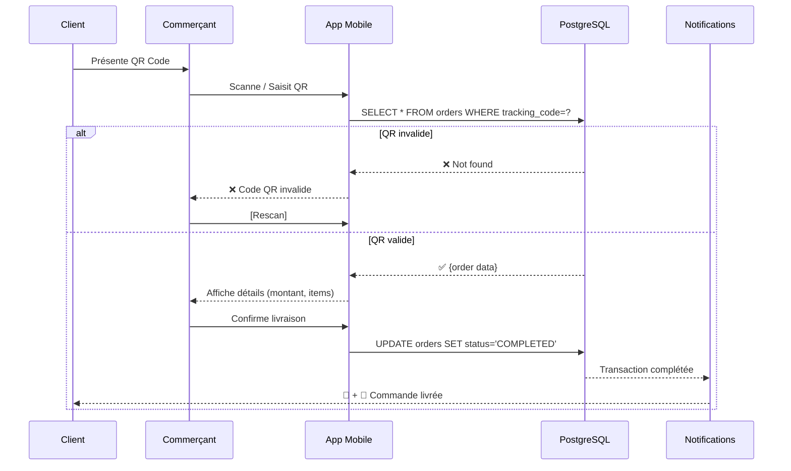
```mermaid
sequenceDiagram
    participant Client
    participant Pro as Commerçant
    participant App as App Mobile
    participant DB as PostgreSQL
    participant Notif as Notifications

    Client->>Pro: Présente QR Code
    Pro->>App: Scanne / Saisit QR
    App->>DB: SELECT * FROM orders WHERE tracking_code=?
    alt QR invalide
        DB-->>App: ❌ Not found
        App-->>Pro: ❌ Code QR invalide
        Pro->>App: [Rescan]
    else QR valide
        DB-->>App: ✅ {order data}
        App-->>Pro: Affiche détails (montant, items)
        Pro->>App: Confirme livraison
        App->>DB: UPDATE orders SET status='COMPLETED'
        DB-->>Notif: Transaction complétée
        Notif-->>Client: 📧 + 🔔 Commande livrée
    end
```

---

## 9️⃣ ANNULATION COMMANDE

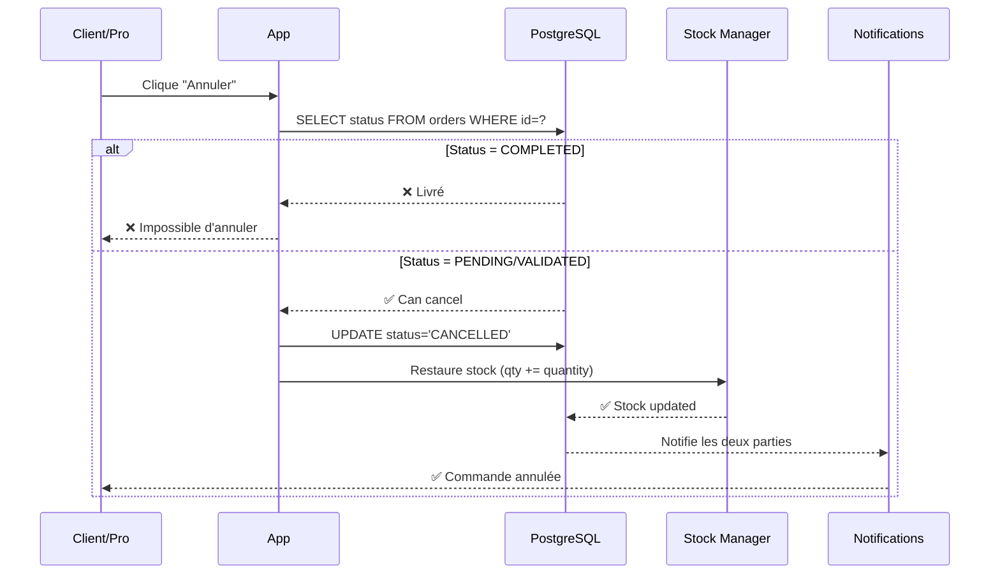
```mermaid
sequenceDiagram
    participant User as Client/Pro
    participant App
    participant DB as PostgreSQL
    participant Stock as Stock Manager
    participant Notif as Notifications

    User->>App: Clique "Annuler"
    App->>DB: SELECT status FROM orders WHERE id=?
    alt Status = COMPLETED
        DB-->>App: ❌ Livré
        App-->>User: ❌ Impossible d'annuler
    else Status = PENDING/VALIDATED
        DB-->>App: ✅ Can cancel
        App->>DB: UPDATE status='CANCELLED'
        App->>Stock: Restaure stock (qty += quantity)
        Stock-->>DB: ✅ Stock updated
        DB-->>Notif: Notifie les deux parties
        Notif-->>User: ✅ Commande annulée
    end
```

---

## 🔟 RÉSERVATION SERVICE (CLIENT)

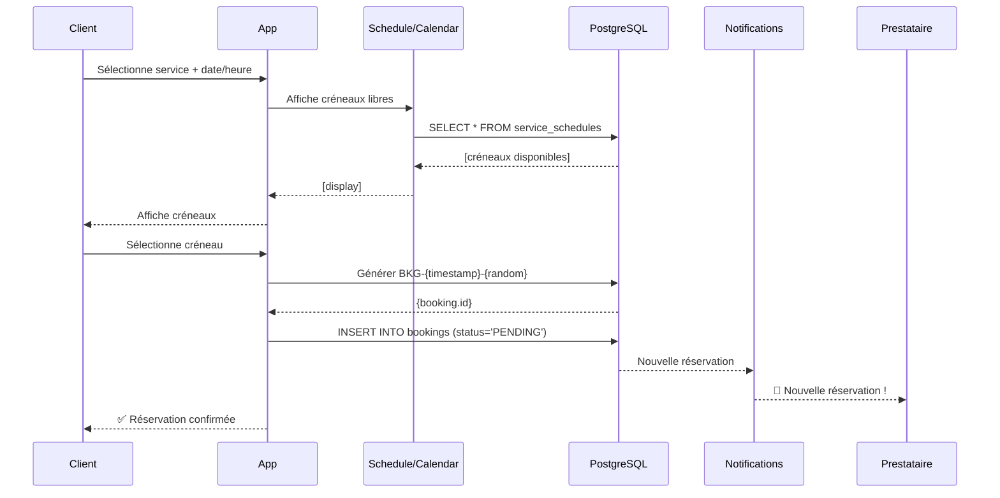
```mermaid
sequenceDiagram
    participant Client
    participant App
    participant Calendar as Schedule/Calendar
    participant DB as PostgreSQL
    participant Notif as Notifications
    participant Pro as Prestataire

    Client->>App: Sélectionne service + date/heure
    App->>Calendar: Affiche créneaux libres
    Calendar->>DB: SELECT * FROM service_schedules
    DB-->>Calendar: [créneaux disponibles]
    Calendar-->>App: [display]
    App-->>Client: Affiche créneaux
    Client->>App: Sélectionne créneau
    App->>DB: Générer BKG-{timestamp}-{random}
    DB-->>App: {booking.id}
    App->>DB: INSERT INTO bookings (status='PENDING')
    DB-->>Notif: Nouvelle réservation
    Notif-->>Pro: 🔔 Nouvelle réservation !
    App-->>Client: ✅ Réservation confirmée
```

---

## 1️⃣1️⃣ CONFIRMATION RÉSERVATION

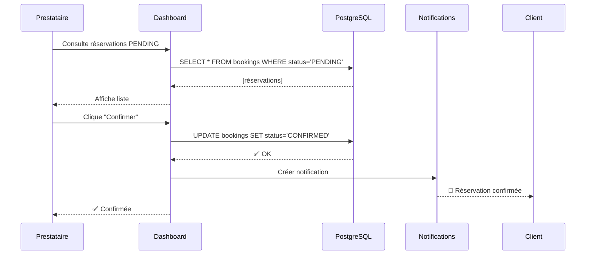
```mermaid
sequenceDiagram
    participant Pro as Prestataire
    participant DASH as Dashboard
    participant DB as PostgreSQL
    participant Notif as Notifications
    participant Client

    Pro->>DASH: Consulte réservations PENDING
    DASH->>DB: SELECT * FROM bookings WHERE status='PENDING'
    DB-->>DASH: [réservations]
    DASH-->>Pro: Affiche liste
    Pro->>DASH: Clique "Confirmer"
    DASH->>DB: UPDATE bookings SET status='CONFIRMED'
    DB-->>DASH: ✅ OK
    DASH->>Notif: Créer notification
    Notif-->>Client: 🔔 Réservation confirmée
    DASH-->>Pro: ✅ Confirmée
```

---

## 1️⃣2️⃣ COMPLÉTION RÉSERVATION

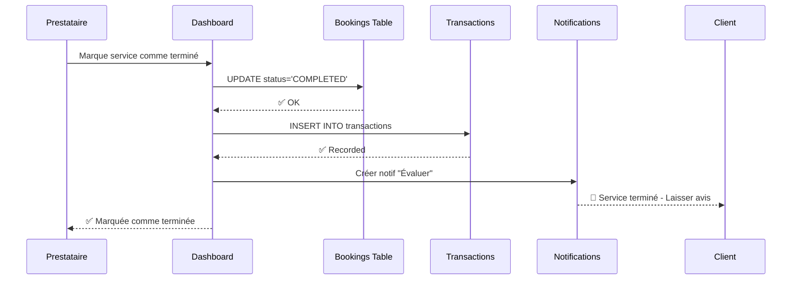
```mermaid
sequenceDiagram
    participant Pro as Prestataire
    participant DASH as Dashboard
    participant Bookings as Bookings Table
    participant Trans as Transactions
    participant Notif as Notifications
    participant Client

    Pro->>DASH: Marque service comme terminé
    DASH->>Bookings: UPDATE status='COMPLETED'
    Bookings-->>DASH: ✅ OK
    DASH->>Trans: INSERT INTO transactions
    Trans-->>DASH: ✅ Recorded
    DASH->>Notif: Créer notif "Évaluer"
    Notif-->>Client: 🔔 Service terminé - Laisser avis
    DASH-->>Pro: ✅ Marquée comme terminée
```

---

## 1️⃣3️⃣ RECHERCHE SÉMANTIQUE HYBRIDE

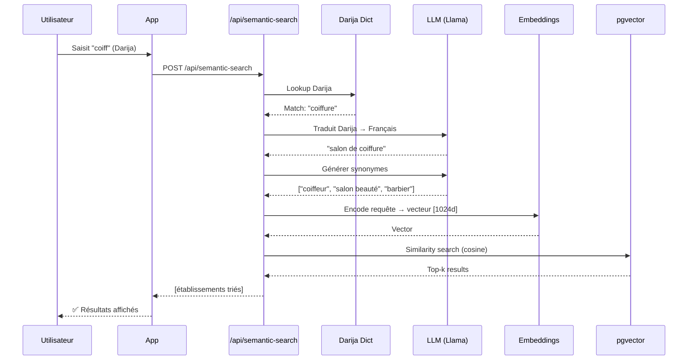
```mermaid
sequenceDiagram
    participant User as Utilisateur
    participant App
    participant API as /api/semantic-search
    participant Dict as Darija Dict
    participant LLM as LLM (Llama)
    participant Embed as Embeddings
    participant pgvector

    User->>App: Saisit "coiff" (Darija)
    App->>API: POST /api/semantic-search
    API->>Dict: Lookup Darija
    Dict-->>API: Match: "coiffure"
    API->>LLM: Traduit Darija → Français
    LLM-->>API: "salon de coiffure"
    API->>LLM: Générer synonymes
    LLM-->>API: ["coiffeur", "salon beauté", "barbier"]
    API->>Embed: Encode requête → vecteur [1024d]
    Embed-->>API: Vector
    API->>pgvector: Similarity search (cosine)
    pgvector-->>API: Top-k results
    API-->>App: [établissements triés]
    App-->>User: ✅ Résultats affichés
```

---

## 1️⃣4️⃣ RECHERCHE PAR IMAGE (VISION IA)

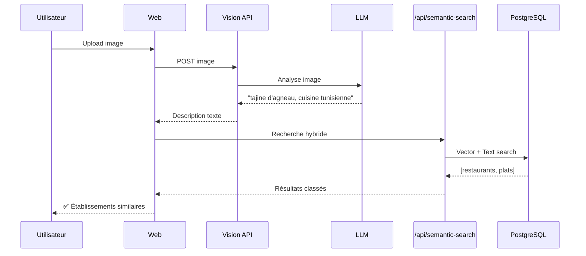
```mermaid
sequenceDiagram
    participant User as Utilisateur
    participant App as Web
    participant Vision as Vision API
    participant LLM
    participant SemanticSearch as /api/semantic-search
    participant DB as PostgreSQL

    User->>App: Upload image
    App->>Vision: POST image
    Vision->>LLM: Analyse image
    LLM-->>Vision: "tajine d'agneau, cuisine tunisienne"
    Vision-->>App: Description texte
    App->>SemanticSearch: Recherche hybride
    SemanticSearch->>DB: Vector + Text search
    DB-->>SemanticSearch: [restaurants, plats]
    SemanticSearch-->>App: Résultats classés
    App-->>User: ✅ Établissements similaires
```

---

## 1️⃣5️⃣ PUBLICATION REEL (COMMERÇANT)

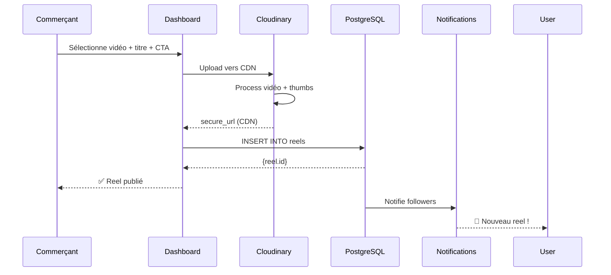
```mermaid
sequenceDiagram
    participant Pro as Commerçant
    participant DASH as Dashboard
    participant Storage as Cloudinary
    participant DB as PostgreSQL
    participant Notif as Notifications

    Pro->>DASH: Sélectionne vidéo + titre + CTA
    DASH->>Storage: Upload vers CDN
    Storage->>Storage: Process vidéo + thumbs
    Storage-->>DASH: secure_url (CDN)
    DASH->>DB: INSERT INTO reels
    DB-->>DASH: {reel.id}
    DASH-->>Pro: ✅ Reel publié
    DB->>Notif: Notifie followers
    Notif-->>User: 📱 Nouveau reel !
```

---

## 1️⃣6️⃣ LIKE SUR REEL

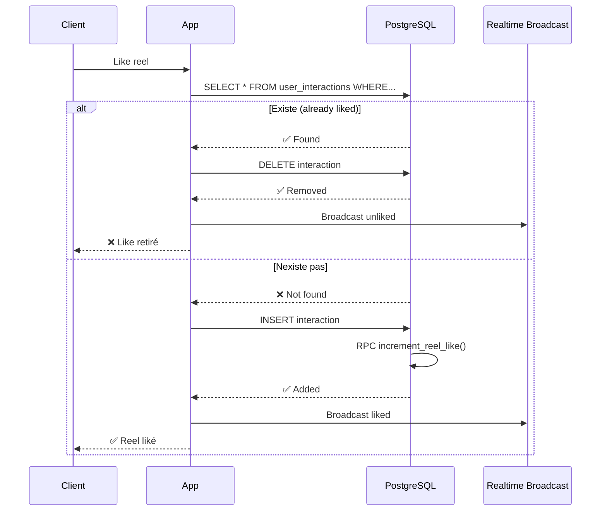
```mermaid
sequenceDiagram
    participant Client
    participant App
    participant DB as PostgreSQL
    participant RealTime as Realtime Broadcast

    Client->>App: Like reel
    App->>DB: SELECT * FROM user_interactions WHERE...
    alt Existe (already liked)
        DB-->>App: ✅ Found
        App->>DB: DELETE interaction
        DB-->>App: ✅ Removed
        App->>RealTime: Broadcast unliked
        App-->>Client: ❌ Like retiré
    else Nexiste pas
        DB-->>App: ❌ Not found
        App->>DB: INSERT interaction
        DB->>DB: RPC increment_reel_like()
        DB-->>App: ✅ Added
        App->>RealTime: Broadcast liked
        App-->>Client: ✅ Reel liké
    end
```

---

## 1️⃣7️⃣ PUBLICATION STORY (24H)

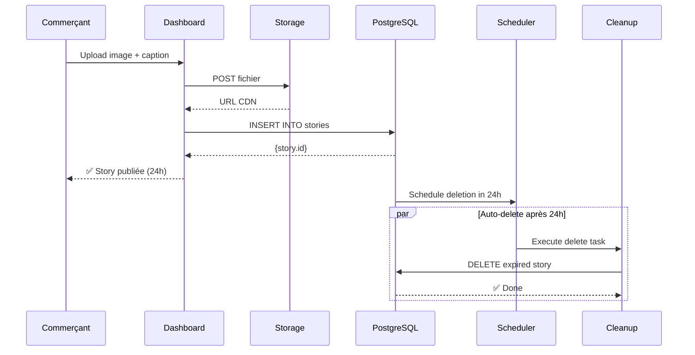
```mermaid
sequenceDiagram
    participant Pro as Commerçant
    participant DASH as Dashboard
    participant Storage
    participant DB as PostgreSQL
    participant Scheduler
    participant Cleanup

    Pro->>DASH: Upload image + caption
    DASH->>Storage: POST fichier
    Storage-->>DASH: URL CDN
    DASH->>DB: INSERT INTO stories
    DB-->>DASH: {story.id}
    DASH-->>Pro: ✅ Story publiée (24h)
    DB->>Scheduler: Schedule deletion in 24h
    par Auto-delete après 24h
        Scheduler->>Cleanup: Execute delete task
        Cleanup->>DB: DELETE expired story
        DB-->>Cleanup: ✅ Done
    end
```

---

## 1️⃣8️⃣ MESSAGERIE TEMPS RÉEL

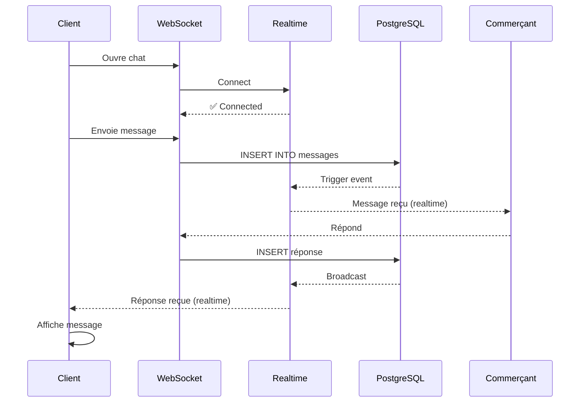
```mermaid
sequenceDiagram
    participant Client
    participant WebSocket as WebSocket
    participant Realtime
    participant DB as PostgreSQL
    participant Pro as Commerçant

    Client->>WebSocket: Ouvre chat
    WebSocket->>Realtime: Connect
    Realtime-->>WebSocket: ✅ Connected
    Client->>WebSocket: Envoie message
    WebSocket->>DB: INSERT INTO messages
    DB-->>Realtime: Trigger event
    Realtime-->>Pro: Message reçu (realtime)
    Pro-->>WebSocket: Répond
    WebSocket->>DB: INSERT réponse
    DB-->>Realtime: Broadcast
    Realtime-->>Client: Réponse reçue (realtime)
    Client->>Client: Affiche message
```

---

## 1️⃣9️⃣ SOUMISSION AVIS

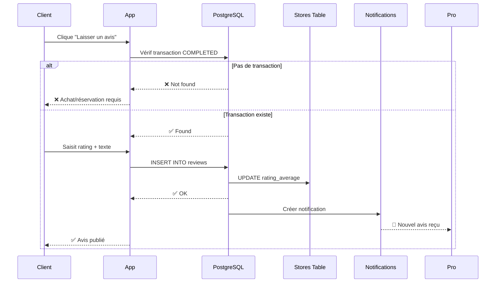
```mermaid
sequenceDiagram
    participant Client
    participant App
    participant DB as PostgreSQL
    participant Stores as Stores Table
    participant Notif as Notifications

    Client->>App: Clique "Laisser un avis"
    App->>DB: Vérif transaction COMPLETED
    alt Pas de transaction
        DB-->>App: ❌ Not found
        App-->>Client: ❌ Achat/réservation requis
    else Transaction existe
        DB-->>App: ✅ Found
        Client->>App: Saisit rating + texte
        App->>DB: INSERT INTO reviews
        DB->>Stores: UPDATE rating_average
        DB-->>App: ✅ OK
        DB->>Notif: Créer notification
        Notif-->>Pro: 🔔 Nouvel avis reçu
        App-->>Client: ✅ Avis publié
    end
```

---

## 2️⃣0️⃣ RÉPONSE COMMERÇANT À AVIS

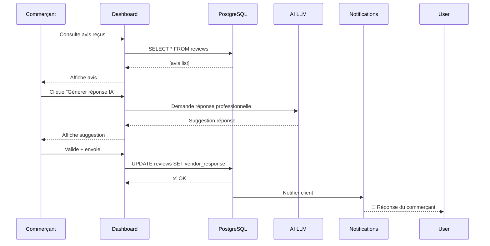
```mermaid
sequenceDiagram
    participant Pro as Commerçant
    participant DASH as Dashboard
    participant DB as PostgreSQL
    participant AI as AI LLM
    participant Notif as Notifications

    Pro->>DASH: Consulte avis reçus
    DASH->>DB: SELECT * FROM reviews
    DB-->>DASH: [avis list]
    DASH-->>Pro: Affiche avis
    Pro->>DASH: Clique "Générer réponse IA"
    DASH->>AI: Demande réponse professionnelle
    AI-->>DASH: Suggestion réponse
    DASH-->>Pro: Affiche suggestion
    Pro->>DASH: Valide + envoie
    DASH->>DB: UPDATE reviews SET vendor_response
    DB-->>DASH: ✅ OK
    DB->>Notif: Notifier client
    Notif-->>User: 🔔 Réponse du commerçant
```

---

## 2️⃣1️⃣ ENREGISTRER FAVORI

```mermaid
sequenceDiagram
    participant Client
    participant App
    participant DB as PostgreSQL

    Client->>App: Clique icône Favori
    App->>DB: SELECT FROM saved_places WHERE user_id=X AND store_id=Y
    alt Existe (already saved)
        DB-->>App: ✅ Found
        App->>DB: DELETE FROM saved_places
        DB-->>App: ✅ Removed
        App-->>Client: ❌ Retiré des favoris
    else Nexiste pas
        DB-->>App: ❌ Not found
        App->>DB: INSERT INTO saved_places
        DB-->>App: ✅ Added
        App-->>Client: ✅ Ajouté aux favoris
    end
```

---

## 2️⃣2️⃣ NOTIFICATIONS TEMPS RÉEL

```mermaid
sequenceDiagram
    participant DB as Database
    participant Realtime as Realtime Channel
    participant WebSocket
    participant App as App UI
    participant User as Utilisateur

    DB->>Realtime: INSERT INTO notifications
    Realtime->>WebSocket: Trigger event
    WebSocket->>App: événement WebSocket
    App->>App: Badge +1
    App-->>User: Notification affichée
    User->>App: Clique notification
    App->>DB: UPDATE is_read=true
    DB-->>App: ✅ OK
    App->>App: Badge reset
    App-->>User: Badge cleared
```

---

## 2️⃣3️⃣ ASSISTANT IA CONVERSATIONNEL

```mermaid
sequenceDiagram
    participant User as Utilisateur
    participant App as Web
    participant API as /api/ai-chat
    participant DB as PostgreSQL
    participant LLM as LLM (Llama)

    User->>App: Pose question (Darija/FR)
    App->>API: POST {message, history[]}
    API->>DB: Fetch contexte (cat, villes)
    DB-->>API: Données contextuelles
    API->>LLM: Chat completion + streaming
    LLM-->>API: Stream de tokens
    API-->>App: Server-Sent Events (SSE)
    App-->>User: Réponse progressive (streaming)
```

---

## 2️⃣4️⃣ DASHBOARD ANALYTIQUE

```mermaid
sequenceDiagram
    participant Pro as Commerçant
    participant DASH as Dashboard
    participant Action as getDashboardOverview()
    participant DB as PostgreSQL

    Pro->>DASH: Ouvre /dashboard/[storeId]
    DASH->>Action: Call action
    Action->>DB: COUNT orders COMPLETED
    DB-->>Action: Orders
    Action->>DB: SUM total_price
    DB-->>Action: Revenue
    Action->>DB: COUNT bookings
    DB-->>Action: Bookings
    Action->>DB: SELECT rating_average
    DB-->>Action: Ratings
    Action->>DB: SELECT store_analytics
    DB-->>Action: Views/Clicks
    Action->>DB: SELECT review distribution
    DB-->>Action: Review stats
    Action-->>DASH: {complete data}
    DASH-->>Pro: ✅ Dashboard analytique
```

---

## 2️⃣5️⃣ GESTION UTILISATEURS (ADMIN)

```mermaid
sequenceDiagram
    participant Admin
    participant SAAS as SaaS Dashboard
    participant API
    participant DB as PostgreSQL

    Admin->>SAAS: Navigue /dashboard/users
    SAAS->>API: GET /api/users?page=1
    API->>DB: SELECT * FROM users ORDER BY created_at
    DB-->>API: [users list]
    API-->>SAAS: Données paginées
    SAAS-->>Admin: Tableau utilisateurs
    Admin->>SAAS: Clique "Suspendre"
    SAAS->>API: POST /suspend
    API->>DB: UPDATE users SET status='suspended'
    DB-->>API: ✅ OK
    SAAS-->>Admin: ✅ Compte suspendu
```

---

## 2️⃣6️⃣ TICKET DE SUPPORT

```mermaid
sequenceDiagram
    participant Pro as Commerçant
    participant App
    participant DB as PostgreSQL
    participant Realtime
    participant Admin as Support Admin

    Pro->>App: Crée ticket (sujet + message)
    App->>DB: INSERT INTO support_tickets
    DB-->>App: {ticket.id}
    App-->>Pro: ✅ Ticket créé - En attente
    DB->>Realtime: Broadcast new ticket
    Realtime-->>Admin: 🔔 Nouveau ticket
    Admin->>Admin: Consulte ticket
    Admin->>App: Répond au message
    App->>DB: INSERT INTO support_messages
    DB->>Realtime: Broadcast réponse
    Realtime-->>App: Message reçu
    App-->>Pro: 🔔 Réponse reçue
```

---

## 2️⃣7️⃣ ABONNEMENT (FREE → PRO)

```mermaid
sequenceDiagram
    participant Pro as Commerçant
    participant DASH as Dashboard
    participant DB as PostgreSQL
    participant Action as upgradeSubscription()

    Pro->>DASH: Consulte son plan
    DASH->>DB: SELECT * FROM subscriptions WHERE user_id=X
    DB-->>DASH: plan=FREE
    DASH-->>Pro: Affiche plans disponibles
    Pro->>DASH: Clique "Upgrade PRO"
    DASH->>Action: upgradeSubscription(userId, 'PRO')
    Action->>DB: UPDATE plan='PRO', price=49, period_end=+30days
    DB-->>Action: ✅ OK
    Action-->>DASH: ✅ Upgraded
    DASH-->>Pro: 🔔 PRO activé
```

---

## 2️⃣8️⃣ SYNCHRONISATION QSTASH

```mermaid
sequenceDiagram
    participant QStash as QStash Worker
    participant Worker as /api/workers/sync-order
    participant DB as PostgreSQL
    participant Notif as Notifications

    QStash->>Worker: Webhook call
    Worker->>Worker: Vérifie signature QStash
    Worker->>DB: SELECT orders to sync
    DB-->>Worker: Order states
    Worker->>DB: UPDATE orders status
    DB-->>Worker: ✅ Synced
    Worker->>Notif: Envoyer notifications
    Notif-->>User: 🔔 Notifications sent
    Worker-->>QStash: ✅ Success
```

---

# 📋 SUMMARY TABLE

| # | Diagramme | Composants Clés | Pattern |
|----|-----------|-----------------|---------|
| 1 | Signup | Auth, RL, Email | Sync with async email |
| 2 | Login | Auth, Redis, DB | Rate limiting |
| 3 | Forgot Password | Auth, Email, OTP | Async email flow |
| 4 | Create Store | Storage, Auth, DB | File upload + DB insert |
| 5 | Approve Store | API, DB, Notifications | Admin workflow |
| 6 | Create Order | Auth, DB | Validation & insert |
| 7 | Validate Order | QR Gen, DB, Stock | QR code generation |
| 8 | Scan QR | DB, Notifications | Tracking workflow |
| 9 | Cancel Order | DB, Stock, Notif | Rollback pattern |
| 10 | Book Service | DB, Calendar, Notif | Availability check |
| 11 | Confirm Booking | DB, Notifications | Status update |
| 12 | Complete Booking | DB, Transactions, Notif | Transaction record |
| 13 | Semantic Search | LLM, Embeddings, pgvector | AI-powered search |
| 14 | Vision Search | Vision API, LLM, DB | Image analysis |
| 15 | Publish Reel | Storage, DB, Notif | Media upload |
| 16 | Like Reel | DB, Realtime | Toggle interaction |
| 17 | Publish Story | Storage, DB, Scheduler | Auto-expiry (24h) |
| 18 | Messaging | WebSocket, Realtime, DB | Real-time bidirectional |
| 19 | Submit Review | DB, Stores, Notif | Validation + aggregate |
| 20 | Vendor Response | AI, DB, Notif | AI-generated content |
| 21 | Save Favorite | DB | Toggle save/unsave |
| 22 | Realtime Notif | DB, Realtime, WebSocket | Broadcast pattern |
| 23 | AI Chat | LLM, DB, SSE | Streaming response |
| 24 | Analytics Dashboard | DB, Aggregations | Multiple queries |
| 25 | User Management | API, DB | CRUD operations |
| 26 | Support Ticket | DB, Realtime | Two-way messaging |
| 27 | Subscription Upgrade | DB, Action | Update workflow |
| 28 | QStash Sync | Webhook, DB, Notif | Async background job |

---

# 🎯 PATTERNS UTILISÉS

## Synchronous Patterns
- Simple Request/Response
- Form Submission + Validation
- Database Query + Update

## Asynchronous Patterns
- Email sending (non-blocking)
- Notifications (background)
- Webhook callbacks (QStash)
- Streaming responses (SSE)

## Real-time Patterns
- WebSocket connections
- Realtime broadcasts
- Pub/Sub via Supabase
- Status updates

## AI Integration Patterns
- LLM calls for generation
- Vision API for image analysis
- Semantic search via embeddings
- Streaming completions

## Scale Patterns
- Rate limiting (Redis)
- Caching
- Pagination
- Background jobs (QStash)
- File storage (CDN)

