# 🎬 DIAGRAMMES DE SÉQUENCE ORGANISÉS PAR SPRINTS & RELEASES

## 📑 Table des Matières

### **RELEASE 1: Fondation & Authentification**
- Sprint 1: Authentification & Profils (4 diagrammes)
- Sprint 2: Intégration Commerçant & Admin (4 diagrammes)

### **RELEASE 2: E-Commerce & Catalogue**
- Sprint 3: Gestion du Shop (8 diagrammes)
- Sprint 4: Marketing & Promotions (3 diagrammes)
- Sprint 5: Paiement & Gestion Commandes (5 diagrammes)

### **RELEASE 3: Expérience Sociale & Contenu**
- Sprint 6: Interaction Sociale (6 diagrammes)
- Sprint 7: Messagerie & Support (3 diagrammes)

### **RELEASE 4: IA Avancée & Analytics**
- Sprint 8: Recommandations & Recherche IA (4 diagrammes)
- Sprint 9: Détection Fraude & Modération (3 diagrammes)

### **RELEASE 5: Optimisation & Scaling**
- Sprint 10: Performance & Caching (2 diagrammes)
- Sprint 11: Analyse Avancée (2 diagrammes)

---

# 🚀 RELEASE 1 : Fondation & Authentification

## 🏃 Sprint 1 : Authentification & Profils

### 1️⃣ **Inscription (Sign Up)** - S1-D1
**Acteurs**: Utilisateur, Application, Base de Données, Email Service
**Fonctionnalité**: Créer un compte utilisateur avec vérification email
**Niveau**: Fondamental

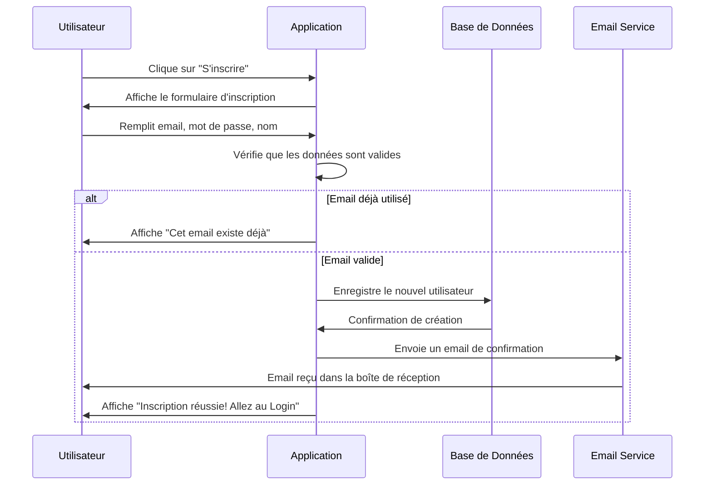
```mermaid
sequenceDiagram
    participant Utilisateur
    participant Application
    participant Base de Données
    participant Email Service

    Utilisateur->>Application: Clique sur "S'inscrire"
    Application->>Utilisateur: Affiche le formulaire d'inscription
    Utilisateur->>Application: Remplit email, mot de passe, nom
    Application->>Application: Vérifie que les données sont valides
    alt Email déjà utilisé
        Application->>Utilisateur: Affiche "Cet email existe déjà"
    else Email valide
        Application->>Base de Données: Enregistre le nouvel utilisateur
        Base de Données->>Application: Confirmation de création
        Application->>Email Service: Envoie un email de confirmation
        Email Service->>Utilisateur: Email reçu dans la boîte de réception
        Application->>Utilisateur: Affiche "Inscription réussie! Allez au Login"
    end
```

---

### 2️⃣ **Connexion (Login)** - S1-D2
**Acteurs**: Utilisateur, Application, Base de Données, Session Storage
**Fonctionnalité**: Authentifier un utilisateur existant
**Niveau**: Fondamental

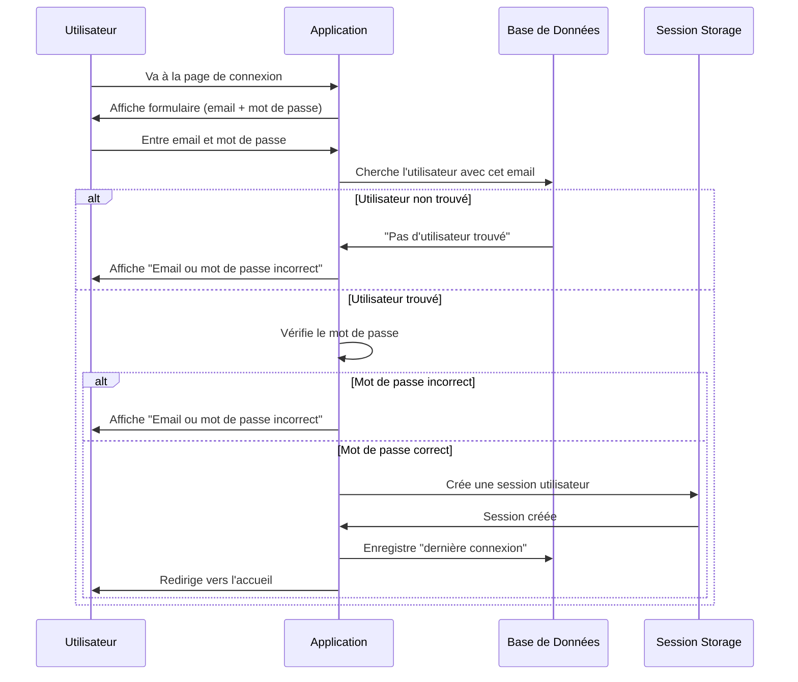
```mermaid
sequenceDiagram
    participant Utilisateur
    participant Application
    participant Base de Données
    participant Session Storage

    Utilisateur->>Application: Va à la page de connexion
    Application->>Utilisateur: Affiche formulaire (email + mot de passe)
    Utilisateur->>Application: Entre email et mot de passe
    Application->>Base de Données: Cherche l'utilisateur avec cet email
    alt Utilisateur non trouvé
        Base de Données->>Application: "Pas d'utilisateur trouvé"
        Application->>Utilisateur: Affiche "Email ou mot de passe incorrect"
    else Utilisateur trouvé
        Application->>Application: Vérifie le mot de passe
        alt Mot de passe incorrect
            Application->>Utilisateur: Affiche "Email ou mot de passe incorrect"
        else Mot de passe correct
            Application->>Session Storage: Crée une session utilisateur
            Session Storage->>Application: Session créée
            Application->>Base de Données: Enregistre "dernière connexion"
            Application->>Utilisateur: Redirige vers l'accueil
        end
    end
```

---

### 3️⃣ **Récupération Mot de Passe** - S1-D3
**Acteurs**: Utilisateur, Application, Base de Données, Email Service
**Fonctionnalité**: Réinitialiser mot de passe oublié
**Niveau**: Fondamental

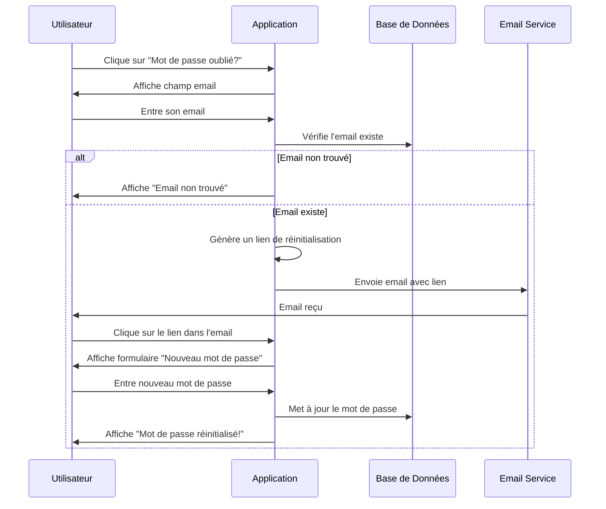
```mermaid
sequenceDiagram
    participant Utilisateur
    participant Application
    participant Base de Données
    participant Email Service

    Utilisateur->>Application: Clique sur "Mot de passe oublié?"
    Application->>Utilisateur: Affiche champ email
    Utilisateur->>Application: Entre son email
    Application->>Base de Données: Vérifie l'email existe
    alt Email non trouvé
        Application->>Utilisateur: Affiche "Email non trouvé"
    else Email existe
        Application->>Application: Génère un lien de réinitialisation
        Application->>Email Service: Envoie email avec lien
        Email Service->>Utilisateur: Email reçu
        Utilisateur->>Application: Clique sur le lien dans l'email
        Application->>Utilisateur: Affiche formulaire "Nouveau mot de passe"
        Utilisateur->>Application: Entre nouveau mot de passe
        Application->>Base de Données: Met à jour le mot de passe
        Application->>Utilisateur: Affiche "Mot de passe réinitialisé!"
    end
```

---

### 4️⃣ **Édition Profil Utilisateur** - S1-D4
**Acteurs**: Client, Application, Base de Données
**Fonctionnalité**: Modifier les informations personnelles
**Niveau**: Fondamental

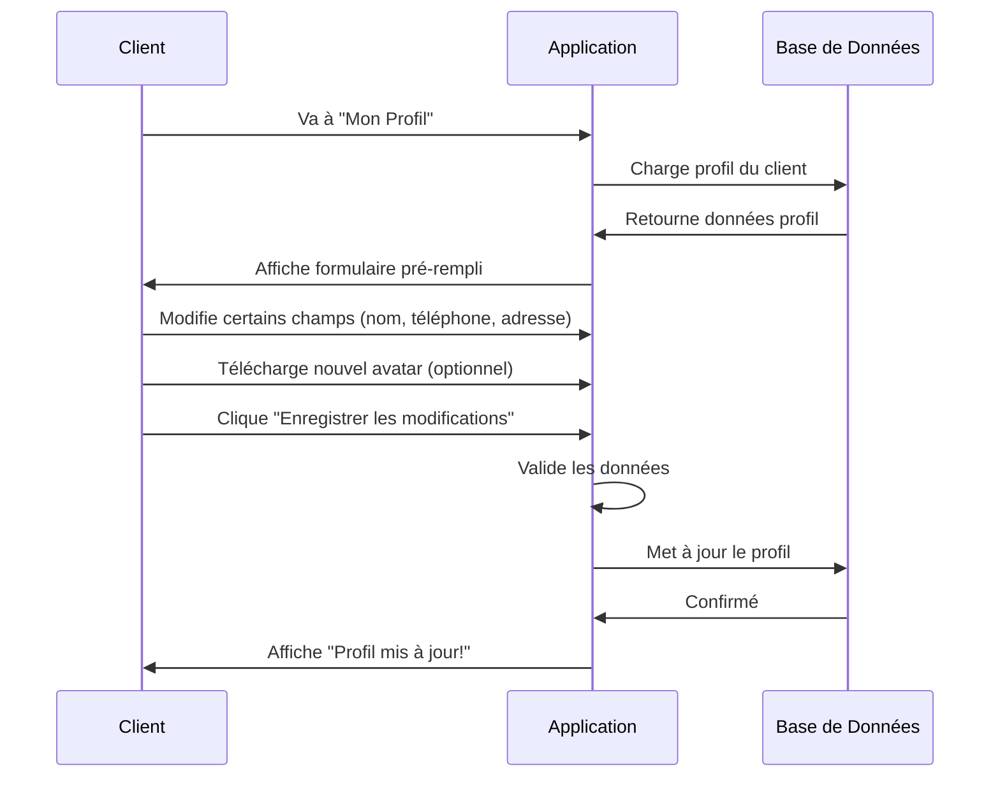
```mermaid
sequenceDiagram
    participant Client
    participant Application
    participant Base de Données

    Client->>Application: Va à "Mon Profil"
    Application->>Base de Données: Charge profil du client
    Base de Données->>Application: Retourne données profil
    Application->>Client: Affiche formulaire pré-rempli
    Client->>Application: Modifie certains champs (nom, téléphone, adresse)
    Client->>Application: Télécharge nouvel avatar (optionnel)
    Client->>Application: Clique "Enregistrer les modifications"
    Application->>Application: Valide les données
    Application->>Base de Données: Met à jour le profil
    Base de Données->>Application: Confirmé
    Application->>Client: Affiche "Profil mis à jour!"
```

---

## 🏃 Sprint 2 : Intégration Commerçant & Back-Office Admin

### 5️⃣ **Création de Magasin (Store Creation)** - S2-D1
**Acteurs**: Vendeur, Application, Base de Données, Admin
**Fonctionnalité**: Demander la création d'un établissement
**Niveau**: Important

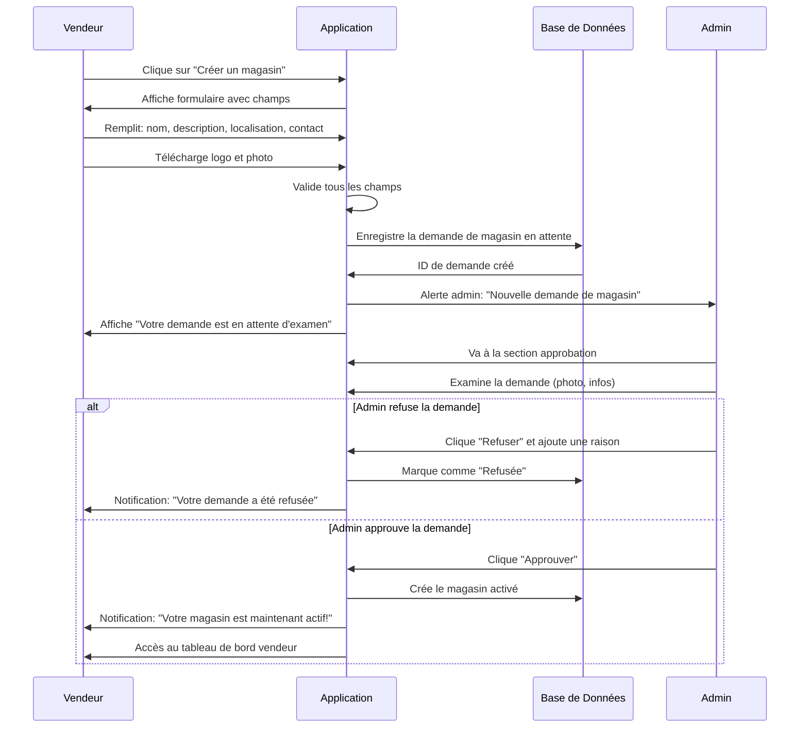
```mermaid
sequenceDiagram
    participant Vendeur
    participant Application
    participant Base de Données
    participant Admin

    Vendeur->>Application: Clique sur "Créer un magasin"
    Application->>Vendeur: Affiche formulaire avec champs
    Vendeur->>Application: Remplit: nom, description, localisation, contact
    Vendeur->>Application: Télécharge logo et photo
    Application->>Application: Valide tous les champs
    Application->>Base de Données: Enregistre la demande de magasin en attente
    Base de Données->>Application: ID de demande créé
    Application->>Admin: Alerte admin: "Nouvelle demande de magasin"
    Application->>Vendeur: Affiche "Votre demande est en attente d'examen"
    Admin->>Application: Va à la section approbation
    Admin->>Application: Examine la demande (photo, infos)
    alt Admin refuse la demande
        Admin->>Application: Clique "Refuser" et ajoute une raison
        Application->>Base de Données: Marque comme "Refusée"
        Application->>Vendeur: Notification: "Votre demande a été refusée"
    else Admin approuve la demande
        Admin->>Application: Clique "Approuver"
        Application->>Base de Données: Crée le magasin activé
        Application->>Vendeur: Notification: "Votre magasin est maintenant actif!"
        Application->>Vendeur: Accès au tableau de bord vendeur
    end
```

---

### 6️⃣ **Approbation/Refus Demande Magasin (Admin Review)** - S2-D2
**Acteurs**: Admin, Application, Base de Données, Vendeur
**Fonctionnalité**: Valider les demandes de magasin
**Niveau**: Important

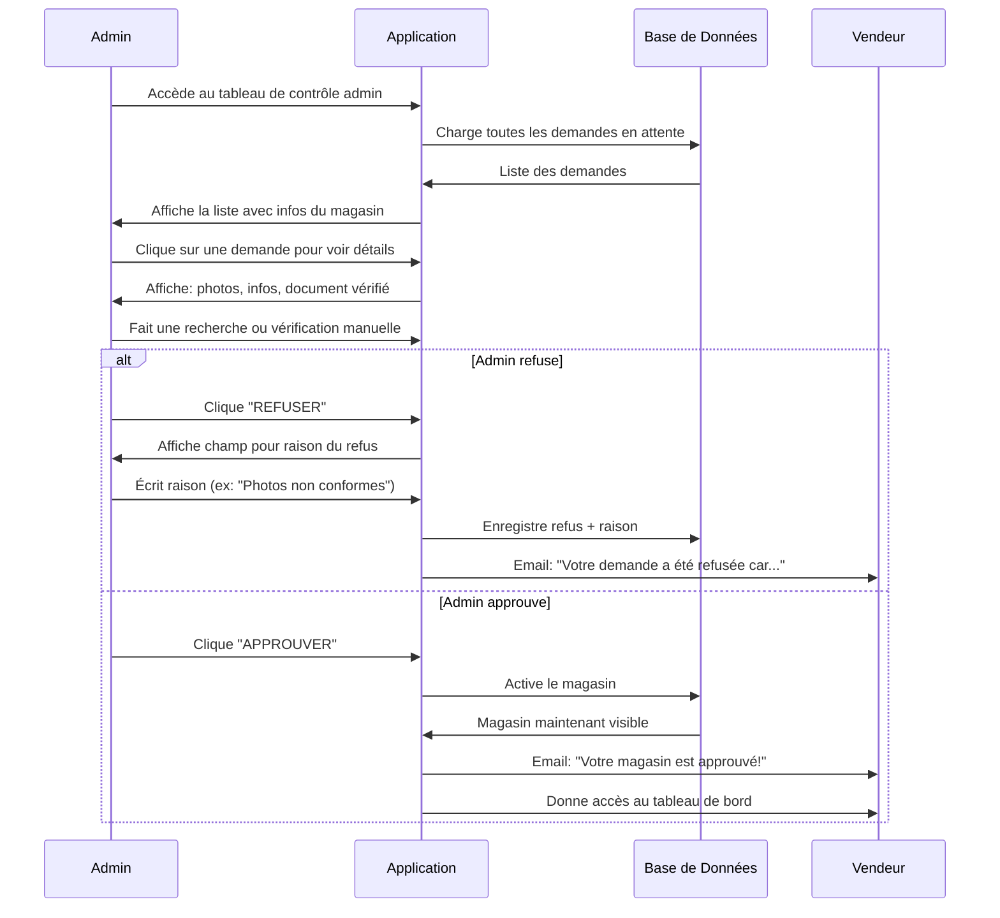
```mermaid
sequenceDiagram
    participant Admin
    participant Application
    participant Base de Données
    participant Vendeur

    Admin->>Application: Accède au tableau de contrôle admin
    Application->>Base de Données: Charge toutes les demandes en attente
    Base de Données->>Application: Liste des demandes
    Application->>Admin: Affiche la liste avec infos du magasin
    Admin->>Application: Clique sur une demande pour voir détails
    Application->>Admin: Affiche: photos, infos, document vérifié
    Admin->>Application: Fait une recherche ou vérification manuelle
    alt Admin refuse
        Admin->>Application: Clique "REFUSER"
        Application->>Admin: Affiche champ pour raison du refus
        Admin->>Application: Écrit raison (ex: "Photos non conformes")
        Application->>Base de Données: Enregistre refus + raison
        Application->>Vendeur: Email: "Votre demande a été refusée car..."
    else Admin approuve
        Admin->>Application: Clique "APPROUVER"
        Application->>Base de Données: Active le magasin
        Base de Données->>Application: Magasin maintenant visible
        Application->>Vendeur: Email: "Votre magasin est approuvé!"
        Application->>Vendeur: Donne accès au tableau de bord
    end
```

---

### 7️⃣ **Accès Tableau de Bord Commerçant** - S2-D3
**Acteurs**: Commerçant, Application, Base de Données
**Fonctionnalité**: Consulter les statistiques et gestion
**Niveau**: Important

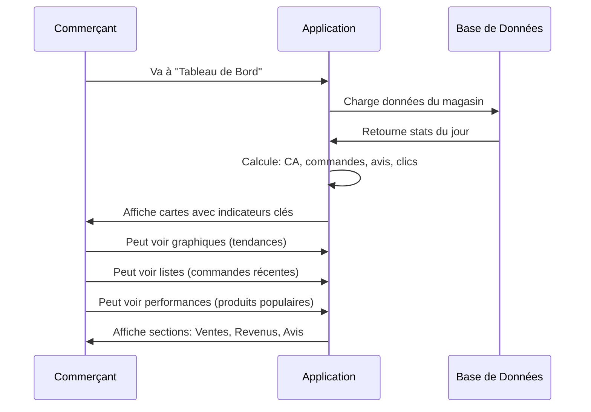
```mermaid
sequenceDiagram
    participant Commerçant
    participant Application
    participant Base de Données

    Commerçant->>Application: Va à "Tableau de Bord"
    Application->>Base de Données: Charge données du magasin
    Base de Données->>Application: Retourne stats du jour
    Application->>Application: Calcule: CA, commandes, avis, clics
    Application->>Commerçant: Affiche cartes avec indicateurs clés
    Commerçant->>Application: Peut voir graphiques (tendances)
    Commerçant->>Application: Peut voir listes (commandes récentes)
    Commerçant->>Application: Peut voir performances (produits populaires)
    Application->>Commerçant: Affiche sections: Ventes, Revenus, Avis
```

---

### 8️⃣ **Connexion Admin & Accès Tableau de Bord** - S2-D4
**Acteurs**: Admin, Application, Base de Données, Session Storage
**Fonctionnalité**: Authentifier et accéder au back-office admin
**Niveau**: Important

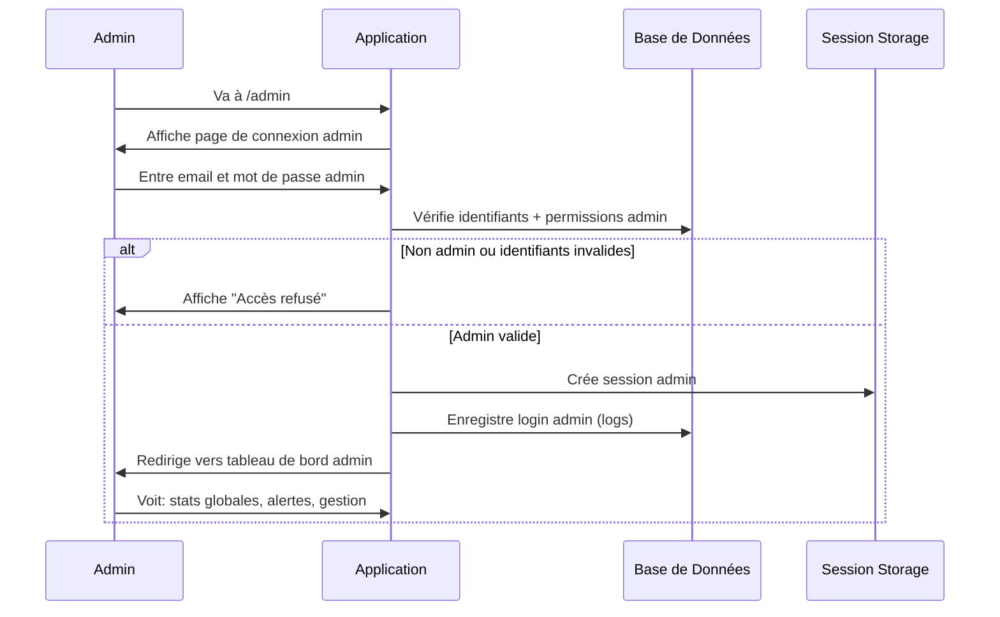
```mermaid
sequenceDiagram
    participant Admin
    participant Application
    participant Base de Données
    participant Session Storage

    Admin->>Application: Va à /admin
    Application->>Admin: Affiche page de connexion admin
    Admin->>Application: Entre email et mot de passe admin
    Application->>Base de Données: Vérifie identifiants + permissions admin
    alt Non admin ou identifiants invalides
        Application->>Admin: Affiche "Accès refusé"
    else Admin valide
        Application->>Session Storage: Crée session admin
        Application->>Base de Données: Enregistre login admin (logs)
        Application->>Admin: Redirige vers tableau de bord admin
        Admin->>Application: Voit: stats globales, alertes, gestion
    end
```

---

# 🚀 RELEASE 2 : E-Commerce & Catalogue

## 🏃 Sprint 3 : Gestion du Shop (Produits & Services)

### 9️⃣ **Ajouter Produit/Service** - S3-D1
**Acteurs**: Commerçant, Application, Base de Données, Upload Service
**Fonctionnalité**: Ajouter un produit ou service au catalogue
**Niveau**: Critique

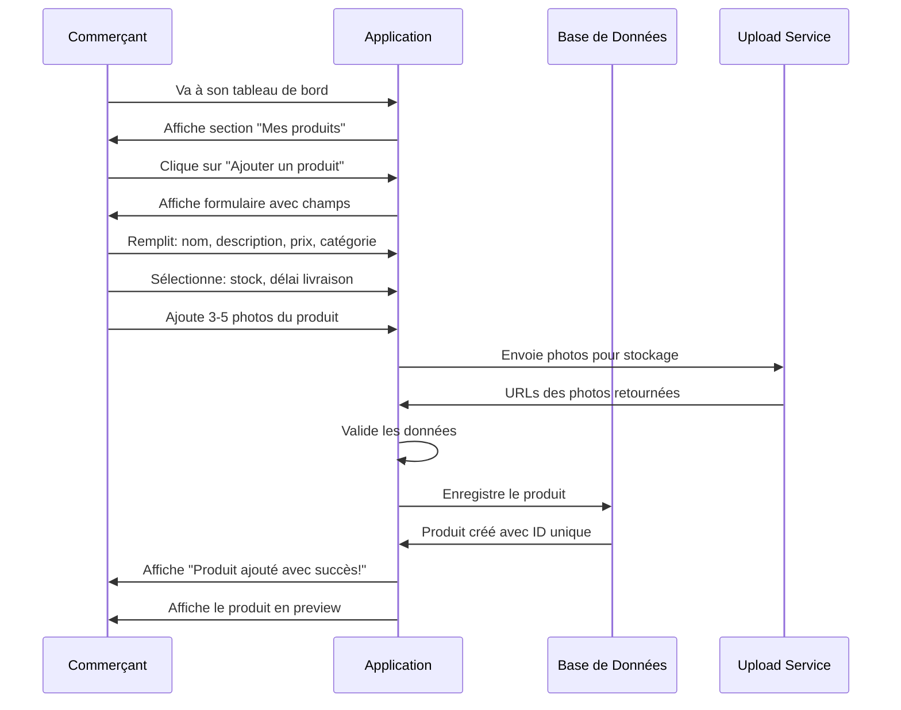
```mermaid
sequenceDiagram
    participant Commerçant
    participant Application
    participant Base de Données
    participant Upload Service

    Commerçant->>Application: Va à son tableau de bord
    Application->>Commerçant: Affiche section "Mes produits"
    Commerçant->>Application: Clique sur "Ajouter un produit"
    Application->>Commerçant: Affiche formulaire avec champs
    Commerçant->>Application: Remplit: nom, description, prix, catégorie
    Commerçant->>Application: Sélectionne: stock, délai livraison
    Commerçant->>Application: Ajoute 3-5 photos du produit
    Application->>Upload Service: Envoie photos pour stockage
    Upload Service->>Application: URLs des photos retournées
    Application->>Application: Valide les données
    Application->>Base de Données: Enregistre le produit
    Base de Données->>Application: Produit créé avec ID unique
    Application->>Commerçant: Affiche "Produit ajouté avec succès!"
    Application->>Commerçant: Affiche le produit en preview
```

---

### 🔟 **Modifier Produit/Service** - S3-D2
**Acteurs**: Commerçant, Application, Base de Données
**Fonctionnalité**: Éditer les détails d'un produit
**Niveau**: Important

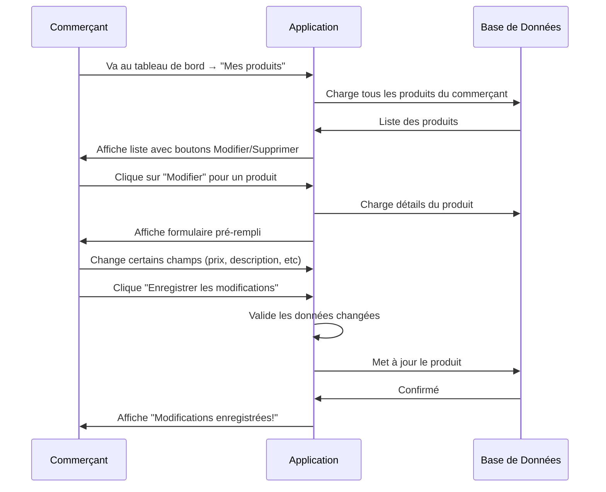
```mermaid
sequenceDiagram
    participant Commerçant
    participant Application
    participant Base de Données

    Commerçant->>Application: Va au tableau de bord → "Mes produits"
    Application->>Base de Données: Charge tous les produits du commerçant
    Base de Données->>Application: Liste des produits
    Application->>Commerçant: Affiche liste avec boutons Modifier/Supprimer
    Commerçant->>Application: Clique sur "Modifier" pour un produit
    Application->>Base de Données: Charge détails du produit
    Application->>Commerçant: Affiche formulaire pré-rempli
    Commerçant->>Application: Change certains champs (prix, description, etc)
    Commerçant->>Application: Clique "Enregistrer les modifications"
    Application->>Application: Valide les données changées
    Application->>Base de Données: Met à jour le produit
    Base de Données->>Application: Confirmé
    Application->>Commerçant: Affiche "Modifications enregistrées!"
```

---

### 1️⃣1️⃣ **Supprimer Produit/Service** - S3-D3
**Acteurs**: Commerçant, Application, Base de Données
**Fonctionnalité**: Retirer un produit du catalogue
**Niveau**: Normal

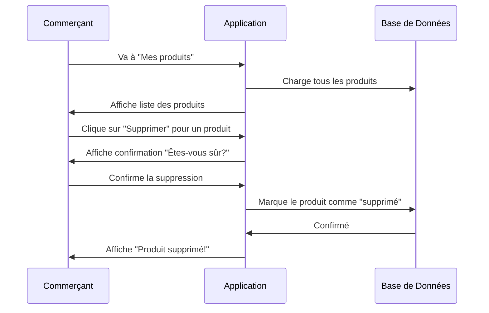
```mermaid
sequenceDiagram
    participant Commerçant
    participant Application
    participant Base de Données

    Commerçant->>Application: Va à "Mes produits"
    Application->>Base de Données: Charge tous les produits
    Application->>Commerçant: Affiche liste des produits
    Commerçant->>Application: Clique sur "Supprimer" pour un produit
    Application->>Commerçant: Affiche confirmation "Êtes-vous sûr?"
    Commerçant->>Application: Confirme la suppression
    Application->>Base de Données: Marque le produit comme "supprimé"
    Base de Données->>Application: Confirmé
    Application->>Commerçant: Affiche "Produit supprimé!"
```

---

### 1️⃣2️⃣ **Gestion Stock/Inventaire** - S3-D4
**Acteurs**: Commerçant, Application, Base de Données
**Fonctionnalité**: Gérer les quantités en stock
**Niveau**: Important

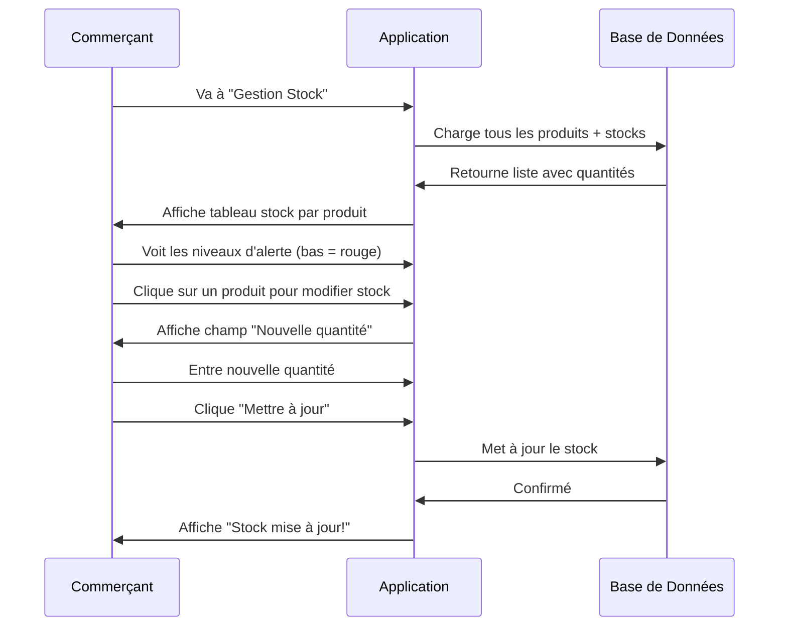
```mermaid
sequenceDiagram
    participant Commerçant
    participant Application
    participant Base de Données

    Commerçant->>Application: Va à "Gestion Stock"
    Application->>Base de Données: Charge tous les produits + stocks
    Base de Données->>Application: Retourne liste avec quantités
    Application->>Commerçant: Affiche tableau stock par produit
    Commerçant->>Application: Voit les niveaux d'alerte (bas = rouge)
    Commerçant->>Application: Clique sur un produit pour modifier stock
    Application->>Commerçant: Affiche champ "Nouvelle quantité"
    Commerçant->>Application: Entre nouvelle quantité
    Commerçant->>Application: Clique "Mettre à jour"
    Application->>Base de Données: Met à jour le stock
    Base de Données->>Application: Confirmé
    Application->>Commerçant: Affiche "Stock mise à jour!"
```

---

### 1️⃣3️⃣ **Affichage Produits (Client)** - S3-D5
**Acteurs**: Client, Application, Base de Données
**Fonctionnalité**: Consulter les produits d'un magasin
**Niveau**: Critique

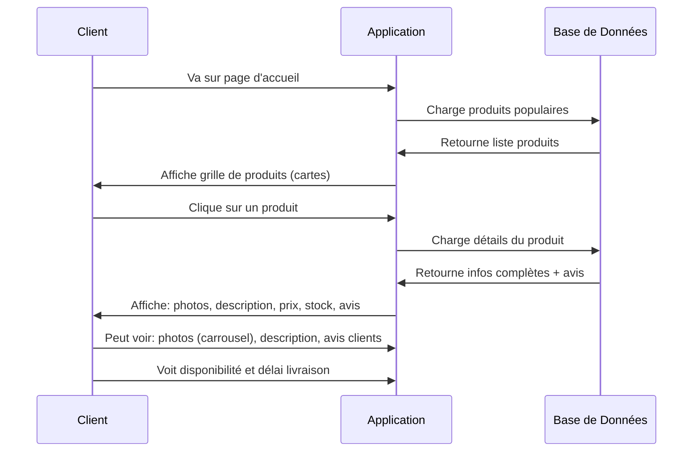
```mermaid
sequenceDiagram
    participant Client
    participant Application
    participant Base de Données

    Client->>Application: Va sur page d'accueil
    Application->>Base de Données: Charge produits populaires
    Base de Données->>Application: Retourne liste produits
    Application->>Client: Affiche grille de produits (cartes)
    Client->>Application: Clique sur un produit
    Application->>Base de Données: Charge détails du produit
    Base de Données->>Application: Retourne infos complètes + avis
    Application->>Client: Affiche: photos, description, prix, stock, avis
    Client->>Application: Peut voir: photos (carrousel), description, avis clients
    Client->>Application: Voit disponibilité et délai livraison
```

---

### 1️⃣4️⃣ **Recherche Produits (Simple)** - S3-D6
**Acteurs**: Client, Application, Base de Données
**Fonctionnalité**: Chercher un produit par mots-clés
**Niveau**: Critique

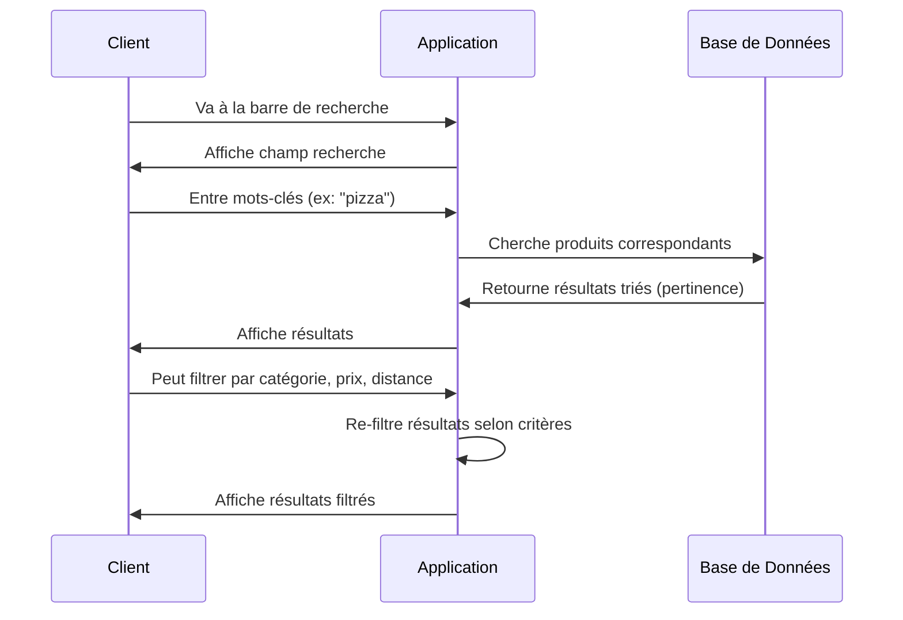
```mermaid
sequenceDiagram
    participant Client
    participant Application
    participant Base de Données

    Client->>Application: Va à la barre de recherche
    Application->>Client: Affiche champ recherche
    Client->>Application: Entre mots-clés (ex: "pizza")
    Application->>Base de Données: Cherche produits correspondants
    Base de Données->>Application: Retourne résultats triés (pertinence)
    Application->>Client: Affiche résultats
    Client->>Application: Peut filtrer par catégorie, prix, distance
    Application->>Application: Re-filtre résultats selon critères
    Application->>Client: Affiche résultats filtrés
```

---

### 1️⃣5️⃣ **Affichage Détails Magasin (Shop)** - S3-D7
**Acteurs**: Client, Application, Base de Données
**Fonctionnalité**: Voir la page complète d'un magasin
**Niveau**: Important

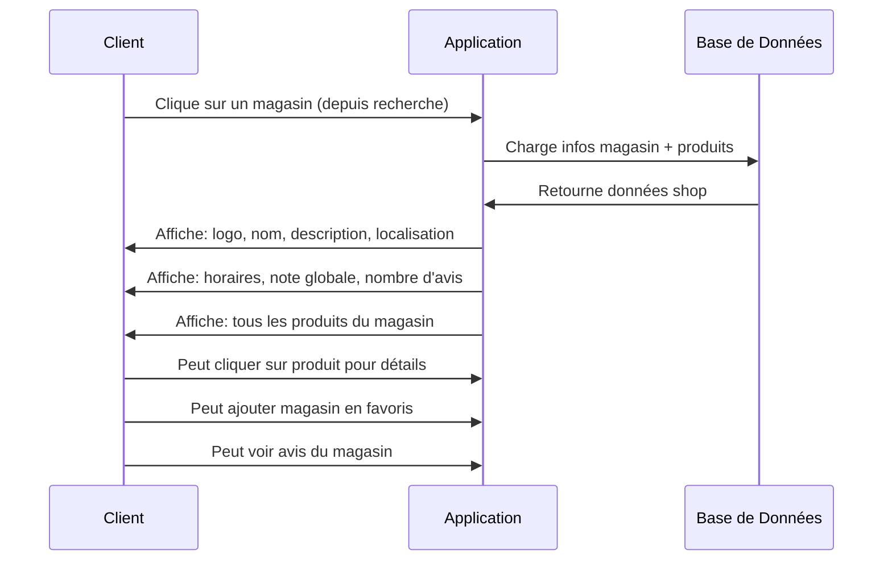
```mermaid
sequenceDiagram
    participant Client
    participant Application
    participant Base de Données

    Client->>Application: Clique sur un magasin (depuis recherche)
    Application->>Base de Données: Charge infos magasin + produits
    Base de Données->>Application: Retourne données shop
    Application->>Client: Affiche: logo, nom, description, localisation
    Application->>Client: Affiche: horaires, note globale, nombre d'avis
    Application->>Client: Affiche: tous les produits du magasin
    Client->>Application: Peut cliquer sur produit pour détails
    Client->>Application: Peut ajouter magasin en favoris
    Client->>Application: Peut voir avis du magasin
```

---

### 1️⃣6️⃣ **Catégorisation & Filtres Produits** - S3-D8
**Acteurs**: Client, Application, Base de Données
**Fonctionnalité**: Parcourir par catégorie avec filtres
**Niveau**: Important

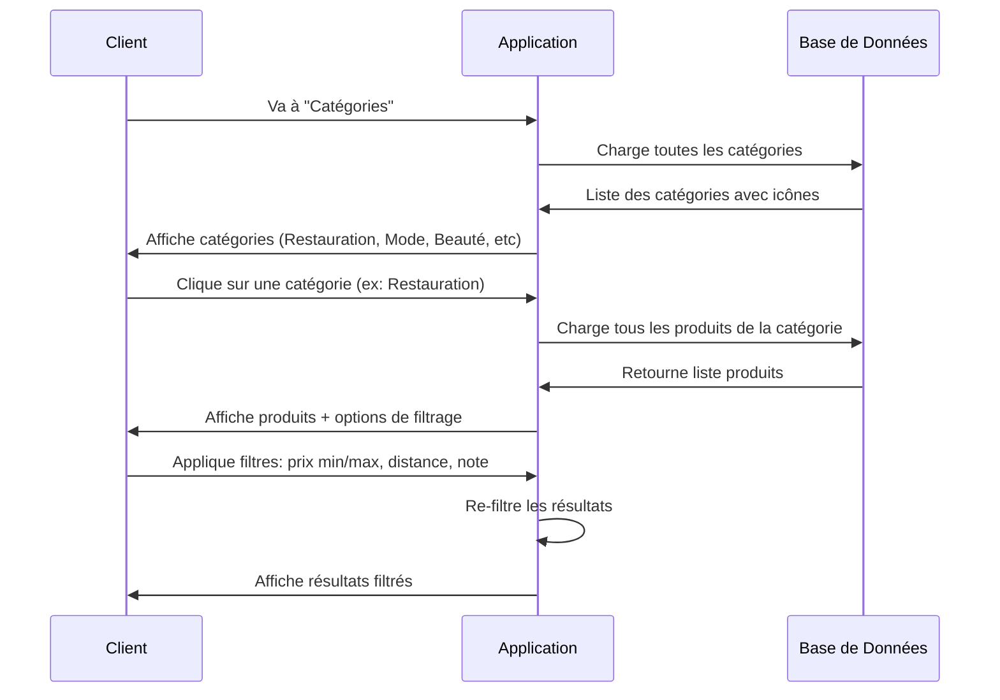
```mermaid
sequenceDiagram
    participant Client
    participant Application
    participant Base de Données

    Client->>Application: Va à "Catégories"
    Application->>Base de Données: Charge toutes les catégories
    Base de Données->>Application: Liste des catégories avec icônes
    Application->>Client: Affiche catégories (Restauration, Mode, Beauté, etc)
    Client->>Application: Clique sur une catégorie (ex: Restauration)
    Application->>Base de Données: Charge tous les produits de la catégorie
    Base de Données->>Application: Retourne liste produits
    Application->>Client: Affiche produits + options de filtrage
    Client->>Application: Applique filtres: prix min/max, distance, note
    Application->>Application: Re-filtre les résultats
    Application->>Client: Affiche résultats filtrés
```

---

## 🏃 Sprint 4 : Marketing & Promotions

### 1️⃣7️⃣ **Créer Promotion** - S4-D1
**Acteurs**: Commerçant, Application, Base de Données
**Fonctionnalité**: Créer une promotion/réduction
**Niveau**: Important

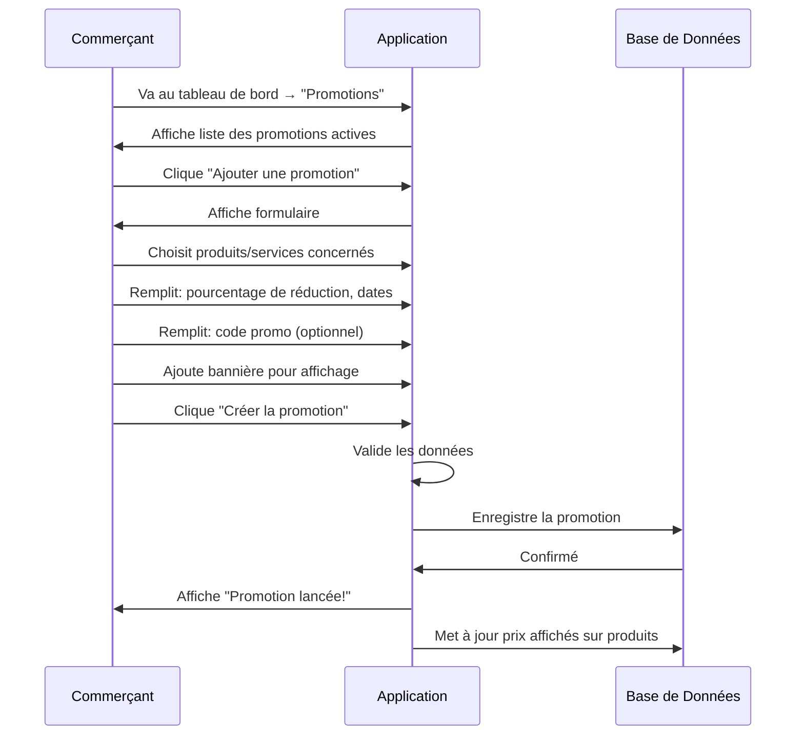
```mermaid
sequenceDiagram
    participant Commerçant
    participant Application
    participant Base de Données

    Commerçant->>Application: Va au tableau de bord → "Promotions"
    Application->>Commerçant: Affiche liste des promotions actives
    Commerçant->>Application: Clique "Ajouter une promotion"
    Application->>Commerçant: Affiche formulaire
    Commerçant->>Application: Choisit produits/services concernés
    Commerçant->>Application: Remplit: pourcentage de réduction, dates
    Commerçant->>Application: Remplit: code promo (optionnel)
    Commerçant->>Application: Ajoute bannière pour affichage
    Commerçant->>Application: Clique "Créer la promotion"
    Application->>Application: Valide les données
    Application->>Base de Données: Enregistre la promotion
    Base de Données->>Application: Confirmé
    Application->>Commerçant: Affiche "Promotion lancée!"
    Application->>Base de Données: Met à jour prix affichés sur produits
```

---

### 1️⃣8️⃣ **Modifier Promotion** - S4-D2
**Acteurs**: Commerçant, Application, Base de Données
**Fonctionnalité**: Éditer une promotion existante
**Niveau**: Normal

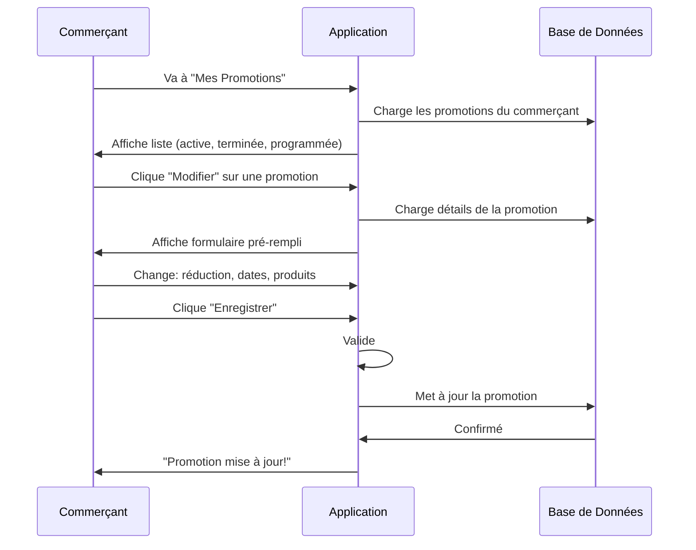
```mermaid
sequenceDiagram
    participant Commerçant
    participant Application
    participant Base de Données

    Commerçant->>Application: Va à "Mes Promotions"
    Application->>Base de Données: Charge les promotions du commerçant
    Application->>Commerçant: Affiche liste (active, terminée, programmée)
    Commerçant->>Application: Clique "Modifier" sur une promotion
    Application->>Base de Données: Charge détails de la promotion
    Application->>Commerçant: Affiche formulaire pré-rempli
    Commerçant->>Application: Change: réduction, dates, produits
    Commerçant->>Application: Clique "Enregistrer"
    Application->>Application: Valide
    Application->>Base de Données: Met à jour la promotion
    Base de Données->>Application: Confirmé
    Application->>Commerçant: "Promotion mise à jour!"
```

---

### 1️⃣9️⃣ **Consulter Analytics Promotion** - S4-D3
**Acteurs**: Commerçant, Application, Base de Données
**Fonctionnalité**: Voir performances d'une promotion
**Niveau**: Normal

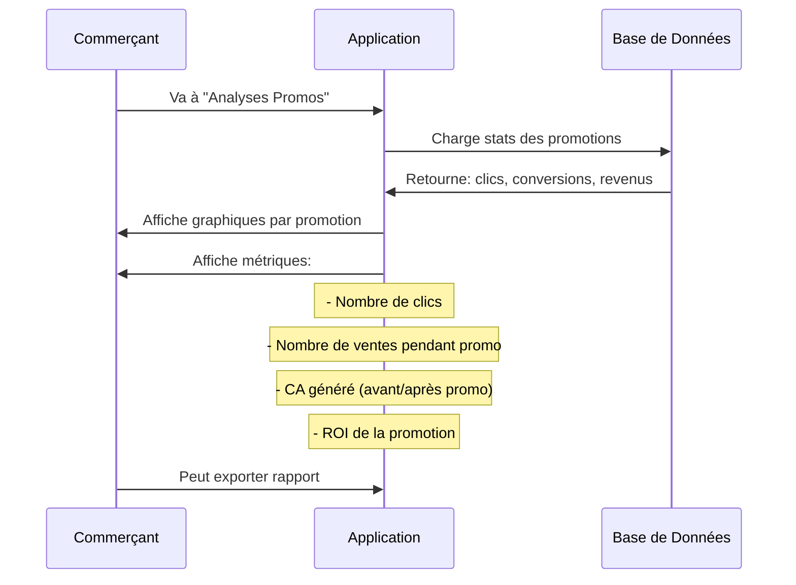
```mermaid
sequenceDiagram
    participant Commerçant
    participant Application
    participant Base de Données

    Commerçant->>Application: Va à "Analyses Promos"
    Application->>Base de Données: Charge stats des promotions
    Base de Données->>Application: Retourne: clics, conversions, revenus
    Application->>Commerçant: Affiche graphiques par promotion
    Application->>Commerçant: Affiche métriques: 
    Note over Application: - Nombre de clics
    Note over Application: - Nombre de ventes pendant promo
    Note over Application: - CA généré (avant/après promo)
    Note over Application: - ROI de la promotion
    Commerçant->>Application: Peut exporter rapport
```

---

## 🏃 Sprint 5 : Paiement & Gestion Commandes

### 2️⃣0️⃣ **Ajouter au Panier** - S5-D1
**Acteurs**: Client, Application, Base de Données
**Fonctionnalité**: Ajouter un produit au panier
**Niveau**: Critique

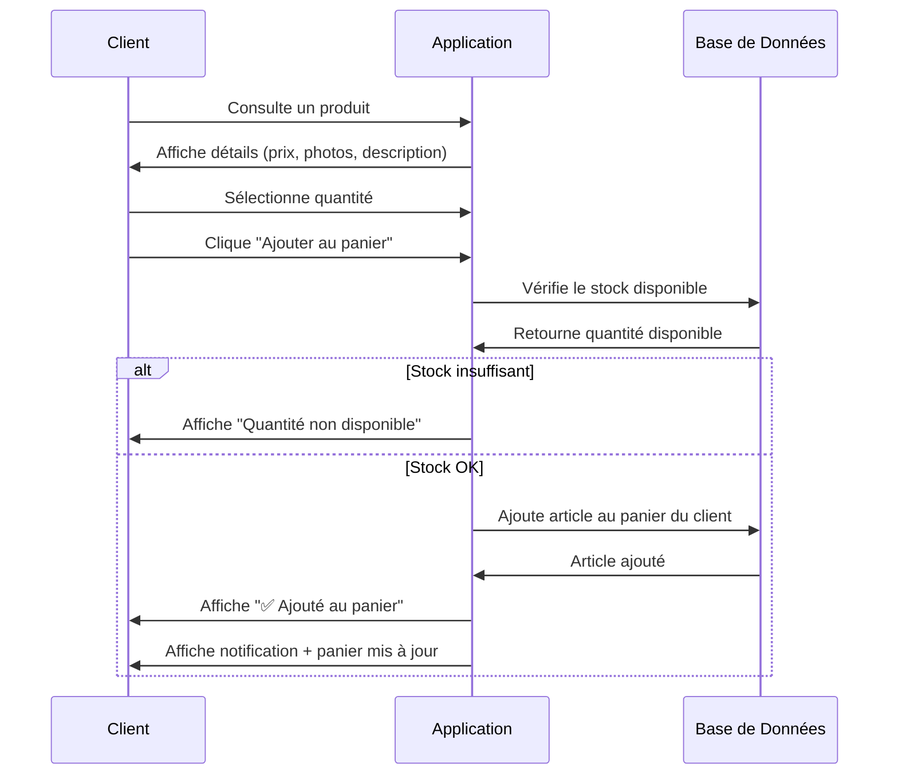
```mermaid
sequenceDiagram
    participant Client
    participant Application
    participant Base de Données

    Client->>Application: Consulte un produit
    Application->>Client: Affiche détails (prix, photos, description)
    Client->>Application: Sélectionne quantité
    Client->>Application: Clique "Ajouter au panier"
    Application->>Base de Données: Vérifie le stock disponible
    Base de Données->>Application: Retourne quantité disponible
    alt Stock insuffisant
        Application->>Client: Affiche "Quantité non disponible"
    else Stock OK
        Application->>Base de Données: Ajoute article au panier du client
        Base de Données->>Application: Article ajouté
        Application->>Client: Affiche "✅ Ajouté au panier"
        Application->>Client: Affiche notification + panier mis à jour
    end
```

---

### 2️⃣1️⃣ **Consulter & Modifier Panier** - S5-D2
**Acteurs**: Client, Application, Base de Données
**Fonctionnalité**: Voir et modifier le panier avant commande
**Niveau**: Critique

```mermaid
sequenceDiagram
    participant Client
    participant Application
    participant Base de Données

    Client->>Application: Va à "Mon Panier"
    Application->>Base de Données: Charge panier du client
    Base de Données->>Application: Retourne liste articles + total
    Application->>Client: Affiche tableau: produit, quantité, prix unitaire, total
    Client->>Application: Peut voir sous-total, frais livraison, total final
    Client->>Application: Peut modifier quantité d'un article
    Client->>Application: Peut supprimer un article
    Application->>Base de Données: Met à jour le panier
    Base de Données->>Application: Confirmé
    Application->>Client: Affiche nouveau total
    alt Panier vide
        Application->>Client: Affiche "Votre panier est vide"
    else Panier OK
        Client->>Application: Clique "Procéder au paiement"
    end
```

---

### 2️⃣2️⃣ **Créer Commande (Checkout)** - S5-D3
**Acteurs**: Client, Application, Base de Données, Passerelle Paiement
**Fonctionnalité**: Créer et valider une commande
**Niveau**: Critique

```mermaid
sequenceDiagram
    participant Client
    participant Application
    participant Base de Données
    participant Passerelle Paiement

    Client->>Application: Clique "Procéder au paiement"
    Application->>Client: Affiche formulaire adresse livraison
    Client->>Application: Remplit/confirme adresse
    Client->>Application: Sélectionne mode de livraison (pickup/delivery)
    Client->>Application: Sélectionne mode paiement (carte, wallet, espèces)
    Application->>Application: Calcule frais livraison
    Application->>Client: Affiche résumé commande + total
    Client->>Application: Confirme commande
    alt Mode paiement en ligne
        Application->>Passerelle Paiement: Envoie demande paiement
        Passerelle Paiement->>Client: Redirige vers page paiement
        Client->>Passerelle Paiement: Entre infos carte
        Passerelle Paiement->>Application: Retourne confirmation paiement
        Application->>Application: Paiement validé ✅
    else Mode paiement espèces/pickup
        Application->>Application: Paiement à la livraison
    end
    Application->>Base de Données: Crée commande (statut: confirmée)
    Base de Données->>Application: Commande créée avec numéro (ORD-XXXXXX-XXXX)
    Application->>Client: Affiche confirmation + numéro commande
```

---

### 2️⃣3️⃣ **Suivi Commande (Client)** - S5-D4
**Acteurs**: Client, Application, Base de Données
**Fonctionnalité**: Suivre l'état d'une commande
**Niveau**: Critique

```mermaid
sequenceDiagram
    participant Client
    participant Application
    participant Base de Données

    Client->>Application: Va à "Mes Commandes"
    Application->>Base de Données: Charge toutes les commandes du client
    Base de Données->>Application: Retourne liste des commandes (statuts)
    Application->>Client: Affiche liste: numéro, magasin, montant, statut
    Client->>Application: Clique sur une commande pour voir détails
    Application->>Base de Données: Charge détails complets
    Base de Données->>Application: Retourne: articles, prix, statut, QR code
    Application->>Client: Affiche timeline du statut:
    Note over Application: - En attente de confirmation
    Note over Application: - En préparation
    Note over Application: - Prête à livraison/Pickup
    Note over Application: - Livrée/Complétée
    Client->>Application: Peut scaner QR code pour vérification
    Client->>Application: Peut contacter commerçant
```

---

### 2️⃣4️⃣ **Gestion Commande (Commerçant)** - S5-D5
**Acteurs**: Commerçant, Application, Base de Données, Client
**Fonctionnalité**: Accepter, préparer et expédier commande
**Niveau**: Critique

```mermaid
sequenceDiagram
    participant Commerçant
    participant Application
    participant Base de Données
    participant Client

    Application->>Commerçant: 🔔 Notification nouvelle commande
    Commerçant->>Application: Va à "Commandes reçues"
    Application->>Base de Données: Charge toutes les commandes
    Base de Données->>Application: Retourne liste avec statuts
    Application->>Commerçant: Affiche commandes en attente
    Commerçant->>Application: Clique sur une commande
    Application->>Application: Affiche détails (articles, adresse, client)
    alt Commerçant refuse
        Commerçant->>Application: Clique "Refuser"
        Application->>Base de Données: Marque commande comme "Refusée"
        Application->>Client: Notif: "Commande refusée - Remboursement en cours"
    else Commerçant accepte
        Commerçant->>Application: Clique "Accepter"
        Application->>Base de Données: Change statut à "Acceptée - En préparation"
        Application->>Client: Notif: "Votre commande est en préparation"
        Commerçant->>Application: Prépare la commande physiquement
        Commerçant->>Application: Clique "Prête à livrer"
        Application->>Base de Données: Change statut à "Prête à livrer"
        Application->>Client: Notif: "Votre commande est prête!"
    end
```

---

# 🚀 RELEASE 3 : Expérience Sociale & Contenu

## 🏃 Sprint 6 : Interaction Sociale & Découverte

### 2️⃣5️⃣ **Créer Reel** - S6-D1
**Acteurs**: Vendeur/Client, Application, Service Vidéo, Base de Données
**Fonctionnalité**: Créer et publier une vidéo courte
**Niveau**: Important

```mermaid
sequenceDiagram
    participant Vendeur/Client
    participant Application
    participant Video Service
    participant Base de Données

    Vendeur/Client->>Application: Va à "Créer un Reel"
    Application->>Vendeur/Client: Affiche interface de capture vidéo
    Vendeur/Client->>Application: Fait une vidéo (durée limitée)
    alt Vendeur/Client enregistre depuis caméra
        Application->>Video Service: Capture la vidéo
    else Vendeur/Client importe une vidéo
        Vendeur/Client->>Application: Choisit vidéo depuis fichiers
    end
    Application->>Vendeur/Client: Affiche prévisualisation
    Vendeur/Client->>Application: Peut ajouter des effets/filtres
    Vendeur/Client->>Application: Ajoute description/hashtags/localisation
    Vendeur/Client->>Application: Clique "Publier"
    Application->>Video Service: Envoie vidéo pour traitement
    Video Service->>Video Service: Compresse et optimise
    Video Service->>Application: URLs vidéo retournées
    Application->>Base de Données: Enregistre le reel
    Base de Données->>Application: Reel créé
    Application->>Vendeur/Client: "Reel publié avec succès!"
    Application->>Application: Affiche le reel dans le fil d'actualité
```

---

### 2️⃣6️⃣ **Consulter Reels & Interactions** - S6-D2
**Acteurs**: Client, Application, Base de Données
**Fonctionnalité**: Voir reels et interagir (like, comment, partage)
**Niveau**: Important

```mermaid
sequenceDiagram
    participant Client
    participant Application
    participant Base de Données

    Client->>Application: Va à "Découvrir - Reels"
    Application->>Base de Données: Charge reels populaires (feed)
    Base de Données->>Application: Retourne liste reels triés par engagement
    Application->>Client: Affiche reel (vidéo fullscreen)
    Client->>Application: Voit boutons: ❤️ Like, 💬 Comment, 📱 Partage, 🔖 Save
    Client->>Application: Clique "❤️ Like"
    Application->>Base de Données: Incrémente compteur likes
    Base de Données->>Application: Confirmé
    Application->>Client: Le cœur devient rouge, compteur augmente
    Client->>Application: Clique "💬 Comment"
    Application->>Client: Affiche section commentaires
    Client->>Application: Écrit un commentaire
    Application->>Base de Données: Enregistre commentaire
    Application->>Client: Affiche commentaire dans les commentaires
    Client->>Application: Peut glisser vers bas/haut pour voir autres reels
```

---

### 2️⃣7️⃣ **Créer Story (24h)** - S6-D3
**Acteurs**: Commerçant, Application, Base de Données, Service Fichier
**Fonctionnalité**: Publier une story qui disparaît en 24h
**Niveau**: Normal

```mermaid
sequenceDiagram
    participant Commerçant
    participant Application
    participant Base de Données
    participant Service Fichier

    Commerçant->>Application: Va à "Créer Story"
    Application->>Commerçant: Affiche caméra ou upload
    Commerçant->>Application: Prend photo ou vidéo (courte)
    Commerçant->>Application: Peut ajouter texte/stickers
    Commerçant->>Application: Clique "Publier"
    Application->>Service Fichier: Envoie fichier média
    Service Fichier->>Application: URL retournée
    Application->>Base de Données: Enregistre story avec expiration 24h
    Base de Données->>Application: Story créée
    Application->>Commerçant: "Story publiée!"
    Application->>Application: Affiche story dans les stories du magasin
```

---

### 2️⃣8️⃣ **Affichage Stories** - S6-D4
**Acteurs**: Client, Application, Base de Données
**Fonctionnalité**: Voir les stories de commerçants
**Niveau**: Normal

```mermaid
sequenceDiagram
    participant Client
    participant Application
    participant Base de Données

    Client->>Application: Va à "Accueil" ou "Découvrir"
    Application->>Base de Données: Charge stories non-expirées des commerçants suivis
    Base de Données->>Application: Retourne list stories
    Application->>Client: Affiche carrousel de stories (cercles en haut)
    Client->>Application: Clique sur story
    Application->>Client: Affiche story plein écran (compte dégressif 5s)
    Client->>Application: Peut cliquer pour aller à la story suivante
    Client->>Application: Peut cliquer "Répondre" pour envoyer DM
    Note over Application: Story disparaît automatiquement après 24h
```

---

### 2️⃣9️⃣ **Poster Avis/Commentaire** - S6-D5
**Acteurs**: Client, Application, Base de Données, Moteur IA
**Fonctionnalité**: Laisser un avis sur un produit/service
**Niveau**: Critique

```mermaid
sequenceDiagram
    participant Client
    participant Application
    participant Base de Données
    participant Moteur IA

    Client->>Application: Va à un produit/service complété
    Application->>Client: Affiche section "Évaluer et commenter"
    Client->>Application: Sélectionne note (1-5 étoiles)
    Client->>Application: Écrit commentaire (optionnel)
    Client->>Application: Peut ajouter photos (optionnel)
    Client->>Application: Clique "Soumettre l'avis"
    Application->>Application: Valide les données
    Application->>Base de Données: Enregistre l'avis (en attente modération)
    Base de Données->>Application: Avis enregistré
    Application->>Moteur IA: Envoie le texte de l'avis
    Moteur IA->>Moteur IA: Analyse le sentiment (positif/négatif/neutre)
    Moteur IA->>Application: Retourne score sentiment
    Application->>Base de Données: Enregistre score sentiment
    Application->>Client: "Merci pour votre avis!"
    Note over Application: Admin peut modérer avant affichage
```

---

### 3️⃣0️⃣ **Consulter Avis Produits** - S6-D6
**Acteurs**: Client, Application, Base de Données
**Fonctionnalité**: Voir les avis d'autres clients
**Niveau**: Critique

```mermaid
sequenceDiagram
    participant Client
    participant Application
    participant Base de Données

    Client->>Application: Consulte un produit
    Application->>Base de Données: Charge avis du produit (triés par utilité)
    Base de Données->>Application: Retourne liste avis + moyennes
    Application->>Client: Affiche note moyenne (ex: ⭐⭐⭐⭐ 4.5/5)
    Application->>Client: Affiche avis les plus utiles en premier
    Client->>Application: Peut filtrer par note (5⭐, 4⭐, etc)
    Client->>Application: Clique sur un avis pour voir détails
    Application->>Client: Affiche: note, texte, photos, nom client, date
    Client->>Application: Peut cliquer "👍 Utile" pour valider avis
    Client->>Application: Peut signaler avis si abusif
```

---

## 🏃 Sprint 7 : Messagerie & Support

### 3️⃣1️⃣ **Envoi Message (Client ↔ Commerçant)** - S7-D1
**Acteurs**: Client/Commerçant, Application, Base de Données, Service Notification
**Fonctionnalité**: Communicationdirecte entre client et commerçant
**Niveau**: Important

```mermaid
sequenceDiagram
    participant Client
    participant Application
    participant Base de Données
    participant Service Notification

    Client->>Application: Va à "Messages" ou clique "Contacter le magasin"
    Application->>Base de Données: Charge conversations existantes
    Application->>Client: Affiche liste conversations
    Client->>Application: Clique sur conversation ou crée nouvelle
    Application->>Client: Ouvre chat window
    Client->>Application: Écrit message et clique "Envoyer"
    Application->>Base de Données: Enregistre le message
    Base de Données->>Application: Message enregistré
    Application->>Service Notification: Envoie push notif au commerçant
    Service Notification->>Commerçant: 🔔 Notification en temps réel
    Commerçant->>Application: Voit nouveau message
    Application->>Commerçant: Affiche nouveau message dans le chat
    Note over Application: Messages visibles en temps réel (WebSocket)
```

---

### 3️⃣2️⃣ **Consultation Historique Messages** - S7-D2
**Acteurs**: Client/Commerçant, Application, Base de Données
**Fonctionnalité**: Accéder aux conversations passées
**Niveau**: Normal

```mermaid
sequenceDiagram
    participant Utilisateur
    participant Application
    participant Base de Données

    Utilisateur->>Application: Va à "Messages"
    Application->>Base de Données: Charge toutes les conversations
    Base de Données->>Application: Retourne liste conversations avec derniers messages
    Application->>Utilisateur: Affiche liste conversations triées par date
    Utilisateur->>Application: Clique sur une conversation
    Application->>Base de Données: Charge tous les messages de cette conversation
    Base de Données->>Application: Retourne historique complet
    Application->>Utilisateur: Affiche conversation (scroll infini)
    Utilisateur->>Application: Peut archiver la conversation
    Application->>Base de Données: Marque conversation comme archivée
```

---

### 3️⃣3️⃣ **Créer Ticket Support** - S7-D3
**Acteurs**: Client/Commerçant, Application, Base de Données, Support Team
**Fonctionnalité**: Signaler un problème au support
**Niveau**: Normal

```mermaid
sequenceDiagram
    participant Utilisateur
    participant Application
    participant Base de Données
    participant Support Team

    Utilisateur->>Application: Va à "Support" ou "Aide"
    Application->>Utilisateur: Affiche formulaire ticket
    Utilisateur->>Application: Sélectionne catégorie (Paiement, Livraison, Produit, etc)
    Utilisateur->>Application: Écrit description du problème
    Utilisateur->>Application: Peut ajouter fichiers/captures écran
    Utilisateur->>Application: Clique "Créer Ticket"
    Application->>Base de Données: Enregistre le ticket
    Base de Données->>Application: Ticket créé avec ID
    Application->>Support Team: 🔔 Nouveau ticket assigné
    Application->>Utilisateur: "Ticket créé - Numéro: TK-XXXXXX"
    Support Team->>Application: Répond au ticket
    Application->>Utilisateur: 🔔 Réponse du support reçue
```

---

# 🚀 RELEASE 4 : IA Avancée & Analytics

## 🏃 Sprint 8 : Recommandations & Recherche IA

### 3️⃣4️⃣ **Recommandations Produits (IA)** - S8-D1
**Acteurs**: Client, Application, Moteur IA, Base de Données
**Fonctionnalité**: Proposer des produits personnalisés selon l'historique
**Niveau**: Important

```mermaid
sequenceDiagram
    participant Client
    participant Application
    participant Moteur IA
    participant Base de Données

    Client->>Application: Consulte un produit
    Application->>Moteur IA: Envoie: ID client, ID produit, historique achats
    Moteur IA->>Base de Données: Récupère: catégorie, prix, traits produit
    Moteur IA->>Moteur IA: Analyse: produits similaires, tendances client
    Moteur IA->>Moteur IA: pgvector matching + machine learning
    Moteur IA->>Application: Retourne liste recommandations (scored)
    Application->>Client: Affiche "Vous aimerez aussi..." section
    Application->>Client: Affiche 5-6 produits recommandés (cartes)
    Client->>Application: Peut cliquer pour voir détails
    Note over Application: Recommandations basées sur historique + profil
```

---

### 3️⃣5️⃣ **Recherche Sémantique (IA)** - S8-D2
**Acteurs**: Client, Application, Moteur IA, Base de Données
**Fonctionnalité**: Rechercher en langage naturel (Darija, français)
**Niveau**: Important

```mermaid
sequenceDiagram
    participant Client
    participant Application
    participant Moteur IA
    participant Base de Données

    Client->>Application: Va à la barre de recherche
    Client->>Application: Écrit requête (ex: "pizza halal pas chère")
    Application->>Moteur IA: Envoie la requête texte
    Moteur IA->>Moteur IA: NLP Processing (tokenization, embedding)
    Moteur IA->>Moteur IA: Comprend l'intention: halal + prix bas + pizza
    Moteur IA->>Base de Données: Cherche produits correspondants
    Base de Données->>Moteur IA: Retourne candidats
    Moteur IA->>Moteur IA: Rerank par similarité sémantique
    Moteur IA->>Application: Retourne résultats triés par pertinence
    Application->>Client: Affiche résultats (meilleurs matches en premier)
    Note over Application: Comprend Darija, français, variantes linguistiques
```

---

### 3️⃣6️⃣ **Recherche par Image (Vision AI)** - S8-D3
**Acteurs**: Client, Application, Vision API, Base de Données
**Fonctionnalité**: Chercher en uploadant une photo
**Niveau**: Important

```mermaid
sequenceDiagram
    participant Client
    participant Application
    participant Vision API
    participant Base de Données

    Client->>Application: Clique sur icône caméra (recherche)
    Application->>Client: Permet upload/capture photo
    Client->>Application: Prend ou upload une photo
    Application->>Vision API: Envoie image pour analyse
    Vision API->>Vision API: Analyse contenu image (objet recognition)
    Vision API->>Application: Retourne: tags, description, features extraites
    Application->>Base de Données: Cherche produits avec features similaires
    Base de Données->>Application: Retourne candidats matchant l'image
    Application->>Client: Affiche résultats "Produits similaires à votre photo"
    Note over Application: Utilise LLM Vision pour comprendre images
```

---

### 3️⃣7️⃣ **Assistant IA Commerçant** - S8-D4
**Acteurs**: Commerçant, Application, Moteur IA, Base de Données
**Fonctionnalité**: Conseils IA pour augmenter ventes
**Niveau**: Important

```mermaid
sequenceDiagram
    participant Commerçant
    participant Application
    participant Moteur IA
    participant Base de Données

    Commerçant->>Application: Va à "Assistant IA" (dashboard)
    Application->>Base de Données: Charge données magasin: ventes, avis, produits
    Base de Données->>Application: Retourne stats du magasin
    Application->>Moteur IA: Envoie: stats magasin, produits, avis
    Moteur IA->>Moteur IA: Analyse: tendances, produits sous-performants, patterns
    Moteur IA->>Application: Retourne insights & recommandations
    Application->>Commerçant: Affiche panel "Conseils pour booster ventes"
    Note over Moteur IA: Suggestions: baisser prix, promouvoir produit X,
    Note over Moteur IA: améliorer description, ajouter photos, etc.
    Commerçant->>Application: Peut implémenter suggestions directement
```

---

## 🏃 Sprint 9 : Détection Fraude & Modération

### 3️⃣8️⃣ **Vérification Fraude (Commande)** - S9-D1
**Acteurs**: Application, Moteur Fraude (IA), Base de Données, Client
**Fonctionnalité**: Vérifier chaque commande pour fraude
**Niveau**: Critique

```mermaid
sequenceDiagram
    participant Client
    participant Application
    participant Moteur Fraude
    participant Base de Données

    Note over Application: Client effectue paiement
    Application->>Moteur Fraude: Envoie données commande:
    Note over Moteur Fraude: - Montant, historique client, localisation
    Note over Moteur Fraude: - Fréquence achats, pattern paiement
    Note over Moteur Fraude: - Adresse livraison (match adresse profil?)
    Moteur Fraude->>Base de Données: Récupère historique commandes client
    Base de Données->>Moteur Fraude: Retourne historique + score réputation
    Moteur Fraude->>Moteur Fraude: Calcule score de risque (0-100)
    Moteur Fraude->>Application: Retourne: score fraude, recommandation
    alt Score > 70 (Fraude probable)
        Application->>Base de Données: Marque commande "En attente vérification"
        Application->>Client: Message: "Vérification en cours - nous vous contacterons"
        Note over Application: Admin review nécessaire
    else Score < 30 (Fiable)
        Application->>Base de Données: Valide commande
        Application->>Client: Commande confirmée ✅
    else Score 30-70 (À surveiller)
        Application->>Base de Données: Valide mais flag pour analyse
    end
```

---

### 3️⃣9️⃣ **Tableau de Bord Fraude (Admin)** - S9-D2
**Acteurs**: Admin, Application, Moteur Fraude, Base de Données
**Fonctionnalité**: Surveiller et valider alertes fraude
**Niveau**: Important

```mermaid
sequenceDiagram
    participant Admin
    participant Application
    participant Moteur Fraude
    participant Base de Données

    Admin->>Application: Va à "Détection Fraude"
    Application->>Base de Données: Charge alertes fraude du jour
    Base de Données->>Application: Retourne commandes en attente vérification
    Application->>Admin: Affiche liste alertes par score risque
    Admin->>Application: Clique sur une alerte
    Application->>Admin: Affiche détails: commande, pattern client, reason score
    Admin->>Moteur Fraude: Demande infos supplémentaires si nécessaire
    Moteur Fraude->>Application: Retourne analyse détaillée
    alt Admin considère légitime
        Admin->>Application: Clique "Approuver"
        Application->>Base de Données: Change statut à "Confirmée"
    else Admin refuse
        Admin->>Application: Clique "Bloquer + Rembourser"
        Application->>Base de Données: Marque "Fraude"
        Application->>Client: Notification fraude détectée + remboursement
    end
```

---

### 4️⃣0️⃣ **Modération Contenu (Admin)** - S9-D3
**Acteurs**: Admin, Application, Base de Données, Moderation AI
**Fonctionnalité**: Modérer reels, stories, avis abusifs
**Niveau**: Important

```mermaid
sequenceDiagram
    participant Admin
    participant Application
    participant Base de Données
    participant Moderation AI

    Admin->>Application: Va à "Modération"
    Application->>Base de Données: Charge contenu signalé + en attente
    Base de Données->>Application: Retourne reels, stories, avis à modérer
    Application->>Admin: Affiche queue modération (triée par nombre signalements)
    Admin->>Application: Clique sur contenu à modérer
    Application->>Admin: Affiche: vidéo/image, texte, raisons signalement
    Application->>Moderation AI: Analyse contenu pour violations
    Moderation AI->>Application: Retourne: risques détectés, score confiance
    alt Admin valide le refus
        Admin->>Application: Clique "Supprimer"
        Application->>Base de Données: Marque contenu "Supprimé"
        Application->>Auteur: Notification: "Votre contenu a été supprimé"
    else Admin valide le maintien
        Admin->>Application: Clique "Autoriser"
        Application->>Base de Données: Marque "Approuvé"
    end
```

---

# 🚀 RELEASE 5 : Optimisation & Scaling

## 🏃 Sprint 10 : Performance & Caching

### 4️⃣1️⃣ **Cache Données (Redis)** - S10-D1
**Acteurs**: Application, Cache Service (Redis), Base de Données
**Fonctionnalité**: Accélérer les requêtes fréquentes
**Niveau**: Technique

```mermaid
sequenceDiagram
    participant Client
    participant Application
    participant Cache Redis
    participant Base de Données

    Client->>Application: Requête produits populaires
    Application->>Cache Redis: Cherche "products:popular:day1"
    alt Cache HIT
        Cache Redis->>Application: Retourne données en cache ⚡
        Application->>Client: Affiche résultats (< 50ms)
        Note over Cache Redis: Pas accès DB, réponse ultra rapide
    else Cache MISS
        Application->>Base de Données: Requête DB
        Base de Données->>Application: Retourne résultats
        Application->>Cache Redis: Stocke résultats avec TTL 1h
        Cache Redis->>Application: Confirmé
        Application->>Client: Affiche résultats
        Note over Application: Prochaine requête: cache HIT
    end
```

---

### 4️⃣2️⃣ **Invalidation Cache** - S10-D2
**Acteurs**: Application, Cache Redis, Base de Données
**Fonctionnalité**: Mettre à jour cache quand données changent
**Niveau**: Technique

```mermaid
sequenceDiagram
    participant Commerçant
    participant Application
    participant Cache Redis
    participant Base de Données

    Commerçant->>Application: Ajoute un nouveau produit
    Application->>Base de Données: INSERT produit
    Base de Données->>Application: Confirmé
    Application->>Cache Redis: Invalide "products:*" (tous les produits)
    Cache Redis->>Application: Confirmé
    Note over Application: Cache purgé, prochaine requête recalculera DB
    Commerçant->>Application: Change prix d'un produit
    Application->>Base de Données: UPDATE produit
    Application->>Cache Redis: Invalide "products:PROD-ID" + "products:popular"
    Cache Redis->>Application: Confirmé
    Note over Application: Cache spécifique purgé
```

---

## 🏃 Sprint 11 : Analyse Avancée

### 4️⃣3️⃣ **Tableau de Bord Analytics (Admin)** - S11-D1
**Acteurs**: Admin, Application, Base de Données
**Fonctionnalité**: Voir statistiques globales de la plateforme
**Niveau**: Important

```mermaid
sequenceDiagram
    participant Admin
    participant Application
    participant Base de Données

    Admin->>Application: Va à "Analytics - Dashboard"
    Application->>Base de Données: Agrège stats: utilisateurs, commandes, revenus
    Base de Données->>Application: Retourne: 
    Note over Base de Données: - Nouveaux utilisateurs (jour/mois)
    Note over Base de Données: - Nombre de commandes totales
    Note over Base de Données: - CA généré (filtré par période)
    Note over Base de Données: - Top produits vendus
    Note over Base de Données: - Top commerces par chiffre
    Note over Base de Données: - Taux satisfaction clients (avis moy)
    Application->>Admin: Affiche dashboards avec graphiques:
    Application->>Admin: - Line chart: croissance utilisateurs
    Application->>Admin: - Pie chart: répartition par catégorie
    Application->>Admin: - Top 10 commerçants, produits
    Admin->>Application: Peut filtrer par date, catégorie, région
```

---

### 4️⃣4️⃣ **Rapport Revenus & Payout (Admin)** - S11-D2
**Acteurs**: Admin, Application, Base de Données
**Fonctionnalité**: Calculer et générer rapports de revenus
**Niveau**: Important

```mermaid
sequenceDiagram
    participant Admin
    participant Application
    participant Base de Données

    Admin->>Application: Va à "Rapports Revenus"
    Application->>Base de Données: Calcule revenus par commerçant pour période
    Base de Données->>Application: Retourne: commisssion, CA, payout
    Application->>Admin: Affiche tableau avec:
    Note over Application: - Commerçant | CA | Commission (%) | Revenue Plateforme
    Application->>Admin: Peut exporter en CSV/PDF
    Admin->>Application: Clique "Exporter Rapport"
    Application->>Application: Génère fichier (CSV ou PDF)
    Application->>Admin: Téléchargement fichier rapport
    Note over Application: Prêt pour comptabilité, audit
```

---

## 📊 Récapitulatif par Release

| Release | Sprints | Diagrammes | Focus |
|---------|---------|-----------|-------|
| **R1** | S1-S2 | 8 | Authentification, Back-office |
| **R2** | S3-S5 | 16 | E-Commerce, Panier, Commandes |
| **R3** | S6-S7 | 9 | Social, Reels, Messagerie |
| **R4** | S8-S9 | 7 | IA, Recommandations, Fraude |
| **R5** | S10-S11 | 4 | Performance, Analytics |
| **TOTAL** | 11 | 44 | Platform Complet |

---

## 🎯 Legend & Terminologie

- **UC-ID** = Use Case ID
- **SX-DY** = Sprint X - Diagram Y
- **Include** = Toujours exécuté avec le cas principal
- **Extend** = Variante conditionnelle du cas principal
- **Acteur** = Rôle qui interagit avec le système
- **Postcondition** = État du système après succès

---

**Document généré**: 18 Mai 2026  
**Version**: 1.0 - Complète  
**Statut**: ✅ Prêt pour implémentation Agile
