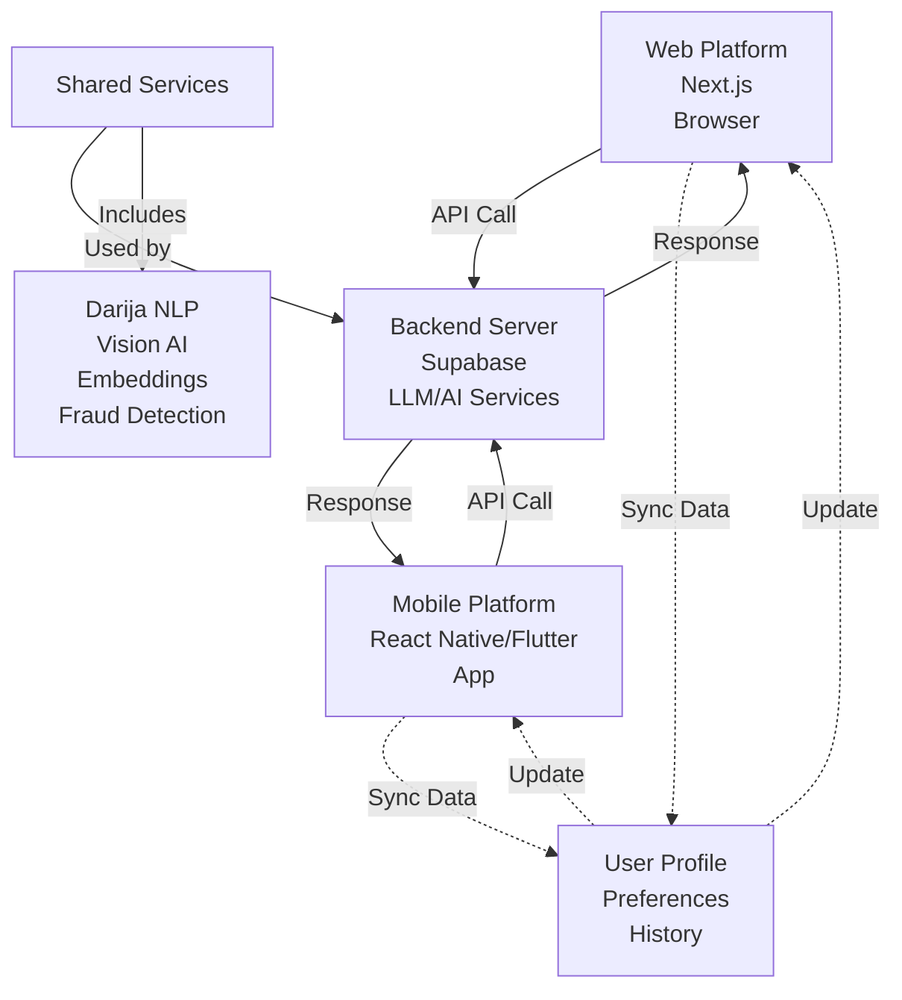
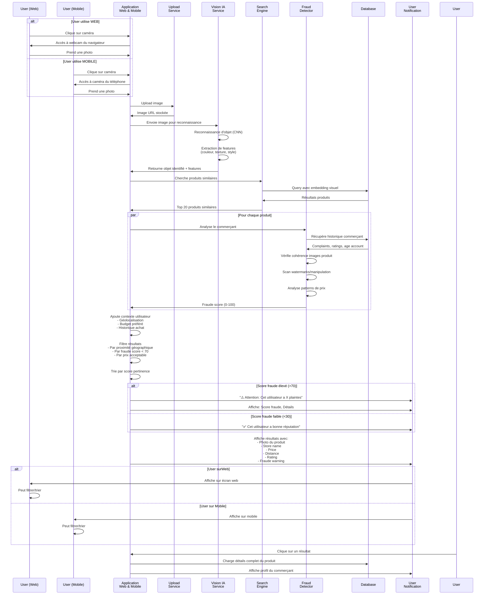
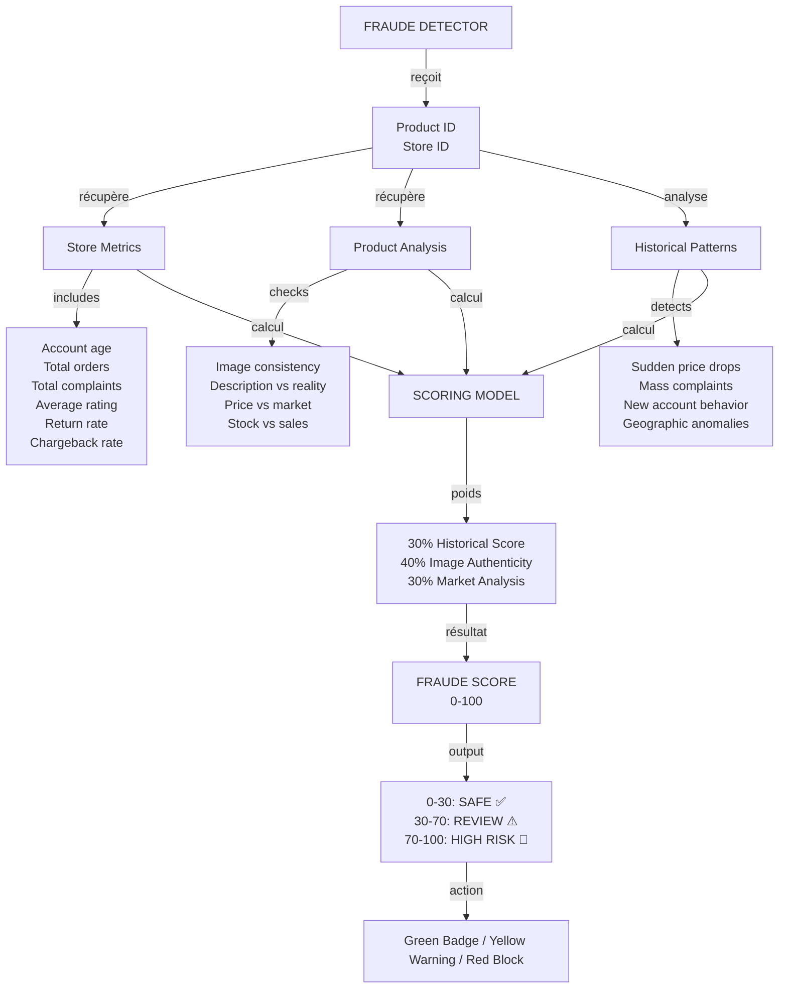
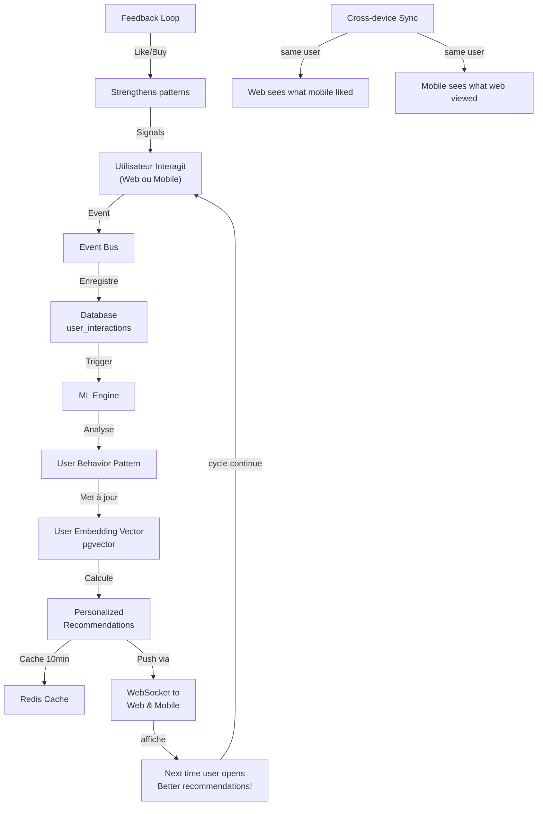
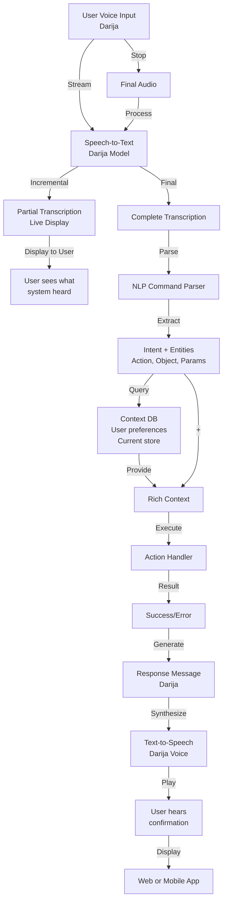
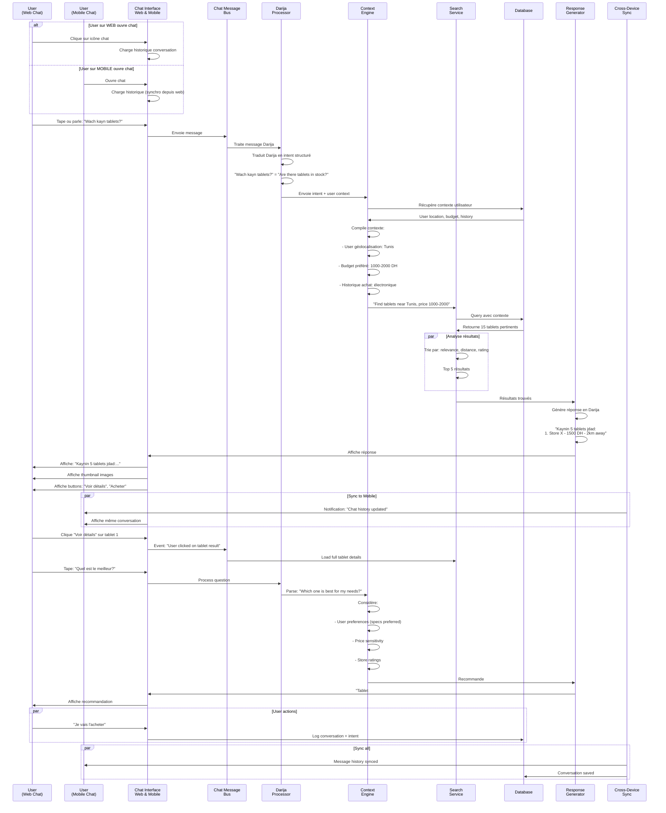
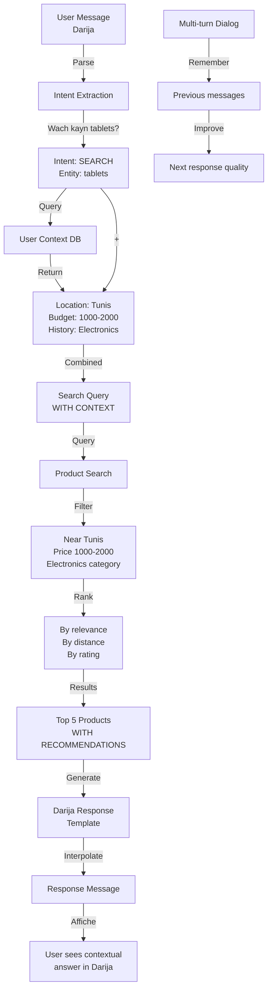
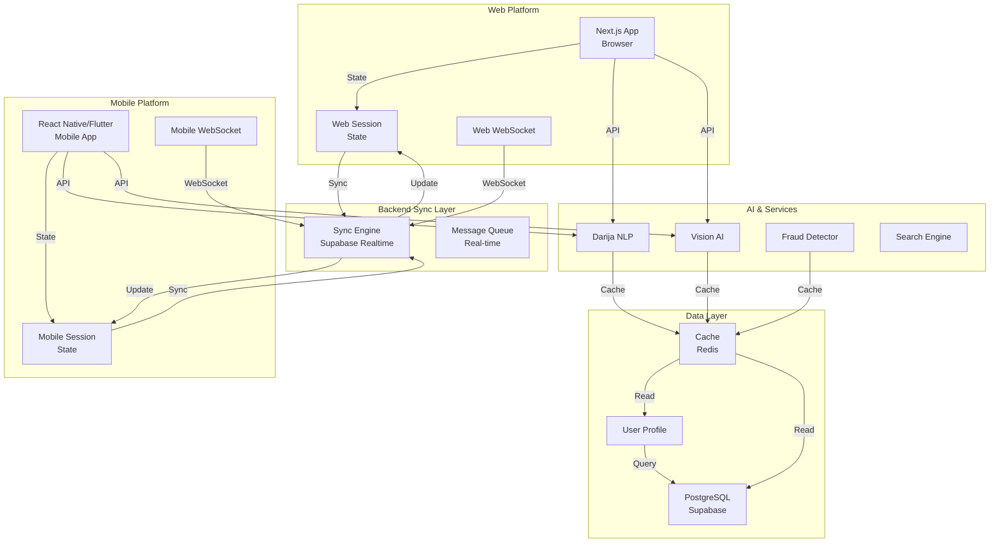

# 🔄 Diagrammes de Séquence Détaillés - Workflows Clés avec Web & Mobile

Diagrammes de séquence **complets et détaillés** pour les 4 workflows prioritaires avec support **Web et Mobile identique**.

---

## 📌 ARCHITECTURE MULTI-PLATEFORME



---

## 🎯 DIAGRAMME 35 - RECHERCHE PAR IMAGE AVEC CONTEXTE + FRAUDE

### **Vue Complète: Web & Mobile**



### **Détail de la Détection de Fraude Commerçant**



---

## 🧠 DIAGRAMME 38 - APPRENTISSAGE PREFERENTIAL EN CONTINU (Web + Mobile)

### **Vue Complète avec Synchronisation Cross-Device**

```mermaid
sequenceDiagram
    participant UserWeb as User<br/>(Web)
    participant UserMobile as User<br/>(Mobile)
    participant WebApp as Web App
    participant MobileApp as Mobile App
    participant EventBus as Event Bus<br/>Real-time
    participant ML as ML Engine<br/>Recommendations
    participant Database as Database<br/>User Profile
    participant EmbeddingStore as Embedding<br/>Store
    participant Cache as Cache<br/>10min TTL
    
    par Web Interaction
        UserWeb->>WebApp: Voit produit A
        WebApp->>EventBus: Event: "VIEW" {product_id, duration}
    and Mobile Interaction
        UserMobile->>MobileApp: Aime produit B
        MobileApp->>EventBus: Event: "LIKE" {product_id}
    and Mobile Interaction
        UserMobile->>MobileApp: Achète service C
        MobileApp->>EventBus: Event: "BUY" {product_id, amount}
    end
    
    EventBus->>EventBus: Accumule interactions
    EventBus->>Database: Enregistre dans user_interactions
    Database->>Cache: Met à jour cache utilisateur
    
    Database->>ML: Déclenche update user profile
    ML->>Database: Récupère toutes les interactions
    Database->>ML: Retourne: 500 views, 50 likes, 10 buys
    
    ML->>EmbeddingStore: Crée user embedding<br/>basé sur interactions
    EmbeddingStore->>EmbeddingStore: Analyse patterns<br/>- Préfère catégorie X<br/>- Aime prix Y-Z<br/>- Cherche près de localisation
    
    EmbeddingStore->>ML: User vector updated
    ML->>ML: Calcule recommendations<br/>- Similar items à liked<br/>- Trending dans ses catégories<br/>- Stores populaires près de lui
    
    ML->>Database: Stocke top 20 recommendations
    ML->>Cache: Cache recommendations (10 min)
    
    par Web reçoit update
        Database->>WebApp: Notification: Recommendations updated
        WebApp->>EventBus: WebSocket: Push update
        EventBus->>WebApp: New recommendations
        WebApp->>UserWeb: Affiche "Recommandé pour vous"
        UserWeb->>UserWeb: Voit produits pertinents
    and Mobile reçoit SAME update
        Database->>MobileApp: Notification: Recommendations updated
        MobileApp->>EventBus: WebSocket: Push update
        EventBus->>MobileApp: New recommendations
        MobileApp->>UserMobile: Affiche "Recommandé pour vous"
        UserMobile->>UserMobile: Voit mêmes produits (synchro)
    end
    
    par User interagit sur WEB
        UserWeb->>WebApp: Like un produit recommandé
        WebApp->>EventBus: Event: "LIKE_FROM_RECOMMENDATION"
    and User interagit sur MOBILE
        UserMobile->>MobileApp: Buy un produit recommandé
        MobileApp->>EventBus: Event: "BUY_FROM_RECOMMENDATION"
    end
    
    EventBus->>ML: Renforce ces patterns
    ML->>ML: ML améliore rapidement recommendations
    
    note over ML, Cache
        La prochaine fois que l'utilisateur ouvre l'app
        (web ou mobile), les recommendations seront
        encore plus pertinentes!
    end
```

### **Continuous Learning Loop**



---

## 🎤 DIAGRAMME 53 - DARIJA VOICE COMMAND (Web + Mobile)

### **Vue Complète: Voice Commands en Darija**

```mermaid
sequenceDiagram
    participant UserWeb as User<br/>(Web)
    participant UserMobile as User<br/>(Mobile)
    participant WebApp as Web App<br/>Browser
    participant MobileApp as Mobile App
    participant AudioCapture as Audio<br/>Capture
    participant DarijaTranscriber as Darija<br/>Speech-to-Text
    participant CommandParser as Command<br/>Parser
    participant ActionExecutor as Action<br/>Executor
    participant VoiceResponse as Voice<br/>Response Engine
    participant Database as Database
    
    alt User sur WEB - Clique Microphone
        UserWeb->>WebApp: "Clique sur icône microphone"
        WebApp->>AudioCapture: Demande accès microphone
        AudioCapture->>WebApp: Permission acceptée
    else User sur MOBILE - Clique Microphone
        UserMobile->>MobileApp: "Clique sur icône microphone"
        MobileApp->>AudioCapture: Accès au microphone du téléphone
        AudioCapture->>MobileApp: Prêt
    end
    
    note over UserWeb, UserMobile
        L'expérience est IDENTIQUE sur les deux platforms
    end
    
    par Web Recording
        AudioCapture->>WebApp: Streaming audio en temps réel
    and Mobile Recording
        AudioCapture->>MobileApp: Streaming audio en temps réel
    end
    
    UserWeb->>AudioCapture: Parle: "Khdem promotion 20%"
    UserMobile->>AudioCapture: Parle: "Khdem promotion 20%"
    
    par Web Transcription
        AudioCapture->>DarijaTranscriber: Envoie audio Darija
    and Mobile Transcription
        AudioCapture->>DarijaTranscriber: Envoie audio Darija
    end
    
    DarijaTranscriber->>DarijaTranscriber: Transcrip Darija en temps réel
    DarijaTranscriber->>DarijaTranscriber: "Khdem promotion 20%"
    DarijaTranscriber->>CommandParser: Texte transcrit + context utilisateur
    
    CommandParser->>CommandParser: Parse commande Darija
    CommandParser->>CommandParser: Identifie: ACTION=Create, TYPE=Promotion, VALUE=20%
    CommandParser->>CommandParser: Extrait paramètres
    
    alt Commande valide
        CommandParser->>ActionExecutor: Execute: Create_Promotion(20%)
        ActionExecutor->>Database: Crée nouvelle promotion
        Database->>ActionExecutor: Promotion ID retourné
        ActionExecutor->>ActionExecutor: Prépare réponse vocal
        ActionExecutor->>VoiceResponse: "Promotion 20% créée avec succès!"
        VoiceResponse->>VoiceResponse: Synthèse vocale en Darija
    else Commande ambiguë
        CommandParser->>VoiceResponse: "Pouvez-vous préciser?"
        VoiceResponse->>VoiceResponse: Synthèse en Darija
    end
    
    par Web Output
        VoiceResponse->>WebApp: Audio response + text
        WebApp->>UserWeb: Affiche résultat textuel ET vocal
        UserWeb->>UserWeb: Écoute confirmation vocale
    and Mobile Output
        VoiceResponse->>MobileApp: Audio response + text
        MobileApp->>UserMobile: Affiche résultat textuel ET vocal
        UserMobile->>UserMobile: Écoute confirmation vocale
    end
    
    alt User satisfait
        UserWeb/UserMobile->>WebApp/MobileApp: Clique "Confirmer" OU
        UserWeb/UserMobile->>AudioCapture: Parle "Oui" ou "Confirm"
        WebApp/MobileApp->>Database: Finalise l'action
    else User corrige
        UserWeb/UserMobile->>AudioCapture: Parle la correction: "Non 25%"
        AudioCapture->>DarijaTranscriber: Retranscrit
        DarijaTranscriber->>CommandParser: Parse correction
        CommandParser->>ActionExecutor: Execute: Create_Promotion(25%)
        ActionExecutor->>VoiceResponse: Confirmation
        VoiceResponse->>WebApp/MobileApp: Affiche correction
    end
```

### **Exemples de Commandes Darija**

```
Format: [ACTION] [OBJECT] [PARAMETERS]

CRÉER (Create):
- "Khdem promotion 30%" → Create promotion 30%
- "Zid produit t-shirt" → Add product t-shirt
- "Khdem story" → Create story

CHERCHER (Search):
- "Wach kayn tablets?" → Show available tablets
- "Shufi stores jodod" → Show new stores
- "Recherche restaurants" → Find restaurants

MODIFIER (Update):
- "Beddel price 100 DH" → Change price to 100 DH
- "Ghayyar description" → Update description

SUPPRIMER (Delete):
- "Supp hada reel" → Delete this reel
- "Waqaf promotion" → Stop promotion
```

### **Darija Voice Command - Advanced Flow**



---

## 🤖 DIAGRAMME 54 - CHATBOT DARIJA AVEC CONTEXTE (Web + Mobile)

### **Vue Complète: Conversation Darija Contextuelle**



### **Chatbot Context Flow**



### **Exemples de Conversation Darija**

```
User: "Wach kayn coffee shops ljnab diali?"
Bot: "Kaynin 7 coffee shops jdad ljnab diak..."

User: "Amin les aqrab?"
Bot: "Coffee Blue - 300m away - Open now - 4.9★"

User: "Oukhtana ntat chi menu?"
Bot: "Menu: Espresso (15 DH), Cappuccino (20 DH)..."

User: "Nqass chi promo?"
Bot: "Yes! Promotion: Buy 2 get 1 free this weekend"

User: "Nstakhdim voucher?"
Bot: "Sure! Use code FRIDAY20 for 20% off"
```

---

## 🌐 ARCHITECTURE WEB + MOBILE SYNCHRONISÉE



---

## ✅ RÉSUMÉ DES 4 WORKFLOWS PRIORITAIRES

| # | Workflow | Web | Mobile | Sync | Priorité |
|---|----------|-----|--------|------|----------|
| **35** | Recherche par Image + Fraude | ✅ | ✅ | Cross-device | **HAUTE** |
| **38** | Apprentissage Préférentiel | ✅ | ✅ | Real-time sync | **HAUTE** |
| **53** | Voice Commands Darija | ✅ | ✅ | Instant | **HAUTE** |
| **54** | Chatbot Darija | ✅ | ✅ | Real-time | **HAUTE** |

---

**Points clés:**
- 🌐 Chaque workflow fonctionne **identiquement** sur Web ET Mobile
- 🔄 Synchronisation en temps réel entre appareils
- 🎤 Support Darija natif
- 🛡️ Détection fraude intégrée
- ⚡ Performance optimisée avec cache
- 🔐 Authentification et RLS

