# 🎯 DIAGRAMMES DE SÉQUENCE — PLATEFORME RO2YA
> Style : Français simple · Acteurs réels · Blocs alt · 1 flux = 1 diagramme

---
# 🔐 SECTION 1 : AUTHENTIFICATION

### 📊 Diagramme de cas d'utilisation — Authentification

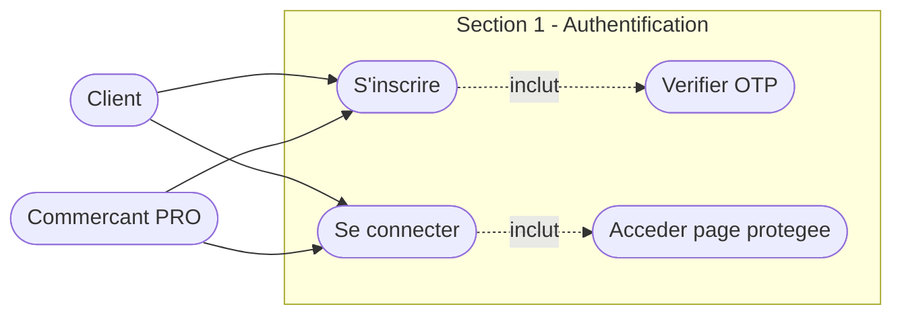

---

## 1️⃣ Inscription d'un utilisateur

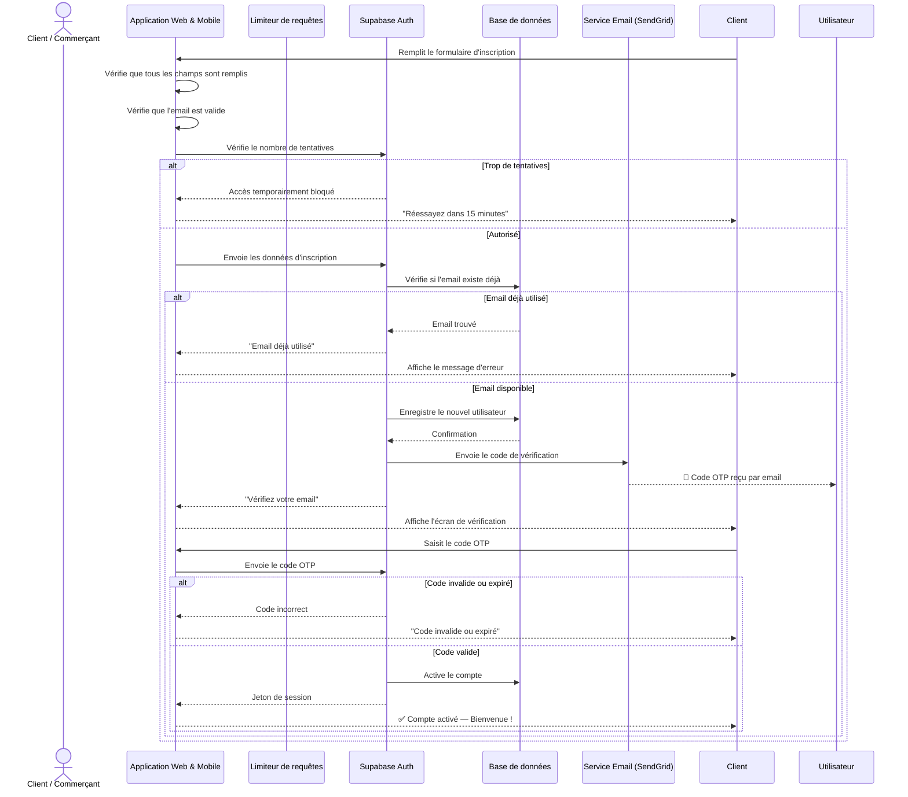
**Fichiers :** `app/(auth)/signup.tsx` · `lib/actions/auth.ts` · `lib/rate-limit.ts`

---

## 2️⃣ Connexion d'un utilisateur

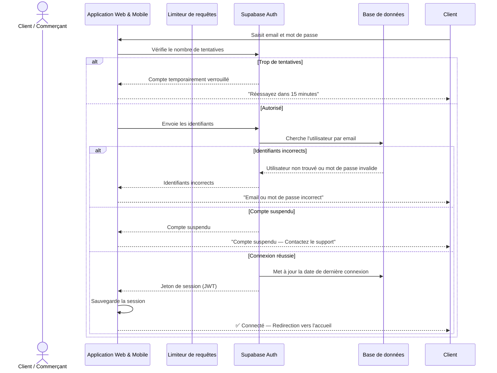
**Fichiers :** `app/(auth)/login.tsx` · `app/login/page.tsx` · `lib/actions/auth.ts`

---

## 3️⃣ Accès à une page protégée

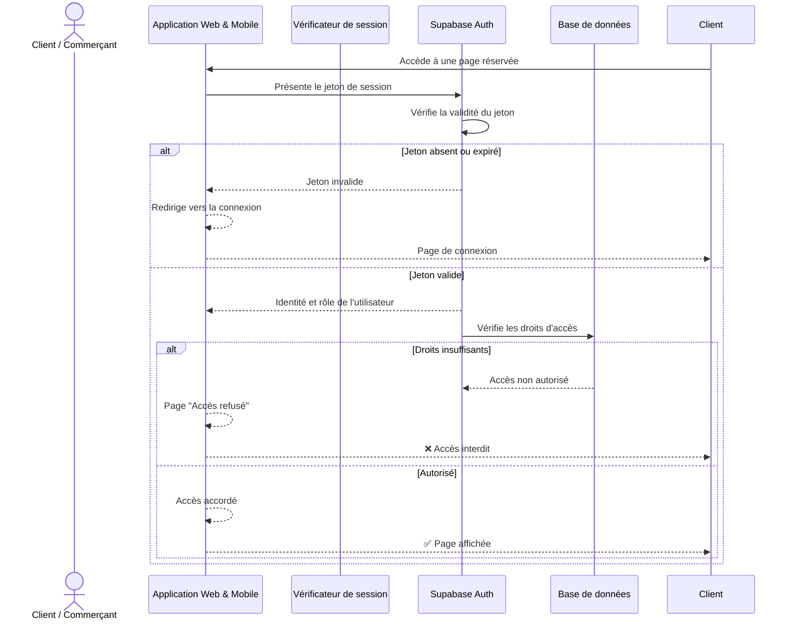
**Fichiers :** `middleware.ts` · `lib/supabase/middleware.ts`

---

# 🏪 SECTION 2 : GESTION ÉTABLISSEMENT

### 📊 Diagramme de cas d'utilisation — Gestion des Boutiques

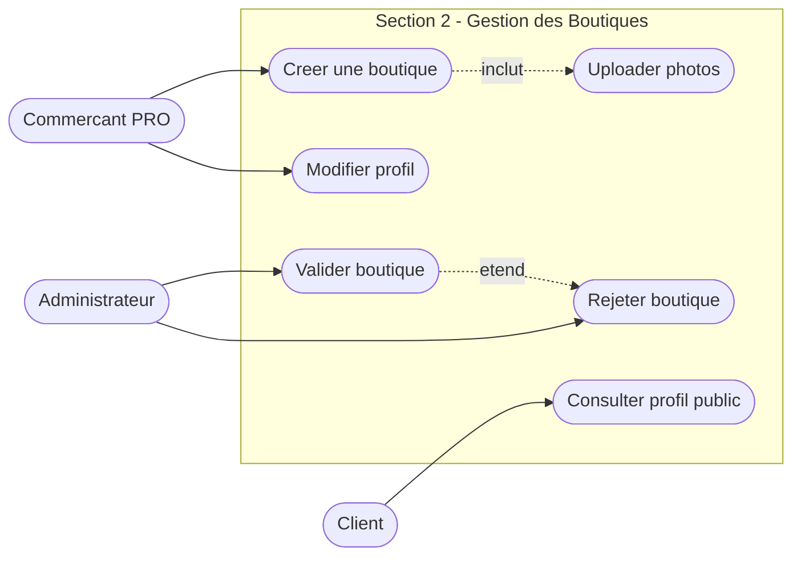

---

## 4️⃣ Création d'une boutique

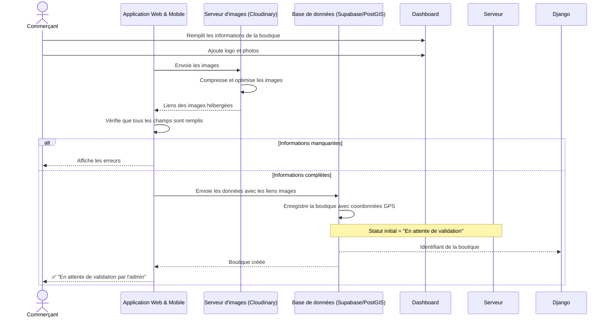
**Fichiers :** `app/dashboard/stores/create/page.tsx` · `lib/actions/stores.ts` · `lib/cloudinary.ts`

---

## 5️⃣ Validation d'une boutique (Admin)

```mermaid
sequenceDiagram
    actor Administrateur
    participant AdminPortal as Dashboard Admin (SaaS)
    participant Django as Backend Django
    participant BD as Base de données (Supabase)

    Administrateur->>AdminPortal: Consulte les boutiques en attente
    AdminPortal->>Django: Demande la liste des boutiques "En attente"
    Django->>BD: Récupère les boutiques avec leurs documents
    BD-->>Django: Liste des boutiques
    Django-->>AdminPortal: Affiche la liste des boutiques
    Administrateur->>AdminPortal: Examine les documents et décide
    alt Boutique approuvée
        AdminPortal->>Django: Approuver la boutique (store_id)
        Django->>BD: Met à jour le statut à "Approuvée"
        BD-->>Django: Confirmation de mise à jour
        Django->>BD: Enregistre le log de validation (audit trail)
        BD-->>Commerçant: 🔔 "Votre boutique a été approuvée"
        Django-->>AdminPortal: Approbation confirmée
        AdminPortal-->>Administrateur: ✅ Boutique approuvée avec succès
    else Boutique rejetée
        AdminPortal->>Django: Rejeter la boutique avec motif
        Django->>BD: Met à jour le statut à "Rejetée" avec motif
        BD-->>Django: Confirmation de mise à jour
        Django->>BD: Enregistre le log de rejet (audit trail)
        BD-->>Commerçant: 🔔 "Votre boutique a été rejetée : [motif]"
        Django-->>AdminPortal: Rejet enregistré
        AdminPortal-->>Administrateur: ❌ Boutique rejetée avec succès
    end```
**Fichiers :** `saas/app/admin/stores/pending/page.tsx` · `saas/backend/stores/admin.py`

---

## 6️⃣ Modification du profil et affichage public

```mermaid
sequenceDiagram
    actor Commerçant
    participant App as Application Web & Mobile
    participant BD as Base de données (Supabase/RLS)

    Commerçant->>Dashboard: Modifie horaires, bio ou réseaux sociaux
    App->>BD: Envoie les modifications
    BD->>BD: Vérifie que le commerçant est propriétaire de la boutique
    alt Propriétaire non confirmé
        BD-->>Django: Accès refusé
        BD-->>App: Modification non autorisée
        App-->>Commerçant: ❌ Erreur d'autorisation
    else Propriétaire confirmé
        BD->>BD: Enregistre les modifications
        BD-->>Django: Confirmation
        BD-->>App: Mise à jour réussie
        App-->>Commerçant: ✅ "Profil mis à jour avec succès"
    end
```
**Fichiers :** `app/dashboard/profile/page.tsx` · `lib/actions/profile.ts`

---

# 🛍️ SECTION 3 : SHOP & PRODUITS

### 📊 Diagramme de cas d'utilisation — Shop et Produits

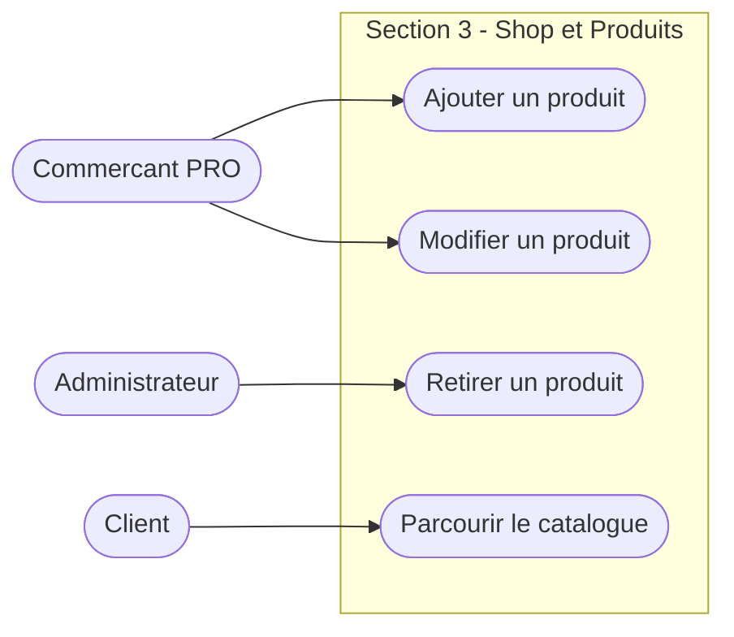

---

## 7️⃣ Ajout d'un produit

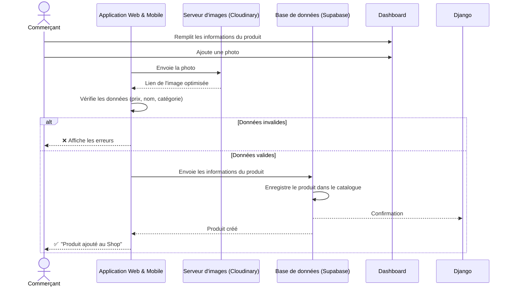
**Fichiers :** `app/dashboard/products/add/page.tsx` · `lib/actions/items.ts` · `lib/cloudinary.ts`

---

## 8️⃣ Consultation du Shop (Client)

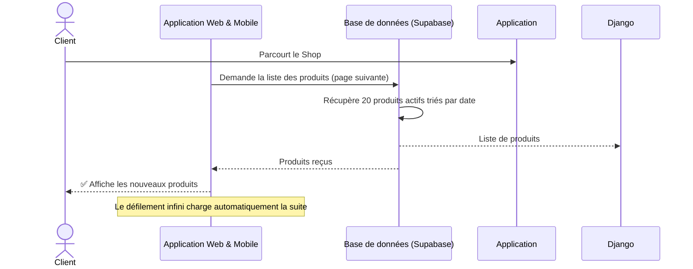
**Fichiers :** `app/search/results.tsx` · `lib/items.ts`

---

# 📦 SECTION 4 : COMMANDES

### 📊 Diagramme de cas d'utilisation — Commandes

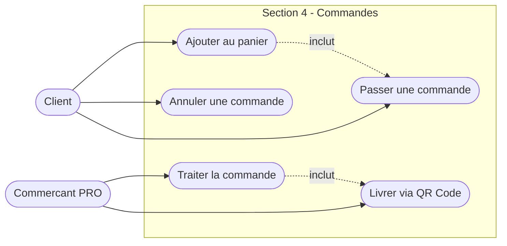

---

## 9️⃣ Panier et passage de commande

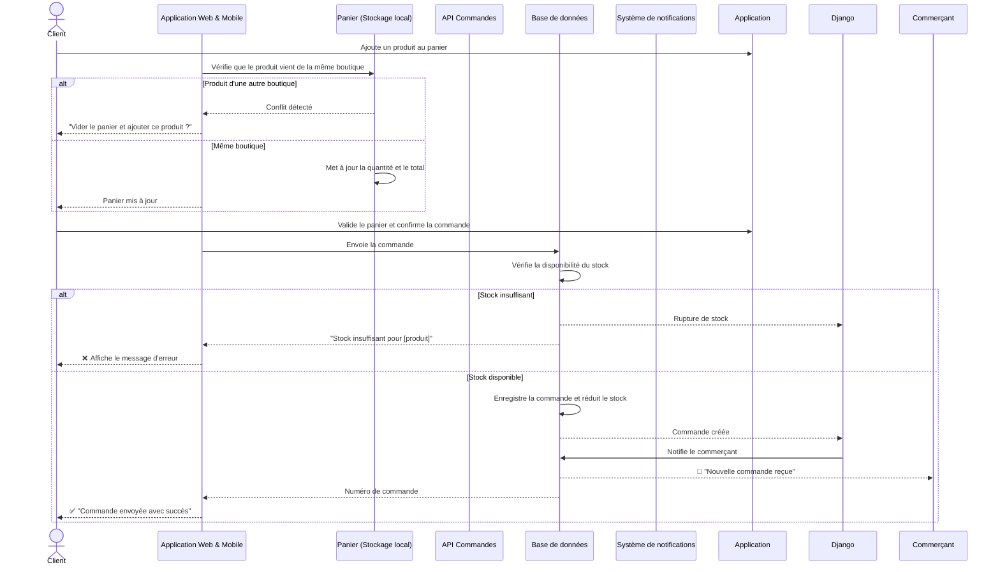
**Fichiers :** `app/cart.tsx` · `app/checkout.tsx` · `store/cartStore.ts` · `lib/actions/orders.ts`

---

## 🔟 Traitement et livraison d'une commande

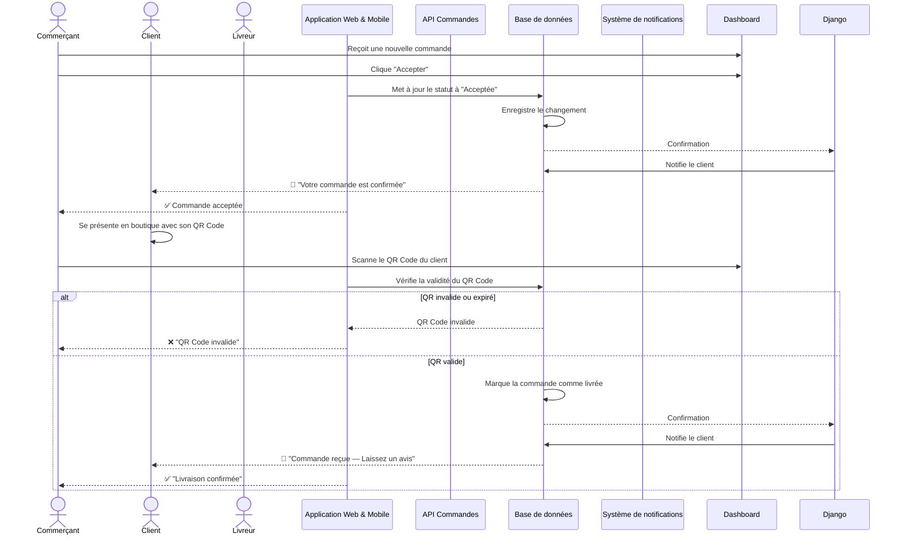
**Fichiers :** `app/dashboard/orders/page.tsx` · `app/dashboard/qr-verify/[code]/page.tsx` · `lib/actions/orders.ts`

---

# 📅 SECTION 5 : RÉSERVATIONS

### 📊 Diagramme de cas d'utilisation — Reservations


---

## 1️⃣1️⃣ Réservation d'un service et gestion des créneaux

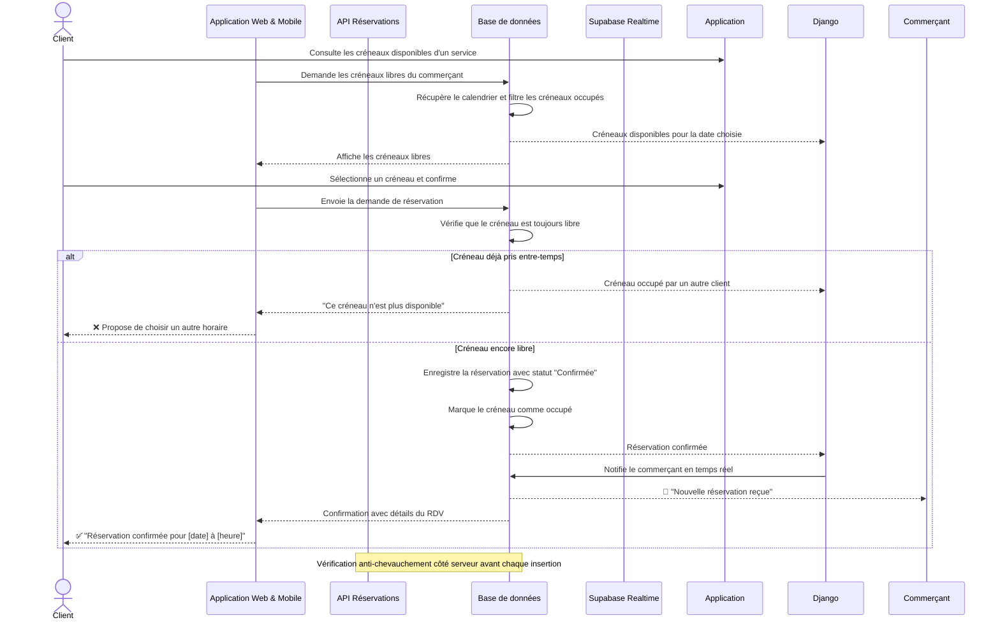
**Fichiers :** `app/booking/[serviceId].tsx` · `app/dashboard/schedules/page.tsx` · `lib/actions/reservation.ts`

---

## 1️⃣2️⃣ Clôture d'une réservation par le commerçant

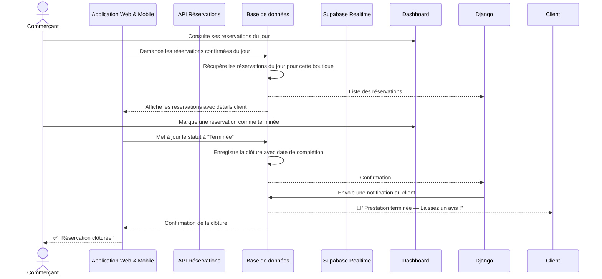
**Fichiers :** `app/dashboard/reservations/page.tsx` · `lib/actions/reservation.ts`

---

# 🔍 SECTION 6 : RECHERCHE & INTELLIGENCE ARTIFICIELLE

### 📊 Diagramme de cas d'utilisation — Recherche et Intelligence Artificielle

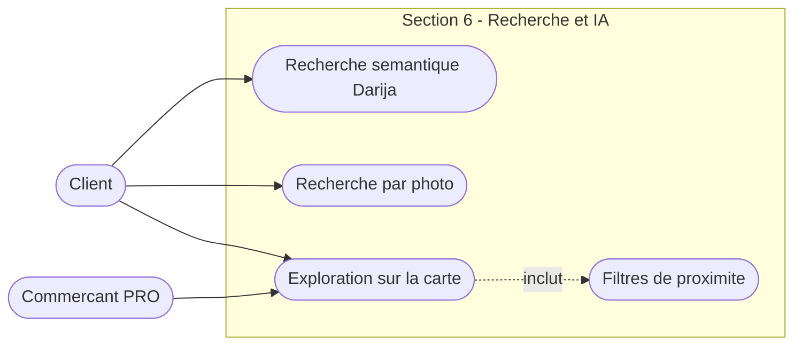

---

## 1️⃣3️⃣ Recherche intelligente (texte Darija / Français)

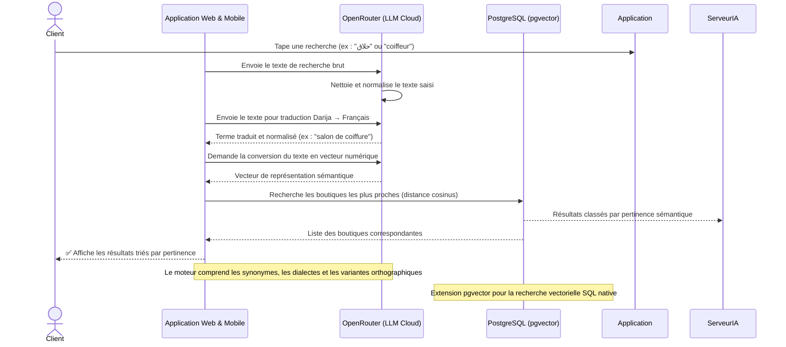
**Fichiers :** `compnents/search/searchBar.tsx` · `app/api/semantic-search/route.ts` · `lib/darija-dictionary.ts`

---

## 1️⃣4️⃣ Recherche par photo (Vision IA)

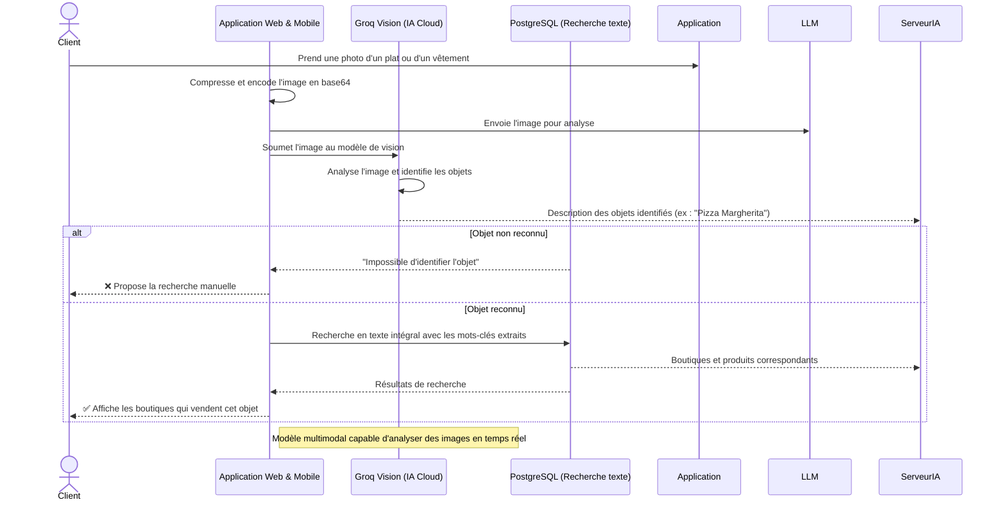
**Fichiers :** `lib/imageSearch.ts` · `app/api/image-search/route.ts`

---

## 1️⃣5️⃣ Exploration géographique et filtres

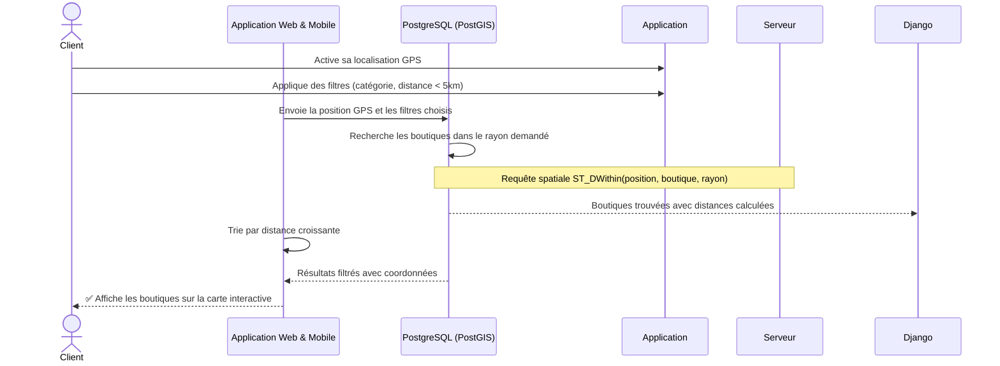
**Fichiers :** `app/search/mapView.tsx` · `lib/actions/explore.ts`

---

# 📱 SECTION 7 : CONTENU VIDÉO (REELS & STORIES)

### 📊 Diagramme de cas d'utilisation — Contenu Video (Reels/Stories)

```mermaid
flowchart LR
    P(["Commercant PRO"])
    C(["Client"])

    subgraph S7 ["Section 7 - Contenu Video Reels et Stories"]
        UC1(["Publier un Reel"])
        UC2(["Publier une Story"])
        UC3(["Liker un Reel"])
        UC4(["Sauvegarder un Reel"])
        UC1 -.->|etend| UC2
    end

    P --> UC1 & UC2
    C --> UC3 & UC4
```

---

## 1️⃣6️⃣ Publication d'un Reel ou d'une Story

```mermaid
sequenceDiagram
    actor Commerçant
    participant App as Application Web & Mobile
    participant Cloudinary as Cloudinary (CDN Cloud)
    participant BD as Base de données (Supabase)
    participant BD as Base de données

    Commerçant->>Dashboard: Sélectionne une vidéo (max 60s) ou une image
    App->>Cloudinary: Envoie le fichier pour hébergement
    Cloudinary->>Cloudinary: Transcode la vidéo et génère une miniature
    Cloudinary-->>App: Lien sécurisé du contenu hébergé
    App->>BD: Envoie les métadonnées + lien du fichier
    App->>App: Valide le format et la taille

    alt Publication d'un Reel (permanent)
        BD->>BD: Enregistre le Reel avec le lien Cloudinary
        BD-->>Django: Reel ID créé
        BD-->>App: Confirmation
        App-->>Commerçant: ✅ "Reel publié avec succès"
    else Publication d'une Story (éphémère)
        BD->>BD: Enregistre la Story avec expiration = maintenant + 24h
        BD-->>Django: Story ID créée
        BD-->>App: Confirmation
        App-->>Commerçant: ✅ "Story publiée — Expire dans 24 heures"
    end

    Note over Cloudinary: Compression automatique + conversion WebP/MP4 optimisé
    Note over BD: Un job automatique supprime les stories expirées chaque heure
```
**Fichiers :** `app/reels/create/page.tsx` · `app/stories/create/page.tsx` · `lib/actions/reels.ts`

---

## 1️⃣7️⃣ Interactions sur le contenu (Like, Sauvegarde, Partage)

```mermaid
sequenceDiagram
    actor Client
    participant App as Application Web & Mobile
    participant BD as Base de données (Supabase)
    participant BD as Base de données

    Client->>Application: Appuie deux fois sur la vidéo (Like)
    App-->>Client: Affiche l'animation de cœur immédiatement
    App->>BD: Enregistre l'interaction en arrière-plan
    BD->>BD: Vérifie si le like existe déjà

    alt Like déjà donné → retrait
        BD->>BD: Supprime le like et décrémente le compteur
        BD-->>Django: Like retiré
        BD-->>App: Like annulé
    else Nouveau like → ajout
        BD->>BD: Ajoute le like et incrémente le compteur
        BD-->>Django: Like enregistré
        BD-->>App: Like confirmé
    end

    Note over App: Mise à jour optimiste — l'UI réagit avant la réponse du serveur
    Note over BD: Compteur incrémenté via fonction RPC PostgreSQL (anti-conflit)
```
**Fichiers :** `app/reels/feed.tsx` · `lib/actions/favorites.ts`

---

# 💬 SECTION 8 : MESSAGERIE & AVIS

### 📊 Diagramme de cas d'utilisation — Messagerie et Avis

```mermaid
flowchart LR
    C(["Client"])
    P(["Commercant PRO"])

    subgraph S8 ["Section 8 - Messagerie et Avis"]
        UC1(["Envoyer un message"])
        UC2(["Recevoir un message"])
        UC3(["Laisser un avis"])
        UC4(["Repondre a un avis"])
        UC1 -.->|inclut| UC2
    end

    C --> UC1 & UC3
    P --> UC2 & UC4
```

---

## 1️⃣8️⃣ Chat en temps réel (Client ↔ Commerçant)

```mermaid
sequenceDiagram
    actor Client
    participant App as Application Web & Mobile
    participant Supabase as Supabase Realtime (WebSocket)
    participant BD as Base de données
    participant App as Application Web & Mobile
    actor Commerçant

    Client->>AppClient: Écrit et envoie un message
    AppClient->>Supabase: Transmet le message via WebSocket
    Supabase->>BD: Enregistre le message dans la conversation
    BD-->>Supabase: Message sauvegardé
    Supabase->>AppPro: Diffuse le message en temps réel
    AppPro-->>Commerçant: 💬 Message reçu instantanément

    Commerçant->>AppPro: Rédige et envoie une réponse
    AppPro->>Supabase: Transmet la réponse via WebSocket
    Supabase->>BD: Enregistre la réponse
    BD-->>Supabase: Réponse sauvegardée
    Supabase->>AppClient: Diffuse la réponse en temps réel
    AppClient-->>Client: 💬 Réponse reçue instantanément

    Note over Supabase: Connexion WebSocket permanente — latence < 100ms
    Note over BD: Chaque conversation est isolée par un identifiant unique (ChatRoom)
```
**Fichiers :** `app/messages/[id].tsx` · `app/messages/page.tsx`

---

## 1️⃣9️⃣ Dépôt d'un avis et réponse IA

```mermaid
sequenceDiagram
    actor Client
    participant App as Application Web & Mobile
    participant BD as Base de données (Supabase)
    participant BD as Base de données
    participant LLM as LLM Cloud (Génération texte)

    Client->>Application: Note la prestation (1-5 étoiles) et écrit un commentaire
    App->>BD: Envoie l'avis
    BD->>BD: Vérifie qu'une transaction réelle a eu lieu entre les deux parties
    alt Aucune transaction vérifiée
        BD-->>Django: Pas de commande ou réservation confirmée
        BD-->>App: "Vous devez avoir effectué un achat pour laisser un avis"
        App-->>Client: ❌ Affiche le message d'erreur
    else Transaction confirmée
        BD->>BD: Enregistre l'avis
        BD->>BD: Recalcule la note moyenne de la boutique
        BD-->>Django: Nouvelle note moyenne
        BD-->>Commerçant: 🔔 "Nouvel avis reçu — 5 étoiles"
        BD-->>App: Avis publié
        App-->>Client: ✅ "Merci pour votre avis !"
    end

    Note over Serveur,BD: Seuls les clients ayant une transaction validée peuvent laisser un avis
```
**Fichiers :** `lib/actions/reviews.ts`

---

# 🛡️ SECTION 9 : DÉTECTION DE FRAUDE IA

### 📊 Diagramme de cas d'utilisation — Détection de Fraude IA

```mermaid
flowchart LR
    P(["Commercant PRO"])
    A(["Administrateur"])

    subgraph S9 ["Section 9 - Detection de Fraude IA"]
        UC1(["Analyser une transaction"])
        UC2(["Bloquer automatiquement"])
        UC3(["Recevoir alerte fraude"])
        UC4(["Examiner alerte"])
        UC1 -.->|inclut| UC2
        UC2 -.->|inclut| UC3
        UC3 -.->|inclut| UC4
    end

    P --> UC1
    A --> UC3 & UC4
```

---

## 2️⃣0️⃣ Détection de fraude pour les commerçants (IA)

```mermaid
sequenceDiagram
    actor Commerçant
    actor Administrateur
    participant App as Application Web & Mobile
    participant BD as Base de données (Supabase)
    participant IA as Moteur de détection IA (Groq)
    participant AdminPortal as Dashboard Admin (SaaS)
    participant Django as Backend Django

    Commerçant->>App: Crée une transaction (commande/réservation)
    App->>BD: INSERT transaction (status = "pending")
    BD->>IA: Déclenche une analyse automatique de risque (Trigger)
    IA->>IA: Calcule le score de risque de fraude (0-100)
    
    alt Score de risque élevé (> 80)
        IA->>BD: Met à jour le statut à "blocked" et génère un rapport
        BD->>Django: webhook de fraude détectée
        Django->>AdminPortal: Alerte de fraude en temps réel (WebSocket)
        AdminPortal-->>Administrateur: 🚨 Alerte fraude à examiner d'urgence
        BD-->>App: "Transaction suspendue — En cours de vérification"
        App-->>Commerçant: ❌ Transaction bloquée temporairement
    else Score de risque moyen (40-80)
        IA->>BD: Met à jour le statut à "suspected"
        BD->>Django: webhook pour suivi de transaction
        Django->>AdminPortal: Notification discrète de surveillance
        BD-->>App: Transaction acceptée avec avertissement
        App-->>Commerçant: ✅ Transaction enregistrée (à surveiller)
    else Score de risque faible (< 40)
        IA->>BD: Enregistre la transaction normalement
        BD-->>App: Confirmation d'insertion
        App-->>Commerçant: ✅ Transaction validée avec succès
    end```
**Fichiers :** `lib/actions/orders.ts` · `app/api/fraud-check/route.ts` · `saas/backend/transactions/api.py`

---

# 📊 SECTION 10 : ANALYTIQUES & ASSISTANT IA

### 📊 Diagramme de cas d'utilisation — Analytiques et Assistant IA

```mermaid
flowchart LR
    P(["Commercant PRO"])
    C(["Client"])

    subgraph S10 ["Section 10 - Analytiques et Assistant IA"]
        UC1(["Consulter le tableau de bord"])
        UC2(["Voir les statistiques"])
        UC3(["Poser une question a l IA"])
        UC4(["Recevoir une reponse IA"])
        UC1 -.->|inclut| UC2
        UC3 -.->|inclut| UC4
    end

    P --> UC1 & UC2 & UC3
    C --> UC3
```

---

## 2️⃣1️⃣ Tableau de bord analytique

```mermaid
sequenceDiagram
    actor Commerçant
    participant App as Application Web & Mobile
    participant BD as Base de données (Supabase)
    participant BD as PostgreSQL (Agrégation SQL)

    Commerçant->>Dashboard: Ouvre l'onglet statistiques
    App->>BD: Demande les métriques de la période choisie
    BD->>BD: Calcule le chiffre d'affaires (SUM des commandes complétées)
    BD->>BD: Compte le nombre de commandes et réservations
    BD->>BD: Calcule le nombre de vues du profil
    BD->>BD: Calcule le taux de conversion (commandes / vues)
    BD-->>Django: Données agrégées par jour/semaine/mois
    BD-->>App: Métriques formatées pour les graphiques
    App-->>Commerçant: ✅ Affiche les graphiques et indicateurs clés

    Note over Serveur,BD: Requêtes SQL d'agrégation : SUM, COUNT, AVG, GROUP BY période
```
**Fichiers :** `app/dashboard/page.tsx` · `lib/actions/analyzer-service.ts`

---

## 2️⃣2️⃣ Assistant IA conversationnel (Sales Advisor)

```mermaid
sequenceDiagram
    actor Client / Commerçant
    participant App as Application Web & Mobile
    participant ServeurIA as API Assistant IA
    participant BD as PostgreSQL (pgvector - RAG)
    participant LLM as OpenRouter (LLM Cloud)

    Client->>App: Pose une question (ex : "Quels sont mes produits les plus vendus ?")
    App->>LLM: Envoie la question
    LLM->>LLM: Analyse l'intention de la question
    App->>BD: Recherche les données pertinentes (produits, commandes, stock)
    BD-->>ServeurIA: Données contextuelles de la boutique
    LLM->>LLM: Construit le prompt avec le contexte réel
    App->>LLM: Envoie le prompt enrichi au modèle IA
    LLM-->>App: Génère la réponse en streaming (mot par mot)
    BD-->>App: Transmet la réponse progressivement
    App-->>Client: ✅ Affiche la réponse mot par mot (effet typewriter)

    Note over ServeurIA,BD: RAG : l'IA se base sur les données réelles de la boutique, pas de réponse inventée
    Note over LLM: Streaming via Server-Sent Events — réponse affichée en temps réel
```
**Fichiers :** `app/messages/ai-assistant.tsx` · `lib/actions/ai-agent.ts`

---

## 2️⃣3️⃣ Analyse de sentiment des commentaires (IA)

```mermaid
sequenceDiagram
    actor Commerçant
    participant App as Application Web & Mobile
    participant BD as Base de données (Supabase)
    participant BD as Base de données
    participant IA as Moteur d'analyse IA (Groq / OpenRouter)

    Commerçant->>Dashboard: Ouvre la section "Avis clients"
    App->>BD: Demande les avis de la boutique
    BD->>BD: Récupère tous les avis non analysés
    BD-->>Django: Liste des avis avec texte brut

    App->>IA: Envoie les textes des avis pour analyse de sentiment
    IA->>IA: Analyse chaque commentaire (positif, neutre, négatif)
    IA->>IA: Extrait les thèmes récurrents (qualité, prix, service, propreté)
    IA->>IA: Identifie les suggestions d'amélioration
    IA-->>App: Résultats d'analyse (sentiment + thèmes + score par catégorie)

    BD->>BD: Enregistre les résultats d'analyse pour chaque avis
    BD-->>Django: Analyse sauvegardée
    BD-->>App: Résultats formatés avec statistiques

    alt Majorité de commentaires négatifs détectés
        App-->>Commerçant: ⚠️ "Attention : baisse de satisfaction sur le thème Service"
        App->>App: Affiche des recommandations d'amélioration
    else Commentaires globalement positifs
        App-->>Commerçant: ✅ Tableau de bord sentiment avec graphiques
    end

    Note over IA: L'IA identifie automatiquement les points forts et les axes d'amélioration
    Note over BD: L'historique des analyses permet de suivre l'évolution de la satisfaction dans le temps
```
**Fichiers :** `lib/actions/reviews.ts` · `lib/actions/sales-analyzer.ts` · `app/dashboard/reviews/page.tsx`

---

## 2️⃣4️⃣ Recommandation intelligente de promotions (IA)

```mermaid
sequenceDiagram
    actor Commerçant
    participant App as Application Web & Mobile
    participant BD as Base de données (Supabase)
    participant BD as Base de données
    participant IA as Moteur de recommandation IA (OpenRouter)

    Commerçant->>Dashboard: Clique sur "Créer une promotion assistée par IA"
    App->>BD: Demande une recommandation de promotion
    BD->>BD: Récupère les données de la boutique
    BD->>BD: Analyse les ventes des 30 derniers jours
    BD->>BD: Identifie les produits à faible rotation de stock
    BD->>BD: Récupère les tendances de la catégorie
    BD-->>Django: Données commerciales complètes

    App->>IA: Envoie les données pour analyse et recommandation
    IA->>IA: Analyse les produits à écouler en priorité
    IA->>IA: Calcule le pourcentage de remise optimal
    IA->>IA: Propose une durée de promotion adaptée
    IA->>IA: Génère un texte promotionnel attractif
    IA-->>App: Recommandation complète (produits, remise %, durée, texte)

    BD-->>App: Proposition de promotion pré-remplie
    App-->>Commerçant: 📋 "Promotion suggérée par l'IA"

    alt Commerçant accepte la suggestion
        Commerçant->>Dashboard: Valide et publie la promotion
        App->>BD: Enregistre la promotion
        BD->>BD: INSERT promotion avec dates de début et fin
        BD-->>Django: Promotion créée
        BD-->>App: Confirmation
        App-->>Commerçant: ✅ "Promotion publiée — Visible par les clients"
    else Commerçant modifie la suggestion
        Commerçant->>Dashboard: Ajuste les paramètres manuellement
        App->>BD: Enregistre la version modifiée
        BD->>BD: INSERT promotion personnalisée
        BD-->>Django: Promotion créée
        App-->>Commerçant: ✅ "Promotion personnalisée publiée"
    end

    Note over IA: L'IA recommande des remises basées sur les données réelles de vente (pas de suggestion aléatoire)
    Note over BD: Les promotions ont une date d'expiration automatique
```
**Fichiers :** `lib/actions/promotions.ts` · `lib/actions/ai-agent.ts` · `app/dashboard/promotions/page.tsx`

---

# 🤖 SECTION 11 : ANALYSE IA (SENTIMENT & PROMOTIONS)

### 📊 Diagramme de cas d'utilisation — Analyse IA (Sentiment & Promotions)

```mermaid
flowchart LR
    P(["Commercant PRO"])

    subgraph S11 ["Section 11 - Analyse IA Sentiment et Promotions"]
        UC1(["Analyser les avis clients"])
        UC2(["Voir score de sentiment"])
        UC3(["Creer promo assistee IA"])
        UC4(["Valider suggestion IA"])
        UC5(["Modifier suggestion IA"])
        UC1 -.->|inclut| UC2
        UC3 -.->|inclut| UC4
        UC3 -.->|etend| UC5
    end

    P --> UC1 & UC2 & UC3
```

---

# 🛡️ SECTION 12 : ADMINISTRATION & SUPPORT

### 📊 Diagramme de cas d'utilisation — Administration et Support

```mermaid
flowchart LR
    A(["Administrateur"])
    C(["Client"])

    subgraph S12 ["Section 12 - Administration et Support"]
        UC1(["Moderer le contenu"])
        UC2(["Suspendre un utilisateur"])
        UC3(["Traiter un ticket"])
        UC4(["Consulter le tableau admin"])
        UC5(["Signaler un contenu"])
        UC5 -.->|inclut| UC1
    end

    A --> UC1 & UC2 & UC3 & UC4
    C --> UC5
```

---

## 2️⃣5️⃣ Signalement et modération de contenu

```mermaid
sequenceDiagram
    actor Client
    actor Administrateur
    participant App as Application Web & Mobile
    participant BD as Base de données (Supabase)
    participant AdminPortal as Dashboard Admin (SaaS)
    participant Django as Backend Django

    Client->>App: Signale un contenu inapproprié (Reel/Story/Avis)
    App->>BD: INSERT signalement (content_id, reason)
    BD->>BD: Compte le nombre total de signalements
    
    alt Seuil de signalements dépassé (> 3)
        BD->>BD: Masque automatiquement le contenu (status = "hidden")
        BD->>Django: Webhook de modération requise
        Django->>AdminPortal: Notification de contenu masqué
        AdminPortal-->>Administrateur: 🔔 Nouveau contenu masqué à valider
    else Seuil non atteint
        BD-->>App: Signalement enregistré avec succès
    end
    
    BD-->>App: Confirmation du traitement
    App-->>Client: ✅ "Merci pour votre signalement — En cours de traitement"```
**Fichiers :** `saas/app/admin/moderation/page.tsx` · `saas/backend/content/admin.py`

---

## 2️⃣6️⃣ Gestion des utilisateurs et tickets de support

```mermaid
sequenceDiagram
    actor Administrateur
    participant AdminPortal as Dashboard Admin (SaaS)
    participant Django as Backend Django
    participant BD as Base de données (Supabase)

    Administrateur->>AdminPortal: Recherche un utilisateur suspect ou signalé
    AdminPortal->>Django: GET /api/admin/users/{id}
    Django->>BD: Query profil, transactions & signalements
    BD-->>Django: Données complètes de l'utilisateur
    Django-->>AdminPortal: Affiche la fiche utilisateur
    
    Administrateur->>AdminPortal: Clique "Suspendre le compte" (indique le motif)
    AdminPortal->>Django: POST /api/admin/users/{id}/suspend
    Django->>BD: UPDATE users SET status = "suspended", reason = {motif}
    BD-->>Django: Confirmation de suspension
    Django->>BD: Révoque toutes les sessions Supabase (User Session Revoke)
    BD-->>Django: Sessions révoquées
    Django-->>AdminPortal: Suspension confirmée
    AdminPortal-->>Administrateur: ✅ "Compte suspendu — Utilisateur déconnecté immédiatement"```
**Fichiers :** `saas/app/admin/users/page.tsx` · `saas/backend/users/admin.py` · `saas/backend/support/admin.py`

---

## 2️⃣7️⃣ Notifications en temps réel

```mermaid
sequenceDiagram
    participant BD as Base de données (Supabase)
    participant Realtime as Supabase Realtime (WebSocket)
    participant App as Application Web & Mobile

    BD->>BD: Trigger PostgreSQL détecte un événement (insert/update)
    BD->>Realtime: Diffuse l'événement sur le canal concerné (realtime payload)
    Realtime->>App: Pousse la notification via WebSocket (latence < 100ms)
    App-->>Client/Commerçant: 🔔 Notification affichée (bannière / badge)```
**Fichiers :** `lib/actions/notifications.ts` · `lib/notifications.ts`

---

# 📋 TABLEAU RÉCAPITULATIF

| # | Section | Fonctionnalité | Acteurs principaux |
|---|---------|---------------|-------------------|
| 1 | Auth | Inscription | Utilisateur, App, Supabase Auth, BD, SendGrid |
| 2 | Auth | Connexion | Utilisateur, App, Rate Limiter, Supabase Auth, BD |
| 3 | Auth | Page protégée | Utilisateur, Middleware, Supabase Auth, BD |
| 4 | Boutique | Création boutique | Commerçant, Dashboard, Cloudinary, API, BD |
| 5 | Boutique | Validation Admin | Admin, Dashboard SaaS, Django API, BD, Notifs |
| 6 | Boutique | Modification profil | Commerçant, Dashboard, API, BD (RLS) |
| 7 | Catalogue | Ajout produit | Commerçant, Dashboard, Cloudinary, API, BD |
| 8 | Catalogue | Consultation catalogue | Client, App, API, BD |
| 9 | Commandes | Panier + Commande | Client, App, Panier, API, BD, Notifs |
| 10 | Commandes | Traitement + QR Code | Client, Commerçant, Dashboard, API, BD, Notifs |
| 11 | Réservations | Prise de RDV | Client, App, API, BD, Supabase Realtime |
| 12 | Réservations | Clôture réservation | Commerçant, Dashboard, API, BD, Realtime |
| 13 | IA | Recherche sémantique | Client, App, API IA, OpenRouter (LLM), pgvector |
| 14 | IA | Recherche par photo | Client, App, API Vision, Groq Vision, BD |
| 15 | Recherche | Filtres géographiques | Client, App, API, PostGIS |
| 16 | Contenu | Publication Reel/Story | Commerçant, Dashboard, Cloudinary, API, BD |
| 17 | Contenu | Like/Sauvegarde | Client, App, API, BD |
| 18 | Messagerie | Chat temps réel | Client, App, Supabase Realtime, BD, Dashboard |
| 19 | Avis | Dépôt + Réponse IA | Client, App, API, BD, LLM |
| 20 | Sécurité IA | Détection de fraude | Commerçant, Dashboard, API, Groq (IA), BD, Admin |
| 21 | Analytics | Tableau de bord | Commerçant, Dashboard, API, PostgreSQL |
| 22 | IA | Assistant conversationnel | Utilisateur, App, API IA, pgvector (RAG), LLM |
| 23 | IA | Analyse de sentiment des avis | Commerçant, Dashboard, API, Groq/OpenRouter, BD |
| 24 | IA | Recommandation de promotions | Commerçant, Dashboard, API, OpenRouter (IA), BD |
| 25 | Admin | Signalement + Modération | Client, App, API, BD, Dashboard Admin |
| 26 | Admin | Gestion utilisateurs | Admin, Dashboard SaaS, Django API, BD |
| 27 | Système | Notifications temps réel | Événement, BD, Supabase Realtime, App |

**Total : 27 diagrammes · Toutes les fonctionnalités couvertes · Stack complète visible**
