# 🎯 DIAGRAMMES DE SÉQUENCE — PLATEFORME RO2YA
> Style : Français simple · Acteurs réels · Blocs alt · 1 flux = 1 diagramme

---
# 🔐 SECTION 1 : AUTHENTIFICATION

### Diagramme de cas d'utilisation — Authentification


---

## 1️⃣ Inscription d'un utilisateur

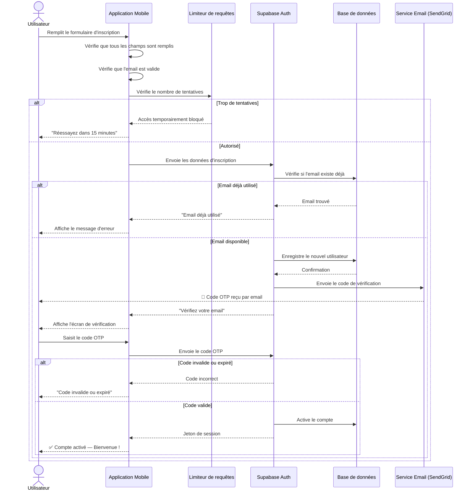
**Fichiers :** `app/(auth)/signup.tsx` · `lib/actions/auth.ts` · `lib/rate-limit.ts`

---

## 2️⃣ Connexion d'un utilisateur

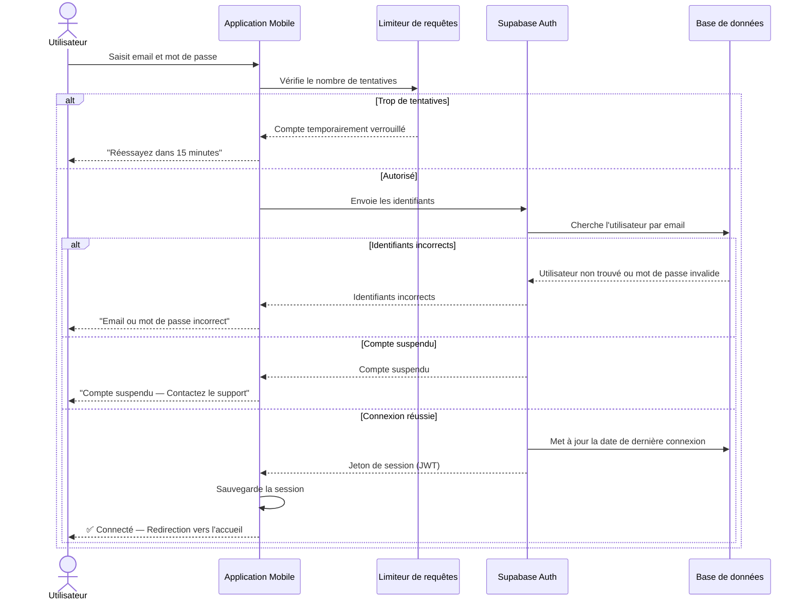
**Fichiers :** `app/(auth)/login.tsx` · `app/login/page.tsx` · `lib/actions/auth.ts`

---

## 3️⃣ Accès à une page protégée

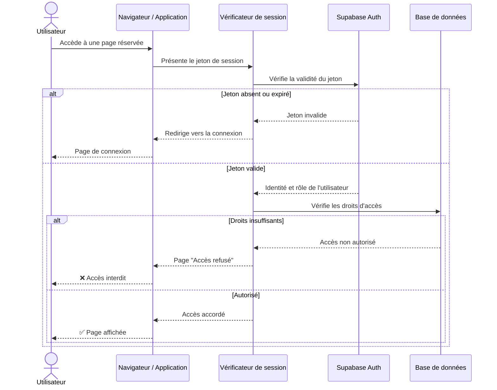
**Fichiers :** `middleware.ts` · `lib/supabase/middleware.ts`

---

# 🏪 SECTION 2 : GESTION ÉTABLISSEMENT

### Diagramme de cas d'utilisation — Gestion des Boutiques


---

## 4️⃣ Création d'une boutique

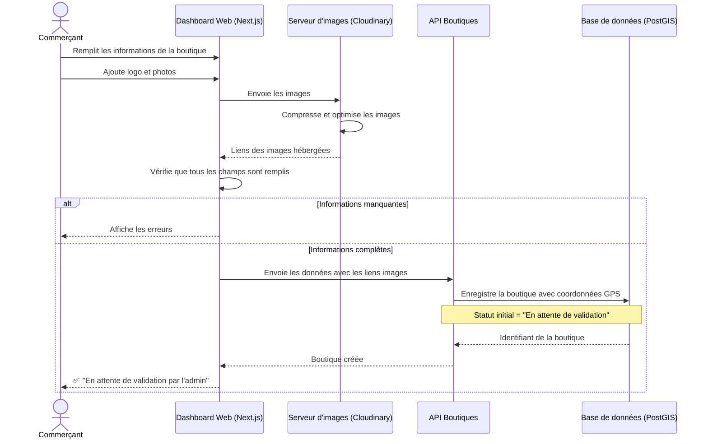
**Fichiers :** `app/dashboard/stores/create/page.tsx` · `lib/actions/stores.ts` · `lib/cloudinary.ts`

---

## 5️⃣ Validation d'une boutique (Admin)

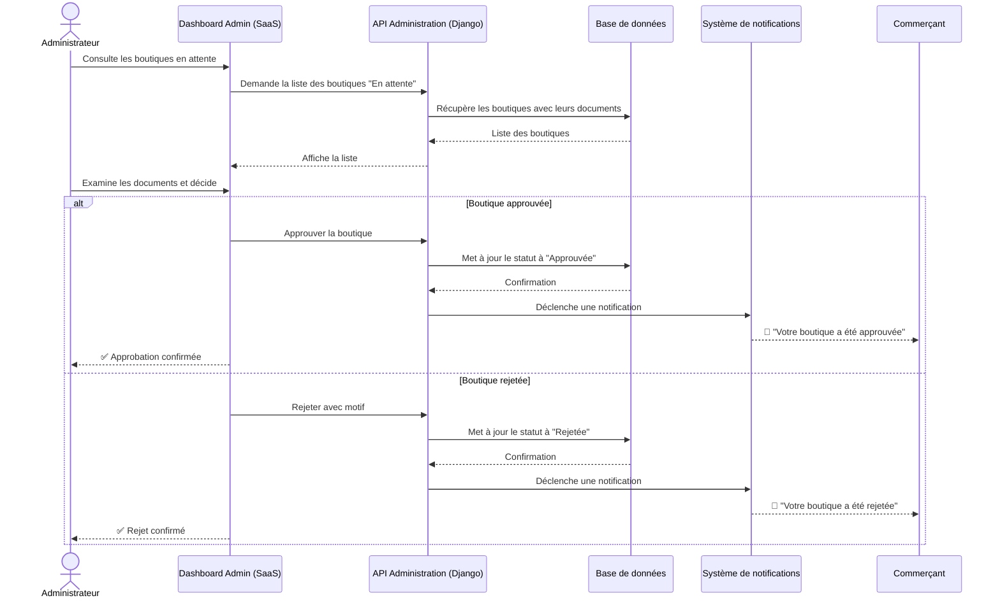
**Fichiers :** `saas/app/admin/stores/pending/page.tsx` · `saas/backend/stores/admin.py`

---

## 6️⃣ Modification du profil et affichage public

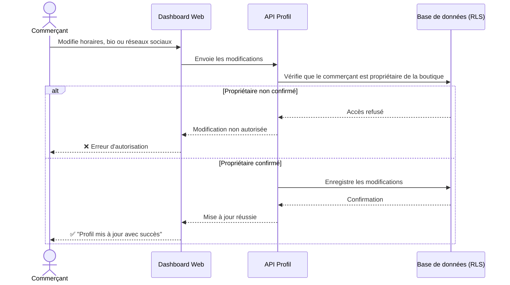
**Fichiers :** `app/dashboard/profile/page.tsx` · `lib/actions/profile.ts`

---

# 🛍️ SECTION 3 : CATALOGUE & PRODUITS

### Diagramme de cas d'utilisation — Catalogue et Produits

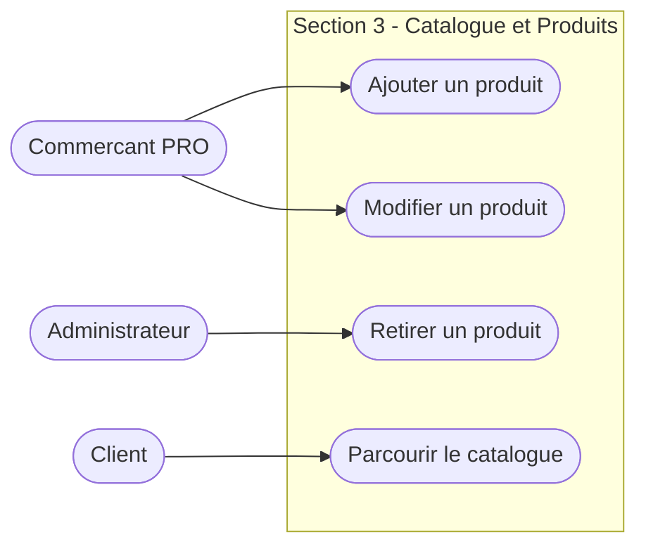

---

## 7️⃣ Ajout d'un produit

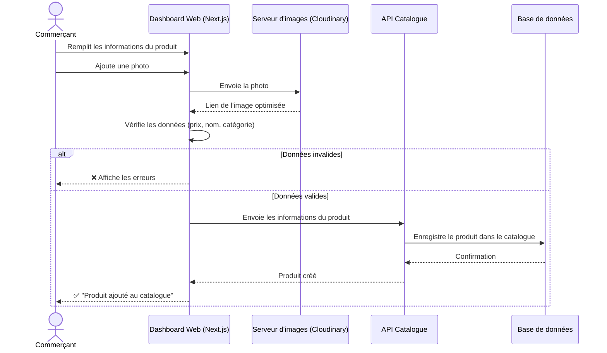
**Fichiers :** `app/dashboard/products/add/page.tsx` · `lib/actions/items.ts` · `lib/cloudinary.ts`

---

## 8️⃣ Consultation du catalogue et modération

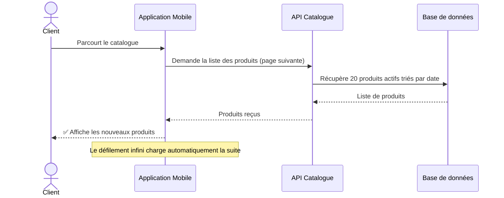
**Fichiers :** `app/search/results.tsx` · `lib/items.ts`

---

# 📦 SECTION 4 : COMMANDES

### Diagramme de cas d'utilisation — Commandes


---

## 9️⃣ Panier et passage de commande

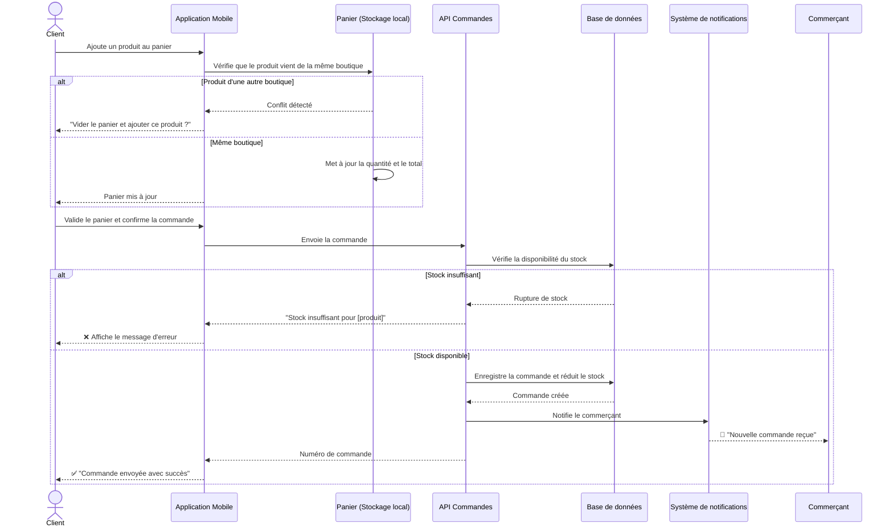
**Fichiers :** `app/cart.tsx` · `app/checkout.tsx` · `store/cartStore.ts` · `lib/actions/orders.ts`

---

## 🔟 Traitement et livraison d'une commande

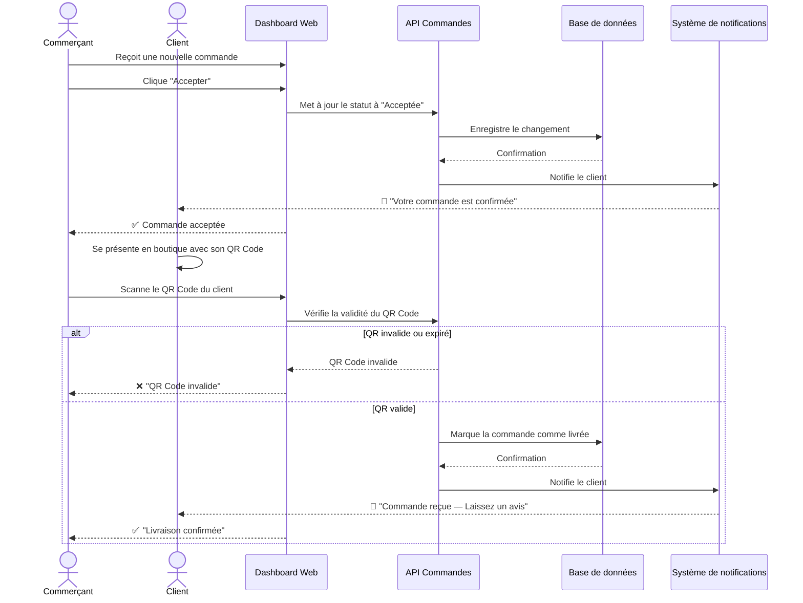
**Fichiers :** `app/dashboard/orders/page.tsx` · `app/dashboard/qr-verify/[code]/page.tsx` · `lib/actions/orders.ts`

---

# 📅 SECTION 5 : RÉSERVATIONS

### Diagramme de cas d'utilisation — Reservations

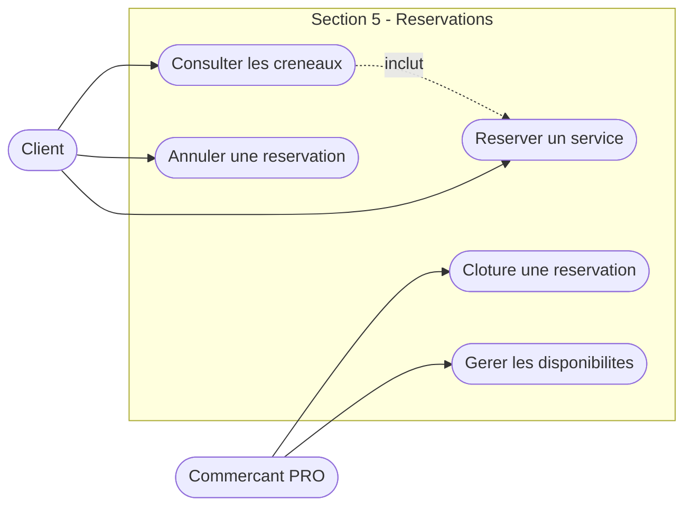

---

## 1️⃣1️⃣ Réservation d'un service et gestion des créneaux

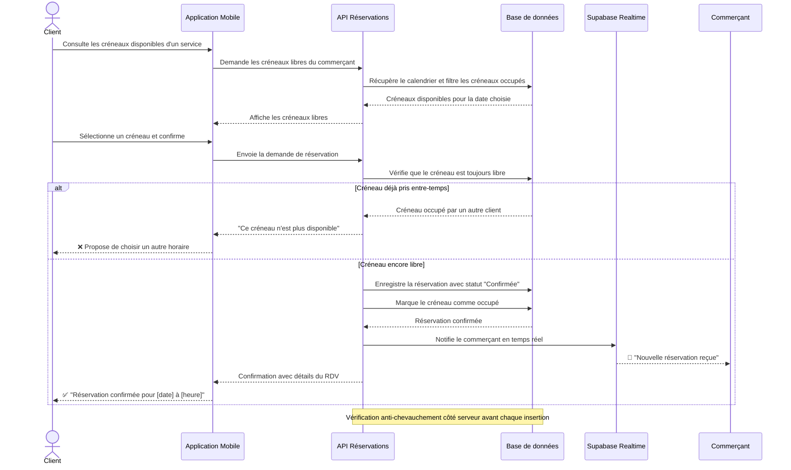
**Fichiers :** `app/booking/[serviceId].tsx` · `app/dashboard/schedules/page.tsx` · `lib/actions/reservation.ts`

---

## 1️⃣2️⃣ Clôture d'une réservation par le commerçant

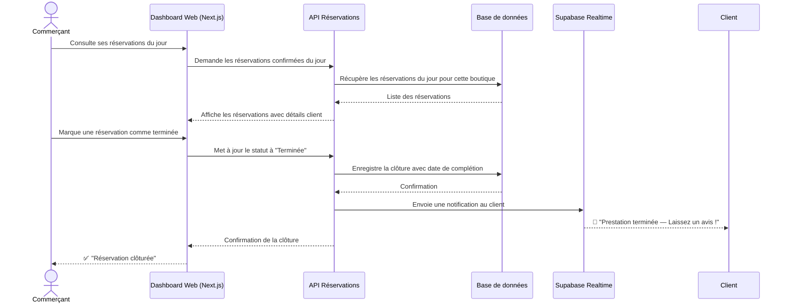
**Fichiers :** `app/dashboard/reservations/page.tsx` · `lib/actions/reservation.ts`

---

# 🔍 SECTION 6 : RECHERCHE & INTELLIGENCE ARTIFICIELLE

### Diagramme de cas d'utilisation — Recherche et Intelligence Artificielle

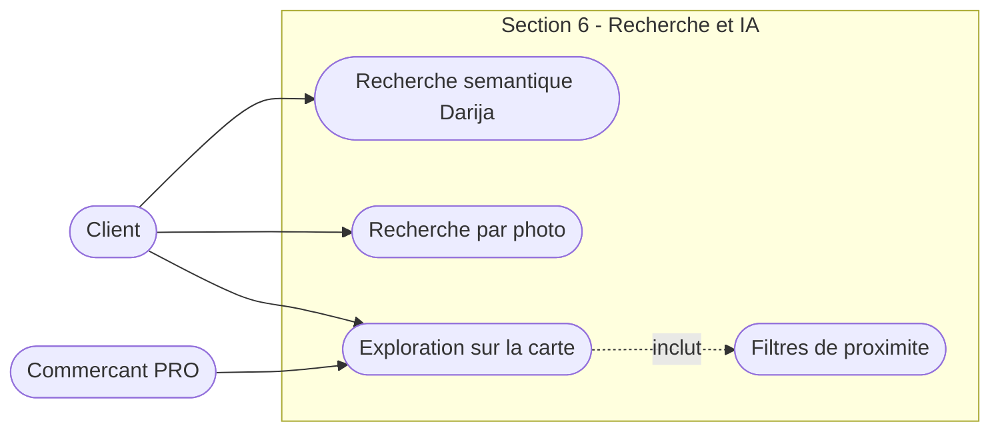

---

## 1️⃣3️⃣ Recherche intelligente (texte Darija / Français)

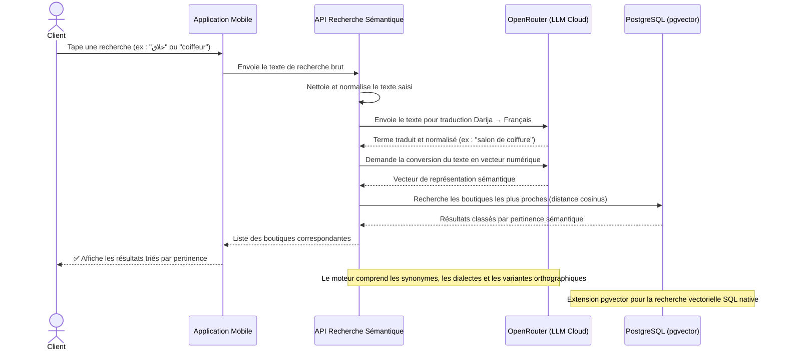
**Fichiers :** `compnents/search/searchBar.tsx` · `app/api/semantic-search/route.ts` · `lib/darija-dictionary.ts`

---

## 1️⃣4️⃣ Recherche par photo (Vision IA)

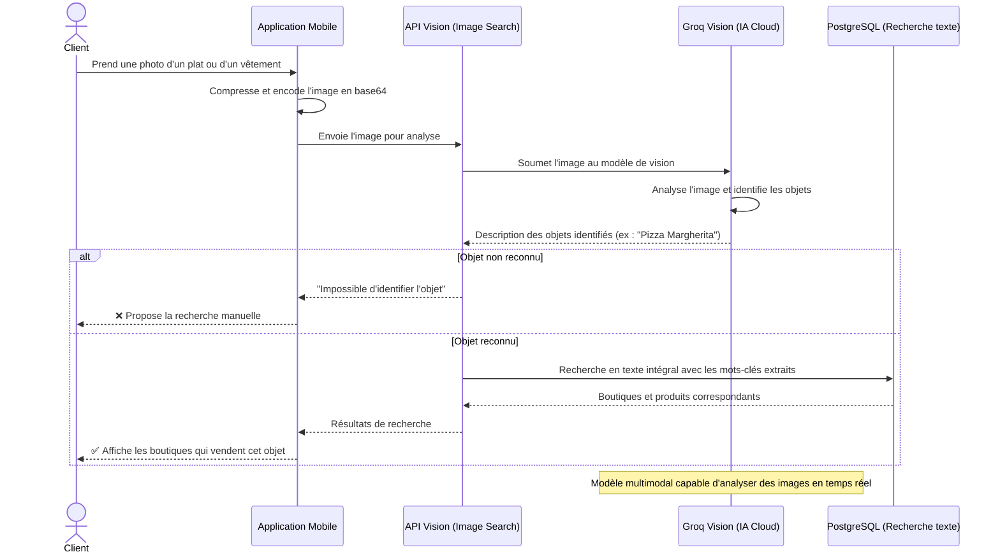
**Fichiers :** `lib/imageSearch.ts` · `app/api/image-search/route.ts`

---

## 1️⃣5️⃣ Exploration géographique et filtres

```mermaid
sequenceDiagram
    actor Client
    participant Application as Application Mobile
    participant Serveur as API Exploration
    participant BD as PostgreSQL (PostGIS)

    Client->>Application: Active sa localisation GPS
    Client->>Application: Applique des filtres (catégorie, distance < 5km)
    Application->>Serveur: Envoie la position GPS et les filtres choisis
    Serveur->>BD: Recherche les boutiques dans le rayon demandé
    Note over Serveur,BD: Requête spatiale ST_DWithin(position, boutique, rayon)
    BD-->>Serveur: Boutiques trouvées avec distances calculées
    Serveur->>Serveur: Trie par distance croissante
    Serveur-->>Application: Résultats filtrés avec coordonnées
    Application-->>Client: ✅ Affiche les boutiques sur la carte interactive
```
**Fichiers :** `app/search/mapView.tsx` · `lib/actions/explore.ts`

---

# 📱 SECTION 7 : CONTENU VIDÉO (REELS & STORIES)

### Diagramme de cas d'utilisation — Contenu Video

```mermaid
flowchart LR
    P(["Commercant PRO"])
    C(["Client"])

    subgraph S7 ["Section 7 - Contenu Video Reels et Stories"]
        UC1(["Publier un Reel"])
        UC2(["Publier une Story"])
        UC3(["Liker un Reel"])
        UC4(["Sauvegarder un Reel"])
        UC1 -.->|etend| UC2
    end

    P --> UC1 & UC2
    C --> UC3 & UC4
```

---

## 1️⃣6️⃣ Publication d'un Reel ou d'une Story

```mermaid
sequenceDiagram
    actor Commerçant
    participant Dashboard as Dashboard Web (Next.js)
    participant Cloudinary as Cloudinary (CDN Cloud)
    participant Serveur as API Contenu
    participant BD as Base de données

    Commerçant->>Dashboard: Sélectionne une vidéo (max 60s) ou une image
    Dashboard->>Cloudinary: Envoie le fichier pour hébergement
    Cloudinary->>Cloudinary: Transcode la vidéo et génère une miniature
    Cloudinary-->>Dashboard: Lien sécurisé du contenu hébergé
    Dashboard->>Serveur: Envoie les métadonnées + lien du fichier
    Serveur->>Serveur: Valide le format et la taille

    alt Publication d'un Reel (permanent)
        Serveur->>BD: Enregistre le Reel avec le lien Cloudinary
        BD-->>Serveur: Reel ID créé
        Serveur-->>Dashboard: Confirmation
        Dashboard-->>Commerçant: ✅ "Reel publié avec succès"
    else Publication d'une Story (éphémère)
        Serveur->>BD: Enregistre la Story avec expiration = maintenant + 24h
        BD-->>Serveur: Story ID créée
        Serveur-->>Dashboard: Confirmation
        Dashboard-->>Commerçant: ✅ "Story publiée — Expire dans 24 heures"
    end

    Note over Cloudinary: Compression automatique + conversion WebP/MP4 optimisé
    Note over BD: Un job automatique supprime les stories expirées chaque heure
```
**Fichiers :** `app/reels/create/page.tsx` · `app/stories/create/page.tsx` · `lib/actions/reels.ts`

---

## 1️⃣7️⃣ Interactions sur le contenu (Like, Sauvegarde, Partage)

```mermaid
sequenceDiagram
    actor Client
    participant Application as Application Mobile
    participant Serveur as API Interactions
    participant BD as Base de données

    Client->>Application: Appuie deux fois sur la vidéo (Like)
    Application-->>Client: Affiche l'animation de cœur immédiatement
    Application->>Serveur: Enregistre l'interaction en arrière-plan
    Serveur->>BD: Vérifie si le like existe déjà

    alt Like déjà donné → retrait
        Serveur->>BD: Supprime le like et décrémente le compteur
        BD-->>Serveur: Like retiré
        Serveur-->>Application: Like annulé
    else Nouveau like → ajout
        Serveur->>BD: Ajoute le like et incrémente le compteur
        BD-->>Serveur: Like enregistré
        Serveur-->>Application: Like confirmé
    end

    Note over Application: Mise à jour optimiste — l'UI réagit avant la réponse du serveur
    Note over BD: Compteur incrémenté via fonction RPC PostgreSQL (anti-conflit)
```
**Fichiers :** `app/reels/feed.tsx` · `lib/actions/favorites.ts`

---

# 💬 SECTION 8 : MESSAGERIE & AVIS

### Diagramme de cas d'utilisation — Messagerie et Avis

```mermaid
flowchart LR
    C(["Client"])
    P(["Commercant PRO"])

    subgraph S8 ["Section 8 - Messagerie et Avis"]
        UC1(["Envoyer un message"])
        UC2(["Recevoir un message"])
        UC3(["Laisser un avis"])
        UC4(["Repondre a un avis"])
        UC1 -.->|inclut| UC2
    end

    C --> UC1 & UC3
    P --> UC2 & UC4
```

---

## 1️⃣8️⃣ Chat en temps réel (Client ↔ Commerçant)

```mermaid
sequenceDiagram
    actor Client
    participant AppClient as Application Mobile
    participant Supabase as Supabase Realtime (WebSocket)
    participant BD as Base de données
    participant AppPro as Dashboard Web (Next.js)
    actor Commerçant

    Client->>AppClient: Écrit et envoie un message
    AppClient->>Supabase: Transmet le message via WebSocket
    Supabase->>BD: Enregistre le message dans la conversation
    BD-->>Supabase: Message sauvegardé
    Supabase->>AppPro: Diffuse le message en temps réel
    AppPro-->>Commerçant: 💬 Message reçu instantanément

    Commerçant->>AppPro: Rédige et envoie une réponse
    AppPro->>Supabase: Transmet la réponse via WebSocket
    Supabase->>BD: Enregistre la réponse
    BD-->>Supabase: Réponse sauvegardée
    Supabase->>AppClient: Diffuse la réponse en temps réel
    AppClient-->>Client: 💬 Réponse reçue instantanément

    Note over Supabase: Connexion WebSocket permanente — latence < 100ms
    Note over BD: Chaque conversation est isolée par un identifiant unique (ChatRoom)
```
**Fichiers :** `app/messages/[id].tsx` · `app/messages/page.tsx`

---

## 1️⃣9️⃣ Dépôt d'un avis et réponse IA

```mermaid
sequenceDiagram
    actor Client
    participant Application as Application Mobile
    participant Serveur as API Avis
    participant BD as Base de données
    participant LLM as LLM Cloud (Génération texte)

    Client->>Application: Note la prestation (1-5 étoiles) et écrit un commentaire
    Application->>Serveur: Envoie l'avis
    Serveur->>BD: Vérifie qu'une transaction réelle a eu lieu entre les deux parties
    alt Aucune transaction vérifiée
        BD-->>Serveur: Pas de commande ou réservation confirmée
        Serveur-->>Application: "Vous devez avoir effectué un achat pour laisser un avis"
        Application-->>Client: ❌ Affiche le message d'erreur
    else Transaction confirmée
        Serveur->>BD: Enregistre l'avis
        Serveur->>BD: Recalcule la note moyenne de la boutique
        BD-->>Serveur: Nouvelle note moyenne
        Serveur-->>Commerçant: 🔔 "Nouvel avis reçu — 5 étoiles"
        Serveur-->>Application: Avis publié
        Application-->>Client: ✅ "Merci pour votre avis !"
    end

    Note over Serveur,BD: Seuls les clients ayant une transaction validée peuvent laisser un avis
```
**Fichiers :** `lib/actions/reviews.ts`

---

# 🛡️ SECTION 9 : DÉTECTION DE FRAUDE IA

### Diagramme de cas d'utilisation — Detection de Fraude IA

```mermaid
flowchart LR
    P(["Commercant PRO"])
    A(["Administrateur"])

    subgraph S9 ["Section 9 - Detection de Fraude IA"]
        UC1(["Analyser une transaction"])
        UC2(["Bloquer automatiquement"])
        UC3(["Recevoir alerte fraude"])
        UC4(["Examiner alerte"])
        UC1 -.->|inclut| UC2
        UC2 -.->|inclut| UC3
        UC3 -.->|inclut| UC4
    end

    P --> UC1
    A --> UC3 & UC4
```

---

## 2️⃣0️⃣ Détection de fraude pour les commerçants (IA)

```mermaid
sequenceDiagram
    actor Commerçant
    participant Dashboard as Dashboard Web (Next.js)
    participant Serveur as API Commandes
    participant IA as Moteur de détection IA (Groq)
    participant BD as Base de données
    participant Admin as Dashboard Admin (SaaS)

    Commerçant->>Dashboard: Crée une nouvelle commande ou promotion suspecte
    Dashboard->>Serveur: Envoie les données de la transaction
    Serveur->>BD: Récupère l'historique récent du commerçant
    BD-->>Serveur: Historique des transactions et comportements

    Serveur->>IA: Envoie les données pour analyse de risque
    IA->>IA: Analyse les indicateurs de fraude
    IA->>IA: Vérifie les prix anormalement bas ou élevés
    IA->>IA: Détecte les volumes inhabituels de commandes
    IA->>IA: Compare avec les patterns de fraude connus
    IA-->>Serveur: Score de risque (0-100) et détails

    alt Score de risque élevé (> 80)
        Serveur->>BD: Bloque la transaction automatiquement
        Serveur->>BD: Enregistre l'alerte avec les preuves
        BD-->>Serveur: Transaction bloquée
        Serveur->>Admin: Notification "Fraude potentielle détectée"
        Admin-->>Administrateur: 🚨 Alerte fraude à examiner
        Serveur-->>Dashboard: "Transaction suspendue — En cours de vérification"
        Dashboard-->>Commerçant: ❌ Transaction en attente de vérification
    else Score de risque moyen (40-80)
        Serveur->>BD: Marque la transaction comme "À surveiller"
        BD-->>Serveur: Confirmation
        Serveur->>Admin: Notification discrète pour surveillance
        Serveur-->>Dashboard: Transaction acceptée avec surveillance
        Dashboard-->>Commerçant: ✅ Transaction acceptée
    else Score de risque faible (< 40)
        Serveur->>BD: Enregistre la transaction normalement
        BD-->>Serveur: Confirmation
        Serveur-->>Dashboard: Transaction acceptée
        Dashboard-->>Commerçant: ✅ Transaction confirmée
    end

    Note over IA: Indicateurs analysés : fréquence anormale, prix aberrants, géolocalisation incohérente
    Note over Serveur,BD: Chaque analyse est journalisée pour audit et amélioration du modèle
```
**Fichiers :** `lib/actions/orders.ts` · `app/api/fraud-check/route.ts` · `saas/backend/transactions/api.py`

---

# 📊 SECTION 10 : ANALYTIQUES & ASSISTANT IA

### Diagramme de cas d'utilisation — Analytiques et Assistant IA

```mermaid
flowchart LR
    P(["Commercant PRO"])
    C(["Client"])

    subgraph S10 ["Section 10 - Analytiques et Assistant IA"]
        UC1(["Consulter le tableau de bord"])
        UC2(["Voir les statistiques"])
        UC3(["Poser une question a l IA"])
        UC4(["Recevoir une reponse IA"])
        UC1 -.->|inclut| UC2
        UC3 -.->|inclut| UC4
    end

    P --> UC1 & UC2 & UC3
    C --> UC3
```

---

## 2️⃣1️⃣ Tableau de bord analytique

```mermaid
sequenceDiagram
    actor Commerçant
    participant Dashboard as Dashboard Web (Next.js)
    participant Serveur as API Analytiques
    participant BD as PostgreSQL (Agrégation SQL)

    Commerçant->>Dashboard: Ouvre l'onglet statistiques
    Dashboard->>Serveur: Demande les métriques de la période choisie
    Serveur->>BD: Calcule le chiffre d'affaires (SUM des commandes complétées)
    Serveur->>BD: Compte le nombre de commandes et réservations
    Serveur->>BD: Calcule le nombre de vues du profil
    Serveur->>BD: Calcule le taux de conversion (commandes / vues)
    BD-->>Serveur: Données agrégées par jour/semaine/mois
    Serveur-->>Dashboard: Métriques formatées pour les graphiques
    Dashboard-->>Commerçant: ✅ Affiche les graphiques et indicateurs clés

    Note over Serveur,BD: Requêtes SQL d'agrégation : SUM, COUNT, AVG, GROUP BY période
```
**Fichiers :** `app/dashboard/page.tsx` · `lib/actions/analyzer-service.ts`

---

## 2️⃣2️⃣ Assistant IA conversationnel (Sales Advisor)

```mermaid
sequenceDiagram
    actor Utilisateur
    participant Application as Application Mobile
    participant ServeurIA as API Assistant IA
    participant BD as PostgreSQL (pgvector - RAG)
    participant LLM as OpenRouter (LLM Cloud)

    Utilisateur->>Application: Pose une question (ex : "Quels sont mes produits les plus vendus ?")
    Application->>ServeurIA: Envoie la question
    ServeurIA->>ServeurIA: Analyse l'intention de la question
    ServeurIA->>BD: Recherche les données pertinentes (produits, commandes, stock)
    BD-->>ServeurIA: Données contextuelles de la boutique
    ServeurIA->>ServeurIA: Construit le prompt avec le contexte réel
    ServeurIA->>LLM: Envoie le prompt enrichi au modèle IA
    LLM-->>ServeurIA: Génère la réponse en streaming (mot par mot)
    ServeurIA-->>Application: Transmet la réponse progressivement
    Application-->>Utilisateur: ✅ Affiche la réponse mot par mot (effet typewriter)

    Note over ServeurIA,BD: RAG : l'IA se base sur les données réelles de la boutique, pas de réponse inventée
    Note over LLM: Streaming via Server-Sent Events — réponse affichée en temps réel
```
**Fichiers :** `app/messages/ai-assistant.tsx` · `lib/actions/ai-agent.ts`

---

## 2️⃣3️⃣ Analyse de sentiment des commentaires (IA)

```mermaid
sequenceDiagram
    actor Commerçant
    participant Dashboard as Dashboard Web (Next.js)
    participant Serveur as API Avis
    participant BD as Base de données
    participant IA as Moteur d'analyse IA (Groq / OpenRouter)

    Commerçant->>Dashboard: Ouvre la section "Avis clients"
    Dashboard->>Serveur: Demande les avis de la boutique
    Serveur->>BD: Récupère tous les avis non analysés
    BD-->>Serveur: Liste des avis avec texte brut

    Serveur->>IA: Envoie les textes des avis pour analyse de sentiment
    IA->>IA: Analyse chaque commentaire (positif, neutre, négatif)
    IA->>IA: Extrait les thèmes récurrents (qualité, prix, service, propreté)
    IA->>IA: Identifie les suggestions d'amélioration
    IA-->>Serveur: Résultats d'analyse (sentiment + thèmes + score par catégorie)

    Serveur->>BD: Enregistre les résultats d'analyse pour chaque avis
    BD-->>Serveur: Analyse sauvegardée
    Serveur-->>Dashboard: Résultats formatés avec statistiques

    alt Majorité de commentaires négatifs détectés
        Dashboard-->>Commerçant: ⚠️ "Attention : baisse de satisfaction sur le thème Service"
        Dashboard->>Dashboard: Affiche des recommandations d'amélioration
    else Commentaires globalement positifs
        Dashboard-->>Commerçant: ✅ Tableau de bord sentiment avec graphiques
    end

    Note over IA: L'IA identifie automatiquement les points forts et les axes d'amélioration
    Note over BD: L'historique des analyses permet de suivre l'évolution de la satisfaction dans le temps
```
**Fichiers :** `lib/actions/reviews.ts` · `lib/actions/sales-analyzer.ts` · `app/dashboard/reviews/page.tsx`

---

## 2️⃣4️⃣ Recommandation intelligente de promotions (IA)

```mermaid
sequenceDiagram
    actor Commerçant
    participant Dashboard as Dashboard Web (Next.js)
    participant Serveur as API Promotions
    participant BD as Base de données
    participant IA as Moteur de recommandation IA (OpenRouter)

    Commerçant->>Dashboard: Clique sur "Créer une promotion assistée par IA"
    Dashboard->>Serveur: Demande une recommandation de promotion
    Serveur->>BD: Récupère les données de la boutique
    Serveur->>BD: Analyse les ventes des 30 derniers jours
    Serveur->>BD: Identifie les produits à faible rotation de stock
    Serveur->>BD: Récupère les tendances de la catégorie
    BD-->>Serveur: Données commerciales complètes

    Serveur->>IA: Envoie les données pour analyse et recommandation
    IA->>IA: Analyse les produits à écouler en priorité
    IA->>IA: Calcule le pourcentage de remise optimal
    IA->>IA: Propose une durée de promotion adaptée
    IA->>IA: Génère un texte promotionnel attractif
    IA-->>Serveur: Recommandation complète (produits, remise %, durée, texte)

    Serveur-->>Dashboard: Proposition de promotion pré-remplie
    Dashboard-->>Commerçant: 📋 "Promotion suggérée par l'IA"

    alt Commerçant accepte la suggestion
        Commerçant->>Dashboard: Valide et publie la promotion
        Dashboard->>Serveur: Enregistre la promotion
        Serveur->>BD: INSERT promotion avec dates de début et fin
        BD-->>Serveur: Promotion créée
        Serveur-->>Dashboard: Confirmation
        Dashboard-->>Commerçant: ✅ "Promotion publiée — Visible par les clients"
    else Commerçant modifie la suggestion
        Commerçant->>Dashboard: Ajuste les paramètres manuellement
        Dashboard->>Serveur: Enregistre la version modifiée
        Serveur->>BD: INSERT promotion personnalisée
        BD-->>Serveur: Promotion créée
        Dashboard-->>Commerçant: ✅ "Promotion personnalisée publiée"
    end

    Note over IA: L'IA recommande des remises basées sur les données réelles de vente (pas de suggestion aléatoire)
    Note over BD: Les promotions ont une date d'expiration automatique
```
**Fichiers :** `lib/actions/promotions.ts` · `lib/actions/ai-agent.ts` · `app/dashboard/promotions/page.tsx`

---

# 🤖 SECTION 11 : ANALYSE IA (SENTIMENT & PROMOTIONS)

### Diagramme de cas d'utilisation — Analyse IA

```mermaid
flowchart LR
    P(["Commercant PRO"])

    subgraph S11 ["Section 11 - Analyse IA Sentiment et Promotions"]
        UC1(["Analyser les avis clients"])
        UC2(["Voir score de sentiment"])
        UC3(["Creer promo assistee IA"])
        UC4(["Valider suggestion IA"])
        UC5(["Modifier suggestion IA"])
        UC1 -.->|inclut| UC2
        UC3 -.->|inclut| UC4
        UC3 -.->|etend| UC5
    end

    P --> UC1 & UC2 & UC3
```

---

# 🛡️ SECTION 12 : ADMINISTRATION & SUPPORT

### Diagramme de cas d'utilisation — Administration et Support

```mermaid
flowchart LR
    A(["Administrateur"])
    C(["Client"])

    subgraph S12 ["Section 12 - Administration et Support"]
        UC1(["Moderer le contenu"])
        UC2(["Suspendre un utilisateur"])
        UC3(["Traiter un ticket"])
        UC4(["Consulter le tableau admin"])
        UC5(["Signaler un contenu"])
        UC5 -.->|inclut| UC1
    end

    A --> UC1 & UC2 & UC3 & UC4
    C --> UC5
```

---

## 2️⃣5️⃣ Signalement et modération de contenu

```mermaid
sequenceDiagram
    actor Client
    participant Application as Application Mobile
    participant Serveur as API Modération
    participant BD as Base de données
    participant Admin as Dashboard Admin (SaaS)

    Client->>Application: Clique "Signaler" sur un contenu inapproprié
    Application->>Serveur: Envoie le signalement avec le motif
    Serveur->>BD: Enregistre le signalement
    Serveur->>BD: Compte le total des signalements pour ce contenu
    BD-->>Serveur: Nombre total de signalements

    alt Seuil de signalements dépassé (> 3)
        Serveur->>BD: Masque automatiquement le contenu
        BD-->>Serveur: Contenu masqué
        Serveur->>Admin: Notification "Contenu à examiner"
        Admin-->>Administrateur: 🔔 Nouveau contenu à modérer
    else Seuil non atteint
        BD-->>Serveur: Signalement enregistré
    end

    Serveur-->>Application: "Signalement enregistré — Merci"
    Application-->>Client: ✅ Confirmation du signalement
```
**Fichiers :** `saas/app/admin/moderation/page.tsx` · `saas/backend/content/admin.py`

---

## 2️⃣6️⃣ Gestion des utilisateurs et tickets de support

```mermaid
sequenceDiagram
    actor Administrateur
    participant Admin as Dashboard Admin (SaaS)
    participant Serveur as API Administration (Django)
    participant BD as Base de données

    Administrateur->>Admin: Recherche un utilisateur suspect
    Admin->>Serveur: Demande les informations de l'utilisateur
    Serveur->>BD: Récupère le profil, l'historique et les signalements
    BD-->>Serveur: Données complètes de l'utilisateur
    Serveur-->>Admin: Affiche le profil et l'historique
    Administrateur->>Admin: Clique "Suspendre le compte" avec motif

    Admin->>Serveur: Demande de suspension
    Serveur->>BD: Met à jour le statut à "Suspendu" avec motif et date
    BD-->>Serveur: Confirmation de suspension
    Serveur-->>Admin: Suspension confirmée
    Admin-->>Administrateur: ✅ "Compte suspendu — Utilisateur déconnecté"

    Note over Serveur,BD: L'utilisateur suspendu est déconnecté immédiatement de tous ses appareils
    Note over BD: Toutes les actions de modération sont journalisées (audit trail)
```
**Fichiers :** `saas/app/admin/users/page.tsx` · `saas/backend/users/admin.py` · `saas/backend/support/admin.py`

---

## 2️⃣7️⃣ Notifications en temps réel

```mermaid
sequenceDiagram
    participant Action as Événement système
    participant BD as Base de données
    participant Realtime as Supabase Realtime (WebSocket)
    participant Application as Application Mobile / Dashboard

    Action->>BD: Un événement métier se produit (commande, like, message, avis)
    BD->>BD: Trigger PostgreSQL détecte l'insertion
    BD->>Realtime: Déclenche une diffusion sur le canal concerné
    Realtime->>Application: Pousse la notification via WebSocket
    Application-->>Utilisateur: 🔔 Notification affichée (badge, bannière, son)

    Note over BD,Realtime: Notifications automatiques sans action manuelle — déclenchées par les triggers PostgreSQL
    Note over Realtime: Connexion WebSocket permanente — latence < 100ms
```
**Fichiers :** `lib/actions/notifications.ts` · `lib/notifications.ts`

---

# 📋 TABLEAU RÉCAPITULATIF

| # | Section | Fonctionnalité | Acteurs principaux |
|---|---------|---------------|-------------------|
| 1 | Auth | Inscription | Utilisateur, App, Supabase Auth, BD, SendGrid |
| 2 | Auth | Connexion | Utilisateur, App, Rate Limiter, Supabase Auth, BD |
| 3 | Auth | Page protégée | Utilisateur, Middleware, Supabase Auth, BD |
| 4 | Boutique | Création boutique | Commerçant, Dashboard, Cloudinary, API, BD |
| 5 | Boutique | Validation Admin | Admin, Dashboard SaaS, Django API, BD, Notifs |
| 6 | Boutique | Modification profil | Commerçant, Dashboard, API, BD (RLS) |
| 7 | Catalogue | Ajout produit | Commerçant, Dashboard, Cloudinary, API, BD |
| 8 | Catalogue | Consultation catalogue | Client, App, API, BD |
| 9 | Commandes | Panier + Commande | Client, App, Panier, API, BD, Notifs |
| 10 | Commandes | Traitement + QR Code | Client, Commerçant, Dashboard, API, BD, Notifs |
| 11 | Réservations | Prise de RDV | Client, App, API, BD, Supabase Realtime |
| 12 | Réservations | Clôture réservation | Commerçant, Dashboard, API, BD, Realtime |
| 13 | IA | Recherche sémantique | Client, App, API IA, OpenRouter (LLM), pgvector |
| 14 | IA | Recherche par photo | Client, App, API Vision, Groq Vision, BD |
| 15 | Recherche | Filtres géographiques | Client, App, API, PostGIS |
| 16 | Contenu | Publication Reel/Story | Commerçant, Dashboard, Cloudinary, API, BD |
| 17 | Contenu | Like/Sauvegarde | Client, App, API, BD |
| 18 | Messagerie | Chat temps réel | Client, App, Supabase Realtime, BD, Dashboard |
| 19 | Avis | Dépôt + Réponse IA | Client, App, API, BD, LLM |
| 20 | Sécurité IA | Détection de fraude | Commerçant, Dashboard, API, Groq (IA), BD, Admin |
| 21 | Analytics | Tableau de bord | Commerçant, Dashboard, API, PostgreSQL |
| 22 | IA | Assistant conversationnel | Utilisateur, App, API IA, pgvector (RAG), LLM |
| 23 | IA | Analyse de sentiment des avis | Commerçant, Dashboard, API, Groq/OpenRouter, BD |
| 24 | IA | Recommandation de promotions | Commerçant, Dashboard, API, OpenRouter (IA), BD |
| 25 | Admin | Signalement + Modération | Client, App, API, BD, Dashboard Admin |
| 26 | Admin | Gestion utilisateurs | Admin, Dashboard SaaS, Django API, BD |
| 27 | Système | Notifications temps réel | Événement, BD, Supabase Realtime, App |

**Total : 27 diagrammes · Toutes les fonctionnalités couvertes · Stack complète visible**
