# 📊 Diagrammes de Séquence - Workflows Détaillés en Langage Simple (Décomposés par Sprints)

Cette documentation présente tous les workflows majeurs de l'application **ro2ya.tn** avec des diagrammes de séquence détaillés en langage simple et accessible. Ils sont organisés selon les releases et sprints du cycle de développement Agile du projet.

---

# 🚀 RELEASE 1 : Fondation & Authentification

## 🏃 Sprint 1 : Authentification & Profils
## 1. 📝 INSCRIPTION (Sign Up)

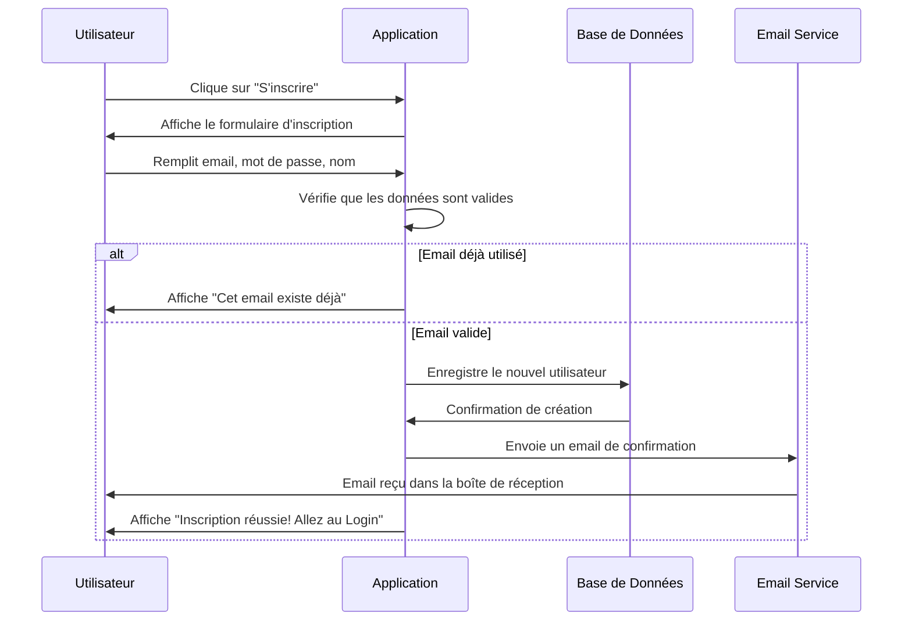
```mermaid
sequenceDiagram
    participant Utilisateur
    participant Application
    participant Base de Données
    participant Email Service

    Utilisateur->>Application: Clique sur "S'inscrire"
    Application->>Utilisateur: Affiche le formulaire d'inscription
    Utilisateur->>Application: Remplit email, mot de passe, nom
    Application->>Application: Vérifie que les données sont valides
    alt Email déjà utilisé
        Application->>Utilisateur: Affiche "Cet email existe déjà"
    else Email valide
        Application->>Base de Données: Enregistre le nouvel utilisateur
        Base de Données->>Application: Confirmation de création
        Application->>Email Service: Envoie un email de confirmation
        Email Service->>Utilisateur: Email reçu dans la boîte de réception
        Application->>Utilisateur: Affiche "Inscription réussie! Allez au Login"
    end
```

---

---

## 2. 🔐 CONNEXION (Login)

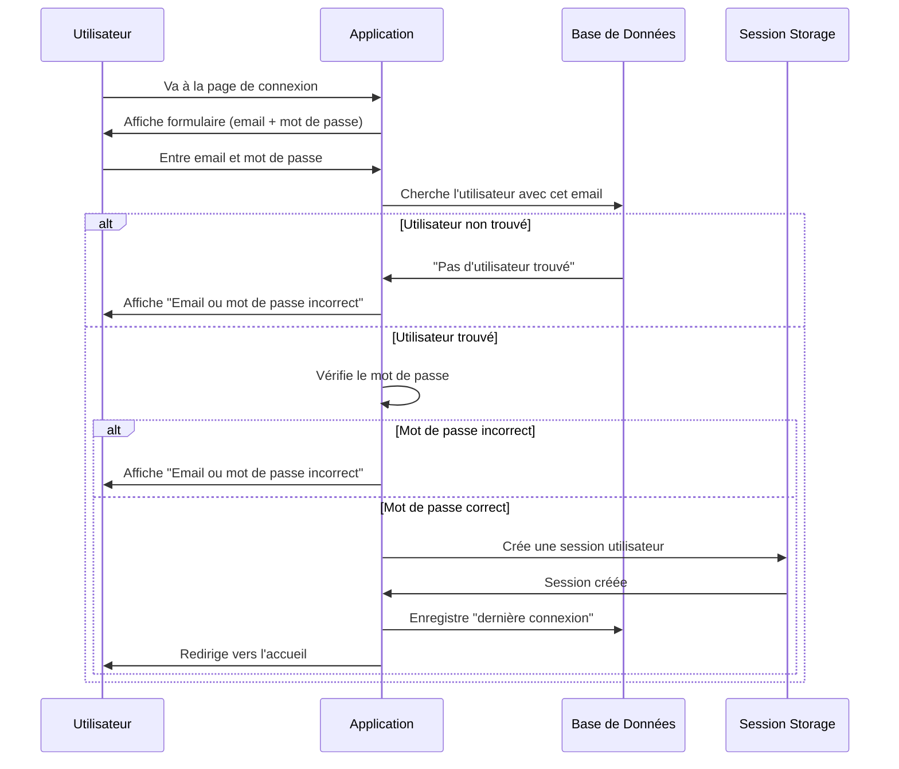
```mermaid
sequenceDiagram
    participant Utilisateur
    participant Application
    participant Base de Données
    participant Session Storage

    Utilisateur->>Application: Va à la page de connexion
    Application->>Utilisateur: Affiche formulaire (email + mot de passe)
    Utilisateur->>Application: Entre email et mot de passe
    Application->>Base de Données: Cherche l'utilisateur avec cet email
    alt Utilisateur non trouvé
        Base de Données->>Application: "Pas d'utilisateur trouvé"
        Application->>Utilisateur: Affiche "Email ou mot de passe incorrect"
    else Utilisateur trouvé
        Application->>Application: Vérifie le mot de passe
        alt Mot de passe incorrect
            Application->>Utilisateur: Affiche "Email ou mot de passe incorrect"
        else Mot de passe correct
            Application->>Session Storage: Crée une session utilisateur
            Session Storage->>Application: Session créée
            Application->>Base de Données: Enregistre "dernière connexion"
            Application->>Utilisateur: Redirige vers l'accueil
        end
    end
```

---

---

## 🏃 Sprint 2 : Intégration Commerçant & Back-Office Admin
## 3. 🏪 CRÉATION DE MAGASIN (Store Creation)

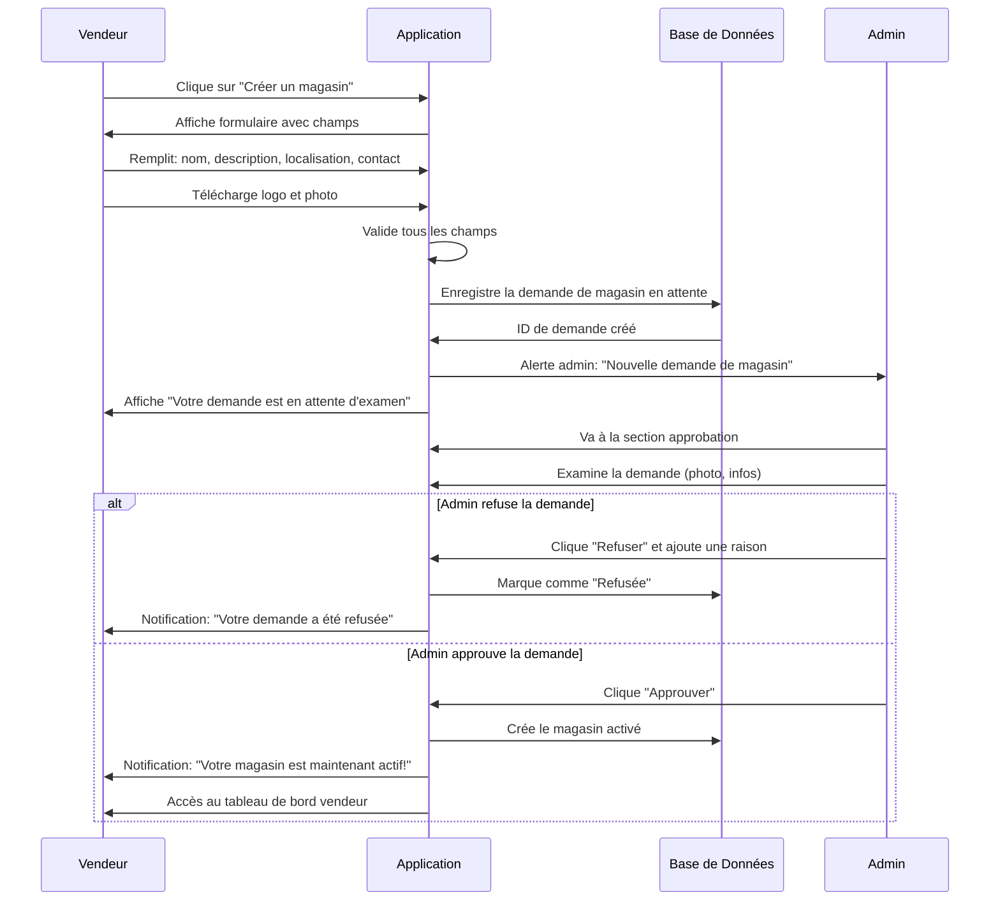
```mermaid
sequenceDiagram
    participant Vendeur
    participant Application
    participant Base de Données
    participant Admin

    Vendeur->>Application: Clique sur "Créer un magasin"
    Application->>Vendeur: Affiche formulaire avec champs
    Vendeur->>Application: Remplit: nom, description, localisation, contact
    Vendeur->>Application: Télécharge logo et photo
    Application->>Application: Valide tous les champs
    Application->>Base de Données: Enregistre la demande de magasin en attente
    Base de Données->>Application: ID de demande créé
    Application->>Admin: Alerte admin: "Nouvelle demande de magasin"
    Application->>Vendeur: Affiche "Votre demande est en attente d'examen"
    Admin->>Application: Va à la section approbation
    Admin->>Application: Examine la demande (photo, infos)
    alt Admin refuse la demande
        Admin->>Application: Clique "Refuser" et ajoute une raison
        Application->>Base de Données: Marque comme "Refusée"
        Application->>Vendeur: Notification: "Votre demande a été refusée"
    else Admin approuve la demande
        Admin->>Application: Clique "Approuver"
        Application->>Base de Données: Crée le magasin activé
        Application->>Vendeur: Notification: "Votre magasin est maintenant actif!"
        Application->>Vendeur: Accès au tableau de bord vendeur
    end
```

---

---

## 4. ✅ ACCEPTATION OU REFUS DE DEMANDE DE MAGASIN (Admin Review)

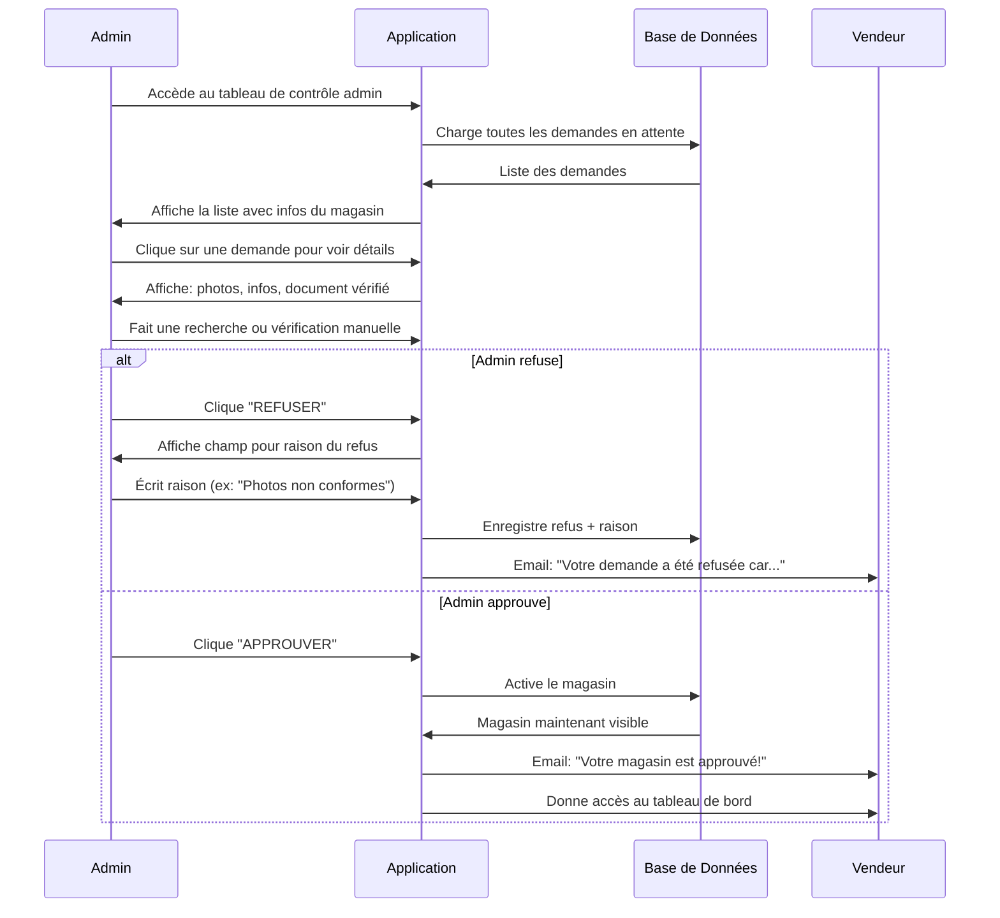
```mermaid
sequenceDiagram
    participant Admin
    participant Application
    participant Base de Données
    participant Vendeur

    Admin->>Application: Accède au tableau de contrôle admin
    Application->>Base de Données: Charge toutes les demandes en attente
    Base de Données->>Application: Liste des demandes
    Application->>Admin: Affiche la liste avec infos du magasin
    Admin->>Application: Clique sur une demande pour voir détails
    Application->>Admin: Affiche: photos, infos, document vérifié
    Admin->>Application: Fait une recherche ou vérification manuelle
    alt Admin refuse
        Admin->>Application: Clique "REFUSER"
        Application->>Admin: Affiche champ pour raison du refus
        Admin->>Application: Écrit raison (ex: "Photos non conformes")
        Application->>Base de Données: Enregistre refus + raison
        Application->>Vendeur: Email: "Votre demande a été refusée car..."
    else Admin approuve
        Admin->>Application: Clique "APPROUVER"
        Application->>Base de Données: Active le magasin
        Base de Données->>Application: Magasin maintenant visible
        Application->>Vendeur: Email: "Votre magasin est approuvé!"
        Application->>Vendeur: Donne accès au tableau de bord
    end
```

---

---

# 🚀 RELEASE 2 : E-Commerce & Catalogue

## 🏃 Sprint 3 : Gestion du Shop (Produits & Services)
## 5. ➕ AJOUTER PRODUIT/SERVICE

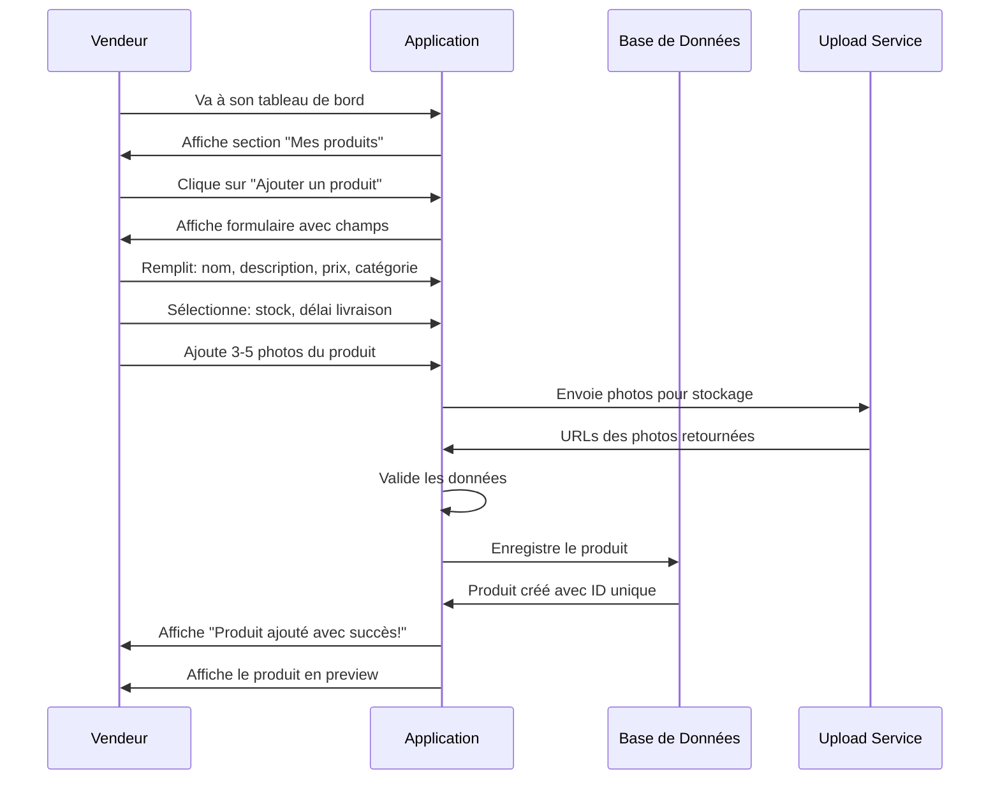
```mermaid
sequenceDiagram
    participant Vendeur
    participant Application
    participant Base de Données
    participant Upload Service

    Vendeur->>Application: Va à son tableau de bord
    Application->>Vendeur: Affiche section "Mes produits"
    Vendeur->>Application: Clique sur "Ajouter un produit"
    Application->>Vendeur: Affiche formulaire avec champs
    Vendeur->>Application: Remplit: nom, description, prix, catégorie
    Vendeur->>Application: Sélectionne: stock, délai livraison
    Vendeur->>Application: Ajoute 3-5 photos du produit
    Application->>Upload Service: Envoie photos pour stockage
    Upload Service->>Application: URLs des photos retournées
    Application->>Application: Valide les données
    Application->>Base de Données: Enregistre le produit
    Base de Données->>Application: Produit créé avec ID unique
    Application->>Vendeur: Affiche "Produit ajouté avec succès!"
    Application->>Vendeur: Affiche le produit en preview
```

---

---

## 6. ✏️ MODIFIER PRODUIT/SERVICE

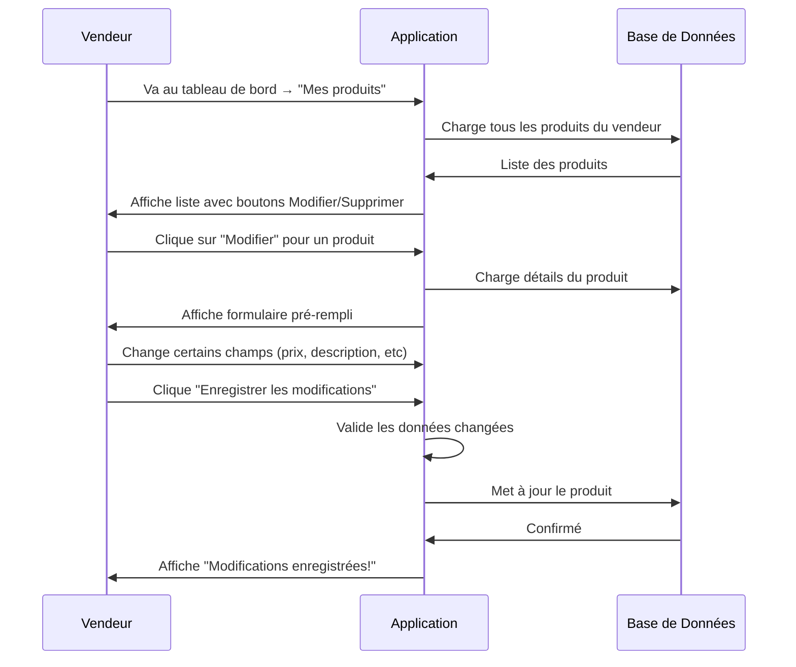
```mermaid
sequenceDiagram
    participant Vendeur
    participant Application
    participant Base de Données

    Vendeur->>Application: Va au tableau de bord → "Mes produits"
    Application->>Base de Données: Charge tous les produits du vendeur
    Base de Données->>Application: Liste des produits
    Application->>Vendeur: Affiche liste avec boutons Modifier/Supprimer
    Vendeur->>Application: Clique sur "Modifier" pour un produit
    Application->>Base de Données: Charge détails du produit
    Application->>Vendeur: Affiche formulaire pré-rempli
    Vendeur->>Application: Change certains champs (prix, description, etc)
    Vendeur->>Application: Clique "Enregistrer les modifications"
    Application->>Application: Valide les données changées
    Application->>Base de Données: Met à jour le produit
    Base de Données->>Application: Confirmé
    Application->>Vendeur: Affiche "Modifications enregistrées!"
```

---

---

## 🏃 Sprint 4 : Marketing & Promotions
## 8. 🎉 AJOUTER PROMOTION

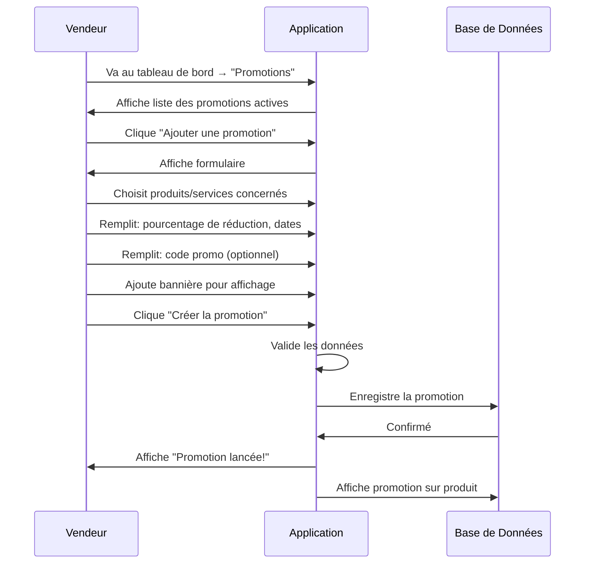
```mermaid
sequenceDiagram
    participant Vendeur
    participant Application
    participant Base de Données

    Vendeur->>Application: Va au tableau de bord → "Promotions"
    Application->>Vendeur: Affiche liste des promotions actives
    Vendeur->>Application: Clique "Ajouter une promotion"
    Application->>Vendeur: Affiche formulaire
    Vendeur->>Application: Choisit produits/services concernés
    Vendeur->>Application: Remplit: pourcentage de réduction, dates
    Vendeur->>Application: Remplit: code promo (optionnel)
    Vendeur->>Application: Ajoute bannière pour affichage
    Vendeur->>Application: Clique "Créer la promotion"
    Application->>Application: Valide les données
    Application->>Base de Données: Enregistre la promotion
    Base de Données->>Application: Confirmé
    Application->>Vendeur: Affiche "Promotion lancée!"
    Application->>Base de Données: Affiche promotion sur produit
```

---

---

## 9. 📝 MODIFIER PROMOTION

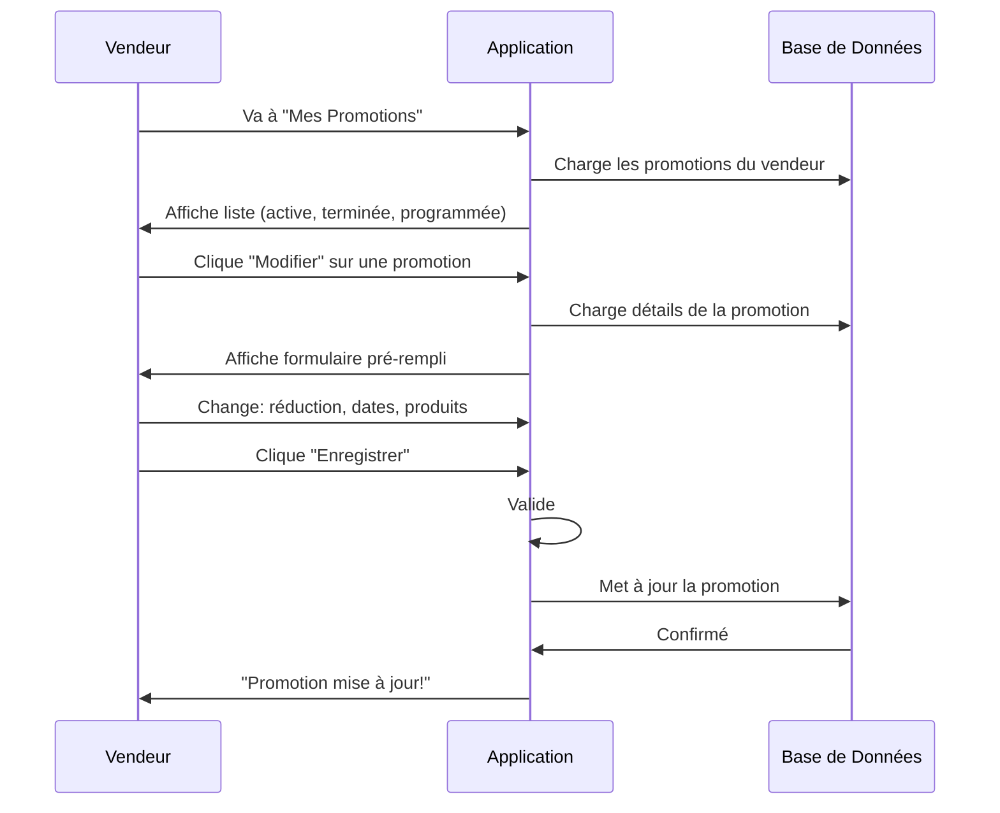
```mermaid
sequenceDiagram
    participant Vendeur
    participant Application
    participant Base de Données

    Vendeur->>Application: Va à "Mes Promotions"
    Application->>Base de Données: Charge les promotions du vendeur
    Application->>Vendeur: Affiche liste (active, terminée, programmée)
    Vendeur->>Application: Clique "Modifier" sur une promotion
    Application->>Base de Données: Charge détails de la promotion
    Application->>Vendeur: Affiche formulaire pré-rempli
    Vendeur->>Application: Change: réduction, dates, produits
    Vendeur->>Application: Clique "Enregistrer"
    Application->>Application: Valide
    Application->>Base de Données: Met à jour la promotion
    Base de Données->>Application: Confirmé
    Application->>Vendeur: "Promotion mise à jour!"
```

---

---

# 🚀 RELEASE 3 : Expérience Sociale & Contenu

## 🏃 Sprint 5 : Interaction Sociale & Découverte
## 11. 📹 CRÉATION DE REEL

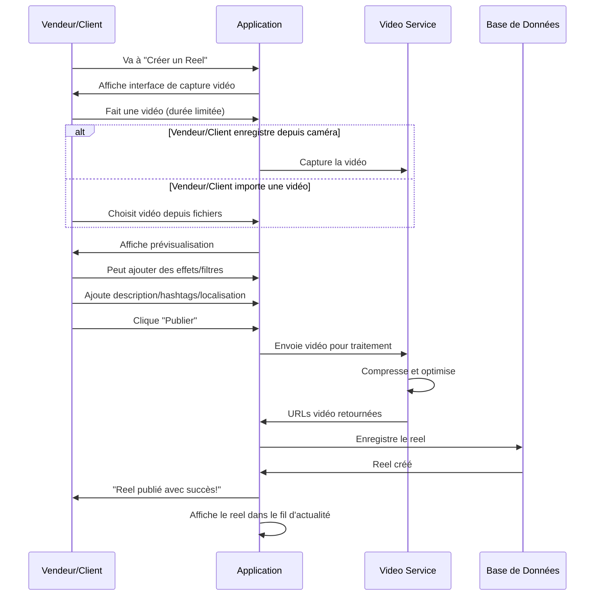
```mermaid
sequenceDiagram
    participant Vendeur/Client
    participant Application
    participant Video Service
    participant Base de Données

    Vendeur/Client->>Application: Va à "Créer un Reel"
    Application->>Vendeur/Client: Affiche interface de capture vidéo
    Vendeur/Client->>Application: Fait une vidéo (durée limitée)
    alt Vendeur/Client enregistre depuis caméra
        Application->>Video Service: Capture la vidéo
    else Vendeur/Client importe une vidéo
        Vendeur/Client->>Application: Choisit vidéo depuis fichiers
    end
    Application->>Vendeur/Client: Affiche prévisualisation
    Vendeur/Client->>Application: Peut ajouter des effets/filtres
    Vendeur/Client->>Application: Ajoute description/hashtags/localisation
    Vendeur/Client->>Application: Clique "Publier"
    Application->>Video Service: Envoie vidéo pour traitement
    Video Service->>Video Service: Compresse et optimise
    Video Service->>Application: URLs vidéo retournées
    Application->>Base de Données: Enregistre le reel
    Base de Données->>Application: Reel créé
    Application->>Vendeur/Client: "Reel publié avec succès!"
    Application->>Application: Affiche le reel dans le fil d'actualité
```

---

---

## 12. 👍 CONSULTER ET INTERAGIR AVEC LES REELS (Likes, Comments, Save, Shares)

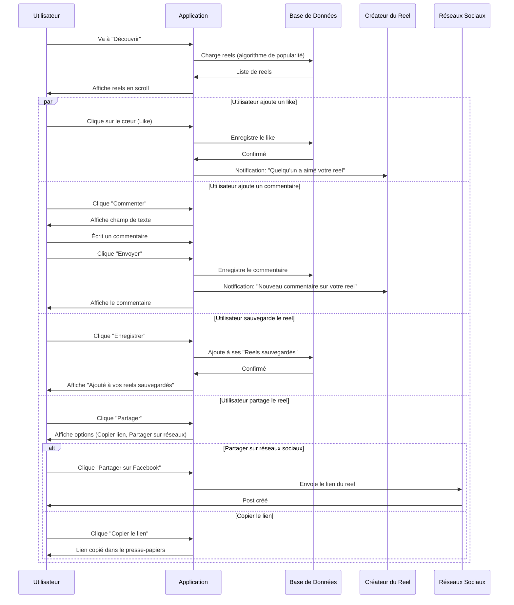
```mermaid
sequenceDiagram
    participant Utilisateur
    participant Application
    participant Base de Données
    participant Créateur du Reel
    participant Réseaux Sociaux

    Utilisateur->>Application: Va à "Découvrir"
    Application->>Base de Données: Charge reels (algorithme de popularité)
    Base de Données->>Application: Liste de reels
    Application->>Utilisateur: Affiche reels en scroll
    
    par Utilisateur ajoute un like
        Utilisateur->>Application: Clique sur le cœur (Like)
        Application->>Base de Données: Enregistre le like
        Base de Données->>Application: Confirmé
        Application->>Créateur du Reel: Notification: "Quelqu'un a aimé votre reel"
    and Utilisateur ajoute un commentaire
        Utilisateur->>Application: Clique "Commenter"
        Application->>Utilisateur: Affiche champ de texte
        Utilisateur->>Application: Écrit un commentaire
        Utilisateur->>Application: Clique "Envoyer"
        Application->>Base de Données: Enregistre le commentaire
        Application->>Créateur du Reel: Notification: "Nouveau commentaire sur votre reel"
        Application->>Utilisateur: Affiche le commentaire
    and Utilisateur sauvegarde le reel
        Utilisateur->>Application: Clique "Enregistrer"
        Application->>Base de Données: Ajoute à ses "Reels sauvegardés"
        Base de Données->>Application: Confirmé
        Application->>Utilisateur: Affiche "Ajouté à vos reels sauvegardés"
    and Utilisateur partage le reel
        Utilisateur->>Application: Clique "Partager"
        Application->>Utilisateur: Affiche options (Copier lien, Partager sur réseaux)
        alt Partager sur réseaux sociaux
            Utilisateur->>Application: Clique "Partager sur Facebook"
            Application->>Réseaux Sociaux: Envoie le lien du reel
            Réseaux Sociaux->>Utilisateur: Post créé
        else Copier le lien
            Utilisateur->>Application: Clique "Copier le lien"
            Application->>Utilisateur: Lien copié dans le presse-papiers
        end
    end
```

---

---

## 13. 🗑️ SUPPRIMER REEL

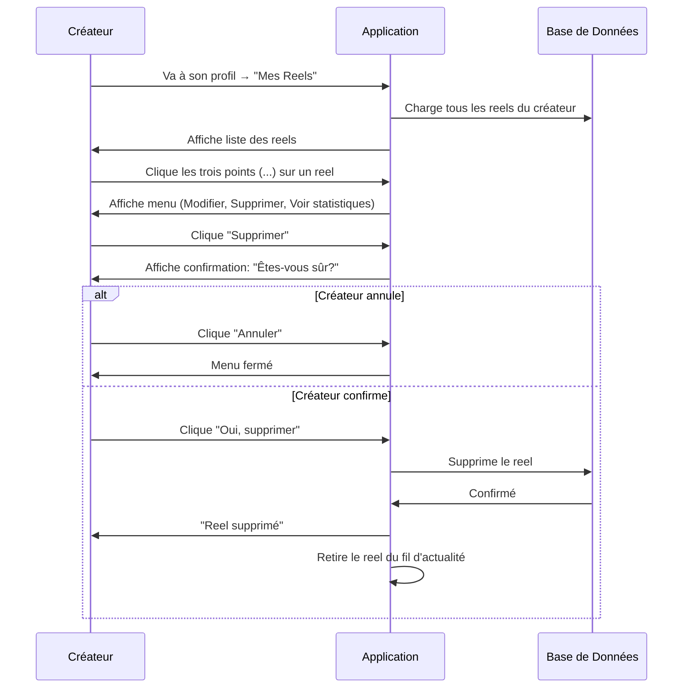
```mermaid
sequenceDiagram
    participant Créateur
    participant Application
    participant Base de Données

    Créateur->>Application: Va à son profil → "Mes Reels"
    Application->>Base de Données: Charge tous les reels du créateur
    Application->>Créateur: Affiche liste des reels
    Créateur->>Application: Clique les trois points (...) sur un reel
    Application->>Créateur: Affiche menu (Modifier, Supprimer, Voir statistiques)
    Créateur->>Application: Clique "Supprimer"
    Application->>Créateur: Affiche confirmation: "Êtes-vous sûr?"
    alt Créateur annule
        Créateur->>Application: Clique "Annuler"
        Application->>Créateur: Menu fermé
    else Créateur confirme
        Créateur->>Application: Clique "Oui, supprimer"
        Application->>Base de Données: Supprime le reel
        Base de Données->>Application: Confirmé
        Application->>Créateur: "Reel supprimé"
        Application->>Application: Retire le reel du fil d'actualité
    end
```

---

---

## 14. 📖 AJOUTER STORIE

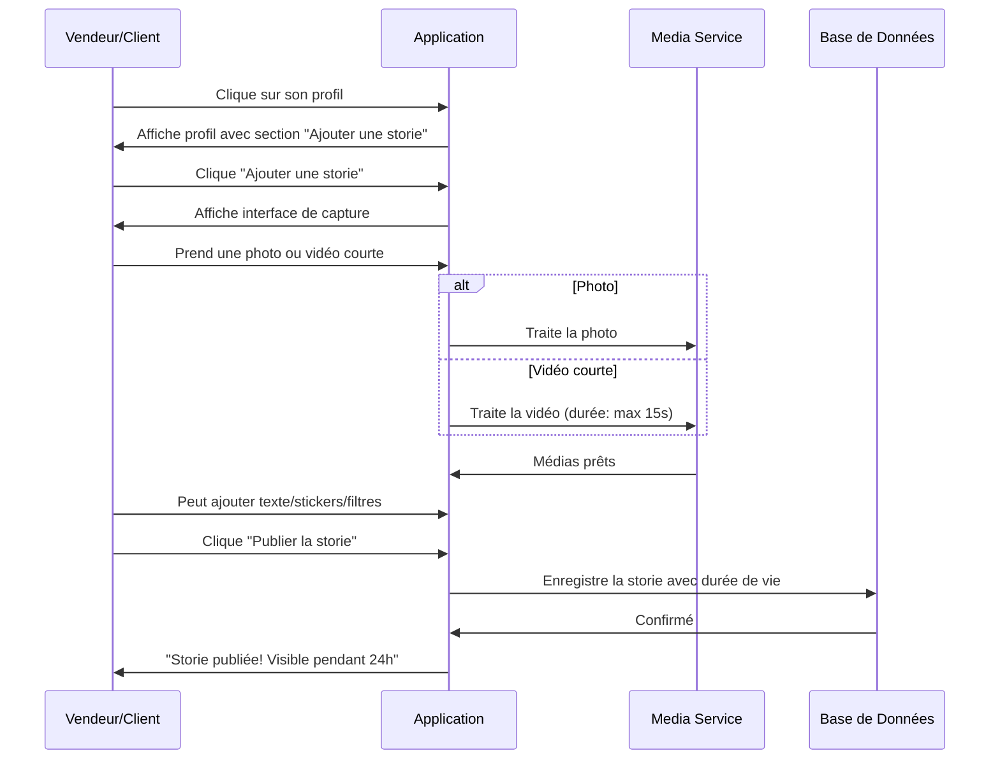
```mermaid
sequenceDiagram
    participant Vendeur/Client
    participant Application
    participant Media Service
    participant Base de Données

    Vendeur/Client->>Application: Clique sur son profil
    Application->>Vendeur/Client: Affiche profil avec section "Ajouter une storie"
    Vendeur/Client->>Application: Clique "Ajouter une storie"
    Application->>Vendeur/Client: Affiche interface de capture
    Vendeur/Client->>Application: Prend une photo ou vidéo courte
    alt Photo
        Application->>Media Service: Traite la photo
    else Vidéo courte
        Application->>Media Service: Traite la vidéo (durée: max 15s)
    end
    Media Service->>Application: Médias prêts
    Vendeur/Client->>Application: Peut ajouter texte/stickers/filtres
    Vendeur/Client->>Application: Clique "Publier la storie"
    Application->>Base de Données: Enregistre la storie avec durée de vie
    Base de Données->>Application: Confirmé
    Application->>Vendeur/Client: "Storie publiée! Visible pendant 24h"
```

---

---

## 15. 🗑️ SUPPRIMER STORIE

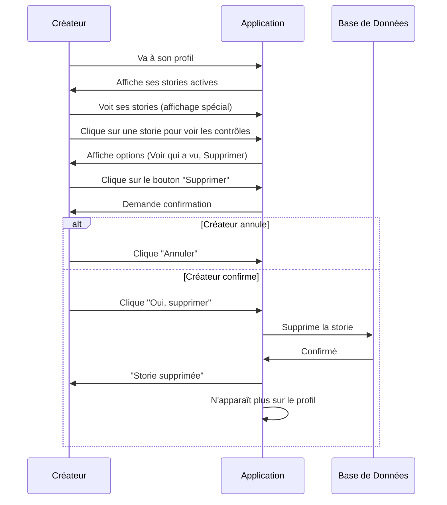
```mermaid
sequenceDiagram
    participant Créateur
    participant Application
    participant Base de Données

    Créateur->>Application: Va à son profil
    Application->>Créateur: Affiche ses stories actives
    Créateur->>Application: Voit ses stories (affichage spécial)
    Créateur->>Application: Clique sur une storie pour voir les contrôles
    Application->>Créateur: Affiche options (Voir qui a vu, Supprimer)
    Créateur->>Application: Clique sur le bouton "Supprimer"
    Application->>Créateur: Demande confirmation
    alt Créateur annule
        Créateur->>Application: Clique "Annuler"
    else Créateur confirme
        Créateur->>Application: Clique "Oui, supprimer"
        Application->>Base de Données: Supprime la storie
        Base de Données->>Application: Confirmé
        Application->>Créateur: "Storie supprimée"
        Application->>Application: N'apparaît plus sur le profil
    end
```

---

---

## 🏃 Sprint 6 : Avis & Mises en Favoris
## 19. ⭐ AVIS (Magasin ou Articles)

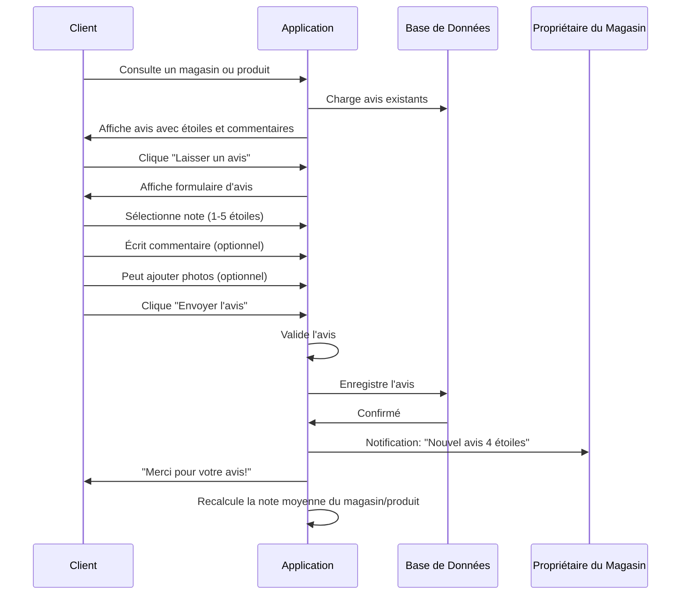
```mermaid
sequenceDiagram
    participant Client
    participant Application
    participant Base de Données
    participant Propriétaire du Magasin

    Client->>Application: Consulte un magasin ou produit
    Application->>Base de Données: Charge avis existants
    Application->>Client: Affiche avis avec étoiles et commentaires
    Client->>Application: Clique "Laisser un avis"
    Application->>Client: Affiche formulaire d'avis
    Client->>Application: Sélectionne note (1-5 étoiles)
    Client->>Application: Écrit commentaire (optionnel)
    Client->>Application: Peut ajouter photos (optionnel)
    Client->>Application: Clique "Envoyer l'avis"
    Application->>Application: Valide l'avis
    Application->>Base de Données: Enregistre l'avis
    Base de Données->>Application: Confirmé
    Application->>Propriétaire du Magasin: Notification: "Nouvel avis 4 étoiles"
    Application->>Client: "Merci pour votre avis!"
    Application->>Application: Recalcule la note moyenne du magasin/produit
```

---

---

## 23. ❤️ AJOUTER EN FAVORIS

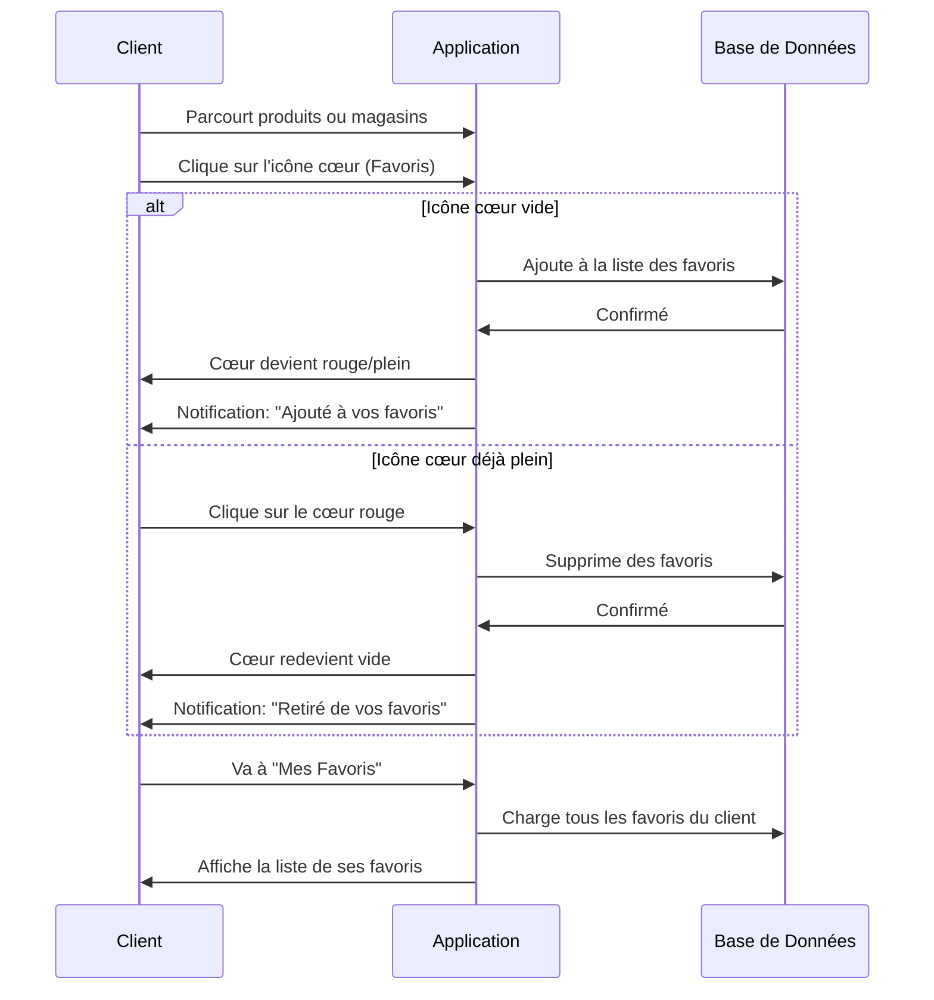
```mermaid
sequenceDiagram
    participant Client
    participant Application
    participant Base de Données

    Client->>Application: Parcourt produits ou magasins
    Client->>Application: Clique sur l'icône cœur (Favoris)
    alt Icône cœur vide
        Application->>Base de Données: Ajoute à la liste des favoris
        Base de Données->>Application: Confirmé
        Application->>Client: Cœur devient rouge/plein
        Application->>Client: Notification: "Ajouté à vos favoris"
    else Icône cœur déjà plein
        Client->>Application: Clique sur le cœur rouge
        Application->>Base de Données: Supprime des favoris
        Base de Données->>Application: Confirmé
        Application->>Client: Cœur redevient vide
        Application->>Client: Notification: "Retiré de vos favoris"
    end
    
    Client->>Application: Va à "Mes Favoris"
    Application->>Base de Données: Charge tous les favoris du client
    Application->>Client: Affiche la liste de ses favoris
```

---

---

# 🚀 RELEASE 4 : Intelligence Artificielle & Recherche Avancée

## 🏃 Sprint 7 : Moteurs de Recherche Intelligente
## 16. 🔍 RECHERCHE SÉMANTIQUE PAR DARIJA

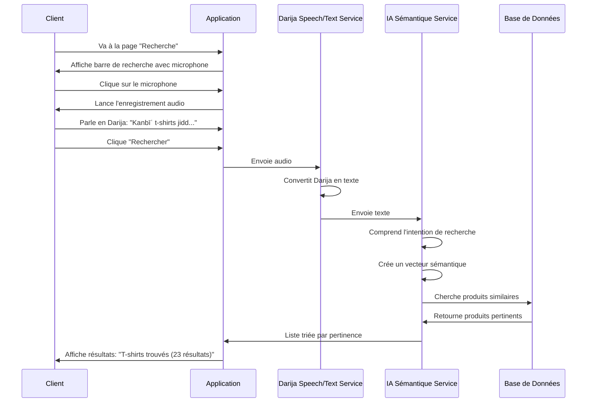
```mermaid
sequenceDiagram
    participant Client
    participant Application
    participant Darija Speech/Text Service
    participant IA Sémantique Service
    participant Base de Données

    Client->>Application: Va à la page "Recherche"
    Application->>Client: Affiche barre de recherche avec microphone
    Client->>Application: Clique sur le microphone
    Application->>Client: Lance l'enregistrement audio
    Client->>Application: Parle en Darija: "Kanbīʿ t-shirts jidd..."
    Client->>Application: Clique "Rechercher"
    Application->>Darija Speech/Text Service: Envoie audio
    Darija Speech/Text Service->>Darija Speech/Text Service: Convertit Darija en texte
    Darija Speech/Text Service->>IA Sémantique Service: Envoie texte
    IA Sémantique Service->>IA Sémantique Service: Comprend l'intention de recherche
    IA Sémantique Service->>IA Sémantique Service: Crée un vecteur sémantique
    IA Sémantique Service->>Base de Données: Cherche produits similaires
    Base de Données->>IA Sémantique Service: Retourne produits pertinents
    IA Sémantique Service->>Application: Liste triée par pertinence
    Application->>Client: Affiche résultats: "T-shirts trouvés (23 résultats)"
```

---

---

## 17. 📸 RECHERCHE PAR IMAGE

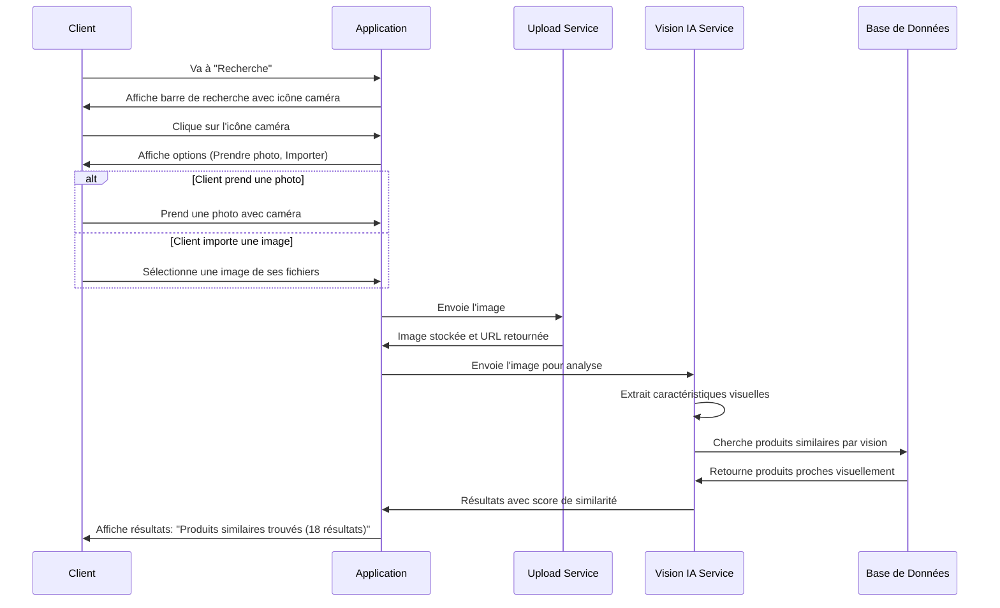
```mermaid
sequenceDiagram
    participant Client
    participant Application
    participant Upload Service
    participant Vision IA Service
    participant Base de Données

    Client->>Application: Va à "Recherche"
    Application->>Client: Affiche barre de recherche avec icône caméra
    Client->>Application: Clique sur l'icône caméra
    Application->>Client: Affiche options (Prendre photo, Importer)
    alt Client prend une photo
        Client->>Application: Prend une photo avec caméra
    else Client importe une image
        Client->>Application: Sélectionne une image de ses fichiers
    end
    Application->>Upload Service: Envoie l'image
    Upload Service->>Application: Image stockée et URL retournée
    Application->>Vision IA Service: Envoie l'image pour analyse
    Vision IA Service->>Vision IA Service: Extrait caractéristiques visuelles
    Vision IA Service->>Base de Données: Cherche produits similaires par vision
    Base de Données->>Vision IA Service: Retourne produits proches visuellement
    Vision IA Service->>Application: Résultats avec score de similarité
    Application->>Client: Affiche résultats: "Produits similaires trouvés (18 résultats)"
```

---

---

## 18. 🗺️ RECHERCHE GÉOLOCALE

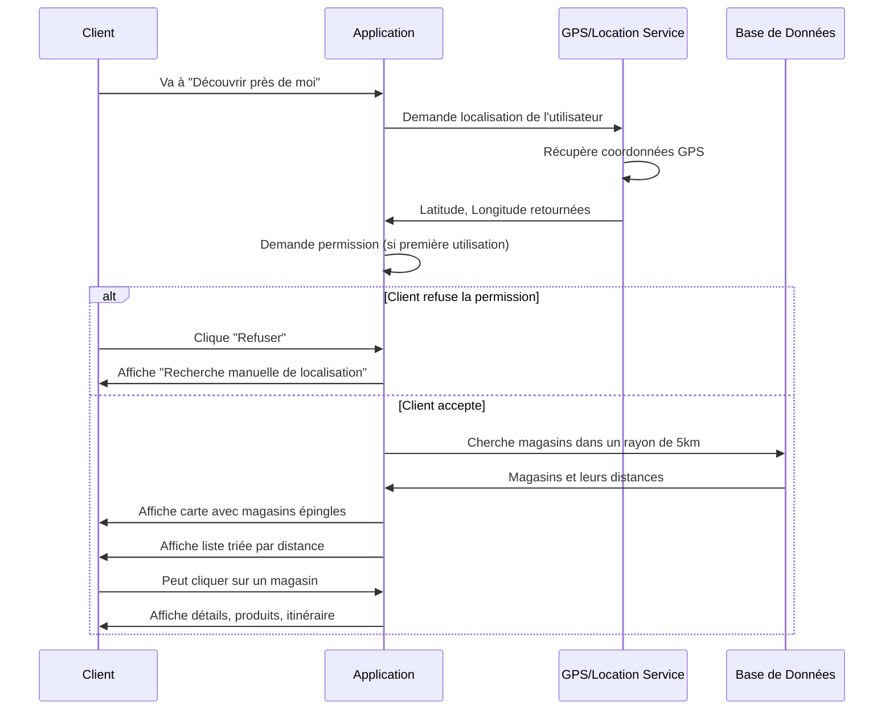
```mermaid
sequenceDiagram
    participant Client
    participant Application
    participant GPS/Location Service
    participant Base de Données

    Client->>Application: Va à "Découvrir près de moi"
    Application->>GPS/Location Service: Demande localisation de l'utilisateur
    GPS/Location Service->>GPS/Location Service: Récupère coordonnées GPS
    GPS/Location Service->>Application: Latitude, Longitude retournées
    Application->>Application: Demande permission (si première utilisation)
    alt Client refuse la permission
        Client->>Application: Clique "Refuser"
        Application->>Client: Affiche "Recherche manuelle de localisation"
    else Client accepte
        Application->>Base de Données: Cherche magasins dans un rayon de 5km
        Base de Données->>Application: Magasins et leurs distances
        Application->>Client: Affiche carte avec magasins épingles
        Application->>Client: Affiche liste triée par distance
        Client->>Application: Peut cliquer sur un magasin
        Application->>Client: Affiche détails, produits, itinéraire
    end
```

---

---

## 🏃 Sprint 8 : Assistant Conversationnel et IA Générative
## 7. 🤖 CRÉATION DE PRODUIT/SERVICE PAR DARIJA (IA Darija)

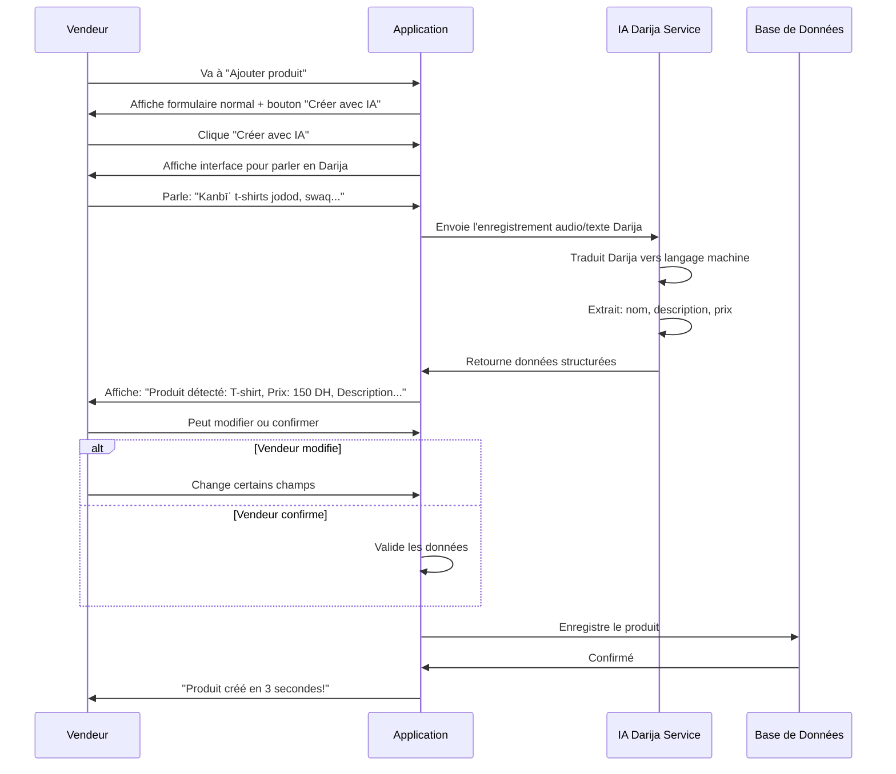
```mermaid
sequenceDiagram
    participant Vendeur
    participant Application
    participant IA Darija Service
    participant Base de Données

    Vendeur->>Application: Va à "Ajouter produit"
    Application->>Vendeur: Affiche formulaire normal + bouton "Créer avec IA"
    Vendeur->>Application: Clique "Créer avec IA"
    Application->>Vendeur: Affiche interface pour parler en Darija
    Vendeur->>Application: Parle: "Kanbīʿ t-shirts jodod, swaq..."
    Application->>IA Darija Service: Envoie l'enregistrement audio/texte Darija
    IA Darija Service->>IA Darija Service: Traduit Darija vers langage machine
    IA Darija Service->>IA Darija Service: Extrait: nom, description, prix
    IA Darija Service->>Application: Retourne données structurées
    Application->>Vendeur: Affiche: "Produit détecté: T-shirt, Prix: 150 DH, Description..."
    Vendeur->>Application: Peut modifier ou confirmer
    alt Vendeur modifie
        Vendeur->>Application: Change certains champs
    else Vendeur confirme
        Application->>Application: Valide les données
    end
    Application->>Base de Données: Enregistre le produit
    Base de Données->>Application: Confirmé
    Application->>Vendeur: "Produit créé en 3 secondes!"
```

---

---

## 10. 🤖 CRÉATION DE PROMOTION AVEC IA DARIJA

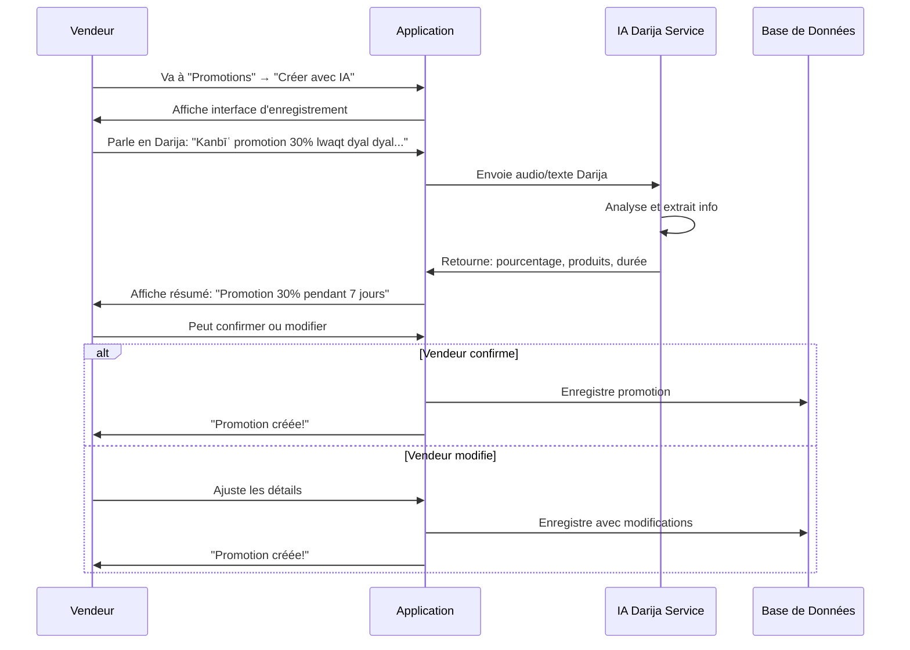
```mermaid
sequenceDiagram
    participant Vendeur
    participant Application
    participant IA Darija Service
    participant Base de Données

    Vendeur->>Application: Va à "Promotions" → "Créer avec IA"
    Application->>Vendeur: Affiche interface d'enregistrement
    Vendeur->>Application: Parle en Darija: "Kanbīʿ promotion 30% lwaqt dyal dyal..."
    Application->>IA Darija Service: Envoie audio/texte Darija
    IA Darija Service->>IA Darija Service: Analyse et extrait info
    IA Darija Service->>Application: Retourne: pourcentage, produits, durée
    Application->>Vendeur: Affiche résumé: "Promotion 30% pendant 7 jours"
    Vendeur->>Application: Peut confirmer ou modifier
    alt Vendeur confirme
        Application->>Base de Données: Enregistre promotion
        Application->>Vendeur: "Promotion créée!"
    else Vendeur modifie
        Vendeur->>Application: Ajuste les détails
        Application->>Base de Données: Enregistre avec modifications
        Application->>Vendeur: "Promotion créée!"
    end
```

---

---

## 27. 🤖 CHATBOT DARIJA CONTEXTUEL

### **Vue Complète: Conversation Darija Contextuelle**

```mermaid
sequenceDiagram
    participant UserWeb as User<br/>(Web Chat)
    participant UserMobile as User<br/>(Mobile Chat)
    participant ChatUI as Chat Interface<br/>Web & Mobile
    participant ChatBus as Chat Message<br/>Bus
    participant DarijaProcessor as Darija<br/>Processor
    participant ContextEngine as Context<br/>Engine
    participant SearchService as Search<br/>Service
    participant Database as Database
    participant ChatResponse as Response<br/>Generator
    participant Sync as Cross-Device<br/>Sync
    
    alt User sur WEB ouvre chat
        UserWeb->>ChatUI: Clique sur icône chat
        ChatUI->>ChatUI: Charge historique conversation
    else User sur MOBILE ouvre chat
        UserMobile->>ChatUI: Ouvre chat
        ChatUI->>ChatUI: Charge historique (synchro depuis web)
    end
    
    UserWeb->>ChatUI: Tape ou parle: "Wach kayn tablets?"
    ChatUI->>ChatBus: Envoie message
    
    ChatBus->>DarijaProcessor: Traite message Darija
    DarijaProcessor->>DarijaProcessor: Traduit Darija en intent structuré
    DarijaProcessor->>DarijaProcessor: "Wach kayn tablets?" = "Are there tablets in stock?"
    
    DarijaProcessor->>ContextEngine: Envoie intent + user context
    ContextEngine->>Database: Récupère contexte utilisateur
    Database->>ContextEngine: User location, budget, history
    
    ContextEngine->>ContextEngine: Compile contexte:
    ContextEngine->>ContextEngine: - User géolocalisation: Tunis
    ContextEngine->>ContextEngine: - Budget préféré: 1000-2000 DH
    ContextEngine->>ContextEngine: - Historique achat: électronique
    
    ContextEngine->>SearchService: "Find tablets near Tunis, price 1000-2000"
    SearchService->>Database: Query avec contexte
    Database->>SearchService: Retourne 15 tablets pertinents
    
    par Analyse résultats
        SearchService->>SearchService: Trie par: relevance, distance, rating
        SearchService->>SearchService: Top 5 résultats
    end
    
    SearchService->>ChatResponse: Résultats trouvés
    ChatResponse->>ChatResponse: Génère réponse en Darija
    ChatResponse->>ChatResponse: "Kaynin 5 tablets jdad:<br/>1. Store X - 1500 DH - 2km away"
    
    ChatResponse->>ChatUI: Affiche réponse
    ChatUI->>UserWeb: Affiche: "Kaynin 5 tablets jdad:..."
    ChatUI->>UserWeb: Affiche thumbnail images
    ChatUI->>UserWeb: Affiche buttons: "Voir détails", "Acheter"
    
    par Sync to Mobile
        Sync->>UserMobile: Notification: "Chat history updated"
        ChatUI->>UserMobile: Affiche même conversation
    end
    
    UserWeb->>ChatUI: Clique "Voir détails" sur tablet 1
    ChatUI->>ChatBus: Event: "User clicked on tablet result"
    ChatBus->>SearchService: Load full tablet details
    
    UserWeb->>ChatUI: Tape: "Quel est le meilleur?"
    ChatUI->>DarijaProcessor: Process question
    DarijaProcessor->>ContextEngine: Parse: "Which one is best for my needs?"
    
    ContextEngine->>ContextEngine: Considère:
    ContextEngine->>ContextEngine: - User preferences (specs preferred)
    ContextEngine->>ContextEngine: - Price sensitivity
    ContextEngine->>ContextEngine: - Store ratings
    
    ContextEngine->>ChatResponse: Recommande #3 (meilleur rapport qualité/prix)
    ChatResponse->>ChatUI: "Tablet #3 est mieux: 1800 DH, 4.8★, RAM 4GB"
    
    ChatUI->>UserWeb: Affiche recommandation
    
    par User actions
        UserWeb->>ChatUI: "Je vais l'acheter"
        ChatUI->>Database: Log conversation + intent
    end
    
    par Sync all
        Sync->>UserMobile: Message history synced
        Sync->>Database: Conversation saved
    end
```

---

---

# 🚀 RELEASE 5 : Transaction & Logistique

## 🏃 Sprint 9 : Tunnel d'Achat & Réservation
## 20. 🛒 FAIRE UNE COMMANDE/RÉSERVATION

```mermaid
sequenceDiagram
    participant Client
    participant Application
    participant Base de Données
    participant Vendeur
    participant Payment Service

    Client->>Application: Parcourt les produits/services
    Client->>Application: Clique "Ajouter au panier" sur un produit
    Application->>Application: Ajoute à la session du client
    Client->>Application: Continue shopping ou va au panier
    Application->>Client: Affiche panier avec articles
    Client->>Application: Peut modifier quantité, supprimer articles
    Client->>Application: Clique "Passer la commande"
    Application->>Client: Affiche résumé: articles, total, frais
    Client->>Application: Saisit adresse de livraison
    Client->>Application: Sélectionne mode de livraison (livraison, retrait)
    Client->>Application: Sélectionne mode de paiement
    Client->>Application: Clique "Confirmer la commande"
    Application->>Payment Service: Vérifie le paiement
    alt Paiement échoue
        Payment Service->>Application: "Paiement refusé"
        Application->>Client: Affiche "Paiement échoué, réessayez"
    else Paiement réussit
        Payment Service->>Application: "Paiement approuvé"
        Application->>Base de Données: Enregistre la commande
        Application->>Vendeur: Notification: "Nouvelle commande de [Client]"
        Application->>Client: Email de confirmation + numéro de commande
        Application->>Client: Affiche "Commande créée! Suivi: #12345"
    end
```

---

---

## 21. ✅ ACCEPTER/REFUSER DEMANDE DE RÉSERVATION/COMMANDE

```mermaid
sequenceDiagram
    participant Vendeur
    participant Application
    participant Base de Données
    participant Client

    Vendeur->>Application: Va au tableau de bord → "Commandes/Réservations"
    Application->>Base de Données: Charge les commandes du vendeur
    Base de Données->>Application: Commandes en statut "En attente"
    Application->>Vendeur: Affiche liste avec détails client
    Vendeur->>Application: Examine une commande
    Application->>Vendeur: Affiche: produits, quantité, client, adresse
    
    alt Vendeur accepte
        Vendeur->>Application: Clique "Accepter la commande"
        Application->>Base de Données: Change statut à "Acceptée"
        Base de Données->>Application: Confirmé
        Application->>Client: Notification: "Votre commande a été acceptée!"
        Application->>Vendeur: Affiche "Commande en préparation"
    else Vendeur refuse
        Vendeur->>Application: Clique "Refuser"
        Application->>Vendeur: Affiche champ pour raison du refus
        Vendeur->>Application: Écrit raison (ex: "Stock épuisé")
        Vendeur->>Application: Clique "Confirmer le refus"
        Application->>Base de Données: Enregistre refus
        Application->>Client: Notification: "Votre commande a été refusée car: Stock épuisé"
        Application->>Client: Option de remboursement automatique
    end
```

---

---

## 🏃 Sprint 10 : Validation Physique
## 22. 🔐 VALIDATION DE COMMANDE OU RÉSERVATION PAR QR CODE

```mermaid
sequenceDiagram
    participant Client
    participant Vendeur
    participant Application
    participant Base de Données
    participant QR Scanner

    Client->>Application: Va à "Mes commandes"
    Application->>Client: Affiche liste des commandes
    Client->>Application: Clique sur une commande livrée/à retirer
    Application->>Client: Affiche détails et QR code unique
    
    Client->>Vendeur: Arrive au magasin/point de retrait
    Vendeur->>Application: Va à "Scanner une commande"
    Application->>Vendeur: Affiche interface QR scanner
    Vendeur->>QR Scanner: Pointe la caméra vers QR code du client
    QR Scanner->>Application: Code QR détecté et scanné
    Application->>Base de Données: Cherche commande avec ce code
    Base de Données->>Application: Commande trouvée
    alt Commande valide
        Application->>Base de Données: Marque comme "Validée/Retirée"
        Application->>Vendeur: Affiche "✓ Commande valide - [Client]"
        Application->>Client: Notification: "Commande retirée/livrée confirmée"
        Application->>Vendeur: Son stock est automatiquement mis à jour
    else Commande invalide ou expirée
        Application->>Vendeur: Affiche "✗ Code invalide ou expiré"
    end
```

---

---

# 🚀 RELEASE 6 : Communication & Support

## 🏃 Sprint 11 : Messagerie et Service Client
## 24. 💬 DISCUTER MESSAGERIE CLIENT - CLIENT

```mermaid
sequenceDiagram
    participant Client 1
    participant Application
    participant Base de Données
    participant Client 2

    Client 1->>Application: Va à son profil
    Application->>Client 1: Affiche section "Conversations"
    Client 1->>Application: Clique "Nouvelle conversation"
    Application->>Client 1: Affiche liste de suggestions de contacts
    Client 1->>Application: Sélectionne Client 2
    Application->>Base de Données: Crée ou récupère conversation existante
    Application->>Client 1: Affiche interface de chat
    
    Client 1->>Application: Écrit un message
    Client 1->>Application: Clique "Envoyer"
    Application->>Base de Données: Enregistre le message
    Base de Données->>Client 2: Message reçu (notification temps réel)
    Application->>Client 2: Notification: "Nouveau message de Client 1"
    
    Client 2->>Application: Ouvre la conversation
    Application->>Base de Données: Charge l'historique
    Application->>Client 2: Affiche tous les messages
    Client 2->>Application: Écrit une réponse
    Client 2->>Application: Clique "Envoyer"
    Application->>Client 1: Reçoit la réponse (temps réel)
    
    par Client 1 peut voir si Client 2 écrit
        Application->>Client 1: Affiche "Client 2 est en train d'écrire..."
    and Client 1 peut envoyer des fichiers/photos
        Client 1->>Application: Clique sur l'icône pièce jointe
        Application->>Client 1: Sélectionne une image
        Client 1->>Application: Envoie l'image
        Application->>Client 2: Image reçue dans le chat
    end
```

---

---

## 25. 💼 DISCUTER MESSAGERIE CLIENT - MAGASIN

```mermaid
sequenceDiagram
    participant Client
    participant Application
    participant Base de Données
    participant Support Vendeur

    Client->>Application: Va consulter un magasin
    Application->>Client: Affiche profil du magasin
    Client->>Application: Clique "Envoyer un message"
    Application->>Client: Affiche interface de chat avec le magasin
    
    Client->>Application: Pose une question: "Avez-vous du stock?"
    Client->>Application: Clique "Envoyer"
    Application->>Base de Données: Enregistre le message
    Base de Données->>Support Vendeur: Notification: "Nouveau message d'un client"
    
    Support Vendeur->>Application: Reçoit la notification
    Support Vendeur->>Application: Va à "Messages"
    Application->>Base de Données: Charge conversations en attente
    Application->>Support Vendeur: Affiche liste des clients
    Support Vendeur->>Application: Clique sur Client
    Application->>Support Vendeur: Affiche historique du chat
    Support Vendeur->>Application: Écrit sa réponse: "Oui nous avons du stock"
    Support Vendeur->>Application: Clique "Envoyer"
    Application->>Client: Notification: "Réponse du magasin"
    Application->>Client: Affiche la réponse en temps réel
    
    Client->>Application: Peut continuer à poser des questions
    Support Vendeur->>Application: Peut envoyer des liens produit ou images
```

---

---

## 26. 🎫 CRÉER UN TICKET SUPPORT

```mermaid
sequenceDiagram
    participant Utilisateur
    participant Application
    participant Base de Données
    participant Support Team

    Utilisateur->>Application: Va à "Aide" ou "Support"
    Application->>Utilisateur: Affiche page d'aide avec FAQ
    Utilisateur->>Application: Cherche dans FAQ, ne trouve pas réponse
    Utilisateur->>Application: Clique "Créer un ticket"
    Application->>Utilisateur: Affiche formulaire de ticket
    
    Utilisateur->>Application: Sélectionne catégorie (Commande, Technique, etc.)
    Utilisateur->>Application: Sélectionne priorité (Normal, Urgent)
    Utilisateur->>Application: Écrit le problème en détail
    Utilisateur->>Application: Peut joindre captures d'écran/fichiers
    Utilisateur->>Application: Clique "Soumettre le ticket"
    
    Application->>Application: Valide le ticket
    Application->>Base de Données: Enregistre le ticket avec ID unique
    Base de Données->>Application: Ticket créé
    
    Application->>Utilisateur: Email confirmation: "Ticket #5021 créé"
    Application->>Support Team: Notification: "Nouveau ticket - Priorité Normal"
    
    Support Team->>Application: Va à "Support"
    Application->>Base de Données: Charge tous les tickets
    Support Team->>Application: Clique sur le ticket de l'utilisateur
    Application->>Support Team: Affiche détails complets
    
    Support Team->>Application: Écrit une réponse
    Support Team->>Application: Clique "Répondre"
    Application->>Utilisateur: Notification: "Réponse à votre ticket #5021"
    Application->>Utilisateur: Affiche le message du support
    
    alt Utilisateur est satisfait
        Utilisateur->>Application: Clique "Résolu"
        Application->>Base de Données: Change statut du ticket à "Fermé"
        Application->>Support Team: Notification: "Ticket #5021 fermé"
    else Utilisateur a besoin d'aide supplémentaire
        Utilisateur->>Application: Répond au support
        Application->>Support Team: Notification de nouvelle réponse
    end
```

---

# 📊 Vue d'Ensemble des Workflows (Plan Agile)

| Release | Sprint | # | Workflow | Acteur Principal | Système Clé |
|---------|--------|---|----------|------------------|-----------|
| **R1** | Sp 1 | 1 | Inscription | Nouvel utilisateur | Auth |
| **R1** | Sp 1 | 2 | Connexion | Utilisateur existant | Auth |
| **R1** | Sp 2 | 3 | Création de magasin | Vendeur | Approval System |
| **R1** | Sp 2 | 4 | Approbation magasin | Admin | Verification |
| **R2** | Sp 3 | 5 | Ajouter produit | Vendeur | Product DB |
| **R2** | Sp 3 | 6 | Modifier produit | Vendeur | Product DB |
| **R2** | Sp 4 | 8 | Ajouter promotion | Vendeur | Promotion DB |
| **R2** | Sp 4 | 9 | Modifier promotion | Vendeur | Promotion DB |
| **R3** | Sp 5 | 11 | Créer reel | Vendeur/Client | Video Service |
| **R3** | Sp 5 | 12 | Interagir avec reels | Client | Social Engagement |
| **R3** | Sp 5 | 13 | Supprimer reel | Créateur | Content Management |
| **R3** | Sp 5 | 14 | Ajouter storie | Vendeur/Client | Media Service |
| **R3** | Sp 5 | 15 | Supprimer storie | Créateur | Content Management |
| **R3** | Sp 6 | 19 | Laisser un avis | Client | Review System |
| **R3** | Sp 6 | 23 | Ajouter en favoris | Client | Favorites DB |
| **R4** | Sp 7 | 16 | Recherche sémantique Darija | Client | IA + Vector Search |
| **R4** | Sp 7 | 17 | Recherche par image | Client | Vision IA |
| **R4** | Sp 7 | 18 | Recherche géolocale | Client | GPS + Spatial Query |
| **R4** | Sp 8 | 7 | Produit par IA (Darija) | Vendeur | IA + Darija NLP |
| **R4** | Sp 8 | 10 | Promotion par IA (Darija) | Vendeur | IA + Darija NLP |
| **R4** | Sp 8 | 27 | Chatbot Darija Contextuel | Client/Vendeur | IA + RAG |
| **R5** | Sp 9 | 20 | Faire une commande | Client | E-commerce |
| **R5** | Sp 9 | 21 | Accepter/Refuser commande | Vendeur | Order Management |
| **R5** | Sp 10| 22 | Validation QR Code | Vendeur/Client | Verification System |
| **R6** | Sp 11| 24 | Chat client-client | Clients | Messaging Service |
| **R6** | Sp 11| 25 | Chat client-magasin | Client/Vendeur | Support Chat |
| **R6** | Sp 11| 26 | Support ticket | Utilisateur | Support System |

---

# 🎯 Points Clés d'Intégration

## Systèmes Majeurs
- **Authentification**: Sessions JWT via Supabase
- **Paiements**: Integration Payment Gateway
- **Stockage Média**: Service de stockage cloud (images, vidéos)
- **IA & NLP**: Groq LLM pour Darija + Vision
- **Notifications**: Temps réel (Supabase Realtime)
- **Base de Données**: PostgreSQL avec PostGIS (géolocalisation)

## Flux Transversaux
- Les validations de propriété se font sur chaque mutation (vendeur ne peut modifier que ses données)
- Les notifications temps réel utilisent Supabase Realtime
- Les recherches utilisent algorithmes hybrides (texte + sémantique + vision)
- Les QR codes unique par commande pour validation physique

---

**Document généré le**: 17 Mai 2026  
**Couverture**: 27 workflows majeurs décomposés par Sprints et Releases  
**Format**: Diagrammes Mermaid en langage simple et compréhensible
