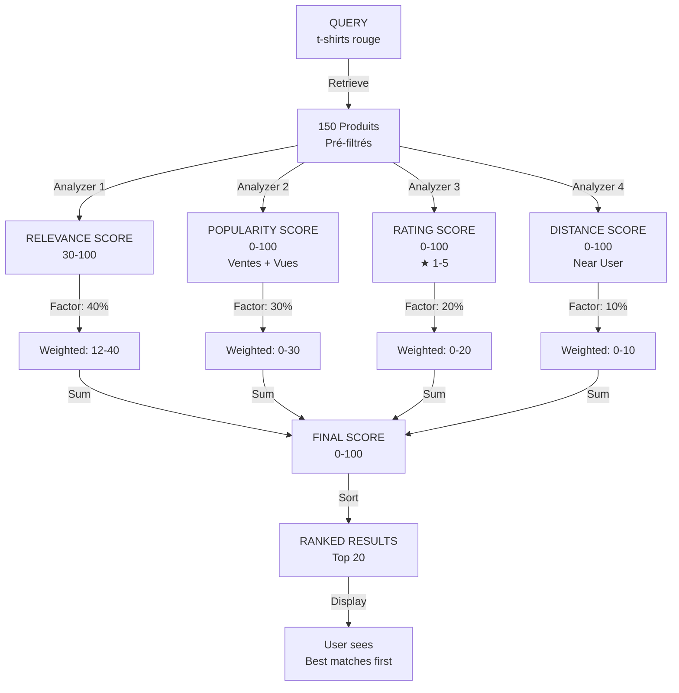
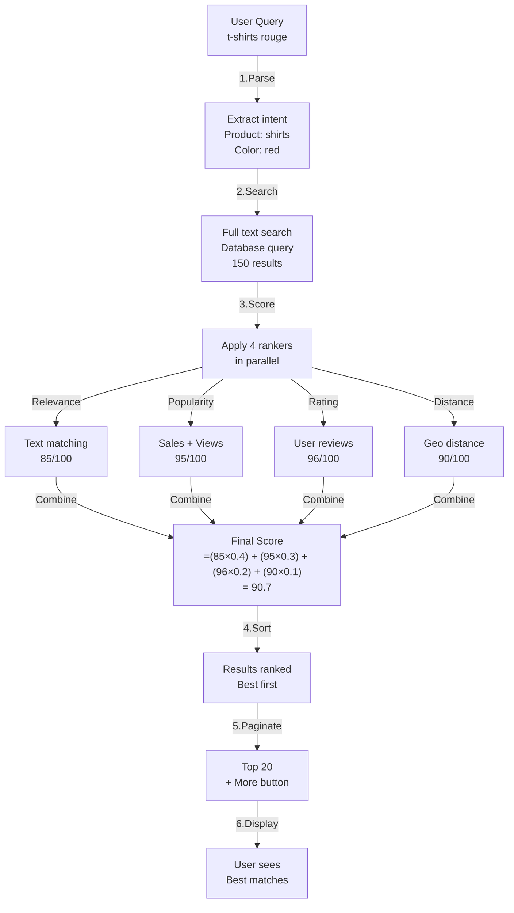

# 🔍 DIAGRAMME 27 - RECHERCHE AVEC RANKERS MULTIPLES

## Vue d'Ensemble

Après le workflow #18 (Recherche Géolocale), ce diagramme explique **comment le système trie les résultats** en combinant plusieurs critères.

---

## 🎯 RECHERCHE AVEC RANKERS MULTIPLES

```mermaid
sequenceDiagram
    participant Utilisateur
    participant Application
    participant SearchEngine as Moteur<br/>de Recherche
    participant Database as Base<br/>de Données
    participant RankingEngine as Moteur<br/>de Ranking
    participant ResultsDisplay as Affichage<br/>Résultats

    Utilisateur->>Application: Tape sa recherche
    Application->>SearchEngine: Envoie: "t-shirts rouge"
    
    SearchEngine->>Database: Récupère tous les produits
    Database->>SearchEngine: 500 t-shirts trouvés
    
    SearchEngine->>SearchEngine: Étape 1: RELEVANCE
    SearchEngine->>SearchEngine: Scanne description et tags
    SearchEngine->>SearchEngine: Mots-clés: "rouge", "t-shirt"
    SearchEngine->>SearchEngine: Donne score à chaque produit
    SearchEngine->>SearchEngine: "Parfait match" = 100
    SearchEngine->>SearchEngine: "Contient rouge" = 50
    SearchEngine->>SearchEngine: Filtre: garde score > 30
    SearchEngine->>SearchEngine: Réduit à 150 produits
    
    SearchEngine->>RankingEngine: Passe 150 produits
    
    RankingEngine->>RankingEngine: Étape 2: POPULARITY
    RankingEngine->>Database: Récupère nb ventes/vues
    RankingEngine->>RankingEngine: Produit A: 1000 ventes = score 95
    RankingEngine->>RankingEngine: Produit B: 100 ventes = score 50
    RankingEngine->>RankingEngine: Produit C: 10 ventes = score 20
    RankingEngine->>RankingEngine: Calcul: (ventes / max) × 100
    
    RankingEngine->>RankingEngine: Étape 3: RATING
    RankingEngine->>Database: Récupère avis moyens
    RankingEngine->>RankingEngine: Note 4.8★ = score 96
    RankingEngine->>RankingEngine: Note 3.0★ = score 60
    RankingEngine->>RankingEngine: Note 1.5★ = score 30
    RankingEngine->>RankingEngine: Calcul: (note / 5) × 100
    
    RankingEngine->>RankingEngine: Étape 4: DISTANCE
    RankingEngine->>Database: Récupère coordonnées magasin
    RankingEngine->>RankingEngine: Distance 1km = score 100
    RankingEngine->>RankingEngine: Distance 5km = score 60
    RankingEngine->>RankingEngine: Distance 20km = score 10
    RankingEngine->>RankingEngine: Calcul avec géolocalisation user
    
    RankingEngine->>RankingEngine: Étape 5: COMBINAISON
    RankingEngine->>RankingEngine: Formule pondérée:
    RankingEngine->>RankingEngine: Relevance: 40%
    RankingEngine->>RankingEngine: Popularity: 30%
    RankingEngine->>RankingEngine: Rating: 20%
    RankingEngine->>RankingEngine: Distance: 10%
    
    RankingEngine->>RankingEngine: Pour chaque produit:
    RankingEngine->>RankingEngine: Score final = (Rel×0.4) + (Pop×0.3) + (Rat×0.2) + (Dist×0.1)
    
    RankingEngine->>RankingEngine: Exemple Produit A:
    RankingEngine->>RankingEngine: Relevance: 85 × 0.4 = 34
    RankingEngine->>RankingEngine: Popularity: 95 × 0.3 = 28.5
    RankingEngine->>RankingEngine: Rating: 96 × 0.2 = 19.2
    RankingEngine->>RankingEngine: Distance: 90 × 0.1 = 9
    RankingEngine->>RankingEngine: TOTAL = 90.7
    
    RankingEngine->>RankingEngine: Exemple Produit B:
    RankingEngine->>RankingEngine: Relevance: 95 × 0.4 = 38
    RankingEngine->>RankingEngine: Popularity: 40 × 0.3 = 12
    RankingEngine->>RankingEngine: Rating: 70 × 0.2 = 14
    RankingEngine->>RankingEngine: Distance: 40 × 0.1 = 4
    RankingEngine->>RankingEngine: TOTAL = 68
    
    RankingEngine->>RankingEngine: Trie tous les produits par score
    RankingEngine->>RankingEngine: Produit A: 90.7 (1er)
    RankingEngine->>RankingEngine: Produit C: 82.3 (2ème)
    RankingEngine->>RankingEngine: Produit B: 68.0 (3ème)
    
    RankingEngine->>ResultsDisplay: Retourne top 20 triés
    
    ResultsDisplay->>Utilisateur: Affiche résultats
    ResultsDisplay->>Utilisateur: 1. Produit A (90.7)
    ResultsDisplay->>Utilisateur: 2. Produit C (82.3)
    ResultsDisplay->>Utilisateur: 3. Produit B (68.0)
    ResultsDisplay->>Utilisateur: ... (et plus)
    
    Utilisateur->>Application: Peut changer filtres
    Application->>Application: Option 1: Trier par PRIX
    Application->>Application: Option 2: Trier par RATING
    Application->>Application: Option 3: Trier par NEAREST
    
    alt Utilisateur clique "Trier par Rating"
        Application->>ResultsDisplay: Re-trie avec pondération:
        Application->>ResultsDisplay: Rating: 70%, Distance: 20%, Popularity: 10%
        ResultsDisplay->>Utilisateur: Affiche résultats re-triés
    end
```



---

## 📊 VUE DÉTAILLÉE: COMBINAISON DES RANKERS



---

## 🔢 TABLEAU DES SCORES - EXEMPLE

| Produit | Relevance | Popularity | Rating | Distance | **FINAL** |
|---------|-----------|------------|--------|----------|-----------|
| **A** | 85 (34) | 95 (28.5) | 96 (19.2) | 90 (9) | **90.7** ✅ |
| **C** | 75 (30) | 80 (24) | 88 (17.6) | 95 (9.5) | **81.1** |
| **D** | 90 (36) | 50 (15) | 75 (15) | 30 (3) | **69.0** |
| **B** | 95 (38) | 40 (12) | 70 (14) | 40 (4) | **68.0** |
| **E** | 60 (24) | 30 (9) | 65 (13) | 85 (8.5) | **54.5** |

**Résultats affichés: A > C > D > B > E**

---

## 🎛️ RANKERS DISPONIBLES

### **1. RELEVANCE RANKER** (40%)
```
Cherche les mots-clés dans:
- Nom du produit (poids 100%)
- Description (poids 50%)
- Tags (poids 30%)
- Catégorie (poids 20%)

Exemple: "rouge"
- Nom=produit "T-shirt rouge" → match 100
- Description=contient "rouge" → match 70
- Tags=["couleur: rouge"] → match 100
Score final: 90
```

### **2. POPULARITY RANKER** (30%)
```
Basé sur:
- Nombre de ventes (poids 60%)
- Nombre de vues (poids 30%)
- Nombre de favoris (poids 10%)

Formule:
Score = (ventes/max_ventes × 60) + (vues/max_vues × 30) + (favoris/max_favoris × 10)

Exemple:
1000 ventes → 60 points
5000 vues → 10 points
100 favoris → 2 points
Total: 72 points
```

### **3. RATING RANKER** (20%)
```
Basé sur avis clients:
- Moyenne des notes (1-5 étoiles)
- Nombre d'avis (si peu d'avis: confiance basse)

Formule:
Score = (note_moyenne/5 × 100) × confiance_factor

Exemple:
4.5★ sur 50 avis → 90 × 0.95 = 85.5
3.0★ sur 5 avis → 60 × 0.7 = 42
```

### **4. DISTANCE RANKER** (10%)
```
Basé sur géolocalisation:
- Distance du user au magasin
- Utilise PostGIS pour calcul précis

Formule:
Score = max(0, 100 - (distance_km × 5))

Exemple:
Magasin à 1km → 100 - 5 = 95
Magasin à 5km → 100 - 25 = 75
Magasin à 15km → 100 - 75 = 25
```

---

## 🎯 OPTIONS DE PERSONNALISATION

Utilisateur peut ajuster les poids:

### **Option 1: PERTINENCE D'ABORD**
- Relevance: **60%**
- Popularity: 20%
- Rating: 15%
- Distance: 5%

Cas d'usage: User cherche produit spécifique

### **Option 2: QUALITÉ D'ABORD**
- Relevance: 20%
- Popularity: 10%
- Rating: **60%**
- Distance: 10%

Cas d'usage: User veut les meilleures évaluations

### **Option 3: PROXIMITÉ D'ABORD**
- Relevance: 30%
- Popularity: 20%
- Rating: 20%
- Distance: **30%**

Cas d'usage: User veut retrait local rapidement

### **Option 4: POPULAIRE D'ABORD**
- Relevance: 20%
- Popularity: **50%**
- Rating: 20%
- Distance: 10%

Cas d'usage: User veut produits trending

---

## 🔄 PROCESSUS COMPLET



---

## ✅ AVANTAGES DE CETTE APPROCHE

| Avantage | Explication |
|----------|------------|
| **Pertinence** | Utilisateur voit d'abord ce qu'il cherche |
| **Qualité** | Produits bien évalués remontent |
| **Découverte** | Produits populaires deviennent visibles |
| **Localité** | Magasins proches apparaissent |
| **Flexibilité** | User peut changer les priorités |
| **Équité** | Petits vendeurs peuvent gagner par qualité |

---

## 🚀 OPTIMISATIONS POSSIBLES

1. **Learning from Clicks** - Si user clique plus sur certains résultats, ajuster les poids
2. **Personalization** - Weights différents par user preferences
3. **Time-based** - Produits récents un peu boostés
4. **Trending** - Produits en tendance cette semaine
5. **Seasonality** - Ajustements saisonniers
6. **A/B Testing** - Tester différentes pondérations

---

## 📝 INTÉGRATION DANS LES WORKFLOWS

Ce diagramme s'ajoute **APRÈS workflow #18** (Recherche Géolocale):

```
#16. Recherche sémantique Darija
#17. Recherche par image
#18. Recherche géolocale
👉 #27. RECHERCHE AVEC RANKERS MULTIPLES ← NEW
```

Il explique le **derrière-les-coulisses** de comment les résultats sont ordonnés dans les 3 workflows précédents.

