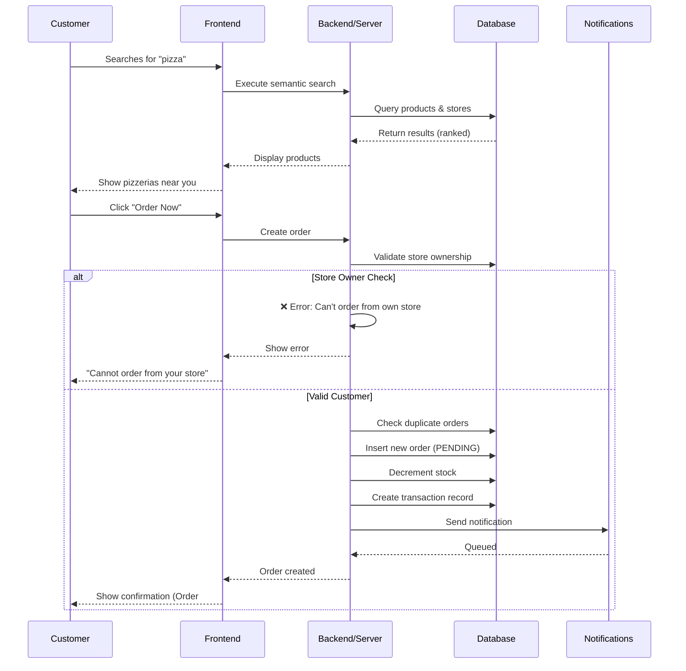
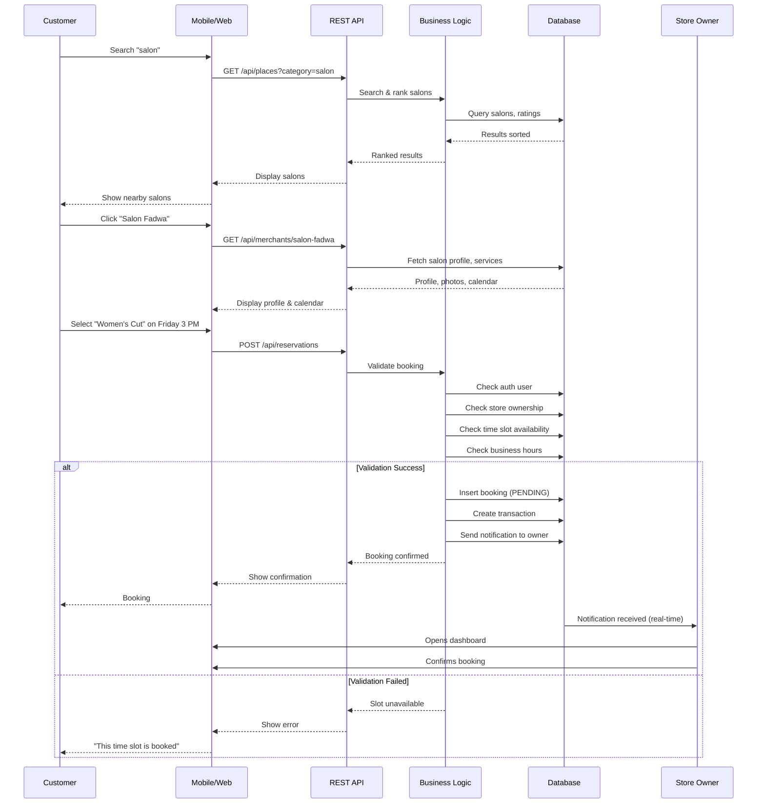
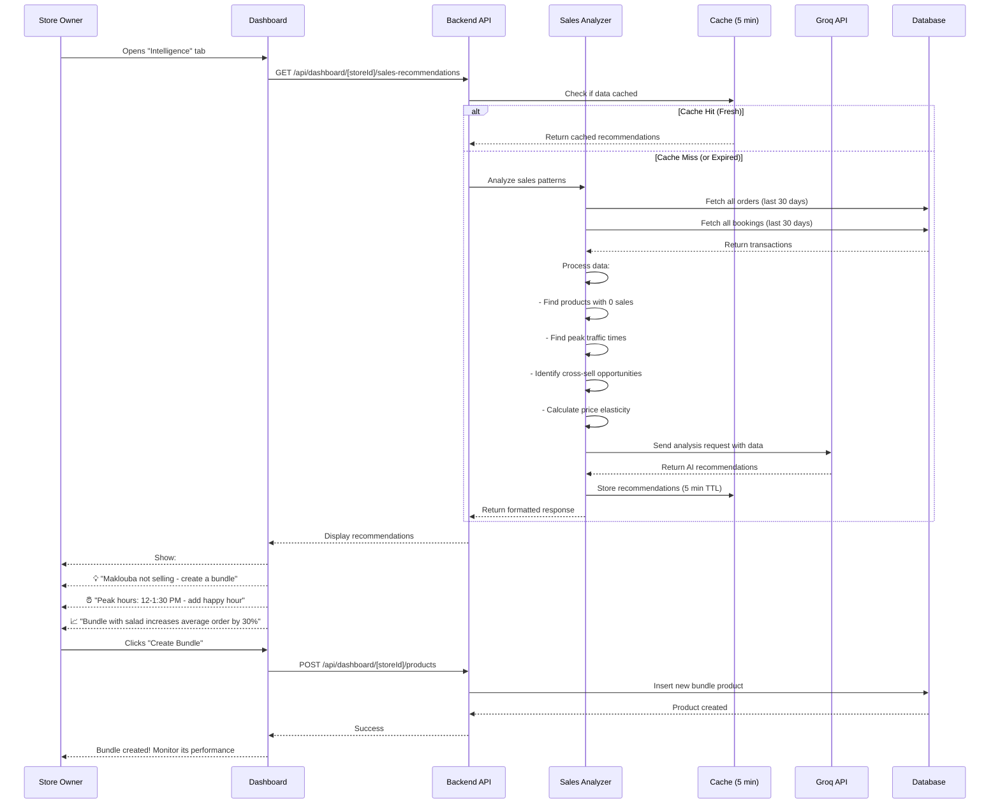
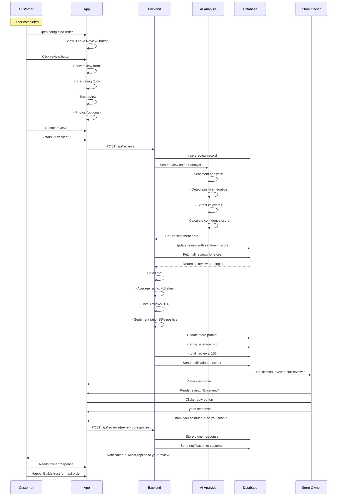
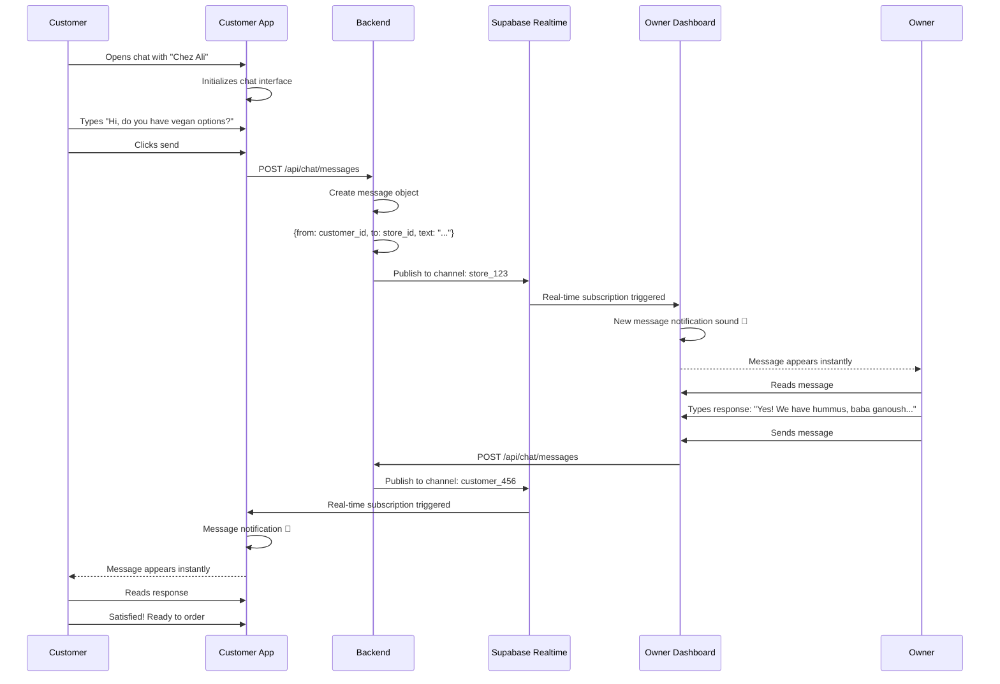
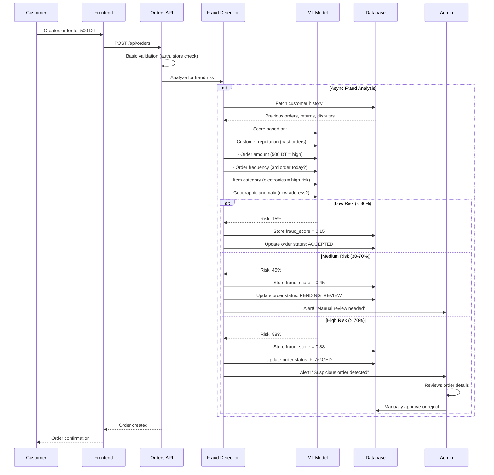

# Sequence Diagram Creation Guide for ro2ya.tn

## Quick Reference: Real Actors & Business Language

### Primary Actors
1. **Customer** - Person buying products or booking services
2. **Store Owner** (or Merchant) - Business owner managing store
3. **Admin** - Platform administrator
4. **System/Backend** - All backend services combined
5. **AI Agent** - AI recommendation and fraud detection
6. **Notification Service** - Sends alerts to users
7. **External Service** - Groq, OpenRouter, Cloudinary, etc.

### Activities in Business Language

| Technical | Business Language |
|-----------|------------------|
| POST /api/orders | Customer places order |
| Decrement stock | Product inventory updated |
| Fraud analysis | Order security check |
| Send notification | Store owner alerted |
| upsertItem | Store owner adds/updates product |
| createBooking | Customer reserves service |
| submitReview | Customer shares experience |
| Sentiment analysis | AI evaluates customer feedback |

---

## Sequence Diagram Templates

### Template 1: Simple Product Purchase



### Template 2: Service Booking with Calendar



### Template 3: AI-Powered Sales Recommendations



### Template 4: Review & Reputation System



### Template 5: Real-time Messaging



### Template 6: Fraud Detection



---

## Common Data Flow Patterns

### Pattern 1: CRUD Operation (Create)

```
Customer Input
    → Form Validation (Frontend)
    → API Endpoint Handler
    → Authentication Check
    → Authorization Check
    → Business Logic Validation
    → Database Insert
    → Cache Invalidation
    → Notification Trigger
    → Response to Client
    → Success Message
```

**Example**: Create product
```
Owner fills product form
    → Frontend validates price > 0
    → POST /api/dashboard/[storeId]/products
    → Verify owner auth
    → Verify store ownership
    → Check product name not duplicate
    → Insert into items table
    → Clear search cache
    → Trigger store update notification
    → Return product ID
    → Show "Product created" toast
```

### Pattern 2: Search & Ranking

```
User Query
    → Query Normalization (remove special chars, trim)
    → Language Detection (Darija, Arabic, French)
    → Translation/Lemmatization
    → Embedding Generation (OpenRouter API)
    → Vector Search (Supabase pgvector)
    → Keyword Search (Postgres FTS)
    → Merge Results
    → Ranking/Reranking
    → Personalization (user preferences)
    → Cache Result (10 min TTL)
    → Return Top N Results
```

### Pattern 3: Notification Dispatch

```
Event Triggered (order created)
    → Identify Recipients (store owner)
    → Build Notification Object
    → Insert into notifications table
    → Publish to Supabase Realtime
    → Real-time subscribers receive
    → Optional: Queue for email/SMS
    → Mark as delivered
```

### Pattern 4: Analytics Event

```
User Action (view product)
    → Capture event data
    → Enrich with context (user_id, timestamp, source)
    → Asynchronously insert to tracking table
    → Update aggregated metrics
    → Optional: Trigger recommendation update
```

---

## Writing Effective Sequence Descriptions

### Good Description ✅
```
Customer clicks "Order Now" button
Backend validates user is authenticated
Backend checks customer is not store owner
Backend checks for duplicate pending orders
Backend generates unique order number (ORD-XXXXXX-XXXX)
Backend creates order in database with status PENDING
Backend decrements product stock
Backend creates transaction record
Backend queues fraud analysis (async)
Backend queues notification to store owner
Backend returns order confirmation to customer
Customer sees order confirmation with tracking number
```

### Bad Description ❌
```
Order created
Database updated
Notification sent
Done
```

---

## Key Business Rules for Diagrams

1. **Can't order from own store**
   ```
   IF customer_id == store_owner_id
   THEN reject order with message "Cannot order from your own store"
   ```

2. **Prevent duplicate pending orders**
   ```
   IF (SELECT COUNT(*) FROM orders 
       WHERE customer_id=? AND store_id=? AND status='PENDING') > 0
   THEN reject order with message "You already have a pending order"
   ```

3. **Generate unique order/booking numbers**
   ```
   order_number = "ORD-" + last_6_digits(timestamp) + "-" + random_4_chars
   booking_number = "BK-" + last_6_digits(timestamp) + "-" + random_4_chars
   ```

4. **Stock must be positive**
   ```
   IF item_stock <= 0 THEN item_status = "UNAVAILABLE"
   ```

5. **Store must be ACTIVE to be visible**
   ```
   SELECT * FROM stores WHERE status = 'ACTIVE' ORDER BY rating DESC
   ```

6. **Booking must respect business hours**
   ```
   IF booking_time NOT IN business_hours THEN reject booking
   ```

7. **Only store owner can modify store**
   ```
   IF user_id != store.owner_id THEN reject with 403 Forbidden
   ```

---

## Actor Communication Methods

### Synchronous (Direct Response)
- REST API calls
- Database queries
- Validation checks
- Page rendering

### Asynchronous (No immediate response)
- Email notifications (via Resend)
- Fraud analysis (via QStash delay)
- SMS notifications
- Background jobs

### Real-time (Live updates)
- Supabase Realtime subscriptions
- WebSocket messages
- Live notifications in app
- Chat message delivery

---

## Metrics to Include in Diagrams

```
For Orders:
- Order Number (e.g., ORD-123456-ABCD)
- Total Amount (e.g., 49.99 DT)
- Status (PENDING → CONFIRMED → SHIPPED → DELIVERED)
- Fraud Score (0-100, where >70 = flagged)
- Timestamps (created_at, confirmed_at, delivered_at)

For Bookings:
- Booking Number (e.g., BK-234567-XYZQ)
- Service Duration (e.g., 1 hour)
- Slot Time (e.g., 2024-01-20 15:00)
- Capacity (e.g., 1/3 spots filled)
- Status (PENDING → CONFIRMED → COMPLETED)

For Reviews:
- Rating (1-5 stars)
- Sentiment Score (0-100, confidence)
- Keywords (e.g., "excellent", "fast", "friendly")
- Visibility (public on profile)

For Fraud:
- Risk Score (0-100)
- Flags (high amount, new address, etc.)
- Action (ACCEPT, PENDING_REVIEW, FLAGGED)
- Manual Review Needed (yes/no)
```

---

## Example: Complete Order Flow Diagram

```
PARTICIPANTS:
- Customer: Person buying
- Marketplace App: Frontend
- API Server: Backend
- Database: Supabase
- Store Owner: Seller
- Fraud Detector: AI System
- Notification System: Alert service

FLOW:
1. Customer searches "pizza"
   (Semantic search, multilingual, ranked by rating & distance)

2. Customer views "Chez Ali" pizzeria
   (Profile, photos, menu, reviews, ratings)

3. Customer adds 2 pizzas to cart
   (Using Zustand cart store)

4. Customer clicks "Order"
   (Submits: store_id, items[], quantities[], total_price)

5. API validates:
   - Is customer logged in? YES
   - Is customer the store owner? NO
   - Does a pending order already exist? NO
   - Is product in stock? YES (2 available)
   - Is store status ACTIVE? YES

6. API creates order:
   - Generates order_number: ORD-234567-ABCD
   - Inserts order with status: PENDING
   - Updates item stock: 2 → 0
   - Creates transaction record
   - Calls fraud analysis (async)

7. Fraud Detector analyzes:
   - Customer history: Good (10 orders, no disputes)
   - Amount: 49.99 DT (normal)
   - Frequency: 2nd order this week (normal)
   - Location: Saved address (low risk)
   - Risk Score: 12% (ACCEPT)

8. Notification Service sends:
   - To Store Owner: "New order #ORD-234567-ABCD"
   - To Customer: "Order confirmed"

9. Customer receives:
   - Order confirmation in app
   - Tracking number
   - Delivery time estimate (45-60 min)
   - Option to message seller

10. Store Owner receives:
    - Real-time notification (Supabase subscription)
    - Order details dashboard update
    - Can confirm/reject order
    - Can send message to customer

11. Real-time update:
    - Both parties see order status changes
    - "In Preparation" → "Ready for Pickup" → "In Transit" → "Delivered"

12. Delivery completed:
    - Customer receives notification
    - Customer can rate & review
    - Store rating updated
    - Future customers see review
```

This comprehensive guide provides everything needed to create effective, accurate sequence diagrams with proper business terminology and real actor roles for the ro2ya.tn marketplace platform.

