# 📊 Diagrammes SQL - Architecture Complète de la Base de Données

Documentation complète des diagrammes relationnels, normalisations et structures SQL pour la plateforme **ro2ya.tn**.

---

## 1. 🗄️ DIAGRAMME ER (ENTITÉ-RELATION) - VUE GÉNÉRALE

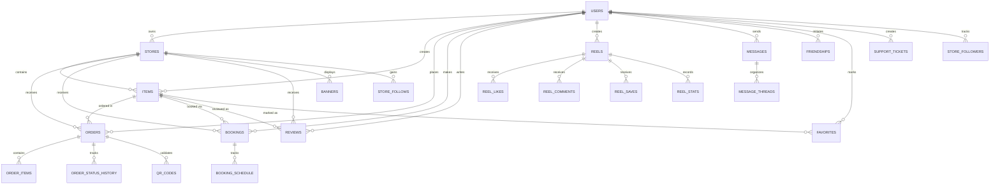

---

## 2. 👥 DIAGRAMME UTILISATEURS ET AUTHENTIFICATION

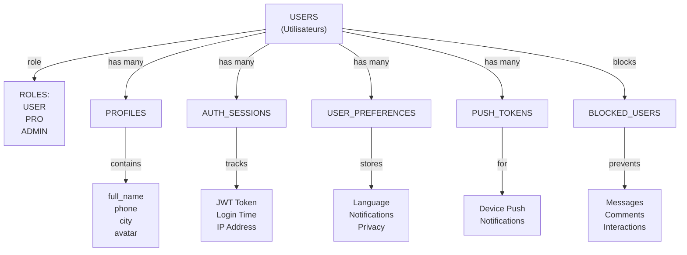

---

## 3. 🏪 DIAGRAMME MAGASINS (STORES)

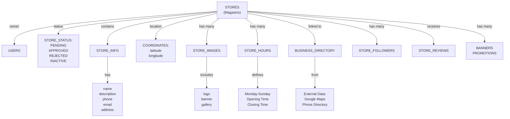

---

## 4. 📦 DIAGRAMME PRODUITS ET SERVICES (ITEMS)

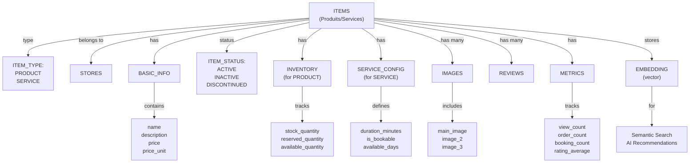

---

## 5. 🛒 DIAGRAMME COMMANDES (ORDERS) - DÉTAILLÉ

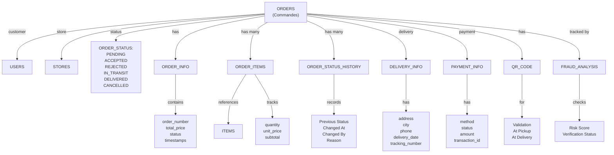

---

## 6. 📅 DIAGRAMME RÉSERVATIONS (BOOKINGS) - DÉTAILLÉ

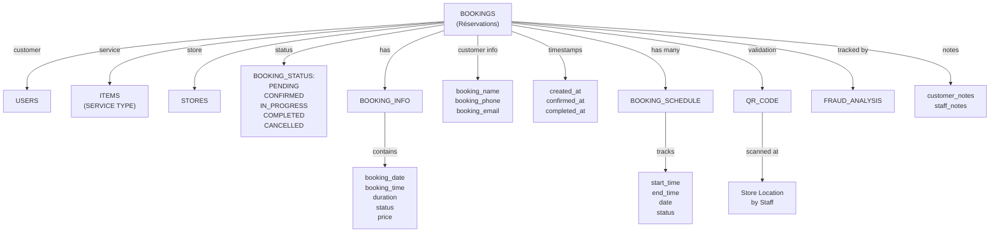

---

## 7. ⭐ DIAGRAMME AVIS ET ÉVALUATIONS (REVIEWS)

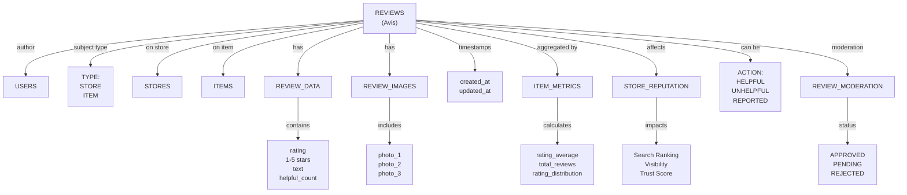

---

## 8. 📹 DIAGRAMME REELS (REELS ET STORIES) - DÉTAILLÉ

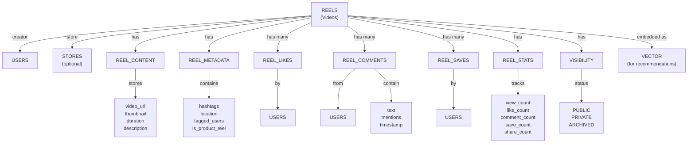

---

## 9. 💬 DIAGRAMME MESSAGERIE (MESSAGES ET CONVERSATIONS)

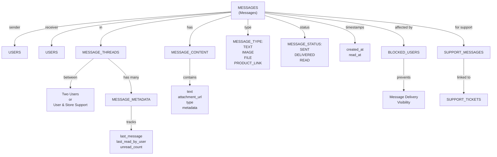

---

## 10. 💛 DIAGRAMME FAVORIS (FAVORITES)

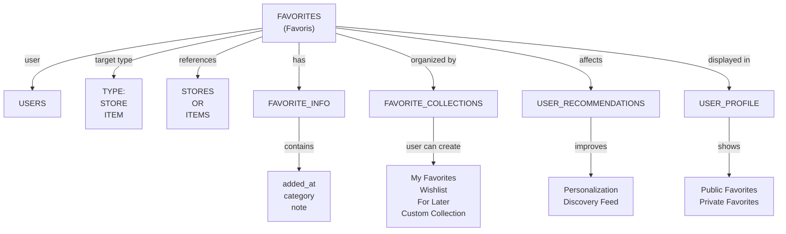

---

## 11. 👥 DIAGRAMME AMITIÉ ET INTERACTIONS SOCIALES (FRIENDSHIPS)

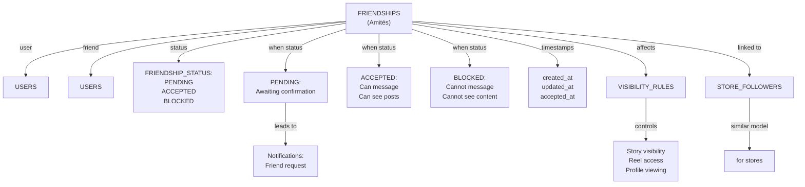

---

## 12. 🎫 DIAGRAMME SUPPORT TECHNIQUE (SUPPORT TICKETS)

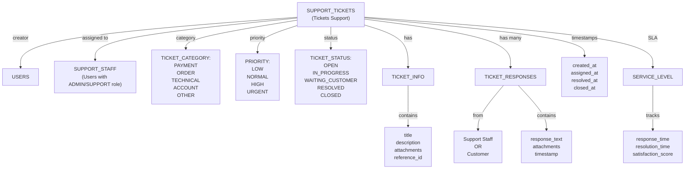

---

## 13. 📍 DIAGRAMME GÉOLOCALISATION (POSTGIS)

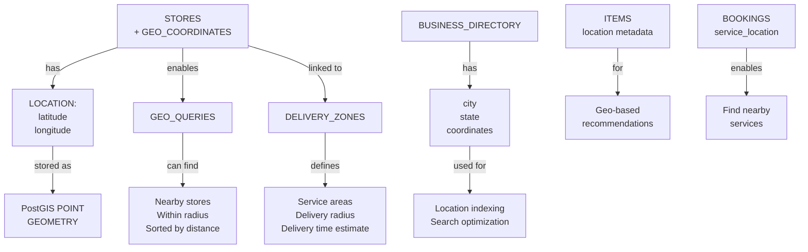

---

## 14. 🔍 DIAGRAMME RECHERCHE SÉMANTIQUE (EMBEDDINGS + VECTORS)

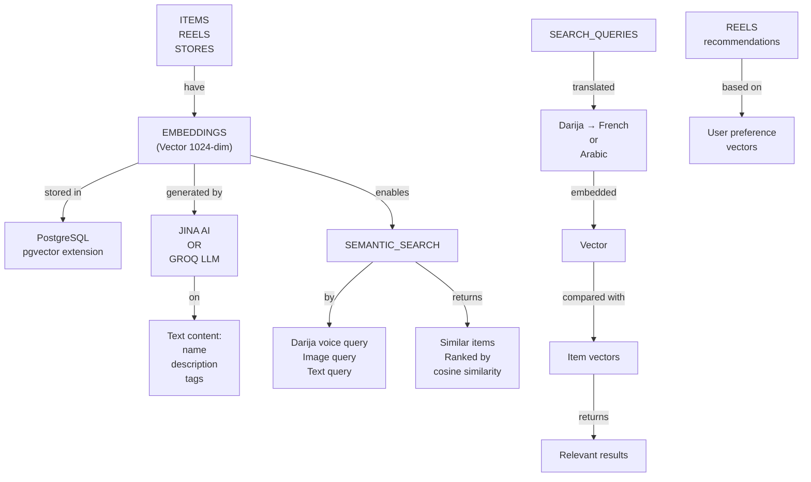

---

## 15. 💳 DIAGRAMME PAIEMENTS (PAYMENTS)

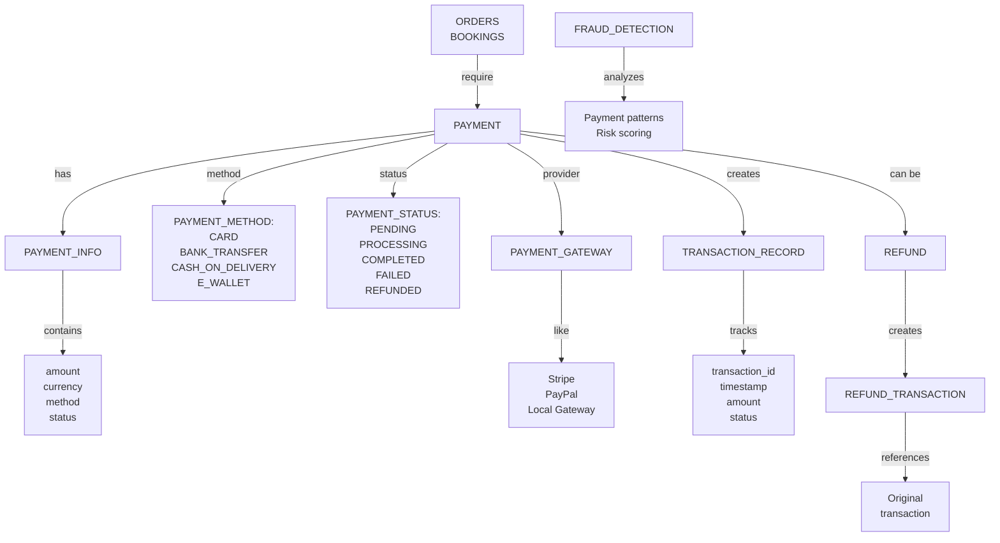

---

## 16. 🛡️ DIAGRAMME DÉTECTION DE FRAUDE (FRAUD ANALYSIS)

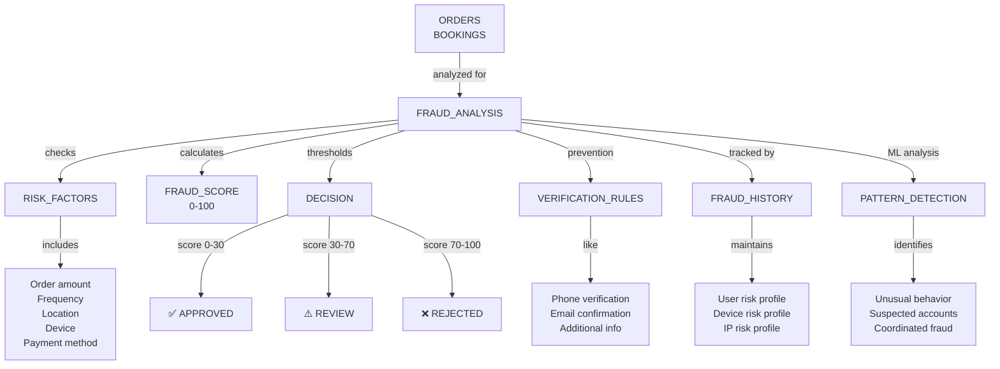

---

## 17. 🔐 DIAGRAMME SÉCURITÉ ET PERMISSIONS (RLS - Row Level Security)

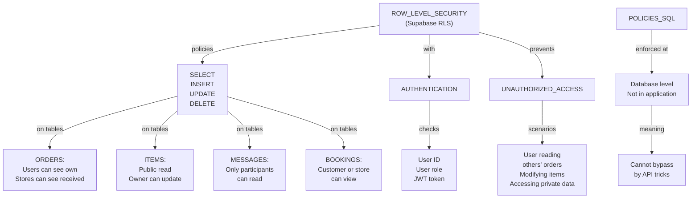

---

## 18. 📊 DIAGRAMME ANALYTICS ET STATISTIQUES

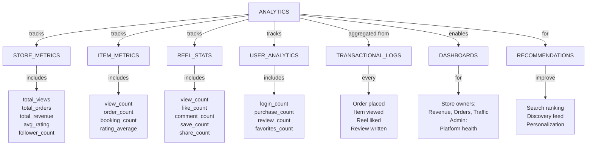

---

## 19. 📝 DIAGRAMME NORMALISATION - FORMES NORMALES

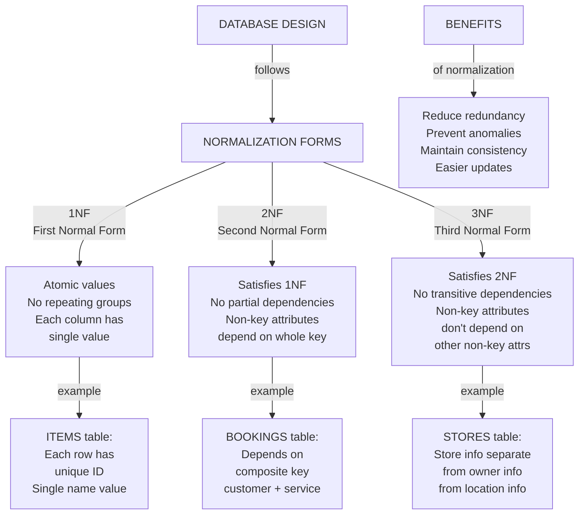

---

## 20. 🔄 DIAGRAMME FLUX DE DONNÉES TRANSACTIONNEL

```mermaid
graph TD
    A["CLIENT<br/>ACTION"] -->|CREATE| B["ORDER"]
    
    B -->|triggers| C["1. Insert ORDER"]
    C -->|generates| D["order_number"]
    
    B -->|creates| E["2. INSERT ORDER_ITEMS"]
    E -->|for each item| F["Quantity x Price"]
    
    B -->|initiates| G["3. PAYMENT_PROCESS"]
    G -->|calls| H["Payment Gateway"]
    H -->|returns| I["payment_status"]
    
    B -->|if payment OK| J["4. UPDATE STOCK"]
    J -->|decrement| K["available_quantity"]
    
    B -->|if payment OK| L["5. CREATE QR_CODE"]
    L -->|generates| M["unique validation code"]
    
    B -->|all steps| N["6. AUDIT_LOG"]
    N -->|records| O["who, what, when, why"]
    
    B -->|success| P["7. NOTIFY STORE"]
    P -->|sends| Q["Order notification"]
    
    B -->|all complete| R["8. NOTIFY CUSTOMER"]
    R -->|sends| S["Order confirmation<br/>+ QR code"]
    
    T["ROLLBACK<br/>ON ERROR"] -->|if any step fails| U["Transaction<br/>cancelled<br/>Stock restored<br/>Payment refunded"]
```

---

## 21. 🏗️ DIAGRAMME ARCHITECTURE DONNÉES - COUCHES

```mermaid
graph TD
    subgraph "Couche Application"
        A["Next.js Frontend<br/>Server Actions<br/>API Routes"]
    end
    
    subgraph "Couche Métier"
        B["Business Logic<br/>Validation<br/>Authorization<br/>Calculations"]
    end
    
    subgraph "Couche Données"
        C["PostgreSQL<br/>Supabase"]
        D["PostGIS<br/>pgvector<br/>RLS"]
    end
    
    subgraph "Couche Cache"
        E["Redis<br/>In-memory cache<br/>10-minute TTL"]
    end
    
    subgraph "Couche Stockage"
        F["Object Storage<br/>Images<br/>Videos<br/>Documents"]
    end
    
    subgraph "Services Externes"
        G["Payment Gateway<br/>AI/LLM<br/>Search Engine<br/>Email Service"]
    end
    
    A -->|queries| B
    B -->|CRUD| C
    C -->|enhanced by| D
    A -->|cache check| E
    E -->|miss| C
    A -->|upload| F
    A -->|integration| G
    
    H["Real-time Updates"] -->|via| I["Supabase Realtime<br/>Subscriptions"]
```

---

## 22. 🔗 DIAGRAMME INDEXATION ET PERFORMANCE

```mermaid
graph TD
    A["DATABASE INDEXES"] -->|on| B["FREQUENTLY QUERIED COLUMNS"]
    
    B -->|ITEM SEARCH| C["items.store_id<br/>items.name<br/>items.slug<br/>items.status"]
    
    B -->|ORDER LOOKUPS| D["orders.customer_id<br/>orders.store_id<br/>orders.status<br/>orders.created_at"]
    
    B -->|BOOKING QUERIES| E["bookings.service_id<br/>bookings.customer_id<br/>bookings.booking_date"]
    
    B -->|MESSAGE SEARCHES| F["messages.sender_id<br/>messages.receiver_id<br/>messages.created_at"]
    
    B -->|TIMESTAMP QUERIES| G["users.created_at<br/>orders.created_at<br/>reels.created_at"]
    
    H["SPECIAL INDEXES"] -->|geo location| I["PostGIS Index<br/>on coordinates<br/>for nearby queries"]
    
    H -->|semantic search| J["pgvector Index<br/>on embeddings<br/>HNSW algorithm"]
    
    H -->|full text search| K["Full-Text Index<br/>on descriptions<br/>for keyword search"]
    
    L["PERFORMANCE"] -->|benefits| M["Faster queries<br/>Reduced scan time<br/>Better user experience"]
```

---

## 23. 🧮 DIAGRAMME AGRÉGATIONS ET DENORMALISATION

```mermaid
graph TD
    A["DENORMALIZATION<br/>STRATEGY"] -->|for performance| B["CACHED AGGREGATES"]
    
    B -->|on ITEMS| C["Cached values:<br/>rating_average<br/>total_reviews<br/>view_count<br/>order_count"]
    
    C -->|updated by| D["TRIGGERS:<br/>After INSERT<br/>After UPDATE<br/>After DELETE<br/>on REVIEWS"]
    
    B -->|on STORES| E["Cached values:<br/>total_views<br/>total_orders<br/>total_revenue<br/>avg_rating"]
    
    E -->|updated by| F["TRIGGERS:<br/>After INSERT<br/>After UPDATE<br/>on ORDERS"]
    
    B -->|on REELS| G["Cached values:<br/>like_count<br/>comment_count<br/>save_count<br/>view_count"]
    
    G -->|updated by| H["TRIGGERS:<br/>After INSERT<br/>After DELETE<br/>on REEL_LIKES/COMMENTS"]
    
    I["RATIONALE"] -->|denormalization| J["Avoid expensive<br/>aggregate queries<br/>Constant read time<br/>Paid with writes"]
```

---

## 24. 📋 DIAGRAMME SCHÉMA COMPLET SIMPLIFIÉ

```mermaid
graph TD
    U["👤 USERS<br/>Tous les utilisateurs"]
    
    S["🏪 STORES<br/>Magasins créés par users"]
    I["📦 ITEMS<br/>Produits/Services<br/>dans les stores"]
    O["🛒 ORDERS<br/>Commandes de produits"]
    B["📅 BOOKINGS<br/>Réservations de services"]
    
    R["⭐ REVIEWS<br/>Avis sur stores/items"]
    F["❤️ FAVORITES<br/>Favoris des users"]
    
    RE["📹 REELS<br/>Videos publiées"]
    M["💬 MESSAGES<br/>Communications"]
    FR["👥 FRIENDSHIPS<br/>Amités entre users"]
    
    T["🎫 TICKETS<br/>Support technique"]
    
    U -->|owns| S
    U -->|creates| I
    U -->|places| O
    U -->|makes| B
    U -->|writes| R
    U -->|marks| F
    U -->|creates| RE
    U -->|sends| M
    U -->|has| FR
    U -->|creates| T
    
    S -->|contains| I
    S -->|receives| O
    S -->|receives| B
    S -->|receives| R
    
    I -->|ordered in| O
    I -->|booked via| B
    I -->|reviewed as| R
    I -->|marked as| F
    
    O -->|likes/comments on| RE
    B -->|likes/comments on| RE
    
    M -->|between| U
    FR -->|connects| U
```

---

## 25. 🔐 DIAGRAMME SÉCURITÉ - AUTHENTIFICATION ET AUTORISATIONS

```mermaid
graph TD
    A["LOGIN"] -->|credentials| B["Supabase Auth"]
    B -->|validates| C["Email + Password"]
    B -->|generates| D["JWT Token"]
    
    D -->|contains| E["Claims:<br/>user_id<br/>role<br/>email<br/>exp"]
    
    E -->|sent in| F["HTTP Header<br/>Authorization: Bearer JWT"]
    
    F -->|on each request| G["API/Server Action"]
    G -->|verifies| H["JWT Signature<br/>Expiration<br/>User exists"]
    
    H -->|extracts| I["User Context:<br/>user_id<br/>role"]
    
    I -->|used in| J["RLS Policies"]
    J -->|at database| K["SELECT: Only owner<br/>UPDATE: Only owner<br/>DELETE: Only owner"]
    
    K -->|ensures| L["Row-level security<br/>User can't bypass<br/>Column encryption"]
    
    M["ROLES"] -->|define permissions| N["USER: Basic access<br/>PRO: Store access<br/>ADMIN: Full access"]
```

---

## 26. 📊 COMPARAISON DES TABLES - TAILLE ET CROISSANCE

```mermaid
graph TD
    A["ESTIMATED<br/>TABLE SIZES"] -->|small tables| B["AUTH_* tables<br/>~ 100s rows"]
    
    A -->|medium tables| C["STORES<br/>BANNERS<br/>SUPPORT_TICKETS<br/>~ 1000s rows"]
    
    A -->|large tables| D["ITEMS<br/>ORDERS<br/>MESSAGES<br/>~ 10000s rows"]
    
    A -->|very large| E["REELS<br/>REEL_COMMENTS<br/>REEL_LIKES<br/>~ 100000s rows"]
    
    F["GROWTH RATE"] -->|daily| G["STORES: +10-100"]
    F -->|daily| H["ITEMS: +100-1000"]
    F -->|daily| I["ORDERS: +1000-10000"]
    F -->|daily| J["REELS: +100-1000"]
    
    K["STORAGE"] -->|total estimate| L["Current: ~50GB<br/>Year 1: ~200GB<br/>Year 2: ~500GB"]
    
    M["ARCHIVAL<br/>STRATEGY"] -->|for old data| N["Archive completed<br/>orders after 2 years<br/>Keep for tax/audit"]
```

---

# 📈 Résumé des Diagrammes SQL

| # | Diagramme | Type | Cas d'Usage |
|---|-----------|------|-----------|
| 1 | ER General | Conceptuel | Vue d'ensemble des entités |
| 2 | Utilisateurs & Auth | Logique | Gestion des utilisateurs |
| 3 | Magasins | Logique | Gestion des stores |
| 4 | Produits/Services | Logique | Gestion de l'inventaire |
| 5 | Commandes | Détaillé | Processus e-commerce |
| 6 | Réservations | Détaillé | Processus de booking |
| 7 | Avis | Logique | Système d'évaluations |
| 8 | Reels & Stories | Détaillé | Contenu social |
| 9 | Messagerie | Logique | Communication |
| 10 | Favoris | Logique | Preferences utilisateurs |
| 11 | Friendships | Logique | Relations sociales |
| 12 | Support Tickets | Détaillé | Service client |
| 13 | Géolocalisation | Spatial | PostGIS queries |
| 14 | Recherche Sémantique | Vecteur | Embeddings & AI |
| 15 | Paiements | Transactionnel | Integration |
| 16 | Fraude | Analytique | ML & scoring |
| 17 | Sécurité RLS | Politique | Access control |
| 18 | Analytics | Analytique | Métriques |
| 19 | Normalisation | Conception | Design principles |
| 20 | Flux Transactionnel | Processus | Transactions ACID |
| 21 | Architecture Couches | Infra | Stack technique |
| 22 | Indexation | Performance | Optimization |
| 23 | Denormalisation | Performance | Caching |
| 24 | Schéma Simplifié | Référence | Vue globale |
| 25 | Sécurité Auth | Protection | Security flow |
| 26 | Taille & Croissance | Monitoring | Capacity planning |

---

**Document généré le**: 17 Mai 2026  
**Diagrammes SQL**: 26 diagrammes  
**Format**: Mermaid diagrams + descriptions  
**Couverture complète**: Structure, Relations, Sécurité, Performance, Analytique
