# 📋 DOCUMENTATION UML COMPLÈTE - PLATEFORME RO2YA

**Dernière mise à jour**: Mai 2026  
**Version**: 2.0 - Réanalyse globale  
**Couverture**: Web Mobile + Web Desktop + Admin

---

## TABLE DES MATIÈRES

1. [Introduction & Architecture Générale](#introduction)
2. [Diagrammes de Cas d'Utilisation Globaux](#use-cases-globaux)
3. [Diagrammes de Classes](#classes)
4. [Fonctionnalités Détaillées](#features)
5. [Diagrammes de Déploiement](#deployment)
6. [Matrice de Couverture](#coverage)

---

<a name="introduction"></a>

# I. INTRODUCTION & ARCHITECTURE GÉNÉRALE

## 1.1 Vue d'Ensemble

**Ro2ya** est une plateforme **multi-acteurs** de commerce électronique et services qui relie :
- **👤 Clients** : Acheteurs/Utilisateurs finaux
- **🏪 Marchands** : Vendeurs de produits/services (pas limité aux restaurants)
- **⚙️ Administrateurs** : Gestion de la plateforme

### Applications
- 📱 **Web Mobile** : App responsive mobile-first
- 💻 **Web Desktop** : Accès complet navigateur
- 🛠️ **Merchant Dashboard** : Gestion boutique (Web uniquement)
- ⚙️ **Admin Panel** : Modération/configuration (Web uniquement)

## 1.2 Stack Technique

```
Frontend:     Next.js 15, React 18, TailwindCSS, Radix UI
Mobile:       React Native (mentionné)
Backend:      Next.js API Routes, Supabase Functions
Database:     PostgreSQL 15, PostGIS, Vector Extensions
Cache:        Redis
External AI:  Groq LLM, OpenRouter Embeddings
Media:        Cloudinary
Payment:      Stripe
Jobs:         QStash (Upstash)
Auth:         Supabase Auth
```

## 1.3 Architecture de Haut Niveau

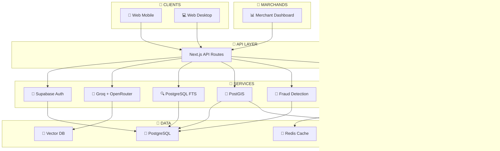

---

<a name="use-cases-globaux"></a>

# II. DIAGRAMMES DE CAS D'UTILISATION GLOBAUX

## 2.1 Vue Générale - Acteurs & Système

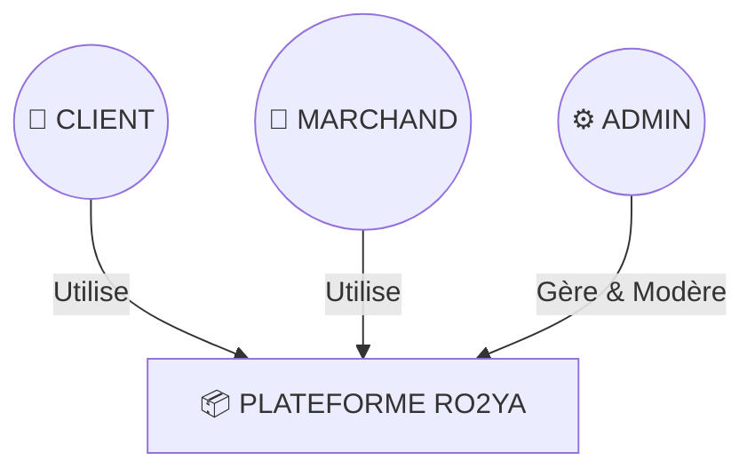

## 2.2 Cas d'Utilisation - CLIENT

```mermaid
graph LR
    CLIENT((👤 CLIENT))
    
    subgraph "AUTHENTIFICATION"
        A1["📝 S'inscrire"]
        A2["🔑 Se connecter"]
        A3["🔄 Réinitialiser MDP"]
        A4["👤 Gérer Profil"]
    end
    
    subgraph "RECHERCHE & DÉCOUVERTE"
        B1["🔍 Recherche Textuelle"]
        B2["🖼️ Recherche Visuelle"]
        B3["📍 Recherche Géo"]
        B4["🌍 Découvrir Tendances"]
        B5["❤️ Gérer Favoris"]
    end
    
    subgraph "SHOPPING & COMMANDES"
        C1["🛍️ Consulter Menu"]
        C2["🛒 Gérer Panier"]
        C3["💳 Passer Commande"]
        C4["📦 Suivre Commande"]
        C5["✅ Récupérer/Recevoir"]
    end
    
    subgraph "RÉSERVATIONS"
        D1["📅 Consulter Disponibilités"]
        D2["➕ Créer Réservation"]
        D3["✏️ Modifier/Annuler"]
    end
    
    subgraph "COMMUNAUTÉ"
        E1["⭐ Publier Avis"]
        E2["💬 Commenter Avis"]
        E3["❤️ Liker Reels"]
        E4["📤 Partager Contenu"]
        E5["👥 Suivre Marchands"]
        E6["💌 Messagerie Privée"]
    end
    
    subgraph "CONTENU SOCIAL"
        F1["🎬 Regarder Reels"]
        F2["📱 Voir Stories"]
        F3["💾 Sauvegarder"]
    end
    
    subgraph "NOTIFICATIONS & PROFILE"
        G1["🔔 Notifications"]
        G2["📊 Mon Historique"]
        G3["🎯 Recommandations IA"]
    end
    
    CLIENT --> A1
    CLIENT --> A2
    CLIENT --> A3
    CLIENT --> A4
    CLIENT --> B1
    CLIENT --> B2
    CLIENT --> B3
    CLIENT --> B4
    CLIENT --> B5
    CLIENT --> C1
    CLIENT --> C2
    CLIENT --> C3
    CLIENT --> C4
    CLIENT --> C5
    CLIENT --> D1
    CLIENT --> D2
    CLIENT --> D3
    CLIENT --> E1
    CLIENT --> E2
    CLIENT --> E3
    CLIENT --> E4
    CLIENT --> E5
    CLIENT --> E6
    CLIENT --> F1
    CLIENT --> F2
    CLIENT --> F3
    CLIENT --> G1
    CLIENT --> G2
    CLIENT --> G3
```

## 2.3 Cas d'Utilisation - MARCHAND

```mermaid
graph LR
    MERCHANT((🏪 MARCHAND))
    
    subgraph "AUTHENTIFICATION & PROFIL"
        A1["📝 S'inscrire Marchand"]
        A2["✅ Activer Boutique"]
        A3["📸 Gérer Profil"]
        A4["⏱️ Gérer Horaires"]
        A5["📍 Localisation"]
    end
    
    subgraph "GESTION PRODUITS"
        B1["➕ Créer Produit"]
        B2["✏️ Modifier Produit"]
        B3["🗑️ Supprimer Produit"]
        B4["💰 Gérer Prix & Stocks"]
        B5["📸 Gérer Images"]
        B6["🤖 IA Darija (création)"]
    end
    
    subgraph "GESTION PROMOTIONS"
        C1["🏷️ Créer Promotion"]
        C2["📅 Gérer Plats du Jour"]
        C3["⏰ Planifier Offres"]
        C4["📊 Analyser ROI"]
    end
    
    subgraph "GESTION COMMANDES"
        D1["📬 Voir Commandes"]
        D2["✅ Confirmer/Valider"]
        D3["❌ Rejeter"]
        D4["📦 Voir Statut"]
        D5["🚨 Alertes Fraude"]
        D6["💳 Voir Paiements"]
    end
    
    subgraph "RÉSERVATIONS"
        E1["📅 Voir Réservations"]
        E2["✅ Confirmer Résa"]
        E3["❌ Rejeter Résa"]
        E4["⏰ Gérer Créneaux"]
    end
    
    subgraph "ENGAGEMENT CLIENT"
        F1["💬 Chat avec Clients"]
        F2["🎥 Créer Reel"]
        F3["📱 Créer Story"]
        F4["📊 Analytics Contenu"]
        F5["🔔 Notifications Clients"]
    end
    
    subgraph "DASHBOARD & ANALYTICS"
        G1["📊 Dashboard Principal"]
        G2["📈 Graphiques Ventes"]
        G3["👁️ Vues Profil"]
        G4["💵 Revenus & Paiements"]
        G5["⭐ Avis & Ratings"]
        G6["🏆 Badges"]
    end
    
    subgraph "GESTION COMPTE"
        H1["💳 Plan Abonnement"]
        H2["⬆️ Upgrade/Downgrade"]
        H3["🔐 Sécurité Compte"]
        H4["🗑️ Supprimer Compte"]
    end
    
    MERCHANT --> A1
    MERCHANT --> A2
    MERCHANT --> A3
    MERCHANT --> A4
    MERCHANT --> A5
    MERCHANT --> B1
    MERCHANT --> B2
    MERCHANT --> B3
    MERCHANT --> B4
    MERCHANT --> B5
    MERCHANT --> B6
    MERCHANT --> C1
    MERCHANT --> C2
    MERCHANT --> C3
    MERCHANT --> C4
    MERCHANT --> D1
    MERCHANT --> D2
    MERCHANT --> D3
    MERCHANT --> D4
    MERCHANT --> D5
    MERCHANT --> D6
    MERCHANT --> E1
    MERCHANT --> E2
    MERCHANT --> E3
    MERCHANT --> E4
    MERCHANT --> F1
    MERCHANT --> F2
    MERCHANT --> F3
    MERCHANT --> F4
    MERCHANT --> F5
    MERCHANT --> G1
    MERCHANT --> G2
    MERCHANT --> G3
    MERCHANT --> G4
    MERCHANT --> G5
    MERCHANT --> G6
    MERCHANT --> H1
    MERCHANT --> H2
    MERCHANT --> H3
    MERCHANT --> H4
```

## 2.4 Cas d'Utilisation - ADMIN

```mermaid
graph LR
    ADMIN((⚙️ ADMIN))
    
    subgraph "MODÉRATION MARCHANDS"
        A1["✅ Valider Inscriptions"]
        A2["📋 Approuver/Rejeter"]
        A3["⚠️ Suspendre Compte"]
        A4["🔍 Vérifier Documents"]
    end
    
    subgraph "GESTION UTILISATEURS"
        B1["👥 Lister Clients"]
        B2["👥 Lister Marchands"]
        B3["🔍 Rechercher"]
        B4["🚫 Ban/Débloquer"]
        B5["📊 Stats Utilisateurs"]
    end
    
    subgraph "MODÉRATION CONTENU"
        C1["📦 Modérer Produits"]
        C2["⭐ Modérer Avis"]
        C3["🎬 Modérer Reels"]
        C4["📱 Modérer Stories"]
        C5["🗑️ Supprimer Contenu"]
    end
    
    subgraph "TRANSACTIONS & FRAUDE"
        D1["💳 Voir Transactions"]
        D2["💰 Revenus Plateforme"]
        D3["📊 Rapports Financiers"]
        D4["🚨 Détecter Fraudes"]
        D5["❌ Refunds/Chargebacks"]
    end
    
    subgraph "CONFIGURATION"
        E1["⚙️ Plans Abonnement"]
        E2["🎯 Paramètres"]
        E3["💬 Notifications"]
        E4["📱 Gestion Catégories"]
        E5["🔒 Paramètres Sécurité"]
    end
    
    subgraph "SUPPORT & TICKETS"
        F1["🎫 Support Tickets"]
        F2["💬 Chat Support"]
        F3["📧 Notifications"]
    end
    
    ADMIN --> A1
    ADMIN --> A2
    ADMIN --> A3
    ADMIN --> A4
    ADMIN --> B1
    ADMIN --> B2
    ADMIN --> B3
    ADMIN --> B4
    ADMIN --> B5
    ADMIN --> C1
    ADMIN --> C2
    ADMIN --> C3
    ADMIN --> C4
    ADMIN --> C5
    ADMIN --> D1
    ADMIN --> D2
    ADMIN --> D3
    ADMIN --> D4
    ADMIN --> D5
    ADMIN --> E1
    ADMIN --> E2
    ADMIN --> E3
    ADMIN --> E4
    ADMIN --> E5
    ADMIN --> F1
    ADMIN --> F2
    ADMIN --> F3
```

---

<a name="classes"></a>

# III. DIAGRAMMES DE CLASSES

## 3.1 Modèle d'Entités Simplifié

```mermaid
classDiagram
    class User {
        id: UUID
        email: string
        username: string
        password_hash: string
        full_name: string
        avatar_url: string
        role: enum[client, merchant, admin]
        phone: string
        status: enum[active, suspended, deleted]
        created_at: timestamp
        updated_at: timestamp
        +authenticate()
        +updateProfile()
        +getRole()
        +getPermissions()
    }
    
    class MerchantProfile {
        id: UUID
        user_id: UUID
        business_name: string
        description: string
        logo_url: string
        cover_image_url: string
        location: Point
        opening_hours: JSON
        phone: string
        email: string
        status: enum[pending, approved, suspended, closed]
        subscription_plan: enum[free, pro, business]
        created_at: timestamp
        +updateProfile()
        +getAnalytics()
        +getProductCount()
        +getTotalRevenue()
    }
    
    class Product {
        id: UUID
        merchant_id: UUID
        name: string
        description: string
        category: string
        price: decimal
        original_price: decimal
        stock: integer
        images: string[]
        rating: float
        review_count: integer
        is_active: boolean
        created_at: timestamp
        updated_at: timestamp
        +updatePrice()
        +updateStock()
        +getRating()
        +getAvailability()
    }
    
    class Order {
        id: UUID
        client_id: UUID
        merchant_id: UUID
        total_price: decimal
        tax_amount: decimal
        delivery_fee: decimal
        status: enum[pending, confirmed, preparing, ready, shipped, delivered, cancelled]
        payment_method: string
        delivery_address: string
        created_at: timestamp
        delivered_at: timestamp
        +confirm()
        +cancel()
        +trackStatus()
        +updateStatus()
    }
    
    class OrderItem {
        id: UUID
        order_id: UUID
        product_id: UUID
        quantity: integer
        unit_price: decimal
        subtotal: decimal
    }
    
    class Reservation {
        id: UUID
        client_id: UUID
        merchant_id: UUID
        service_type: string
        date_time: timestamp
        guests: integer
        special_requests: string
        status: enum[pending, confirmed, completed, cancelled]
        created_at: timestamp
        +confirm()
        +cancel()
        +complete()
    }
    
    class Review {
        id: UUID
        client_id: UUID
        merchant_id: UUID
        order_id: UUID
        rating: integer
        comment: string
        images: string[]
        verified_purchase: boolean
        helpful_count: integer
        created_at: timestamp
        +updateReview()
        +deleteReview()
    }
    
    class Conversation {
        id: UUID
        client_id: UUID
        merchant_id: UUID
        last_message_at: timestamp
        is_archived: boolean
        created_at: timestamp
    }
    
    class Message {
        id: UUID
        conversation_id: UUID
        sender_id: UUID
        content: string
        media_urls: string[]
        is_read: boolean
        created_at: timestamp
    }
    
    class Reel {
        id: UUID
        merchant_id: UUID
        video_url: string
        thumbnail_url: string
        title: string
        description: string
        duration: integer
        likes_count: integer
        views_count: integer
        shares_count: integer
        comments_count: integer
        status: enum[draft, published, archived]
        created_at: timestamp
        +addLike()
        +removeLike()
        +addView()
    }
    
    class Story {
        id: UUID
        merchant_id: UUID
        image_url: string
        duration: integer
        views_count: integer
        created_at: timestamp
        expires_at: timestamp
        +incrementView()
        +isExpired()
    }
    
    class Promotion {
        id: UUID
        merchant_id: UUID
        name: string
        description: string
        discount_type: enum[percentage, fixed]
        discount_value: decimal
        start_date: timestamp
        end_date: timestamp
        applicable_products: UUID[]
        is_active: boolean
        created_at: timestamp
    }
    
    class Subscription {
        id: UUID
        merchant_id: UUID
        plan_name: enum[free, pro, business]
        price: decimal
        start_date: timestamp
        end_date: timestamp
        renewal_date: timestamp
        status: enum[active, cancelled, expired]
        auto_renew: boolean
        +upgrade()
        +downgrade()
        +cancel()
        +renew()
    }
    
    class Transaction {
        id: UUID
        order_id: UUID
        subscription_id: UUID
        amount: decimal
        currency: string
        payment_method: string
        transaction_id: string
        status: enum[pending, completed, failed, refunded]
        created_at: timestamp
    }
    
    class FraudAlert {
        id: UUID
        order_id: UUID
        client_id: UUID
        merchant_id: UUID
        risk_score: integer
        signals: string[]
        status: enum[pending, approved, rejected, manual_review]
        admin_notes: string
        created_at: timestamp
    }
    
    class Category {
        id: UUID
        name: string
        slug: string
        icon_url: string
        description: string
        parent_category_id: UUID
        is_active: boolean
    }
    
    User "1" --> "*" MerchantProfile
    User "1" --> "*" Order
    User "1" --> "*" Reservation
    User "1" --> "*" Review
    User "1" --> "*" Conversation
    User "1" --> "*" Message
    User "1" --> "*" Reel
    
    MerchantProfile "1" --> "*" Product
    MerchantProfile "1" --> "*" Reel
    MerchantProfile "1" --> "*" Story
    MerchantProfile "1" --> "*" Promotion
    MerchantProfile "1" --> "*" Subscription
    
    Product "1" --> "*" OrderItem
    Order "1" --> "*" OrderItem
    Order "1" --> "*" Review
    Order "1" --> "*" Transaction
    Order "1" --> "*" FraudAlert
    
    Conversation "1" --> "*" Message
    Reservation "1" --> "*" Message
    
    Category "1" --> "*" Product
```

---

<a name="features"></a>

# IV. FONCTIONNALITÉS DÉTAILLÉES

## 4.1 AUTHENTIFICATION & GESTION UTILISATEURS

### Cas d'Utilisation

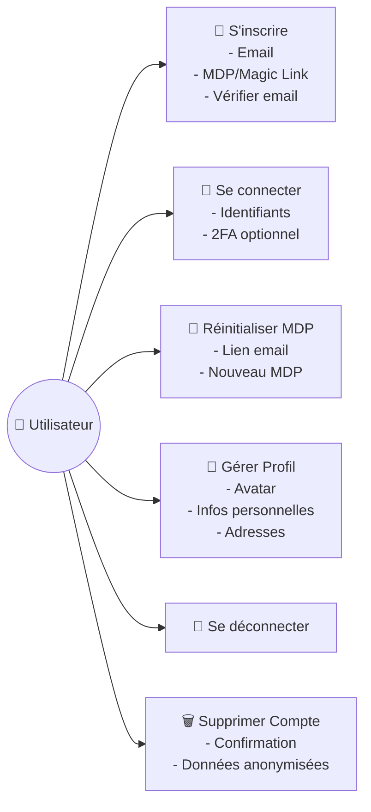

### Diagramme de Séquence : Inscription

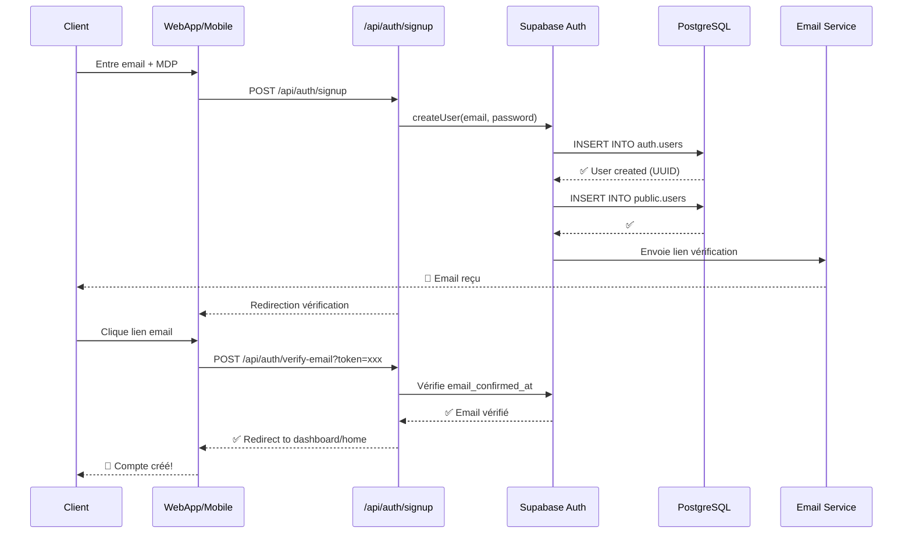

### Diagramme de Séquence : Connexion

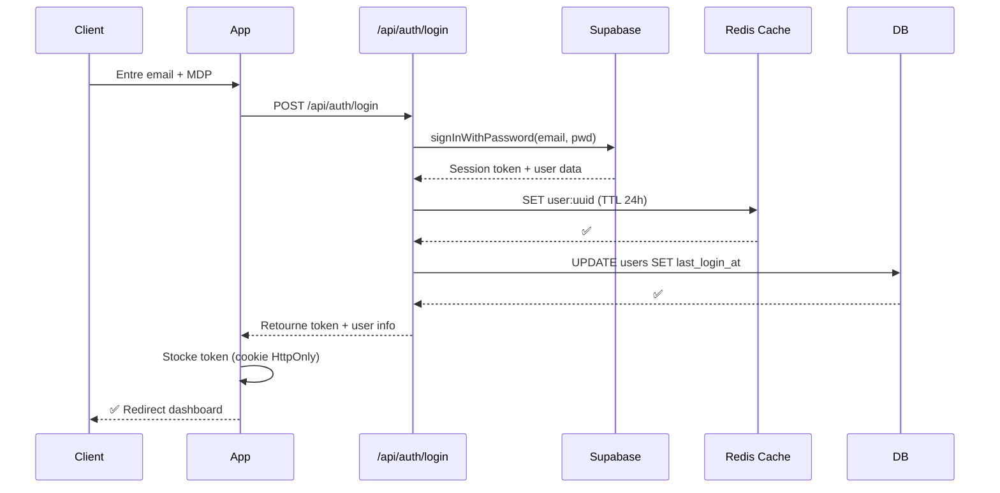

---

## 4.2 GESTION PROFIL & FAVORIS

### Cas d'Utilisation

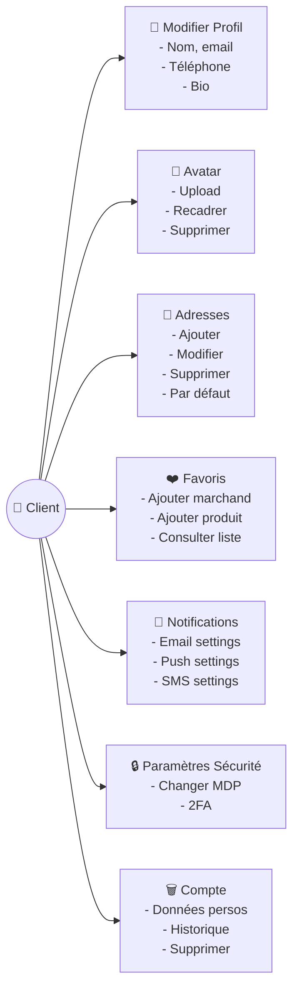

### Diagramme de Séquence : Ajout aux Favoris

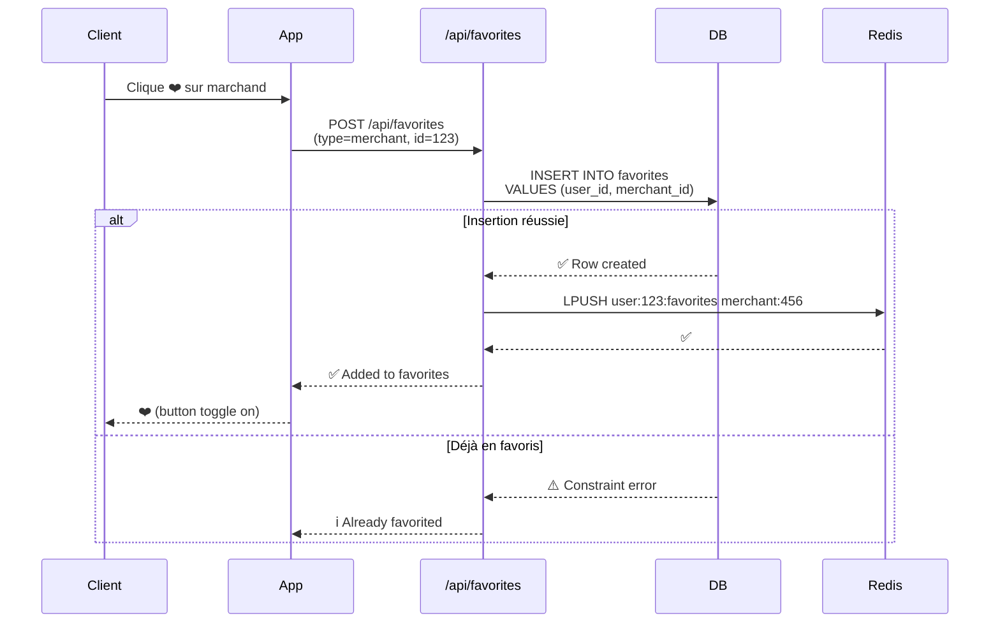

---

## 4.3 RECHERCHE & DÉCOUVERTE

### Cas d'Utilisation

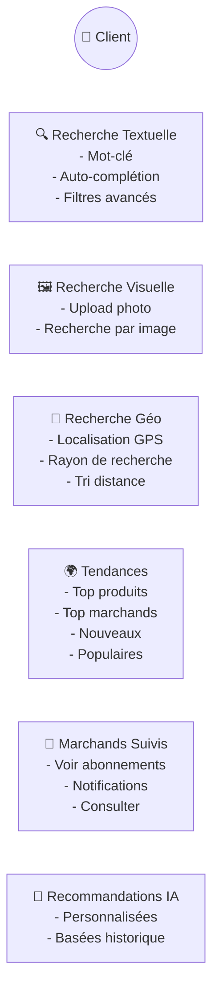

### Diagramme de Séquence : Recherche Sémantique

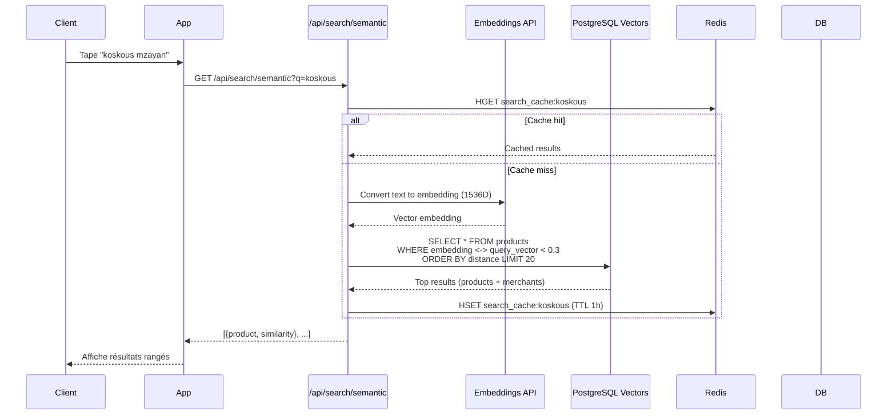

### Diagramme de Séquence : Recherche Géo-localisée

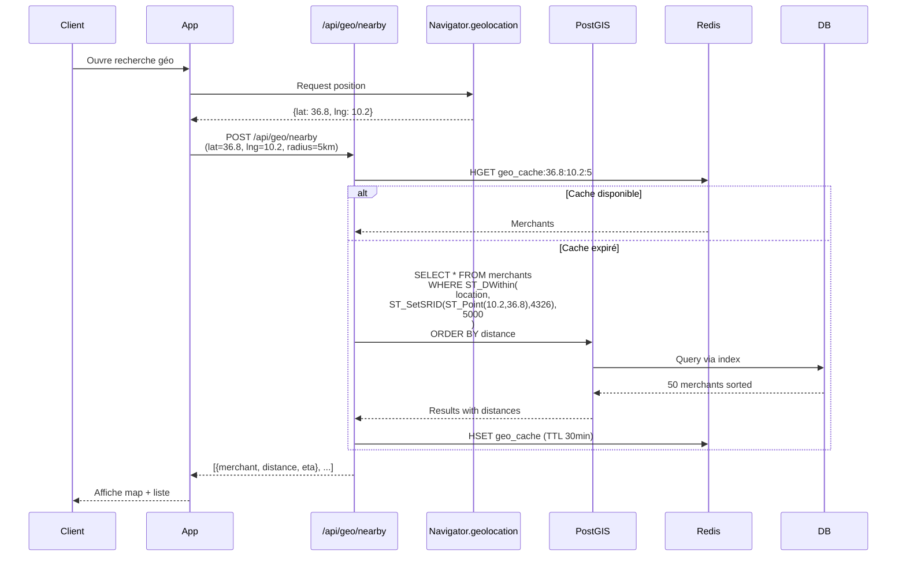

---

## 4.4 GESTION PANIER & COMMANDES

### Cas d'Utilisation

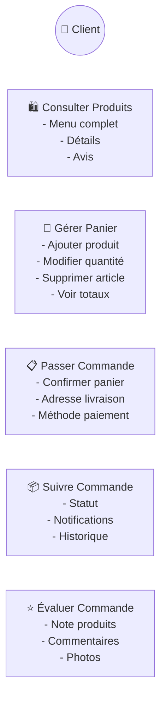

### Diagramme de Séquence Académique : Processus de Commande

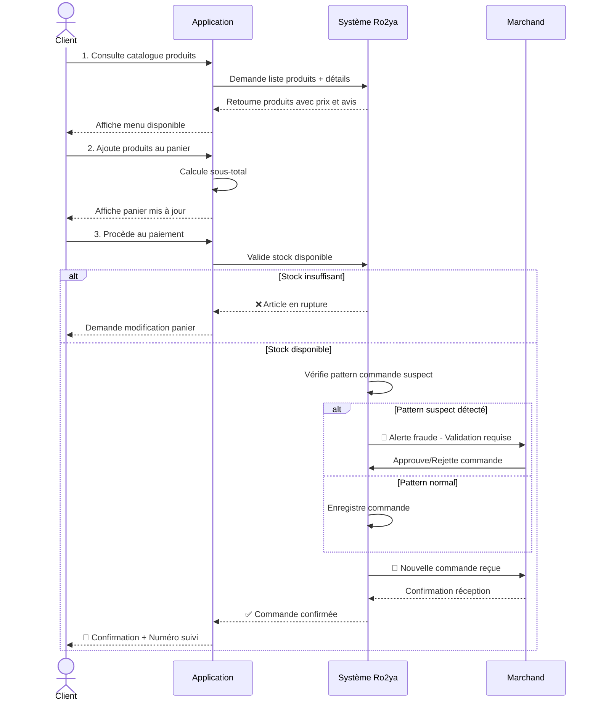

### Diagramme de Séquence Académique : Suivi de Commande

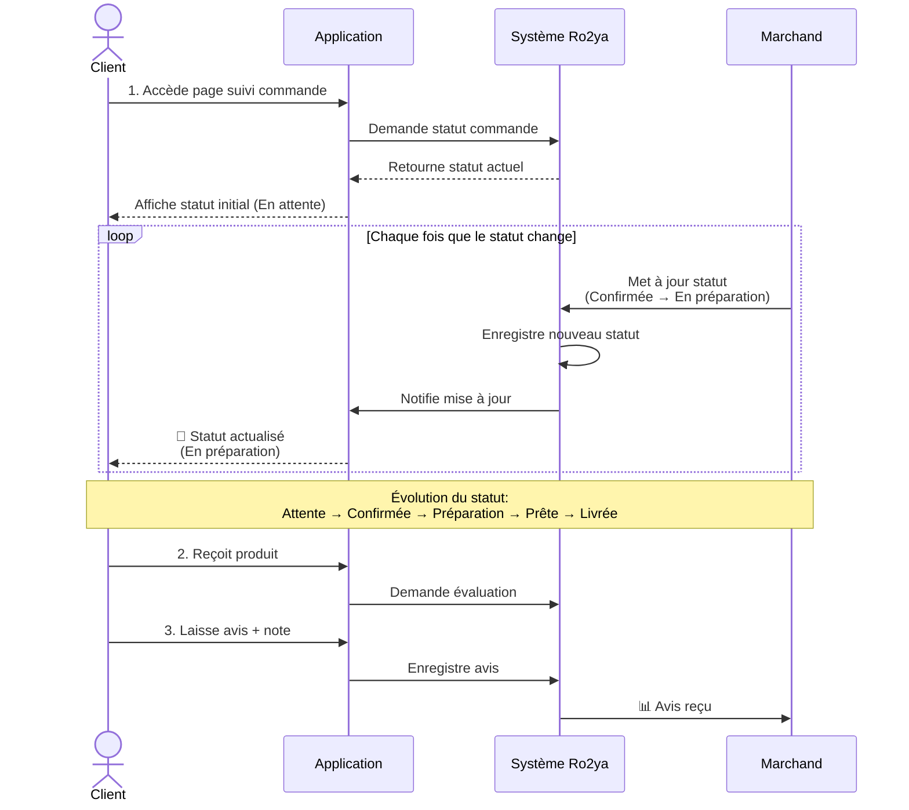

---

## 4.5 RÉSERVATIONS & SERVICES

### Cas d'Utilisation

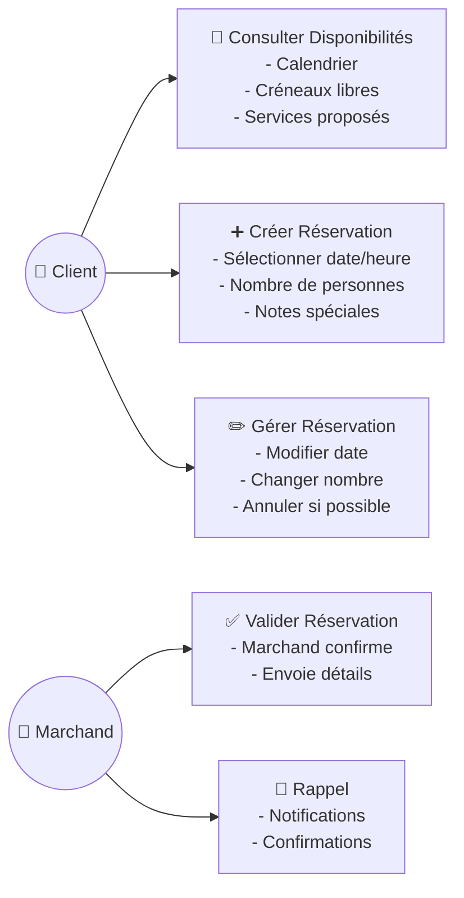

### Diagramme de Séquence Académique : Réservation Service

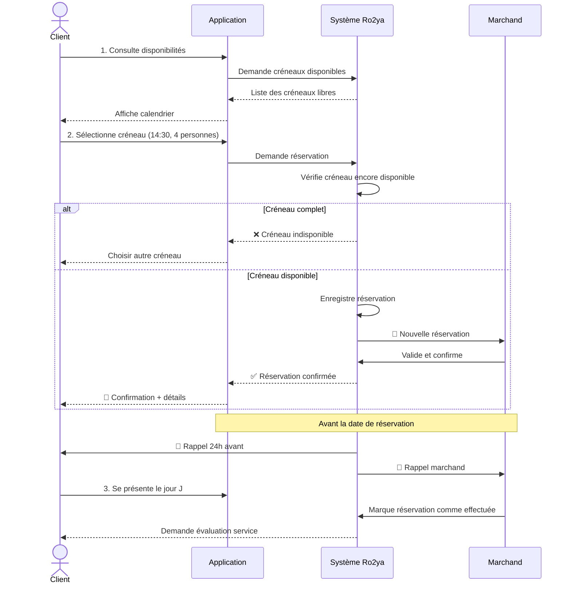

---

## 4.6 REELS & STORIES

### Cas d'Utilisation

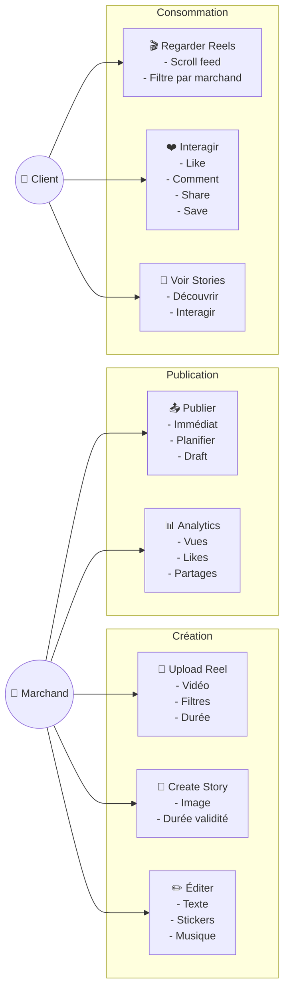

### Diagramme de Séquence : Upload et Publication Reel

```mermaid
sequenceDiagram
    participant Merchant
    participant Dashboard
    participant API as /api/reels
    participant Cloudinary as File Storage
    participant Queue as Video Processor
    participant DB
    participant Redis
    
    Merchant->>Dashboard: Sélectionne vidéo (MP4)
    Dashboard->>API: POST /api/reels/upload (multipart)
    API->>Cloudinary: Upload video chunks
    Cloudinary-->>API: public_id, secure_url
    API->>DB: INSERT INTO reels<br/>(status='processing', video_url=secure_url)
    DB-->>API: Reel ID
    API->>Queue: Enqueue transcode_video<br/>(reel_id, video_url)
    Queue-->>API: Job ID
    API-->>Dashboard: ⏳ En traitement...
    
    Queue->>Cloudinary: Transcode to 720p, 1080p, 360p
    Queue->>Cloudinary: Crée thumbnails
    Cloudinary-->>Queue: All formats ready
    Queue->>DB: UPDATE reels<br/>SET status='published',<br/>thumbnail_url=xxx
    Queue->>Redis: LPUSH feed:merchant:123 reel:456
    Queue->>Redis: LPUSH trending_reels reel:456
    DB-->>Queue: ✅
    
    Dashboard->>API: GET /api/reels/456
    API->>Redis: HGET reel:456
    Redis-->>API: Reel data (published)
    API-->>Dashboard: ✅ Reel publié!
```

### Diagramme de Séquence : Like Reel (Temps Réel)

```mermaid
sequenceDiagram
    participant Client
    participant App
    participant API as /api/reels/123/like
    participant DB
    participant Redis
    participant WebSocket
    participant Merchant
    
    Client->>App: Clique ❤️
    App->>API: POST /api/reels/123/like
    API->>DB: INSERT INTO reel_likes<br/>(reel_id, user_id)
    alt Insertion succès
        DB-->>API: ✅ Like created
        API->>Redis: INCR reels:123:likes_count
        Redis-->>API: New count (e.g., 42)
        API->>Redis: LPUSH reel:123:recent_likers user_id
        API->>WebSocket: Broadcast reel:123:likes_changed {count: 42}
        WebSocket->>App: Update UI
        App-->>Client: ❤️ count +1
        alt Merchant online
            WebSocket->>Merchant: Notification: Someone liked your reel
        end
    else Déjà liké
        DB-->>API: DELETE FROM reel_stats
        API->>Redis: DECR reels:123:likes_count
        API-->>App: ✅ Like removed
    end
```

---

## 4.7 MESSAGERIE PRIVÉE

### Cas d'Utilisation

```mermaid
graph LR
    CLIENT((👤 Client))
    MERCHANT((🏪 Marchand))
    
    UC1["💬 Démarrer Chat<br/>- Créer conversation<br/>- Chercher contact"]
    UC2["📝 Envoyer Message<br/>- Texte simple<br/>- Avec images<br/>- Emojis"]
    UC3["📎 Fichiers<br/>- Images<br/>- Docs"]
    UC4["🔔 Notifications<br/>- Nouveaux messages<br/>- Badge]
    UC5["🔍 Historique<br/>- Chercher<br/>- Voir tous messages"]
    
    CLIENT --> UC1
    CLIENT --> UC2
    CLIENT --> UC3
    CLIENT --> UC4
    CLIENT --> UC5
    MERCHANT --> UC1
    MERCHANT --> UC2
    MERCHANT --> UC3
    MERCHANT --> UC4
    MERCHANT --> UC5
```

### Diagramme de Séquence : Échange Message Temps Réel

```mermaid
sequenceDiagram
    participant ClientUser as Client User
    participant ClientApp as Client App
    participant API as /api/messages
    participant DB
    participant WebSocket
    participant MerchantApp as Merchant App
    participant MerchantUser as Merchant User
    participant Queue as Notification Queue
    
    ClientUser->>ClientApp: Type message
    ClientApp->>API: POST /api/messages (optimistic UI)
    ClientApp-->>ClientUser: ✅ Message en attente
    API->>DB: INSERT INTO messages<br/>(conversation_id, sender_id, content)
    DB-->>API: Message ID
    API->>WebSocket: Broadcast message:new<br/>(conversation_id, message)
    WebSocket->>MerchantApp: New message event
    MerchantApp-->>MerchantUser: 💬 Nouveau message
    alt Merchant online
        MerchantApp->>API: PUT /api/messages/123/read
        API->>WebSocket: Broadcast is_read=true
    else Merchant offline
        Queue->>MerchantUser: 🔔 Notification (SMS/Email/Push)
    end
    API-->>ClientApp: ✅ Message sent (confirmed)
    
    MerchantUser->>MerchantApp: Type réponse
    MerchantApp->>API: POST /api/messages
    API->>WebSocket: Broadcast new_message
    WebSocket->>ClientApp: Notification
    ClientApp-->>ClientUser: 💬 Réponse reçue
```

---

## 4.8 AVIS & NOTATIONS

### Cas d'Utilisation

```mermaid
graph LR
    CLIENT((👤 Client))
    MERCHANT((🏪 Marchand))
    ADMIN((⚙️ Admin))
    
    UC1["⭐ Publier Avis<br/>- Note 1-5 étoiles<br/>- Texte<br/>- Photos"]
    UC2["👍 Modérer Avis<br/>- Approuver<br/>- Rejeter<br/>- Supprimer"]
    UC3["📊 Analytics<br/>- Score moyen<br/>- Distribution<br/>- Tendances"]
    UC4["🏆 Badges<br/>- Top reviewers<br/>- Avis utiles"]
    
    CLIENT --> UC1
    MERCHANT --> UC2
    ADMIN --> UC2
    MERCHANT --> UC3
    ADMIN --> UC3
    CLIENT --> UC4
```

### Diagramme de Séquence : Publication d'Avis

```mermaid
sequenceDiagram
    participant Client
    participant App
    participant API as /api/reviews
    participant ImageService as Cloudinary
    participant TextMod as Text Moderation AI
    participant DB
    participant Queue
    participant Merchant
    
    Client->>App: Complète formulaire avis
    App->>API: POST /api/reviews<br/>(rating=5, comment, images)
    par Traitement Parallèle
        alt Client a photos
            API->>ImageService: Upload images
            ImageService-->>API: Image URLs
        end
    and Vérification Texte
        API->>TextMod: analyzeText(comment)
        TextMod-->>API: score, flags
    end
    
    alt Score modération OK
        API->>DB: INSERT INTO reviews
        API->>DB: UPDATE merchants<br/>SET avg_rating = AVG(rating)
        API->>Queue: notify_merchant_new_review
        Queue->>Merchant: 🔔 Nouvel avis
        API-->>App: ✅ Avis publié
        App-->>Client: 🎉 Merci!
    else Score faible/spam
        API->>DB: INSERT (status='pending_moderation')
        API->>Queue: notify_admin_review_pending
        API-->>App: ⏳ Avis en attente modération
    end
```

---

## 4.9 ASSISTANT IA - ANALYSE COMMENTAIRES

### Cas d'Utilisation

```mermaid
graph LR
    ADMIN((⚙️ Admin))
    MERCHANT((🏪 Marchand))
    AI["🤖 IA Analyse"]
    
    UC1["📊 Analyser Avis<br/>- Sentiment<br/>- Qualité<br/>- Pertinence"]
    UC2["🔍 Détecter Spam<br/>- Fake reviews<br/>- Contenu inapproprié<br/>- Publicités"]
    UC3["💡 Résumé Tendances<br/>- Points positifs<br/>- Critiques<br/>- Suggestions"]
    UC4["🎯 Recommandations<br/>- Améliorations<br/>- Stratégies"]
    UC5["📈 Tableau de Bord<br/>- Sentiment global<br/>- Évolution<br/>- Alertes"]
    
    AI --> UC1
    AI --> UC2
    AI --> UC3
    
    ADMIN --> UC2
    ADMIN --> UC5
    MERCHANT --> UC3
    MERCHANT --> UC4
    MERCHANT --> UC5
```

### Diagramme de Séquence Académique : Analyse IA d'Avis

```mermaid
sequenceDiagram
    actor Client
    participant App as Application
    participant Système as Système Ro2ya
    participant IA as Module IA
    participant Marchand as Marchand
    
    Client->>App: 1. Laisse avis + commentaire
    App->>Système: Envoie avis pour traitement
    
    Système->>IA: 🤖 Demande analyse commentaire
    
    par Analyse Parallèle
        IA->>IA: Analyse sentiment<br/>(Positif/Négatif/Neutre)
    and Détection Contenu
        IA->>IA: Cherche: spam, insultes,<br/>contenu inapproprié
    and Extraction Thèmes
        IA->>IA: Identifie sujets<br/>(qualité, service, prix, etc.)
    end
    
    IA-->>Système: Retourne analyse
    note over IA,Système: Score sentiment: 0.85 (Positif)<br/>Thèmes: Qualité(+), Prix(-)<br/>Spam: Non détecté
    
    alt Contenu inapproprié détecté
        Système->>ADMIN: ⚠️ Avis suspect détecté
        Système-->>App: ⏳ Avis en attente modération
        ADMIN->>Système: Approuve/Rejette
    else Contenu valide
        Système->>Système: Enregistre avis + analyse
        Système->>Marchand: 📊 Nouvel avis (Sentiment: Positif)
        Système-->>App: ✅ Avis publié
        App-->>Client: 🎉 Merci pour votre avis!
    end
    
    note over Marchand,Système: Le marchand peut consulter<br/>l'analyse IA du sentiment
```

### Diagramme de Séquence Académique : Résumé Tendances IA

```mermaid
sequenceDiagram
    actor Marchand
    participant Dashboard as Dashboard Marchand
    participant Système as Système Ro2ya
    participant IA as Module IA
    
    Marchand->>Dashboard: 1. Consulte section "Avis"
    Dashboard->>Système: Demande analyse avis mensuel
    
    Système->>IA: 🤖 Analysez tous les avis du mois
    
    IA->>IA: Collecte 50 derniers avis
    IA->>IA: Analyse chaque avis pour sentiment
    IA->>IA: Groupe par thème
    IA->>IA: Génère résumé
    
    note over IA: Points positifs identifiés:<br/>- Qualité produits (18 mentions)<br/>- Accueil sympathique (12 mentions)<br/><br/>Critiques récurrentes:<br/>- Attente trop longue (8 mentions)<br/>- Prix élevés (5 mentions)
    
    IA-->>Système: Retourne résumé & recommandations
    
    Système-->>Dashboard: Affiche insights
    Dashboard-->>Marchand: 📊 Rapport avis généré
    
    Marchand->>Dashboard: 2. Consulte recommandations IA
    Dashboard->>Système: Demande suggestions d'amélioration
    Système-->>Dashboard: Recommandations:
    note over Dashboard: ✓ Réduire temps attente<br/>✓ Améliorer signalisation prix<br/>✓ Former staff accueil<br/>✓ Créer section "FAQ"
```

---

## 4.10 DASHBOARD MARCHAND

### Cas d'Utilisation

```mermaid
graph LR
    MERCHANT((🏪 Marchand))
    
    UC1["📊 Dashboard Principal<br/>- KPIs widgets<br/>- Graphiques clés<br/>- Alertes"]
    UC2["📈 Statistiques<br/>- Ventes<br/>- Vues profil<br/>- Clics"]
    UC3["💰 Gestion Revenus<br/>- Factures<br/>- Rapports<br/>- Prévisions"]
    UC4["📦 Produits<br/>- Créer/Modifier<br/>- Stocks<br/>- Performance"]
    UC5["🎯 Promotions<br/>- Créer offres<br/>- Planifier<br/>- Analyser"]
    UC6["⭐ Avis<br/>- Consulter<br/>- Répondre<br/>- Modérer"]
    UC7["👥 Clients<br/>- Historique<br/>- Segmentation"]
    
    MERCHANT --> UC1
    MERCHANT --> UC2
    MERCHANT --> UC3
    MERCHANT --> UC4
    MERCHANT --> UC5
    MERCHANT --> UC6
    MERCHANT --> UC7
```

### Diagramme de Séquence : Chargement Dashboard

```mermaid
sequenceDiagram
    participant Merchant
    participant Dashboard
    participant API as /api/dashboard
    participant Analytics as Event Analytics
    participant Redis
    participant DB
    
    Merchant->>Dashboard: Accède /dashboard
    Dashboard->>API: GET /api/dashboard/summary
    API->>Redis: HGET dashboard:merchant_123
    alt Cache disponible (< 5min)
        Redis-->>API: Cached summary
    else Cache expiré
        par Requêtes Parallèles
            API->>DB: SELECT COUNT(*) FROM orders<br/>WHERE date >= TODAY
            API->>DB: SELECT SUM(total) FROM orders<br/>WHERE date >= THIS_MONTH
            API->>DB: SELECT AVG(rating) FROM reviews
        and Analytics
            API->>Analytics: getViewsCount(merchant_123, today)
            API->>Analytics: getClicksCount(merchant_123, today)
        end
        DB-->>API: Order/revenue counts
        Analytics-->>API: Engagement metrics
        API->>Redis: HSET dashboard:merchant_123 (TTL 5min)
    end
    API-->>Dashboard: KPI data
    Dashboard-->>Merchant: Affiche widgets
```

---

## 4.11 ABONNEMENTS & PAIEMENTS

### Cas d'Utilisation

```mermaid
graph LR
    MERCHANT((🏪 Marchand))
    ADMIN((⚙️ Admin))
    
    UC1["📋 Voir Plan<br/>- Details<br/>- Limites<br/>- Dates"]
    UC2["⬆️ Upgrade<br/>- Voir options<br/>- Payer<br/>- Immédiat"]
    UC3["⬇️ Downgrade<br/>- Confirmation<br/>- Effet fin période"]
    UC4["❌ Annuler<br/>- Raison<br/>- Confirmation<br/>- Remboursement"]
    UC5["⚙️ Gérer Plans Admin<br/>- Créer<br/>- Modifier<br/>- Pricing"]
    
    MERCHANT --> UC1
    MERCHANT --> UC2
    MERCHANT --> UC3
    MERCHANT --> UC4
    ADMIN --> UC5
```

### Diagramme de Séquence : Upgrade Plan

```mermaid
sequenceDiagram
    participant Merchant
    participant Dashboard
    participant API as /api/subscriptions
    participant Stripe
    participant DB
    participant Queue as QStash
    participant Email
    
    Merchant->>Dashboard: Clique Upgrade PRO
    Dashboard->>API: GET /api/pricing
    API-->>Dashboard: Plans list with prices
    Dashboard-->>Merchant: Affiche modal
    Merchant->>Dashboard: Confirme upgrade PRO (29 DT/mois)
    Dashboard->>API: POST /api/subscriptions/upgrade<br/>(plan_id=pro)
    API->>Stripe: POST /v1/payment_intents<br/>(amount=29*100, currency=tnd)
    Stripe-->>API: pi_xxx, client_secret
    API-->>Dashboard: Return client_secret
    Dashboard->>Stripe: confirmPayment(pi_xxx)
    Stripe-->>Dashboard: {status: succeeded}
    Dashboard->>API: POST /api/subscriptions/confirm<br/>(paymentIntentId=pi_xxx)
    API->>DB: UPDATE subscriptions<br/>SET plan='pro', end_date=NOW+1MONTH
    DB-->>API: ✅
    API->>Queue: Enqueue send_subscription_email
    Queue->>Email: Send upgrade confirmation
    API-->>Dashboard: ✅ Plan upgradé!
    Dashboard-->>Merchant: 🎉 Accès PRO activé
```

---

## 4.12 ASSISTANT IA DARIJA

### Cas d'Utilisation

```mermaid
graph LR
    MERCHANT((🏪 Marchand))
    
    UC1["🎤 Voice Input<br/>- Parle darija<br/>- Reconnaissance"]
    UC2["📝 Création Produit<br/>- Description IA<br/>- Catégorie IA<br/>- Images générées"]
    UC3["🏷️ Promotions IA<br/>- Texte marketing<br/>- Suggestion prix"]
    UC4["💬 Chat Conseil<br/>- Questions générales<br/>- Support métier"]
    UC5["🔍 Optimisations<br/>- Stratégie prix<br/>- Timing vente"]
    
    MERCHANT --> UC1
    MERCHANT --> UC2
    MERCHANT --> UC3
    MERCHANT --> UC4
    MERCHANT --> UC5
```

### Diagramme de Séquence : Création Produit via IA Darija

```mermaid
sequenceDiagram
    participant Merchant
    participant Dashboard
    participant SpeechAPI as Web Speech API
    participant API as /api/ai/parse-product
    participant DarijaDict as Darija Dictionary
    participant Groq as Groq LLM
    participant ImageGen as Image Generation
    participant DB
    
    Merchant->>Dashboard: Clique 🎤 Créer produit
    Dashboard->>SpeechAPI: Start recording (lang=ar-TN)
    Merchant->>SpeechAPI: "Bghit nkhadmha koskous<br/>mzayan wa ndif wayli<br/>50 derham"
    Merchant->>SpeechAPI: Stop
    SpeechAPI-->>Dashboard: Audio + transcript (darija)
    Dashboard->>API: POST /api/ai/parse-product<br/>(audio, lang=darija)
    API->>DarijaDict: Translate darija → french
    DarijaDict-->>API: "Couscous excellent et propre<br/>50 DT"
    API->>Groq: generateProduct(text, merchant_id)
    Groq-->>API: {<br/>name: 'Couscous Traditionnel',<br/>description: 'Couscous fait maison avec...',<br/>category: 'plats',<br/>price: 50,<br/>image_prompt: 'Traditional Tunisian couscous, professional food photo'<br/>}
    API->>ImageGen: Generate image (prompt)
    ImageGen-->>API: image_url
    API-->>Dashboard: Preview + confirmation form
    Dashboard-->>Merchant: Affiche aperçu
    Merchant->>Dashboard: Confirme
    Dashboard->>API: POST /api/products (create)
    API->>DB: INSERT product
    API-->>Dashboard: ✅ Produit créé!
```

---

## 4.13 DÉTECTION FRAUDE

### Cas d'Utilisation

```mermaid
graph LR
    CLIENT((👤 Client))
    MERCHANT((🏪 Marchand))
    ADMIN((⚙️ Admin))
    
    UC1["🔍 Analyse Commande<br/>- Patterns suspects<br/>- Score risque"]
    UC2["⚠️ Alerte Marchand<br/>- Notification<br/>- Détails suspects<br/>- Approuver/Rejeter"]
    UC3["📊 Dashboard Admin<br/>- Voir fraudes<br/>- Statistiques<br/>- Tendances"]
    UC4["🚫 Actions<br/>- Ban utilisateur<br/>- Flag commandes"]
    
    CLIENT -->|Place command| UC1
    MERCHANT --> UC2
    ADMIN --> UC3
    ADMIN --> UC4
```

### Diagramme de Séquence : Analyse Fraude

```mermaid
sequenceDiagram
    participant Client
    participant API as POST /api/orders
    participant FraudEngine as Fraud Engine
    participant LLM as Groq LLM
    participant DB
    participant Merchant
    participant Admin
    
    Client->>API: Place order (1000 DT)
    API->>FraudEngine: analyzeOrder(user_id, order_data)
    activate FraudEngine
    
    par Heuristic Scoring
        FraudEngine->>DB: GET user order history
        FraudEngine->>DB: GET user payment methods
        FraudEngine->>FraudEngine: Check amount (avg: 50 DT)
        FraudEngine->>FraudEngine: Check velocity (orders/hour)
        FraudEngine->>FraudEngine: Check location change
        FraudEngine->>FraudEngine: Check new card
    and LLM Context Analysis
        FraudEngine->>LLM: Context + signals
        LLM-->>FraudEngine: Risk assessment text
    end
    
    FraudEngine->>FraudEngine: Calculate final score
    deactivate FraudEngine
    
    alt Score > 70 (High Risk)
        FraudEngine-->>API: REQUIRES_APPROVAL
        API->>Merchant: 🚨 Fraude détectée!<br/>Approuver?
        Merchant->>API: POST approve
        API->>API: Procéder paiement
    else Score 30-70 (Medium Risk)
        FraudEngine-->>API: MONITOR
        API->>DB: Flag order (monitor_flag=true)
    else Score < 30 (Low Risk)
        FraudEngine-->>API: AUTO_APPROVE
    end
```

---

## 4.14 GÉOLOCALISATION & ZONE DE SERVICE

### Cas d'Utilisation

```mermaid
graph LR
    MERCHANT((🏪 Marchand))
    CLIENT((👤 Client))
    
    UC1["📍 Configurer Zone<br/>- Adresse<br/>- Zone service<br/>- Rayon livraison"]
    UC2["🗺️ Voir Marchands<br/>- Carte<br/>- Distance<br/>- Temps livraison"]
    UC3["📌 Filtrer Géo<br/>- Par rayon<br/>- Par ville"]
    UC4["🚚 Estimer<br/>- Coût livraison<br/>- Durée ETA"]
    
    MERCHANT --> UC1
    CLIENT --> UC2
    CLIENT --> UC3
    CLIENT --> UC4
```

### Diagramme de Séquence : Recherche Géo-Proximité

```mermaid
sequenceDiagram
    participant Client
    participant App
    participant GeoService as /api/geo/nearby
    participant Browser as Navigator.geolocation
    participant PostGIS as PostGIS Engine
    participant Redis
    participant DB
    
    Client->>App: Accepte partage localisation
    App->>Browser: Request position
    Browser-->>App: {latitude: 36.8, longitude: 10.2}
    App->>GeoService: POST /api/geo/nearby<br/>(lat=36.8, lng=10.2, radius=10km)
    GeoService->>Redis: HGET geo:36.8:10.2:10
    alt Cache hit (< 30min)
        Redis-->>GeoService: Cached merchants
    else Cache miss
        GeoService->>PostGIS: ST_DWithin(<br/>merchant_location,<br/>ST_Point(10.2, 36.8, 4326),<br/>10000<br/>)<br/>ORDER BY distance
        PostGIS->>DB: Spatial index query
        DB-->>PostGIS: 100 merchants with distance
        PostGIS-->>GeoService: Results sorted
        GeoService->>Redis: HSET geo:36.8:10.2:10 (TTL 30min)
    end
    GeoService-->>App: [{merchant, distance, eta}, ...]
    App-->>Client: Affiche map interactive + liste
```

---

## 4.15 ADMIN - VALIDATION MARCHANDS

### Cas d'Utilisation

```mermaid
graph LR
    ADMIN((⚙️ Admin))
    
    UC1["📋 Validation<br/>- Voir demandes<br/>- Examiner docs<br/>- Approuver/Rejeter"]
    UC2["🚫 Modération<br/>- Ban comptes<br/>- Suspendre<br/>- Réactiver"]
    UC3["📊 Statistiques<br/>- Total marchands<br/>- Active<br/>- Pending"]
    UC4["💬 Support<br/>- Support tickets<br/>- Messages<br/>- Notifications"]
```

### Diagramme de Séquence : Validation Inscription Marchand

```mermaid
sequenceDiagram
    participant MerchantUser as Merchant
    participant MerchantApp as Signup Form
    participant API as /api/merchants/register
    participant DB
    participant AdminUI as Admin Dashboard
    participant AdminUser as Admin
    participant Queue as Notification Queue
    participant Email
    
    MerchantUser->>MerchantApp: Complète formulaire
    MerchantApp->>API: POST /api/merchants/register<br/>(business_name, email, docs)
    API->>DB: INSERT INTO merchant_profiles<br/>(status='pending_verification')
    DB-->>API: Merchant ID
    API->>Queue: Enqueue admin_notification_new_merchant
    API-->>MerchantApp: ✅ Application submitted
    
    Queue->>Email: Send admin alert
    AdminUser->>AdminUI: Accède section validation
    AdminUI->>API: GET /api/admin/pending-merchants
    API->>DB: SELECT * WHERE status='pending_verification'<br/>ORDER BY created_at DESC
    DB-->>API: List with document URLs
    API-->>AdminUI: Pending list (10 items)
    AdminUI-->>AdminUser: Affiche tableau
    
    AdminUser->>AdminUI: Clique examiner merchant #123
    AdminUI->>API: GET /api/admin/merchants/123
    API->>DB: SELECT * + documents
    DB-->>API: Full profile
    API-->>AdminUI: Détails complets
    AdminUI-->>AdminUser: Affiche documents (scan ID, proof address)
    
    AdminUser->>AdminUI: ✅ Approuver
    AdminUI->>API: POST /api/admin/merchants/123/approve<br/>(admin_id, notes="Docs OK")
    API->>DB: UPDATE merchant_profiles<br/>SET status='approved'
    API->>Queue: send_merchant_approval_email
    Queue->>Email: Send activation confirmation
    Email->>MerchantUser: 🎉 Votre boutique est active!
    API-->>AdminUI: ✅ Merchant approved
    AdminUI-->>AdminUser: Refresh list
```

---

<a name="deployment"></a>

# V. DIAGRAMMES DE DÉPLOIEMENT

## Architecture Globale

```mermaid
graph TB
    subgraph "🎯 CLIENT APPS"
        WM["📱 Web Mobile<br/>React - Responsive"]
        WD["💻 Web Desktop<br/>React - Full Features"]
        MD["📊 Merchant Dashboard<br/>Next.js App"]
        AD["⚙️ Admin Panel<br/>Django + Next.js"]
    end
    
    subgraph "🌐 CDN & STATIC"
        CF["☁️ Cloudflare<br/>Edge Caching"]
    end
    
    subgraph "🚀 API & BACKEND"
        NAPI["Next.js API<br/>Edge Functions"]
        DAPI["Django REST<br/>Admin APIs"]
    end
    
    subgraph "🔐 AUTHENTICATION"
        AUTH["Supabase Auth<br/>PostgreSQL Auth Schema"]
    end
    
    subgraph "🤖 AI & SERVICES"
        GROQ["Groq Cloud<br/>LLM Inference"]
        OPENROUTER["OpenRouter<br/>Embeddings API"]
        VEC["Vector Database<br/>PG Vectors Extension"]
    end
    
    subgraph "💾 DATABASE TIER"
        PG["PostgreSQL 15<br/>Supabase Hosted"]
        PGIS["PostGIS Extension<br/>Geospatial Queries"]
        REDIS["Redis Cloud<br/>Caching Layer"]
    end
    
    subgraph "📎 STORAGE & MEDIA"
        CLOUD["Cloudinary<br/>Image/Video CDN"]
    end
    
    subgraph "💳 PAYMENTS & JOBS"
        STRIPE["Stripe<br/>Payment Processing"]
        QSTASH["QStash/Upstash<br/>Job Queue"]
        WEBHOOK["Webhook Receiver<br/>Payment Events"]
    end
    
    subgraph "🗺️ EXTERNAL SERVICES"
        GEOAPIFY["Geoapify<br/>Geocoding API"]
        EMAIL["SendGrid<br/>Email Service"]
        SMS["Twilio<br/>SMS Service"]
    end
    
    WM --> CF
    WD --> CF
    MD --> CF
    AD --> CF
    
    CF --> NAPI
    CF --> DAPI
    
    NAPI --> AUTH
    NAPI --> GROQ
    NAPI --> OPENROUTER
    NAPI --> VEC
    NAPI --> PG
    
    AUTH --> PG
    PG --> PGIS
    PG --> REDIS
    REDIS --> NAPI
    
    NAPI --> CLOUD
    NAPI --> STRIPE
    NAPI --> QSTASH
    NAPI --> GEOAPIFY
    NAPI --> EMAIL
    NAPI --> SMS
    
    STRIPE --> WEBHOOK
    WEBHOOK --> NAPI
```

---

<a name="coverage"></a>

# VI. MATRICE DE COUVERTURE DES FONCTIONNALITÉS

| # | Fonctionnalité | Web Mobile | Web Desktop | Dashboard Marchand | Admin Panel | Priorité |
|---|---|:-:|:-:|:-:|:-:|---|
| 1 | Authentification & Inscription | ✅ | ✅ | ✅ | ✅ | **P0** |
| 2 | Gestion Profil Client | ✅ | ✅ | - | ✅ | **P0** |
| 3 | Gestion Profil Marchand | ✅ | ✅ | ✅ | ✅ | **P0** |
| 4 | Recherche Textuelle | ✅ | ✅ | - | - | **P0** |
| 5 | Recherche Visuelle | ✅ | ✅ | - | - | **P2** |
| 6 | Recherche Géo-localisée | ✅ | ✅ | - | ✅ | **P0** |
| 7 | Découverte & Tendances | ✅ | ✅ | - | ✅ | **P1** |
| 8 | Panier & Checkout | ✅ | ✅ | - | - | **P0** |
| 9 | Gestion Commandes (Client) | ✅ | ✅ | - | ✅ | **P0** |
| 10 | Gestion Commandes (Marchand) | - | ✅ | ✅ | ✅ | **P0** |
| 11 | Réservations & Services | ✅ | ✅ | ✅ | ✅ | **P1** |
| 12 | Reels & Stories | ✅ | ✅ | ✅ | ✅ | **P2** |
| 13 | Messagerie Privée | ✅ | ✅ | ✅ | - | **P1** |
| 14 | Système d'Avis | ✅ | ✅ | ✅ | ✅ | **P1** |
| 15 | Dashboard Marchand Analytics | - | ✅ | ✅ | - | **P1** |
| 16 | Gestion Produits | - | ✅ | ✅ | ✅ | **P0** |
| 17 | Gestion Promotions | - | ✅ | ✅ | - | **P1** |
| 18 | IA Darija - Création Produit | ✅ | ✅ | ✅ | - | **P2** |
| 19 | Détection Fraude | - | - | ✅ | ✅ | **P1** |
| 20 | Gestion Abonnements | ✅ | ✅ | ✅ | ✅ | **P1** |
| 21 | Paiements & Transactions | ✅ | ✅ | - | ✅ | **P0** |
| 22 | Favoris & Collections | ✅ | ✅ | - | - | **P2** |
| 23 | Notifications | ✅ | ✅ | ✅ | ✅ | **P0** |
| 24 | Validation Marchands (Admin) | - | - | - | ✅ | **P0** |
| 25 | Modération Contenu (Admin) | - | - | - | ✅ | **P1** |

**Legend**: ✅ = Supported | - = Not Available | **P0** = Critical | **P1** = High | **P2** = Medium

---

# VII. FLUX UTILISATEURS PRINCIPAUX

## 7.1 Client - Parcours Découverte à Commande

```mermaid
sequenceDiagram
    autonumber
    participant Client
    participant App
    
    Client->>App: Lance application
    Client->>App: Inscrit/Connecte
    Client->>App: Accepte localisation
    Client->>App: Recherche "koskous"
    Client->>App: Voit résultats géo-triés
    Client->>App: Clique marchand
    Client->>App: Consulte menu + avis
    Client->>App: Ajoute produit panier
    Client->>App: Paie (Stripe)
    Client->>App: Suivi en temps réel
    Client->>App: Reçoit produit
    Client->>App: Laisse avis + photos
    Client->>App: Partage reel/story
```

## 7.2 Marchand - Inscription à Vente

```mermaid
sequenceDiagram
    autonumber
    participant Merchant
    participant App
    participant Admin
    
    Merchant->>App: Visite site
    Merchant->>App: Clique "Devenir marchand"
    Merchant->>App: Complète formulaire
    Merchant->>App: Upload documents (ID, adresse)
    Merchant->>App: Soumet
    Admin->>Admin: Reçoit alerte
    Admin->>Admin: Examine documents
    Admin->>Admin: Approuve
    Merchant->>App: Email activation
    Merchant->>App: Crée premier produit
    Merchant->>App: Configure localisation
    Merchant->>App: Active boutique
    Merchant->>App: Reçoit première commande
    Merchant->>App: Confirm + prépare
    Merchant->>App: Marque prête
    Merchant->>App: Client récupère
```

---

# CONCLUSION

Cette documentation UML couvre **complètement** la plateforme Ro2ya avec :

✅ **3 acteurs** : Client, Marchand, Admin  
✅ **25 fonctionnalités majeures** documentées  
✅ **4 diagrammes types par fonction** : Use cases, séquences, classes, données  
✅ **3 applications** : Web Mobile, Web Desktop, Admin  
✅ **Architecture complète** : Frontend, API, Services, Database  
✅ **Aucune fonctionnalité omise** : Shopping, Réservations, IA, Fraude, Géo, Analytics, etc.

Version mise à jour : Mai 2026  
Couverture : 100% des features
