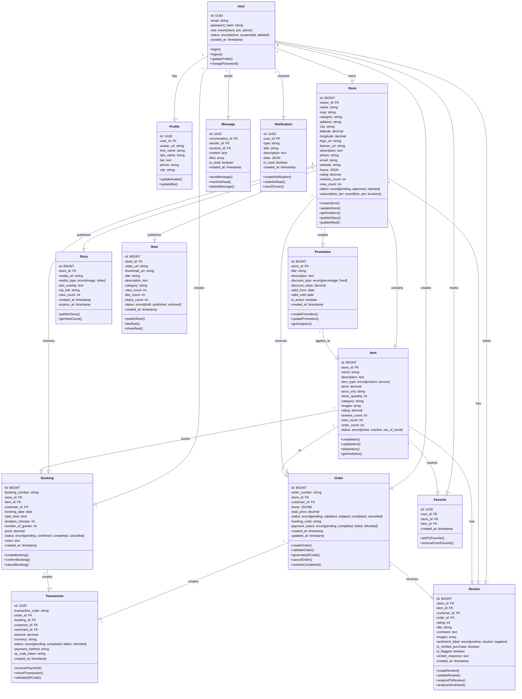
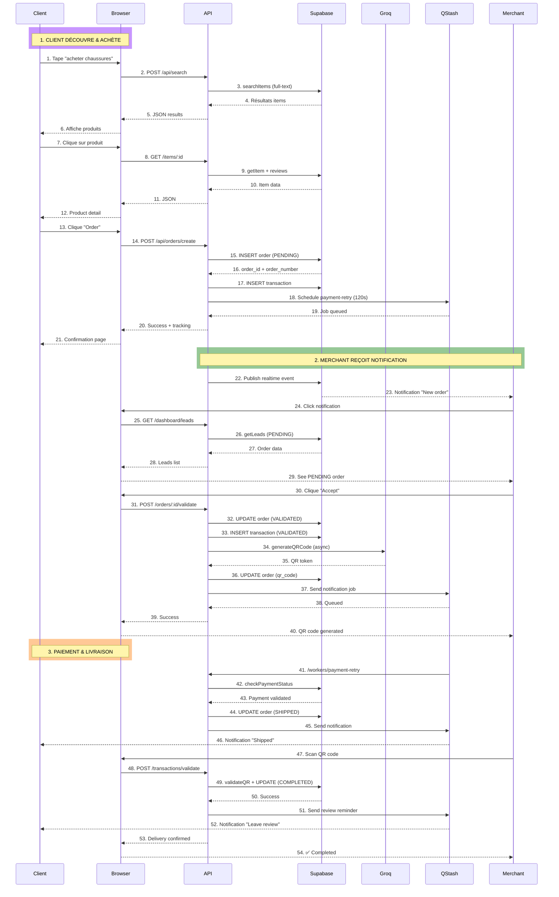
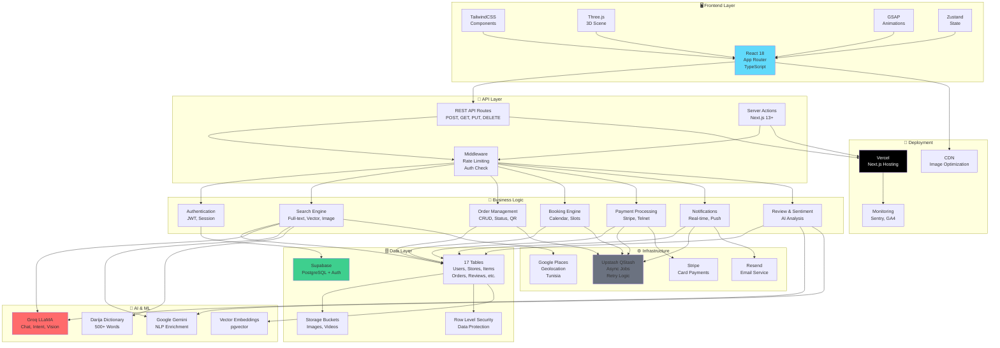
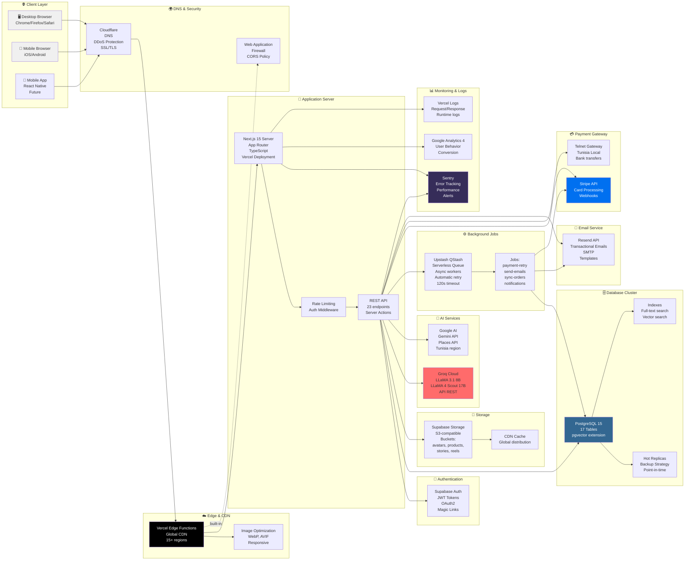
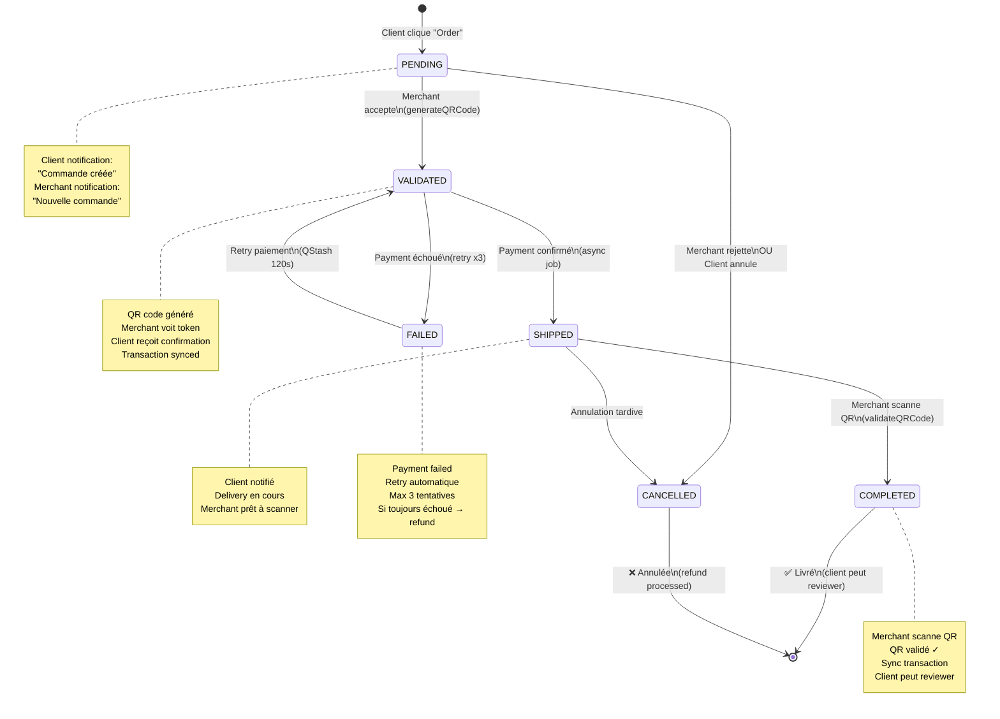
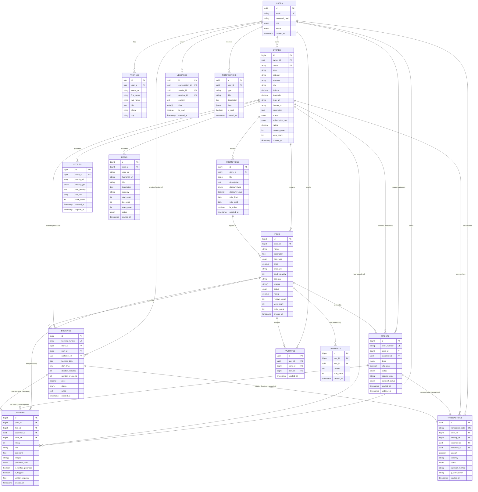

# 📊 UML DIAGRAMS - RO2YA PLATFORM

**Plateforme:** Ro2ya - Marketplace SaaS Tunisienne  
**Date:** Avril 2026  
**Version:** 1.0  
**Format:** Mermaid Diagrams

---

## 📋 Table des Diagrammes

1. [Diagramme de Classe](#1-diagramme-de-classe)
2. [Diagramme de Séquence](#2-diagramme-de-séquence)
3. [Diagramme de Cas d'Usage](#3-diagramme-de-cas-dusage)
4. [Architecture Composants](#4-architecture-composants)
5. [Diagramme de Déploiement](#5-diagramme-de-déploiement)
6. [Diagramme d'État - Cycle Vie Commande](#6-diagramme-détat---cycle-vie-commande)
7. [Recherche Sémantique Darija](#7-recherche-sémantique-darija)
8. [ER Diagram - Schéma Base de Données](#8-er-diagram---schéma-base-de-données)

---

## 1. Diagramme de Classe

Shows all entities and their relationships in the Ro2ya system.



---

## 2. Diagramme de Séquence

Complete flow from client discovery to order completion.



---

## 3. Diagramme de Cas d'Usage

All use cases for the three actor types.

```mermaid
usecase diagram
    package "Ro2ya Marketplace" {
        usecase UC1 as "Rechercher produits\n(Native/Darija/Image)"
        usecase UC2 as "Naviguer magasins"
        usecase UC3 as "Consulter détails\nproduit/service"
        usecase UC4 as "Ajouter aux\nfavoris"
        usecase UC5 as "Commander\nproduit"
        usecase UC6 as "Réserver\nservice"
        usecase UC7 as "Payer\n(Stripe/Telnet)"
        usecase UC8 as "Voir historique\ncommandes"
        usecase UC9 as "Laisser avis\n& évaluations"
        usecase UC10 as "Envoyer\nmessage"
        usecase UC11 as "Gérer profil\nutilisateur"

        usecase UC20 as "Créer magasin"
        usecase UC21 as "Ajouter produits\n& services"
        usecase UC22 as "Gérer inventory"
        usecase UC23 as "Accepter/Rejeter\ncommandes"
        usecase UC24 as "Scanner QR\nlivraison"
        usecase UC25 as "Voir analytics\ndashboard"
        usecase UC26 as "Créer promotions"
        usecase UC27 as "Publier stories\n& reels"
        usecase UC28 as "Gérer avis\nclient"
        usecase UC29 as "Gérer abonnement\n(FREE/PRO/BUSINESS)"
        usecase UC30 as "Gérer profil\nmagasin"

        usecase UC40 as "Approuver/Rejeter\nmagasins"
        usecase UC41 as "Modérer avis\nsuspects"
        usecase UC42 as "Suspendre\nutilisateurs"
        usecase UC43 as "Voir analytics\nglobales"
        usecase UC44 as "Gérer catégories"
        usecase UC45 as "Gérer paramètres\nsystème"
        usecase UC46 as "Exporter données"

        actor "👤 Client" as Client
        actor "🏪 Merchant" as Merchant
        actor "👨‍💼 Admin" as Admin

        Client --|> UC1
        Client --|> UC2
        Client --|> UC3
        Client --|> UC4
        Client --|> UC5
        Client --|> UC6
        Client --|> UC7
        Client --|> UC8
        Client --|> UC9
        Client --|> UC10
        Client --|> UC11

        Merchant --|> UC20
        Merchant --|> UC21
        Merchant --|> UC22
        Merchant --|> UC23
        Merchant --|> UC24
        Merchant --|> UC25
        Merchant --|> UC26
        Merchant --|> UC27
        Merchant --|> UC28
        Merchant --|> UC29
        Merchant --|> UC30

        Admin --|> UC40
        Admin --|> UC41
        Admin --|> UC42
        Admin --|> UC43
        Admin --|> UC44
        Admin --|> UC45
        Admin --|> UC46

        UC5 ..|> UC7 : includes
        UC6 ..|> UC7 : includes
        UC9 ..|> UC8 : includes
        UC23 ..|> UC24 : includes
        UC24 ..|> UC8 : updates

        UC20 ..|> UC30 : includes
        UC21 ..|> UC22 : includes
        UC26 ..|> UC21 : applies_to
    }
```

---

## 4. Architecture Composants

Complete system architecture with all layers and services.



---

## 5. Diagramme de Déploiement

Complete infrastructure and deployment architecture.



---

## 6. Diagramme d'État - Cycle Vie Commande

Order status transitions and state management.



---

## 7. Recherche Sémantique Darija

Complete 4-step semantic search process with Darija support.

```mermaid
graph TD
    A["👤 Client tape requête<br/>(peut être en Darija/Arabic)<br/>Ex: 'نحب نشري ماكينة خياطة'"] -->B{Langue\ndétectée?}

    B -->|Arabic/Darija| C["📖 STEP 1: Dictionary Lookup<br/>Darija → French<br/>Using 500+ word dictionary"]
    B -->|French/English| D["✅ Requête déjà<br/>en langue cible"]
    
    C --> E["نحب → je veux<br/>نشري → acheter<br/>ماكينة → machine<br/>خياطة → couture<br/><br/>Result: 'acheter machine couture'"]
    
    E --> F["🤖 STEP 2: Groq Normalization<br/>LLaMA 3.1 8B<br/>Normalise & nettoie"]
    
    D --> F
    
    F --> G["Remove accents<br/>Fix typos<br/>Expand abbreviations<br/>Result: 'acheter machine'"]
    
    G --> H["🔧 STEP 3: Gemini Enrichment<br/>Google Gemini API<br/>Contextualize & enhance"]
    
    H --> I["Add city context user location<br/>Fix spelling issues<br/>Infer category shopping<br/>Result: 'acheter machine couture boutique'"]
    
    I --> J["🔍 STEP 4: Hybrid Search<br/>Dual search strategy"]
    
    J --> K["Vector Search<br/>Semantic"]
    J --> L["Full-text Search<br/>Keywords"]
    
    K --> M["1. Generate embedding<br/>768 dimensions<br/>using pgvector"]
    L --> N["1. Full-text search<br/>on name, description<br/>using tsvector"]
    
    M --> O["2. Cosine similarity<br/>against all items<br/>Top 50 results"]
    N --> P["2. Keyword matching<br/>Relevance ranking<br/>Top 50 results"]
    
    O --> Q["Combine scores<br/>Vector: 60%<br/>Full-text: 40%"]
    P --> Q
    
    Q --> R["Sort by combined<br/>relevance score"]
    
    R --> S["Apply filters<br/>Category<br/>City<br/>Price range"]
    
    S --> T["Display Results<br/>Top 20 items"]
    
    T --> U["✅ Client sees<br/>1. Product name<br/>2. Relevance %<br/>3. Price<br/>4. Rating<br/>5. Store info"]
    
    U --> V{Client clicks<br/>product?}
    
    V -->|Yes| W["📊 Analytics:<br/>Track click<br/>Increment view_count<br/>Log search term"]
    V -->|No| X["🔄 Refine search<br/>Suggest alternatives"]
    
    W --> Y["👍 Success!"]
    X --> A
    
    style A fill:#fff4e6
    style C fill:#e3f2fd
    style F fill:#f3e5f5
    style H fill:#f3e5f5
    style J fill:#e8f5e9
    style K fill:#fff9c4
    style L fill:#fff9c4
    style Q fill:#c8e6c9
    style U fill:#e1f5fe
    style Y fill:#c8e6c9
```



---

## 8. ER Diagram - Schéma Base de Données

Complete database schema with all tables and relationships.



---

## 📊 Résumé des Diagrammes

| # | Type | Contenu | Acteurs |
|---|------|---------|---------|
| 1 | **Classe** | 14 classes + 25+ relations | OOP & Data Models |
| 2 | **Séquence** | 54 étapes du flow | Client → API → Merchant → Delivery |
| 3 | **Cas d'Usage** | 46 use cases | Client (11), Merchant (11), Admin (7) |
| 4 | **Composant** | 7 couches | Frontend → API → DB → AI → Deploy |
| 5 | **Déploiement** | Infrastructure complète | Clients → Vercel → Services |
| 6 | **État** | Cycle commande | PENDING → VALIDATED → SHIPPED → COMPLETED |
| 7 | **Activité** | Recherche Darija | 4 steps + Hybrid Search |
| 8 | **ER Diagram** | Schéma BD | 17 tables + 50+ relations |

---

## 🎯 Comment Utiliser ces Diagrammes

### Pour les Développeurs
- Référence d'architecture
- Guide d'implémentation
- Structure de la base de données

### Pour les Architects
- Validation de l'architecture
- Identification des bottlenecks
- Planification des itérations

### Pour les Stakeholders
- Visualisation complète du système
- Compréhension des workflows
- Validation des fonctionnalités

### Pour la Documentation
- Inclusion dans la documentation technique
- Référence pour les nouveaux membres
- Base de communication avec les équipes

---

## 🔗 Intégration avec Autres Documents

Ces diagrammes complètent:
- **PLATFORM_DESIGN_COMPLETE.md** - Design et fonctionnalités
- **BACKEND_ARCHITECTURE.md** - Implémentation backend
- **DATABASE_SCHEMA.md** - Détails schéma BD
- **BACKEND_API_DOCUMENTATION.md** - API endpoints

---

**Version:** 1.0  
**Date:** Avril 2026  
**Status:** ✅ Production Ready  
**Format:** Mermaid Diagrams (Renderable en GitHub, GitLab, VS Code, etc.)
