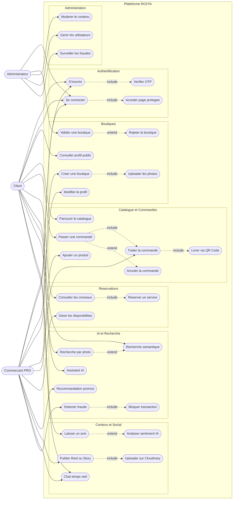
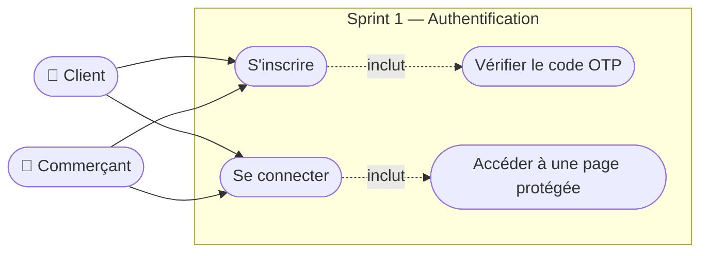
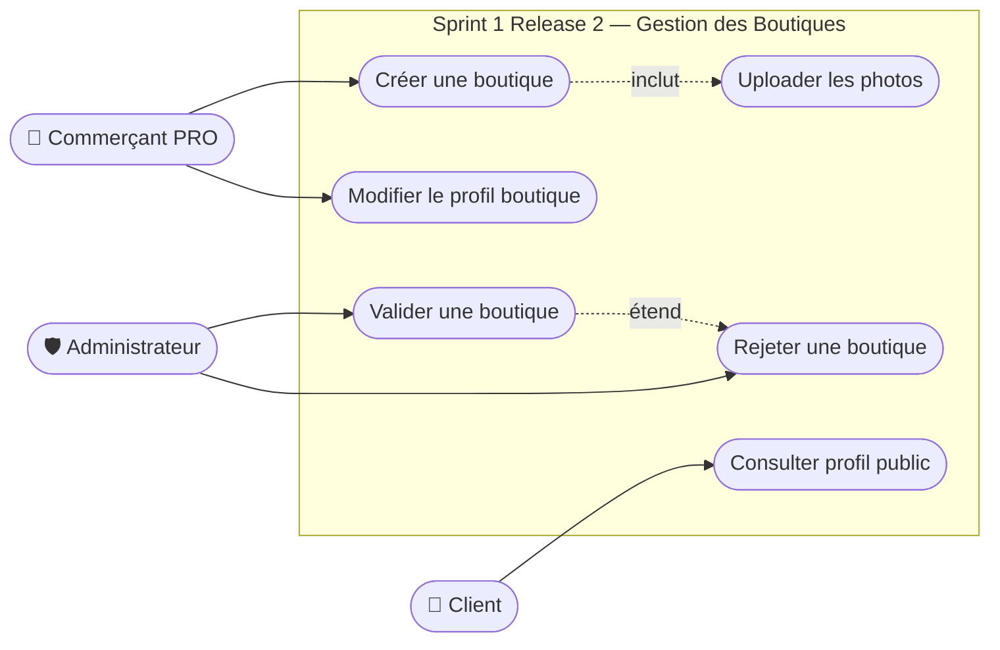
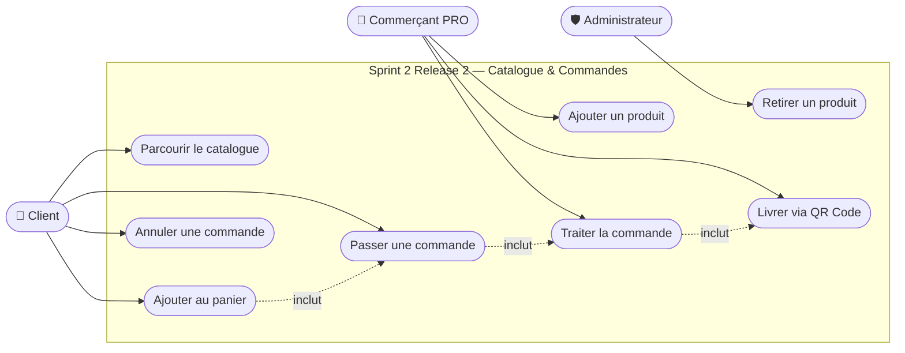
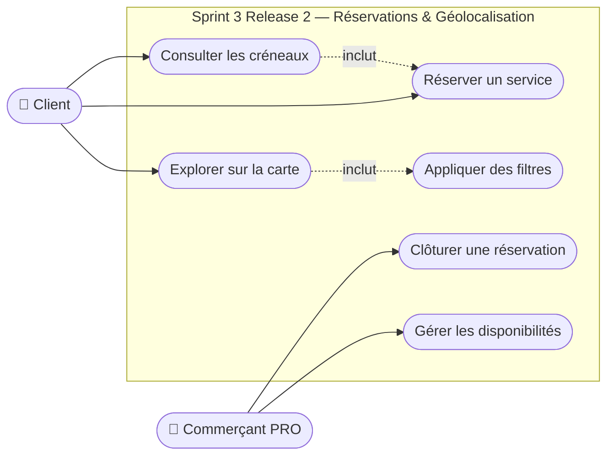
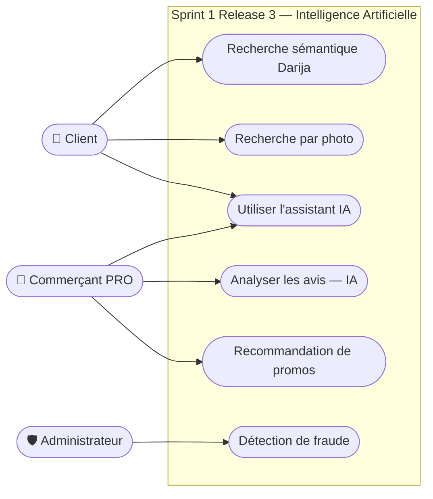
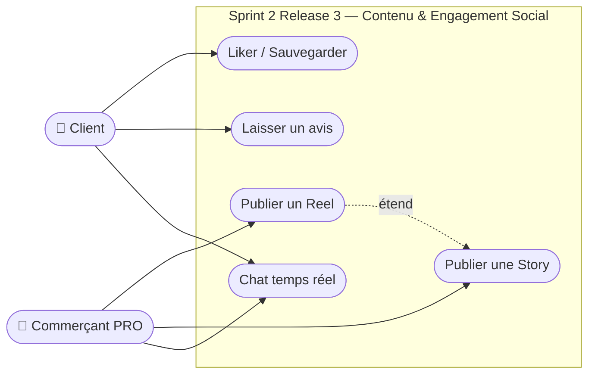
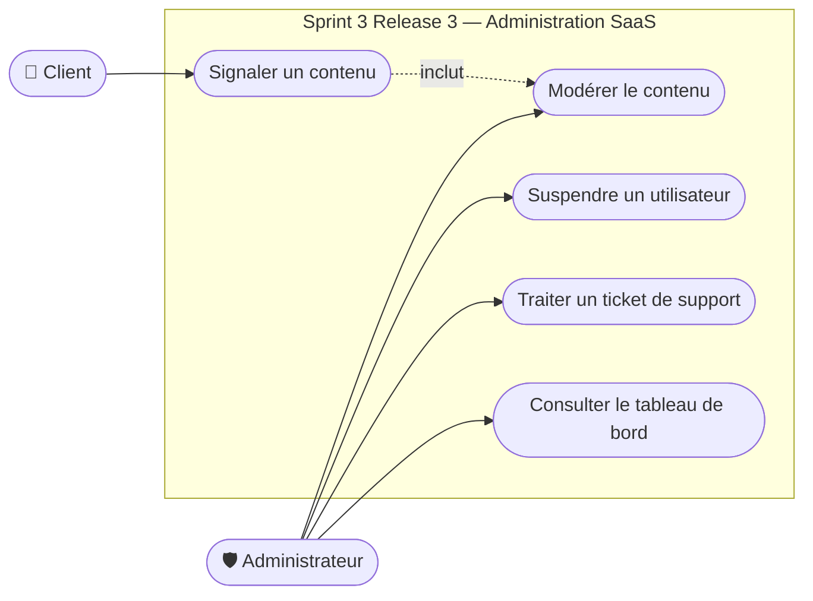

# DIAGRAMMES DE CAS D'UTILISATION — PLATEFORME RO2YA

---

## Diagramme de cas d'utilisation GLOBAL

*Figure : Diagramme de cas d'utilisation global de RO2YA*

---

## Diagramme de cas d'utilisation — Sprint 1, Release 1 (Authentification)

*Figure : Diagramme de cas d'utilisation — Sprint 1, Release 1*

---

## Diagramme de cas d'utilisation — Sprint 1, Release 2 (Gestion des Boutiques)

*Figure : Diagramme de cas d'utilisation — Sprint 1, Release 2*

---

## Diagramme de cas d'utilisation — Sprint 2, Release 2 (Catalogue & Commandes)

*Figure : Diagramme de cas d'utilisation — Sprint 2, Release 2*

---

## Diagramme de cas d'utilisation — Sprint 3, Release 2 (Réservations & Géolocalisation)

*Figure : Diagramme de cas d'utilisation — Sprint 3, Release 2*

---

## Diagramme de cas d'utilisation — Sprint 1, Release 3 (Intelligence Artificielle)

*Figure : Diagramme de cas d'utilisation — Sprint 1, Release 3*

---

## Diagramme de cas d'utilisation — Sprint 2, Release 3 (Contenu & Social)

*Figure : Diagramme de cas d'utilisation — Sprint 2, Release 3*

---

## Diagramme de cas d'utilisation — Sprint 3, Release 3 (Administration SaaS)

*Figure : Diagramme de cas d'utilisation — Sprint 3, Release 3*
