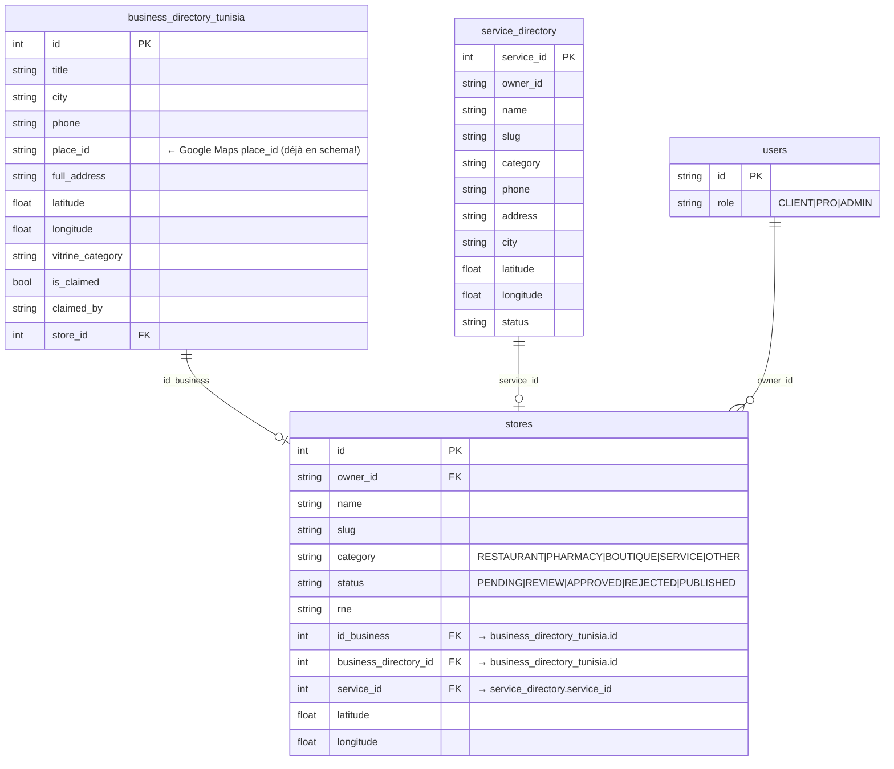
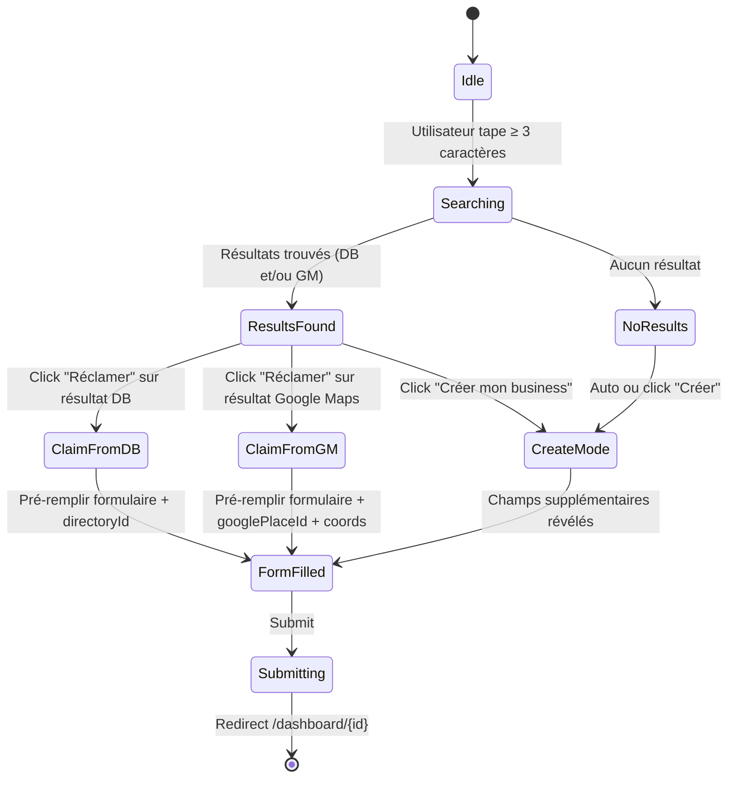
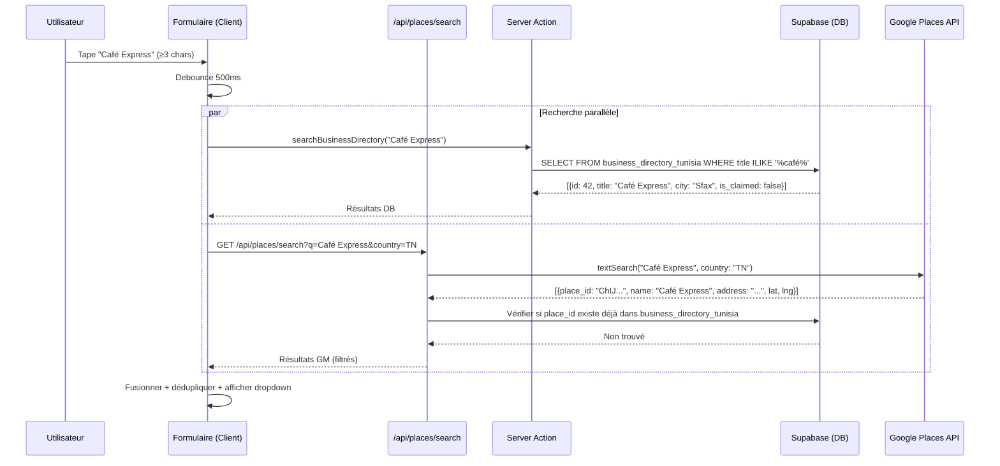
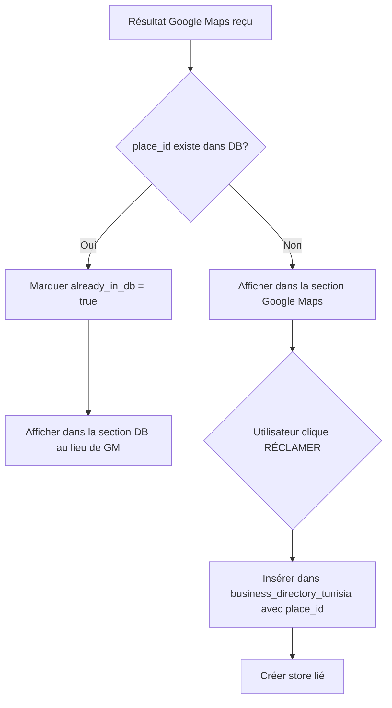
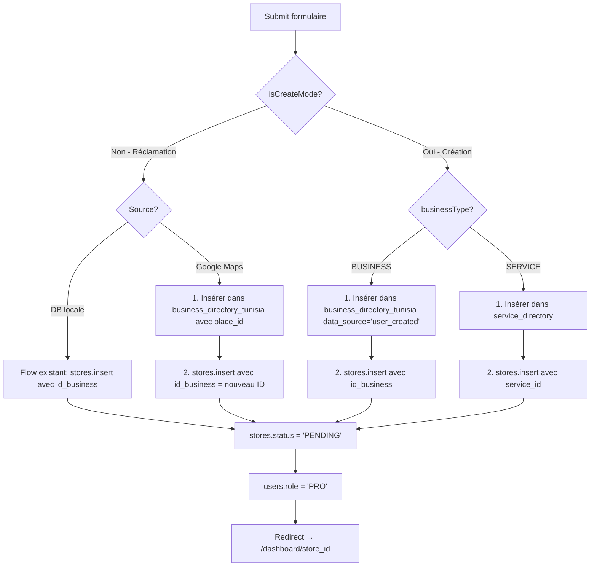

# Plan Technique — Formulaire Add Business avec Google Maps + Création Inline

## 1. Contexte et Architecture Existante

### Tables DB concernées



> [!NOTE]
> La table `business_directory_tunisia` possède **déjà** un champ `place_id` pour stocker l'ID Google Maps. Cela signifie qu'on peut éviter les doublons en vérifiant si un `place_id` Google existe déjà dans la DB.

### Formulaire actuel — [page.tsx](file:///c:/Users/INFOKOM/Desktop/private-PFE-repos/app/merchants/business/add/page.tsx)
- Recherche dans `business_directory_tunisia` uniquement (via `searchBusinessDirectory()`)
- Bouton "RÉCLAMER" si le business existe et n'est pas réclamé
- Bouton "Ajouter mon business" si rien trouvé → mais ne fait rien de spécial, omet juste la liaison
- Pas de recherche Google Maps
- Pas de distinction Business / Service

### Server Action actuelle — [addbuss.ts](file:///c:/Users/INFOKOM/Desktop/private-PFE-repos/lib/actions/addbuss.ts)
- `searchBusinessDirectory(query)` : cherche dans `business_directory_tunisia`
- `addBusiness(formData)` : insère dans `stores` avec `status: PENDING`

---

## 2. Architecture Cible

### Flux complet (machine d'état)



### Séquence de recherche



---

## 3. Fichiers à Modifier / Créer

### Vue d'ensemble

| Fichier | Action | Responsabilité |
|---------|--------|----------------|
| `.env.local` | MODIFIER | Ajouter `GOOGLE_PLACES_API_KEY` |
| `app/api/places/search/route.ts` | **CRÉER** | Proxy sécurisé Google Places API |
| `lib/actions/addbuss.ts` | MODIFIER | Ajouter `searchGooglePlaces()`, adapter `addBusiness()` |
| `app/merchants/business/add/page.tsx` | MODIFIER | Nouveau UI avec search multi-source + mode création |

---

## 4. Détail Technique par Fichier

### 4.1 `app/api/places/search/route.ts` [NOUVEAU]

**But** : Proxy côté serveur pour éviter d'exposer la clé API Google côté client.

```typescript
// Endpoint : GET /api/places/search?q=café+express&country=TN
// Headers: Content-Type: application/json

// Paramètres
interface PlacesSearchParams {
  q: string;        // Terme de recherche (min 3 chars)
  country?: string;  // Code pays ISO (default: "TN")
}

// Réponse
interface PlaceResult {
  place_id: string;
  name: string;
  formatted_address: string;
  lat: number;
  lng: number;
  phone?: string;
  rating?: number;
  types?: string[];      // ["restaurant", "food", ...]
  business_status?: string;
  already_in_db: boolean; // Vérifié via place_id dans business_directory_tunisia
}

// Logique interne
// 1. Valider le paramètre q (min 3 chars)
// 2. Appeler Google Places Text Search API
//    URL: https://maps.googleapis.com/maps/api/place/textsearch/json
//    Params: query=q, region=country, key=GOOGLE_PLACES_API_KEY
// 3. Pour chaque résultat, vérifier si place_id existe dans business_directory_tunisia
// 4. Retourner max 5 résultats avec already_in_db flag
// 5. Ajouter cache-control: max-age=300 (5 min cache navigateur)
```

**Sécurité** :
- La clé API reste côté serveur (`GOOGLE_PLACES_API_KEY`, pas `NEXT_PUBLIC_`)
- Rate limit via le debounce côté client (500ms)
- Limite à 5 résultats par requête

---

### 4.2 `lib/actions/addbuss.ts` [MODIFIER]

**Nouvelles fonctions :**

#### `searchUnified(query: string)`
```typescript
// Recherche dans les DEUX directories locales
// Retourne un tableau unifié avec le type d'origine

interface UnifiedSearchResult {
  source: 'business_directory' | 'service_directory';
  id: number;
  name: string;
  city: string;
  phone: string | null;
  address: string | null;
  category: string | null;
  is_claimed: boolean;
  place_id: string | null; // GM place_id si présent dans DB
}

// 1. Requête // sur business_directory_tunisia + service_directory
// 2. Fusionner les résultats
// 3. Retourner max 5 résultats
```

#### Modification de `addBusiness(formData)` — nouveaux paramètres

```typescript
// Nouveaux champs dans FormData :
// - businessType: 'BUSINESS' | 'SERVICE'
// - isCreateMode: 'true' | 'false'
// - googlePlaceId: string (optionnel — si réclamé depuis GM)
// - lat: string (optionnel)
// - lng: string (optionnel)
// - serviceDirectoryId: string (optionnel — si réclamé depuis service_directory)

// Logique mise à jour:

if (isCreateMode === 'true') {
  // → CRÉER dans la directory PUIS dans stores
  
  if (businessType === 'BUSINESS') {
    // 1. Insérer dans business_directory_tunisia
    const { data: dirEntry } = await supabase
      .from('business_directory_tunisia')
      .insert({
        title: name,
        city,
        phone,
        full_address: address,
        place_id: googlePlaceId || null,
        latitude: lat || null,
        longitude: lng || null,
        vitrine_category: category,
        is_claimed: true,
        claimed_by: user.id,
        data_source: 'user_created',
      })
      .select('id')
      .single();
    
    // 2. Insérer dans stores avec liaison
    directoryId = dirEntry.id;
    // → reste du flow existant mais avec id_business = dirEntry.id
    
  } else if (businessType === 'SERVICE') {
    // 1. Insérer dans service_directory
    const { data: serviceEntry } = await supabase
      .from('service_directory')
      .insert({
        name,
        slug: generateSlug(name),
        category,
        phone,
        address,
        city,
        owner_id: user.id,
        latitude: lat || 0,
        longitude: lng || 0,
        status: 'ACTIVE',
      })
      .select('service_id')
      .single();
    
    // 2. Insérer dans stores avec service_id
    // → service_id = serviceEntry.service_id, id_business = null
  }
  
} else if (googlePlaceId) {
  // → RÉCLAMER depuis Google Maps
  // 1. Chercher dans DB si place_id existe déjà
  // 2. Si oui → lier au store comme avant
  // 3. Si non → insérer dans business_directory_tunisia PUIS lier
  
} else {
  // → RÉCLAMER depuis DB (flow existant inchangé)
}
```

---

### 4.3 `app/merchants/business/add/page.tsx` [MODIFIER]

#### Nouvel état du composant

```typescript
// État existant conservé + nouveaux états :

const [businessType, setBusinessType] = useState<'BUSINESS' | 'SERVICE'>('BUSINESS');
const [isCreateMode, setIsCreateMode] = useState(false);

// Résultats de recherche multi-source
const [dbResults, setDbResults] = useState<UnifiedSearchResult[]>([]);
const [gmResults, setGmResults] = useState<PlaceResult[]>([]);

// Source sélectionnée
const [selectedSource, setSelectedSource] = useState<
  | { type: 'db'; data: UnifiedSearchResult }
  | { type: 'gm'; data: PlaceResult }
  | { type: 'new' }
  | null
>(null);

// Coordonnées (auto-remplies ou manuelles)
const [coordinates, setCoordinates] = useState({ lat: 0, lng: 0 });
```

#### Structure UI modifiée

```
┌─────────────────────────────────────────────────┐
│  Shop Info                                       │
│                                                  │
│  ┌─── Type ──────────────────────────────────┐  │
│  │  [🏪 Business]  [🔧 Service]             │  │  ← NOUVEAU: Toggle
│  └───────────────────────────────────────────┘  │
│                                                  │
│  Logo: [Browse]                                  │  ← Existant
│                                                  │
│  ┌─── Company Name ──── ┐  ┌── Email ────────┐ │
│  │ [Café Express     🔍] │  │ [email@...]     │ │
│  │ ┌─────────────────┐  │  └────────────────┘ │
│  │ │ 🗺️ Google Maps   │  │                    │  ← NOUVEAU: Section GM
│  │ │  Café Express    │  │                    │
│  │ │  Sfax  [RÉCLAMER]│  │                    │
│  │ ├─────────────────┤  │                    │
│  │ │ 🗄️ Base locale   │  │                    │  ← Existant amélioré
│  │ │  Café Express    │  │                    │
│  │ │  Sfax  [RÉCLAMÉ] │  │                    │
│  │ ├─────────────────┤  │                    │
│  │ │ ➕ Créer nouveau │  │                    │  ← NOUVEAU: Mode création
│  │ └─────────────────┘  │                    │
│  └──────────────────────┘                    │
│                                                  │
│  ┌── Phone ──────┐  ┌── Category ──────────┐   │  ← Existant
│  │ [+216...]     │  │ [Restaurant ▼]       │   │
│  └───────────────┘  └─────────────────────┘   │
│                                                  │
│  ┌── RNE * ──────────────────────────────────┐  │  ← Existant
│  │ [1234567A]                                │  │
│  └───────────────────────────────────────────┘  │
│                                                  │
│  ┌── Website ────────────────────────────────┐  │  ← Existant
│  │ 🌐 [https://...]                          │  │
│  └───────────────────────────────────────────┘  │
│                                                  │
│  ┌── Address ─────┐  ┌── Location ──────────┐  │  ← Existant
│  │ [Rue ...]      │  │ [Sfax ▼]            │  │
│  └────────────────┘  └─────────────────────┘  │
│                                                  │
│  ╔══════════════════════════════════════════════╗│
│  ║ 📍 Coordonnées (auto)                       ║│  ← NOUVEAU: Si mode
│  ║  Lat: 34.7405   Lng: 10.7603               ║│    création ou GM
│  ║  (pré-rempli par Google Maps)               ║│
│  ╚══════════════════════════════════════════════╝│
│                                                  │
│  ┌── Description ────────────────────────────┐  │  ← Existant
│  │ [Texte libre...]                          │  │
│  └───────────────────────────────────────────┘  │
│                                                  │
│          [Cancel]  [Save]                        │
└─────────────────────────────────────────────────┘
```

#### Logique de recherche debounced (modifiée)

```typescript
useEffect(() => {
  const debounce = setTimeout(async () => {
    if (formData.companyName.length < 3) {
      setDbResults([]); setGmResults([]); return;
    }
    
    setIsSearching(true);
    
    // Recherche parallèle DB + Google Maps
    const [dbRes, gmRes] = await Promise.all([
      searchUnified(formData.companyName),                    // Server Action
      fetch(`/api/places/search?q=${encodeURIComponent(formData.companyName)}&country=TN`)
        .then(r => r.json())
        .catch(() => [])
    ]);
    
    setDbResults(dbRes);
    setGmResults(gmRes.filter((g: PlaceResult) => !g.already_in_db)); // Filtrer doublons
    setIsSearching(false);
    setShowSuggestions(true);
  }, 500);
  
  return () => clearTimeout(debounce);
}, [formData.companyName]);
```

---

## 5. Gestion des doublons (GM ↔ DB)

Le champ `place_id` dans `business_directory_tunisia` permet d'éviter les doublons :



---

## 6. Soumission finale — Logique serveur



---

## 7. Environnement requis

```env
# .env.local — à ajouter
GOOGLE_PLACES_API_KEY=AIzaSy...  # Server-side only (pas NEXT_PUBLIC_)
```

> [!WARNING]
> **Pas de clé Google Maps trouvée** dans votre `.env.local` actuel. Il faut en créer une sur [Google Cloud Console](https://console.cloud.google.com/) avec l'API **Places** activée. Le quota gratuit est de $200/mois (~11 700 requêtes Text Search).

---

## 8. Estimation du travail

| Tâche | Complexité | Temps estimé |
|-------|------------|-------------|
| API Route `/api/places/search` | Faible | ~30 min |
| Modifier `addbuss.ts` (searchUnified + nouveau addBusiness) | Moyenne | ~45 min |
| Modifier `page.tsx` (UI multi-source + mode création) | Haute | ~1h30 |
| Tests et vérification | Moyenne | ~30 min |
| **Total** | | **~3h** |

---

## Open Questions

> [!IMPORTANT]
> 1. **Avez-vous une clé Google Maps API** ou dois-je vous guider pour en créer une ?
> 2. **Le RNE est-il obligatoire pour les Services** ? (Un `if` conditionnel suffirait)
> 3. **Faut-il afficher les photos** des résultats Google Maps dans le dropdown ? (Place Photos API = coût supplémentaire)
