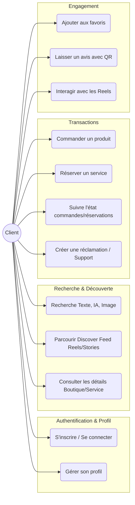
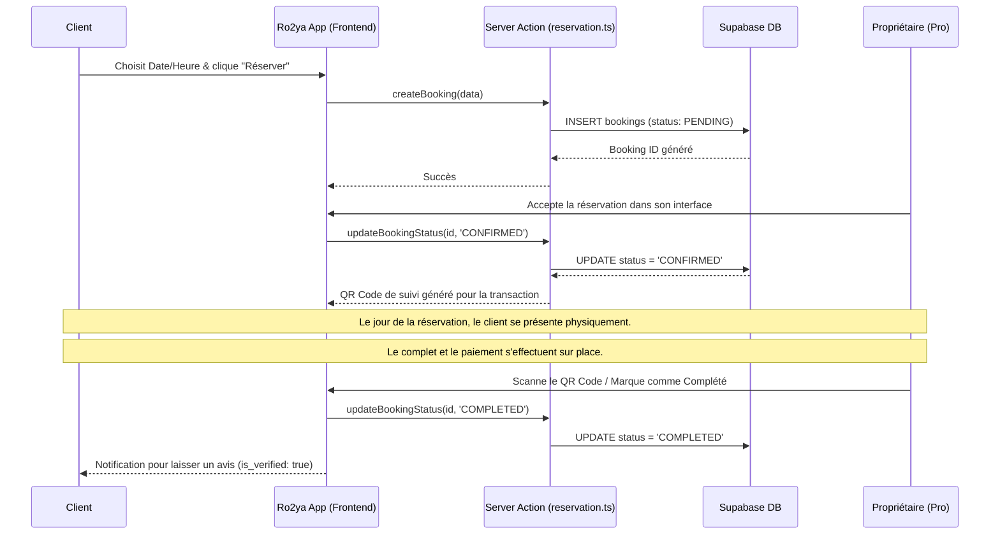
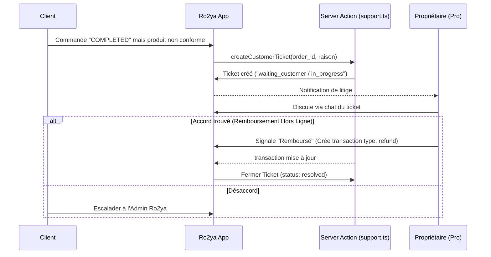

# Documentation Complète — Persona : Client (Ro2ya.tn)

Ce document décrit en détail l'expérience utilisateur, les flux métier, les endpoints (Server Actions) et l'architecture associés au profil **Client** sur la plateforme Ro2ya.tn.

---

## 1. Vue d'ensemble du rôle "Client"

Le "Client" (ou Utilisateur Final) est le consommateur qui utilise la plateforme pour découvrir des entreprises, acheter des produits (Products), réserver des services (Services), et interagir avec le contenu social (Stories, Reels).

### Objectifs Principaux :
- **Découvrir** de nouveaux commerces et services locaux via recherche sémantique, image ou texte.
- **S'engager** avec le contenu (Likes, favoris, commentaires, avis).
- **Consommer** en passant des commandes (produits) ou en effectuant des réservations (services).
- **Gérer** son historique de commandes, réservations, favoris et préférences depuis son profil.

---

## 2. Diagramme des Cas d'Utilisation (Use Cases)

---

## 3. User Stories (Histoires Utilisateur)

### 3.1 Découverte & Recherche
- **En tant que client**, je veux pouvoir *rechercher* un service ou un produit en utilisant un langage naturel (sémantique) ou une image pour *trouver exactement ce dont j'ai besoin rapidement*.
- **En tant que client**, je veux *visionner un flux infini de Reels et de Stories (Discover Feed)* pour *m'inspirer et découvrir de nouvelles entreprises de manière engageante*.
- **En tant que client**, je veux consulter la *fiche descriptive complète* d'une boutique (horaires, localisation, services, produits) pour *obtenir toutes les informations nécessaires avant d'acheter*.

### 3.2 Achats & Réservations
- **En tant que client**, je veux pouvoir *réserver un créneau pour un service* directement depuis l'application pour *m'assurer de ma place sans avoir à téléphoner*.
- **En tant que client**, je veux pouvoir *passer une commande de produit* avec mes informations de livraison pour *l'acheter facilement*.
- **En tant que client**, je veux pouvoir *suivre le statut de mes commandes et réservations* (En attente, Validé, Complété) dans mon espace personnel.

### 3.3 Engagement Social & Confiance
- **En tant que client**, je veux pouvoir *enregistrer une boutique dans mes favoris* pour la *retrouver rapidement plus tard*.
- **En tant que client**, je veux pouvoir *laisser un avis avec une note* après avoir scanné un QR Code (confirmant mon achat) pour *aider la communauté et donner mon feedback*.
- **En tant que client**, je veux pouvoir *signaler un problème (Ticket de support)* si ma commande n'a pas été honorée comme prévu.

---

## 4. Endpoints des Server Actions (Côté Backend)

L'application Next.js interagit avec Supabase principalement via des fonctions exposées sous forme de **Server Actions** (`use server`).

| Fonctionnalité | Action / Endpoint | Fichier Source | Description |
|-----------------|-------------------|----------------|-------------|
| **Authentification** | `login`, `signup`, `...MagicLink`| `lib/actions/auth.ts` | Gère les sessions utilisateurs et la création de compte. |
| **Recherche** | `searchStores()`, `searchItems()` | `lib/actions/search_...` | Requêtes textuelles sur les magasins et articles. |
| | `searchSemantic()`, `searchImage()` | `app/api/...` | Endpoints API pour la recherche propulsée par l'IA. |
| **Découverte** | `getPersonalizedReels()`, `getDiscoverStories()`| `lib/actions/recommendations.ts`, `stories.ts` | Charge le flux de contenu personnalisé du client. |
| **Boutique** | `getBusinessById()`, `getPublicItemsByStoreId()`| `lib/actions/business.ts`, `items.ts` | Récupère les données publiques d'un store et son catalogue. |
| **Transactions/Commandes**| `createOrder()`, `getUserOrders()`| `lib/actions/orders.ts`| Crée la commande "PENDING" et retourne l'historique du client. |
| **Réservations (Bookings)** | `createBooking()`, `getUserBookings()`| `lib/actions/reservation.ts` | Crée la réservation "PENDING" avec le slot choisi. |
| **Favoris (Saves)** | `toggleSaveAction()`, `getUserSavedPlaces()`| `lib/actions/favorites.ts` | Permet d'ajouter ou retirer une boutique des favoris. |
| **Avis (Reviews)** | `submitReview()`, `getServiceReviews()`| `lib/actions/reviews.ts` | Ajoute un commentaire/note (vérifié par token QR). |
| **Support / Réclamations**| `createCustomerTicket()`, `addTicketMessage()`| `lib/actions/support.ts` | Gère le litige ou la discussion entre Client-Support-Owner. |

---

## 5. Exemples de Flux Système (Sequence Diagrams)

### 5.1 Flux de Réservation & Complétion (Pas de paiement in-app)

### 5.2 Flux du Support (Remboursement / Disparité)

---

## 6. Structure des Données (Contexte Client)

Voici les attributs clés du client enregistrés en base.

### Table `users` (Role: CLIENT)
- `id` : UUID Supabase (Auth tied).
- `full_name`, `email`, `phone`, `avatar_url` : Coordonnées publiques.
- `role` : Typiquement `CLIENT`. S'il souhaite ajouter sa boutique, il devient `PRO` via l'interface `Add Business`.

### Table `user_activity`
Stocke comment l'utilisateur parcourt l'application, alimente l'algorithme des Reels !
- `user_id` / `session_id` (pour visiteurs anonymes).
- `entity_id` (ID du Reel, Produit, ou Store).
- `activity_type` (VIEW, LIKE, SHARE, SKIP, DWELL_TIME).

## 7. Considérations UX pour le Client

> [!TIP]
> **Pas de paiement en ligne (actuellement) :** L'interface doit communiquer clairement que la validation finale (et le paiement) se fait sur place (Paiement à la Livraison, en Espèces ou Check).

> [!IMPORTANT]
> **Réclamations :** Étant donné qu'il n'y a pas la fonction de reversement d'argent in-app (refund classique de gateway), le processus repose sur une forte communication et sur le système de "Tickets Support". L'UI Client du tableau de bord "Mes Commandes" affiche fièrement la messagerie avec le propriétaire ou le lien "Signaler un problème".

> [!NOTE]
> **Graphe de Découverte :** Le client trouvera principalement des produits et services via le **Discover Feed** ou **Map**. L'expérience mobile-first (les Reels à la TikTok) est primordiale pour la rétention.
